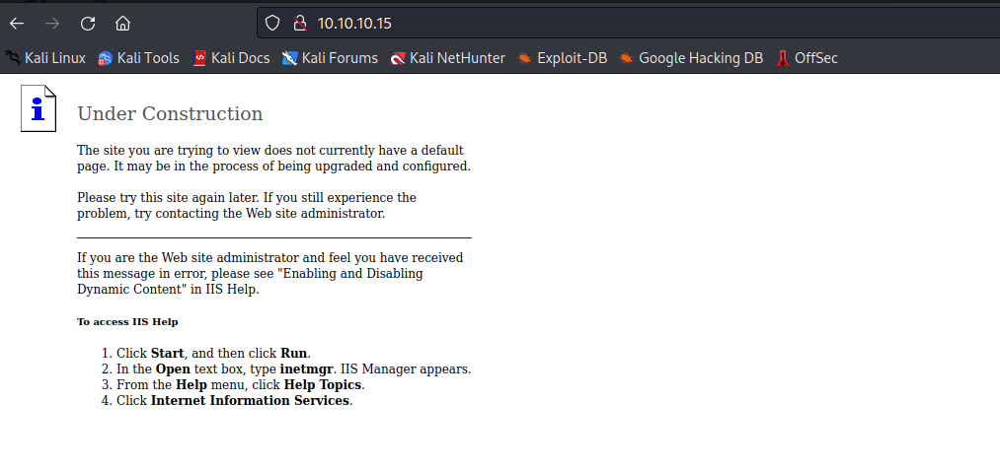
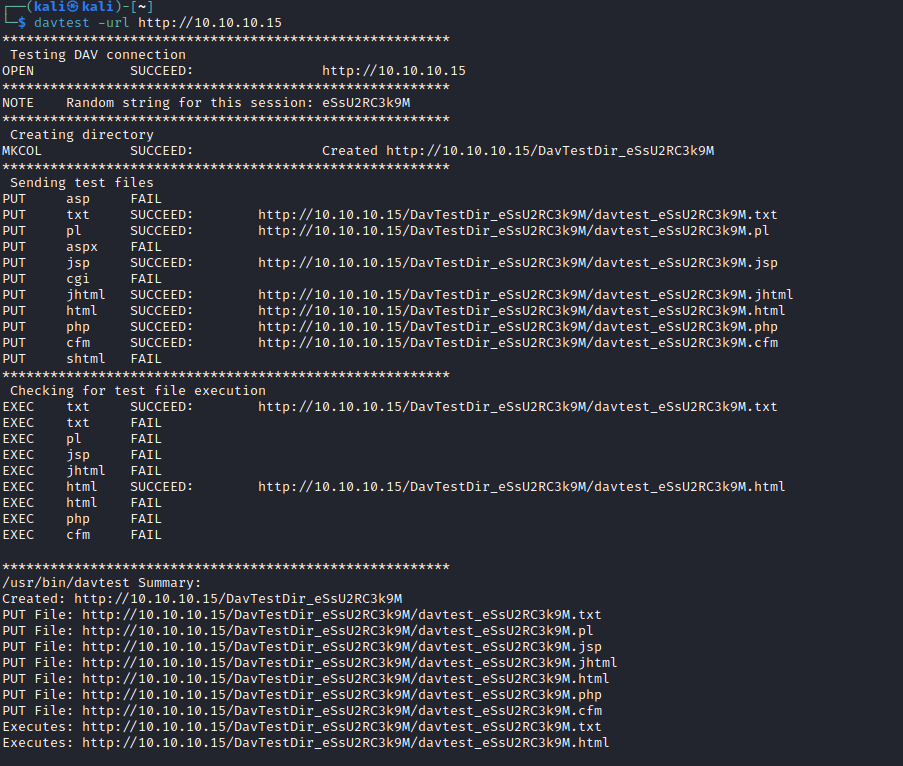
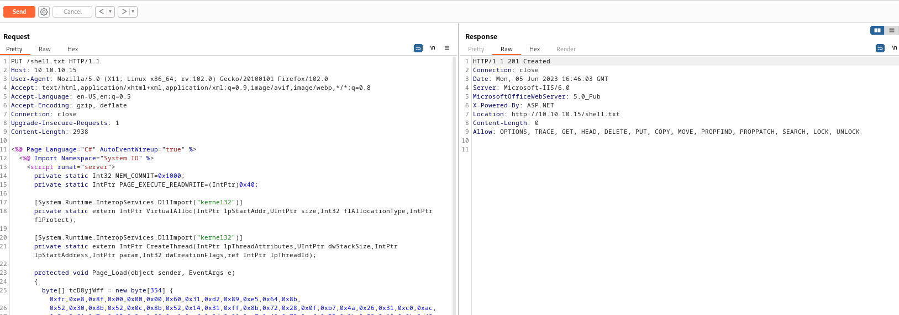
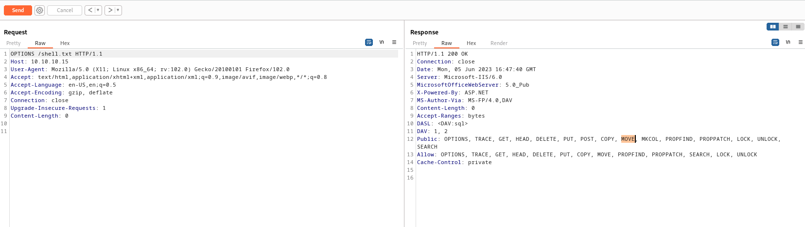
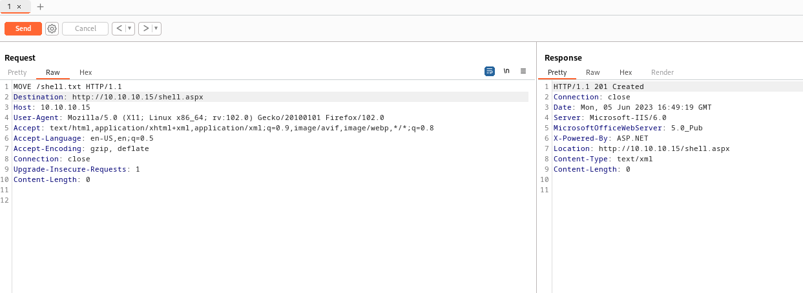
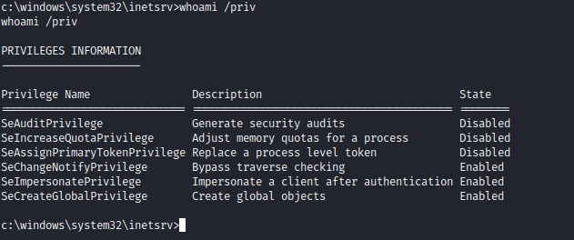

# Granny
## Enumeration
- ```Nmap```
```
└─$ nmap -sC -sV -Pn 10.10.10.15
Starting Nmap 7.93 ( https://nmap.org ) at 2023-06-04 18:54 BST
Nmap scan report for 10.10.10.15 (10.10.10.15)
Host is up (0.11s latency).
Not shown: 999 filtered tcp ports (no-response)
PORT   STATE SERVICE VERSION
80/tcp open  http    Microsoft IIS httpd 6.0
|_http-server-header: Microsoft-IIS/6.0
| http-methods: 
|_  Potentially risky methods: TRACE DELETE COPY MOVE PROPFIND PROPPATCH SEARCH MKCOL LOCK UNLOCK PUT
| http-webdav-scan: 
|   Server Date: Sun, 04 Jun 2023 17:54:19 GMT
|   Allowed Methods: OPTIONS, TRACE, GET, HEAD, DELETE, COPY, MOVE, PROPFIND, PROPPATCH, SEARCH, MKCOL, LOCK, UNLOCK
|   Server Type: Microsoft-IIS/6.0
|   WebDAV type: Unknown
|_  Public Options: OPTIONS, TRACE, GET, HEAD, DELETE, PUT, POST, COPY, MOVE, MKCOL, PROPFIND, PROPPATCH, LOCK, UNLOCK, SEARCH
|_http-title: Under Construction
Service Info: OS: Windows; CPE: cpe:/o:microsoft:windows

Service detection performed. Please report any incorrect results at https://nmap.org/submit/ .
Nmap done: 1 IP address (1 host up) scanned in 29.38 seconds
```
- `gobuster`
```
┌──(kali㉿kali)-[~]
└─$ gobuster dir -u http://10.10.10.15/ -w /usr/share/seclists/Discovery/Web-Content/raft-medium-files-lowercase.txt
===============================================================
Gobuster v3.5
by OJ Reeves (@TheColonial) & Christian Mehlmauer (@firefart)
===============================================================
[+] Url:                     http://10.10.10.15/
[+] Method:                  GET
[+] Threads:                 10
[+] Wordlist:                /usr/share/seclists/Discovery/Web-Content/raft-medium-files-lowercase.txt
[+] Negative Status codes:   404
[+] User Agent:              gobuster/3.5
[+] Timeout:                 10s
===============================================================
2023/06/05 17:09:30 Starting gobuster in directory enumeration mode
===============================================================
/_vti_inf.html        (Status: 200) [Size: 1754]
/postinfo.html        (Status: 200) [Size: 2440]
/.                    (Status: 200) [Size: 1433]
/pagerror.gif         (Status: 200) [Size: 2806]
/iisstart.htm         (Status: 200) [Size: 1433]
Progress: 16223 / 16245 (99.86%)
===============================================================
2023/06/05 17:12:38 Finished
===============================================================
```
- Looks similar to `Grandpa`



- Yet we have success with `davtest`


## Foothold
- Let's try creating file manually
  - Launch `Burp Suite`
  - And as we can see, we can create files


- Since it's `Microsoft-IIS/6.0` server, we need `asp/aspx` extension for our shell payload
  - We can use either `webshell` or `reverse shell`
  - I created payload using `msfvenom`


- Create a `shell.txt` file on the server
  - And check if it was successful



- Prepare `multi/handler`


- Let's check other `HTTP` methods



- `MOVE` looks interesting
  - Let's google it


- So we can see how we can use it in our case
  - `MOVE shell.txt` to `shell.aspx`
  - Start `multi/handler`




- We have a shell


## Root
- Since this box was similar to `Grandpa` the privesc path are also identical


- You can abuse `SeImpersonatePrivileges`



- Or run `exploit suggester` and run suggested exploits


