# Heist
## Enumeration
- `nmap`
```
└─$ nmap -sC -sV -Pn 10.10.10.149
Starting Nmap 7.93 ( https://nmap.org ) at 2023-06-24 10:40 BST
Nmap scan report for 10.10.10.149 (10.10.10.149)
Host is up (0.10s latency).
Not shown: 997 filtered tcp ports (no-response)
PORT    STATE SERVICE       VERSION
80/tcp  open  http          Microsoft IIS httpd 10.0
|_http-server-header: Microsoft-IIS/10.0
| http-title: Support Login Page
|_Requested resource was login.php
| http-cookie-flags: 
|   /: 
|     PHPSESSID: 
|_      httponly flag not set
| http-methods: 
|_  Potentially risky methods: TRACE
135/tcp open  msrpc         Microsoft Windows RPC
445/tcp open  microsoft-ds?
Service Info: OS: Windows; CPE: cpe:/o:microsoft:windows

Host script results:
|_clock-skew: -30s
| smb2-time: 
|   date: 2023-06-24T09:40:31
|_  start_date: N/A
| smb2-security-mode: 
|   311: 
|_    Message signing enabled but not required

Service detection performed. Please report any incorrect results at https://nmap.org/submit/ .
Nmap done: 1 IP address (1 host up) scanned in 63.50 seconds
```
- `gobuster`
```
└─$ gobuster dir -u http://10.10.10.149 -w /usr/share/seclists/Discovery/Web-Content/directory-list-2.3-medium.txt -t 50 -x asp,aspx,php
===============================================================
Gobuster v3.5
by OJ Reeves (@TheColonial) & Christian Mehlmauer (@firefart)
===============================================================
[+] Url:                     http://10.10.10.149
[+] Method:                  GET
[+] Threads:                 50
[+] Wordlist:                /usr/share/seclists/Discovery/Web-Content/directory-list-2.3-medium.txt
[+] Negative Status codes:   404
[+] User Agent:              gobuster/3.5
[+] Extensions:              asp,aspx,php
[+] Timeout:                 10s
===============================================================
2023/06/24 11:12:31 Starting gobuster in directory enumeration mode
===============================================================
/images               (Status: 301) [Size: 150] [--> http://10.10.10.149/images/]
/index.php            (Status: 302) [Size: 0] [--> login.php]
/login.php            (Status: 200) [Size: 2058]
/Images               (Status: 301) [Size: 150] [--> http://10.10.10.149/Images/]
/issues.php           (Status: 302) [Size: 16] [--> login.php]
/css                  (Status: 301) [Size: 147] [--> http://10.10.10.149/css/]
/Index.php            (Status: 302) [Size: 0] [--> login.php]
/Login.php            (Status: 200) [Size: 2058]
/js                   (Status: 301) [Size: 146] [--> http://10.10.10.149/js/]
/Issues.php           (Status: 302) [Size: 16] [--> login.php]
/attachments          (Status: 301) [Size: 155] [--> http://10.10.10.149/attachments/]
/IMAGES               (Status: 301) [Size: 150] [--> http://10.10.10.149/IMAGES/]
/INDEX.php            (Status: 302) [Size: 0] [--> login.php]
/CSS                  (Status: 301) [Size: 147] [--> http://10.10.10.149/CSS/]
/JS                   (Status: 301) [Size: 146] [--> http://10.10.10.149/JS/]
/Attachments          (Status: 301) [Size: 155] [--> http://10.10.10.149/Attachments/]
/LogIn.php            (Status: 200) [Size: 2058]
/LOGIN.php            (Status: 200) [Size: 2058]
Progress: 882180 / 882244 (99.99%)
===============================================================
2023/06/24 11:59:05 Finished
===============================================================
```

- Web server

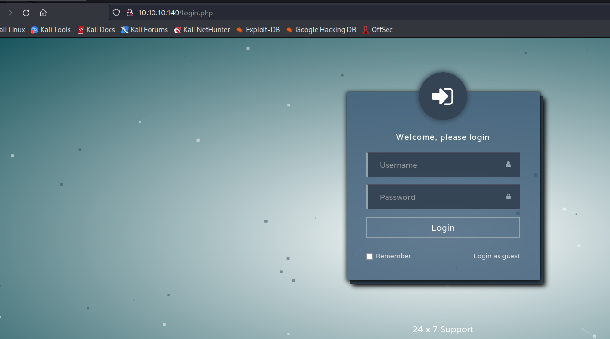

- If we click `Login as guest`


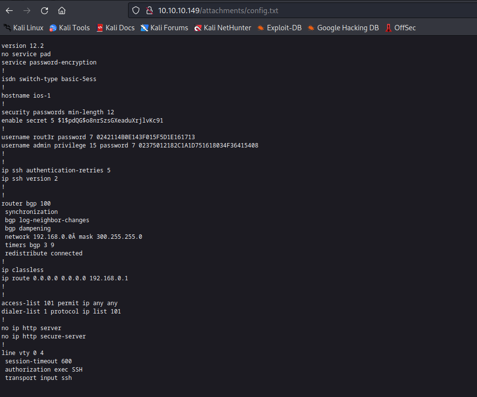

## Foothold
- Let's open the attachment


- Now we have 3 possible usernames: `hazard`, `rout3r`, `admin`
  - And 3 passwords, which we need to decrypt
  - Using the [online decoder](https://www.firewall.cx/cisco-technical-knowledgebase/cisco-routers/358-cisco-type7-password-crack.html) resulted in: `$uperP@ssword`, `Q4)sJu\Y8qz*A3?d`
  - And the `john`: `stealth1agent`

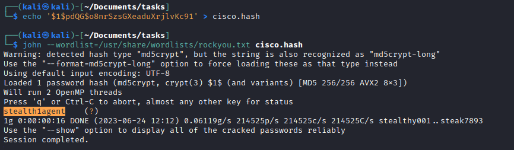

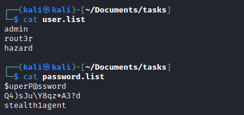

- Let's use `crackmapexec` to find a correct combination

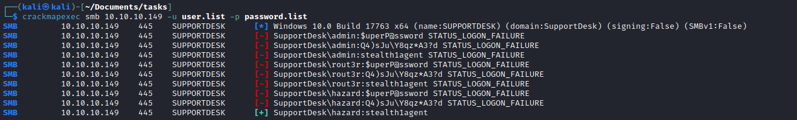

- Okay we have creds
  - But they seem to work only for `smb`
  - Let's see if there are any other users on the box
  - `impacket-lookupsid hazard:stealth1agent@10.10.10.149`

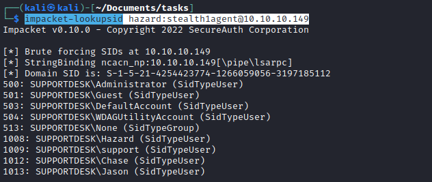

- We now have 3 additional users: `Chase`, `Jason` and `support`
  - Let's run `crackmapexec` again just in case

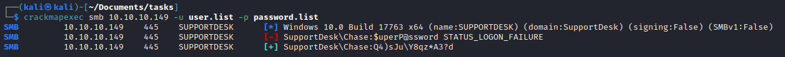

- Use the creds launch `evil-winrm`


## Root
- Let's enumerate for privesc
  - Tried `Lazagne`, but no results


- Checked installed programs
  - We see `Firefox`
  - Let's check if it's running

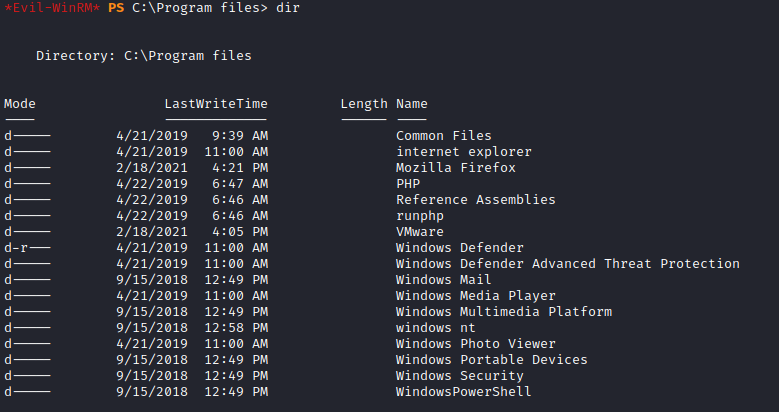

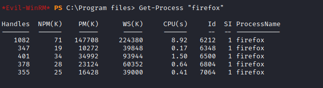

- During enumeration process with `gobuster` that we have `login.php`
  - Let's check that file located in `c:\inetpub\wwwroot`
  - We see that the password hash is hardcoded
  - We see the params that we can use to grep from memory dump (we could also send a request and check params from the browser or proxy)


- We can use [procdump64](https://live.sysinternals.com/) to dump the `firefox` memory
  - Or [mimikittenz](https://github.com/orlyjamie/mimikittenz)
  - Or [Out-Minidump from Powersploit](https://github.com/PowerShellMafia/PowerSploit/blob/master/Exfiltration/Out-Minidump.ps1)
  - Let's grep the parameters from the memory dump

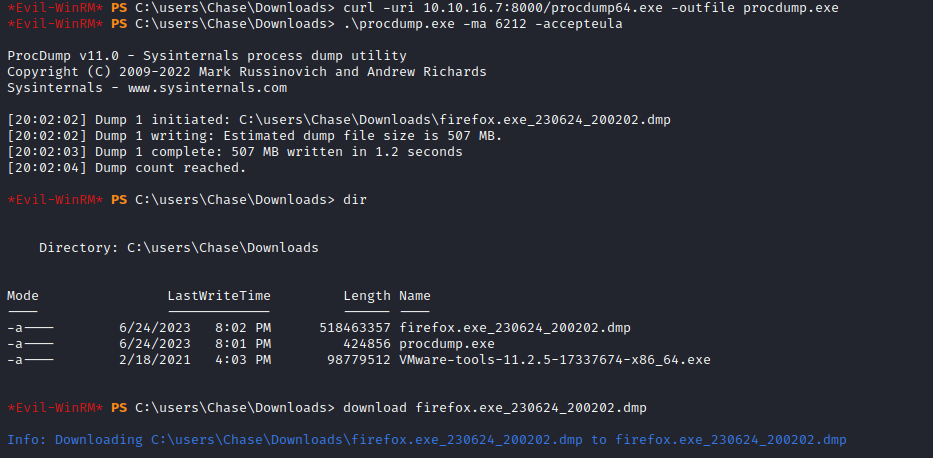


- We got password for administrator
  - Use `evil-winrm`
  - Rooted

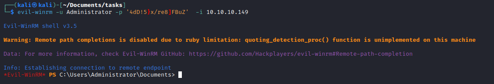
