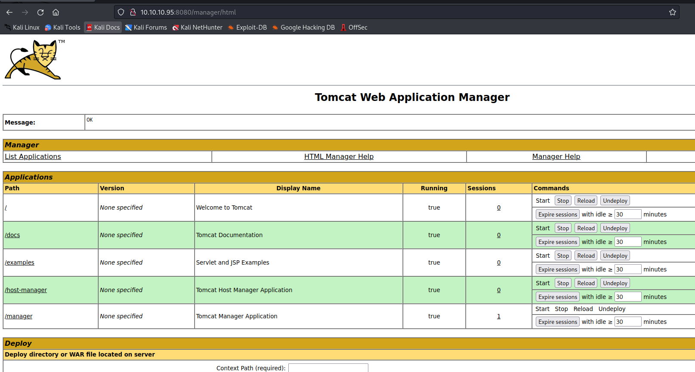
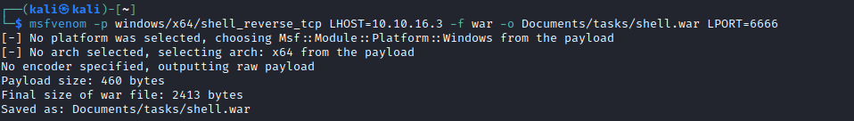
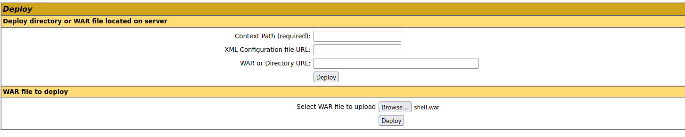
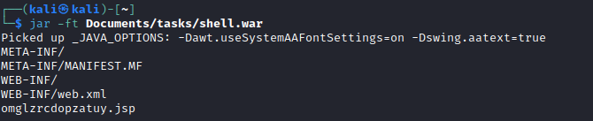
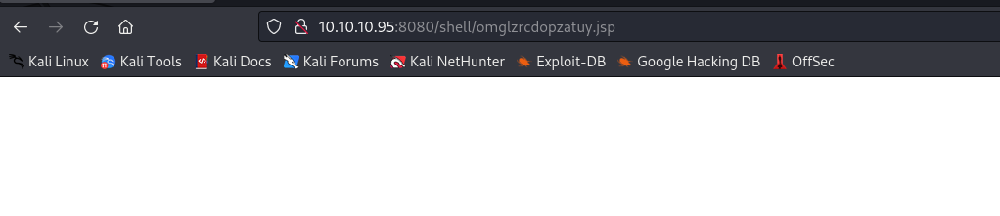

# Jerry
## Enumeration
- `nmap`
```
└─$ nmap -sC -sV -Pn 10.10.10.95
Starting Nmap 7.93 ( https://nmap.org ) at 2023-06-11 12:02 BST
Nmap scan report for 10.10.10.95 (10.10.10.95)
Host is up (0.093s latency).
Not shown: 999 filtered tcp ports (no-response)
PORT     STATE SERVICE VERSION
8080/tcp open  http    Apache Tomcat/Coyote JSP engine 1.1
|_http-open-proxy: Proxy might be redirecting requests
|_http-favicon: Apache Tomcat
|_http-server-header: Apache-Coyote/1.1
|_http-title: Apache Tomcat/7.0.88

Service detection performed. Please report any incorrect results at https://nmap.org/submit/ .
Nmap done: 1 IP address (1 host up) scanned in 26.11 seconds
```
- Web Server


## Foothold/User/Root
- Let's try default creds for `Tomcat's Manager Application`
  - `tomcat:s3cret`
  - Success



- Now we can deploy our app
  - Generate payload using `msvenom` with externsion `war`
  - Upload it





- Let's find the `jsp` page generated by `msfvenom`



- Open the `path`



- And we get our `root`


