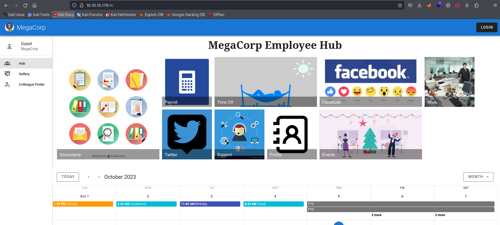

# Multimaster
## Enumeration
- `nmap`
```
└─$ nmap -Pn -p- 10.10.10.179 --min-rate 10000
Starting Nmap 7.94 ( https://nmap.org ) at 2023-10-08 19:46 BST
Nmap scan report for 10.10.10.179 (10.10.10.179)
Host is up (0.13s latency).
Not shown: 65516 filtered tcp ports (no-response)
PORT      STATE SERVICE
53/tcp    open  domain
80/tcp    open  http
88/tcp    open  kerberos-sec
135/tcp   open  msrpc
139/tcp   open  netbios-ssn
389/tcp   open  ldap
445/tcp   open  microsoft-ds
593/tcp   open  http-rpc-epmap
636/tcp   open  ldapssl
3268/tcp  open  globalcatLDAP
3269/tcp  open  globalcatLDAPssl
3389/tcp  open  ms-wbt-server
5985/tcp  open  wsman
49666/tcp open  unknown
49667/tcp open  unknown
49674/tcp open  unknown
49675/tcp open  unknown
49678/tcp open  unknown
49698/tcp open  unknown

Nmap done: 1 IP address (1 host up) scanned in 45.14 seconds
```
```
└─$ nmap -Pn -p53,80,88,135,139,389,445,464,593,636,3268,3269,5985,9389 -sC -sV 10.10.10.179 --min-rate 10000
Starting Nmap 7.94 ( https://nmap.org ) at 2023-10-08 19:46 BST
Nmap scan report for 10.10.10.179 (10.10.10.179)
Host is up (0.56s latency).

PORT     STATE SERVICE      VERSION
53/tcp   open  domain       Simple DNS Plus
80/tcp   open  http         Microsoft IIS httpd 10.0
| http-methods: 
|_  Potentially risky methods: TRACE
|_http-title: 403 - Forbidden: Access is denied.
|_http-server-header: Microsoft-IIS/10.0
88/tcp   open  kerberos-sec Microsoft Windows Kerberos (server time: 2023-10-08 18:52:31Z)
135/tcp  open  msrpc        Microsoft Windows RPC
139/tcp  open  netbios-ssn  Microsoft Windows netbios-ssn
389/tcp  open  ldap         Microsoft Windows Active Directory LDAP (Domain: MEGACORP.LOCAL, Site: Default-First-Site-Name)
445/tcp  open               Windows Server 2016 Standard 14393 microsoft-ds (workgroup: MEGACORP)
464/tcp  open  kpasswd5?
593/tcp  open  ncacn_http   Microsoft Windows RPC over HTTP 1.0
636/tcp  open  tcpwrapped
3268/tcp open  ldap         Microsoft Windows Active Directory LDAP (Domain: MEGACORP.LOCAL, Site: Default-First-Site-Name)
3269/tcp open  tcpwrapped
5985/tcp open  http         Microsoft HTTPAPI httpd 2.0 (SSDP/UPnP)
|_http-server-header: Microsoft-HTTPAPI/2.0
|_http-title: Not Found
9389/tcp open  mc-nmf       .NET Message Framing
Service Info: Host: MULTIMASTER; OS: Windows; CPE: cpe:/o:microsoft:windows

Host script results:
|_clock-skew: mean: 2h26m16s, deviation: 4h02m30s, median: 6m16s
| smb-security-mode: 
|   account_used: <blank>
|   authentication_level: user
|   challenge_response: supported
|_  message_signing: required
| smb2-time: 
|   date: 2023-10-08T18:52:41
|_  start_date: 2023-10-08T18:50:58
| smb-os-discovery: 
|   OS: Windows Server 2016 Standard 14393 (Windows Server 2016 Standard 6.3)
|   Computer name: MULTIMASTER
|   NetBIOS computer name: MULTIMASTER\x00
|   Domain name: MEGACORP.LOCAL
|   Forest name: MEGACORP.LOCAL
|   FQDN: MULTIMASTER.MEGACORP.LOCAL
|_  System time: 2023-10-08T11:52:40-07:00
| smb2-security-mode: 
|   3:1:1: 
|_    Message signing enabled and required

Service detection performed. Please report any incorrect results at https://nmap.org/submit/ .
Nmap done: 1 IP address (1 host up) scanned in 59.26 seconds
```

- `smb`
```
└─$ smbclient -N -L //10.10.10.179                            
Anonymous login successful

        Sharename       Type      Comment
        ---------       ----      -------
Reconnecting with SMB1 for workgroup listing.
do_connect: Connection to 10.10.10.179 failed (Error NT_STATUS_RESOURCE_NAME_NOT_FOUND)
Unable to connect with SMB1 -- no workgroup available
```

- Web Server



- `gobuster`
  - `WAF` is probably blocking requests
```
└─$ gobuster dir -u http://10.10.10.179 -w /usr/share/wordlists/dirbuster/directory-list-lowercase-2.3-small.txt -t 50  -x asp,aspx,txt   
===============================================================
Gobuster v3.6
by OJ Reeves (@TheColonial) & Christian Mehlmauer (@firefart)
===============================================================
[+] Url:                     http://10.10.10.179
[+] Method:                  GET
[+] Threads:                 50
[+] Wordlist:                /usr/share/wordlists/dirbuster/directory-list-lowercase-2.3-small.txt
[+] Negative Status codes:   404
[+] User Agent:              gobuster/3.6
[+] Extensions:              asp,aspx,txt
[+] Timeout:                 10s
===============================================================
Starting gobuster in directory enumeration mode
===============================================================
/images               (Status: 301) [Size: 150] [--> http://10.10.10.179/images/]
/contact.asp          (Status: 403) [Size: 1233]
/full.asp             (Status: 403) [Size: 1233]
/full.txt             (Status: 403) [Size: 1233]
/full                 (Status: 403) [Size: 1233]
/12.asp               (Status: 403) [Size: 1233]
/2006                 (Status: 403) [Size: 1233]
/12.aspx              (Status: 403) [Size: 1233]
/full.aspx            (Status: 403) [Size: 1233]
...
```

## Foothold
- We have bunch of potential usernames


- Let's open `Burp` and test for `sqli`
  - If send special char, I receive `403`
  - I also tested for `nosqli`, but received `500`


- Let's fuzz for special chars
```
└─$ wfuzz -c -u http://10.10.10.179/api/getColleagues -w /usr/share/seclists/Fuzzing/special-chars.txt -d '{"name":"FUZZ"}' -H 'Content-Type: application/json;charset=utf-8'     
 /usr/lib/python3/dist-packages/wfuzz/__init__.py:34: UserWarning:Pycurl is not compiled against Openssl. Wfuzz might not work correctly when fuzzing SSL sites. Check Wfuzz's documentation for more information.
********************************************************
* Wfuzz 3.1.0 - The Web Fuzzer                         *
********************************************************

Target: http://10.10.10.179/api/getColleagues
Total requests: 32

=====================================================================
ID           Response   Lines    Word       Chars       Payload                                                                                                                                                                    
=====================================================================

000000001:   200        0 L      1 W        2 Ch        "~"
000000029:   403        29 L     92 W       1233 Ch     "'"
000000028:   403        29 L     92 W       1233 Ch     ":"
000000032:   403        29 L     92 W       1233 Ch     ">"
000000030:   403        29 L     92 W       1233 Ch     """
000000003:   200        0 L      1 W        2 Ch        "@"
000000015:   200        0 L      1 W        2 Ch        "="
000000007:   200        0 L      1 W        2 Ch        "^"
000000031:   200        0 L      1 W        2 Ch        "<"
000000014:   200        0 L      1 W        2 Ch        "+"
000000027:   200        0 L      1 W        2 Ch        ";"
000000026:   200        0 L      1 W        2 Ch        "?"
000000025:   200        0 L      1 W        2 Ch        "/"
000000024:   200        0 L      1 W        2 Ch        "."
000000023:   200        0 L      1 W        2 Ch        ","
000000022:   200        0 L      1 W        2 Ch        "`"
000000021:   500        0 L      4 W        36 Ch       "\"
000000018:   200        0 L      1 W        2 Ch        "]"
000000006:   403        29 L     92 W       1233 Ch     "%"
000000019:   200        0 L      1 W        2 Ch        "["
000000017:   200        0 L      1 W        2 Ch        "}"
000000016:   200        0 L      1 W        2 Ch        "{"
000000013:   200        0 L      33 W       1821 Ch     "_"
000000011:   200        0 L      1 W        2 Ch        ")"
000000010:   200        0 L      1 W        2 Ch        "("
000000009:   200        0 L      1 W        2 Ch        "*"
000000020:   200        0 L      1 W        2 Ch        "|"
000000012:   200        0 L      1 W        2 Ch        "-"
000000004:   403        29 L     92 W       1233 Ch     "#"
000000008:   403        29 L     92 W       1233 Ch     "&"
000000002:   200        0 L      1 W        2 Ch        "!"
000000005:   403        29 L     92 W       1233 Ch     "$"

Total time: 0
Processed Requests: 32
Filtered Requests: 0
Requests/sec.: 0
```

- If we set `-t` to `1`, we receive other results
```
└─$ wfuzz -c -u http://10.10.10.179/api/getColleagues -w /usr/share/seclists/Fuzzing/special-chars.txt -d '{"name":"FUZZ"}' -H 'Content-Type: application/json;charset=utf-8' -t 1 --hc 200
 /usr/lib/python3/dist-packages/wfuzz/__init__.py:34: UserWarning:Pycurl is not compiled against Openssl. Wfuzz might not work correctly when fuzzing SSL sites. Check Wfuzz's documentation for more information.
********************************************************
* Wfuzz 3.1.0 - The Web Fuzzer                         *
********************************************************

Target: http://10.10.10.179/api/getColleagues
Total requests: 32

=====================================================================
ID           Response   Lines    Word       Chars       Payload                                                                                                                                                                    
=====================================================================

000000004:   403        29 L     92 W       1233 Ch     "#"
000000021:   500        0 L      4 W        36 Ch       "\"
000000030:   500        0 L      4 W        36 Ch       """
000000029:   403        29 L     92 W       1233 Ch     "'"
000000031:   403        29 L     92 W       1233 Ch     "<"
000000032:   403        29 L     92 W       1233 Ch     ">"

Total time: 0
Processed Requests: 32
Filtered Requests: 26
Requests/sec.: 0
```

- If we take a closer look and `Content-Type` we see `application/json;charset=utf-8`
  - I have never seen it before
  - It means that `the content to be in JSON format, encoded in the UTF-8 character encoding.`
    - https://stackoverflow.com/questions/9254891/what-does-content-type-application-json-charset-utf-8-really-mean
  - So if we send `\u27`, which is ASCII value of `'`, we receive `500`
  - Possibly indicating that there's an `sqli` 


- Let's use `sqlmap`
  - I assume the `dbms` is `mssql`
  - Let's start with a lighter query
  - In case I don't have anything, I'll run `sqlmap` with different parameters
## User


## Root