# Nest
## Enumeration
- `nmap`
```
└─$ nmap -sC -sV -Pn 10.10.10.178
Starting Nmap 7.93 ( https://nmap.org ) at 2023-07-04 19:24 BST
Nmap scan report for 10.10.10.178 (10.10.10.178)
Host is up (0.10s latency).

PORT     STATE SERVICE       VERSION
445/tcp  open  microsoft-ds?
4386/tcp open  unknown
| fingerprint-strings: 
|   DNSStatusRequestTCP, DNSVersionBindReqTCP, Kerberos, LANDesk-RC, LDAPBindReq, LDAPSearchReq, LPDString, NULL, RPCCheck, SMBProgNeg, SSLSessionReq, TLSSessionReq, TerminalServer, TerminalServerCookie, X11Probe: 
|     Reporting Service V1.2
|   FourOhFourRequest, GenericLines, GetRequest, HTTPOptions, RTSPRequest, SIPOptions: 
|     Reporting Service V1.2
|     Unrecognised command
|   Help: 
|     Reporting Service V1.2
|     This service allows users to run queries against databases using the legacy HQK format
|     AVAILABLE COMMANDS ---
|     LIST
|     SETDIR <Directory_Name>
|     RUNQUERY <Query_ID>
|     DEBUG <Password>
|_    HELP <Command>
1 service unrecognized despite returning data. If you know the service/version, please submit the following fingerprint at https://nmap.org/cgi-bin/submit.cgi?new-service :
SF-Port4386-TCP:V=7.93%I=7%D=7/4%Time=64A463FC%P=x86_64-pc-linux-gnu%r(NUL
SF:L,21,"\r\nHQK\x20Reporting\x20Service\x20V1\.2\r\n\r\n>")%r(GenericLine
SF:s,3A,"\r\nHQK\x20Reporting\x20Service\x20V1\.2\r\n\r\n>\r\nUnrecognised
SF:\x20command\r\n>")%r(GetRequest,3A,"\r\nHQK\x20Reporting\x20Service\x20
SF:V1\.2\r\n\r\n>\r\nUnrecognised\x20command\r\n>")%r(HTTPOptions,3A,"\r\n
SF:HQK\x20Reporting\x20Service\x20V1\.2\r\n\r\n>\r\nUnrecognised\x20comman
SF:d\r\n>")%r(RTSPRequest,3A,"\r\nHQK\x20Reporting\x20Service\x20V1\.2\r\n
SF:\r\n>\r\nUnrecognised\x20command\r\n>")%r(RPCCheck,21,"\r\nHQK\x20Repor
SF:ting\x20Service\x20V1\.2\r\n\r\n>")%r(DNSVersionBindReqTCP,21,"\r\nHQK\
SF:x20Reporting\x20Service\x20V1\.2\r\n\r\n>")%r(DNSStatusRequestTCP,21,"\
SF:r\nHQK\x20Reporting\x20Service\x20V1\.2\r\n\r\n>")%r(Help,F2,"\r\nHQK\x
SF:20Reporting\x20Service\x20V1\.2\r\n\r\n>\r\nThis\x20service\x20allows\x
SF:20users\x20to\x20run\x20queries\x20against\x20databases\x20using\x20the
SF:\x20legacy\x20HQK\x20format\r\n\r\n---\x20AVAILABLE\x20COMMANDS\x20---\
SF:r\n\r\nLIST\r\nSETDIR\x20<Directory_Name>\r\nRUNQUERY\x20<Query_ID>\r\n
SF:DEBUG\x20<Password>\r\nHELP\x20<Command>\r\n>")%r(SSLSessionReq,21,"\r\
SF:nHQK\x20Reporting\x20Service\x20V1\.2\r\n\r\n>")%r(TerminalServerCookie
SF:,21,"\r\nHQK\x20Reporting\x20Service\x20V1\.2\r\n\r\n>")%r(TLSSessionRe
SF:q,21,"\r\nHQK\x20Reporting\x20Service\x20V1\.2\r\n\r\n>")%r(Kerberos,21
SF:,"\r\nHQK\x20Reporting\x20Service\x20V1\.2\r\n\r\n>")%r(SMBProgNeg,21,"
SF:\r\nHQK\x20Reporting\x20Service\x20V1\.2\r\n\r\n>")%r(X11Probe,21,"\r\n
SF:HQK\x20Reporting\x20Service\x20V1\.2\r\n\r\n>")%r(FourOhFourRequest,3A,
SF:"\r\nHQK\x20Reporting\x20Service\x20V1\.2\r\n\r\n>\r\nUnrecognised\x20c
SF:ommand\r\n>")%r(LPDString,21,"\r\nHQK\x20Reporting\x20Service\x20V1\.2\
SF:r\n\r\n>")%r(LDAPSearchReq,21,"\r\nHQK\x20Reporting\x20Service\x20V1\.2
SF:\r\n\r\n>")%r(LDAPBindReq,21,"\r\nHQK\x20Reporting\x20Service\x20V1\.2\
SF:r\n\r\n>")%r(SIPOptions,3A,"\r\nHQK\x20Reporting\x20Service\x20V1\.2\r\
SF:n\r\n>\r\nUnrecognised\x20command\r\n>")%r(LANDesk-RC,21,"\r\nHQK\x20Re
SF:porting\x20Service\x20V1\.2\r\n\r\n>")%r(TerminalServer,21,"\r\nHQK\x20
SF:Reporting\x20Service\x20V1\.2\r\n\r\n>");

Host script results:
|_clock-skew: -32s
| smb2-security-mode: 
|   210: 
|_    Message signing enabled but not required
| smb2-time: 
|   date: 2023-07-04T18:27:07
|_  start_date: 2023-07-04T18:17:55

Service detection performed. Please report any incorrect results at https://nmap.org/submit/ .
Nmap done: 1 IP address (1 host up) scanned in 203.70 seconds
```
- `smb`

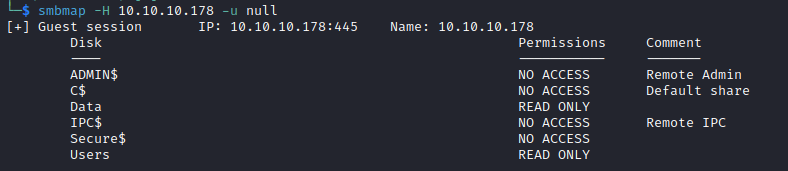
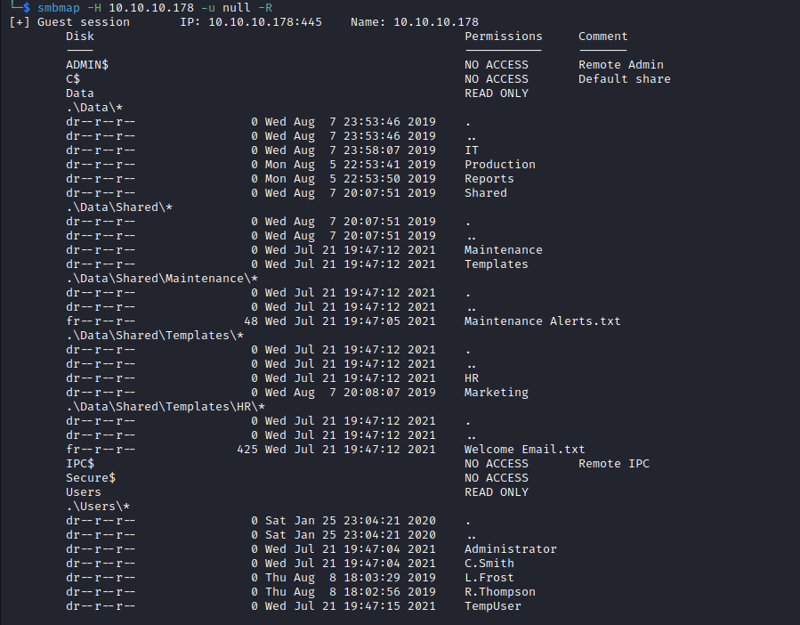

- Let's download `txt` files and check them
  - We got creds

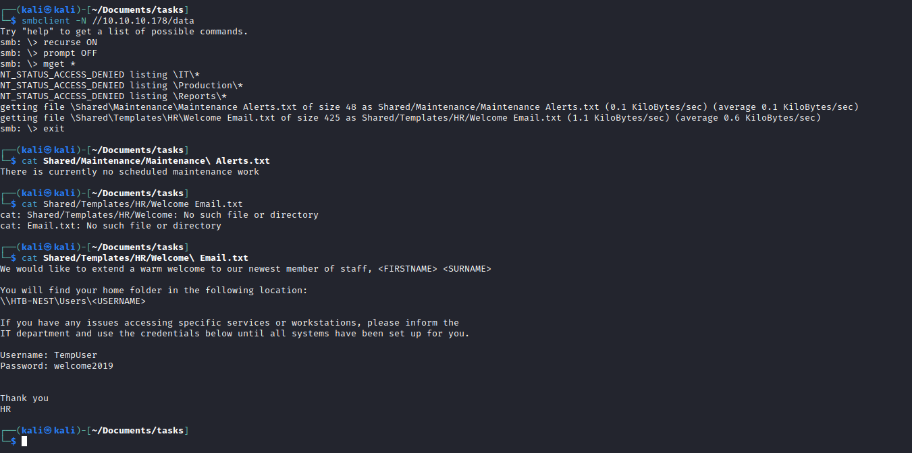

- Let's also check another open port
  - We see a `HQK` reporting service running
  - We can input `help` command to see the list of available commands
  - The only interesting thing found is `Debug` command, but it requires password


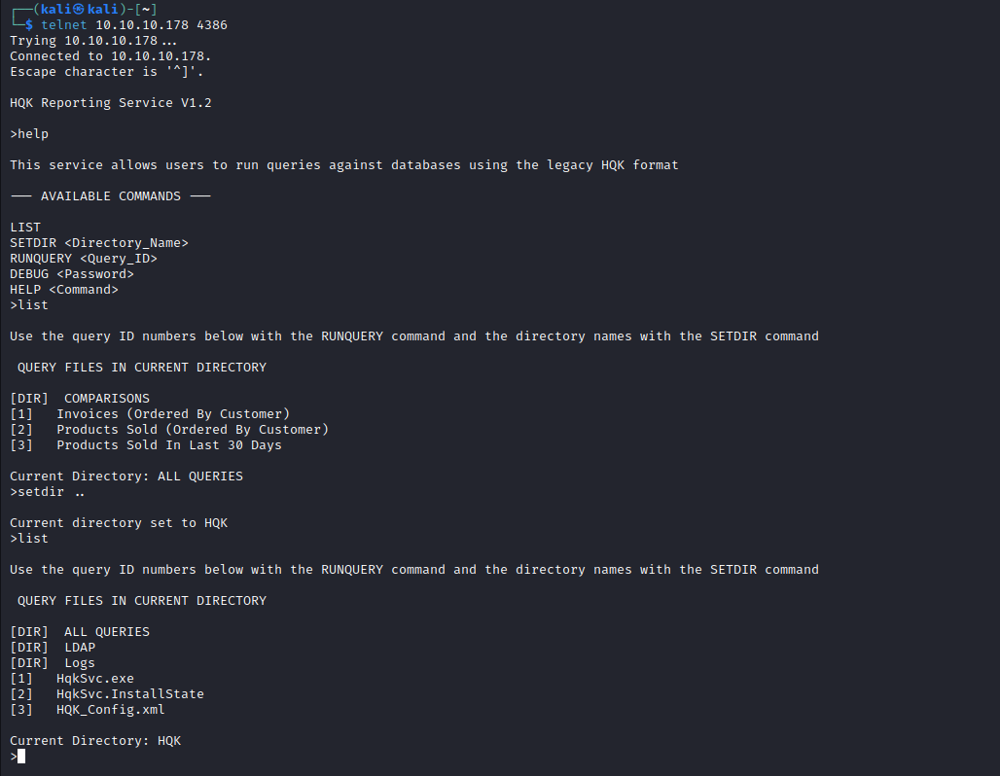

## Foothold
- Let's try using the creds found in `smb`

```
└─$ smbmap -H 10.10.10.178 -R -u 'TempUser' -p 'welcome2019'
[+] IP: 10.10.10.178:445        Name: 10.10.10.178                                      
        Disk                                                    Permissions     Comment
        ----                                                    -----------     -------
        ADMIN$                                                  NO ACCESS       Remote Admin
        C$                                                      NO ACCESS       Default share
        Data                                                    READ ONLY
        .\Data\*
        dr--r--r--                0 Wed Aug  7 23:53:46 2019    .
        dr--r--r--                0 Wed Aug  7 23:53:46 2019    ..
        dr--r--r--                0 Wed Aug  7 23:58:07 2019    IT
        dr--r--r--                0 Mon Aug  5 22:53:41 2019    Production
        dr--r--r--                0 Mon Aug  5 22:53:50 2019    Reports
        dr--r--r--                0 Wed Aug  7 20:07:51 2019    Shared
        .\Data\IT\*
        dr--r--r--                0 Wed Aug  7 23:58:07 2019    .
        dr--r--r--                0 Wed Aug  7 23:58:07 2019    ..
        dr--r--r--                0 Wed Aug  7 23:58:07 2019    Archive
        dr--r--r--                0 Wed Aug  7 23:59:34 2019    Configs
        dr--r--r--                0 Wed Aug  7 23:08:30 2019    Installs
        dr--r--r--                0 Wed Jul 21 19:47:16 2021    Reports
        dr--r--r--                0 Mon Aug  5 23:33:51 2019    Tools
        .\Data\IT\Configs\*
        dr--r--r--                0 Wed Aug  7 23:59:34 2019    .
        dr--r--r--                0 Wed Aug  7 23:59:34 2019    ..
        dr--r--r--                0 Wed Jul 21 19:47:13 2021    Adobe
        dr--r--r--                0 Wed Jul 21 19:47:04 2021    Atlas
        dr--r--r--                0 Tue Aug  6 14:27:08 2019    DLink
        dr--r--r--                0 Wed Aug  7 20:23:26 2019    Microsoft
        dr--r--r--                0 Wed Jul 21 19:47:13 2021    NotepadPlusPlus
        dr--r--r--                0 Wed Jul 21 19:47:05 2021    RU Scanner
        dr--r--r--                0 Tue Aug  6 14:27:09 2019    Server Manager
        .\Data\IT\Configs\Adobe\*
        dr--r--r--                0 Wed Jul 21 19:47:13 2021    .
        dr--r--r--                0 Wed Jul 21 19:47:13 2021    ..
        fr--r--r--              246 Wed Jul 21 19:47:12 2021    editing.xml
        fr--r--r--                0 Wed Aug  7 20:20:09 2019    Options.txt
        fr--r--r--              258 Wed Aug  7 20:20:09 2019    projects.xml
        fr--r--r--             1274 Wed Aug  7 20:20:09 2019    settings.xml
        .\Data\IT\Configs\Atlas\*
        dr--r--r--                0 Wed Jul 21 19:47:04 2021    .
        dr--r--r--                0 Wed Jul 21 19:47:04 2021    ..
        fr--r--r--             1369 Wed Jul 21 19:47:04 2021    Temp.XML
        .\Data\IT\Configs\Microsoft\*
        dr--r--r--                0 Wed Aug  7 20:23:26 2019    .
        dr--r--r--                0 Wed Aug  7 20:23:26 2019    ..
        fr--r--r--             4598 Wed Aug  7 20:23:26 2019    Options.xml
        .\Data\IT\Configs\NotepadPlusPlus\*
        dr--r--r--                0 Wed Jul 21 19:47:13 2021    .
        dr--r--r--                0 Wed Jul 21 19:47:13 2021    ..
        fr--r--r--             6451 Wed Jul 21 19:47:13 2021    config.xml
        fr--r--r--             2108 Wed Jul 21 19:47:15 2021    shortcuts.xml
        .\Data\IT\Configs\RU Scanner\*
        dr--r--r--                0 Wed Jul 21 19:47:05 2021    .
        dr--r--r--                0 Wed Jul 21 19:47:05 2021    ..
        fr--r--r--              270 Wed Jul 21 19:47:14 2021    RU_config.xml
        .\Data\Shared\*
        dr--r--r--                0 Wed Aug  7 20:07:51 2019    .
        dr--r--r--                0 Wed Aug  7 20:07:51 2019    ..
        dr--r--r--                0 Wed Jul 21 19:47:12 2021    Maintenance
        dr--r--r--                0 Wed Jul 21 19:47:12 2021    Templates
        .\Data\Shared\Maintenance\*
        dr--r--r--                0 Wed Jul 21 19:47:12 2021    .
        dr--r--r--                0 Wed Jul 21 19:47:12 2021    ..
        fr--r--r--               48 Wed Jul 21 19:47:05 2021    Maintenance Alerts.txt
        .\Data\Shared\Templates\*
        dr--r--r--                0 Wed Jul 21 19:47:12 2021    .
        dr--r--r--                0 Wed Jul 21 19:47:12 2021    ..
        dr--r--r--                0 Wed Jul 21 19:47:12 2021    HR
        dr--r--r--                0 Wed Aug  7 20:08:07 2019    Marketing
        .\Data\Shared\Templates\HR\*
        dr--r--r--                0 Wed Jul 21 19:47:12 2021    .
        dr--r--r--                0 Wed Jul 21 19:47:12 2021    ..
        fr--r--r--              425 Wed Jul 21 19:47:12 2021    Welcome Email.txt
        IPC$                                                    NO ACCESS       Remote IPC
        Secure$                                                 READ ONLY
        .\Secure$\*
        dr--r--r--                0 Thu Aug  8 00:08:12 2019    .
        dr--r--r--                0 Thu Aug  8 00:08:12 2019    ..
        dr--r--r--                0 Wed Aug  7 20:40:25 2019    Finance
        dr--r--r--                0 Thu Aug  8 00:08:12 2019    HR
        dr--r--r--                0 Thu Aug  8 11:59:25 2019    IT
        Users                                                   READ ONLY
        .\Users\*
        dr--r--r--                0 Sat Jan 25 23:04:21 2020    .
        dr--r--r--                0 Sat Jan 25 23:04:21 2020    ..
        dr--r--r--                0 Wed Jul 21 19:47:04 2021    Administrator
        dr--r--r--                0 Wed Jul 21 19:47:04 2021    C.Smith
        dr--r--r--                0 Thu Aug  8 18:03:29 2019    L.Frost
        dr--r--r--                0 Thu Aug  8 18:02:56 2019    R.Thompson
        dr--r--r--                0 Wed Jul 21 19:47:15 2021    TempUser
        .\Users\TempUser\*
        dr--r--r--                0 Wed Jul 21 19:47:15 2021    .
        dr--r--r--                0 Wed Jul 21 19:47:15 2021    ..
        fr--r--r--                0 Wed Jul 21 19:47:15 2021    New Text Document.txt
```
- Let's download the files and check them
  - Search for password word in files resulted in encrypted password for `c.smith`
  - `c.smith:fTEzAfYDoz1YzkqhQkH6GQFYKp1XY5hm7bjOP86yYxE=`


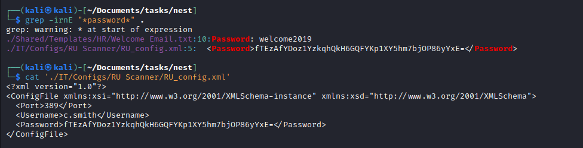

- The password looks encrypted
  - You will also find `Notepad++` config in `IT/Configs/NotepadPlusPlus/config.xml`
  - It has an interesting parameters set pointing to `Secure$\IT\Carl`


- Let's try to visit the path
  - Let's download the content


- In `VB Projects` folder I found an interesting file `Module1.vb1`
  - Which opens `RU_Config.xml` and decrypts the password


- Since we have `sln` project I will open it in `Visual Studio`
  - The build was successful, but execution throws an exception since it can't find the config file 
  - So I uploaded the config file next to the binary and executed it
  - Don't forget to add a breakpoint so we can retrieve the password
  - `c.smith:xRxRxPANCAK3SxRxRx`


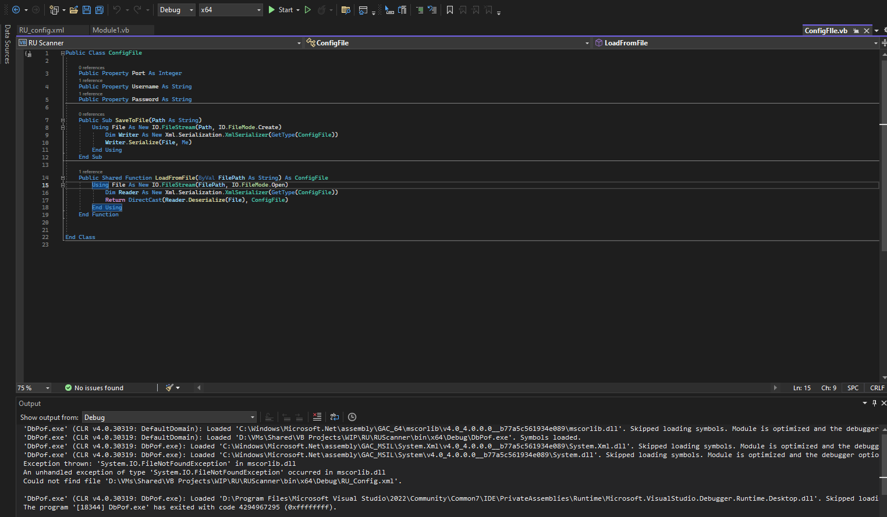


- We can't launch shell, but we can get our flag

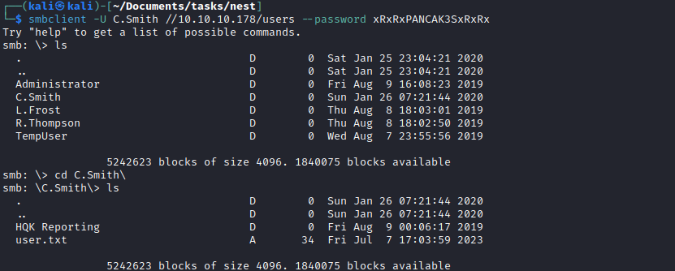

## Root
- We found `HQK Reporting` folder inside `C.Smith`'s directory
  - I downloaded whole directory and found `Debug Mode Password.txt` file, but it was empty
  - Then I checked other files, but found nothing
  - Checked password file on `smb` using `allinfo` and found an alternative data stream
  - The password was stored there `WBQ201953D8w`

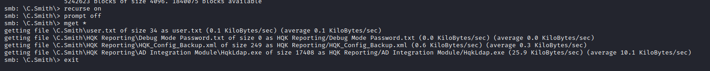

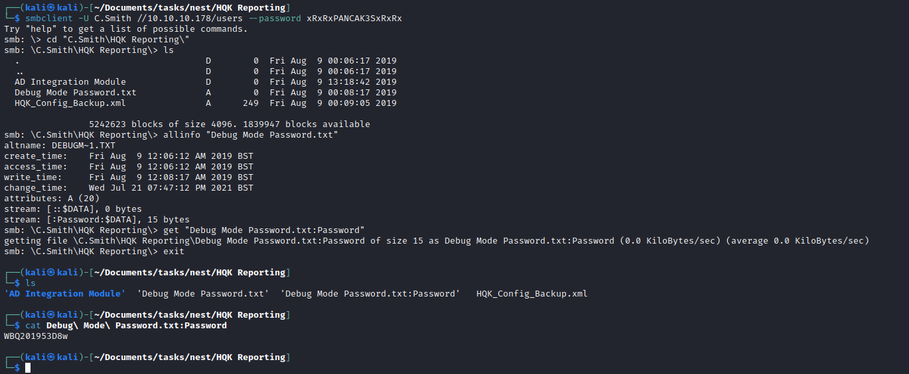

- Now we can access debug menu in `HQK`

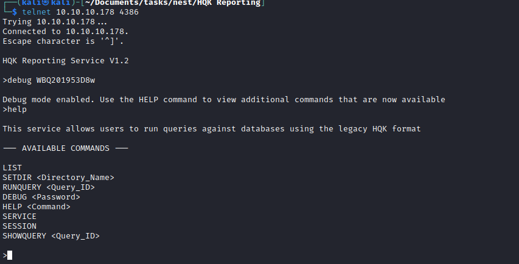

- Now we can read files with `SHOWQUERY`
  - Found a config file with encrypted password for Administrator
  - And executable file `HqKLdap.exe` which I saw previously in `C.Smith`'s directory


- Let's debug it
  - Open executable using `dnSpy`
  - If we check main function we see that it performs several checks
    - We can create fake file just to pass the check
  - Set the breakpoint for ldap module and start debugging by supplying `ldap.conf` that we saw in `HQK` service
  - `Administrator:XtH4nkS4Pl4y1nGX`


- Rooted

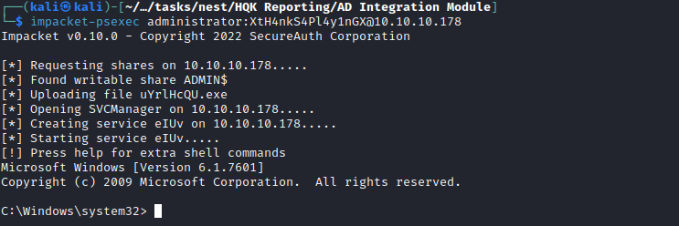
