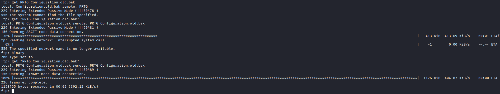
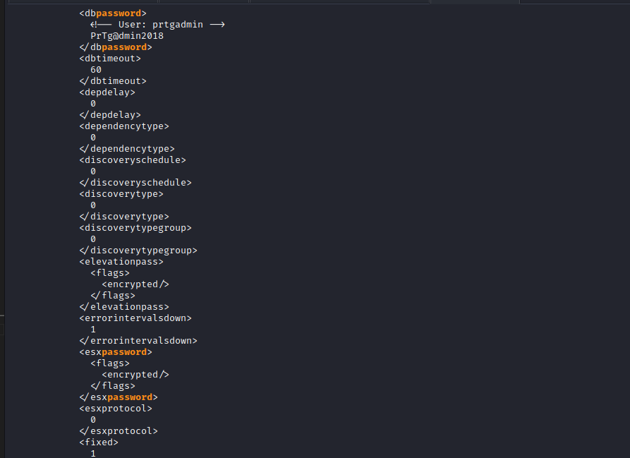
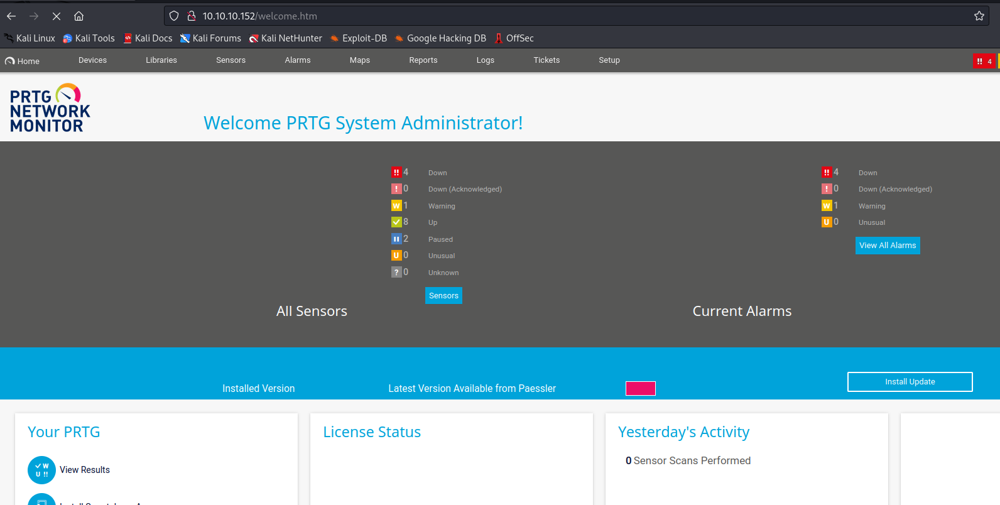
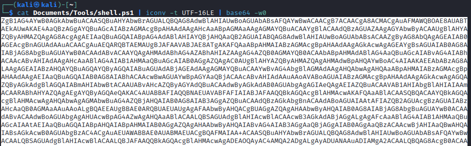

# Netmon
## Enumeration
- `nmap`
```
└─$ nmap -sC -sV -Pn -p21,80,135,139,445,5985,47001,49664,49665,49666,49667,49668,49669 10.10.10.152 -T4
Starting Nmap 7.93 ( https://nmap.org ) at 2023-06-15 20:11 BST
Nmap scan report for 10.10.10.152 (10.10.10.152)
Host is up (0.16s latency).

PORT      STATE SERVICE      VERSION
21/tcp    open  ftp          Microsoft ftpd
| ftp-anon: Anonymous FTP login allowed (FTP code 230)
| 02-03-19  12:18AM                 1024 .rnd
| 02-25-19  10:15PM       <DIR>          inetpub
| 07-16-16  09:18AM       <DIR>          PerfLogs
| 02-25-19  10:56PM       <DIR>          Program Files
| 02-03-19  12:28AM       <DIR>          Program Files (x86)
| 02-03-19  08:08AM       <DIR>          Users
|_02-25-19  11:49PM       <DIR>          Windows
| ftp-syst: 
|_  SYST: Windows_NT
80/tcp    open  http         Indy httpd 18.1.37.13946 (Paessler PRTG bandwidth monitor)
|_http-trane-info: Problem with XML parsing of /evox/about
| http-title: Welcome | PRTG Network Monitor (NETMON)
|_Requested resource was /index.htm
|_http-server-header: PRTG/18.1.37.13946
135/tcp   open  msrpc        Microsoft Windows RPC
139/tcp   open  netbios-ssn  Microsoft Windows netbios-ssn
445/tcp   open  microsoft-ds Microsoft Windows Server 2008 R2 - 2012 microsoft-ds
5985/tcp  open  http         Microsoft HTTPAPI httpd 2.0 (SSDP/UPnP)
|_http-server-header: Microsoft-HTTPAPI/2.0
|_http-title: Not Found
47001/tcp open  http         Microsoft HTTPAPI httpd 2.0 (SSDP/UPnP)
|_http-server-header: Microsoft-HTTPAPI/2.0
|_http-title: Not Found
49664/tcp open  msrpc        Microsoft Windows RPC
49665/tcp open  msrpc        Microsoft Windows RPC
49666/tcp open  msrpc        Microsoft Windows RPC
49667/tcp open  msrpc        Microsoft Windows RPC
49668/tcp open  msrpc        Microsoft Windows RPC
49669/tcp open  msrpc        Microsoft Windows RPC
Service Info: OSs: Windows, Windows Server 2008 R2 - 2012; CPE: cpe:/o:microsoft:windows

Host script results:
| smb-security-mode: 
|   account_used: guest
|   authentication_level: user
|   challenge_response: supported
|_  message_signing: disabled (dangerous, but default)
| smb2-time: 
|   date: 2023-06-15T19:11:33
|_  start_date: 2023-06-15T18:35:59
| smb2-security-mode: 
|   311: 
|_    Message signing enabled but not required
|_clock-skew: mean: -29s, deviation: 0s, median: -29s

Service detection performed. Please report any incorrect results at https://nmap.org/submit/ .
Nmap done: 1 IP address (1 host up) scanned in 67.73 seconds
```
- Web server


## Foothold/User/Root
- After trying default creds for `PRTG`, I enumerated `ftp`


- Seems like we can read majority of the folders
  - Let's check `PRTG` installed folder and search for creds
  - According to [post](https://kb.paessler.com/en/topic/463-how-and-where-does-prtg-store-its-data) we have to check `ProgramdData\Paessler\PRTG Network Monitor`


- We see a backup configuration file `PRTG Configuration.old.bak`
  - Let's download it



- We found our creds



- No success


- However, if we check the screenshot and the password, the backup file was created in 2018, so lets try 2019 and so on
  - It worked, the password ends with 2019



- There is a [post](https://www.codewatch.org/blog/?p=453) about command injection in `PRTG`
  - Open the page indicated in the screen


- Add new notification
  - Scroll down and select `Execute Program`
  - Add your payload to parameter
    - I tried different variations of payload, like adding a new user, reverse shell from https://www.revshells.com/
    - So the solution was to use encoded reverse shell for `powershell`, but with conversion to `UTF-16LE`
  - Save




- Test notification


- Rooted 


