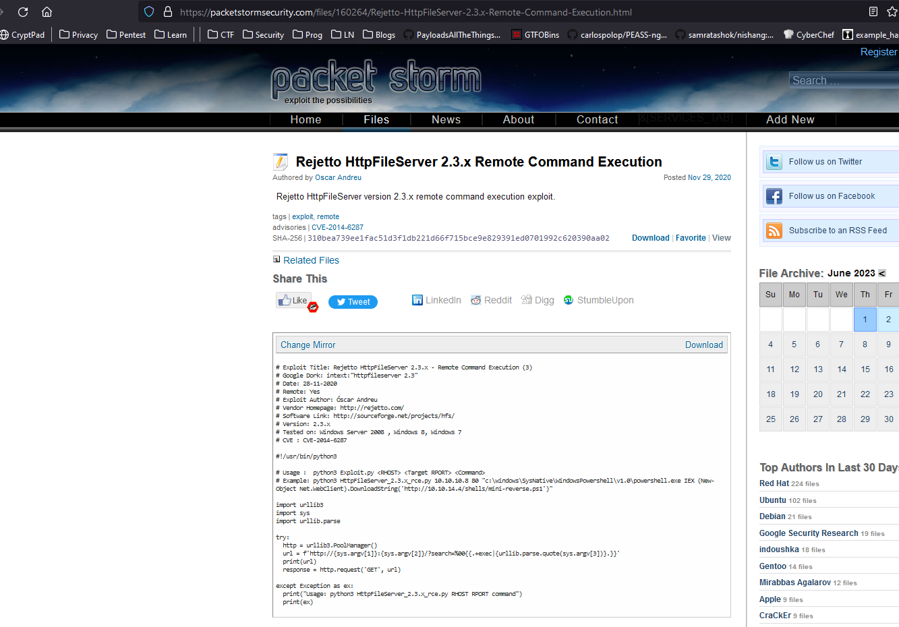
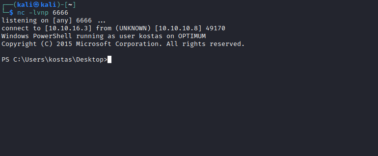
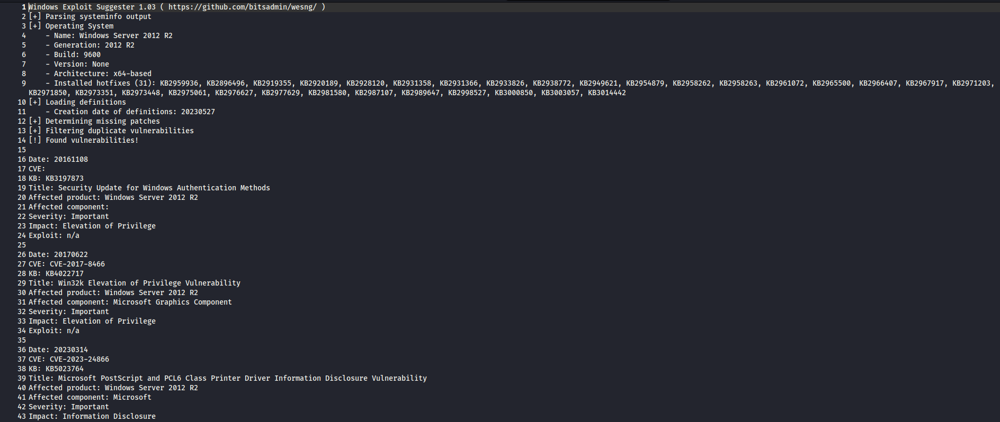
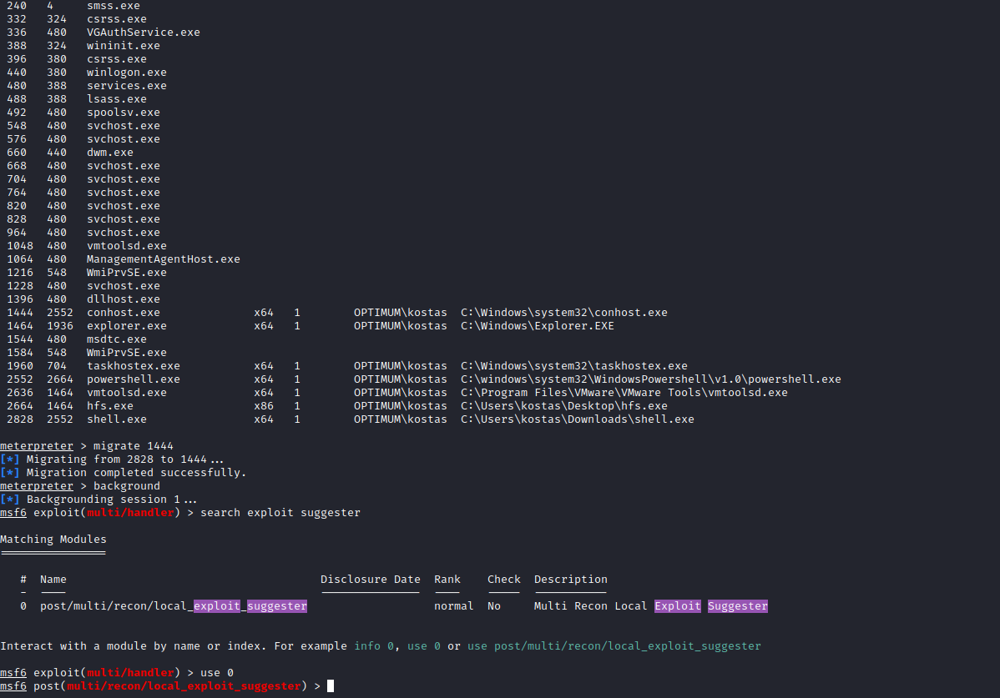

# Optimum
## Enumeration
- ```Nmap```
```
┌──(kali㉿kali)-[~]
└─$ nmap -sC -sV 10.10.10.8
Starting Nmap 7.93 ( https://nmap.org ) at 2023-06-01 19:02 BST
Nmap scan report for 10.10.10.8 (10.10.10.8)
Host is up (0.091s latency).
Not shown: 999 filtered tcp ports (no-response)
PORT   STATE SERVICE VERSION
80/tcp open  http    HttpFileServer httpd 2.3
|_http-server-header: HFS 2.3
|_http-title: HFS /
Service Info: OS: Windows; CPE: cpe:/o:microsoft:windows

Service detection performed. Please report any incorrect results at https://nmap.org/submit/ .
Nmap done: 1 IP address (1 host up) scanned in 20.60 seconds
```
- Web server
  - We see the version and the application running `HttpFileServer 2.3`


- Let's google




## Foothold/User
- Let's copy an exploit and run
  - I started `Http server` and hosted `shell.ps1`


- And we get a shell



## Root
- Let's start enumerating for privesc
  - `systeminfo`
```
PS C:\Users\kostas\Downloads> systeminfo

Host Name:                 OPTIMUM
OS Name:                   Microsoft Windows Server 2012 R2 Standard
OS Version:                6.3.9600 N/A Build 9600
OS Manufacturer:           Microsoft Corporation
OS Configuration:          Standalone Server
OS Build Type:             Multiprocessor Free
Registered Owner:          Windows User
Registered Organization:   
Product ID:                00252-70000-00000-AA535
Original Install Date:     18/3/2017, 1:51:36 ??
System Boot Time:          9/6/2023, 5:55:25 ??
System Manufacturer:       VMware, Inc.
System Model:              VMware Virtual Platform
System Type:               x64-based PC
Processor(s):              1 Processor(s) Installed.
                           [01]: AMD64 Family 23 Model 49 Stepping 0 AuthenticAMD ~2994 Mhz
BIOS Version:              Phoenix Technologies LTD 6.00, 12/12/2018
Windows Directory:         C:\Windows
System Directory:          C:\Windows\system32
Boot Device:               \Device\HarddiskVolume1
System Locale:             el;Greek
Input Locale:              en-us;English (United States)
Time Zone:                 (UTC+02:00) Athens, Bucharest
Total Physical Memory:     4.095 MB
Available Physical Memory: 3.481 MB
Virtual Memory: Max Size:  5.503 MB
Virtual Memory: Available: 4.932 MB
Virtual Memory: In Use:    571 MB
Page File Location(s):     C:\pagefile.sys
Domain:                    HTB
Logon Server:              \\OPTIMUM
Hotfix(s):                 31 Hotfix(s) Installed.
                           [01]: KB2959936
                           [02]: KB2896496
                           [03]: KB2919355
                           [04]: KB2920189
                           [05]: KB2928120
                           [06]: KB2931358
                           [07]: KB2931366
                           [08]: KB2933826
                           [09]: KB2938772
                           [10]: KB2949621
                           [11]: KB2954879
                           [12]: KB2958262
                           [13]: KB2958263
                           [14]: KB2961072
                           [15]: KB2965500
                           [16]: KB2966407
                           [17]: KB2967917
                           [18]: KB2971203
                           [19]: KB2971850
                           [20]: KB2973351
                           [21]: KB2973448
                           [22]: KB2975061
                           [23]: KB2976627
                           [24]: KB2977629
                           [25]: KB2981580
                           [26]: KB2987107
                           [27]: KB2989647
                           [28]: KB2998527
                           [29]: KB3000850
                           [30]: KB3003057
                           [31]: KB3014442
Network Card(s):           1 NIC(s) Installed.
                           [01]: Intel(R) 82574L Gigabit Network Connection
                                 Connection Name: Ethernet0
                                 DHCP Enabled:    No
                                 IP address(es)
                                 [01]: 10.10.10.8
Hyper-V Requirements:      A hypervisor has been detected. Features required for Hyper-V will not be displayed.
```
- `Sherlock.ps1`
  - This tool is *Deprecated. Have a look at [Watson](https://github.com/rasta-mouse/Watson) instead.*
  - So we can either try `Watson` or `Sherlock`
  - I tried precompiled `Watson`, it didn't work. Need to compile it myself next time
  - So I used `Sherlock`
```
PS C:\Users\kostas\Downloads> import-module .\sherlock.ps1      
PS C:\Users\kostas\Downloads> Find-AllVulns


Title      : User Mode to Ring (KiTrap0D)
MSBulletin : MS10-015
CVEID      : 2010-0232
Link       : https://www.exploit-db.com/exploits/11199/
VulnStatus : Not supported on 64-bit systems

Title      : Task Scheduler .XML
MSBulletin : MS10-092
CVEID      : 2010-3338, 2010-3888
Link       : https://www.exploit-db.com/exploits/19930/
VulnStatus : Not Vulnerable

Title      : NTUserMessageCall Win32k Kernel Pool Overflow
MSBulletin : MS13-053
CVEID      : 2013-1300
Link       : https://www.exploit-db.com/exploits/33213/
VulnStatus : Not supported on 64-bit systems

Title      : TrackPopupMenuEx Win32k NULL Page
MSBulletin : MS13-081
CVEID      : 2013-3881
Link       : https://www.exploit-db.com/exploits/31576/
VulnStatus : Not supported on 64-bit systems

Title      : TrackPopupMenu Win32k Null Pointer Dereference
MSBulletin : MS14-058
CVEID      : 2014-4113
Link       : https://www.exploit-db.com/exploits/35101/
VulnStatus : Not Vulnerable

Title      : ClientCopyImage Win32k
MSBulletin : MS15-051
CVEID      : 2015-1701, 2015-2433
Link       : https://www.exploit-db.com/exploits/37367/
VulnStatus : Not Vulnerable

Title      : Font Driver Buffer Overflow
MSBulletin : MS15-078
CVEID      : 2015-2426, 2015-2433
Link       : https://www.exploit-db.com/exploits/38222/
VulnStatus : Not Vulnerable

Title      : 'mrxdav.sys' WebDAV
MSBulletin : MS16-016
CVEID      : 2016-0051
Link       : https://www.exploit-db.com/exploits/40085/
VulnStatus : Not supported on 64-bit systems

Title      : Secondary Logon Handle
MSBulletin : MS16-032
CVEID      : 2016-0099
Link       : https://www.exploit-db.com/exploits/39719/
VulnStatus : Appears Vulnerable

Title      : Windows Kernel-Mode Drivers EoP
MSBulletin : MS16-034
CVEID      : 2016-0093/94/95/96
Link       : https://github.com/SecWiki/windows-kernel-exploits/tree/master/MS1
             6-034?
VulnStatus : Appears Vulnerable

Title      : Win32k Elevation of Privilege
MSBulletin : MS16-135
CVEID      : 2016-7255
Link       : https://github.com/FuzzySecurity/PSKernel-Primitives/tree/master/S
             ample-Exploits/MS16-135
VulnStatus : Appears Vulnerable

Title      : Nessus Agent 6.6.2 - 6.10.3
MSBulletin : N/A
CVEID      : 2017-7199
Link       : https://aspe1337.blogspot.co.uk/2017/04/writeup-of-cve-2017-7199.h
             tml
VulnStatus : Not Vulnerable
```

- I also ran [wesng](https://github.com/bitsadmin/wesng)



- There were a lot of `CVEs`
  - So I thought maybe I should try `metasploit's` local exploit suggester
  - Created `msfvenom` payload for meterpreter
  - Started `msfconsole` and ran `multi/handler`
  - Uploaded and ran `msfvenom` payload from the shell we got before
  - And booted `exploit suggester`




- We see `MS16-032`
  - Which was in `Sherlock's` output
  - So I tried running it before, but had luck
  - Upon further investigation, `exploit-db` exploit won't work since it spawns the new window 
  - So I tried running `metasploit's` version of `MS16-032` exploit


- Check [ippsec's video](https://www.youtube.com/watch?v=kWTnVBIpNsE&t=98) or [0xdf's writetup regaring the MS16-032](https://0xdf.gitlab.io/2021/03/17/htb-optimum.html), they used `Empire's` version of `MS16-032` [script](https://raw.githubusercontent.com/EmpireProject/Empire/master/data/module_source/privesc/Invoke-MS16032.ps1) 