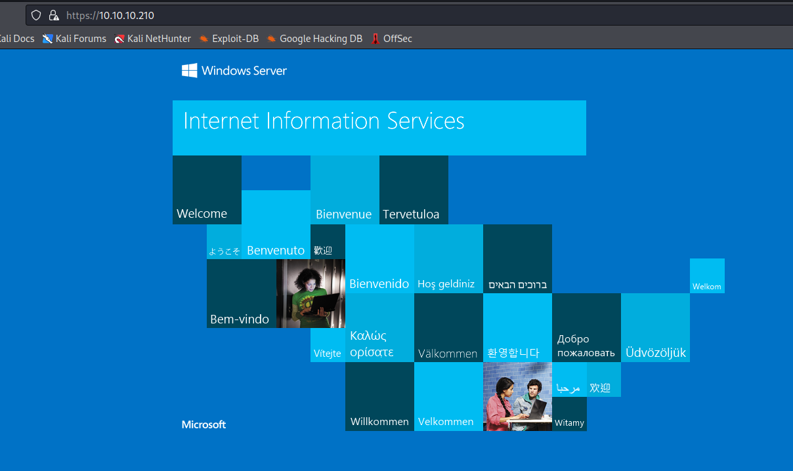
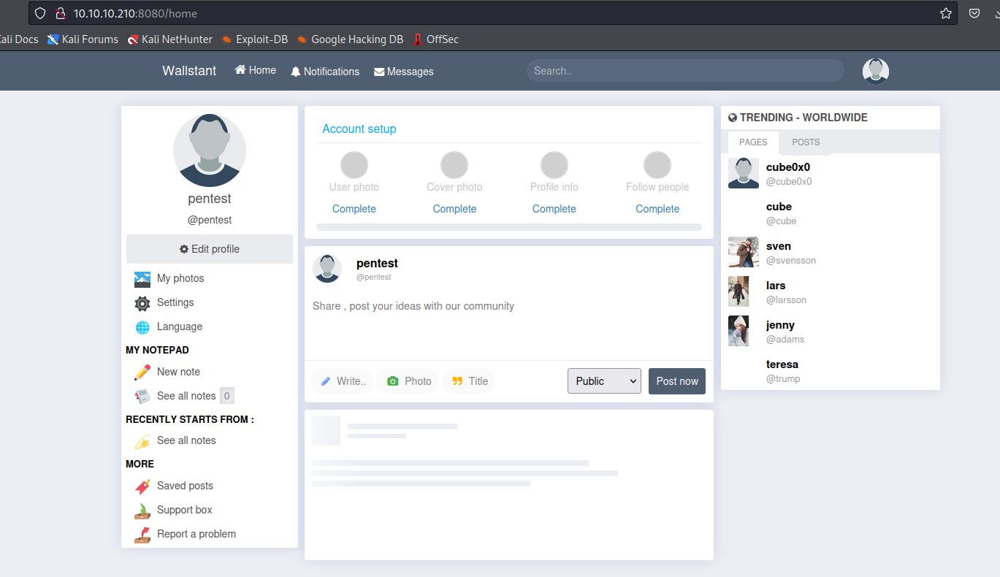

# Reel2
## Enumeration
- `nmap`
```
└─$ nmap -Pn -p- 10.10.10.210  --min-rate 10000
Starting Nmap 7.94 ( https://nmap.org ) at 2023-10-03 19:51 BST
Nmap scan report for 10.10.10.210 (10.10.10.210)
Host is up (0.10s latency).
Not shown: 65521 filtered tcp ports (no-response)
PORT     STATE SERVICE
80/tcp   open  http
443/tcp  open  https
5985/tcp open  wsman
6004/tcp open  X11:4
6005/tcp open  X11:5
6006/tcp open  X11:6
6007/tcp open  X11:7
6008/tcp open  X11:8
6010/tcp open  x11
6011/tcp open  x11
6012/tcp open  x11
6021/tcp open  x11
6135/tcp open  unknown
8080/tcp open  http-proxy

Nmap done: 1 IP address (1 host up) scanned in 44.05 seconds

```
```
└─$ nmap -Pn -p80,443,5985,6001-6012,6021,6165,8080 -sC -sV 10.10.10.210  --min-rate 10000
Starting Nmap 7.94 ( https://nmap.org ) at 2023-10-03 19:56 BST
Nmap scan report for 10.10.10.210 (10.10.10.210)
Host is up (0.11s latency).

PORT     STATE    SERVICE    VERSION
80/tcp   open     http       Microsoft IIS httpd 8.5
|_http-server-header: Microsoft-IIS/8.5
|_http-title: 403 - Forbidden: Access is denied.
443/tcp  open     ssl/http   Microsoft IIS httpd 8.5
| ssl-cert: Subject: commonName=Reel2
| Subject Alternative Name: DNS:Reel2, DNS:Reel2.htb.local
| Not valid before: 2020-07-30T10:12:46
|_Not valid after:  2025-07-30T10:12:46
|_http-title: IIS Windows Server
| http-methods: 
|_  Potentially risky methods: TRACE
|_http-server-header: Microsoft-IIS/8.5
|_ssl-date: 2023-10-03T18:57:18+00:00; -43s from scanner time.
5985/tcp open     http       Microsoft HTTPAPI httpd 2.0 (SSDP/UPnP)
|_http-title: Not Found
|_http-server-header: Microsoft-HTTPAPI/2.0
6001/tcp open     ncacn_http Microsoft Windows RPC over HTTP 1.0
6002/tcp open     ncacn_http Microsoft Windows RPC over HTTP 1.0
6003/tcp filtered X11:3
6004/tcp filtered X11:4
6005/tcp filtered X11:5
6006/tcp open     msrpc      Microsoft Windows RPC
6007/tcp open     msrpc      Microsoft Windows RPC
6008/tcp open     msrpc      Microsoft Windows RPC
6009/tcp filtered X11:9
6010/tcp open     ncacn_http Microsoft Windows RPC over HTTP 1.0
6011/tcp filtered x11
6012/tcp open     msrpc      Microsoft Windows RPC
6021/tcp filtered x11
6165/tcp filtered unknown
8080/tcp open     http       Apache httpd 2.4.43 ((Win64) OpenSSL/1.1.1g PHP/7.2.32)
| http-open-proxy: Potentially OPEN proxy.
|_Methods supported:CONNECTION
| http-cookie-flags: 
|   /: 
|     PHPSESSID: 
|_      httponly flag not set
|_http-server-header: Apache/2.4.43 (Win64) OpenSSL/1.1.1g PHP/7.2.32
|_http-title: Welcome | Wallstant
Service Info: OS: Windows; CPE: cpe:/o:microsoft:windows

Host script results:
|_clock-skew: -43s

Service detection performed. Please report any incorrect results at https://nmap.org/submit/ .
Nmap done: 1 IP address (1 host up) scanned in 70.28 seconds

```
- Web Server
  - Port `80`


- Web Server
  - Port `443`



- `gobuster`
```
└─$ gobuster dir -u http://10.10.10.210 -w /usr/share/wordlists/dirbuster/directory-list-lowercase-2.3-small.txt -t 50 --exclude-length 1233
===============================================================
Gobuster v3.5
by OJ Reeves (@TheColonial) & Christian Mehlmauer (@firefart)
===============================================================
[+] Url:                     http://10.10.10.210
[+] Method:                  GET
[+] Threads:                 50
[+] Wordlist:                /usr/share/wordlists/dirbuster/directory-list-lowercase-2.3-small.txt
[+] Negative Status codes:   404
[+] Exclude Length:          1233
[+] User Agent:              gobuster/3.5
[+] Timeout:                 10s
===============================================================
2023/10/04 16:14:06 Starting gobuster in directory enumeration mode
===============================================================
/owa                  (Status: 301) [Size: 0] [--> /owa/]

```
```
└─$ gobuster dir -u https://10.10.10.210 -w /usr/share/wordlists/dirbuster/directory-list-lowercase-2.3-small.txt -t 50  -k                     
===============================================================
Gobuster v3.5
by OJ Reeves (@TheColonial) & Christian Mehlmauer (@firefart)
===============================================================
[+] Url:                     https://10.10.10.210
[+] Method:                  GET
[+] Threads:                 50
[+] Wordlist:                /usr/share/wordlists/dirbuster/directory-list-lowercase-2.3-small.txt
[+] Negative Status codes:   404
[+] User Agent:              gobuster/3.5
[+] Timeout:                 10s
===============================================================
2023/10/04 16:15:56 Starting gobuster in directory enumeration mode
===============================================================
/public               (Status: 302) [Size: 147] [--> https://10.10.10.210/owa]
/exchange             (Status: 302) [Size: 147] [--> https://10.10.10.210/owa]
/rpc                  (Status: 401) [Size: 13]
/owa                  (Status: 301) [Size: 0] [--> /owa/]

```

- Port `8080`
  - https://wallstant.github.io/


- Let's register 




## Foothold/User
- If we enter empty search string, we have http://10.10.10.210:8080/search?q=


- We can extract all usernames
```
gregg quimbly
joseph Moore
teresa trump
cube cube
sven svensson
alex miller
michael doe
egre55 egre55
travis scott
davis marshall
jeff Perez
frans allen
james Martin
stig helmer
donald Johson	
jhon smith
chris Thompson	
kalle garcia
cube0x0 cube0x0
lee rodriguez
jenny adams
david Taylor
jim morgan	
lars larsson
bob davis
charles Jackson
fred sanders
```

- I'll use [TREVORspray](https://github.com/blacklanternsecurity/TREVORspray)


## Root