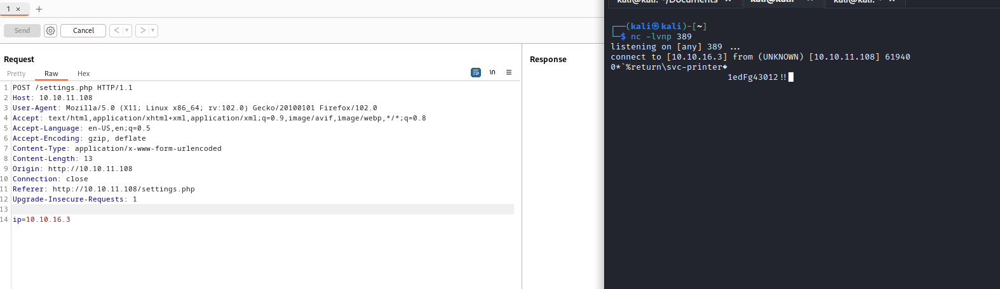
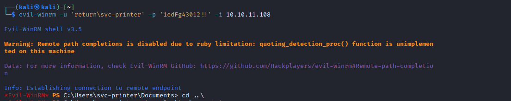
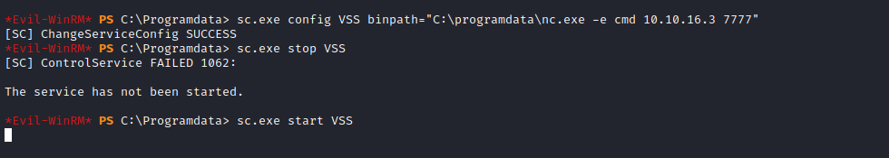

# Return
## Enumeration
- `nmap`
```
└─$ nmap -p- -Pn 10.10.11.108 -T4 
Starting Nmap 7.94 ( https://nmap.org ) at 2023-08-10 16:41 BST
Stats: 0:05:48 elapsed; 0 hosts completed (1 up), 1 undergoing Connect Scan
Connect Scan Timing: About 62.24% done; ETC: 16:50 (0:03:31 remaining)
Warning: 10.10.11.108 giving up on port because retransmission cap hit (6).
Stats: 0:14:43 elapsed; 0 hosts completed (1 up), 1 undergoing Connect Scan
Connect Scan Timing: About 99.03% done; ETC: 16:56 (0:00:09 remaining)
Nmap scan report for 10.10.11.108 (10.10.11.108)
Host is up (0.12s latency).
Not shown: 65483 closed tcp ports (conn-refused), 28 filtered tcp ports (no-response)
PORT      STATE SERVICE
53/tcp    open  domain
80/tcp    open  http
88/tcp    open  kerberos-sec
135/tcp   open  msrpc
139/tcp   open  netbios-ssn
389/tcp   open  ldap
445/tcp   open  microsoft-ds
464/tcp   open  kpasswd5
593/tcp   open  http-rpc-epmap
636/tcp   open  ldapssl
5985/tcp  open  wsman
9389/tcp  open  adws
47001/tcp open  winrm
49664/tcp open  unknown
49665/tcp open  unknown
49666/tcp open  unknown
49667/tcp open  unknown
49671/tcp open  unknown
49674/tcp open  unknown
49675/tcp open  unknown
49679/tcp open  unknown
49682/tcp open  unknown
49694/tcp open  unknown
64731/tcp open  unknown
```
```
└─$ nmap -sC -sV -Pn 10.10.11.108
Starting Nmap 7.94 ( https://nmap.org ) at 2023-08-09 18:52 BST
Nmap scan report for 10.10.11.108 (10.10.11.108)
Host is up (0.19s latency).
Not shown: 990 closed tcp ports (conn-refused)
PORT    STATE SERVICE       VERSION
53/tcp  open  domain        Simple DNS Plus
80/tcp  open  http          Microsoft IIS httpd 10.0
|_http-title: HTB Printer Admin Panel
|_http-server-header: Microsoft-IIS/10.0
| http-methods: 
|_  Potentially risky methods: TRACE
88/tcp  open  kerberos-sec  Microsoft Windows Kerberos (server time: 2023-08-09 18:11:46Z)
135/tcp open  msrpc         Microsoft Windows RPC
139/tcp open  netbios-ssn   Microsoft Windows netbios-ssn
389/tcp open  ldap          Microsoft Windows Active Directory LDAP (Domain: return.local0., Site: Default-First-Site-Name)
445/tcp open  microsoft-ds?
464/tcp open  kpasswd5?
593/tcp open  ncacn_http    Microsoft Windows RPC over HTTP 1.0
636/tcp open  tcpwrapped
Service Info: Host: PRINTER; OS: Windows; CPE: cpe:/o:microsoft:windows

Host script results:
| smb2-time: 
|   date: 2023-08-09T18:12:01
|_  start_date: N/A
|_clock-skew: 18m01s
| smb2-security-mode: 
|   3:1:1: 
|_    Message signing enabled and required

Service detection performed. Please report any incorrect results at https://nmap.org/submit/ .
Nmap done: 1 IP address (1 host up) scanned in 94.64 seconds

```
- `smb`
```
└─$ smbclient -N -L //10.10.11.108
Anonymous login successful

        Sharename       Type      Comment
        ---------       ----      -------
Reconnecting with SMB1 for workgroup listing.
do_connect: Connection to 10.10.11.108 failed (Error NT_STATUS_RESOURCE_NAME_NOT_FOUND)
Unable to connect with SMB1 -- no workgroup available
```
- `gobuster`
```
└─$ gobuster dir -u http://10.10.11.108/ -w /usr/share/seclists/Discovery/Web-Content/directory-list-2.3-medium.txt -t 50 -x php,txt
===============================================================
Gobuster v3.5
by OJ Reeves (@TheColonial) & Christian Mehlmauer (@firefart)
===============================================================
[+] Url:                     http://10.10.11.108/
[+] Method:                  GET
[+] Threads:                 50
[+] Wordlist:                /usr/share/seclists/Discovery/Web-Content/directory-list-2.3-medium.txt
[+] Negative Status codes:   404
[+] User Agent:              gobuster/3.5
[+] Extensions:              php,txt
[+] Timeout:                 10s
===============================================================
2023/08/10 15:50:19 Starting gobuster in directory enumeration mode
===============================================================
/images               (Status: 301) [Size: 150] [--> http://10.10.11.108/images/]
/index.php            (Status: 200) [Size: 28274]
/Images               (Status: 301) [Size: 150] [--> http://10.10.11.108/Images/]
/Index.php            (Status: 200) [Size: 28274]
/settings.php         (Status: 200) [Size: 29090]
/IMAGES               (Status: 301) [Size: 150] [--> http://10.10.11.108/IMAGES/]
/INDEX.php            (Status: 200) [Size: 28274]
```
- Web Server


## Foothold/User
- If we visit `http://10.10.11.108/settings.php`
  - We have a submit form
  - When we click `submit`, we see that the `ip` is the only parameter sent


- If we try changing `ip` to our address and listen with `nc` on port `389`, we receive the printer creds
  - `return\svc-printer:1edFg43012!!`



- We have a connection via `winrm`



## Root
- Let's enumerate via `winpeas`
  - According to `winpeas` the user is in `Server Operator` group
  - The group can start and stop services
  - If we follow the [post](https://cube0x0.github.io/Pocing-Beyond-DA/) we are successfuly get root
  - We modify the service by changing binary path and restart it to get reverse shell




