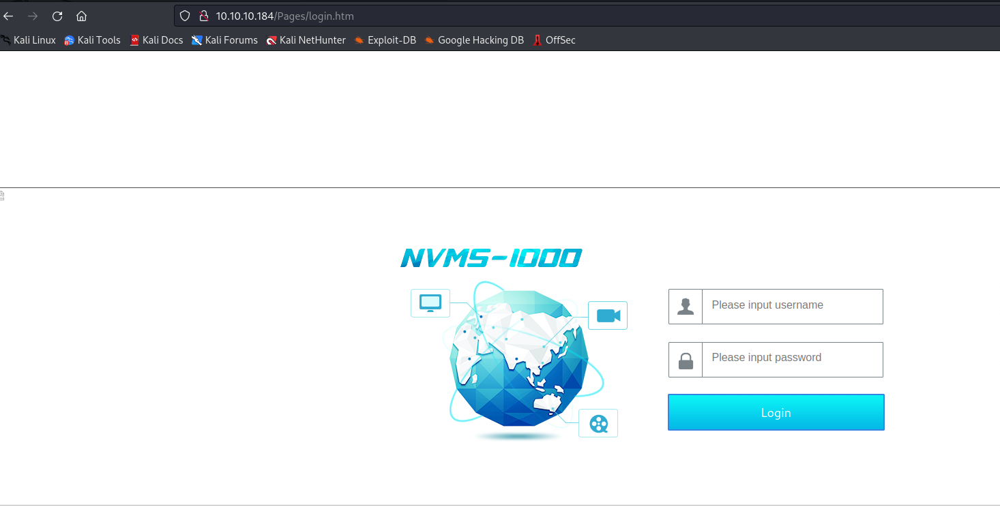
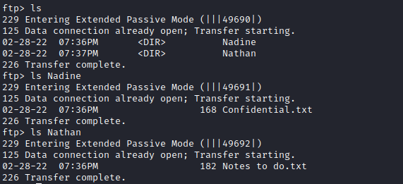
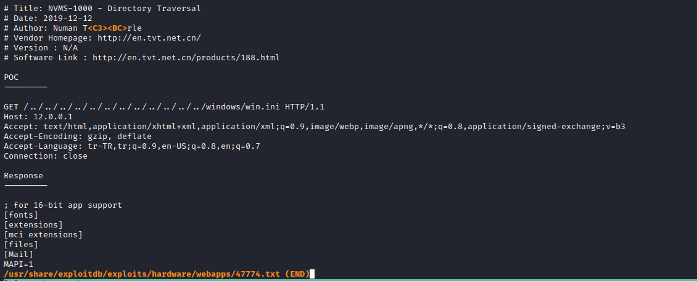
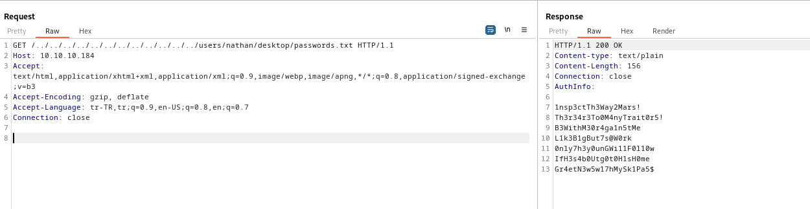
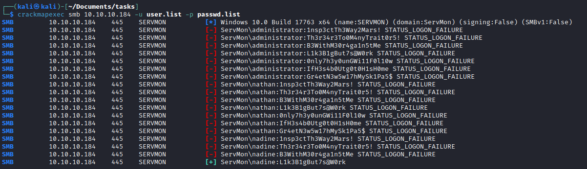
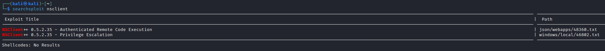
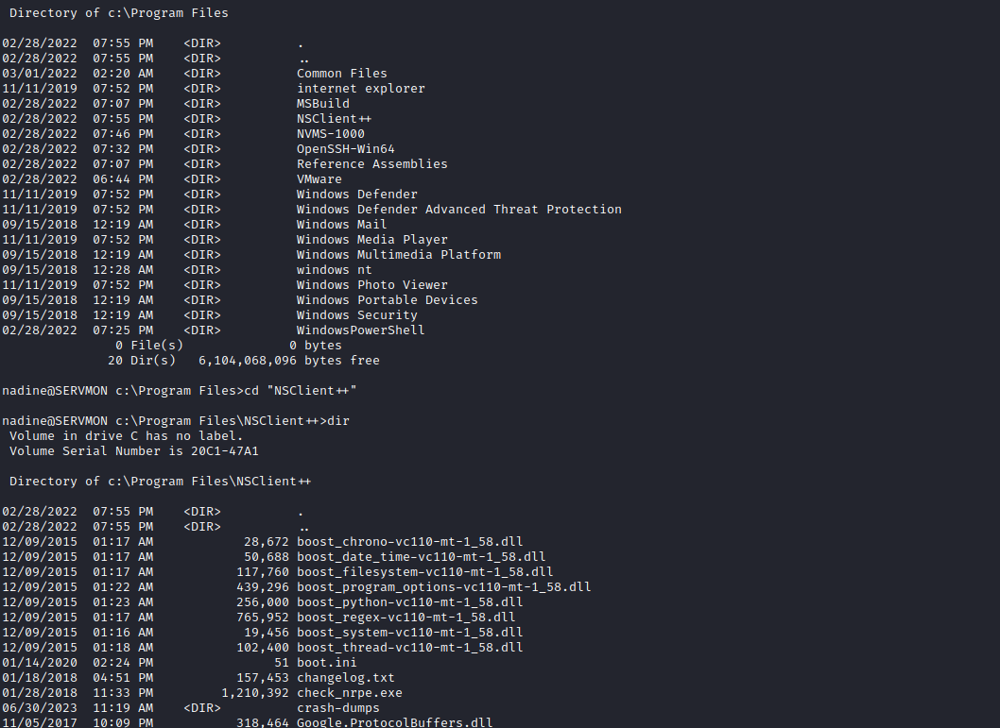

# Servmon
## Enumeration
- `nmap`
```
└─$ nmap -sC -sV -Pn 10.10.10.184
Starting Nmap 7.93 ( https://nmap.org ) at 2023-06-30 18:47 BST
Nmap scan report for 10.10.10.184 (10.10.10.184)
Host is up (0.14s latency).
Not shown: 991 closed tcp ports (conn-refused)
PORT     STATE SERVICE       VERSION
21/tcp   open  ftp           Microsoft ftpd
| ftp-syst:
|_  SYST: Windows_NT
| ftp-anon: Anonymous FTP login allowed (FTP code 230)
|_02-28-22  07:35PM       <DIR>          Users
22/tcp   open  ssh           OpenSSH for_Windows_8.0 (protocol 2.0)
| ssh-hostkey:
|   3072 c71af681ca1778d027dbcd462a092b54 (RSA)
|   256 3e63ef3b6e3e4a90f34c02e940672e42 (ECDSA)
|_  256 5a48c8cd39782129effbae821d03adaf (ED25519)
80/tcp   open  http
| fingerprint-strings:
|   GetRequest, HTTPOptions, RTSPRequest:
|     HTTP/1.1 200 OK
|     Content-type: text/html
|     Content-Length: 340
|     Connection: close
|     AuthInfo:
|     <!DOCTYPE html PUBLIC "-//W3C//DTD XHTML 1.0 Transitional//EN" "http://www.w3.org/TR/xhtml1/DTD/xhtml1-transitional.dtd">
|     <html xmlns="http://www.w3.org/1999/xhtml">
|     <head>
|     <title></title>
|     <script type="text/javascript">
|     window.location.href = "Pages/login.htm";
|     </script>
|     </head>
|     <body>
|     </body>
|     </html>
|   X11Probe:
|     HTTP/1.1 408 Request Timeout
|     Content-type: text/html
|     Content-Length: 0
|     Connection: close
|_    AuthInfo:
|_http-title: Site doesn't have a title (text/html).
135/tcp  open  msrpc         Microsoft Windows RPC
139/tcp  open  netbios-ssn   Microsoft Windows netbios-ssn
445/tcp  open  microsoft-ds?
5666/tcp open  tcpwrapped
6699/tcp open  napster?
8443/tcp open  ssl/https-alt
|_ssl-date: TLS randomness does not represent time
| ssl-cert: Subject: commonName=localhost
| Not valid before: 2020-01-14T13:24:20
|_Not valid after:  2021-01-13T13:24:20
| fingerprint-strings:
|   FourOhFourRequest, HTTPOptions, RTSPRequest, SIPOptions:
|     HTTP/1.1 404
|     Content-Length: 18
|     Document not found
|   GetRequest:
|     HTTP/1.1 302
|     Content-Length: 0
|     Location: /index.html
|     workers
|_    jobs
| http-title: NSClient++
|_Requested resource was /index.html
2 services unrecognized despite returning data. If you know the service/version, please submit the following fingerprints at https://nmap.org/cgi-bin/submit.cgi?new-service :
==============NEXT SERVICE FINGERPRINT (SUBMIT INDIVIDUALLY)==============
SF-Port80-TCP:V=7.93%I=7%D=6/30%Time=649F154D%P=x86_64-pc-linux-gnu%r(GetR
SF:equest,1B4,"HTTP/1\.1\x20200\x20OK\r\nContent-type:\x20text/html\r\nCon
SF:tent-Length:\x20340\r\nConnection:\x20close\r\nAuthInfo:\x20\r\n\r\n\xe
SF:f\xbb\xbf<!DOCTYPE\x20html\x20PUBLIC\x20\"-//W3C//DTD\x20XHTML\x201\.0\
SF:x20Transitional//EN\"\x20\"http://www\.w3\.org/TR/xhtml1/DTD/xhtml1-tra
SF:nsitional\.dtd\">\r\n\r\n<html\x20xmlns=\"http://www\.w3\.org/1999/xhtm
SF:l\">\r\n<head>\r\n\x20\x20\x20\x20<title></title>\r\n\x20\x20\x20\x20<s
SF:cript\x20type=\"text/javascript\">\r\n\x20\x20\x20\x20\x20\x20\x20\x20w
SF:indow\.location\.href\x20=\x20\"Pages/login\.htm\";\r\n\x20\x20\x20\x20
SF:</script>\r\n</head>\r\n<body>\r\n</body>\r\n</html>\r\n")%r(HTTPOption
SF:s,1B4,"HTTP/1\.1\x20200\x20OK\r\nContent-type:\x20text/html\r\nContent-
SF:Length:\x20340\r\nConnection:\x20close\r\nAuthInfo:\x20\r\n\r\n\xef\xbb
SF:\xbf<!DOCTYPE\x20html\x20PUBLIC\x20\"-//W3C//DTD\x20XHTML\x201\.0\x20Tr
SF:ansitional//EN\"\x20\"http://www\.w3\.org/TR/xhtml1/DTD/xhtml1-transiti
SF:onal\.dtd\">\r\n\r\n<html\x20xmlns=\"http://www\.w3\.org/1999/xhtml\">\
SF:r\n<head>\r\n\x20\x20\x20\x20<title></title>\r\n\x20\x20\x20\x20<script
SF:\x20type=\"text/javascript\">\r\n\x20\x20\x20\x20\x20\x20\x20\x20window
SF:\.location\.href\x20=\x20\"Pages/login\.htm\";\r\n\x20\x20\x20\x20</scr
SF:ipt>\r\n</head>\r\n<body>\r\n</body>\r\n</html>\r\n")%r(RTSPRequest,1B4
SF:,"HTTP/1\.1\x20200\x20OK\r\nContent-type:\x20text/html\r\nContent-Lengt
SF:h:\x20340\r\nConnection:\x20close\r\nAuthInfo:\x20\r\n\r\n\xef\xbb\xbf<
SF:!DOCTYPE\x20html\x20PUBLIC\x20\"-//W3C//DTD\x20XHTML\x201\.0\x20Transit
SF:ional//EN\"\x20\"http://www\.w3\.org/TR/xhtml1/DTD/xhtml1-transitional\
SF:.dtd\">\r\n\r\n<html\x20xmlns=\"http://www\.w3\.org/1999/xhtml\">\r\n<h
SF:ead>\r\n\x20\x20\x20\x20<title></title>\r\n\x20\x20\x20\x20<script\x20t
SF:ype=\"text/javascript\">\r\n\x20\x20\x20\x20\x20\x20\x20\x20window\.loc
SF:ation\.href\x20=\x20\"Pages/login\.htm\";\r\n\x20\x20\x20\x20</script>\
SF:r\n</head>\r\n<body>\r\n</body>\r\n</html>\r\n")%r(X11Probe,6B,"HTTP/1\
SF:.1\x20408\x20Request\x20Timeout\r\nContent-type:\x20text/html\r\nConten
SF:t-Length:\x200\r\nConnection:\x20close\r\nAuthInfo:\x20\r\n\r\n");
==============NEXT SERVICE FINGERPRINT (SUBMIT INDIVIDUALLY)==============
SF-Port8443-TCP:V=7.93%T=SSL%I=7%D=6/30%Time=649F1554%P=x86_64-pc-linux-gn
SF:u%r(GetRequest,74,"HTTP/1\.1\x20302\r\nContent-Length:\x200\r\nLocation
SF::\x20/index\.html\r\n\r\n\0\0\0\0\0\0\0\0\0\0\0\0\0\0\0\0\0\0\0\0\0\0\0
SF:\0\0\0\0\0\0\x12\x02\x18\0\x1aE\n\x07workers\x12\x0b\n\x04jobs\x12\x03\
SF:x18\xcb\x01\x12")%r(HTTPOptions,36,"HTTP/1\.1\x20404\r\nContent-Length:
SF:\x2018\r\n\r\nDocument\x20not\x20found")%r(FourOhFourRequest,36,"HTTP/1
SF:\.1\x20404\r\nContent-Length:\x2018\r\n\r\nDocument\x20not\x20found")%r
SF:(RTSPRequest,36,"HTTP/1\.1\x20404\r\nContent-Length:\x2018\r\n\r\nDocum
SF:ent\x20not\x20found")%r(SIPOptions,36,"HTTP/1\.1\x20404\r\nContent-Leng
SF:th:\x2018\r\n\r\nDocument\x20not\x20found");
Service Info: OS: Windows; CPE: cpe:/o:microsoft:windows

Host script results:
|_clock-skew: -30s
| smb2-security-mode:
|   311:
|_    Message signing enabled but not required
| smb2-time:
|   date: 2023-06-30T17:49:24
|_  start_date: N/A

Service detection performed. Please report any incorrect results at https://nmap.org/submit/ .
Nmap done: 1 IP address (1 host up) scanned in 156.40 seconds
```
- Web servers



- `FTP`





- No results with `SMB`
- `gobuster`
  - Had an error with random strings
  - Found nothing by ignoring those cases
```
└─$ gobuster dir -u http://10.10.10.184 -w /usr/share/wordlists/seclists/Discovery/Web-Content/directory-list-2.3-medium.txt -t 40
===============================================================
Gobuster v3.5
by OJ Reeves (@TheColonial) & Christian Mehlmauer (@firefart)
===============================================================
[+] Url:                     http://10.10.10.184
[+] Method:                  GET
[+] Threads:                 40
[+] Wordlist:                /usr/share/wordlists/seclists/Discovery/Web-Content/directory-list-2.3-medium.txt
[+] Negative Status codes:   404
[+] User Agent:              gobuster/3.5
[+] Timeout:                 10s
===============================================================
2023/06/30 19:18:38 Starting gobuster in directory enumeration mode
===============================================================

Error: the server returns a status code that matches the provided options for non existing urls. http://10.10.10.184/a11ab52c-c6be-4d66-bee8-f749550de92e => 200 (Length: 118). To continue please exclude the status code or the length
```
```
└─$ gobuster dir -u http://10.10.10.184 -w /usr/share/wordlists/seclists/Discovery/Web-Content/directory-list-2.3-medium.txt -t 40 --exclude-length 118 --no-error
===============================================================
Gobuster v3.5
by OJ Reeves (@TheColonial) & Christian Mehlmauer (@firefart)
===============================================================
[+] Url:                     http://10.10.10.184
[+] Method:                  GET
[+] Threads:                 40
[+] Wordlist:                /usr/share/wordlists/seclists/Discovery/Web-Content/directory-list-2.3-medium.txt
[+] Negative Status codes:   404
[+] Exclude Length:          118
[+] User Agent:              gobuster/3.5
[+] Timeout:                 10s
===============================================================
2023/06/30 19:19:46 Starting gobuster in directory enumeration mode
===============================================================
```
## Foothold/User
- `Searchsploit`




- We saw a note which stated that there is a passwords file at `c:\users\nathan\desktop`
  - Let's leverage the directory traversal exploit to retrieve that file's content



- We know that we have 3 users: `Administrator`, `Nathan`, `Nadine`
  - Let's check if any of the found passwords for any of these users
  - `crackmapexec smb 10.10.10.184 -u user.list -p passwd.list`
  - Match `nadine:L1k3B1gBut7s@W0rk`



- Connect via ssh


## Root
- `Searchsploit`
  - When I was enumerating port `8443` there was an exploit for privesc



- Let's check `NSClient++`



- We found password and allowed hosts in `nsclient.ini`


- 