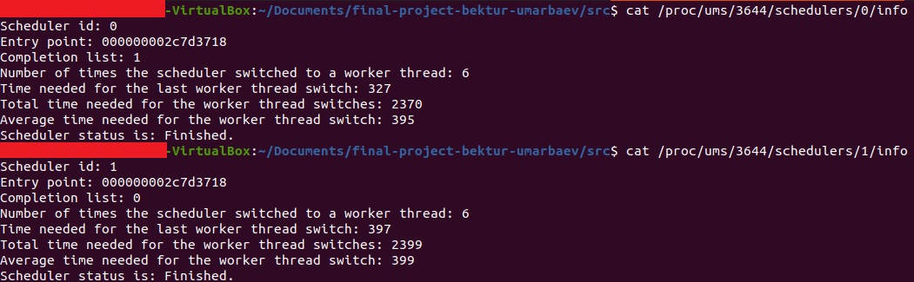
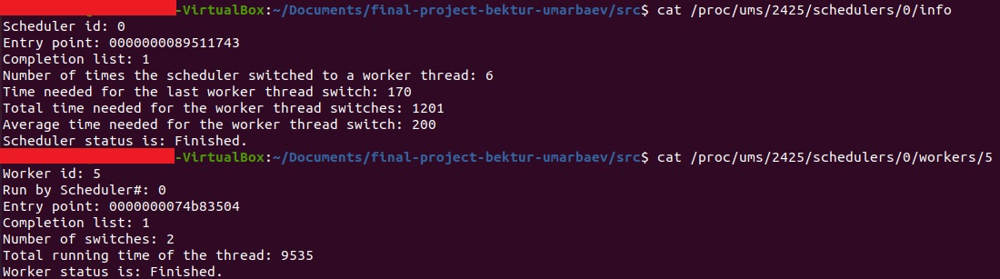

# [User-mode Scheduling (UMS)](https://github.com/umarbaevB/AOSV-UMS-project/)
## 1. Introduction
- User-mode scheduling (UMS) is a lightweight mechanism that applications can use to schedule their own threads [1](https://docs.microsoft.com/en-us/windows/win32/procthread/user-mode-scheduling). 
  - It allows the programmer of a C user space application to schedule threads without involving the kernel scheduler. 
  - The overview of the mechanism is described by Dave Probert in [4](https://www.youtube.com/watch?v=PYlP8MXRCZc) or can be found by searching for his interview on Microsoft Learn [5](https://docs.microsoft.com/en-us/learn/), since his interview from Channel 9 was moved there [6](https://docs.microsoft.com/en-us/teamblog/channel9joinedmicrosoftlearn). 
- The project was implemented based on specifications described in [2](https://gpm.name/teaching/2021-aosv/news/2021/04/09/final-project-track/). 
## 2. Design 
- The design was inspired by Dave Probert's interview [4](https://www.youtube.com/watch?v=PYlP8MXRCZc) and the patent for UMS on Windows [7](https://patents.google.com/patent/US20100083275A1/en):

- In general:
  -  UMS module is responsible for management of UMS mechanism. 
     -  It receives requests from processes, stores respective data structures (process, scheduler, worker thread descriptors and completion lists) and performs requested actions. 
  -  The process which intents to use UMS has to register itself in UMS module, create required completion lists, create and assign worker threads to completion lists and then create schedulers associated with completion lists.
  -  Schedulers are in charge of determining which worker thread has to be scheduled. 
     -  Multiple schedulers can share completion lists. 
     -  Scheduler hosts the execution of the worker threads.

## 3. Implementation
- The project consists of `UMS kernel module` and `UMS library`.
- The general execution flow is depicted as follow:

- The execution flow was inspired by an example provided in [3](https://lastsector.wordpress.com/2013/06/08/curious-case-of-user-mode-scheduling/). 
- Execution flow in steps:
  1. Process calls `ums_enter()` to request UMS module to manage the current process.
  2. Process calls `ums_create_completion_list()` to request creation of the completion list. 
       - This step is continued until all required completion lists are created.  
  3. Process calls `ums_create_worker_thread()` to request creation of the worker thread. 
       - This step is continued until all required worker threads are created.  
  4. Process calls `ums_create_scheduler()` to request creation of the pthread [8](https://man7.org/linux/man-pages/man7/pthreads.7.html) that will become the scheduler. 
       - This step is continued until all required scheduler are created.  
  5. After pthread is created, it calls `ums_enter_scheduling_mode()` to convert itself to a scheduler. 
       - Subsequently, scheduler jumps to an entrypoint, a function that is executed to determine the next worker thread for scheduling (it is called when a the scheduler is started the first time, and when a worker thread yeilds). 
       - In this step, scheduler usually calls `ums_dequeue_completion_list_items()` to obtain a list available threads to run. 
  6. After finding the worker thread for scheduling, scheduler calls `ums_execute_worker()`, which consists of 2 parts to perform a full context switch:
       - Saving the current context of the scheduler
       - Loading the context switch of the worker thread
  7. All these steps are continued until all the work is completed. 
       - Then the scheduler calls `ums_exit_scheduling_mode()` to convert itself back to pthread and finishes the work via `pthread_exit()`
  8. The main thread of the process waits for all pthreads (schedulers) to complete their work and then calls `ums_exit()` to notify the UMS module about the completion.

### 3.1. Module
- The module consists of:
  - `ums_dev.h` and `ums_dev.c` - responsible for `UMS miscdevice` and its' implementation, also includes other headers required by `UMS device` to function properly.
  - `ums_api.h` and `ums_api.c` - contain essential functions, data structures and proc filesystem of the `UMS kernel module` and their implementations. 
  - `const.h` - is a set of data structures and other constant variables used by `UMS kernel module` to handle requests from processes.
### 3.2. Library
- The library consists of:
  - `ums_lib.h` and `ums_lib.c` - contain essential `UMS library functions` and their implementations. 
    - The header has to be included by the user in order to use the `UMS library`. 
    - The header is dependent on `const.h` and `list.h` headers described below.
  - `const.h` - is a set of data structures and other constant variables used by `UMS library` to make ioctl calls. 
    -  It is somewhat similar to `const.h` from the UMS module, but it was made as a separate file to make library independent from the module sources. 
  - `list.h` - is the implementation of the Linux kernel linked list and hash list data structures for user space and was downloaded from [9](https://www.mcs.anl.gov/~kazutomo/list/list.h).

## Results
- The project was run on `Ubuntu 20.04.2 LTS` by using 2-core virtual machine via `VirtualBox`. 
  - The version of the kernel was `Linux 5.8.0-55-generic`. 
- Example with 2 schedulers with separate completion lists depicted below:

- The proc filesystem:

- The `UMS` module information log:

- As a benchmark statistics, the switching time for schedulers was on average within `250-360` nanoseconds. 
  - Note that, there were situations with schedulers that share the same completion list, where only one scheduler completed all the work leaving other schedulers without any work. 
  - It was due to the fact that the schedulers are viewed as a simple threads by the linux system. 
  - Thus it was system scheduler's decision to run only one scheduler thread, which happened to finish all the work before other scheduler threads were woken up.

## References
- [1] https://docs.microsoft.com/en-us/windows/win32/procthread/user-mode-scheduling
- [2] https://gpm.name/teaching/2021-aosv/news/2021/04/09/final-project-track/
- [3] https://lastsector.wordpress.com/2013/06/08/curious-case-of-user-mode-scheduling/
- [4] https://www.youtube.com/watch?v=PYlP8MXRCZc
- [5] https://docs.microsoft.com/en-us/learn/
- [6] https://docs.microsoft.com/en-us/teamblog/channel9joinedmicrosoftlearn
- [7] https://patents.google.com/patent/US20100083275A1/en
- [8] https://man7.org/linux/man-pages/man7/pthreads.7.html
- [9] https://www.mcs.anl.gov/~kazutomo/list/list.h
